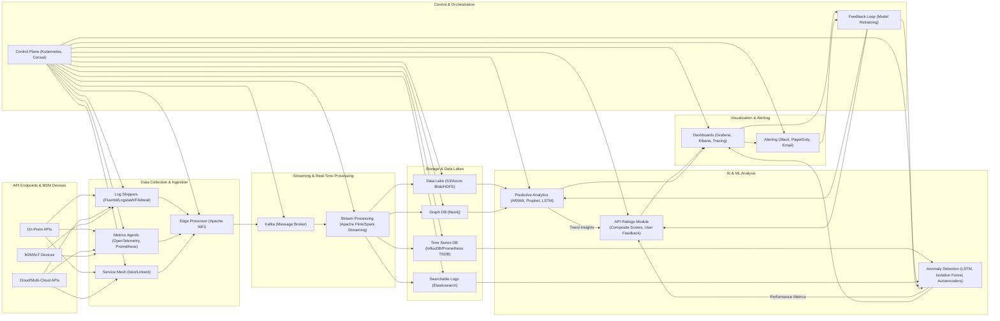

```mermaid
flowchart LR
    %% API Endpoints & M2M Devices Cluster
    subgraph API["API Endpoints & M2M Devices"]
        OnPrem["On-Prem APIs"]
        Cloud["Cloud/Multi-Cloud APIs"]
        M2M["M2M/IoT Devices"]
    end

    %% Data Collection & Ingestion Cluster
    subgraph Collection["Data Collection & Ingestion"]
        LogShipper["Log Shippers (Fluentd/Logstash/Filebeat)"]
        MetricsAgent["Metrics Agents (OpenTelemetry, Prometheus)"]
        ServiceMesh["Service Mesh (Istio/Linkerd)"]
        EdgeProcessor["Edge Processor (Apache NiFi)"]
    end

    %% Streaming & Real-Time Processing Cluster
    subgraph Streaming["Streaming & Real-Time Processing"]
        Kafka["Kafka (Message Broker)"]
        StreamProc["Stream Processing (Apache Flink/Spark Streaming)"]
    end

    %% Storage & Data Lakes Cluster
    subgraph Storage["Storage & Data Lakes"]
        DataLake["Data Lake (S3/Azure Blob/HDFS)"]
        TSDB["Time Series DB (InfluxDB/Prometheus TSDB)"]
        SearchDB["Searchable Logs (Elasticsearch)"]
        GraphDB["Graph DB (Neo4j)"]
    end

    %% AI & ML Analysis Cluster
    subgraph AI["AI & ML Analysis"]
        AnomalyDetection["Anomaly Detection (LSTM, Isolation Forest, Autoencoders)"]
        Forecasting["Predictive Analytics (ARIMA, Prophet, LSTM)"]
        APIRatings["API Ratings Module\n(Composite Scores, User Feedback)"]
    end

    %% Visualization & Alerting Cluster
    subgraph Visualization["Visualization & Alerting"]
        Dashboards["Dashboards (Grafana, Kibana, Tracing)"]
        Alerting["Alerting (Slack, PagerDuty, Email)"]
    end

    %% Control & Orchestration Cluster
    subgraph Control["Control & Orchestration"]
        ControlPlane["Control Plane (Kubernetes, Consul)"]
        FeedbackLoop["Feedback Loop (Model Retraining)"]
    end

    %% Connections from API Endpoints to Data Collection
    OnPrem --> LogShipper
    Cloud --> LogShipper
    M2M --> LogShipper

    OnPrem --> MetricsAgent
    Cloud --> MetricsAgent
    M2M --> MetricsAgent

    OnPrem --> ServiceMesh
    Cloud --> ServiceMesh

    %% Data Collection to Edge Processor
    LogShipper --> EdgeProcessor
    MetricsAgent --> EdgeProcessor
    ServiceMesh --> EdgeProcessor

    %% Edge Processor to Streaming Layer
    EdgeProcessor --> Kafka

    %% Streaming to Real-Time Processing
    Kafka --> StreamProc

    %% Stream Processing to Storage
    StreamProc --> DataLake
    StreamProc --> TSDB
    StreamProc --> SearchDB
    StreamProc --> GraphDB

    %% Storage to AI & ML Analysis
    TSDB --> AnomalyDetection
    SearchDB --> AnomalyDetection
    DataLake --> Forecasting
    GraphDB --> Forecasting

    %% AI Modules to API Ratings Module
    AnomalyDetection -- "Performance Metrics" --> APIRatings
    Forecasting -- "Trend Insights" --> APIRatings

    %% AI Modules to Visualization & Alerting
    APIRatings --> Dashboards
    AnomalyDetection --> Dashboards
    Forecasting --> Dashboards
    Dashboards --> Alerting

    %% Feedback Loop for Continuous Improvement
    Dashboards --> FeedbackLoop
    Alerting --> FeedbackLoop
    FeedbackLoop --> AnomalyDetection
    FeedbackLoop --> Forecasting
    FeedbackLoop --> APIRatings

    %% Control Plane Orchestration across all components
    ControlPlane --> LogShipper
    ControlPlane --> MetricsAgent
    ControlPlane --> ServiceMesh
    ControlPlane --> EdgeProcessor
    ControlPlane --> Kafka
    ControlPlane --> StreamProc
    ControlPlane --> DataLake
    ControlPlane --> TSDB
    ControlPlane --> SearchDB
    ControlPlane --> GraphDB
    ControlPlane --> AnomalyDetection
    ControlPlane --> Forecasting
    ControlPlane --> APIRatings
    ControlPlane --> Dashboards
    ControlPlane --> Alerting

```