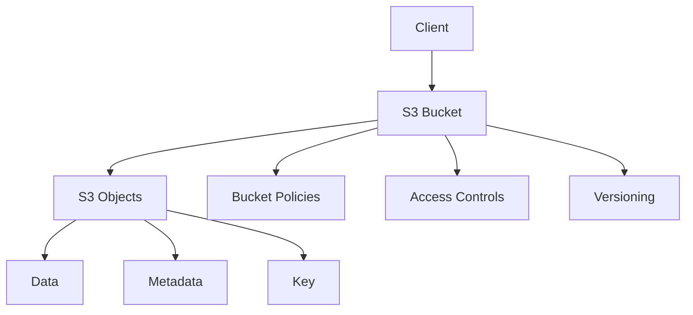
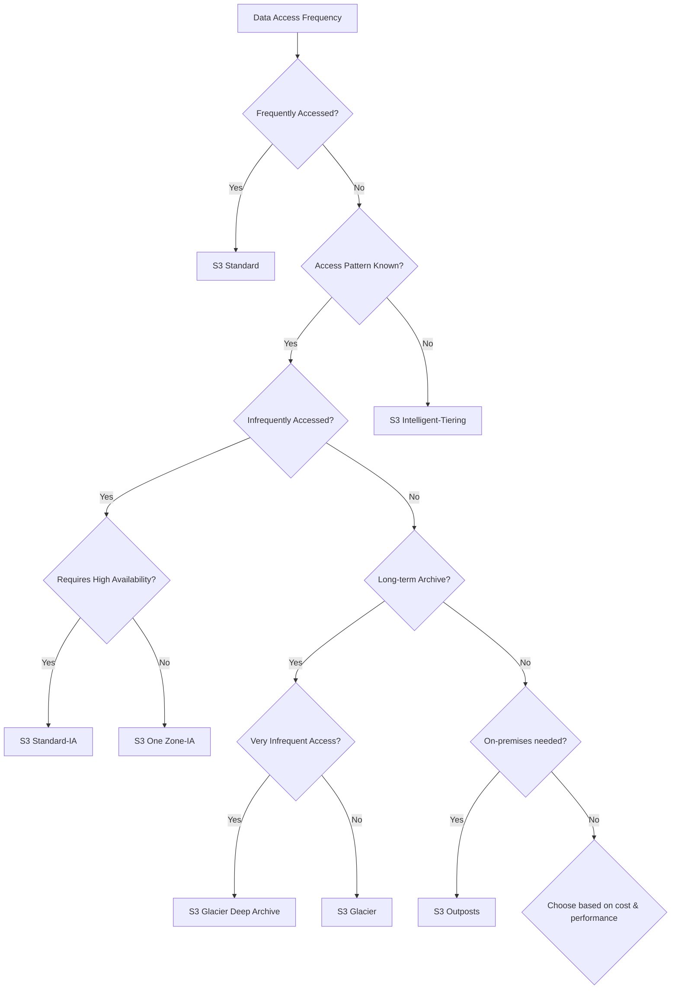
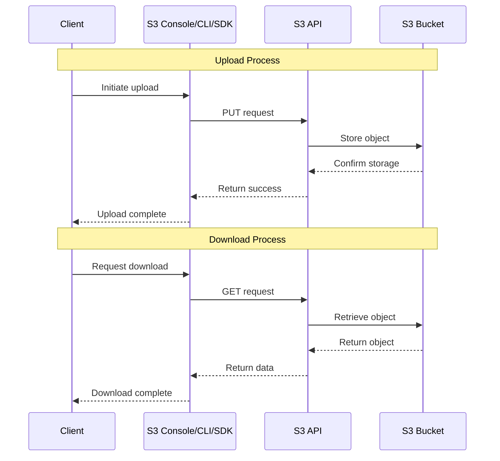
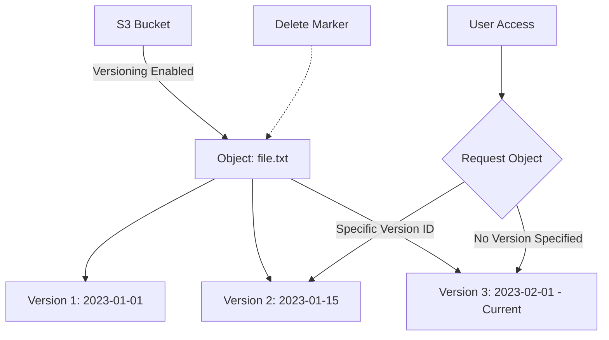
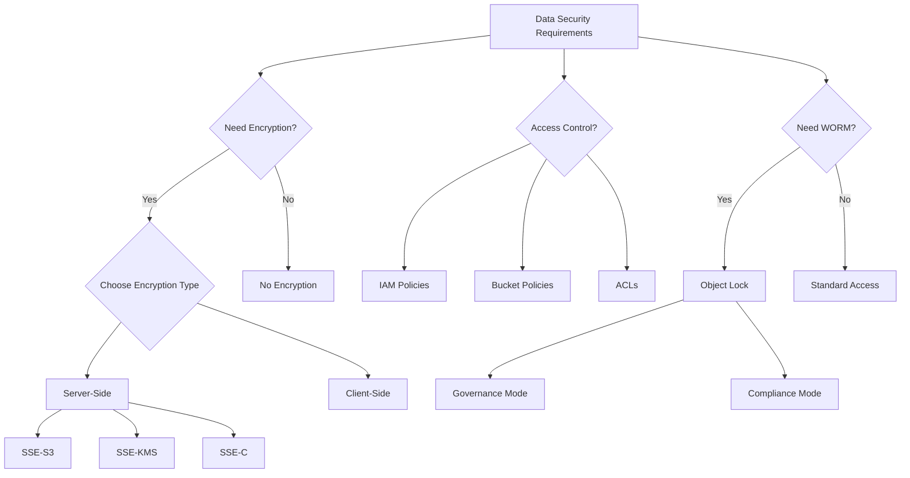
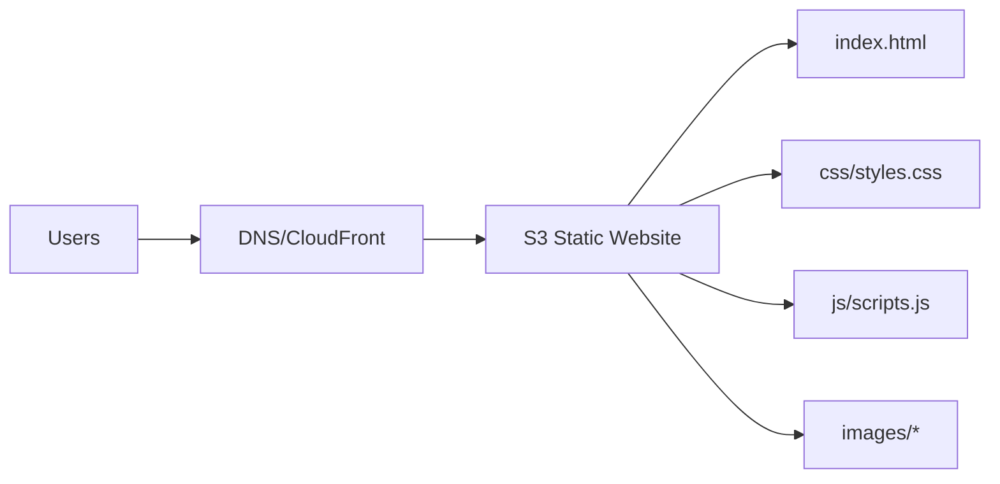
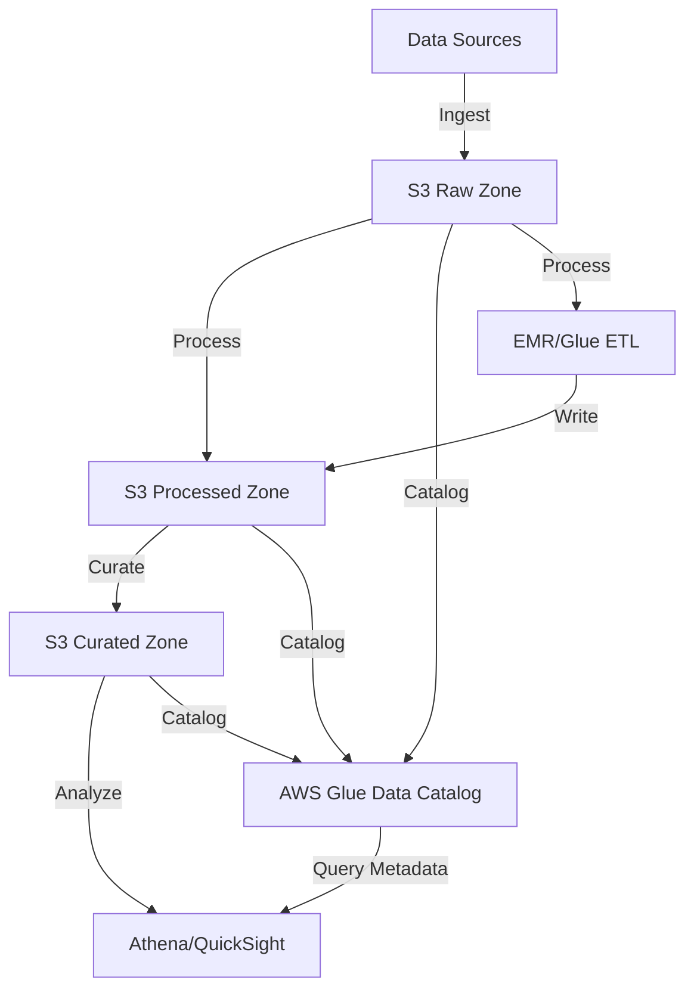
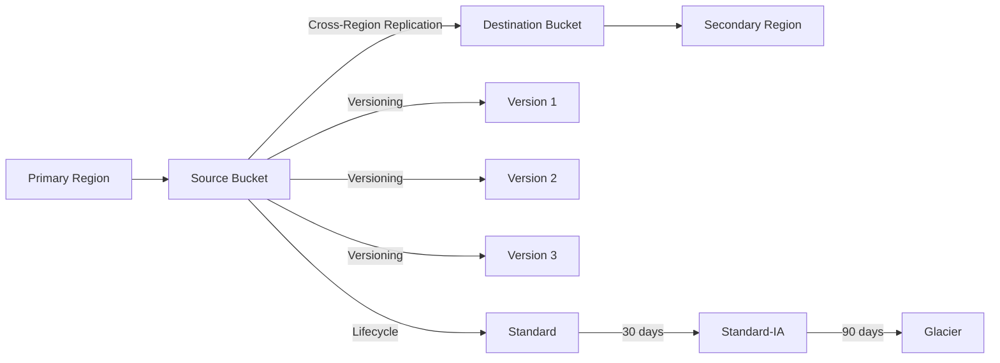
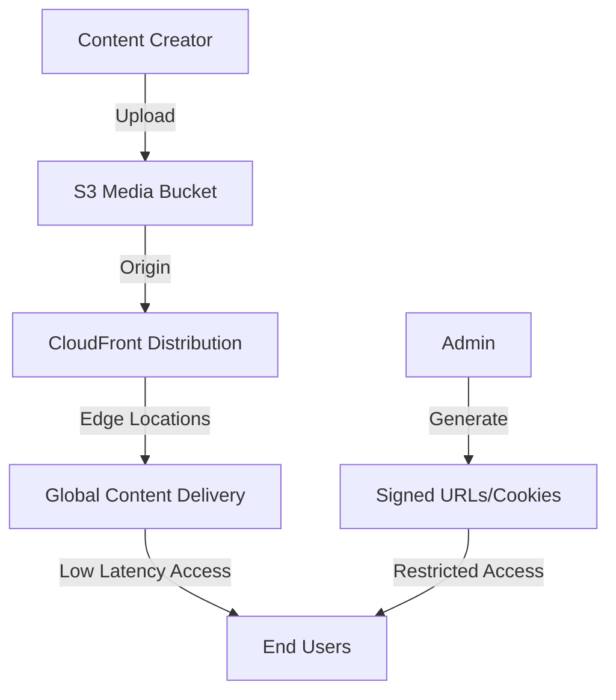
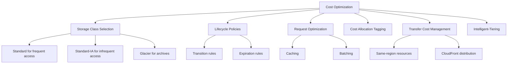

# Amazon S3: Simple Storage Service - Comprehensive Guide

## Table of Contents

1. [Introduction to Amazon S3](#introduction-to-amazon-s3)
2. [Types of S3 Storage Classes](#types-of-s3-storage-classes)
3. [Getting Started with S3](#getting-started-with-s3)
4. [Uploading and Retrieving Files](#uploading-and-retrieving-files)
5. [S3 Bucket Configuration](#s3-bucket-configuration)
6. [Storage Management](#storage-management)
7. [Encryption and Security](#encryption-and-security)
8. [Practical Use Cases](#practical-use-cases)
9. [Best Practices](#best-practices)
10. [Conclusion](#conclusion)

## Introduction to Amazon S3

Amazon Simple Storage Service (S3) is an object storage service offering industry-leading scalability, data availability, security, and performance. It allows you to store and retrieve any amount of data from anywhere on the web.

Key features of Amazon S3:

- **Scalability**: Store unlimited objects in a bucket
- **Durability**: 99.999999999% (11 9's) durability for objects
- **Availability**: 99.99% availability
- **Security**: Various encryption options and access control mechanisms
- **Performance**: Low-latency access to your data
- **Cost-effective**: Multiple storage classes for different use cases



## Types of S3 Storage Classes

Amazon S3 offers a range of storage classes designed for different use cases. Each storage class has different pricing, durability, availability, and retrieval times.

### 1. S3 Standard

- **Description**: Default storage class designed for frequently accessed data
- **Use Case**: Websites, content distribution, mobile applications, gaming
- **Durability**: 99.999999999% (11 9's)
- **Availability**: 99.99%
- **Retrieval Time**: Milliseconds
- **Minimum storage duration**: None

### 2. S3 Intelligent-Tiering

- **Description**: Automatically moves objects between tiers based on access patterns
- **Use Case**: Long-lived data with unknown or changing access patterns
- **Durability**: 99.999999999% (11 9's)
- **Availability**: 99.9%
- **Retrieval Time**: Milliseconds
- **Minimum storage duration**: 30 days

### 3. S3 Standard-IA (Infrequent Access)

- **Description**: For infrequently accessed data but requires rapid access when needed
- **Use Case**: Backups, disaster recovery
- **Durability**: 99.999999999% (11 9's)
- **Availability**: 99.9%
- **Retrieval Time**: Milliseconds
- **Minimum storage duration**: 30 days

### 4. S3 One Zone-IA

- **Description**: Stores data in a single AZ, costs 20% less than Standard-IA
- **Use Case**: Secondary backups, easily reproducible data
- **Durability**: 99.999999999% (11 9's)
- **Availability**: 99.5%
- **Retrieval Time**: Milliseconds
- **Minimum storage duration**: 30 days

### 5. S3 Glacier

- **Description**: Low-cost storage for data archiving, retrieval times from minutes to hours
- **Use Case**: Archives with retrieval times of minutes to hours
- **Durability**: 99.999999999% (11 9's)
- **Availability**: 99.99%
- **Retrieval Time**: Minutes to hours
- **Minimum storage duration**: 90 days

### 6. S3 Glacier Deep Archive

- **Description**: Lowest-cost storage class for long-term archiving
- **Use Case**: Long-term data retention and digital preservation
- **Durability**: 99.999999999% (11 9's)
- **Availability**: 99.99%
- **Retrieval Time**: Within 12 hours
- **Minimum storage duration**: 180 days

### 7. S3 Outposts

- **Description**: S3 storage on AWS Outposts on-premises
- **Use Case**: Local data processing with S3 APIs
- **Durability**: Depend on your on-premises configuration
- **Availability**: Depend on your on-premises configuration
- **Retrieval Time**: Milliseconds



## Getting Started with S3

### Prerequisites

- An AWS account
- AWS CLI installed and configured (optional for command-line operations)
- IAM permissions to create and manage S3 resources

### Step 1: Create an S3 Bucket

1. **Sign in** to the AWS Management Console
2. Navigate to the **S3 service**
3. Click **Create bucket**
4. Enter a **globally unique bucket name**
5. Select the **AWS Region** where you want your bucket to reside
6. Configure **bucket settings**:
   - Block all public access (recommended for security)
   - Bucket versioning (enable to keep multiple versions of objects)
   - Default encryption (choose from server-side encryption options)
7. Click **Create bucket**

### Step 2: Configure Bucket Properties

After creating your bucket, you can configure various properties:

1. Navigate to your bucket and select the **Properties** tab
2. Configure:
   - **Static website hosting** (if applicable)
   - **Default encryption**
   - **Object Lock** settings
   - **Object ownership**
   - **Transfer acceleration**

### Step 3: Set Bucket Permissions

1. Navigate to your bucket and select the **Permissions** tab
2. Configure:
   - **Block Public Access** settings
   - **Bucket Policy** (JSON document defining access permissions)
   - **Access Control Lists (ACLs)**
   - **Cross-Origin Resource Sharing (CORS)**

## Uploading and Retrieving Files

### Uploading Files to S3

#### Using AWS Management Console

1. Navigate to your bucket in the S3 console
2. Click **Upload**
3. Select files or drag and drop files/folders
4. Configure upload settings:
   - Storage class
   - Encryption settings
   - Metadata
   - Permissions
5. Click **Upload**

#### Using AWS CLI

```bash
# Basic upload command
aws s3 cp myfile.txt s3://mybucket/

# Upload with specific storage class
aws s3 cp largebackup.zip s3://mybucket/ --storage-class STANDARD_IA

# Upload an entire directory recursively
aws s3 cp myfolder/ s3://mybucket/myfolder/ --recursive

# Upload with server-side encryption
aws s3 cp secret.pdf s3://mybucket/ --sse AES256
```

#### Using AWS SDKs

**Python Example (Boto3):**

```python
import boto3

# Create an S3 client
s3_client = boto3.client('s3')

# Upload file with default settings
s3_client.upload_file('myfile.txt', 'mybucket', 'myfile.txt')

# Upload with specific settings
s3_client.upload_file(
    'mydata.csv', 
    'mybucket', 
    'data/mydata.csv',
    ExtraArgs={
        'StorageClass': 'STANDARD_IA',
        'ServerSideEncryption': 'AES256',
        'Metadata': {'project': 'alpha', 'createdby': 'user123'}
    }
)
```

### Retrieving Files from S3

#### Using AWS Management Console

1. Navigate to your bucket in the S3 console
2. Browse to the file you want to download
3. Select the file and click **Download** or **Open**

#### Using AWS CLI

```bash
# Download a file
aws s3 cp s3://mybucket/myfile.txt myfile.txt

# Download an entire directory
aws s3 cp s3://mybucket/myfolder/ ./downloaded-folder/ --recursive

# Download and stream a file
aws s3 cp s3://mybucket/large-video.mp4 - | vlc -
```

#### Using AWS SDKs

**Python Example (Boto3):**

```python
import boto3

# Create an S3 client
s3_client = boto3.client('s3')

# Download file
s3_client.download_file('mybucket', 'myfile.txt', 'downloaded-file.txt')

# Generate a presigned URL (temporary access)
presigned_url = s3_client.generate_presigned_url(
    'get_object',
    Params={'Bucket': 'mybucket', 'Key': 'private-file.pdf'},
    ExpiresIn=3600  # URL expires in 1 hour
)
print(f"Access your file temporarily at: {presigned_url}")
```



## S3 Bucket Configuration

### Lifecycle Configuration

S3 Lifecycle rules allow you to automatically transition objects between storage classes or expire them.

#### Setting up Lifecycle Rules (Console)

1. Navigate to your bucket and select the **Management** tab
2. Click on **Lifecycle** and select **Create lifecycle rule**
3. Enter a **rule name** and define the **scope** (which objects the rule applies to)
4. Configure **Transitions** to move objects between storage classes:
   - For example, move objects to S3 Standard-IA after 30 days
   - Move to Glacier after 90 days
   - Move to Glacier Deep Archive after 180 days
5. Configure **Expiration** to delete objects after a certain period
6. Click **Create rule**

#### Sample Lifecycle Configuration (JSON)

```json
{
  "Rules": [
    {
      "ID": "Move to IA and Glacier",
      "Filter": {
        "Prefix": "documents/"
      },
      "Status": "Enabled",
      "Transitions": [
        {
          "Days": 30,
          "StorageClass": "STANDARD_IA"
        },
        {
          "Days": 90,
          "StorageClass": "GLACIER"
        }
      ],
      "Expiration": {
        "Days": 730
      }
    }
  ]
}
```

### Bucket Versioning

Versioning keeps multiple variants of an object in the same bucket, allowing you to recover objects from accidental deletion or overwrite.

#### Enabling Versioning (Console)

1. Navigate to your bucket and select the **Properties** tab
2. Find the **Versioning** section and click **Edit**
3. Select **Enable** and save changes

#### Managing Versions

1. When browsing objects, enable **Show versions** to see all versions
2. You can download, delete, or restore specific versions
3. To permanently delete an object, you must delete all versions



## Storage Management

### S3 Storage Lens

S3 Storage Lens provides organization-wide visibility into object storage usage and activity trends.

#### Setting up Storage Lens (Console)

1. Navigate to S3 console and select **Storage Lens**
2. Click **Create dashboard**
3. Configure dashboard scope, metrics selection, and optional advanced metrics
4. Set up optional metrics export to S3
5. Configure optional recommendations

### S3 Inventory

S3 Inventory provides scheduled reports about your objects and their metadata.

#### Setting up Inventory (Console)

1. Navigate to your bucket and select the **Management** tab
2. Click on **Inventory** and select **Create inventory configuration**
3. Configure inventory settings:
   - Destination bucket
   - Frequency (daily or weekly)
   - Output format (CSV, ORC, or Parquet)
   - Object versions to include
   - Fields to include in the report

### S3 Analytics

S3 Analytics helps you analyze access patterns to decide when to transition objects to the appropriate storage class.

#### Setting up Analytics (Console)

1. Navigate to your bucket and select the **Metrics** tab
2. Click on **Analytics** and select **Create analytics configuration**
3. Configure the prefix or tags to filter which objects to analyze
4. Set up an optional export destination
5. Analytics will provide recommendations after approximately 30 days of data collection

## Encryption and Security

### Types of Encryption

S3 offers several encryption options to protect your data:

1. **Server-Side Encryption (SSE)**:
   - **SSE-S3**: AWS managed keys (AES-256)
   - **SSE-KMS**: AWS Key Management Service keys
   - **SSE-C**: Customer-provided keys

2. **Client-Side Encryption**:
   - Encrypt data before uploading to S3

### Setting Up Server-Side Encryption

#### Default Encryption (Console)

1. Navigate to your bucket and select the **Properties** tab
2. Find the **Default encryption** section and click **Edit**
3. Choose from SSE-S3 or SSE-KMS
4. If using KMS, select a KMS key (default or custom)
5. Save changes


#### Encryption with AWS CLI

```bash
# Upload with server-side encryption (SSE-S3)
aws s3 cp myfile.txt s3://mybucket/ --sse AES256

# Upload with server-side encryption (SSE-KMS)
aws s3 cp myfile.txt s3://mybucket/ --sse aws:kms --sse-kms-key-id alias/my-kms-key

# Configure bucket to use default encryption
aws s3api put-bucket-encryption \
    --bucket mybucket \
    --server-side-encryption-configuration '{
      "Rules": [{
        "ApplyServerSideEncryptionByDefault": {
          "SSEAlgorithm": "AES256"
        }
      }]
    }'
```

#### Encryption with AWS SDKs

**Python Example (Boto3):**

```python
import boto3

# Create an S3 client
s3_client = boto3.client('s3')

# Upload with SSE-S3
s3_client.put_object(
    Bucket='mybucket',
    Key='encrypted-file.txt',
    Body=b'Hello, encrypted world!',
    ServerSideEncryption='AES256'
)

# Upload with SSE-KMS
s3_client.put_object(
    Bucket='mybucket',
    Key='kms-encrypted-file.txt',
    Body=b'Hello, KMS encrypted world!',
    ServerSideEncryption='aws:kms',
    SSEKMSKeyId='alias/my-kms-key'
)
```

### Access Control Mechanisms

S3 provides multiple layers of security:

1. **IAM Policies**: Attach to IAM users, groups, or roles to grant permissions
2. **Bucket Policies**: JSON documents attached directly to buckets
3. **Access Control Lists (ACLs)**: Legacy method for controlling access at bucket and object level
4. **Block Public Access**: Settings to prevent public access to buckets and objects
5. **S3 Object Ownership**: Control object ownership and disable ACLs

#### Example Bucket Policy (Restrict to IP Range)

```json
{
  "Version": "2012-10-17",
  "Statement": [
    {
      "Sid": "RestrictToIP",
      "Effect": "Deny",
      "Principal": "*",
      "Action": "s3:*",
      "Resource": [
        "arn:aws:s3:::mybucket",
        "arn:aws:s3:::mybucket/*"
      ],
      "Condition": {
        "NotIpAddress": {
          "aws:SourceIp": "192.0.2.0/24"
        }
      }
    }
  ]
}
```

### S3 Object Lock and Compliance

S3 Object Lock provides WORM (Write Once Read Many) capabilities for regulatory compliance or data protection.

#### Object Lock Modes

1. **Governance Mode**: Users with specific permissions can override retention settings
2. **Compliance Mode**: No one, including the root account, can override retention until expiration

#### Setting up Object Lock (Console)

1. You must enable Object Lock when creating a bucket
2. Navigate to an object, select **Actions** > **Object actions** > **Lock**
3. Choose lock mode (Governance or Compliance) and retention period



## Practical Use Cases

### Use Case 1: Static Website Hosting

S3 can host static websites with HTML, CSS, JavaScript, and media files.

#### Implementation Steps

1. **Create a bucket** with a name matching your domain (e.g., www.example.com)
2. **Upload website files** to the bucket
3. **Enable static website hosting**:
   - Navigate to bucket > Properties > Static website hosting
   - Set index document (e.g., index.html) and error document
4. **Configure public access**:
   - Unblock public access at bucket level
   - Create a bucket policy allowing public read access

```json
{
  "Version": "2012-10-17",
  "Statement": [
    {
      "Sid": "PublicReadGetObject",
      "Effect": "Allow",
      "Principal": "*",
      "Action": "s3:GetObject",
      "Resource": "arn:aws:s3:::www.example.com/*"
    }
  ]
}
```

5. **Set up custom domain (optional)**:
   - Use Route 53 or another DNS provider to create an alias record
   - Configure CloudFront for HTTPS and caching



### Use Case 2: Data Lake for Analytics

S3 is an ideal foundation for a data lake, storing structured and unstructured data for analytics.

#### Implementation Steps

1. **Create a bucket** with appropriate storage class tiers
2. **Design folder structure** for optimal organization:
   ```
   s3://data-lake-bucket/
   ├── raw/
   │   ├── source1/
   │   ├── source2/
   ├── processed/
   ├── curated/
   └── analytics/
   ```
3. **Set up IAM policies** for different user roles (data engineers, analysts, etc.)
4. **Configure lifecycle policies** to transition data between storage classes
5. **Integrate analytics services**:
   - Amazon Athena for SQL queries
   - AWS Glue for ETL jobs
   - Amazon QuickSight for visualization
   - Amazon EMR for processing with Spark/Hadoop



### Use Case 3: Backup and Disaster Recovery

S3 provides durable, secure storage for backups and disaster recovery solutions.

#### Implementation Steps

1. **Create buckets** for backup storage (consider region and replication)
2. **Configure backup process**:
   - Direct backup to S3 using backup software
   - Set up AWS Backup for AWS services
   - Use AWS Storage Gateway for on-premises systems
3. **Implement S3 versioning** to keep multiple backup versions
4. **Set up lifecycle rules** to move older backups to colder storage
5. **Configure Cross-Region Replication** for disaster recovery:
   - Create a destination bucket in a different region
   - Enable replication on the source bucket
   - Define replication rules (what to replicate and to where)

```bash
# Example: Configure cross-region replication with AWS CLI
aws s3api create-bucket \
    --bucket source-backup-bucket \
    --region us-east-1

aws s3api create-bucket \
    --bucket destination-backup-bucket \
    --region us-west-2 \
    --create-bucket-configuration LocationConstraint=us-west-2

# Enable versioning on both buckets
aws s3api put-bucket-versioning \
    --bucket source-backup-bucket \
    --versioning-configuration Status=Enabled

aws s3api put-bucket-versioning \
    --bucket destination-backup-bucket \
    --versioning-configuration Status=Enabled

# Set up replication
aws s3api put-bucket-replication \
    --bucket source-backup-bucket \
    --replication-configuration file://replication.json
```



### Use Case 4: Media and Content Distribution

S3, combined with CloudFront, provides an efficient solution for storing and distributing media content.

#### Implementation Steps

1. **Create a bucket** for media storage
2. **Upload media files** (videos, images, audio)
3. **Set up CloudFront distribution**:
   - Create a new distribution with the S3 bucket as origin
   - Configure caching behaviors and TTL settings
   - Enable Origin Access Identity for security
4. **Implement access controls**:
   - Use signed URLs for time-limited access
   - Use signed cookies for multiple restricted files
5. **Optimize for performance**:
   - Use S3 Transfer Acceleration for uploads
   - Configure appropriate compression settings

```python
# Generate a signed URL for private content
import boto3
from datetime import datetime, timedelta

cloudfront_client = boto3.client('cloudfront')

def create_signed_url(resource_path, expiration_minutes=30):
    expiration_time = datetime.utcnow() + timedelta(minutes=expiration_minutes)
    
    signed_url = cloudfront_client.generate_presigned_url(
        'get_object',
        Params={
            'Bucket': 'media-content-bucket',
            'Key': resource_path
        },
        ExpiresIn=expiration_minutes * 60
    )
    
    return signed_url

# Usage
video_url = create_signed_url('premium/video1.mp4', 60)  # Expires in 60 minutes
```



## Best Practices

### Performance Optimization

1. **Use appropriate naming prefixes**:
   - Avoid sequential prefixes for high-throughput workloads
   - Use random prefixes or hash keys for better partitioning

2. **Configure transfer acceleration**:
   - Enable S3 Transfer Acceleration for faster uploads across long distances
   - Useful for global workflows or user uploads

3. **Use CloudFront for frequent access**:
   - Distribute read-heavy content through CloudFront
   - Reduce latency and S3 request costs

4. **Optimize file sizes**:
   - Use multipart upload for files larger than 100MB
   - Consider compressing files when appropriate

5. **Implement caching strategies**:
   - Set appropriate Cache-Control headers
   - Use versioned object keys for cache invalidation

### Cost Optimization

1. **Choose the right storage class**:
   - Analyze access patterns and use Amazon S3 Analytics
   - Move infrequently accessed data to appropriate storage classes

2. **Implement lifecycle policies**:
   - Automatically transition objects between storage classes
   - Set expiration rules for temporary data

3. **Monitor and optimize request rates**:
   - Reduce GET requests using caching
   - Batch small objects together

4. **Use cost allocation tags**:
   - Tag resources by department, project, or environment
   - Track and allocate S3 costs to appropriate business units
   - Use AWS Cost Explorer to analyze tagged resources

5. **Optimize data transfer costs**:
   - Use CloudFront to reduce S3 data transfer costs
   - Consider using S3 Same-Region Replication when appropriate instead of making duplicate copies
   - Place resources in the same region to avoid cross-region data transfer fees

6. **Use S3 Intelligent-Tiering**:
   - Automatically optimize costs for data with unknown or changing access patterns
   - Let AWS move your data between frequent and infrequent access tiers
   - Only pay a small monitoring and automation fee per object



## Conclusion

Amazon S3 provides a robust, scalable, and secure object storage solution suitable for a wide range of applications. From static website hosting to data lakes, from backup solutions to media delivery networks, S3 offers the flexibility and features to support diverse workloads.

Key takeaways from this guide:

1. **Storage Classes**: Choose the appropriate S3 storage class based on your data access patterns and cost requirements. Use lifecycle policies to automatically transition objects between different storage classes.

2. **Security and Compliance**: S3 offers comprehensive security features including encryption options, access control mechanisms, and compliance capabilities like Object Lock. Always follow the principle of least privilege when configuring access.

3. **Performance Optimization**: Optimize S3 performance by using appropriate naming patterns, multipart uploads, transfer acceleration, and CloudFront for content delivery.

4. **Cost Management**: Implement cost optimization strategies including the right storage class selection, lifecycle policies, request optimization, and cost allocation tags.

5. **Data Management**: Utilize S3 features like versioning, replication, and inventory to effectively manage and protect your data.

As you implement S3 in your workloads, continue to review AWS best practices and new features regularly. Amazon S3 continues to evolve with new storage classes, management features, and integration capabilities that can help you optimize your storage solutions.

Remember that the most efficient S3 implementation is one that balances performance, security, and cost according to your specific application requirements. Regularly analyze your usage patterns with tools like S3 Storage Lens and S3 Analytics to identify optimization opportunities and ensure you're getting the most value from your S3 investment.
