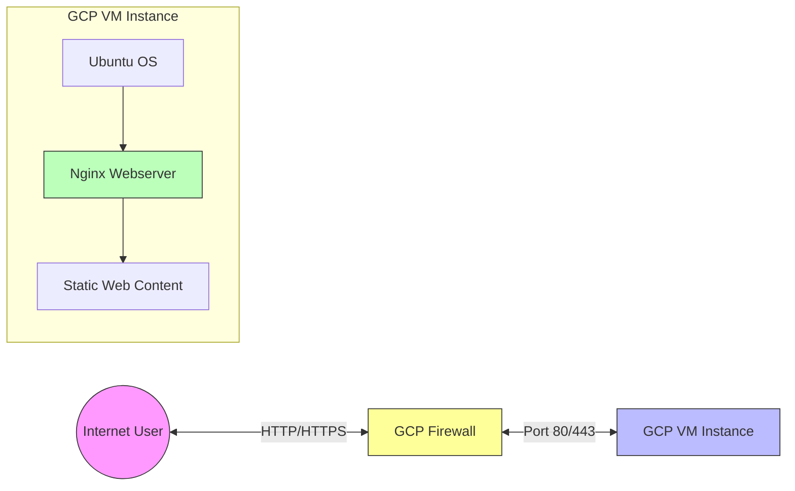

# Lab 10B: Hosting Nginx Webserver on GCP Compute VM Instance

## Student Details
- **Name:** Rohan Prakash Pawar
- **UID:** 2023201020
- **Branch:** EXTC

## Objective
To create and configure a Google Cloud Platform (GCP) Compute Engine virtual machine instance and deploy an Nginx web server.

## Lab Outcomes
1. Create a virtual machine instance on GCP
2. Connect to the VM using SSH
3. Install and configure Nginx web server
4. Verify the web server is running correctly
5. Configure firewall rules to allow HTTP traffic

## System Requirements
- Google Cloud Platform account with billing enabled
- Web browser to access the GCP Console
- Basic knowledge of Linux commands

## Procedure

### 1. Creating a VM Instance on GCP

1. Navigate to the GCP Console then go to Compute Engine from the sidebar
![[Pasted image 20250610012152.png]]

2. Click on the "CREATE INSTANCE" button to create a VM to host the nginx web server
![[Pasted image 20250610012248.png]]

3. Configure the VM instance with appropriate settings including:
   - Name for the VM instance
   - Region and zone
   - Machine configuration (CPU and memory)
   - Boot disk (Ubuntu 20.04 LTS)
![[Pasted image 20250610012340.png]]

4. Configure firewall settings to allow HTTP and HTTPS traffic for web server access
![[Pasted image 20250610012415.png]]

5. After completing the configuration, click "Create" to provision the VM instance

6. The VM instance is now created and ready for use
![[Pasted image 20250610012518.png]]

### 2. Connecting to the VM and Installing Nginx

1. Click on the SSH button to establish a secure shell connection to the VM instance

2. Once connected through SSH, execute the following commands to install Nginx:
   ```bash
   # Update package repository
   sudo apt-get update
   
   # Install Nginx web server
   sudo apt-get install nginx -y
   
   # Check status of Nginx service
   sudo systemctl status nginx
   ```

3. The commands execution and Nginx installation process:
![[Pasted image 20250610013543.png]]

### 3. Verifying the Web Server

1. After successful installation, access the Nginx web server using the VM's external IP address in a web browser

2. The default Nginx welcome page appears, confirming that the web server is installed correctly and accessible publicly:
![[Pasted image 20250610013712.png]]

## Architecture Diagram



## Results and Observations

- Successfully created a VM instance on Google Cloud Platform with appropriate specifications
- Established SSH connection to the VM instance for secure remote management
- Installed Nginx web server using appropriate Linux commands
- Configured firewall rules to allow HTTP/HTTPS traffic to the web server
- Verified the web server's functionality by accessing it through the external IP address
- The Nginx default page loaded successfully, indicating proper installation and network configuration

## Conclusion

In this lab experiment, I successfully deployed an Nginx web server on a Google Cloud Platform Compute Engine VM instance. The lab demonstrated the complete process of cloud infrastructure provisioning, from creating a virtual machine to installing and configuring web server software.

Key learnings from this lab include:
- Understanding GCP's Compute Engine VM instance creation and configuration
- Managing Linux servers through SSH connections
- Installing and configuring web server software (Nginx) on a cloud-based VM
- Working with network and firewall settings to expose web services
- Verifying service functionality through external connectivity tests

This practical experience provides foundational skills for cloud infrastructure management and web service deployment that are essential in modern IT operations and cloud computing environments.

## References

1. Google Cloud Platform Documentation: https://cloud.google.com/compute/docs
2. Nginx Documentation: https://nginx.org/en/docs/
3. YouTube Tutorial: "Nginx Setup on GCP (Google Cloud Platform)" - https://youtu.be/Nv-oFYg1edk
