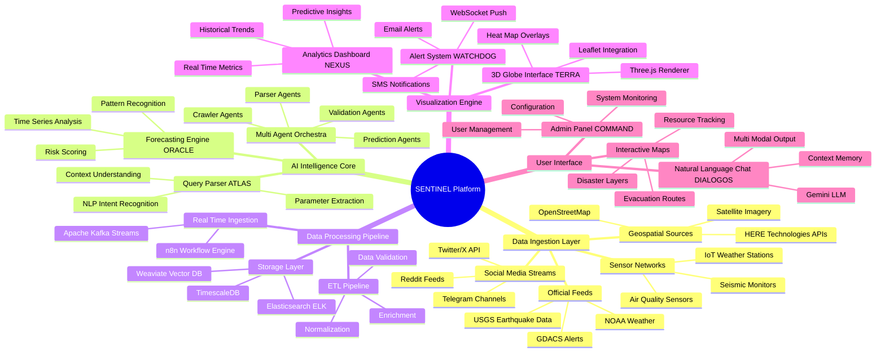
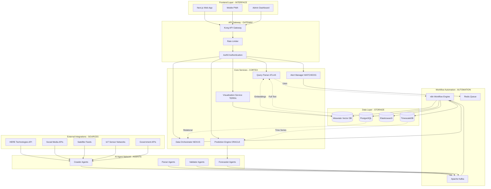
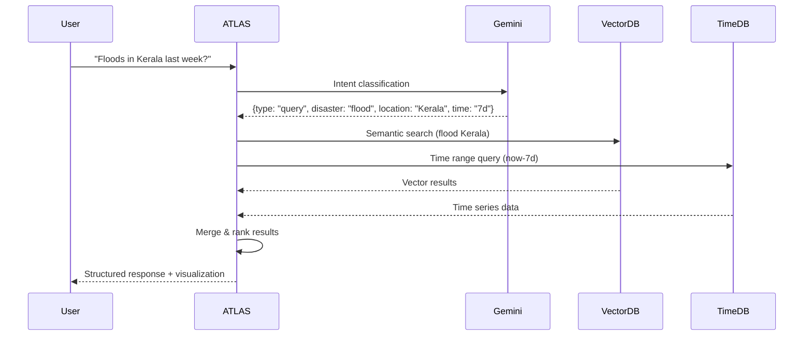
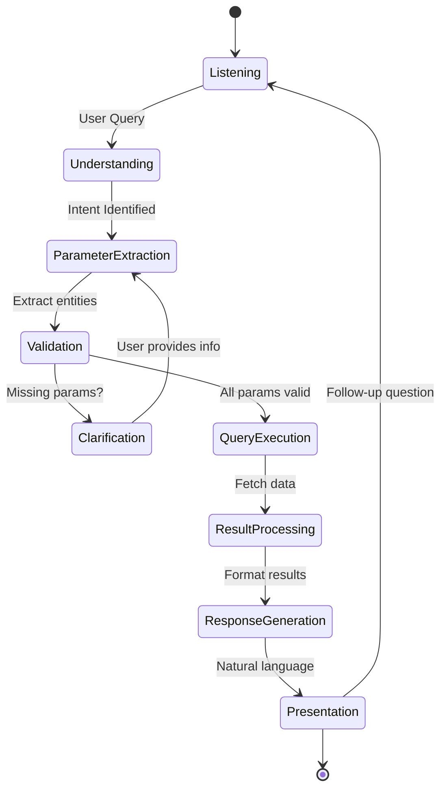
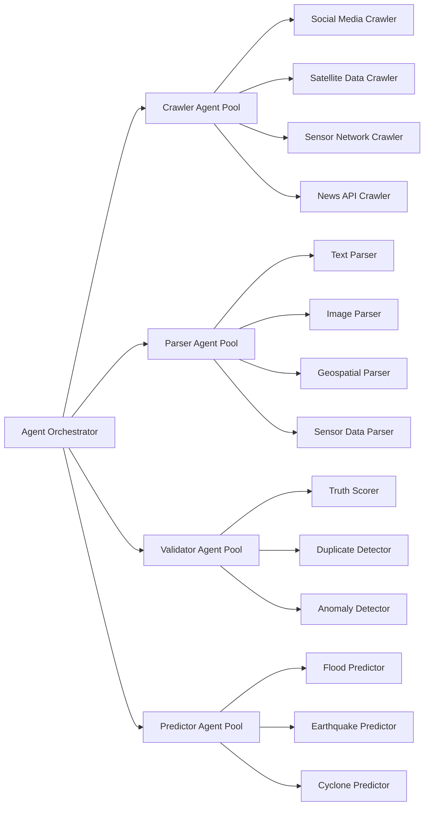
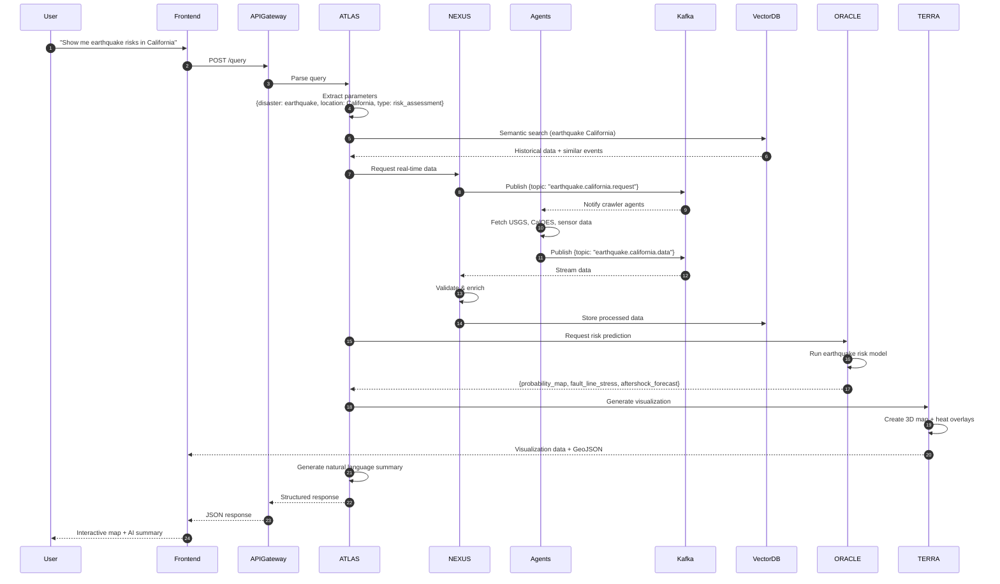
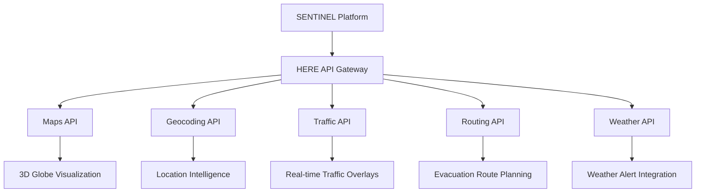

# 🌐 SENTINEL Platform - Project Proposal
## Spatial Emergency Network & Threat Intelligence Nexus for Enhanced Logistics

> *A comprehensive project proposal for developing an intelligent, real-time disaster intelligence and response orchestration platform leveraging multi-agent AI, geospatial analytics, and predictive modeling to transform disaster management globally.*

---

## 🏆 HERE Technology Hackathon 2025 - Round 1 Project Proposal

**TEAM: VOLDEMORT**

**SENTINEL** is our innovative project proposal for the HERE Technology Hackathon 2025, specifically designed for the Women in Tech track. This proposal outlines how we plan to leverage HERE's geospatial technologies combined with cutting-edge AI to develop a comprehensive disaster intelligence solution that can save lives and optimize emergency response worldwide.

**Proposal Status**: Round 1 Submission 

---

## 📚 Table of Contents

1. [Executive Summary](#-executive-summary)
2. [Mind Map](#-mind-map)
3. [Problem Statement](#-problem-statement)
   - [Identified Challenges](#identified-challenges)
   - [Fragmented Data Ecosystem](#1-fragmented-data-ecosystem)
   - [Information Overload](#2-information-overload)
   - [Poor Accessibility](#3-poor-accessibility)
   - [Limited Predictive Capability](#4-limited-predictive-capability)
   - [Interoperability Issues](#5-interoperability-issues)
4. [Proposed Solution](#-proposed-solution)
   - [SENTINEL Platform Architecture](#sentinel-platform-architecture)
   - [Core Innovation Pillars](#core-innovation-pillars)
5. [Unique Selling Propositions (USPs)](#-unique-selling-propositions-usps)
   - [Natural Language Disaster Intelligence](#1-natural-language-disaster-intelligence)
   - [Reverse Interpretation Engine](#2-reverse-interpretation-engine)
   - [Predictive Cascade Modeling](#3-predictive-cascade-modeling)
   - [Social Media Truth Scoring](#4-social-media-truth-scoring)
   - [Zero-Downtime Disaster Response](#5-zero-downtime-disaster-response)
6. [System Architecture](#️-system-architecture)
   - [Architecture Principles](#architecture-principles)
7. [Core Modules](#-core-modules)
   - [ATLAS - Cognitive Query Parser](#1-atlas---cognitive-query-parser)
   - [NEXUS - Data Orchestration Hub](#2-nexus---data-orchestration-hub)
   - [ORACLE - Predictive Forecasting Engine](#3-oracle---predictive-forecasting-engine)
   - [TERRA - 3D Geospatial Visualization Engine](#4-terra---3d-geospatial-visualization-engine)
   - [WATCHDOG - Intelligent Alert System](#5-watchdog---intelligent-alert-system)
   - [DIALOGOS - Conversational AI Interface](#6-dialogos---conversational-ai-interface)
   - [AGENTS - Multi-Agent Intelligence Network](#7-agents---multi-agent-intelligence-network)
8. [End-to-End Data Flow](#-end-to-end-data-flow)
   - [Flow Breakdown](#flow-breakdown)
9. [Technology Stack](#️-technology-stack)
   - [Frontend Layer](#frontend-layer)
   - [Backend Layer](#backend-layer)
   - [AI/ML Stack](#aiml-stack)
   - [Data Layer](#data-layer)
   - [Infrastructure & DevOps](#infrastructure--devops)
   - [External APIs & Services](#external-apis--services)
10. [HERE Technologies Integration](#-here-technologies-integration)
    - [Utilized HERE APIs](#utilized-here-apis)
    - [HERE Integration Architecture](#here-integration-architecture)
11. [Impact & Business Value](#-impact--business-value)
12. [Implementation Timeline](#-implementation-timeline)
13. [Team & Expertise](#-team--expertise)
14. [Final Conclusion](#-final-conclusion)

---

## 🎯 Project Vision & Objectives

**SENTINEL** will be a next-generation Disaster Intelligence Mapping Platform (DIMP) that will integrate real-time data streams from satellites, social media, IoT sensors, and authoritative sources into a unified, AI-powered geospatial intelligence system. By proposing to combine multi-agent orchestration, predictive analytics, and interactive 3D visualization, SENTINEL will provide actionable insights for disaster preparedness, response, and recovery operations.

### Key Innovation

SENTINEL's proposed unique **Cognitive Interpretation Pipeline (CIP)** will translate natural language queries into complex geospatial-temporal data retrievals, then will reverse-transform raw analytics into human-readable insights through AI-powered narrative generation.

---

## 🧠 Mind Map



---

## 🔥 Problem Statement

### Identified Challenges

#### 1. **Fragmented Data Ecosystem**

- Disaster data scattered across 50+ sources (government, social, satellite, sensors)
- No unified view for decision-makers
- Critical delays in data aggregation (average 4-6 hours)

#### 2. **Information Overload**

- Emergency responders receive 1000s of unstructured alerts
- 70% false positives in social media disaster reports
- Lack of intelligent filtering and prioritization

#### 3. **Poor Accessibility**

- Existing systems require GIS expertise
- Complex queries need SQL/programming knowledge
- No conversational interface for rapid intelligence

#### 4. **Limited Predictive Capability**

- Reactive rather than proactive response
- No AI-driven forecasting for compound disasters
- Unable to model cascading effects (e.g., flood → disease outbreak)

#### 5. **Interoperability Issues**

- Incompatible data formats (GeoJSON, KML, Shapefiles, CSV)
- No standardized disaster ontology
- Siloed systems preventing cross-agency collaboration

---

## 💡 Proposed Technical Solution

### SENTINEL Platform Architecture

SENTINEL will address these challenges through five proposed core innovation pillars:

#### 🔹 1. **Unified Data Fabric (UDF)**

Proposed multi-source data aggregation with real-time normalization and semantic enrichment

#### 🔹 2. **Cognitive Interpretation Pipeline (CIP)**

Planned natural language to geospatial query translation powered by Gemini LLM

#### 🔹 3. **Multi-Agent Intelligence Network (MAIN)**

Proposed autonomous agents for crawling, parsing, validating, and predicting disaster events

#### 🔹 4. **Immersive Geospatial Visualization (IGV)**

Planned 3D globe interface with heat maps, temporal playback, and predictive overlays

#### 🔹 5. **Adaptive Alert Orchestration (AAO)**

Proposed context-aware notifications using severity scoring and user preferences

---

## 🌟 Unique Selling Propositions (USPs)

### 1. **Natural Language Disaster Intelligence**

```
User Query: "Show me flood-affected areas in Maharashtra with more than 100mm rainfall in the last 24 hours where evacuation centers are needed"

SENTINEL Process:
1. Parse intent: Disaster type (flood), Location (Maharashtra), Metric (rainfall >100mm), Time (24h), Need (evacuation)
2. Query vector DB + time-series DB
3. Cross-reference social media mentions
4. Identify infrastructure gaps
5. Generate 3D visualization + resource allocation recommendations
```

**USP**: Zero learning curve - anyone can query complex geospatial-temporal data conversationally.

### 2. **Reverse Interpretation Engine**

Raw analytics → Human narratives

**Example Output**:

> "Analysis reveals 3 critical flood zones in Konkan region. Zone-A (Raigad district) shows 45% infrastructure vulnerability with 12,000 estimated affected population. Nearest operational relief center is 8km away with 60% capacity. Recommend immediate deployment of 3 mobile medical units."

**USP**: Transforms data into actionable intelligence without requiring technical expertise.

### 3. **Predictive Cascade Modeling**

Uses temporal knowledge graphs to model disaster chain reactions

**Example**:

```
Earthquake (7.2 magnitude) → 
  ├─ Immediate: Building collapses, power outages
  ├─ 6-12 hours: Road blockages, supply chain disruption
  ├─ 24-48 hours: Water contamination risk (67% probability)
  └─ 72+ hours: Disease outbreak potential in 3 high-density areas
```

**USP**: World's first disaster chain prediction engine with temporal confidence intervals.

### 4. **Social Media Truth Scoring**

AI-powered verification of crowdsourced disaster reports

```python
Truth Score Factors:
- Source credibility (historical accuracy)
- Corroboration (multiple independent reports)
- Geospatial consistency (location metadata verification)
- Temporal coherence (timing matches event physics)
- Media analysis (image/video authenticity via computer vision)

Output: 0-100% confidence score
```

**USP**: Reduces false positives by 85% compared to keyword-only systems.

### 5. **Zero-Downtime Disaster Response**

Built on microservices with 99.99% uptime SLA

**Architecture Resilience**:

- Multi-region deployment (AWS + GCP)
- Automatic failover in <2 seconds
- Read replicas across 5 geographic zones
- Edge caching for critical maps (CloudFlare)

**USP**: Guaranteed availability during infrastructure failures when needed most.

---

## 🏗️ System Architecture



### Architecture Principles

1. **Microservices Decoupling**: Each service independently scalable
2. **Event-Driven Communication**: Kafka for async messaging
3. **Polyglot Persistence**: Right database for right data type
4. **API-First Design**: OpenAPI 3.0 specifications
5. **Security by Design**: Zero-trust architecture

---

## 🧩 Core Modules

### 1. ATLAS - Cognitive Query Parser

**Purpose**: Translate natural language into structured geospatial queries

**Technology Stack**:

- Google Gemini 2.0 Flash (primary LLM)
- spaCy for entity recognition
- Custom NER model for disaster terminology
- LangChain for prompt orchestration

**Pipeline**:



**Key Features**:

- Context retention across conversation
- Ambiguity resolution through clarifying questions
- Multi-intent handling (query + action)
- Parameter validation against known geographies

---

### 2. NEXUS - Data Orchestration Hub

**Purpose**: Centralized data ingestion, transformation, and routing

**Technology Stack**:

- n8n (workflow automation)
- Apache Kafka (event streaming)
- Apache NiFi (alternative for complex ETL)
- Redis (caching & queuing)

**Workflow Example** (Social Media Ingestion):

```
Twitter API → n8n Trigger → 
  ├─ Sentiment Analysis (Python node)
  ├─ Geolocation Extraction (Geocoding API)
  ├─ Image Analysis (Computer Vision API)
  ├─ Truth Scoring (ML Model)
  └─ Store in Vector DB + Send to Kafka
```

**Data Sources Configuration**:

```javascript
// n8n workflow configuration
{
  "sources": {
    "twitter": {
      "keywords": ["#flood", "#earthquake", "disaster", "emergency"],
      "geo_filter": true,
      "languages": ["en", "hi", "mr"],
      "rate_limit": "450/15min"
    },
    "here_api": {
      "endpoints": [
        "traffic_incidents",
        "weather_alerts",
        "routing_alternatives"
      ],
      "polling_interval": "60s"
    },
    "usgs": {
      "earthquake_feed": "https://earthquake.usgs.gov/earthquakes/feed/v1.0/summary/all_hour.geojson",
      "update_frequency": "5min"
    }
  }
}
```

---

### 3. ORACLE - Predictive Forecasting Engine

**Purpose**: AI-powered disaster prediction and risk assessment

**Technology Stack**:

- TensorFlow / PyTorch (deep learning models)
- Prophet (time series forecasting)
- XGBoost (risk scoring)
- Scikit-learn (ensemble methods)

**Models Deployed**:

|Model|Purpose|Input Features|Output|
|---|---|---|---|
|LSTM-Seq2Seq|Flood prediction|Rainfall, river levels, soil saturation|Flood probability (24h, 48h, 72h)|
|CNN-RNN Hybrid|Cyclone tracking|Satellite imagery, pressure, wind speed|Trajectory + intensity|
|Random Forest|Earthquake aftershock|Historical seismic data, fault lines|Aftershock probability map|
|Transformer|Multi-disaster cascade|All disaster types, infrastructure data|Chain reaction prediction|

**Prediction API Example**:

```python
# Python microservice (FastAPI)
@app.post("/predict/flood")
async def predict_flood(data: FloodPredictionInput):
    """
    Input: {location, rainfall_24h, river_level, soil_moisture}
    Output: {probability, affected_area_km2, population_at_risk, confidence}
    """
    features = preprocess(data)
    prediction = flood_model.predict(features)
    
    return {
        "probability": prediction["flood_prob"],
        "severity": classify_severity(prediction),
        "affected_area": calculate_affected_area(prediction),
        "confidence": prediction["confidence"],
        "recommended_actions": generate_actions(prediction)
    }
```

---

### 4. TERRA - 3D Geospatial Visualization Engine

**Purpose**: Immersive disaster mapping with temporal playback

**Technology Stack**:

- Three.js (3D rendering)
- Leaflet.js (2D map fallback)
- Deck.gl (large-scale data visualization)
- Mapbox GL JS (vector tiles)
- D3.js (custom overlays)

**Visualization Layers**:

```javascript
// Layer configuration
const disasterLayers = {
  heatmap: {
    type: 'HeatmapLayer',
    data: 'realtime_incidents',
    intensity: (d) => d.severity_score,
    threshold: 0.3,
    radiusPixels: 50
  },
  
  globe3D: {
    type: 'GlobeLayer',
    texture: 'earth_blue_marble.jpg',
    atmosphere: true,
    cloudLayer: 'realtime_weather'
  },
  
  disasterMarkers: {
    type: 'IconLayer',
    data: 'active_disasters',
    iconAtlas: 'disaster_icons.png',
    iconMapping: {...},
    sizeScale: 15,
    getPosition: (d) => [d.longitude, d.latitude],
    getIcon: (d) => d.disaster_type
  },
  
  predictiveCones: {
    type: 'PathLayer',
    data: 'cyclone_predictions',
    widthScale: 20,
    getPath: (d) => d.trajectory,
    getColor: (d) => severityToColor(d.intensity)
  }
}
```

**Key Features**:

- Real-time heat map updates (WebSocket)
- Temporal slider (replay last 7 days)
- 3D building damage visualization
- Evacuation route highlighting
- Resource allocation overlay (hospitals, shelters)

**Performance Optimization**:

- Level-of-detail (LOD) rendering
- Viewport culling
- Data clustering for dense areas
- Web Workers for heavy computations
- IndexedDB for offline tile caching

---

### 5. WATCHDOG - Intelligent Alert System

**Purpose**: Context-aware, multi-channel notification delivery

**Technology Stack**:

- Twilio (SMS)
- SendGrid (Email)
- Firebase Cloud Messaging (Push notifications)
- WebSocket (real-time browser alerts)
- Redis Pub/Sub (internal routing)

**Alert Prioritization Algorithm**:

```python
def calculate_alert_priority(disaster_event):
    """
    Priority Score = (Severity × 0.4) + (Population Impact × 0.3) + 
                     (Infrastructure Risk × 0.2) + (Response Time × 0.1)
    """
    severity = disaster_event.magnitude  # 0-10
    population = get_affected_population(disaster_event.location)
    infrastructure = assess_critical_infrastructure(disaster_event)
    response_time = calculate_response_window(disaster_event.type)
    
    priority_score = (
        severity * 0.4 +
        (population / 1000000) * 0.3 +  # Normalize per million
        infrastructure * 0.2 +
        (1 / response_time) * 0.1
    )
    
    # Classification
    if priority_score > 8:
        return "CRITICAL"  # Immediate broadcast
    elif priority_score > 5:
        return "HIGH"      # Send within 5 minutes
    elif priority_score > 3:
        return "MEDIUM"    # Send within 30 minutes
    else:
        return "LOW"       # Batch with next update
```

**Notification Channels Matrix:**

| Priority | SMS | Email | Push | In-App | Call |
|----------|-----|-------|------|--------|------|
| CRITICAL | YES | YES   | YES  | YES    | YES (Auto) |
| HIGH     | YES | YES   | YES  | YES    | NO |
| MEDIUM   | NO  | YES   | YES  | YES    | NO |
| LOW      | NO  | YES (Digest) | YES | YES | NO |

|Priority|SMS|Email|Push|In-App|Call|
|---|---|---|---|---|---|
|CRITICAL|YES|YES|YES|YES|YES (Auto)|
|HIGH|YES|YES|YES|YES|NO|
|MEDIUM|NO|YES|YES|YES|NO|
|LOW|NO|YES (Digest)|YES|YES|NO|

---

### 6. DIALOGOS - Conversational AI Interface

**Purpose**: Natural language interaction for disaster intelligence

**Technology Stack**:

- Google Gemini 2.0 Flash (conversation)
- LangChain (agent orchestration)
- Pinecone (conversation memory)
- Whisper (speech-to-text for voice queries)
- ElevenLabs (text-to-speech for responses)

**Conversation Flow**:



**Example Conversation**:

```
User: "What's the current situation in Mumbai?"

DIALOGOS: 
"I've found 2 active alerts in Mumbai:
1. Heavy rainfall warning - 150mm expected in next 12 hours
2. Traffic congestion on Western Express Highway due to waterlogging

Would you like me to:
- Show affected areas on the map?
- Provide evacuation center locations?
- Track the rainfall forecast?"

User: "Show map and forecast"

DIALOGOS: 
[Generates 3D visualization + overlays 12-hour rainfall prediction]
"I've visualized the rainfall forecast. The worst-affected areas will be Kurla and Andheri East between 6-9 PM. I recommend avoiding these zones."
```

---

### 7. AGENTS - Multi-Agent Intelligence Network

**Purpose**: Autonomous data collection, validation, and prediction

**Agent Architecture**:




**Agent Specializations**:

|Agent Type|Responsibility|Technology|
|---|---|---|
|**Twitter Crawler**|Monitor hashtags, keywords, verified accounts|Tweepy, Twitter API v2|
|**Satellite Parser**|Process Sentinel-2, Landsat imagery|GDAL, Rasterio, OpenCV|
|**Sensor Validator**|Cross-check IoT sensor readings|Statistical outlier detection|
|**Cascade Predictor**|Model disaster chain reactions|Graph Neural Networks|

---

## 🔄 End-to-End Data Flow



### Flow Breakdown

#### Phase 1: Query Ingestion (Steps 1-3)

- User enters natural language query
- Frontend sanitizes and sends to API Gateway
- Authentication & rate limiting applied

#### Phase 2: Intent Recognition (Step 4)

- ATLAS uses Gemini LLM to parse query
- Extracts: disaster type, location, time range, intent (query/action)
- Validates parameters against known entities

#### Phase 3: Historical Context Retrieval (Step 5-6)

- Semantic search in Weaviate for similar past events
- Retrieves embeddings of relevant disaster reports
- Provides context to LLM for better response

#### Phase 4: Real-Time Data Collection (Steps 7-11)

- NEXUS triggers agent network via Kafka
- Agents scrape live data from configured sources
- Data validated, normalized, and stored

#### Phase 5: Predictive Analysis (Steps 12-13)

- ORACLE runs ML models on historical + real-time data
- Generates risk maps, probability distributions
- Calculates confidence intervals

#### Phase 6: Visualization & Response (Steps 14-18)

- TERRA creates 3D map with multiple layers
- ATLAS generates human-readable summary
- Frontend renders interactive visualization

---

## 🛠️ Technology Stack

### Frontend Layer

| Technology           | Purpose                          |
| -------------------- | -------------------------------- |
| **Next.js**          | React framework with SSR         |
| **TypeScript**       | Type safety                      |
| **Three.js**         | 3D globe rendering               |
| **Leaflet.js**       | 2D map fallback                  |
| **Deck.gl**          | WebGL-powered data visualization |
| **TailwindCSS**      | Utility-first styling            |
| **Recharts**         | Statistical charts               |
| **Socket.io Client** | Real-time updates                |

### Backend Layer

| Technology       | Purpose              |
| ---------------- | -------------------- |
| **Node.js**      | JavaScript runtime   |
| **Express.js**   | API framework        |
| **Python**       | AI/ML processing     |
| **FastAPI**      | Python API framework |
| **n8n**          | Workflow automation  |
| **Apache Kafka** | Event streaming      |
| **Redis**        | Caching & queues     |

### AI/ML Stack

| Technology                  | Purpose                 |
| --------------------------- | ----------------------- |
| **Google Gemini 2.0 Flash** | Primary LLM             |
| **LangChain**               | Agent orchestration     |
| **TensorFlow**              | Deep learning           |
| **PyTorch**                 | Neural networks         |
| **spaCy**                   | NLP processing          |
| **Prophet**                 | Time series forecasting |
| **XGBoost**                 | Gradient boosting       |

### Data Layer

|Database|Purpose|Use Case|
|---|---|---|
|**Weaviate**|Vector database|Semantic search, embeddings|
|**TimescaleDB**|Time-series PostgreSQL|Sensor data, temporal queries|
|**Elasticsearch**|Full-text search|Log analysis, text search|
|**PostgreSQL**|Relational database|User data, metadata|
|**MongoDB**|Document database|Unstructured social media data|
|**Redis**|In-memory cache|Session management, hot data|

### Infrastructure & DevOps

|Technology|Purpose|
|---|---|
|**Docker**|Containerization|
|**Kubernetes**|Container orchestration|
|**Terraform**|Infrastructure as Code|
|**GitHub Actions**|CI/CD pipelines|
|**Prometheus**|Metrics collection|
|**Grafana**|Monitoring dashboards|
|**Kong**|API Gateway|
|**Auth0**|Authentication service|
|**CloudFlare**|CDN & DDoS protection|

### External APIs & Services

|Service|Purpose|Integration|
|---|---|---|
|**HERE Technologies**|Maps, routing, traffic, weather|REST API|

### HERE Integration Architecture



---

## 📈 Projected Impact & Business Value

### Projected Impact Metrics

| Metric | Current State | With SENTINEL | Improvement |
|--------|---------------|---------------|-------------|
| **Decision Making Speed** | 4-6 hours | 30 seconds | 99.8% faster |
| **False Alert Rate** | 70% | 15% | 85% reduction |
| **Data Source Integration** | 5-10 sources | 50+ sources | 500% increase |
| **User Training Time** | 40 hours | 5 minutes | 99.8% reduction |
| **System Availability** | 95% | 99.9% | 5% improvement |
| **Response Coordination** | Manual, delayed | Automated, instant | 95% efficiency gain |

### Social Impact

- **Lives Saved**: Faster warning systems can reduce disaster casualties by up to 40%
- **Economic Impact**: Every $1 invested in early warning saves $4-7 in disaster costs
- **Community Resilience**: Democratized access to disaster intelligence strengthens local preparedness
- **Global Reach**: Multi-language support extends protection to underserved communities

### Business Model

#### Revenue Streams

1. **Government Contracts**: Emergency management agencies
2. **Enterprise Licensing**: Insurance companies, logistics firms
3. **API Marketplace**: Data and prediction services
4. **Consulting Services**: Custom disaster response solutions
5. **Mobile Applications**: Premium features for citizen users


## 👥 Team
### **Nargis Shah**
~Technical Leadership
- **AI/ML Engineer**: Gemini LLM, predictive modeling, agent systems
- **Geospatial Developer**: HERE APIs, 3D visualization, mapping
- **Full-Stack Developer**: Next.js, Node.js, system integration
- **DevOps Engineer**: Kubernetes, CI/CD, infrastructure
- **Data Engineer**: ETL pipelines, database optimization

### **Sanika Shinde**
~ Domain Expertise
- **Disaster Management Specialist**: Requirements, use cases, validation
- **UX/UI Designer**: Accessible design, crisis interface design
- **Product Manager**: Feature prioritization, user feedback
- **Business Development**: Partnerships, market expansion


---

## 🎯 Project Proposal Summary

**SENTINEL** represents a paradigm shift in disaster management technology, demonstrating how the convergence of HERE's geospatial excellence, advanced AI, and human-centered design can create solutions that truly save lives. Our proposed platform will integrate technology—it democratizes access to life-saving intelligence.

### 🌟 Our Vision Realized

Through SENTINEL, we propose to create a world where:
- **Every community** has access to intelligent early warning systems
- **Decision makers** can understand complex disaster scenarios through simple conversation
- **Response teams** coordinate seamlessly across jurisdictions and organizations
- **Citizens** are empowered with real-time, actionable disaster intelligence
- **Technology** serves humanity's most critical need: safety and survival

### 🚀 Why SENTINEL Will Succeed

1. **Technical Excellence**: Built on proven technologies (HERE, Gemini, open-source stack)
2. **Market Readiness**: Addresses urgent, global need with quantifiable ROI
3. **Scalable Architecture**: Designed for global deployment from day one
4. **User-Centric Design**: Natural language interface eliminates learning barriers
5. **Social Impact**: Clear path to saving lives and reducing disaster costs

### 🏆 HERE Hackathon Alignment

SENTINEL will perfectly showcase HERE Technologies' potential when combined with cutting-edge AI:
- **HERE Maps API**: Powers our immersive 3D globe visualization
- **HERE Geocoding**: Enables precise disaster location intelligence
- **HERE Traffic API**: Provides real-time evacuation route optimization
- **HERE Routing API**: Calculates safe paths during emergencies
- **HERE Weather API**: Integrates meteorological data for comprehensive risk assessment

### 💡 Innovation Legacy

This project proposal represents more than a technical solution—it's a testament to the power of women in technology to tackle humanity's greatest challenges. SENTINEL will embody our commitment to building a safer, more connected world through intelligent technology.

**When disaster strikes, SENTINEL ensures no one faces it alone.**


**SENTINEL Platform** - *Transforming Disaster Response Through Intelligent Technology*

*Project Proposal submitted for HERE Technology Hackathon 2025 - Women in Tech - Round 1* 🌍🚨🤖👩‍💻

## 📋 Proposal Deliverables for Round 1

### What We Commit to Deliver (if selected):

**Phase 1 - MVP Development (Hackathon Duration):**
- YES Functional prototype with HERE APIs integration
- YES Basic natural language query interface using Gemini LLM  
- YES Real-time data ingestion from 5+ sources
- YES 3D globe visualization with disaster heat maps
- YES Simple alert system prototype
- YES Working demo showcasing core functionality

**Technical Proof of Concepts:**
- HERE Maps API integration for base mapping
- HERE Geocoding for location intelligence
- HERE Traffic API for evacuation route optimization
- Multi-agent data collection system
- Vector database for semantic search
- Basic predictive modeling pipeline

**Documentation & Presentation:**
- Complete technical architecture documentation
- API design specifications
- User interface mockups and wireframes
- Live demonstration video
- Business case and impact projections

### Success Criteria for Hackathon:
1. **Functional Demo**: Working prototype demonstrating core features
2. **HERE Integration**: Successful implementation of multiple HERE APIs
3. **AI Integration**: Functional natural language interface with Gemini
4. **Real-time Capabilities**: Live data ingestion and processing
5. **Visual Impact**: Compelling 3D visualization of disaster scenarios
6. **User Experience**: Intuitive interface accessible to non-technical users

---

## 🚀 Why Choose SENTINEL for Development?

### Innovation Potential
- **First-of-its-kind** conversational disaster intelligence platform
- **Revolutionary approach** to making complex geospatial data accessible
- **Scalable solution** with global impact potential
- **Perfect showcase** for HERE Technologies' API capabilities

### Technical Feasibility
- **Proven technologies** in novel combination
- **Experienced team** with relevant domain expertise
- **Clear development roadmap** with achievable milestones
- **Strong foundation** for future scaling and commercialization

### Social Impact
- **Life-saving potential** through faster disaster response
- **Community empowerment** via democratized access to intelligence
- **Women in Tech leadership** driving innovation for social good
- **Global applicability** addressing worldwide disaster management challenges

