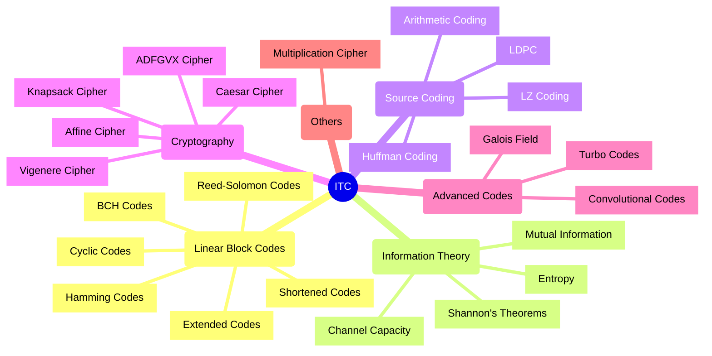
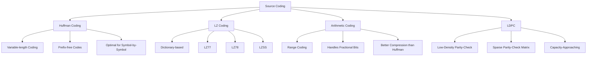
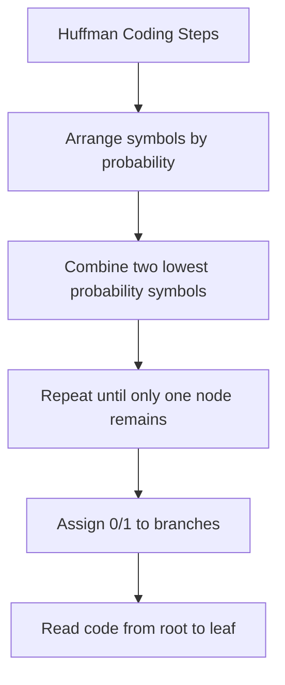
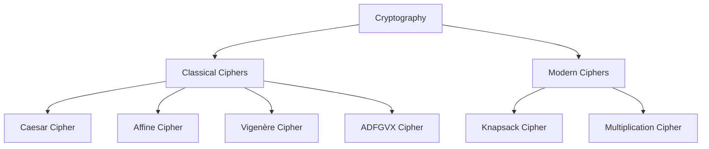
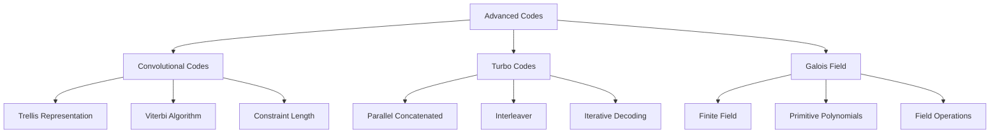

```mermaid
flowchart TD
    A[Linear Block Codes] --> B[Hamming Codes]
    A --> C[Cyclic Codes]
    A --> D[BCH Codes]
    A --> E[Reed-Solomon Codes]
    A --> F[Shortened Codes]
    A --> G[Extended Codes]
    
    B --> B1[Single Error Correction]
    B --> B2[Hamming Distance]
    B --> B3["Hamming(7,4)"]
    
    C --> C1[Generator Polynomial]
    C --> C2[Shift Register Implementation]
    C --> C3[CRC]
    
    D --> D1[Multiple Error Correction]
    D --> D2[Designed Distance]
    D --> D3[Primitive Polynomials]
    
    E --> E1["Non-binary BCH Codes"]
    E --> E2[Burst Error Correction]
    E --> E3["Used in Storage/Communication"]
    
    F --> F1[Remove Information Bits]
    F --> F2[Maintain Minimum Distance]
    
    G --> G1[Add Overall Parity Bit]
    G --> G2[Increase Minimum Distance]
```

# Information Theory and Coding (ITC) Mind Map

## Overview Diagram



## Linear Block Codes



### Key Concepts

#### Linear Block Codes
- **Definition**: Error-correcting codes where each codeword is a linear combination of other codewords
- **Parameters**:
  - n: Block length (total bits)
  - k: Message length (information bits)
  - Rate: R = k/n
  - Minimum distance: d_min
- **Properties**:
  - Can detect up to $$d_{min}-1$$ errors
  - Can correct up to $$\lfloor(d_{min}-1)/2\rfloor$$ errors
  - Generator matrix $$G$$: Maps messages to codewords
  - Parity-check matrix $$H$$: Used for error detection

#### Hamming Codes
- **Definition**: Family of linear block codes that can correct single-bit errors
- **Common codes**:
  - Hamming(7,4): 4 data bits, 3 parity bits
  - Hamming(15,11): 11 data bits, 4 parity bits
- **Properties**:
  - Minimum distance = 3
  - Can correct 1 error or detect 2 errors
  - Parity bits at positions 2^i (1, 2, 4, 8, ...)

#### Example: Hamming(7,4)
- Generator matrix:
```
G = [1 0 0 0 | 1 1 0]
    [0 1 0 0 | 1 0 1]
    [0 0 1 0 | 0 1 1]
    [0 0 0 1 | 1 1 1]
```
- Parity-check matrix:
```
H = [1 1 0 1 | 1 0 0]
    [1 0 1 1 | 0 1 0]
    [0 1 1 1 | 0 0 1]
```
- Encoding: $$c = m \cdot G$$
- Syndrome calculation: $$s = r \cdot H^T$$
- Error correction: Syndrome indicates error position

#### Cyclic Codes
- **Definition**: Linear block codes where any cyclic shift of a codeword is also a codeword
- **Properties**:
  - Represented by generator polynomial g(x)
  - Easily implemented using shift registers
  - Examples: CRC, BCH, Reed-Solomon

#### BCH Codes
- **Definition**: Powerful class of cyclic codes with multiple error correction capability
- **Properties**:
  - Designed minimum distance
  - Uses finite field arithmetic
  - Efficient decoding algorithms

#### Reed-Solomon Codes
- **Definition**: Non-binary BCH codes that operate on symbol blocks
- **Properties**:
  - Excellent for burst error correction
  - Used in storage systems, DVDs, QR codes
  - Can correct up to (n-k)/2 symbol errors

#### Shortened Codes
- Created by removing information bits from a code
- Maintains minimum distance
- Useful when standard code lengths are too long

#### Extended Codes
- Created by adding overall parity bit
- Increases minimum distance by 1
- Improves error detection capability

### Video Resources
- [Linear Block Codes Introduction](https://www.youtube.com/watch?v=QYT8hK9Yzzk)
- [Hamming Code Tutorial](https://www.youtube.com/watch?v=X8jsijhllIA)
- [Cyclic Codes Explained](https://www.youtube.com/watch?v=Ywk4BywxV2g)
- [Reed-Solomon Codes](https://www.youtube.com/watch?v=fBRMaEAFLE0)

### Numerical Problems

#### Problem 1: Hamming(7,4) Encoding
Encode the message m = [1 0 1 1] using Hamming(7,4) code.

**Solution**:
$$c = m \cdot G = [1~0~1~1] \times G$$
$$c = [1~0~1~1 | 0~1~0]$$
The encoded codeword is $$[1~0~1~1~0~1~0]$$

#### Problem 2: Error Detection
Received word r = [1 0 1 1 0 0 0]. Check if there's an error using Hamming(7,4).

**Solution**:
Syndrome $$s = r \cdot H^T = [1~0~1~1~0~0~0] \times H^T = [1~1~0]$$
Since $$s \neq 0$$, there is an error.
The syndrome $$[1~1~0]$$ corresponds to column 6 of $$H$$, so the error is in bit 6.
Corrected codeword: $$[1~0~1~1~0~1~0]$$

## Information Theory

```mermaid
flowchart TD
    A[Information Theory] --> B[Entropy]
    A --> C[Mutual Information]
    A --> D[Channel Capacity]
    A --> E[Shannon's Theorems]
    
    B --> B1[Self Information: I(x) = -log₂P(x)]
    B --> B2[Entropy: H(X) = -∑P(xᵢ)log₂P(xᵢ)]
    B --> B3[Joint Entropy: H(X,Y)]
    B --> B4[Conditional Entropy: H(X|Y)]
    
    C --> C1[I(X;Y) = H(X) - H(X|Y)]
    C --> C2[I(X;Y) = H(Y) - H(Y|X)]
    C --> C3[I(X;Y) = H(X) + H(Y) - H(X,Y)]
    
    D --> D1[C = max I(X;Y)]
    D --> D2[C = B log₂(1+S/N) for AWGN]
    
    E --> E1[Source Coding Theorem]
    E --> E2[Channel Coding Theorem]
    E --> E3[Rate Distortion Theory]
```

### Key Concepts

#### Entropy
- **Definition**: Measure of uncertainty or randomness in a random variable
- **Formula**: H(X) = -∑P(xᵢ)log₂P(xᵢ)
- **Properties**:
  - Non-negative: H(X) ≥ 0
  - Maximum when all outcomes equally likely
  - H(X) ≤ log₂|X| where |X| is the number of possible values
  - Entropy is additive for independent variables: H(X,Y) = H(X) + H(Y)

#### Example: Calculating Entropy
Consider a source with symbols {A, B, C, D} with probabilities {0.4, 0.3, 0.2, 0.1}:
- H(X) = -(0.4log₂0.4 + 0.3log₂0.3 + 0.2log₂0.2 + 0.1log₂0.1)
- H(X) = -(0.4×(-1.32) + 0.3×(-1.74) + 0.2×(-2.32) + 0.1×(-3.32))
- H(X) = 1.85 bits/symbol

#### Mutual Information
- **Definition**: Measure of mutual dependence between two random variables
- **Formula**: I(X;Y) = H(X) - H(X|Y) = H(Y) - H(Y|X) = H(X) + H(Y) - H(X,Y)
- **Properties**:
  - Non-negative: I(X;Y) ≥ 0
  - Symmetric: I(X;Y) = I(Y;X)
  - I(X;Y) = 0 if and only if X and Y are independent

#### Channel Capacity
- **Definition**: Maximum rate at which information can be transmitted reliably over a channel
- **Formula**: C = max I(X;Y)
- **Shannon-Hartley Theorem**: C = B log₂(1+S/N) for AWGN channel
  - B: bandwidth in Hz
  - S/N: signal-to-noise ratio

#### Shannon's Theorems
- **Source Coding Theorem**:
  - Average code length L ≥ H(X)
  - Optimal code length approaches entropy
- **Channel Coding Theorem**:
  - If R < C, reliable communication is possible
  - If R > C, reliable communication is impossible
  - R: information rate, C: channel capacity

### Video Resources
- [Information Theory Basics](https://www.youtube.com/watch?v=ErfnhcEV1O8)
- [Entropy and Information Gain](https://www.youtube.com/watch?v=9r7FIXEAGvs)
- [Channel Capacity Explained](https://www.youtube.com/watch?v=1lKeXaCum4Q)
- [Shannon's Source Coding Theorem](https://www.youtube.com/watch?v=UgKQMcvZbII)

### Numerical Problems

#### Problem 1: Entropy Calculation
A source emits symbols {A, B, C, D, E} with probabilities {0.1, 0.2, 0.3, 0.15, 0.25}. Calculate the entropy of the source.

**Solution**:
H(X) = -(0.1log₂0.1 + 0.2log₂0.2 + 0.3log₂0.3 + 0.15log₂0.15 + 0.25log₂0.25)
H(X) = -(0.1×(-3.32) + 0.2×(-2.32) + 0.3×(-1.74) + 0.15×(-2.74) + 0.25×(-2))
H(X) = 2.19 bits/symbol

#### Problem 2: Channel Capacity
Calculate the capacity of an AWGN channel with bandwidth 4 kHz and SNR of 15 dB.

**Solution**:
SNR = 10^(15/10) = 31.62
C = B log₂(1+SNR) = 4000 × log₂(1+31.62) = 4000 × 5 = 20,000 bits/second = 20 kbps

## Source Coding



### Huffman Coding



- **Definition**: Variable-length prefix coding algorithm that assigns shorter codes to more frequent symbols
- **Properties**:
  - Optimal for symbol-by-symbol encoding
  - Prefix-free (no code is a prefix of another)
  - Average code length is within 1 bit of entropy

#### Example: Huffman Coding
For symbols {A, B, C, D} with probabilities {0.4, 0.3, 0.2, 0.1}:

1. Sort by probability: A(0.4), B(0.3), C(0.2), D(0.1)
2. Combine D and C: (C,D)(0.3), B(0.3), A(0.4)
3. Combine (C,D) and B: (B,C,D)(0.6), A(0.4)
4. Combine (B,C,D) and A: (A,B,C,D)(1.0)
5. Assign codes:
   - A: 0
   - B: 10
   - C: 110
   - D: 111

Average code length = 0.4×1 + 0.3×2 + 0.2×3 + 0.1×3 = 1.9 bits/symbol
(Compare with entropy = 1.85 bits/symbol)

### LZ Coding (Lempel-Ziv)
- **Definition**: Dictionary-based compression algorithm that replaces repeated sequences with references
- **Variants**:
  - LZ77: Uses sliding window
  - LZ78: Builds explicit dictionary
  - LZSS: Improved LZ77 with better encoding
- **Applications**: ZIP, GIF, PNG

### Arithmetic Coding
- **Definition**: Encodes entire message into a single fraction between 0 and 1
- **Advantages**:
  - Can achieve compression closer to entropy than Huffman
  - Handles fractional bits effectively
  - Better for skewed probability distributions
- **Process**:
  1. Start with interval [0,1)
  2. Divide interval according to symbol probabilities
  3. Select subinterval for each symbol
  4. Final interval represents encoded message

### LDPC (Low-Density Parity-Check)
- **Definition**: Linear error-correcting code with sparse parity-check matrix
- **Properties**:
  - Capacity-approaching performance
  - Efficient iterative decoding
  - Used in 5G, Wi-Fi, DVB-S2

### Video Resources
- [Huffman Coding Tutorial](https://www.youtube.com/watch?v=JsTptu56GM8)
- [LZ77 Compression Algorithm](https://www.youtube.com/watch?v=Jqc418tQDkg)
- [Arithmetic Coding Explained](https://www.youtube.com/watch?v=ouYV3rBtrTI)
- [LDPC Codes Introduction](https://www.youtube.com/watch?v=VWjj_uN0WDI)

### Numerical Problems

#### Problem: Huffman Coding
Construct a Huffman code for symbols {A, B, C, D, E} with probabilities {0.35, 0.25, 0.2, 0.15, 0.05}.

**Solution**:
1. Sort: A(0.35), B(0.25), C(0.2), D(0.15), E(0.05)
2. Combine E and D: (D,E)(0.2), C(0.2), B(0.25), A(0.35)
3. Combine (D,E) and C: (C,D,E)(0.4), B(0.25), A(0.35)
4. Combine B and (C,D,E): (B,C,D,E)(0.65), A(0.35)
5. Combine (B,C,D,E) and A: (A,B,C,D,E)(1.0)
6. Assign codes:
   - A: 0
   - B: 10
   - C: 110
   - D: 1110
   - E: 1111

Average code length = 0.35×1 + 0.25×2 + 0.2×3 + 0.15×4 + 0.05×4 = 2.15 bits/symbol

## Cryptography



### Classical Ciphers

#### Caesar Cipher
- **Definition**: Substitution cipher that shifts letters by a fixed amount
- **Formula**: $$E(x) = (x + k) \mod 26$$, $$D(y) = (y - k) \mod 26$$
- **Example**: With $$k=3$$, "HELLO" → "KHOOR"
- **Security**: Easily broken by frequency analysis

#### Affine Cipher
- **Definition**: Substitution cipher using linear function
- **Formula**: $$E(x) = (ax + b) \mod 26$$, $$D(y) = a^{-1}(y - b) \mod 26$$
- **Constraints**: $$\gcd(a, 26) = 1$$
- **Example**: With $$a=5$$, $$b=8$$, "HELLO" → "RCBBY"

#### Vigenère Cipher
- **Definition**: Polyalphabetic substitution cipher using a keyword
- **Process**: Each letter of keyword specifies shift for corresponding plaintext letter
- **Example**: With key "KEY", "HELLO" → "RIJVS"
- **Security**: Resistant to simple frequency analysis

#### ADFGVX Cipher
- **Definition**: Substitution-transposition cipher using a 6×6 grid
- **Process**:
  1. Replace each letter with two letters from A, D, F, G, V, X
  2. Perform columnar transposition based on keyword
- **Security**: Used in WWI by German army

### Modern Ciphers

#### Knapsack Cipher
- **Definition**: Public-key cryptosystem based on subset sum problem
- **Security**: Broken by Shamir's attack
- **Historical importance**: Early public-key system

#### Multiplication Cipher
- **Definition**: Substitution cipher using multiplication in modular arithmetic
- **Formula**: $$E(x) = (ax) \mod n$$, where $$\gcd(a,n) = 1$$
- **Security**: Vulnerable to known-plaintext attacks

### Video Resources
- [Caesar Cipher Explained](https://www.youtube.com/watch?v=sMOZf4GN3oc)
- [Vigenère Cipher Tutorial](https://www.youtube.com/watch?v=SkJcmCaHqS0)
- [ADFGVX Cipher Walkthrough](https://www.youtube.com/watch?v=sHuIZM-9Mrg)

## Advanced Codes



### Convolutional Codes
- **Definition**: Stream codes that process data continuously rather than in blocks
- **Parameters**:
  - Constraint length $$K$$
  - Code rate $$R = k/n$$
- **Representation**:
  - State diagram
  - Trellis diagram
  - Generator polynomials
- **Decoding**: Viterbi algorithm (maximum likelihood)

### Turbo Codes
- **Definition**: Parallel concatenated convolutional codes with interleaver
- **Properties**:
  - Near Shannon limit performance
  - Iterative decoding
  - Used in 3G/4G mobile communications

### Galois Field
- **Definition**: Finite field with $$q=p^m$$ elements
- **Properties**:
  - Closed under addition and multiplication
  - Every element has an additive and multiplicative inverse
  - Used in BCH and Reed-Solomon codes
- **Operations**:
  - Addition: XOR for GF(2^m)
  - Multiplication: Using primitive polynomial

### Video Resources
- [Convolutional Codes Explained](https://www.youtube.com/watch?v=AkBljzLNWjA)
- [Viterbi Algorithm Tutorial](https://www.youtube.com/watch?v=dKIf6mQUfnY)
- [Turbo Codes Introduction](https://www.youtube.com/watch?v=UxCbxPS3v8g)
- [Galois Field Arithmetic](https://www.youtube.com/watch?v=x1v2tX4_dkQ)

## Exam Tips and Tricks

### General Tips
1. **Understand the fundamentals**: Focus on core concepts like entropy, channel capacity, and coding theorems
2. **Practice numerical problems**: Especially entropy calculations, Huffman coding, and linear block code operations
3. **Memorize key formulas**: Keep a formula sheet for quick reference
4. **Draw diagrams**: Use visual representations for complex concepts
5. **Connect related concepts**: Information theory and coding are interconnected

### Topic-Specific Tips

#### Information Theory
- Remember that entropy is maximized when all symbols are equally likely
- For channel capacity problems, convert dB to linear scale first
- Shannon's theorems set theoretical limits but don't tell how to achieve them

#### Source Coding
- For Huffman coding, always start by sorting symbols by probability
- Arithmetic coding achieves better compression for skewed distributions
- LZ coding works best for text with repeated patterns

#### Linear Block Codes
- Remember the relationship: n = k + r (codeword length = message length + redundancy)
- Practice syndrome calculation for error detection/correction
- For cyclic codes, understand polynomial representation

#### Cryptography
- Classical ciphers are mainly conceptual; focus on the principles
- Understand the strengths and weaknesses of each cipher type

### Memory Techniques
1. **Acronyms**: Create memorable acronyms for lists of concepts
2. **Visualization**: Associate concepts with visual images
3. **Chunking**: Group related concepts together
4. **Spaced repetition**: Review material at increasing intervals
5. **Teach others**: Explaining concepts reinforces understanding

### Exam Strategy
1. **Quick scan**: Review the entire exam before starting
2. **Easy first**: Solve familiar problems first to build confidence
3. **Time management**: Allocate time based on marks per question
4. **Show work**: For numerical problems, clearly show all steps
5. **Double-check**: Verify calculations, especially for entropy and code lengths

## Quick Reference Cards

### Entropy Formulas
```
Self Information: $$I(x) = -\log_2P(x)$$
Entropy: $$H(X) = -\sum P(x_i)\log_2P(x_i)$$
Joint Entropy: $$H(X,Y) = -\sum\sum P(x,y)\log_2P(x,y)$$
Conditional Entropy: $$H(X|Y) = H(X,Y) - H(Y)$$
Mutual Information: $$I(X;Y) = H(X) + H(Y) - H(X,Y)$$
Channel Capacity: $$C = \max I(X;Y)$$
```

### Error Correction Capabilities
```
Error Detection: Up to $$d_{min}-1$$ errors
Error Correction: Up to $$\lfloor(d_{min}-1)/2\rfloor$$ errors
Hamming(7,4): Detects 2 errors, Corrects 1 error
Reed-Solomon: Corrects up to $$(n-k)/2$$ symbol errors
```

### Common Codes and Applications
```
Huffman: Data compression (JPEG, MP3)
LZ: ZIP, GIF, PNG
Hamming: Computer memory
CRC: Error detection in networks
Reed-Solomon: Storage (CD, DVD), QR codes
Turbo/LDPC: Satellite, 4G/5G communications
```

## Information Theory

```mermaid
flowchart TD
    A[Information Theory] --> B[Entropy]
    A --> C[Mutual Information]
    A --> D[Channel Capacity]
    A --> E[Shannon's Theorems]
    
    B --> B1[Self Information: I(x) = -log₂P(x)]
    B --> B2[Entropy: H(X) = -∑P(xᵢ)log₂P(xᵢ)]
    B --> B3[Joint Entropy: H(X,Y)]
    B --> B4[Conditional Entropy: H(X|Y)]
    
    C --> C1[I(X;Y) = H(X) - H(X|Y)]
    C --> C2[I(X;Y) = H(Y) - H(Y|X)]
    C --> C3[I(X;Y) = H(X) + H(Y) - H(X,Y)]
    
    D --> D1[C = max I(X;Y)]
    D --> D2[C = B log₂(1+S/N) for AWGN]
    
    E --> E1[Source Coding Theorem]
    E --> E2[Channel Coding Theorem]
    E --> E3[Rate Distortion Theory]
```

### Key Concepts

#### Entropy
- **Definition**: Measure of uncertainty or randomness in a random variable
- **Formula**: H(X) = -∑P(xᵢ)log₂P(xᵢ)
- **Properties**:
  - Non-negative: H(X) ≥ 0
  - Maximum when all outcomes equally likely
  - H(X) ≤ log₂|X| where |X| is the number of possible values
  - Entropy is additive for independent variables: H(X,Y) = H(X) + H(Y)

#### Example: Calculating Entropy
Consider a source with symbols {A, B, C, D} with probabilities {0.4, 0.3, 0.2, 0.1}:
- H(X) = -(0.4log₂0.4 + 0.3log₂0.3 + 0.2log₂0.2 + 0.1log₂0.1)
- H(X) = -(0.4×(-1.32) + 0.3×(-1.74) + 0.2×(-2.32) + 0.1×(-3.32))
- H(X) = 1.85 bits/symbol

#### Mutual Information
- **Definition**: Measure of mutual dependence between two random variables
- **Formula**: I(X;Y) = H(X) - H(X|Y) = H(Y) - H(Y|X) = H(X) + H(Y) - H(X,Y)
- **Properties**:
  - Non-negative: I(X;Y) ≥ 0
  - Symmetric: I(X;Y) = I(Y;X)
  - I(X;Y) = 0 if and only if X and Y are independent

#### Channel Capacity
- **Definition**: Maximum rate at which information can be transmitted reliably over a channel
- **Formula**: C = max I(X;Y)
- **Shannon-Hartley Theorem**: C = B log₂(1+S/N) for AWGN channel
  - B: bandwidth in Hz
  - S/N: signal-to-noise ratio

#### Shannon's Theorems
- **Source Coding Theorem**:
  - Average code length L ≥ H(X)
  - Optimal code length approaches entropy
- **Channel Coding Theorem**:
  - If R < C, reliable communication is possible
  - If R > C, reliable communication is impossible
  - R: information rate, C: channel capacity

### Video Resources
- [Information Theory Basics](https://www.youtube.com/watch?v=ErfnhcEV1O8)
- [Entropy and Information Gain](https://www.youtube.com/watch?v=9r7FIXEAGvs)
- [Channel Capacity Explained](https://www.youtube.com/watch?v=1lKeXaCum4Q)
- [Shannon's Source Coding Theorem](https://www.youtube.com/watch?v=UgKQMcvZbII)

### Numerical Problems

#### Problem 1: Entropy Calculation
A source emits symbols {A, B, C, D, E} with probabilities {0.1, 0.2, 0.3, 0.15, 0.25}. Calculate the entropy of the source.

**Solution**:
$$ H(X) = -(0.1log₂0.1 + 0.2log₂0.2 + 0.3log₂0.3 + 0.15log₂0.15 + 0.25log₂0.25)
H(X) = -(0.1×(-3.32) + 0.2×(-2.32) + 0.3×(-1.74) + 0.15×(-2.74) + 0.25×(-2))
H(X) = 2.19 bits/symbol $$

#### Problem 2: Channel Capacity
Calculate the capacity of an AWGN channel with bandwidth 4 kHz and SNR of 15 dB.

**Solution**:
SNR = 10^(15/10) = 31.62
C = B log₂(1+SNR) = 4000 × log₂(1+31.62) = 4000 × 5 = 20,000 bits/second = 20 kbps

## Source Coding


### Huffman Coding


- **Definition**: Variable-length prefix coding algorithm that assigns shorter codes to more frequent symbols
- **Properties**:
  - Optimal for symbol-by-symbol encoding
  - Prefix-free (no code is a prefix of another)
  - Average code length is within 1 bit of entropy

#### Example: Huffman Coding
For symbols {A, B, C, D} with probabilities {0.4, 0.3, 0.2, 0.1}:

1. Sort by probability: A(0.4), B(0.3), C(0.2), D(0.1)
2. Combine D and C: (C,D)(0.3), B(0.3), A(0.4)
3. Combine (C,D) and B: (B,C,D)(0.6), A(0.4)
4. Combine (B,C,D) and A: (A,B,C,D)(1.0)
5. Assign codes:
   - A: 0
   - B: 10
   - C: 110
   - D: 111

Average code length = 0.4×1 + 0.3×2 + 0.2×3 + 0.1×3 = 1.9 bits/symbol
(Compare with entropy = 1.85 bits/symbol)

### LZ Coding (Lempel-Ziv)
- **Definition**: Dictionary-based compression algorithm that replaces repeated sequences with references
- **Variants**:
  - LZ77: Uses sliding window
  - LZ78: Builds explicit dictionary
  - LZSS: Improved LZ77 with better encoding
- **Applications**: ZIP, GIF, PNG

### Arithmetic Coding
- **Definition**: Encodes entire message into a single fraction between 0 and 1
- **Advantages**:
  - Can achieve compression closer to entropy than Huffman
  - Handles fractional bits effectively
  - Better for skewed probability distributions
- **Process**:
  1. Start with interval [0,1)
  2. Divide interval according to symbol probabilities
  3. Select subinterval for each symbol
  4. Final interval represents encoded message

### LDPC (Low-Density Parity-Check)
- **Definition**: Linear error-correcting code with sparse parity-check matrix
- **Properties**:
  - Capacity-approaching performance
  - Efficient iterative decoding
  - Used in 5G, Wi-Fi, DVB-S2

### Video Resources
- [Huffman Coding Tutorial](https://www.youtube.com/watch?v=JsTptu56GM8)
- [LZ77 Compression Algorithm](https://www.youtube.com/watch?v=Jqc418tQDkg)
- [Arithmetic Coding Explained](https://www.youtube.com/watch?v=ouYV3rBtrTI)
- [LDPC Codes Introduction](https://www.youtube.com/watch?v=VWjj_uN0WDI)

### Numerical Problems

#### Problem: Huffman Coding
Construct a Huffman code for symbols {A, B, C, D, E} with probabilities {0.35, 0.25, 0.2, 0.15, 0.05}.

**Solution**:
1. Sort: A(0.35), B(0.25), C(0.2), D(0.15), E(0.05)
2. Combine E and D: (D,E)(0.2), C(0.2), B(0.25), A(0.35)
3. Combine (D,E) and C: (C,D,E)(0.4), B(0.25), A(0.35)
4. Combine B and (C,D,E): (B,C,D,E)(0.65), A(0.35)
5. Combine (B,C,D,E) and A: (A,B,C,D,E)(1.0)
6. Assign codes:
   - A: 0
   - B: 10
   - C: 110
   - D: 1110
   - E: 1111

Average code length = 0.35×1 + 0.25×2 + 0.2×3 + 0.15×4 + 0.05×4 = 2.15 bits/symbol

## Linear Block Codes

```mermaid
flowchart TD
    A[Linear Block Codes] --> B[Hamming Codes]
    A --> C[Cyclic Codes]
    A --> D[BCH Codes]
    A --> E[Reed-Solomon Codes]
    
    B --> B1[Single Error Correction]
    B --> B2[Hamming Distance]
    B --> B3[Hamming(7,4)]
    
    C --> C1[Generator Polynomial]
    C --> C2[Shift Register Implementation]
    C --> C3[CRC]
    
    D --> D1[Multiple Error Correction]
    D --> D2[Designed Distance]
    D --> D3[Primitive Polynomials]
    
    E --> E1[Non-binary BCH Codes]
    E