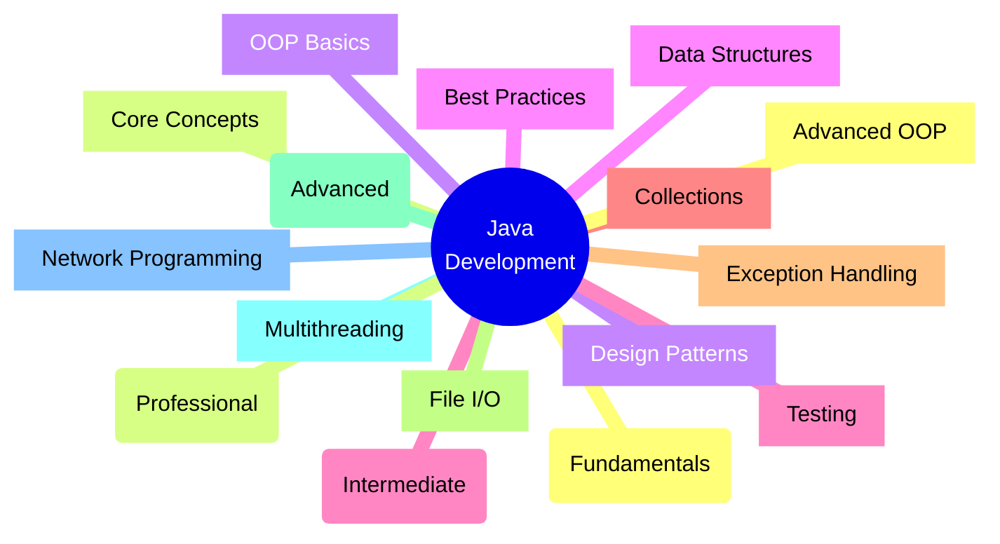
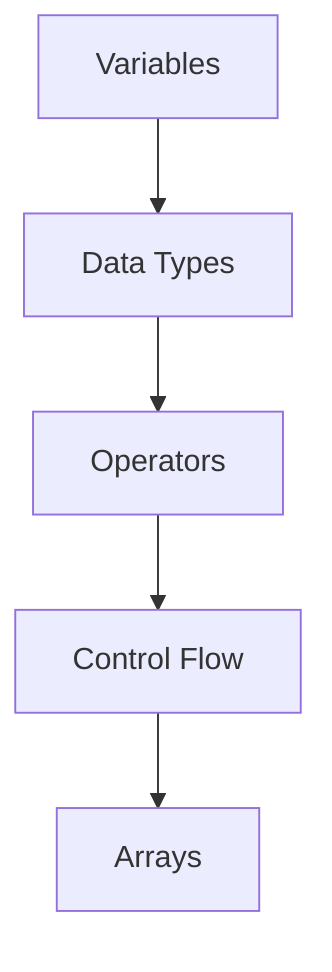
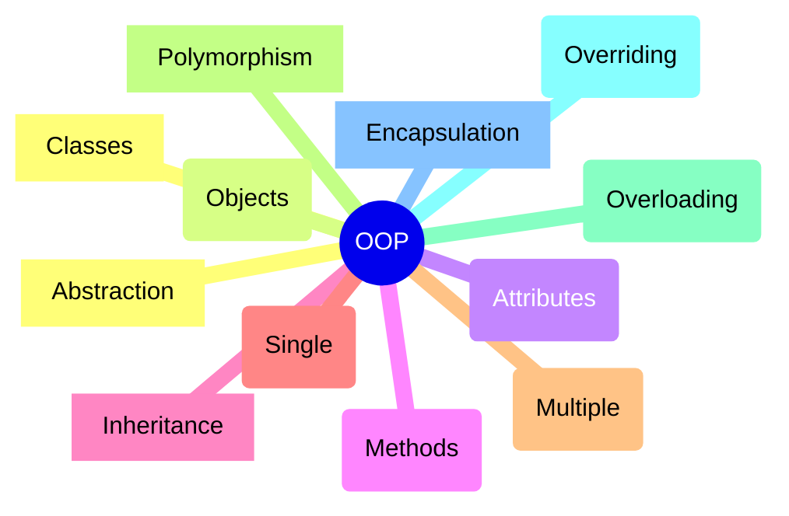
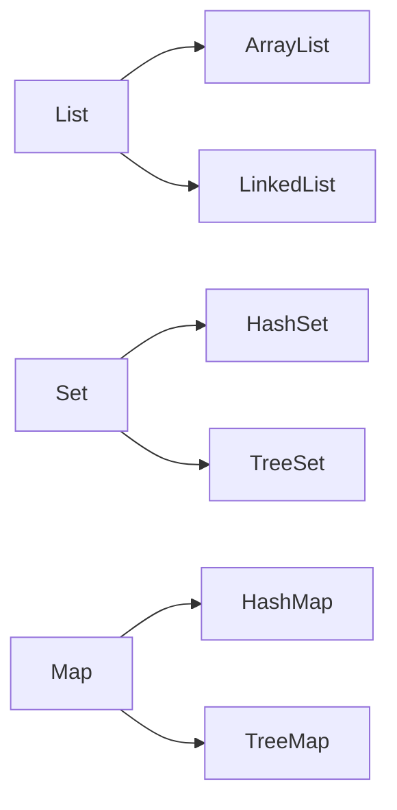
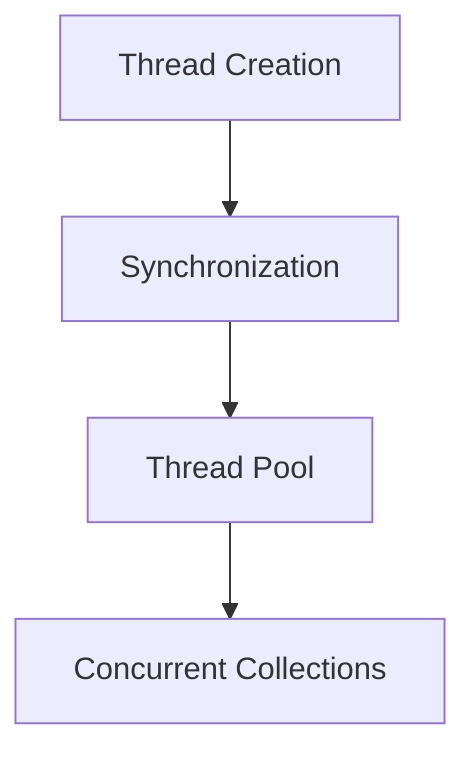

# Java Development Roadmap 🚀

> [!note] About This Roadmap
> This interactive roadmap will guide you from Java basics to advanced concepts. Track your progress using checkboxes and follow the suggested learning path. Estimated timeframes are provided for each section.

## Learning Path Overview

## 1. Foundation Phase 🌱
> [!info] Estimated Time: 4-6 weeks
> Difficulty: Beginner

### Environment Setup
- [ ] Install JDK
- [ ] Setup IDE (Eclipse/IntelliJ)
- [ ] Hello World Program

### Basic Syntax

- [ ] Variables & Data Types
- [ ] Operators
- [ ] Control Flow Statements
- [ ] Arrays and Strings

## 2. Object-Oriented Programming 🏗️
> [!info] Estimated Time: 6-8 weeks
> Difficulty: Intermediate

- [ ] Classes and Objects
- [ ] Inheritance
- [ ] Polymorphism
- [ ] Encapsulation
- [ ] Abstraction

## 3. Core Java Concepts 📚
> [!info] Estimated Time: 8-10 weeks
> Difficulty: Intermediate to Advanced

### Collections Framework

- [ ] Lists
- [ ] Sets
- [ ] Maps
- [ ] Queues

### Exception Handling
- [ ] Try-Catch Blocks
- [ ] Custom Exceptions
- [ ] Exception Hierarchy

## 4. Advanced Topics 🚁
> [!info] Estimated Time: 10-12 weeks
> Difficulty: Advanced

### Multithreading

- [ ] Thread Lifecycle
- [ ] Synchronization
- [ ] Executors
- [ ] Concurrent Collections

### Java 8+ Features
- [ ] Lambda Expressions
- [ ] Stream API
- [ ] Optional Class
- [ ] Date/Time API

## 5. Project Ideas 🎯
> [!tip] Build these projects to practice your skills

### Beginner Projects
1. [ ] Calculator Application
2. [ ] Todo List Manager
3. [ ] Address Book

### Intermediate Projects
1. [ ] Library Management System
2. [ ] Banking Application
3. [ ] Chat Application

### Advanced Projects
1. [ ] E-commerce Platform
2. [ ] Social Media Clone
3. [ ] RESTful Web Service

## 6. Best Practices ⭐
> [!important] Follow these guidelines for clean code

- [ ] SOLID Principles
- [ ] Clean Code Guidelines
- [ ] Code Documentation
- [ ] Unit Testing
- [ ] Version Control (Git)

## 7. Learning Resources 📖

### Books
- [ ] "Head First Java"
- [ ] "Effective Java"
- [ ] "Clean Code"
- [ ] "Design Patterns"

### Online Platforms
- [ ] Codecademy
- [ ] Coursera
- [ ] Udemy
- [ ] Java Documentation

### Practice Platforms
- [ ] LeetCode
- [ ] HackerRank
- [ ] CodeWars

> [!success] Progress Tracking
> Use the checkboxes to track your progress through the roadmap. Aim to complete each section before moving to the next, but feel free to explore topics that interest you most.

> [!note] Remember
> - Practice regularly
> - Build projects
> - Join Java communities
> - Read documentation
> - Share your knowledge

