# 🌊 Mumbai Beach CleanWaves Brigade: Major Components

```mermaid
mindmap
  root((Mumbai Beach CleanWaves Brigade))
    1. OceanLens 🔍
      Web Crawler
        Collects beach information from online sources
      Image Analyzer
        Processes beach photos to assess conditions
      Location Mapper
        Creates cleanliness hotspot maps
    
    2. BeachMetrics 📊
      Cleanliness Scorer
        Quantifies beach cleanliness
      Time-Based Analyzer
        Identifies temporal patterns
      Coverage Estimator
        Optimizes cleaning areas
    
    3. VolunteerForge 👥
      Volunteer Matcher
        Pairs volunteers with suitable events
      Calendar Integrator
        Syncs with personal calendars
      Notification Orchestrator
        Sends smart notifications
    
    4. ResourceNexus 🛠️
      Equipment Calculator
        Determines resource needs
      Supplier Connector
        Manages equipment procurement
      Logistics Planner
        Optimizes distribution
    
    5. CampaignCraft 📱
      Content Generator
        Creates engaging media
      Multi-Platform Publisher
        Distributes across channels
      Campaign Optimizer
        Tests for maximum impact
    
    6. EngagementPulse 📈
      Engagement Tracker
        Monitors social performance
      Sentiment Analyzer
        Evaluates public response
      Predictive Modeler
        Forecasts participation
    
    7. MissionControl 🎯
      Role Assigner
        Allocates volunteer tasks
      Task Generator
        Creates personalized activities
      Team Coordinator
        Enables real-time communication
    
    8. AchievementForge 🏆
      Points Calculator
        Rewards participation
      Leaderboard Manager
        Tracks performance
      Recognition System
        Issues digital badges
    
    9. ImpactNarrative 📝
      Data Aggregator
        Collects cleaning metrics
      Report Generator
        Visualizes achievements
      Insight Extractor
        Identifies key learnings

    Core Technology Stack
      Computer Vision (YOLOv8)
      NLP (KakushinLLM API)
      Federated Learning
      Progressive Web App
      Mobile Application
      Cloud Infrastructure

    Key Selling Points
      Hyperlocal Intelligence
      Volunteer-Centric Design
      Closed-Loop Impact
      Gamified Community Building
      Multi-Modal Data Fusion
```

## System Integration

The nine major components work together in a closed-loop system where:

1. **OceanLens** gathers beach condition data
2. **BeachMetrics** transforms this into actionable metrics
3. **VolunteerForge** recruits and organizes volunteers
4. **ResourceNexus** ensures proper equipment is available
5. **CampaignCraft** generates engaging social media content
6. **EngagementPulse** monitors campaign performance
7. **MissionControl** coordinates cleanup events in real-time
8. **AchievementForge** rewards participation with points and recognition
9. **ImpactNarrative** creates compelling impact reports

These reports feed back into OceanLens, creating a continuous improvement cycle.

## Technical Foundation

The system uses cutting-edge AI technologies including computer vision for waste detection, NLP for content generation, and federated learning for privacy-preserving analytics. The architecture combines progressive web and mobile applications with cloud infrastructure for scalability.

## Unique Approach

What sets this solution apart is its hyperlocal focus on Mumbai beaches, volunteer-centric design, closed-loop improvement system, and gamified community building that creates sustained engagement.
