# Optical Fiber Communication (OFC) Mind Map

## Overview Diagram

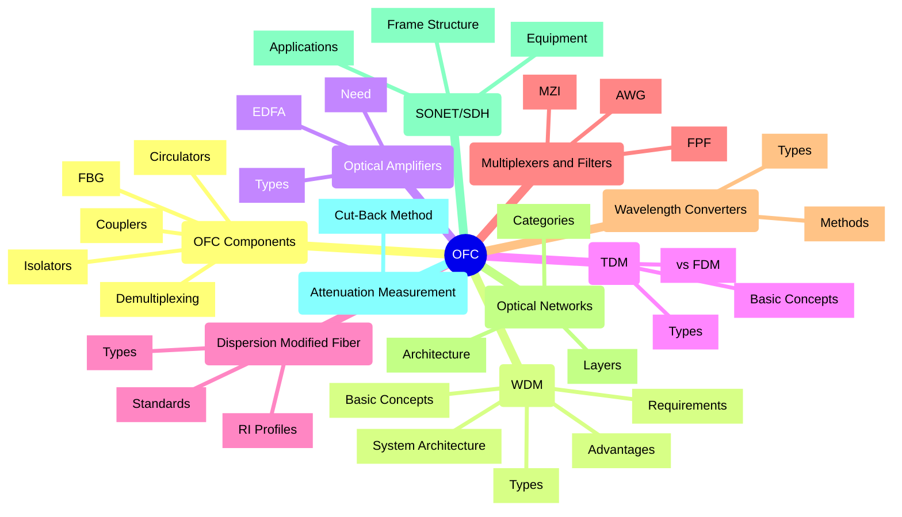

## OFC Components

### 1. Couplers

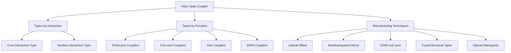
- **Definition**: Devices that distribute/combine light between fibers
- **Types**:
  - **Core interaction type**: Power transfer through fiber core cross-section
  - **Surface interaction type**: Power transfer through fiber surface normal to axis
- **Classification**:
  - **Three-port couplers**: Signal splitting and distribution
  - **Four-port couplers**: Signal splitting, distribution, and combining
  - **Star couplers**: Distribute single input to multiple outputs
  - **WDM couplers**: Multiplex/demultiplex different wavelengths
- **Manufacturing Techniques**:
  - **Lateral offset method**: Overlapping fiber end faces
  - **Semitransparent mirror method**: Beam splitter between fibers
  - **GRIN-rod lens**: Using micro-optic components
  - **Fused biconical taper (FBT)**: Fibers twisted and fused under tension
  - **Optical waveguide coupler**: Alternative technology using integrated waveguides
- **Star Coupler Techniques**:
  - **Mixer-rod**: Uses glass platelet to mix and divide light
  - **FBT methods**: Fibers bundled, twisted, heated, and pulled

### 2. Isolators

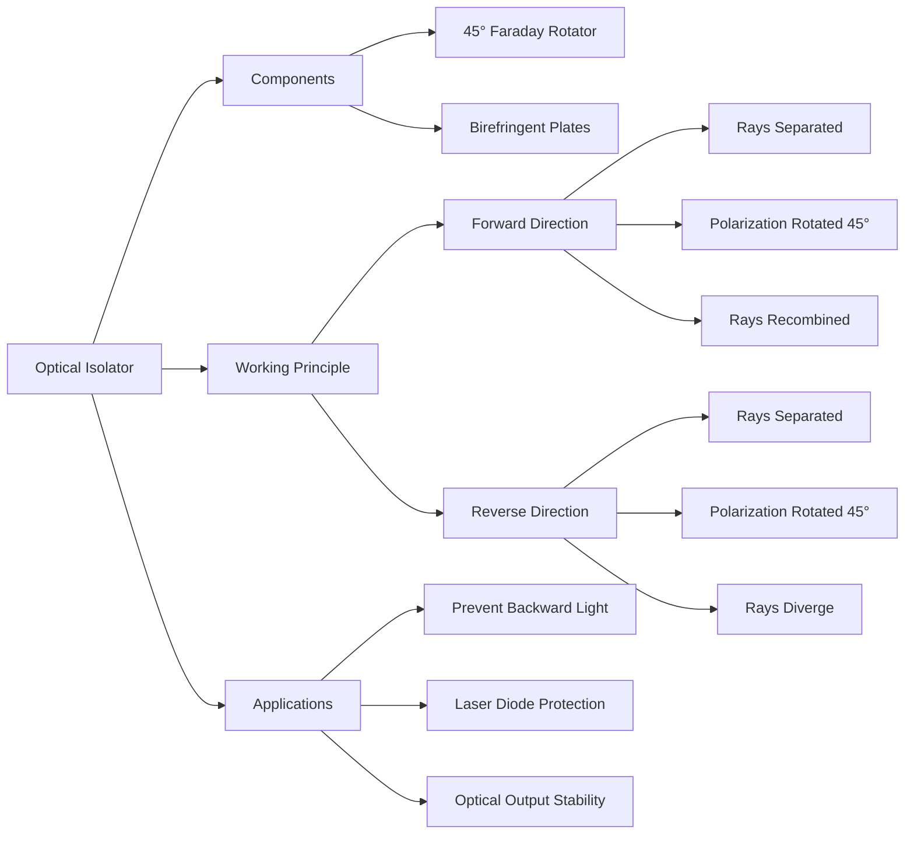


- **Definition**: Devices allowing light to pass in only one direction
- **Key Concepts**:
  - **Nonreciprocal device**: Works differently when inputs/outputs reversed
  - **Polarization**: Light represented as parallel and perpendicular vibrations
  - **Faraday rotator**: Rotates state of polarization by specific angle
  - **Birefringent materials**: Exhibit different refractive indices for different polarizations
- **Functions**:
  - Prevent scattered/reflected light from traveling backward
  - Prevent backward-traveling light from entering laser diodes
  - Maintain stability in optical output
- **Components of Polarization-Independent Isolator**:
  - 45° Faraday rotator
  - Two wedge-shaped birefringent plates (YVO4 or TiO2)
- **Working Principle**:
  - Forward direction: Rays separated, rotated, and recombined
  - Reverse direction: Rays diverge due to nonreciprocity of Faraday rotation

### 3. Circulator

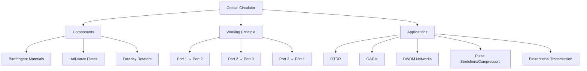

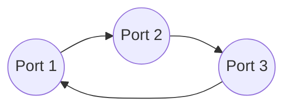
- **Definition**: Nonreciprocal multiport passive device directing light sequentially
- **Characteristics**:
  - Similar operation to isolator but more complex construction
  - Typically has 3-4 input/output ports
- **Components**:
  - Birefringent materials
  - Half-wave plates
  - Faraday rotators
- **Working Principle** (3-port circulator):
  - Input on port 1 → output on port 2
  - Input on port 2 → output on port 3
  - Input on port 3 → output on port 1
- **Applications**:
  - Optical time domain reflectometer (OTDR)
  - Optical add-drop multiplexer (OADM)
  - Dense wavelength division multiplexing (DWDM) networks
  - Pulse stretchers/compressors
  - Dispersion compensators
  - Bidirectional transmission over single fiber

### 4. Fiber Bragg Grating (FBG)

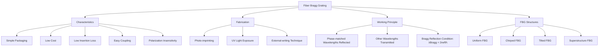

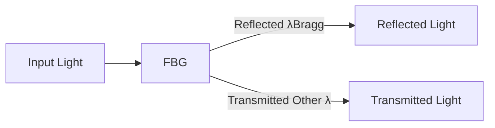
- **Definition**: In-fiber passive optical band reject filter
- **Grating Principles**:
  - Periodic structure/perturbation in material
  - Reflects/transmits light based on wavelength
  - Types: Reflecting or transmitting gratings
- **Characteristics of FBG**:
  - Simple packaging
  - Low cost and insertion loss (0.3 dB)
  - Easy coupling with other fibers
  - Polarization insensitivity
  - Low temperature coefficient
- **Fabrication**:
  - Photo-imprinting process using UV light (244 nm)
  - External-writing technique with two UV beams
  - Creates permanent reflective Bragg grating in core
- **Working Principle**:
  - Phase-matched wavelengths reflected
  - Other wavelengths transmitted
  - Bragg reflection condition: λBragg = 2neffΛ
- **FBG Structures and Applications**:
  - **Uniform FBG**: Wavelength filtering, optical sensing, fiber lasers
  - **Chirped FBG**: Dispersion compensation, pulse shaping
  - **Tilted FBG**: Mode coupling, biosensing, polarization control
  - **Superstructure FBG**: Multi-wavelength filtering, OCDMA, laser stabilization

### 5. Demultiplexing
- **Simple function**: Separates different wavelengths from combined signal

## WDM (Wavelength Division Multiplexing)

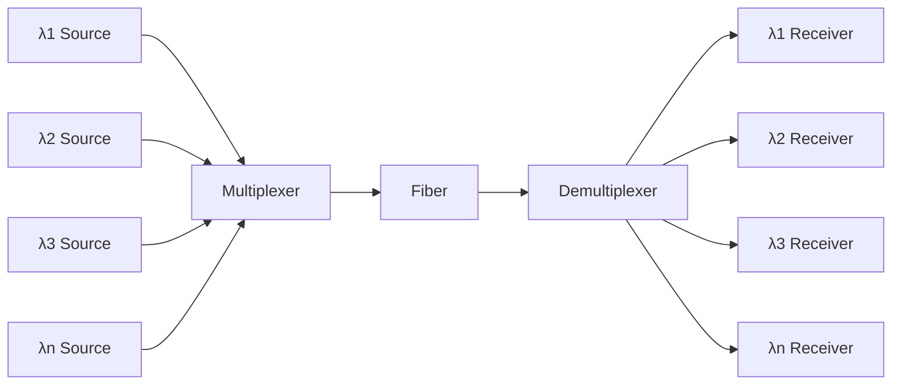

### 1. Basic Concepts
- **Definition**: Technique using multiple light wavelengths to send data over same medium
- **Bandwidth Utilization**: 1.2-1.6 μm low-loss bandwidth = 30 THz capacity
- **Comparison with TDM**: More practical than TDM for exploiting bandwidth
- **ITU Standard G.692**:
  - Reference frequency: 193.100 THz (1552.524 nm)
  - Spacing: 100 GHz (approx. 0.8 nm at 1552 nm)

### 2. System Architecture
- **Components**:
  - Multiple wavelength sources
  - Multiplexers
  - Transmission fiber
  - Demultiplexers
  - Receivers
- **Signal Flow**: Multiple modulated wavelengths → multiplexer → fiber → demultiplexer → receivers

### 3. Types

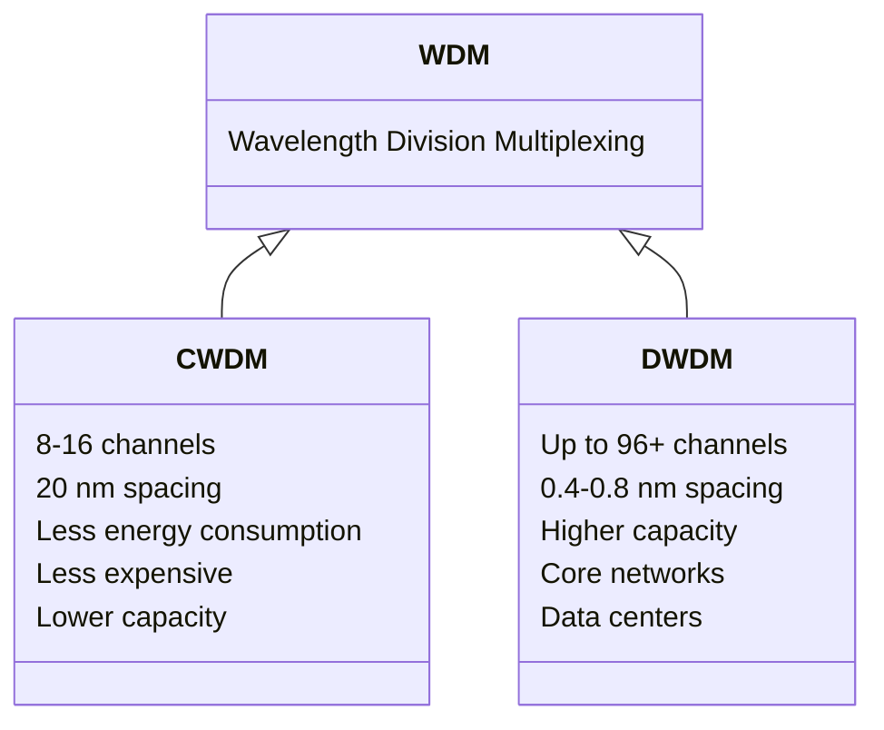
- **CWDM (Coarse WDM)**:
  - 8-16 channels
  - 20 nm channel spacing
  - Less energy consumption
  - Less expensive
  - Lower capacity and distance
- **DWDM (Dense WDM)**:
  - Up to 96+ channels
  - 0.4 nm (100 GHz) or 0.8 nm (50 GHz) spacing
  - Higher capacity
  - Used in core networks and data centers

### 4. Advantages
- **Capacity Upgrade**: Add wavelengths without changing infrastructure
- **Transparency**: Format independent transmission
- **Wavelength Routing**: Wavelength can be used as address
- **Wavelength Switching**: Efficient bandwidth utilization
- **Infrastructure Efficiency**: Optimizes existing fiber infrastructure
- **Parallel Transmission**: Multiple data streams on single fiber

### 5. Requirements/Technologies
- **Fiber**: Dispersion-shifted/flattened fiber with low dispersion
- **Lasers**: Tunable/multi-wavelength lasers
- **Amplifiers**: Broadband optical amplifiers (EDFA, SOA)
- **Wavelength-Dependent Devices**: Filters, switches, reflectors
- **Integrated Components**: Switches, couplers
- **Gratings**: Fiber Bragg gratings, arrayed waveguide gratings

## Optical Amplifiers

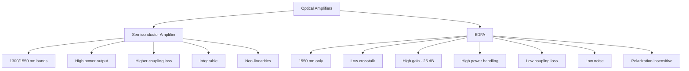

### 1. Need for Optical Amplifiers
- **Power Budget**: Compensates for fiber loss
- **Rise Time Budget**: Accounts for pulse broadening
- **Repeater Spacing**: Optical amplifiers can replace expensive repeaters
- **S/N Ratio**: Primary factor in determining repeater location

### 2. Types of Optical Amplifiers
- **Semiconductor Amplifier (LASER-based)**:
  - Available for 1300/1550 nm bands
  - High power output
  - Higher coupling loss
  - Integrable
  - Non-linearities (disadvantage)
- **EDFA (Fiber-based)**:
  - 1550 nm only
  - Low crosstalk
  - High gain (25 dB)
  - High power handling
  - Low coupling loss
  - Low noise
  - Polarization insensitive

### 3. EDFA (Erbium Doped Fiber Amplifier)

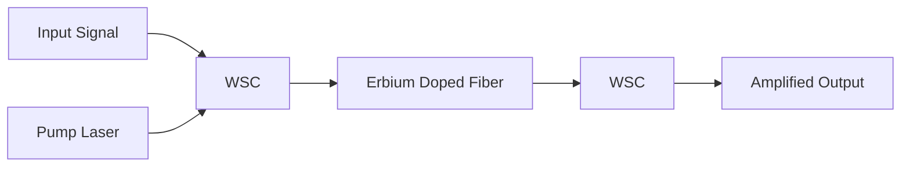

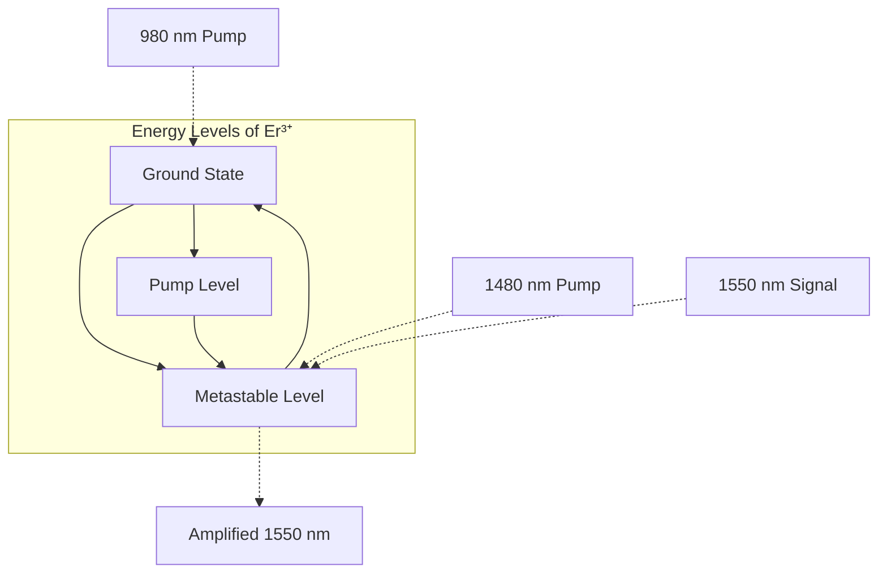
- **Definition**: Silica fiber doped with Erbium ions
- **Function**: Increases optical signal intensity without electrical conversion
- **Significance of Erbium**:
  - Er³⁺ ions emit in 1540 nm band (lowest power loss)
  - Absorb pump light and emit photons at 1540 nm
  - Provide high gain
- **Optical Pumping**:
  - Requires 3+ energy levels
  - Pump wavelength < signal wavelength
  - Pump wavelengths: 980 nm, 1480 nm
  - Emission wavelengths: 1550-1600 nm
- **Architecture**:
  - Co-directional: Signal and pump in same direction
  - Counter-directional: Signal and pump in opposite directions
  - Components: Wavelength selective coupler, pump laser, erbium-doped fiber

## TDM (Time Division Multiplexing)

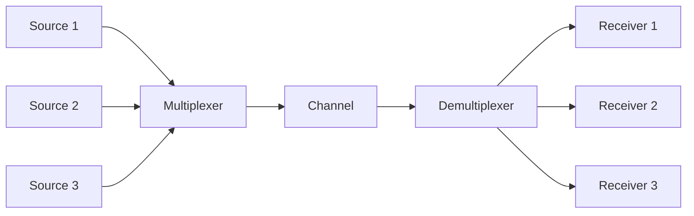

```mermaid
gantt
    title TDM Time Slots
    dateFormat s
    axisFormat %S
    
    section Channel
    Source 1    :a1, 0, 1s
    Source 2    :a2, after a1, 1s
    Source 3    :a3, after a2, 1s
    Source 1    :a4, after a3, 1s
    Source 2    :a5, after a4, 1s
    Source 3    :a6, after a5, 1s
```

### 1. Basic Concepts
- **Definition**: Method allowing multiple signals to share single channel by time slot division
- **Working Principle**: Channel divided into time slots, each signal transmitted during allocated slot
- **Examples**:
  - Multiple users sharing printer
  - Intersection traffic lights
  - Digital TV broadcasting

### 2. Types
- **Synchronous TDM**:
  - Fixed time slots synchronized with transmitter's clock
  - Used in digital telecommunications networks
- **Statistical TDM**:
  - Variable time slots based on data amount
  - More efficient channel usage
  - Used in computer networks and broadband services
- **Asynchronous TDM**:
  - Time slots transmitted asynchronously
  - Allows different data rates on same channel
  - Used in telecommunications and computer networks

### 3. Comparison with FDM
- **TDM**: Signals added in time domain, occupy entire bandwidth
- **FDM**: Signals added in frequency domain, occupy different slots
- **TDM**: Preferred for digital signals, requires synchronization
- **FDM**: Preferred for analog signals, no synchronization required
- **TDM**: Less severe crosstalk, only few channels affected by fading
- **FDM**: Suffers from crosstalk due to imperfect BPF, all channels affected by fading

## Dispersion Modified Fiber

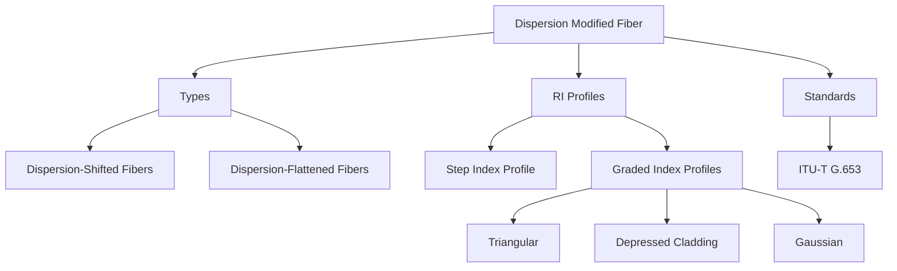

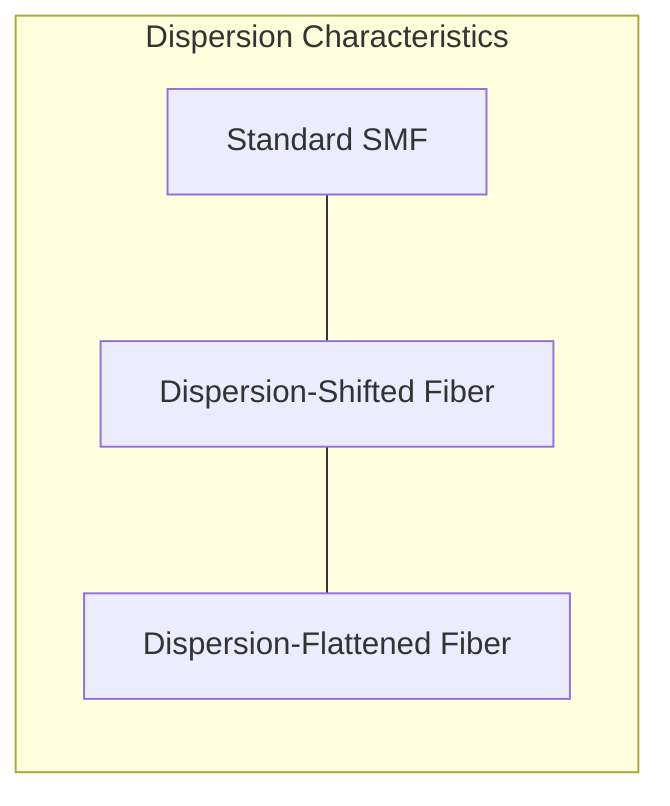

### 1. Basic Concepts
- **Purpose**: Modify dispersion characteristics by tailoring fiber parameters
- **Trade-off**: Between material dispersion (MD) and waveguide dispersion (WD)
- **Principle**: MD and WD components of opposite sign can cancel at longer wavelengths

### 2. Types
- **Dispersion-Shifted Fibers (DSFs)**:
  - Reduced core diameter
  - Increased relative index difference
  - Zero dispersion at 1.55 μm wavelength
- **Dispersion-Flattened Fibers (DFFs)**:
  - Low-dispersion window over 1.3-1.6 μm
  - Multilayer index profiles
  - Increased waveguide dispersion
  - Overall dispersion < 2 ps/nm/km
  - Two wavelengths of zero total chromatic dispersion

### 3. Refractive Index Profiles
- **Step Index Profile**:
  - Typical values: 4.4 μm core diameter, 0.012 fractional index difference
  - Shift to longer wavelength by reducing core diameter and increasing index difference
- **Graded Index Profiles**:
  - Triangular profile: Simple, low loss at 1.56 μm
  - Depressed cladding triangular profile: Reduced microbending losses
  - Gaussian profile: Low losses at 1.55 μm

### 4. Standards and Performance
- **ITU-T G.653 Standard**:
  - Attenuation: 0.22-0.24 dB/km at 1.55 μm
  - Dispersion: 0-2.7 ps/nm/km at 1.55 μm
- **DFF Designs**:
  - W fiber index profile (double clad)
  - Triple clad (TC) and quadruple clad (QC) structures
  - Segmented-core designs

## Multiplexers and Filters

### 1. Wavelength Selection Technologies
- **Optical Filters**:
  - Simple filter: 2-port device selecting one wavelength
  - Multiplexer: Combines signals at different wavelengths
  - Demultiplexer: Separates wavelengths to different outputs
- **Wavelength Crossconnects (WXCs)**:
  - Static WXC: Fixed crossconnect pattern
  - Dynamic WXC: Combines optical switches with mux/demux

### 2. Key Characteristics of Optical Filters
- Low insertion losses
- Polarization-independent operation
- Temperature-insensitive passband
- Flat passbands and sharp skirts
- Cost considerations:
  - Integrated-optic waveguide technology
  - All-fiber devices

### 3. Fabry-Perot Filter (FPF)

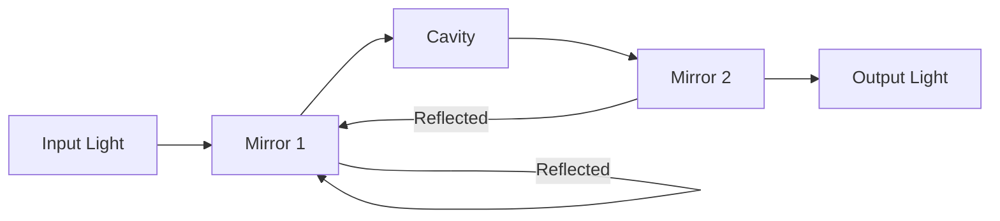

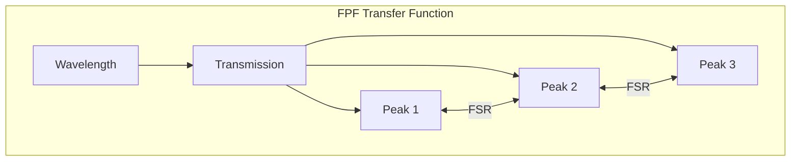
- **Structure**: Cavity formed by two highly reflective parallel mirrors
- **Working Principle**:
  - Light passes through cavity
  - Resonant wavelengths add in phase
  - Resonant wavelengths = integral multiple of λ/2 in cavity
- **Power Transfer Function**:
  - Periodic in frequency
  - Free Spectral Range (FSR): Spectral range between successive passbands
  - FWHM: Full width at half maximum
  - Finesse (F): Ratio of FSR to FWHM
- **Tunability Methods**:
  - Changing cavity length
  - Varying refractive index
  - Mechanical tuning
  - Piezoelectric material

### 4. Mach-Zehnder Interferometer (MZI)

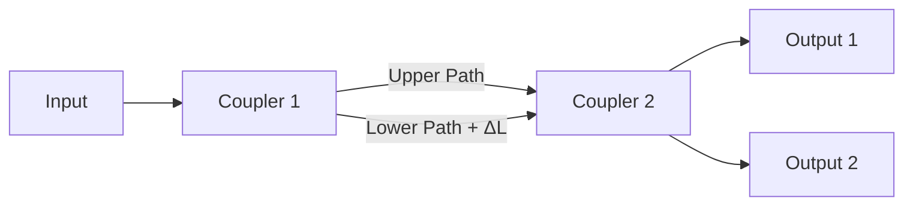

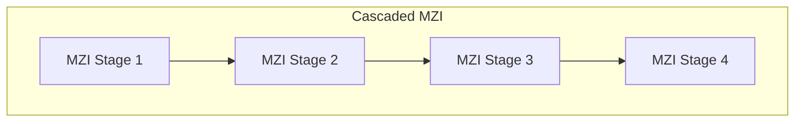
- **Structure**: Two 3 dB directional couplers interconnected through paths of different lengths
- **Materials**: Silicon substrate with silica/doped silica waveguides
- **Applications**:
  - Filters and (de)multiplexers
  - Wide band filters
  - Wavelength band separation
  - Tunable filters (temperature variation)
- **Working Principle**:
  - Input signal power divided between two arms
  - Phase shift introduced due to path difference
  - Constructive/destructive interference at outputs based on wavelength

### 5. Arrayed Waveguide Grating (AWG)

```mermaid
flowchart LR
    I[Input Waveguides] --> FPR1[Free Propagation Region 1]
    FPR1 --> AWG[Arrayed Waveguides]
    AWG --> FPR2[Free Propagation Region 2]
    FPR2 --> O[Output Waveguides]
```

```mermaid
graph TD
    subgraph "AWG Working Principle"
        direction LR
        I[Input λ1,λ2,λ3] --> A[AWG]
        A --> O1[Output λ1]
        A --> O2[Output λ2]
        A --> O3[Output λ3]
    end
```
- **Structure**: Two multiport couplers interconnected by array of waveguides
- **Function**: Generalization of MZI with multiple phase-shifted copies
- **Applications**:
  - n×1 wavelength multiplexer
  - 1×n wavelength demultiplexer
- **Advantages over MZI chain**:
  - Lower loss
  - Flatter passband
  - Easier fabrication on integrated-optic substrate
- **Components**:
  - Input waveguide
  - Free propagation region (FPR)
  - Arrayed waveguides with fixed length differences
  - Output waveguide
- **Working Principle**:
  - Each waveguide carries copy of signal with different phase delay
  - Constructive interference separates wavelengths
  - Works in reverse for multiplexing

## Wavelength Converters

```mermaid
flowchart TD
    A[Wavelength Converter] --> B[Classification]
    A --> C[Conversion Methods]
    
    B --> B1[Fixed-input, Fixed-output]
    B --> B2[Variable-input, Fixed-output]
    B --> B3[Variable-input, Variable-output]
    
    C --> C1[Opto-electronic]
    C --> C2[Optical Gating]
    C --> C3[Interferometric]
    C --> C4[Wave-Mixing]
    
    C1 --> C1a[R: Regeneration]
    C1 --> C1b[2R: Regeneration + Reshaping]
    C1 --> C1c[3R: Regeneration + Reshaping + Retiming]
    
    C2 --> C2a[Cross Gain Modulation]
    
    C3 --> C3a[Cross-Phase Modulation]
    
    C4 --> C4a[Four Wave Mixing]
    C4 --> C4b[Difference Frequency Generation]
```

### 1. Basic Concepts
- **Definition**: Device converting data from one wavelength to another
- **Uses**: WDM networks, improve wavelength utilization
- **Classification**:
  - Fixed-input, fixed-output
  - Variable-input, fixed-output
  - Variable-input, variable-output

### 2. Conversion Methods
- **Opto-electronic**:
  - R: Regeneration without reshaping/retiming
  - 2R: Regeneration with reshaping
  - 3R: Regeneration with reshaping and retiming
- **Optical Gating**:
  - Uses fixed input, variable output
  - Based on intensity change of input signal
  - Cross Gain Modulation (CGM) in SOA
- **Interferometric Techniques**:
  - Produces non-inverted output
  - Increases extinction ratio
  - Uses Cross-Phase Modulation
  - Converts phase modulation to intensity modulation
- **Wave-Mixing Techniques**:
  - Four Wave Mixing
  - Difference Frequency Generation (DFG)
  - Preserves phase and gain modulation

## Optical Networks

```mermaid
flowchart TD
    A[Optical Networks] --> B[Components]
    A --> C[Layered Hierarchy]
    A --> D[Categories]
    A --> E[Challenges]
    
    B --> B1[User Equipment]
    B --> B2[Access Network]
    B --> B3[Metro Network]
    B --> B4[Core Network]
    
    C --> C1[Physical Layer]
    C --> C2[Wavelength Layer]
    C --> C3[Optical Path Layer]
    C --> C4[Network Control Layer]
    
    D --> D1[Long Haul, Metro, Access, Data Center]
    D --> D2[Passive Optical Networks and FTTH]
    D --> D3[Optical Interconnects and DCI]
    D --> D4[Wireless Fronthauling]
    
    E --> E1[Cost of Deployment]
    E --> E2[Signal Loss and Dispersion]
    E --> E3[Complex Network Management]
    E --> E4[Cybersecurity Threats]
    E --> E5[Scaling Issues]
    E --> E6[Interoperability]
```

### 1. Introduction
- **Definition**: Communication system using light through optical fibers
- **Advantages**:
  - Exceptional bandwidth
  - Low latency
- **Key Components**:
  - User equipment
  - Access network
  - Metro network
  - Core network

### 2. Layered Hierarchy
- Physical Layer: Light signal transmission
- Wavelength Layer: Wavelength allocation
- Optical Path Layer: End-to-end light paths
- Network Control Layer: Routing, fault recovery, resource optimization

### 3. Categories
- Long Haul, Metro, Access, Data center
- Passive Optical Networks and FTTH
- Optical interconnects and DCI
- Wireless fronthauling

### 4. Challenges
- Cost of deployment
- Signal loss and dispersion
- Complex network management
- Cybersecurity threats
- Scaling issues
- Interoperability

## SONET/SDH

```mermaid
flowchart TD
    A[SONET/SDH] --> B[Frame Structure]
    A --> C[Network Equipment]
    A --> D[Layers]
    A --> E[Applications]
    
    B --> B1[SONET STS-1: 9 rows × 90 columns]
    B --> B2[SDH STM-1: 9 rows × 270 columns]
    B --> B3[Transport Overhead]
    B --> B4[Synchronous Payload Envelope]
    B --> B5[Path Overhead]
    
    C --> C1[STS Mux/Demux]
    C --> C2[Regenerator]
    C --> C3[Add/Drop Multiplexer]
    
    D --> D1[Path Layer]
    D --> D2[Line Layer]
    D --> D3[Section Layer]
    D --> D4[Photonic Layer]
    
    E --> E1[B-ISDN and ATM Architecture]
    E --> E2[High-speed Voice/Data Transmission]
    E --> E3[Telecommunication Systems]
```

```mermaid
graph TD
    subgraph "SONET Frame"
        direction TB
        TOH[Transport Overhead<br>3 columns] --- SPE[Synchronous Payload Envelope<br>87 columns]
        SPE --- POH[Path Overhead<br>1 column]
        SPE --- Payload[Payload<br>86 columns]
    end
```

### 1. Introduction
- **Definition**: Standardized protocols transferring digital bit streams over optical fiber
- **SONET**: Used in North America, defined by ANSI
- **SDH**: Used elsewhere, defined by ETSI and ITU
- **Key Concept**: Single clock (PRC) handles timing across entire network

### 2. Key Terms
- **STSs**: Synchronous Transport Signals (electrical)
- **OCs**: Optical Carriers (optical)
- **STM**: Synchronous Transport Module (SDH equivalent)
- **SPE**: Synchronous Payload Envelope
- **Layers**: Section, Line, Path

### 3. Transmission Formats and Rates
- **SONET**: STS hierarchy (STS-1 base rate: 51.84 Mbps)
- **SDH**: STM hierarchy (STM-1 base rate: 155.52 Mbps = STS-3)
- **Equivalence**: STM-1 = STS-3

### 4. Network Equipment
- **STS Mux/Demux**: Path terminating equipment
- **Regenerator**: Repeater improving signal quality
- **Add/Drop Multiplexer**: Adds/removes signals
- **Layer Functions**:
  - Path Layer: Source to destination
  - Line Layer: Across physical line
  - Section Layer: Across physical section
  - Photonic Layer: Physical medium

### 5. Frame Structure
- **SONET STS-1 Frame**:
  - 9 rows × 90 columns
  - 125 μs duration (8 kHz sampling rate)
  - First 3 columns: Transport Overhead
  - Remaining 87 columns: SPE (including Path Overhead)
- **SDH STM-1 Frame**:
  - 9 rows × 270 columns
  - 125 μs duration

### 6. Overhead Components
- **Section Overhead**:
  - Framing octets (A1, A2)
  - Section trace (J0)
  - Parity (B1)
  - Order wire (E1)
  - User channel (F1)
  - Data communication channel (D1-D3)
- **Line Overhead**:
  - Pointers (H1, H2, H3)
  - APS channel (K1, K2)
  - Data communication channel (D4-D12)
  - Synchronization messaging (S1)
  - REI (M0, M1)
- **Path Overhead**:
  - Path trace (J1)
  - Path BIP (B3)
  - Signal label (C2)
  - Path status (G1)
  - User channel (F2)
  - Multi-frame indicator (H4)
  - Growth octets (Z3, Z4)
  - N1 fields

### 7. Virtual Tributaries and Pointers
- **VT**: Partial payload inserted into STS-1
- **Pointers**: Indicate location of multiplexed payload within frame

### 8. Optical Interfaces
- **Categories of Fibers**:
  - Graded index multimode (1310 nm)
  - Conventional non-dispersion single mode (1310/1550 nm)
  - Dispersion shifted single mode (1550 nm)
- **Optical Sources**: LED, multimode laser, single mode laser
- **Parameters**: Receiver sensitivities, transmission distances

### 9. Applications
- Architecture for B-ISDN and ATM
- High-speed transmission of voice/data
- Telecommunication systems

## Attenuation Measurement

```mermaid
flowchart LR
    LS[Light Source] --> CH[Chopper]
    CH --> M[Monochromator]
    M --> BS[Beam Splitter]
    BS --> VO[Viewing Optics]
    BS --> F[Fiber Under Test]
    F --> MS[Mode Scrambler]
    MS --> CMS[Cladding Mode Stripper]
    CMS --> PD[Photodetector]
    PD --> LA[Lock-in Amplifier]
    LA --> O[Output Measurement]
```

```mermaid
flowchart TD
    subgraph "Cut-Back Method"
        M1[Measure Full Length] --> C[Cut Fiber to Short Length]
        C --> M2[Measure Short Length]
        M2 --> CA[Calculate Attenuation]  
    end
```

### 1. Introduction
- **Attenuation**: Reduction in light intensity during propagation
- **Importance**: Critical for system design and fiber development
- **Components**: Absorption, bending, scattering losses
- **Wavelength Dependence**: Total attenuation varies with wavelength

### 2. Cut-Back Method
- **Equipment**:
  - White light source (tungsten halogen/xenon)
  - Mechanical chopper
  - Monochromator
  - Beam splitter
  - Mode scrambler
  - Cladding mode stripper
  - Index-matched photodetector
  - Lock-in amplifier
- **Process**:
  - Light focused and mechanically chopped
  - Specific wavelength selected by monochromator
  - Reference signal provided by beam splitter
  - Measurement taken at full length
  - Fiber cut back to short length
  - Measurement repeated
  - Attenuation calculated from difference
