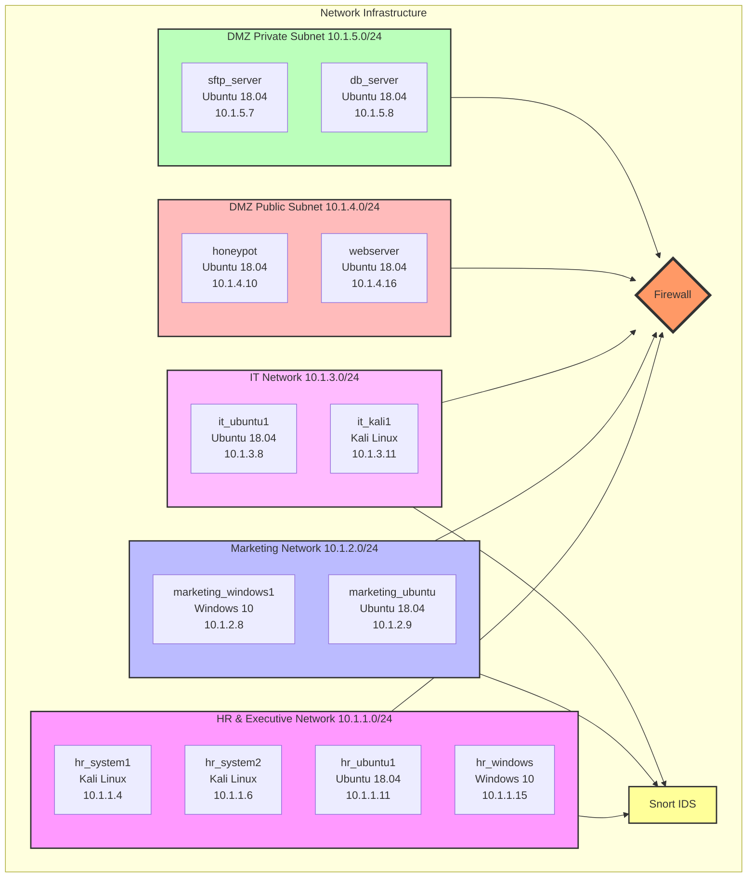

**Todo**
- [ ] Yash friend App 
- [ ] Lora Mobile App (Final Year)
- [ ] Hackathon Registration for SGGS
- [ ] College Main Website Development
- [ ] Discuss the Board and Dashboard Design
- [ ] VPC creation in  2 Labs
- [ ] Palo alto book reading for container sec
- [ ] Self Hosted Docker Registry
- [ ] Azure & AWS CI/CD Pipeline

