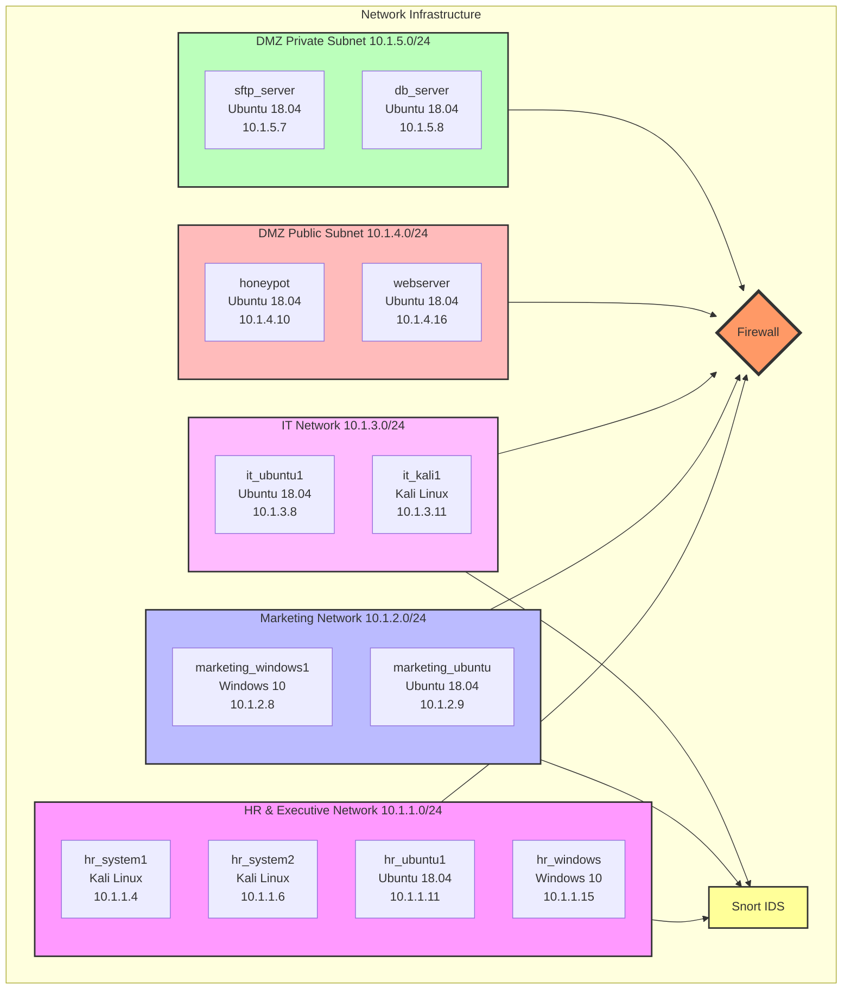
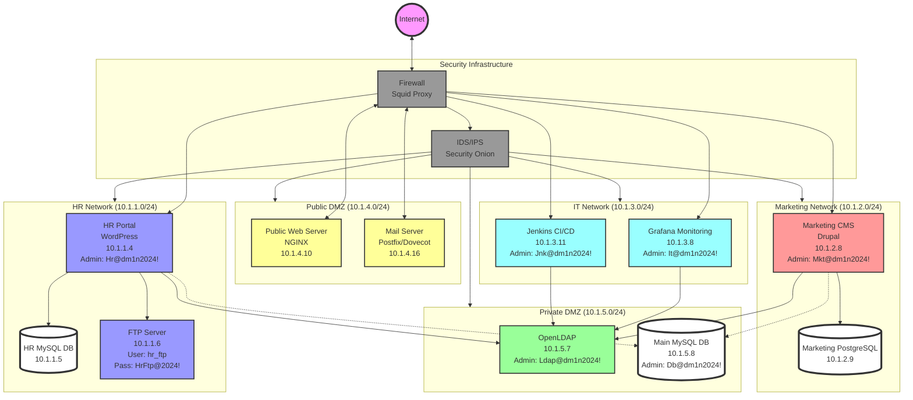
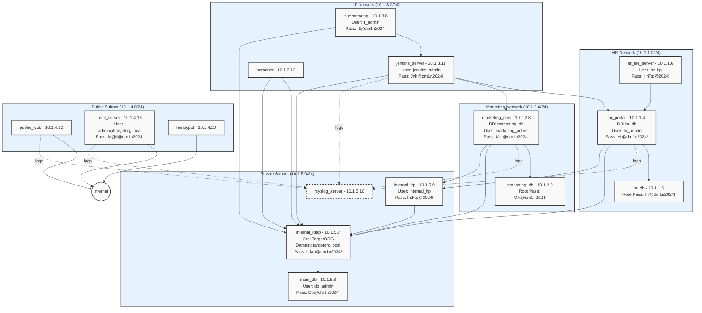

**Todo**
- [ ] Yash friend App 
- [ ] Lora Mobile App (Final Year)
- [ ] Hackathon Registration for SGGS
- [ ] College Main Website Development
- [ ] Discuss the Board and Dashboard Design
- [ ] VPC creation in  2 Labs
- [ ] Palo alto book reading for container sec
- [ ] Self Hosted Docker Registry
- [ ] Azure & AWS CI/CD Pipeline








# NEW ONE

```mermaid

flowchart LR
    subgraph Public-DMZ["Public DMZ (10.1.4.0/24)"]
        direction TB
        web[Public Web\nNGINX\n10.1.4.10]
        mail[Mail Server\n10.1.4.16\nmail:M@il@dm1n2024!]
    end

    subgraph Private-DMZ["Private DMZ (10.1.5.0/24)"]
        direction TB
        ldap[OpenLDAP\n10.1.5.7\nLdap@dm1n2024!]
        maindb[(Main MySQL\n10.1.5.8\ndb_admin:Db@dm1n2024!)]
    end

    subgraph HR["HR Network (10.1.1.0/24)"]
        direction TB
        hrportal[WordPress Portal\n10.1.1.4\nhr_admin:Hr@dm1n2024!]
        hrdb[(HR MySQL\n10.1.1.5)]
        hrftp[FTP Server\n10.1.1.6\nhr_ftp:HrFtp@2024!]
    end

    subgraph Marketing["Marketing Network (10.1.2.0/24)"]
        direction TB
        mktcms[Drupal CMS\n10.1.2.8\nmarketing_admin:Mkt@dm1n2024!]
        mktdb[(PostgreSQL\n10.1.2.9)]
    end

    subgraph IT["IT Network (10.1.3.0/24)"]
        direction TB
        grafana[Grafana\n10.1.3.8\nit_admin:It@dm1n2024!]
        jenkins[Jenkins\n10.1.3.11\njenkins_admin:Jnk@dm1n2024!]
        portainer[Portainer\n10.1.3.12]
    end

    %% Database connections
    hrportal --> hrdb
    mktcms --> mktdb
    hrportal -.-> maindb
    mktcms -.-> maindb

    %% Authentication flows
    hrportal --> ldap
    mktcms --> ldap
    grafana --> ldap
    jenkins --> ldap
    portainer --> ldap

    %% File server connections
    hrportal --> hrftp

    %% Styling
    classDef public fill:#ffccd5,stroke:#495057,stroke-width:2px;
    classDef private fill:#caf0f8,stroke:#495057,stroke-width:2px;
    classDef hr fill:#dee2ff,stroke:#495057,stroke-width:2px;
    classDef marketing fill:#ffd7ba,stroke:#495057,stroke-width:2px;
    classDef it fill:#c1fba4,stroke:#495057,stroke-width:2px;
    classDef database fill:#f8f9fa,stroke:#495057,stroke-width:4px,stroke-dasharray: 5 5;

    class web,mail public;
    class ldap,maindb private;
    class hrportal,hrdb,hrftp hr;
    class mktcms,mktdb marketing;
    class grafana,jenkins,portainer it;
    class hrdb,mktdb,maindb database;
```


# Next V1



```mermaid
		HRP["hr_portal - 10.1.1.4<br/>DB: hr_db<br/>User: hr_admin<br/>Pass: Hr@dm1n2024!"]
        HRDB["hr_db - 10.1.1.5<br/>Root Pass: Hr@dm1n2024!"]
        HRFS["hr_file_server - 10.1.1.6<br/>User: hr_ftp<br/>Pass: HrFtp@2024!"]
        HRP --> HRDB
        HRFS --> HRP
    end

    subgraph Marketing_Network["Marketing Network (10.1.2.0/24)"]
        MKTCMS["marketing_cms - 10.1.2.8<br/>DB: marketing_db<br/>User: marketing_admin<br/>Pass: Mkt@dm1n2024!"]
        MKTDB["marketing_db - 10.1.2.9<br/>Root Pass: Mkt@dm1n2024!"]
        MKTCMS --> MKTDB
    end

    subgraph IT_Network["IT Network (10.1.3.0/24)"]
        ITM["it_monitoring - 10.1.3.8<br/>User: it_admin<br/>Pass: It@dm1n2024!"]
        JKS["jenkins_server - 10.1.3.11<br/>User: jenkins_admin<br/>Pass: Jnk@dm1n2024!"]
        PTN["portainer - 10.1.3.12"]
    end

    subgraph Public_Subnet["Public Subnet (10.1.4.0/24)"]
        PUBW["public_web - 10.1.4.10"]
        MAIL["mail_server - 10.1.4.16<br/>User: admin@targetorg.local<br/>Pass: M@il@dm1n2024!"]
        HNP["honeypot - 10.1.4.20"]
    end

    subgraph Private_Subnet["Private Subnet (10.1.5.0/24)"]
        LDAP["internal_ldap - 10.1.5.7<br/>Org: TargetORG<br/>Domain: targetorg.local<br/>Pass: Ldap@dm1n2024!"]
        MAINDB["main_db - 10.1.5.8<br/>User: db_admin<br/>Pass: Db@dm1n2024!"]
        INTFTP["internal_ftp - 10.1.5.9<br/>User: internal_ftp<br/>Pass: IntFtp@2024!"]
        RSYSLOG["rsyslog_server - 10.1.5.10"]
    end

    %% External Connections
    Internet(("Internet"))
    PUBW --> Internet
    MAIL --> Internet
    HNP --> Internet

    %% Service Dependencies
    ITM --> JKS
    JKS --> HRP
    JKS --> MKTCMS
    PTN --> LDAP

    %% Logging
    HRP -.->|logs| RSYSLOG
    MKTCMS -.->|logs| RSYSLOG
    JKS -.->|logs| RSYSLOG
    MAIL -.->|logs| RSYSLOG
    PUBW -.->|logs| RSYSLOG

    %% Authentication
    LDAP --> MAINDB
    HRP --> LDAP
    MKTCMS --> LDAP
    ITM --> LDAP
    JKS --> LDAP
    PTN --> LDAP
    INTFTP --> LDAP

    %% File Storage
    HRP --> INTFTP
    MKTCMS --> INTFTP

    %% Styling
    classDef default fill:#f9f9f9,stroke:#333,stroke-width:2px
    classDef network fill:#e6f3ff,stroke:#333,stroke-width:2px
    classDef logging stroke-dasharray: 5 5
    
    class HR_Network,Marketing_Network,IT_Network,Public_Subnet,Private_Subnet network
    class RSYSLOG logging
        HRP["hr_portal - 10.1.1.4<br/>DB: hr_db<br/>User: hr_admin<br/>Pass: Hr@dm1n2024!"]
        HRDB["hr_db - 10.1.1.5<br/>Root Pass: Hr@dm1n2024!"]
        HRFS["hr_file_server - 10.1.1.6<br/>User: hr_ftp<br/>Pass: HrFtp@2024!"]
        HRP --> HRDB
        HRFS --> HRP
    end

    subgraph Marketing_Network["Marketing Network (10.1.2.0/24)"]
        MKTCMS["marketing_cms - 10.1.2.8<br/>DB: marketing_db<br/>User: marketing_admin<br/>Pass: Mkt@dm1n2024!"]
        MKTDB["marketing_db - 10.1.2.9<br/>Root Pass: Mkt@dm1n2024!"]
        MKTCMS --> MKTDB
    end

    subgraph IT_Network["IT Network (10.1.3.0/24)"]
        ITM["it_monitoring - 10.1.3.8<br/>User: it_admin<br/>Pass: It@dm1n2024!"]
        JKS["jenkins_server - 10.1.3.11<br/>User: jenkins_admin<br/>Pass: Jnk@dm1n2024!"]
        PTN["portainer - 10.1.3.12"]
    end

    subgraph Public_Subnet["Public Subnet (10.1.4.0/24)"]
        PUBW["public_web - 10.1.4.10"]
        MAIL["mail_server - 10.1.4.16<br/>User: admin@targetorg.local<br/>Pass: M@il@dm1n2024!"]
        HNP["honeypot - 10.1.4.20"]
    end

    subgraph Private_Subnet["Private Subnet (10.1.5.0/24)"]
        LDAP["internal_ldap - 10.1.5.7<br/>Org: TargetORG<br/>Domain: targetorg.local<br/>Pass: Ldap@dm1n2024!"]
        MAINDB["main_db - 10.1.5.8<br/>User: db_admin<br/>Pass: Db@dm1n2024!"]
    end

    %% External Connections
    Internet(("Internet"))
    PUBW --> Internet
    MAIL --> Internet
    HNP --> Internet

    %% IT Services Dependencies
    ITM --> JKS
    JKS --> HRP
    JKS --> MKTCMS
    PTN --> LDAP

    %% Authentication
    LDAP --> MAINDB

    %% Styling
    classDef default fill:#f9f9f9,stroke:#333,stroke-width:2px
    classDef network fill:#e6f3ff,stroke:#333,stroke-width:2px
    
    class HR_Network,Marketing_Network,IT_Network,Public_Subnet,Private_Subnet network
```
