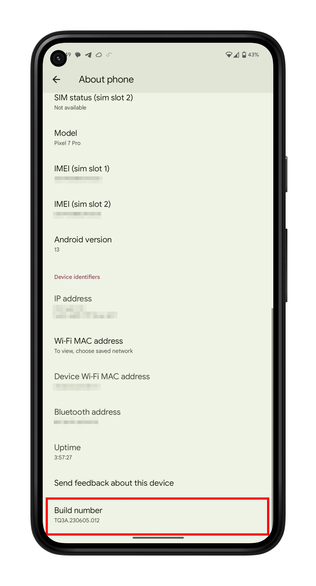
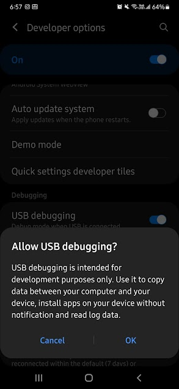
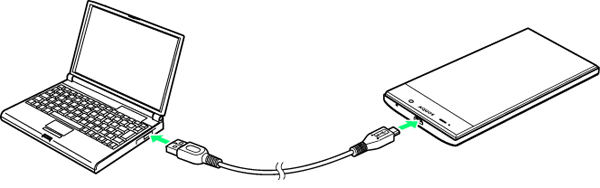
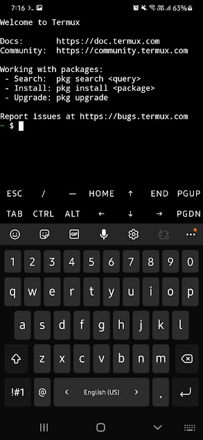

# Lab Practical - 5
## Remote Mobile Control and Wireless Communication

**Subject:** MWC - Mobile Wireless Communication  
**Practical Title:** Remote Mobile Control via ADB and Wireless Debugging  
**Duration:** 2 Hours  

---

## 📋 **Objective**

This practical demonstrates the implementation of remote mobile device control using Android Debug Bridge (ADB) and wireless debugging capabilities. Students will learn to establish both wired and wireless connections between PC and Android devices for remote control, file management, and system monitoring.

## 🛠️ **Apparatus Required**

### Hardware Requirements:
- [ ] PC/Laptop with Windows/Linux OS
- [ ] Android smartphone (API level 16+)
- [ ] USB Cable (compatible with mobile device)
- [ ] Wi-Fi network (for wireless connection)

### Software Requirements:
- [ ] ADB (Android Debug Bridge)
- [ ] SCRCPY (Screen Copy utility)
- [ ] Termux (Android Linux emulator)
- [ ] Windows Package Manager (Winget) - for Windows users

---

## 🔧 **Pre-requisites and Setup**

### System Requirements Check:
- Windows 10/11 or Ubuntu 18.04+
- Minimum 4GB RAM
- USB 2.0 or higher port
- Network connectivity

---

## 📚 **Theory**

Android Debug Bridge (ADB) is a versatile command-line tool that facilitates communication between a computer and Android device. It enables developers and power users to:
- Install and debug applications
- Access device shell commands
- Transfer files between devices
- Monitor system performance
- Control device functions remotely

**SCRCPY** is an open-source screen mirroring application that provides display and control of Android devices connected via USB or TCP/IP.

---

## 🧪 **Part A: Wired Remote Mobile Control**

### Step 1: Install Required Software

#### For Windows Users:

1. **Install SCRCPY via Winget:**
   ```bash
   winget install scrcpy
   ```
   
   
   
   > **Note:** If Winget is not available, install from: https://learn.microsoft.com/en-us/windows/package-manager/winget/

#### For Ubuntu Users:

2. **Install SCRCPY via APT:**
   ```bash
   sudo apt update && sudo apt install scrcpy
   ```

### Step 2: Install Android Debug Bridge (ADB)

1. **Download ADB Platform Tools:**
   - Visit: https://developer.android.com/tools/releases/platform-tools
   - Download the appropriate package for your OS
   - Extract the ZIP file to a directory (e.g., `C:\platform-tools\`)

2. **Add ADB to Environment Variables:**
   
   
   
   - Add the platform-tools directory to your system PATH

3. **Verify ADB Installation:**
   ```bash
   adb version
   ```
   
   

### Step 3: Enable Developer Options on Android Device

1. **Access Developer Mode:**
   - Navigate to `Settings` → `About Phone`
   - Locate `Build Number` and tap it 7 times
   - Developer Options will be enabled
   
   

2. **Enable USB Debugging:**
   - Go to `Settings` → `Developer Options`
   - Toggle `USB Debugging` to ON
   
   

### Step 4: Establish Physical Connection

1. **Connect Device via USB:**
   
   
   
2. **Grant Debugging Permissions:**
   
   
   
3. **Verify Device Recognition:**
   ```bash
   adb devices
   ```
   
   
   
   > **Troubleshooting:** If device shows as "unauthorized", check Android screen for permission prompt and tap "Allow"

### Step 5: Launch Screen Mirroring

1. **Start SCRCPY:**
   ```bash
   scrcpy
   ```
   
   

**✅ Result:** Mobile screen should now be mirrored on PC with full control capabilities.

---

## 🧪 **Part B: Wireless Remote Mobile Control**

### Step 1: Network Preparation

1. **Ensure Network Connectivity:**
   - Connect both PC and mobile device to the same Wi-Fi network
   - Verify network stability

### Step 2: Install Termux on Android

1. **Download Termux:**
   - Open Google Play Store
   - Search for "Termux"
   - Install the application
   
   

2. **Launch Termux:**
   
   

### Step 3: Obtain Mobile Device IP Address

1. **Get Network Information:**
   ```bash
   ifconfig
   ```
   
   
   
   > **Note:** Record the IP address (e.g., `10.10.51.71`)

### Step 4: Verify Network Connectivity

1. **Ping Test from PC:**
   ```bash
   ping 10.10.51.71
   ```
   
   

### Step 5: Enable Wireless Debugging

1. **Access Wireless Debugging:**
   - Navigate to `Settings` → `Developer Options`
   - Find `Wireless Debugging` option
   
   

2. **Grant Network Permission:**
   
   

3. **Note Connection Details:**
   - Open `Wireless Debugging` settings
   - Record the port number displayed
   
   
   

### Step 6: Establish Wireless ADB Connection

1. **Connect via ADB:**
   ```bash
   adb connect <ip_address>:<port>
   ```
   
   **Example:**
   ```bash
   adb connect 10.10.51.71:34605
   ```
   
   

2. **Verify Connection Notification:**
   
   

### Step 7: Launch Wireless Screen Mirroring

1. **Start SCRCPY Wirelessly:**
   ```bash
   scrcpy
   ```
   
   

### Step 8: Access Android Shell

1. **Enter ADB Shell:**
   ```bash
   adb shell
   ```
   
   

**✅ Result:** Wireless connection established with full remote control capabilities.

---

## 📱 **Part C: Advanced ADB Operations**

### File Management and App Control

#### Install/Uninstall Applications:
```bash
# Install APK file
adb install <path_to_apk>

# Uninstall application
adb uninstall <package_name>
```

#### File Transfer Operations:
```bash
# Push file to device
adb push <local_path> <remote_path>

# Pull file from device
adb pull <remote_path> [<local_path>]
```

### Device Monitoring and Information

#### Capture Screenshots and Recordings:
```bash
# Take screenshot
adb shell screencap -p /sdcard/screenshot.png

# Record screen
adb shell screenrecord /sdcard/record.mp4
```

#### System Monitoring:
```bash
# View real-time logs
adb logcat

# Generate bug report
adb bugreport

# List installed packages
adb shell pm list packages

# Inspect system services
adb shell dumpsys
```

### Device Control Functions

#### System Operations:
```bash
# Reboot to recovery
adb reboot recovery

# Reboot to fastboot
adb reboot fastboot

# Create backup
adb backup
```

#### Advanced Communication Functions:

1. **Open URL in Browser:**
   ```bash
   adb shell am start -a android.intent.action.VIEW -d <URL>
   ```
   
   

2. **Send SMS:**
   ```bash
   adb shell "am start -a android.intent.action.SENDTO -d sms:PHONE_NUMBER --es sms_body 'YOUR_MESSAGE'; sleep 2; input keyevent 22; input keyevent 66"
   ```

3. **Initiate Phone Call:**
   ```bash
   adb shell "am start -a android.intent.action.CALL -d tel:+919028992643; sleep 3;"
   ```

4. **Real-time Log Monitoring:**
   ```bash
   adb logcat
   ```

---

## 📊 **Observations and Results**

### Part A - Wired Connection:
- [ ] ADB successfully installed and configured
- [ ] USB debugging enabled on Android device
- [ ] Physical connection established
- [ ] Screen mirroring functional
- [ ] Device control responsive

### Part B - Wireless Connection:
- [ ] Network connectivity verified
- [ ] Termux installed and functional
- [ ] IP address successfully obtained
- [ ] Wireless debugging enabled
- [ ] ADB wireless connection established
- [ ] Wireless screen mirroring operational

### Part C - Advanced Operations:
- [ ] File transfer operations successful
- [ ] Application management functional
- [ ] System monitoring capabilities verified
- [ ] Communication functions operational

---

## 🔍 **Troubleshooting Guide**

| **Issue** | **Possible Cause** | **Solution** |
|-----------|-------------------|--------------|
| ADB not recognized | PATH not configured | Add platform-tools to system PATH |
| Device unauthorized | USB debugging permission | Allow debugging on Android device |
| Wireless connection failed | Network connectivity | Verify same Wi-Fi network |
| SCRCPY not launching | Device not detected | Check `adb devices` output |
| Poor screen mirroring quality | Network bandwidth | Use wired connection or improve Wi-Fi signal |

---

## 💡 **Practical Applications**

1. **Mobile App Development:** Testing and debugging applications
2. **Device Management:** Remote administration of Android devices
3. **Digital Forensics:** Data extraction and analysis
4. **Automation:** Scripted device control and testing
5. **Presentation:** Screen sharing and demonstration
6. **Technical Support:** Remote troubleshooting

---

## 🎯 **Learning Outcomes**

Upon completion of this practical, students will be able to:
- Configure and use ADB for device communication
- Establish both wired and wireless connections to Android devices
- Implement screen mirroring and remote control functionality
- Perform advanced device management operations
- Troubleshoot common connectivity issues
- Apply remote control techniques in real-world scenarios

---

## 📝 **Assignment Questions**

1. Explain the difference between wired and wireless ADB connections. What are the advantages and disadvantages of each method?

2. Describe the security implications of enabling USB debugging and wireless debugging on Android devices.

3. List and explain five practical applications of remote mobile control in mobile wireless communication.

4. What is the role of SCRCPY in mobile device mirroring, and how does it differ from other screen sharing solutions?

5. Demonstrate how you would use ADB to automate a series of actions on an Android device for testing purposes.

---

## 📚 **References**

1. Android Developers Documentation - ADB Guide
2. SCRCPY Official Repository and Documentation
3. Termux Wiki and Command Reference
4. Mobile Wireless Communication - Technical Standards
5. Android Debug Bridge Command Reference Manual

---

