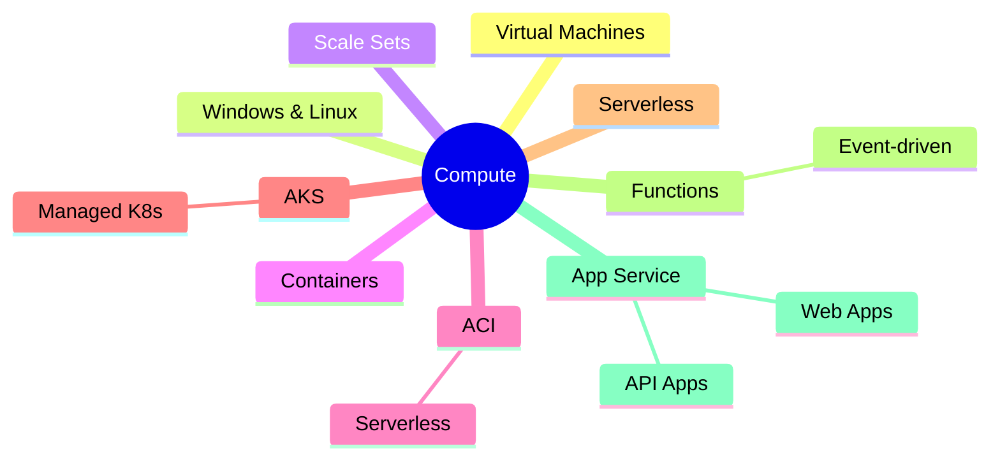
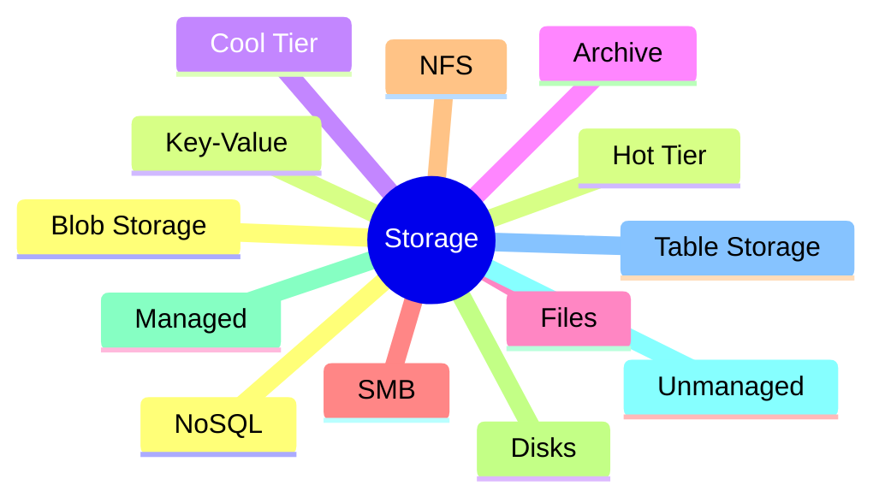
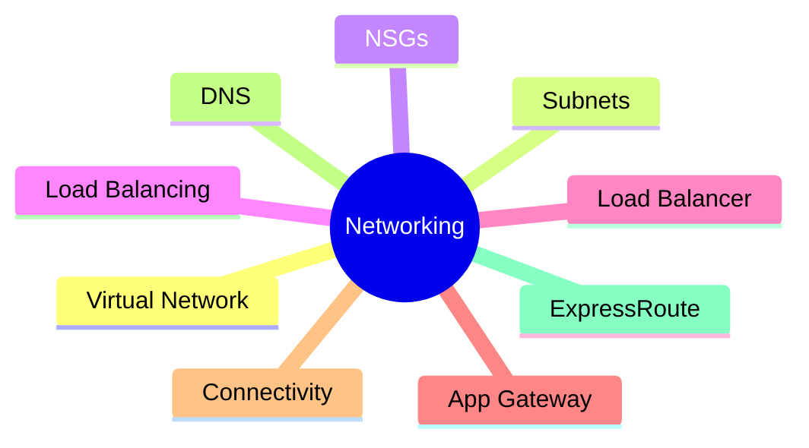
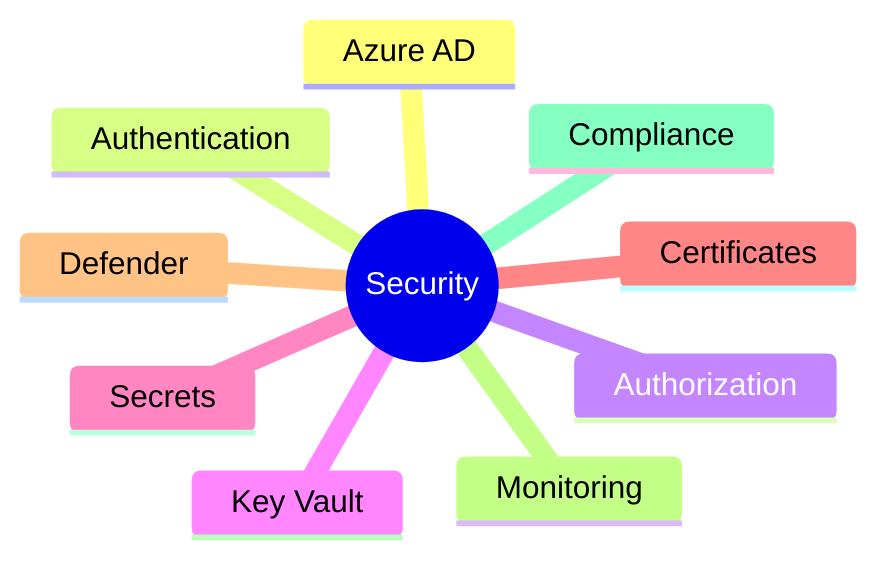
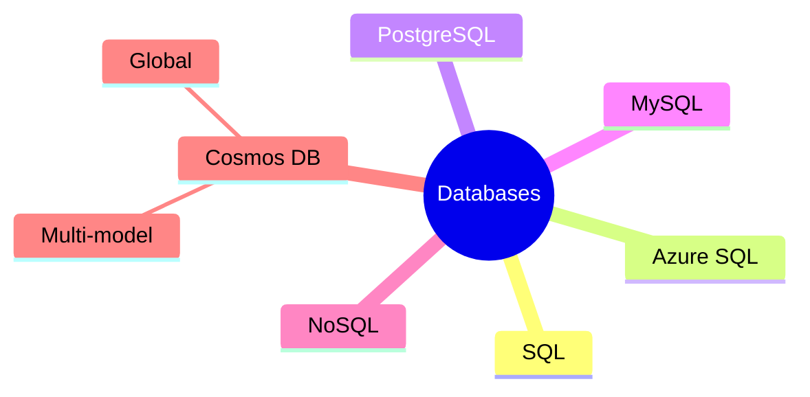
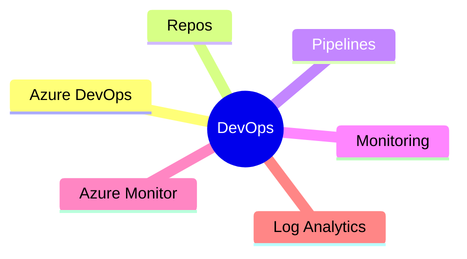
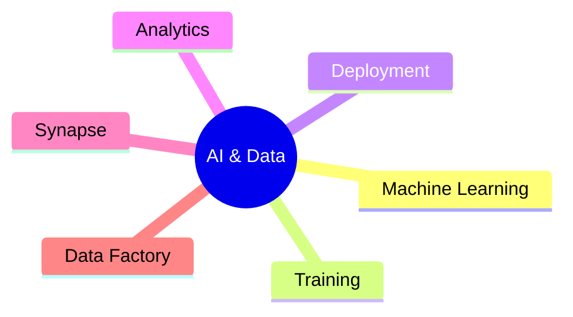

# Azure Cloud Mind Map 🧠☁️

## 1️⃣ Compute 🖥️

- **Azure Container Instances (ACI)** - Serverless container deployment
- **Azure Kubernetes Service (AKS)** - Managed Kubernetes service
- **Azure Functions** - Serverless computing platform
- **Azure App Service** - PaaS for web applications

## 2️⃣ Storage 📦

- **Azure Files** - Managed SMB file shares
- **Azure Disks** - Block storage for VMs
- **Azure Table Storage** - NoSQL key-value store

## 3️⃣ Networking 🌐

- **Azure Load Balancer** - Traffic distribution service
- **Azure Application Gateway** - Layer 7 load balancing
- **Azure DNS** - Managed DNS service
- **Azure ExpressRoute** - Dedicated private connections

## 4️⃣ Identity & Security 🔒

- **Azure Key Vault** - Secure secrets and key management
- **Microsoft Defender for Cloud** - Security monitoring and management

## 5️⃣ Databases 🗄️

- **Azure Cosmos DB** - Globally distributed NoSQL database
- **Azure Database for PostgreSQL/MySQL** - Managed database services

## 6️⃣ DevOps & Monitoring 🚀

- **Azure Monitor** - Comprehensive monitoring solution
- **Azure Log Analytics** - Log collection and analysis

## 7️⃣ AI, ML, and Big Data 🤖📊

- **Azure Synapse Analytics** - Enterprise data warehousing
- **Azure Data Factory** - Data integration service

## Getting Started 🎯
1. **Create a free Azure account** - Get $200 credits for 30 days
2. **Familiarize yourself with the Azure Portal**
3. **Try deploying an Azure VM**
4. **Explore storage by creating a Blob Storage container**
5. **Experiment with Azure Functions**

