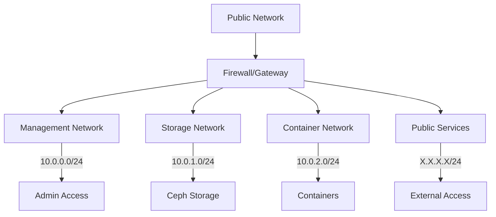
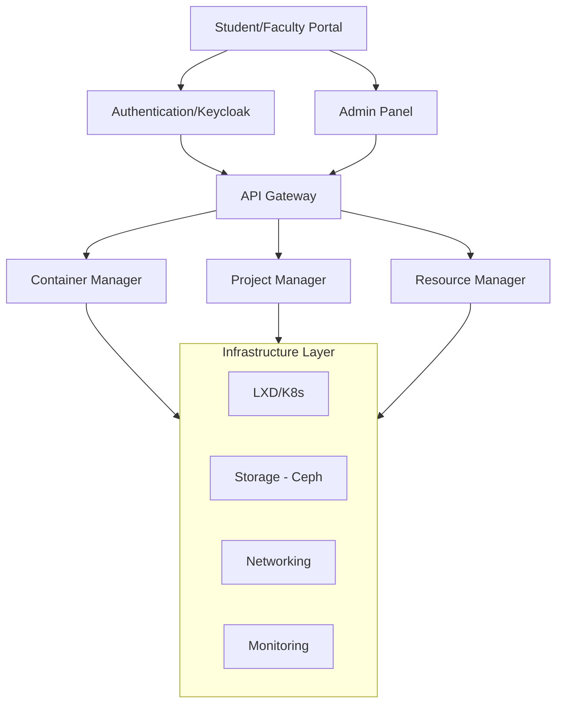
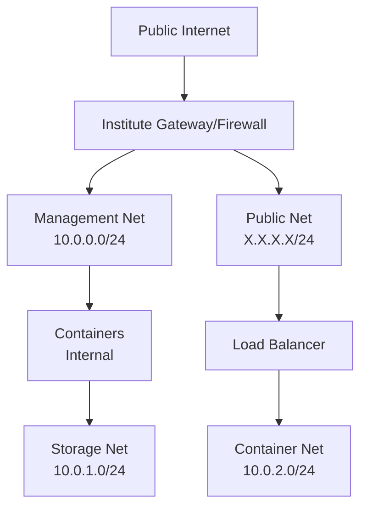
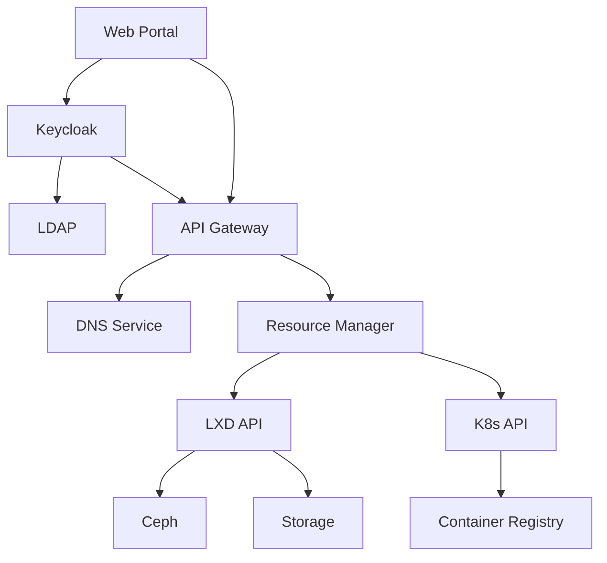

# 🚀 VPC Service Deployment Guide

> [!NOTE]
> This document provides a comprehensive guide for implementing a Virtual Private Cloud (VPC) service infrastructure. Follow each phase sequentially for optimal deployment.

## Table of Contents
1. [[#Infrastructure|🏗️ Infrastructure]]
2. [[#Storage|💾 Storage Layer]]
3. [[#Containers|🐳 Container Platform]]
4. [[#Authentication|🔐 Authentication]]
5. [[#Management|⚙️ Container Management]]
6. [[#Access|🔑 Remote Access]]
7. [[#Portal|🌐 Student Portal]]
8. [[#Faculty|👨‍🏫 Faculty Tools]]
9. [[#Monitoring|📊 Monitoring & Logging]]
10. [[#Automation|🤖 Automation & CI/CD]]
11. [[#Backup|💾 Backup & Recovery]]
12. [[#Security|🔒 Security]]
13. [[#Integration|🔄 System Integration]]
14. [[#DNS|🌍 DNS Management]]
15. [[#Workflow|⚡ Development Workflow]]
16. [[#Architecture|📐 System Architecture]]
17. [[#Entities|📋 Entity Relationships]]
18. [[#Guacamole|💻 Guacamole Integration]]
19. [[#Portfolio|📂 Project Portfolio]]

> [!TIP] 
> Click on any section in the table of contents to jump directly to it.

---

# 🏗️ Phase 1: Infrastructure {: #Infrastructure}

> [!INFO]
> This phase establishes the fundamental infrastructure components required for the VPC service.

## Server Hardware Requirements

> [!IMPORTANT]
> These specifications are minimum requirements for a production environment. Scale resources based on expected workload.

### Minimum Requirements (Production)

#### Hardware Per Server
| Component    | Specification |
|--------------|---------------|
| Servers      | 3+ for HA     |
| CPU          | 16+ cores     |
| RAM          | 128GB+        |
| OS Storage   | 1TB+ SSD      |
| Ceph Storage | 4TB+          |
| Network      | 2x 10GbE NICs |

### 2. Network Setup

> [!TIP]
> Proper network segmentation is crucial for security and performance.



#### Network Configuration:
1. Create VLANs:
    - Management Network: 10.0.0.0/24
    - Storage Network: 10.0.1.0/24
    - Container Network: 10.0.2.0/24
    - Public Network: X.X.X.X/24 (Your public IP range)

2. Configure Network Security:
    - Setup firewall rules
    - Configure VLANs on switches
    - Setup SDN (Software-Defined Networking)

### 3. Operating System Setup
```bash
# On all nodes:
1. Install Ubuntu Server 22.04 LTS
2. Configure network interfaces
3. Update system
4. Configure NTP
```

## Phase 2: Storage Layer (Ceph)

### 1. Ceph Installation
```bash
# On all storage nodes
sudo apt install -y ceph-common ceph-mon ceph-osd

# On the first node (ceph-admin)
sudo ceph-deploy new node1 node2 node3
sudo ceph-deploy mon create-initial
sudo ceph-deploy osd create node1:/dev/sdb node2:/dev/sdb node3:/dev/sdb
```

### 2. Storage Pool Configuration
```bash
# Create pools
sudo ceph osd pool create volumes 128
sudo ceph osd pool create images 128
sudo ceph osd pool create backups 128
```

## Phase 3: Container Platform (LXD)

### 1. LXD Installation
```bash
# On all nodes
sudo snap install lxd
sudo lxd init --auto

# Configure LXD Clustering
sudo lxc cluster create cluster-name
```

### 2. LXD Storage Configuration
```bash
# Configure Ceph storage backend
sudo lxc storage create ceph-pool ceph \
    ceph.cluster_name=ceph \
    ceph.user_name=admin \
    source=volumes
```

### 3. LXD Network Configuration
```bash
# Create networks
sudo lxc network create lxdbr0 \
    ipv4.address=10.0.2.1/24 \
    ipv4.nat=true \
    ipv6.address=none
```

## Phase 4: Authentication (Keycloak)

### 1. Keycloak Setup
```bash
# Deploy Keycloak
sudo docker run -d \
    -p 8080:8080 \
    -e KEYCLOAK_ADMIN=admin \
    -e KEYCLOAK_ADMIN_PASSWORD=password \
    quay.io/keycloak/keycloak:latest start-dev
```

### 2. Configure Realms and Clients
1. Create new realm 'student-vpc'
2. Configure email domain restrictions
3. Setup LDAP/Active Directory integration
4. Create roles:
    - student-cloud
    - student-desktop
    - faculty
    - admin

## Phase 5: Container Management (Kubernetes)

### 1. Kubernetes Installation
```bash
# On all nodes
sudo apt install -y kubelet kubeadm kubectl

# Initialize control plane
sudo kubeadm init --pod-network-cidr=10.244.0.0/16

# Install CNI (Calico)
kubectl apply -f https://docs.projectcalico.org/manifests/calico.yaml
```

### 2. Storage Integration
```yaml
# Create StorageClass
apiVersion: storage.k8s.io/v1
kind: StorageClass
metadata:
name: ceph-rbd
provisioner: ceph.com/rbd
parameters:
monitors: 10.0.0.1:6789,10.0.0.2:6789,10.0.0.3:6789
pool: k8s-pool
adminSecretNamespace: default
adminSecretName: ceph-admin-secret
```

## Phase 6: Remote Access (Guacamole)

### 1. Guacamole Installation
```bash
# Deploy using Docker
docker run --name guacd \
    -d guacamole/guacd

docker run --name guacamole \
    -e MYSQL_DATABASE=guacamole_db \
    -e MYSQL_USER=guacamole_user \
    -e MYSQL_PASSWORD=password \
    --link guacd:guacd \
    -d guacamole/guacamole
```

### 2. Configure Guacamole
1. Setup connection templates
2. Integrate with Keycloak
3. Configure desktop profiles

## Phase 7: Student Portal

### 1. Web Interface Development
```bash
# Create React/Vue.js application with:
1. Container management interface
2. Resource monitoring
3. Course selection
4. Profile management
```

### 2. API Development
```python
# Create FastAPI/Django backend with:
1. Container management API
2. Resource tracking
3. Authentication middleware
4. Quota management
```

## Phase 8: Faculty Tools

### 1. Image Management
```bash
# Create base images
lxc launch ubuntu:22.04 template-base

# Configure and snapshot
lxc snapshot template-base snap1

# Export image
lxc publish template-base/snap1 --alias=course-python
```

### 2. Course Management Interface
1. Create image templates
2. Manage student access
3. Monitor resource usage

## Phase 9: Monitoring & Logging

### 1. Prometheus & Grafana
```bash
# Deploy monitoring stack
helm install monitoring prometheus-community/kube-prometheus-stack

# Configure dashboards for:
1. Resource usage
2. Container health
3. Student metrics
```

### 2. ELK Stack
```bash
# Deploy logging stack
helm install logging elastic/elasticsearch
helm install kibana elastic/kibana
helm install filebeat elastic/filebeat
```

## Phase 10: Automation & CI/CD

### 1. GitLab Installation
```bash
# Deploy GitLab
helm install gitlab gitlab/gitlab \
    --set global.hosts.domain=your.domain
```

### 2. CI/CD Pipeline Configuration
```yaml
# .gitlab-ci.yml example
stages:
- build
- test
- deploy

build_image:
stage: build
script:
    - lxc image build
    
deploy_containers:
stage: deploy
script:
    - kubectl apply -f manifests/
```

## Phase 11: Backup & Disaster Recovery

### 1. Configure Backups
```bash
# Setup automated backups
1. Container snapshots
2. Volume backups
3. Configuration backups
```

### 2. Disaster Recovery Procedures
1. Document recovery procedures
2. Test restoration processes
3. Create automated recovery scripts

## Phase 12: Security Hardening

### 1. System Hardening
```bash
# Apply security configurations
1. FirewallD/UFW rules
2. SELinux/AppArmor profiles
3. SSH hardening
```

### 2. Regular Updates
```bash
# Create update schedule
1. Security patches
2. System updates
3. Application updates
```

## Phase 13: System Integration and Unified Access

### 1. Domain and Subdomain Setup
```bash
vpc.spit.ac.in          # Main portal
auth.vpc.spit.ac.in     # Keycloak
guac.vpc.spit.ac.in     # Guacamole
admin.vpc.spit.ac.in    # Admin panel
*.lab.vpc.spit.ac.in    # Wildcard for student containers
*.lab.vpc.example.edu    # Legacy wildcard (to be removed)
```

### 2. Reverse Proxy Setup (Traefik)
```yaml
# docker-compose.yml
version: '3'
services:
traefik:
    image: traefik:v2.4
    command:
    - "--api.insecure=false"
    - "--providers.docker=true"
    - "--providers.docker.exposedbydefault=false"
    - "--entrypoints.websecure.address=:443"
    - "--certificatesresolvers.myresolver.acme.tlschallenge=true"
    ports:
    - "443:443"
    volumes:
    - "/var/run/docker.sock:/var/run/docker.sock:ro"
    - "./acme.json:/acme.json"
    labels:
    - "traefik.enable=true"
```

### 3. Single Admin Panel Implementation
```python
# FastAPI-based unified admin panel
from fastapi import FastAPI, Depends
from keycloak import KeycloakAdmin

app = FastAPI()

# Admin panel endpoints
@app.get("/api/v1/containers")
async def get_containers():
    # LXD container management
    pass

@app.get("/api/v1/users")
async def get_users():
    # Keycloak user management
    pass

@app.get("/api/v1/resources")
async def get_resources():
    # Resource monitoring
    pass
```

### 4. Service Integration
```bash
# Configure service communication
1. Setup internal network: 
docker network create vpc-internal

2. Connect services:
- Portal -> Keycloak (OpenID Connect)
- Portal -> LXD (REST API)
- Portal -> Kubernetes (kubectl)
- Guacamole -> Containers (Direct)

3. Configure internal DNS:
- Use CoreDNS for service discovery
- Setup internal routing
```

### 5. SSL/TLS Configuration
```bash
# Install certbot
apt install certbot

# Obtain wildcard certificate
certbot certonly --manual \
--preferred-challenges=dns \
--email admin@spit.ac.in \
--server https://acme-v02.api.letsencrypt.org/directory \
--agree-tos \
-d \"*.vpc.spit.ac.in\"\n

# Configure auto-renewal
echo "0 0 1 * * /usr/bin/certbot renew --quiet" | sudo tee -a /etc/crontab
```

### 6. Security Integration
```bash
# Configure security policies
1. Enable CORS policies:
- Restrict to *.vpc.spit.ac.in

2. Setup rate limiting:
- 100 req/min per IP
- 1000 req/min per auth user

3. Configure WAF rules:
- XSS protection
- SQL injection prevention
- SQL injection prevention 
- Request size limits
```

## Phase 14: Dynamic DNS Management

### 1. PowerDNS Setup
```bash
# Install PowerDNS and PostgreSQL
apt install -y pdns-server pdns-backend-pgsql postgresql

# Create PowerDNS database and user
sudo -u postgres psql
CREATE DATABASE pdns;
CREATE USER pdns WITH PASSWORD 'secure_password';
GRANT ALL PRIVILEGES ON DATABASE pdns TO pdns;

# Import schema
sudo -u postgres psql pdns < /usr/share/doc/pdns-backend-pgsql/schema.pgsql.sql

# Configure PowerDNS
cat > /etc/powerdns/pdns.conf << EOF
launch=gpgsql
gpgsql-host=localhost
gpgsql-user=pdns
gpgsql-dbname=pdns
gpgsql-password=secure_password
api=yes
api-key=your_secure_api_key
webserver=yes
webserver-port=8081
webserver-address=0.0.0.0
EOF
```

### 2. DNS API Configuration
```python
# DNS Management API (FastAPI)
from fastapi import FastAPI, HTTPException
import powerdns

app = FastAPI()
api_client = powerdns.PDNSApiClient(
    api_endpoint='http://localhost:8081',
    api_key='your_secure_api_key'
)

@app.post("/api/v1/dns/record")
async def create_dns_record(domain: str, record_type: str, content: str):
    try:
        zone = api_client.zones[domain]
        record_set = zone.create_record(
            name=domain,
            rtype=record_type,
            content=content
        )
        return {"status": "success", "record": record_set}
    except Exception as e:
        raise HTTPException(status_code=500, detail=str(e))
```

### 3. Container Integration
```python
# Container Lifecycle Hook
from kubernetes import client, config, watch
import requests

def container_dns_handler():
    config.load_incluster_config()
    v1 = client.CoreV1Api()
    w = watch.Watch()
    
    for event in w.stream(v1.list_pod_for_all_namespaces):
        pod = event['object']
        if event['type'] == 'ADDED':
            # Create DNS record
            create_dns_record(
                f"{pod.metadata.name}.lab.vpc.spit.ac.in",
                "A",
                pod.status.pod_ip
            )
        elif event['type'] == 'DELETED':
            # Delete DNS record
            delete_dns_record(
                f"{pod.metadata.name}.lab.vpc.example.edu"
            )
```

### 4. DNS CRUD Automation
```bash
#!/bin/bash
# DNS Record Management Script

DNS_API="http://localhost:8000/api/v1/dns"

function create_container_dns() {
    container_name=$1
    container_ip=$2
    
    curl -X POST $DNS_API/record \
        -H "Content-Type: application/json" \
        -d "{
            \"domain\\\": \\\"${container_name}.lab.vpc.spit.ac.in\\\",
            \"record_type\\\": \\\"A\\\",
            \"content\": \"${container_ip}\"
        }"
}

# Hook into LXD events
lxc config set core.https_address [::]
lxc monitor | while read line; do
    if echo $line | grep -q "started"; then
        container=$(echo $line | jq -r .metadata.source)
        ip=$(lxc list $container -f json | jq -r '.[0].state.network.eth0.addresses[0].address')
        create_container_dns $container $ip
    fi
done
```

### 5. DNS Monitoring
```yaml
# Prometheus Configuration
- job_name: 'powerdns'
static_configs:
    - targets: ['localhost:8081']
metrics_path: /metrics
scheme: http
basic_auth:
    username: pdns
    password: secure_password

# Grafana Dashboard
{
"title": "PowerDNS Monitoring",
"panels": [
    {
    "title": "DNS Queries per Second",
    "type": "graph",
    "datasource": "Prometheus",
    "targets": [
        {
        "expr": "rate(pdns_auth_queries_total[5m])"
        }
    ]
    },
    {
    "title": "Record Updates",
    "type": "graph",
    "targets": [
        {
        "expr": "rate(pdns_auth_zone_updates[5m])"
        }
    ]
    }
]
}
```

## Phase 15: Development Project Deployment Workflow

### 1. Project Container Lifecycle
```bash
# Project Container Creation Workflow
1. Student initiates project creation via portal
2. System checks resource quota:
- Available container slots
- Storage pool capacity
- Network quota
3. Container provisioning:
- Base image selection
- Resource allocation
- Network configuration
- Volume mounting
```

### 2. Resource Pool Management
```python
# Resource Tracking Service
class ResourceTracker:
    def calculate_student_usage(student_id):
        used_resources = {
            'containers': get_container_count(student_id),
            'storage': calculate_storage_usage(student_id),
            'networks': get_network_count(student_id)
        }
        return check_against_quota(used_resources)
    
    def reserve_resources(project_id, requirements):
        with transaction.atomic():
            validate_quota()
            allocate_resources()
            update_usage_metrics()
```

### 3. Project DNS Management
```python
# Project DNS Handler
class ProjectDNS:
    f"{project.name}.projects.vpc.spit.ac.in",
        # Main project subdomain
        create_dns_record(
            f\"{project.name}.projects.vpc.spit.ac.in\",
            \"A\",
            project.gateway_ip
        )
        
        # Service-specific records
        for service in project.services:
            f"{service.name}.{project.name}.projects.vpc.spit.ac.in",
                f\"{service.name}.{project.name}.projects.vpc.spit.ac.in\",
                \"A\",
                service.ip
            )
```

### 4. Student Quota Integration
```yaml
# Student Quota Configuration
quotas:
default:
    containers: 3
    storage_gb: 30
    networks: 2
    public_ips: 1

project_additional:
    storage_gb: 10
    containers: 2
    
# Quota Management Service
class QuotaManager:
    def validate_project_creation(student_id, project_spec):
        current_usage = get_student_usage(student_id)
        project_requirements = calculate_requirements(project_spec)
        return check_quota_availability(current_usage, project_requirements)
```

### 5. Project CI/CD Pipeline
```yaml
# Project Pipeline Configuration
stages:
- validate
- build
- test
- deploy
- dns_setup

validate_resources:
stage: validate
script:
    - check_student_quota
    - validate_resource_requirements
    
build_containers:
stage: build
script:
    - build_project_containers
    - push_to_registry
    
deploy_project:
stage: deploy
script:
    - apply_kubernetes_manifests
    - configure_networking
    - setup_project_dns
```

## Phase 16: System Architecture and Infrastructure Diagrams

### 1. Complete System Block Diagram



### 2. Network Topology




### 3. Service Dependency Map




### 4. Resource Flow Diagram
```
[Student Request] --> [Portal]
    |                  ^
    v                  |
[Quota Check] --> [Resource Pool]
    |                  ^
    v                  |
[Container Create] --> [Storage]
    |                  ^
    v                  |
[Network Setup] --> [DNS Update]
    |                  ^
    v                  |
[Monitor/Metrics] --> [Backup]
```

### 5. Security Architecture
```
[External Access]
    |
[WAF/DDoS Protection]
    |
[SSL Termination]
    |
[Authentication Layer]
    |
+-----+------+
|            |
v            v
[RBAC]    [Network ACLs]
|            |
v            v
[Resources]  [Services]
|            |
v            v
[Audit Logs] [Monitoring]
```

## Phase 17: System Entity Relationships and Privileges

### 1. Entity Relationship Diagram
```

+---------------+     +----------------+     +---------------+
|    Student    |     |    Project     |     |   Container   |
+---------------+     +----------------+     +---------------+
| id (PK)       |     | id (PK)        |     | id (PK)       |
| email         |<-+  | name           |     | name          |
| role_id (FK)  |  |  | student_id(FK) |<-+  | project_id(FK)|
| quota_id (FK) |  |  | created_at     |  |  | image_id (FK) |
| created_at    |  |  | status         |  |  | status        |
+---------------+  |  +----------------+  |  | ip_address    |
    ^           |         ^            |  | dns_record    |
    |           |         |            |  +---------------+
+---------------+ |  +----------------+  |         ^
|     Role      | |  |    Resource    |  |         |
+---------------+ |  +----------------+  |  +---------------+
| id (PK)       | |  | id (PK)        |  |  |    Image      |
| name          | |  | project_id(FK) |  |  +---------------+
| permissions   | |  | type           |  |  | id (PK)       |
+---------------+ |  | amount         |  |  | name          |
    ^          |  | created_at     |  |  | created_by    |
    |          |  +----------------+  |  | type          |
+---------------+|                     |  +---------------+
|    Quota      ||   +----------------+|          ^
+---------------+|   |    Network     ||          |
| id (PK)       ||   +----------------+|    +---------------+
| storage_limit |+-->| id (PK)        ||    |   Faculty     |
| container_limit|    | project_id(FK) |+--->+---------------+
| network_limit |    | type           |     | id (PK)       |
+---------------+    | subnet         |     | email         |
                    +----------------+     | role_id (FK)  |
                                        +---------------+
```

### 2. Entity Attributes Detail
```
Student:
- id: UUID (Primary Key)
- email: String (Institute email)
- role_id: Foreign Key to Role
- quota_id: Foreign Key to Quota
- created_at: Timestamp
- status: Enum (active/suspended)
- last_login: Timestamp

Project:
- id: UUID (Primary Key)
- name: String
- student_id: Foreign Key to Student
- created_at: Timestamp
- status: Enum (active/archived)
- description: Text
- resource_usage: JSON

Container:
- id: UUID (Primary Key)
- name: String
- project_id: Foreign Key to Project
- image_id: Foreign Key to Image
- status: Enum (running/stopped/failed)
- ip_address: String
- dns_record: String
- created_at: Timestamp
- resources: JSON
- exposed_ports: Array

Image:
- id: UUID (Primary Key)
- name: String
- created_by: Foreign Key to Faculty
- type: Enum (base/course)
- description: Text
- requirements: JSON
- version: String
```

### 3. Role Privilege Matrix
```
Role: Student-Cloud
+-------------------------+------------------+
| Resource               | Permissions      |
+-------------------------+------------------+
| Containers             | CRUD (max 3)     |
| Storage                | CRUD (max 30GB)  |
| Networks               | CRUD (max 2)     |
| Public IPs             | Create (max 1)   |
| Images                 | Read             |
| Projects               | CRUD (max 3)     |
| DNS Records            | Read             |
+-------------------------+------------------+

Role: Student-Desktop
+-------------------------+------------------+
| Resource               | Permissions      |
+-------------------------+------------------+
| Assigned Containers    | RU               |
| Storage                | CRUD (max 10GB)  |
| Course Images          | Read             |
| DNS Records            | Read             |
+-------------------------+------------------+

Role: Faculty
+-------------------------+------------------+
| Resource               | Permissions      |
+-------------------------+------------------+
| Course Images          | CRUD             |
| Student Access         | CRUD             |
| Course Containers      | CRUD             |
| Resource Quotas        | Read, Update     |
| Monitoring Data        | Read             |
| DNS Records            | Read             |
+-------------------------+------------------+

Role: Admin
+-------------------------+------------------+
| Resource               | Permissions      |
+-------------------------+------------------+
| All Resources          | CRUD             |
| User Management        | CRUD             |
| System Configuration   | CRUD             |
| Monitoring & Logs      | CRUD             |
| Security Policies      | CRUD             |
| DNS Management         | CRUD             |
+-------------------------+------------------+
```

## Phase 18: Guacamole Integration and Access Automation

### 1. Container Event Monitoring
```python
# Container Event Handler Service
class ContainerEventHandler:
    def __init__(self):
        self.lxd_client = pylxd.Client()
        self.guacamole_client = GuacamoleClient()
        self.ssh_manager = SSHKeyManager()

    async def watch_container_events(self):
        async for event in self.lxd_client.events.listen():
            if event.type == "lifecycle":
                await self.handle_container_event(event)

    async def handle_container_event(self, event):
        if event.action == "created":
            await self.setup_container_access(event.container)
        elif event.action == "deleted":
            await self.cleanup_container_access(event.container)
```

### 2. Guacamole Connection Management
```python
class GuacamoleConnectionManager:
    def create_connection(self, container, student):
        connection = {
            "name": f"{container.name} - {student.course}",
            "protocol": "ssh",
            "parameters": {
                "hostname": container.ip,
                "port": "22",
                "username": student.username,
                "private-key": get_student_ssh_key(student.id)
            },
            "attributes": {
                "max-connections": "1",
                "max-connections-per-user": "1"
            }
        }
        self.guac_client.add_connection(connection)

    def assign_connection_permissions(self, connection_id, student_id):
        permission = {
            "connection": connection_id,
            "user": student_id,
            "permissions": ["READ"]
        }
        self.guac_client.add_permission(permission)
```

### 3. SSH Key Lifecycle Management
```python
class SSHKeyManager:
    def generate_student_keys(self, student):
        # Generate SSH key pair
        private_key = crypto.PKey()
        private_key.generate_key(crypto.TYPE_RSA, 4096)
        
        # Store private key securely
        self.store_private_key(student.id, private_key)
        
        # Deploy public key to container
        public_key = private_key.get_public_key()
        self.deploy_public_key(student.containers, public_key)

    def rotate_keys(self, student):
        # Key rotation logic for security
        new_key_pair = self.generate_key_pair()
        self.update_container_keys(student.containers, new_key_pair)
        self.update_guacamole_connections(student.id, new_key_pair)
```

### 4. Automation Scripts
```python
class AccessAutomation:
    def setup_new_container(self, container, student):
        # Generate and configure SSH access
        ssh_key = self.ssh_manager.generate_student_keys(student)
        
        # Configure container
        self.configure_container_ssh(container, ssh_key)
        
        # Create Guacamole connection
        conn_id = self.guac_manager.create_connection(container, student)
        
        # Set permissions
        self.guac_manager.assign_connection_permissions(conn_id, student.id)
        
        # Update DNS
        self.dns_manager.create_container_record(container)

    def cleanup_container_access(self, container_id):
        # Remove Guacamole connections
        self.guac_manager.remove_container_connections(container_id)
        
        # Revoke SSH keys
        self.ssh_manager.revoke_container_keys(container_id)
        
        # Remove DNS records
        self.dns_manager.remove_container_records(container_id)
```

### 5. Event-Driven Integration
```yaml
# Event Workflow Configuration
events:
container_created:
    - validate_student_quota
    - generate_ssh_credentials
    - configure_container_access
    - create_guacamole_connection
    - update_dns_records
    - notify_student

container_deleted:
    - remove_guacamole_connections
    - revoke_ssh_credentials
    - remove_dns_records
    - update_student_quota
    - cleanup_resources

student_enrollment:
    - create_student_workspace
    - generate_base_credentials
    - setup_resource_quota
    - configure_permissions
    - create_dns_zone

course_container_deployment:
    - validate_course_template
    - clone_base_container
    - configure_course_environment
    - setup_student_access
    - create_course_connection
    - update_student_dashboard
```

### 6. Integration Examples
```python
# Container Creation Hook
@app.post("/api/v1/containers/create")
async def create_container(container_spec: ContainerSpec):
    try:
        # Create container
        container = await lxd_client.create_container(container_spec)
        
        # Setup access
        automation = AccessAutomation()
        await automation.setup_new_container(container, container_spec.student)
        
        # Update student dashboard
        await update_student_portal(container_spec.student.id)
        
        return {"status": "success", "container": container.name}
    except Exception as e:
        return {"status": "error", "message": str(e)}

# Course Container Deployment
@app.post("/api/v1/course/deploy")
async def deploy_course_containers(course_spec: CourseSpec):
    try:
        for student in course_spec.students:
            # Create container from course template
            container = await create_course_container(course_spec, student)
            
            # Setup access and integration
            await setup_course_container_access(container, student)
            
            # Update student's Guacamole connections
            await update_student_guacamole(student.id)
        
        return {"status": "success", "deployed": len(course_spec.students)}
    except Exception as e:
        return {"status": "error", "message": str(e)}
```

### 7. Security Considerations
```python
class SecurityManager:
    def validate_access_request(self, student, container):
        # Check student quota
        if not self.quota_manager.has_available_resources(student):
            raise QuotaExceeded("Student quota exceeded")
        
        # Validate permissions
        if not self.permission_manager.can_access_container(student, container):
            raise PermissionDenied("Student does not have required permissions")
        
        # Check container status
        if not self.container_manager.is_container_available(container):
            raise ContainerUnavailable("Container is not in valid state")
        
    def secure_container_access(self, container):
        # Configure firewall rules
        self.firewall_manager.configure_container_rules(container)
        
        # Setup access logging
        self.logging_manager.setup_container_logging(container)
        
        # Configure SSH hardening
        self.ssh_manager.harden_container_ssh(container)
        
        # Setup monitoring
        self.monitoring_manager.configure_container_monitoring(container)
```

### 4. Entity Capabilities and Constraints
```
# Access Control Matrix

## Network Access Control
+------------------+------------------------+------------------+
| Source           | Destination            | Ports/Protocols |
+------------------+------------------------+------------------+
| Student          | Own Containers         | TCP 22,80,443   |
| Student          | Course Containers      | TCP 80,443      |
| Faculty          | Course Containers      | TCP ALL         |
| Admin            | All Resources          | ALL             |
| Public           | Public Container IPs   | TCP 80,443      |
+------------------+------------------------+------------------+

## Resource Access Control
+------------------+------------------------+------------------+
| Role             | Resource               | Access Level    |
+------------------+------------------------+------------------+
| Student-Cloud    | Container Registry     | Pull           |
| Student-Cloud    | Volume Storage         | ReadWrite      |
| Student-Desktop  | Course Images          | Read           |
| Faculty          | Image Registry         | Push/Pull      |
| Admin            | All Storage            | Full           |
+------------------+------------------------+------------------+
```

```
Student Entity:
Capabilities:
    - Self-service registration with institute email
    - Container management within quota
    - Resource usage monitoring
    - Project creation and management
    - DNS record viewing for owned resources

Constraints:
    - Must use institute email domain
    - Resource usage within assigned quota
    - Cannot modify system configurations
    - Project limit based on role

Faculty Entity:
Capabilities:
    - Course image creation and management
    - Student resource monitoring
    - Course container deployment
    - Resource quota adjustment requests
    - Batch container operations

Constraints:
    - Cannot modify system infrastructure
    - Limited to course-related resources
    - Must follow image naming conventions
    - Cannot access student data outside courses

Container Entity:
Capabilities:
    - Dynamic resource allocation
    - Network isolation
    - Volume attachment
    - DNS record generation
    - Monitoring integration

Constraints:
    - Must be associated with a project
    - Resource limits from quota
    - Network security policies
    - Required metadata tags

Project Entity:
Capabilities:
    - Resource grouping
    - Quota management
    - Network isolation
    - Access control
    - Usage tracking

Constraints:
    - Single owner
    - Resource limit enforcement
    - Required metadata
    - Lifecycle policies

    ## Phase 20: Comprehensive Domain and DNS Architecture

    ### 1. Main Domain Structure (spit.ac.in)
    ```ascii
    spit.ac.in
    ├── vpc.spit.ac.in            # Main VPC Portal
    ├── auth.vpc.spit.ac.in       # Keycloak Authentication
    ├── guac.vpc.spit.ac.in       # Guacamole Access
    ├── monitor.vpc.spit.ac.in    # Monitoring Dashboard
    ├── gitlab.vpc.spit.ac.in     # GitLab Instance
    └── *.vpc.spit.ac.in          # Wildcard for Services
    ```

    ### 2. VPC Service Subdomains
    ```ascii
    vpc.spit.ac.in/
    ├── admin/              # Administrative Interface
    ├── faculty/           # Faculty Dashboard
    ├── api/              # API Gateway
    └── docs/            # Documentation
    ```

    ### 3. Student Project Domains
    ```ascii
    [studentid].projects.vpc.spit.ac.in    # Student Project Space
    ├── dev.{projectid}.*                 # Development Environment
    ├── stage.{projectid}.*              # Staging Environment
    └── prod.{projectid}.*              # Production Environment
    ```

    ### 4. Service-Specific Domains
    ```ascii
    services.vpc.spit.ac.in/
    ├── container-registry.*   # Container Registry
    ├── storage.*             # Object Storage
    ├── monitoring.*          # Monitoring Services
    └── backup.*             # Backup Services
    ```

    ### 5. DNS Management Automation
    ```python
    class DNSAutomation:
        def __init__(self):
            self.pdns_client = PowerDNSClient(
                api_url="https://dns.vpc.spit.ac.in",
                api_key=config.PDNS_API_KEY
            )
            
        async def create_project_domain(self, project_id: str, student_id: str):
            domain = f"{student_id}.projects.vpc.spit.ac.in"
            
            # Create main project domain
            await self.pdns_client.create_zone(domain)
            
            # Setup environment subdomains
            envs = ['dev', 'stage', 'prod']
            for env in envs:
                subdomain = f"{env}.{project_id}.{domain}"
                await self.pdns_client.create_record(
                    zone=domain,
                    name=subdomain,
                    record_type="A",
                    ttl=300
                )
    ```

    ### 6. DNS Zone Configurations
    ```yaml
    # Primary DNS Zone Configuration
    vpc.spit.ac.in:
    soa:
        primary: ns1.vpc.spit.ac.in
        email: dns-admin@spit.ac.in
        refresh: 10800
        retry: 3600
        expire: 604800
        ttl: 3600
    
    records:
        - name: "*.vpc"
        type: A
        ttl: 300
        value: "10.0.0.10"  # HAProxy VIP
        
        - name: "*.projects"
        type: CNAME
        ttl: 300
        value: "project-lb.vpc.spit.ac.in."
    ```

    ### 7. Subdomain Mapping Diagrams
    ```ascii
    External Access
        ↓
    [Institute Gateway]
        ↓
    [HAProxy/Load Balancer]
        ↓
    +----+----+----+----+
    ↓    ↓    ↓    ↓    ↓
    Web  API  Git  Mon  Guac
    Srv  GW   Lab  Srv  Srv

    Container Access Flow:
    Student → guac.vpc.spit.ac.in
                ↓
    [Keycloak Authentication]
                ↓
    [Container DNS Lookup]
                ↓
    [Container Access]
    ```

    ### 8. Access Control and Routing
    ```yaml
    # Traefik Routing Configuration
    http:
    routers:
        web-portal:
        rule: "Host(`vpc.spit.ac.in`)"
        service: "portal-service"
        middlewares:
            - auth-middleware
            - ssl-redirect
        
        student-projects:
        rule: "Host(`*.projects.vpc.spit.ac.in`)"
        service: "project-service"
        middlewares:
            - project-auth
            - rate-limit

    middlewares:
    auth-middleware:
        forwardAuth:
        address: "http://keycloak:8080/auth"
        
    rate-limit:
        rateLimit:
        average: 100
        burst: 50
    ```

    ### 9. SSL/TLS Management
    ```python
    class SSLManager:
        def __init__(self):
            self.certbot = CertbotClient()
            
        async def provision_certificate(self, domain: str):
            """Provision SSL certificate for domain"""
            try:
                cert = await self.certbot.create_certificate(
                    domains=[domain, f"*.{domain}"],
                    email="admin@spit.ac.in",
                    agree_tos=True,
                    force_renewal=False
                )
                
                await self.configure_haproxy(domain, cert)
                await self.update_dns_records(domain)
                
            except Exception as e:
                log.error(f"Certificate provisioning failed: {str(e)}")
                raise
                
        async def configure_haproxy(self, domain: str, cert: Certificate):
            """Configure HAProxy with the new certificate"""
            config = f"""
            frontend {domain.replace('.','_')}
                bind *:443 ssl crt {cert.fullchain_path}
                acl host_{domain} hdr(host) -i {domain}
                use_backend bk_{domain} if host_{domain}
            """
            await self.haproxy.update_config(config)
            await self.haproxy.reload()
    ```
```
## Phase 19: Project Portfolio and Archive Management

### 1. Primary Solution: GitLab Integration
```yaml
# GitLab Integration Configuration

# Project Archival Pipeline
stages:
- archive
- document
- deploy

variables:
GITLAB_DOMAIN: gitlab.spit.ac.in
PORTFOLIO_PATH: public/portfolio

archive_project:
stage: archive
script:
    - archive_container_state.sh
    - package_resources.sh
    - create_archive_metadata.sh

generate_docs:
stage: document
script:
    - generate_project_docs.sh
    - create_portfolio_page.sh

deploy_portfolio:
stage: deploy
script:
    - gitlab-pages-deploy.sh
```

Key Features:
1. GitLab Pages for portfolio hosting
- Static site generation from project data
- Custom domain support (*.portfolio.vpc.spit.ac.in)
- SSL/TLS via Let's Encrypt

2. Project Archival with GitLab CI/CD
- Automated container state capture
- Resource packaging and optimization
- Metadata generation
- Version control integration

3. Access Control
- Project visibility (public/private/internal)
- Group-based access management
- Portfolio sharing controls
- Integration with institute SSO

4. Project Templates
- Standardized project structures
- Automated setup workflows
- Resource allocation templates
- Documentation templates

5. System Integration
- VPC resource tracking
- Container state management
- Storage quota enforcement
- Analytics and monitoring

### 2. Secondary Solution: Custom Implementation

### 1. Primary Solution: GitLab Integration
```yaml
# GitLab Integration Configuration

# Project Archival Pipeline
stages:
- archive
- document
- deploy

variables:
GITLAB_DOMAIN: gitlab.spit.ac.in
PORTFOLIO_PATH: public/portfolio

archive_project:
stage: archive
script:
    - archive_container_state.sh
    - package_resources.sh
    - create_archive_metadata.sh

generate_docs:
stage: document
script:
    - generate_project_docs.sh
    - create_portfolio_page.sh

deploy_portfolio:
stage: deploy
script:
    - gitlab-pages-deploy.sh
```

Key Features:
1. GitLab Pages for portfolio hosting
- Static site generation from project data
- Custom domain support (*.portfolio.vpc.spit.ac.in)
- SSL/TLS via Let's Encrypt

2. Project Archival with GitLab CI/CD
- Automated container state capture
- Resource packaging and optimization
- Metadata generation
- Version control integration

3. Access Control
- Project visibility (public/private/internal)
- Group-based access management
- Portfolio sharing controls
- Integration with institute SSO

4. Project Templates
- Standardized project structures
- Automated setup workflows
- Resource allocation templates
- Documentation templates

5. System Integration
- VPC resource tracking
- Container state management
- Storage quota enforcement
- Analytics and monitoring

### 2. Secondary Solution: Custom Implementation
```sql
-- Project Archive Table (For GitLab integration and custom fallback)
CREATE TABLE project_archives (
    id UUID PRIMARY KEY,
    project_id UUID REFERENCES projects(id),
    student_id UUID REFERENCES students(id),
    name VARCHAR(255),
    description TEXT,
    visibility VARCHAR(20) CHECK (visibility IN ('public', 'private', 'institute')),
    created_at TIMESTAMP DEFAULT CURRENT_TIMESTAMP,
    archived_at TIMESTAMP,
    size_bytes BIGINT,
    storage_path VARCHAR(255),
    metadata JSONB,
    tags TEXT[],
    status VARCHAR(50),
    CONSTRAINT unique_project_archive UNIQUE (project_id, archived_at)
);

-- Archive Resources Table
CREATE TABLE archive_resources (
    id UUID PRIMARY KEY,
    archive_id UUID REFERENCES project_archives(id),
    resource_type VARCHAR(50),
    resource_data JSONB,
    storage_reference VARCHAR(255)
);

-- Portfolio Settings Table
CREATE TABLE portfolio_settings (
    student_id UUID PRIMARY KEY REFERENCES students(id),
    theme VARCHAR(50),
    visibility VARCHAR(20),
    custom_domain VARCHAR(255),
    bio TEXT,
    social_links JSONB,
    showcase_projects UUID[]
);

-- Project Access Control Table
CREATE TABLE project_access_control (
    project_id UUID REFERENCES project_archives(id),
    entity_id UUID,
    entity_type VARCHAR(20),
    access_level VARCHAR(20),
    granted_at TIMESTAMP,
    granted_by UUID,
    expiry_date TIMESTAMP,
    PRIMARY KEY (project_id, entity_id)
);
```
# GitLab Integration Configuration

# Project Archival Pipeline
stages:
- archive
- document
- deploy

variables:
GITLAB_DOMAIN: gitlab.spit.ac.in
PORTFOLIO_PATH: public/portfolio

archive_project:
stage: archive
script:
    - archive_container_state.sh
    - package_resources.sh
    - create_archive_metadata.sh

generate_docs:
stage: document
script:
    - generate_project_docs.sh
    - create_portfolio_page.sh

deploy_portfolio:
stage: deploy
script:
    - gitlab-pages-deploy.sh
```

Key Features:
1. GitLab Pages for portfolio hosting
- Static site generation from project data
- Custom domain support (*.portfolio.vpc.spit.ac.in)
- SSL/TLS via Let's Encrypt

2. Project Archival with GitLab CI/CD
- Automated container state capture
- Resource packaging and optimization
- Metadata generation
- Version control integration

3. Access Control
- Project visibility (public/private/internal)
- Group-based access management
- Portfolio sharing controls
- Integration with institute SSO

4. Project Templates
- Standardized project structures
- Automated setup workflows
- Resource allocation templates
- Documentation templates

5. System Integration
- VPC resource tracking
- Container state management
- Storage quota enforcement
- Analytics and monitoring

### 2. Secondary Solution: Custom Implementation
-- Project Archive Table (For GitLab integration and custom fallback)
CREATE TABLE project_archives
    id UUID PRIMARY KEY,
    project_id UUID REFERENCES projects(id),
    student_id UUID REFERENCES students(id),
    name VARCHAR(255),
    description TEXT,
    visibility VARCHAR(20) CHECK (visibility IN ('public', 'private', 'institute')),
    created_at TIMESTAMP DEFAULT CURRENT_TIMESTAMP,
    archived_at TIMESTAMP,
    size_bytes BIGINT,
    storage_path VARCHAR(255),
    metadata JSONB,
    tags TEXT[],
    status VARCHAR(50),
    CONSTRAINT unique_project_archive UNIQUE (project_id, archived_at)
);

-- Archive Resources Table
CREATE TABLE archive_resources (
    id UUID PRIMARY KEY,
    archive_id UUID REFERENCES project_archives(id),
    resource_type VARCHAR(50),
    resource_data JSONB,
    storage_reference VARCHAR(255)
);

-- Portfolio Settings Table
CREATE TABLE portfolio_settings (
    student_id UUID PRIMARY KEY REFERENCES students(id),
    theme VARCHAR(50),
    visibility VARCHAR(20),
    custom_domain VARCHAR(255),
    bio TEXT,
    social_links JSONB,
    showcase_projects UUID[]
);

-- Project Access Control Table
CREATE TABLE project_access_control (
    project_id UUID REFERENCES project_archives(id),
    entity_id UUID,
    entity_type VARCHAR(20),
    access_level VARCHAR(20),
    granted_at TIMESTAMP,
    granted_by UUID,
    expiry_date TIMESTAMP,
    PRIMARY KEY (project_id, entity_id)
);
```

### 2. Storage Management Implementation
```python
class ProjectArchiveManager:
    def __init__(self):
        self.storage_client = CephStorageClient()
        self.db = DatabaseConnection()
        
    async def create_archive(self, project_id: UUID, metadata: dict):
        try:
            # Create archive storage structure
            archive_path = f"archives/{project_id}/{datetime.now().strftime('%Y%m%d')}"
            
            # Export container data
            container_data = await self.export_container_state(project_id)
            
            # Store in Ceph
            archive_ref = await self.storage_client.store_archive(
                path=archive_path,
                data=container_data,
                metadata=metadata
            )
            
            # Update database
            await self.db.execute("""
                INSERT INTO project_archives 
                (project_id, storage_path, metadata, size_bytes)
                VALUES ($1, $2, $3, $4)
            """, project_id, archive_path, metadata, len(container_data))
            
            return archive_ref
        except Exception as e:
            log.error(f"Archive creation failed: {str(e)}")
            raise ArchiveCreationError(str(e))

    async def restore_archive(self, archive_id: UUID, target_environment: dict):
        # Implementation of archive restoration logic
        pass
```

### 3. API Endpoints
```python
# FastAPI Routes for Portfolio Management
@router.post("/api/v1/projects/{project_id}/archive")
async def create_project_archive(
    project_id: UUID,
    archive_request: ArchiveRequest,
    current_user: User = Depends(get_current_user)
):
    # Verify permissions
    if not await has_project_access(current_user, project_id):
        raise HTTPException(status_code=403)
        
    # Create archive
    archive_manager = ProjectArchiveManager()
    archive_ref = await archive_manager.create_archive(
        project_id,
        archive_request.metadata
    )
    
    return {"status": "success", "archive_id": archive_ref}

@router.get("/api/v1/students/{student_id}/portfolio")
async def get_student_portfolio(
    student_id: UUID,
    visibility: str = "public"
):
    # Retrieve portfolio data
    portfolio = await get_portfolio_data(student_id, visibility)
    return portfolio

@router.put("/api/v1/portfolio/settings")
async def update_portfolio_settings(
    settings: PortfolioSettings,
    current_user: User = Depends(get_current_user)
):
    # Update student's portfolio settings
    pass
```

### 4. Frontend Components
```typescript
// React/Vue.js Portfolio Management Components
interface ProjectArchive {
    id: string;
    name: string;
    description: string;
    visibility: 'public' | 'private' | 'institute';
    created_at: string;
    size_bytes: number;
    metadata: any;
}

// Archive Management Component
const ArchiveManager: React.FC = () => {
    const [archives, setArchives] = useState<ProjectArchive[]>([]);
    
    const createArchive = async (projectId: string) => {
        // Archive creation logic
    };
    
    const restoreArchive = async (archiveId: string) => {
        // Archive restoration logic
    };
    
    return (
        <div className="archive-manager">
            <ArchiveList archives={archives} />
            <ArchiveControls onArchive={createArchive} onRestore={restoreArchive} />
            <ArchiveMetadata />
        </div>
    );
};

// Portfolio Showcase Component
const PortfolioShowcase: React.FC = () => {
    const [settings, setSettings] = useState<PortfolioSettings>({});
    
    const updateVisibility = async (visibility: string) => {
        // Update visibility settings
    };
    
    return (
        <div className="portfolio-showcase">
            <PortfolioHeader />
            <ProjectGrid projects={projects} />
            <VisibilityControls onChange={updateVisibility} />
        </div>
    );
};
```

### 5. Monitoring & Analytics
```yaml
# Prometheus metrics configuration
- job_name: 'portfolio_metrics'
    static_configs:
    - targets: ['localhost:9090']
    metrics_path: '/metrics'
    scheme: http

# Grafana Dashboard Definition
{
    "title": "Project Portfolio Analytics",
    "panels": [
    {
        "title": "Archive Storage Usage",
        "type": "graph",
        "datasource": "Prometheus",
        "targets": [
        {
            "expr": "sum(project_archive_size_bytes) by (student_id)"
        }
        ]
    },
    {
        "title": "Portfolio Views",
        "type": "graph",
        "targets": [
        {
            "expr": "rate(portfolio_views_total[5m])"
        }
        ]
    }
    ]
}
```

### 6. Backup & Retention Policy
```yaml
# Archive retention configuration
retention_policies:
    default:
    keep_daily: 7
    keep_weekly: 4
    keep_monthly: 6
    keep_yearly: 2
    
    extended:
    keep_daily: 30
    keep_weekly: 12
    keep_monthly: 12
    keep_yearly: 5

# Backup schedule configuration
backup_schedule:
    archive_metadata:
    frequency: "daily"
    time: "00:00"
    type: "incremental"
    
    portfolio_data:
    frequency: "hourly"
    retention: "168h"
    type: "full"
```

### 7. Access Control Implementation
```python
# Access Control Manager
class ProjectAccessManager:
    def check_access(self, user_id: UUID, project_id: UUID) -> bool:
        # Check user permissions
        access_level = self.get_access_level(user_id, project_id)
        return self.validate_access(access_level, required_level)

    def grant_access(self, project_id: UUID, user_id: UUID, level: str):
        # Grant access to user
        self.db.execute("""
            INSERT INTO project_access_control 
            (project_id, entity_id, access_level, granted_at)
            VALUES ($1, $2, $3, CURRENT_TIMESTAMP)
        """, project_id, user_id, level)

    def revoke_access(self, project_id: UUID, user_id: UUID):
        # Revoke user access
        self.db.execute("""
            DELETE FROM project_access_control 
            WHERE project_id = $1 AND entity_id = $2
        """, project_id, user_id)

# Access Control Middleware
@app.middleware("http")
async def access_control_middleware(request: Request, call_next):
    # Verify access permissions
    project_id = request.path_params.get("project_id")
    if project_id:
        user = request.state.user
        access_manager = ProjectAccessManager()
        if not access_manager.check_access(user.id, project_id):
            raise HTTPException(status_code=403)
    
    response = await call_next(request)
    return response
```

### 8. Showcase System Integration
```python
class PortfolioShowcaseManager:
    def generate_portfolio_page(self, student_id: UUID) -> dict:
        # Get student portfolio data
        portfolio_data = self.get_portfolio_settings(student_id)
        showcase_projects = self.get_showcase_projects(student_id)
        
        # Generate HTML content
        portfolio_html = self.render_portfolio_template(
            student=portfolio_data,
            projects=showcase_projects
        )
        
        # Update cache
        self.cache_portfolio_page(student_id, portfolio_html)
        
        return {
            "portfolio_url": f"portfolio.vpc.spit.ac.in/{student_id}",
            "last_updated": datetime.now()
        }

    def update_showcase_projects(self, student_id: UUID, project_ids: List[UUID]):
        # Update student's showcase projects
        self.db.execute("""
            UPDATE portfolio_settings 
            SET showcase_projects = $1 
            WHERE student_id = $2
        """, project_ids, student_id)
        
        # Regenerate portfolio page
        self.generate_portfolio_page(student_id)
```
