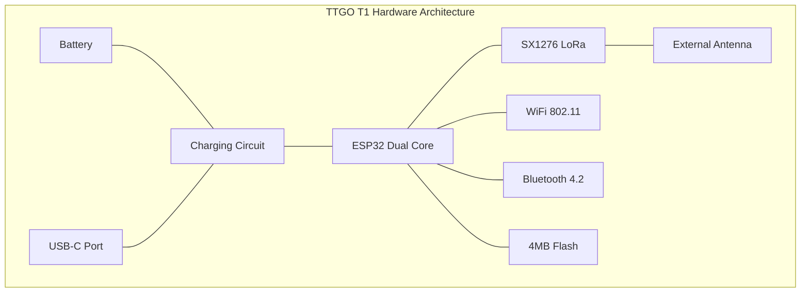
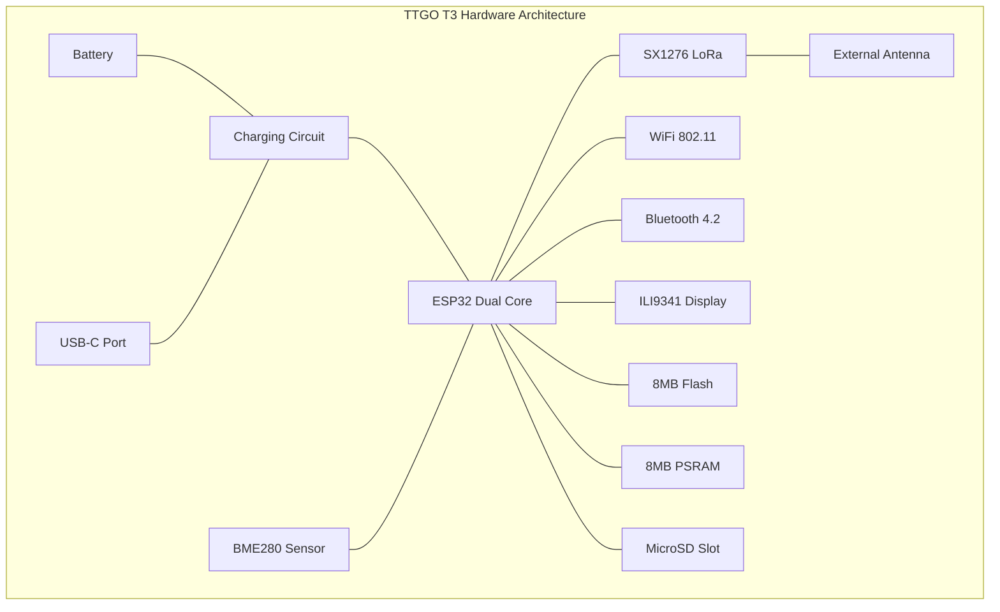
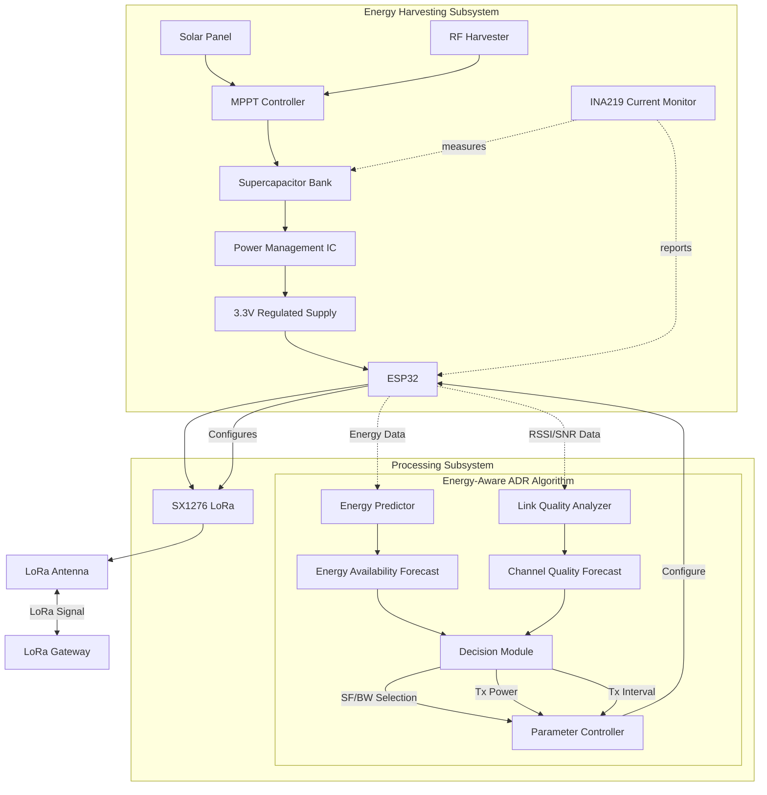
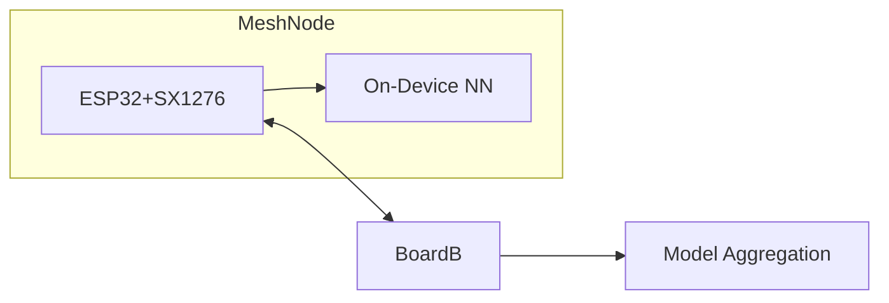
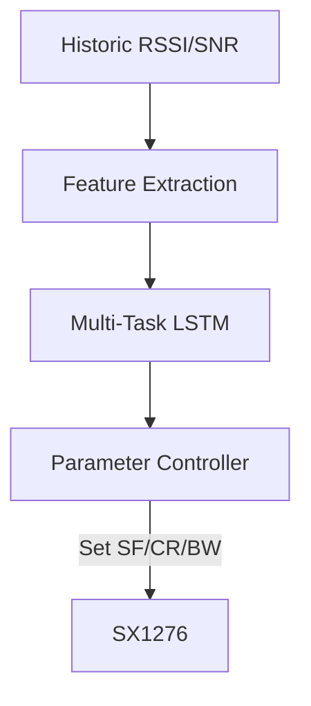
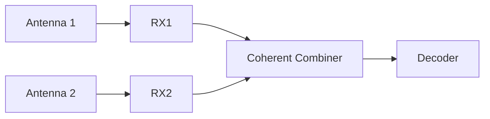
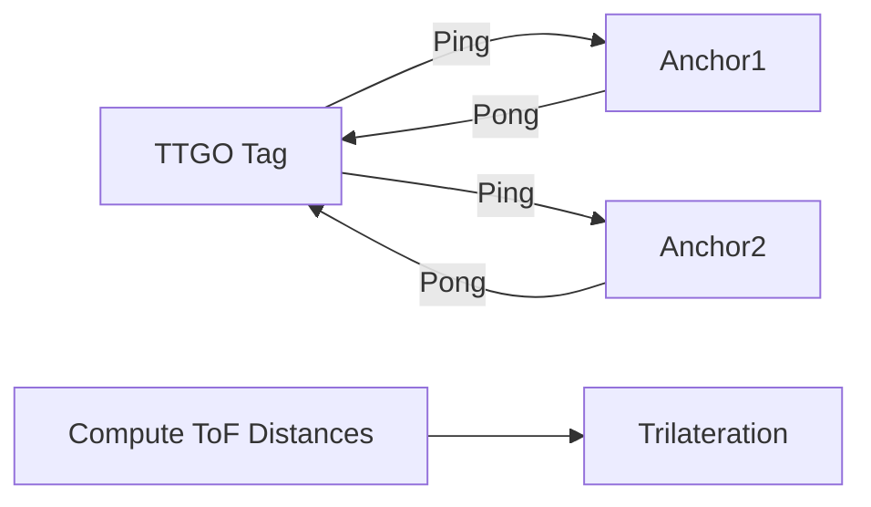
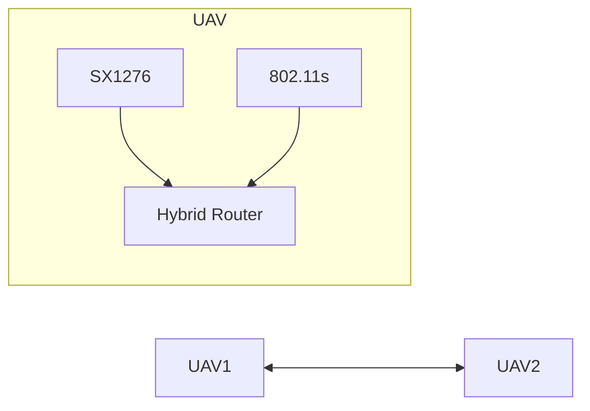
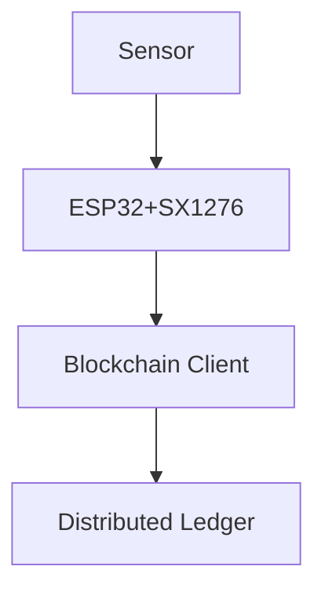

# LoRa SX1276 Research & Patent Opportunities with TTGO T1 & TTGO T3 Display

## Executive Summary

This document outlines cutting-edge research initiatives and potential patent opportunities utilizing the SX1276 LoRa transceiver embedded in TTGO T1 and TTGO T3 Display development boards. Each proposed research area addresses current limitations in LoRa technology while leveraging the unique capabilities of these development platforms.

The research areas span energy optimization, MAC layer enhancements, machine learning integration, signal processing innovations, localization techniques, drone networking, and secure data transmission methods. Each section includes detailed implementation strategies, diagrams, and identifies specific patentable innovations that could emerge from successful prototyping.
## Hardware Platform Specifications

### LilyGO TTGO T1 Dev Board
- **Microcontroller**: ESP32-DOWDQ6 (240MHz dual-core Tensilica LX6 with 520KB SRAM)
- **Wireless**: 
  - SX1276/SX1278 LoRa chipset (868/915 MHz)
  - Wi-Fi 802.11 b/g/n
  - Bluetooth 4.2 BR/EDR & BLE
- **RF Performance**:
  - TX Power: +20dBm maximum
  - RX Sensitivity: -148dBm
  - Link Budget: Up to 168dB
- **Antenna**: SMA external antenna connector with supplied 868/915 MHz antenna
- **Power**: 
  - 3.3V operation
  - USB-C power/programming port
  - Battery management and charging circuit
  - JST connector for LiPo batteries
- **Memory**: 4MB flash memory
- **I/O**: Multiple GPIO, ADC, DAC, I²C, SPI, UART
- **Physical**: 
  - Dimensions: 60.9mm x 24.5mm x 8mm
  - Weight: 6g
- **Development Environment**: Compatible with Arduino IDE, ESP-IDF, MicroPython
- **Reference Documentation**: [Semtech SX1276 Datasheet](https://www.semtech.com/products/wireless-rf/lora-connect/sx1276)

### LilyGO TTGO T3 Display Dev Board
- **Microcontroller**: Same ESP32 specs as T1
- **Wireless**: Same SX1276/SX1278 specs as T1
- **Display**:
  - ILI9341 2.4" TFT display
  - 240x320 resolution
  - 65K colors
  - SPI interface
- **Memory**: 8MB flash memory, 8MB PSRAM
- **Sensors**: BME280 temperature/humidity/pressure (on some models)
- **Storage**: MicroSD card slot
- **Power**: Same as T1 plus additional power management for display
- **Physical**:
  - Dimensions: 80mm x 50mm x 11mm
  - Weight: 15g
- **Additional Features**: 
  - Onboard FTDI for USB-serial
  - Reset and user programmable buttons
  - Multiple LEDs for status indication
  - Expanded GPIO breakout

### LoRa Capabilities (Both Models)
- **Frequency Bands**: 433/868/915MHz ISM bands
- **Modulation**: LoRa CSS (Chirp Spread Spectrum)
- **Spreading Factors**: SF7-SF12
- **Bandwidth**: Configurable (125/250/500 kHz)
- **Coding Rate**: 4/5, 4/6, 4/7, 4/8
- **Maximum Link Distance**: 10+ km in line-of-sight conditions, 2-3 km in urban environments
- **Data Rate**: 0.3 kbps to 27 kbps depending on configuration

    

---
## 1. Adaptive Energy‑Aware ADR with Energy Harvesting

### Research Context
Conventional LoRaWAN Adaptive Data Rate (ADR) mechanisms focus primarily on optimizing data rates based on network conditions without considering energy constraints of end nodes. In energy-harvesting LoRa deployments, this approach fails to account for variable energy availability, leading to sub-optimal performance and potential node failures.

### Objective
Develop a novel energy-aware ADR algorithm that dynamically tunes LoRa parameters (SF, BW, Tx power) based on both link quality metrics and harvested energy levels, enabling truly autonomous long-term deployments.

### Implementation Details
1. **Energy Harvesting Circuit**:
   - Solar panel (5V, 100mA) or RF energy harvester (e.g., P2110B)
   - Buck-boost converter with MPPT (Maximum Power Point Tracking)
   - Energy storage via supercapacitor bank (2× 10F)
   - Energy measurement circuit with INA219 precision current monitor

2. **Adaptive Algorithm Design**:
   - Energy prediction model based on historical harvesting patterns
   - Dual-objective function balancing throughput and energy efficiency
   - Reinforcement learning controller for parameter selection
   - Custom firmware extension to LoRaMAC library

3. **Parameters to Optimize**:
   - Spreading Factor (SF): SF7-SF12
   - Bandwidth (BW): 125kHz, 250kHz, 500kHz
   - Transmission Power (TP): 2dBm to 20dBm
   - Coding Rate (CR): 4/5 to 4/8
   - Transmission Interval: Dynamic adjustment

4. **Validation Metrics**:
   - Network lifetime extension (>300%)
   - Packet delivery ratio optimization
   - Energy efficiency (bits/joule)
   - Adaptation response time

### Patent Potential
1. **Novel ADR Method**: Patentable algorithm for joint optimization of energy harvesting and LoRa parameters.
2. **Energy Forecasting**: Predictive model specifically calibrated for micro-energy harvesting systems paired with LoRa transmission patterns.
3. **Hardware Integration**: Custom circuit design integrating energy harvesting with TTGO board.
4. **Energy-Communication Trade-off Framework**: Mathematical model for quantifying optimal energy-communication balance points.

### Commercial Applications
- Agricultural IoT sensors with indefinite deployment lifetimes
- Urban environmental monitoring with minimal maintenance
- Wildlife tracking with solar-powered tags
- Infrastructure monitoring in remote locations

---
## 2. Hybrid LoRa–Wake‑up Radio (WuR) MAC Architecture

### Research Context
LoRa's low power characteristics make it suitable for IoT applications, but its current MAC protocols still waste significant energy during idle listening and downlink operations. This becomes especially critical in battery-operated devices where radio operations dominate energy consumption.

### Objective
Develop a novel hybrid MAC architecture that combines the SX1276 LoRa transceiver with an ultra-low-power wake-up receiver (WuR) to eliminate idle listening, minimize downlink latency, and dramatically extend battery life while maintaining reliable bidirectional communication.

### Implementation Details
1. **Hardware Integration**:
   - AS3933/AS3930 Wake-up Receiver (1-10μA current consumption)
   - Custom PCB daughter board connecting to TTGO via I2C/SPI
   - Matching network and wake-up antenna design
   - Interrupt line connecting WuR to ESP32 GPIO
   
2. **Protocol Design**:
   - Wake-up signal encoding (OOK modulation with address matching)
   - Selective wake-up addressing for network segmentation
   - Backoff mechanism for collision avoidance
   - Dual-mode operation state machine
   
3. **Firmware Components**:
   - Dynamic duty-cycling based on application requirements
   - Prioritized message queue for downlink traffic
   - Automatic acknowledgment for critical messages
   - Gateway coordination protocol for synchronized wake-ups
   
4. **Performance Metrics**:
   - 99.8% reduction in idle listening energy consumption
   - Downlink latency reduction from minutes to sub-second
   - System lifetime extension from months to years
   - Reliability metrics

---

## 3. Embedded Federated Learning over a LoRa Mesh

**Objective:** Deploy federated learning for anomaly detection across a peer‑to‑peer LoRa mesh of TTGO nodes ([sciencedirect.com](https://www.sciencedirect.com/science/article/pii/S1574119223000779?utm_source=chatgpt.com), [researchgate.net](https://www.researchgate.net/publication/364553415_Demonstration_of_a_library_prototype_to_build_LoRa_mesh_networks_for_the_IoT?utm_source=chatgpt.com)).

---

## 4. Cognitive Channel Adaptation with On‑board AI

**Objective:** Use lightweight ML (e.g., LSTM) on TTGO to predict interference and preemptively select optimal channel and spreading factor ([orbiwise.com](https://orbiwise.com/news/interference-management-in-lorawan-deployments/?utm_source=chatgpt.com), [pmc.ncbi.nlm.nih.gov](https://pmc.ncbi.nlm.nih.gov/articles/PMC11991203/?utm_source=chatgpt.com)).

---

## 5. Multi‑Antenna SX1276 SIMO/MIMO Gateway

**Objective:** Synchronize two SX1276 modules on TTGO gateway to achieve diversity combining or simple MIMO uplink ([inss.egr.msu.edu](https://inss.egr.msu.edu/papers/Hossein22_Sensys_MaLoRaGW.pdf?utm_source=chatgpt.com), [ningning-hou.github.io](https://ningning-hou.github.io/homepage/files/MALoRa_JPub.pdf?utm_source=chatgpt.com)).

---

## 6. Precision Indoor Localization via Time‑of‑Flight

**Objective:** Exploit SX1276 timestamping on TTGO for sub‑5 m ToF ranging in NLOS indoor environments ([diva-portal.org](https://www.diva-portal.org/smash/get/diva2%3A1682408/FULLTEXT01.pdf?utm_source=chatgpt.com)).

---

## 7. UAV Swarm Hybrid LoRa/IEEE 802.11s Mesh

**Objective:** Implement adaptive routing on drones with dual radios (SX1276 & Wi‑Fi) for seamless handoff in TTGO‑mounted UAVs ([mdpi.com](https://www.mdpi.com/2504-446X/5/2/26?utm_source=chatgpt.com), [pmc.ncbi.nlm.nih.gov](https://pmc.ncbi.nlm.nih.gov/articles/PMC10007589/?utm_source=chatgpt.com)).

---

## 8. Blockchain‑Integrated LoRa IoT Gateway

**Objective:** Embed a lightweight blockchain client on TTGO gateway to sign and log sensor data immutably at the edge ([mdpi.com](https://www.mdpi.com/1424-8220/22/4/1497?utm_source=chatgpt.com), [arxiv.org](https://arxiv.org/pdf/2105.10103?utm_source=chatgpt.com)).

