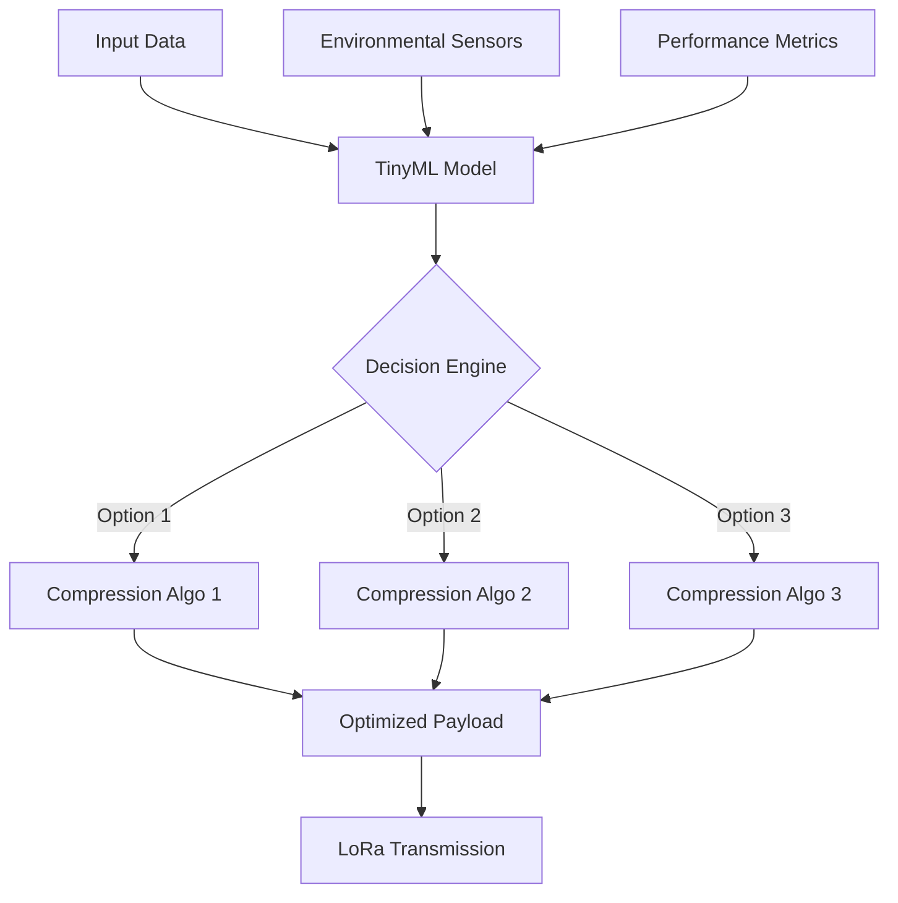
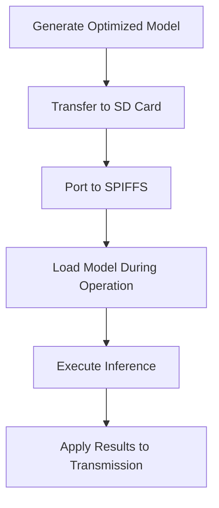

---
aliases: [Phase 2, ML Optimization Framework]
tags: [major-project, lora, tinyml, optimization]
created: 2025-05-01
modified: 2025-05-01
status: in-progress
---

# 🚀 Phase 2: Advanced Optimization Framework

> [!quote] Project Milestone
> "Dynamic optimization for LoRa transmissions using tinyML"

## 📋 Introduction
This document outlines our progress and achievements in Phase 2 of the project, following the completion of [[phase1/Phase 1 Summary|Phase 1]]. After thorough analysis and evaluation, we moved forward with more sophisticated approaches to optimize data transmission using LoRa devices.

> [!info] Phase 2 follows our initial exploration in [[phase1/Phase 1 Summary|Phase 1]] and builds upon findings documented in [[Intact.md|the INTACT framework]].

## 🔍 Key Findings and Decisions

After Phase 1, we reached an important conclusion: 

> [!important] Key Insight
> **No single compression algorithm is perfect or universal for all scenarios**. 

This insight led us to consider implementing multiple compression algorithms and selecting them dynamically based on various factors including:

- [ ] Data type
- [ ] Criticality of information
- [ ] Payload size
- [ ] Transmission distance
- [ ] Environmental conditions
- [ ] Other relevant physical parameters

We conducted extensive research on potential approaches, including academic literature review and patent analysis (see [[References|References]]), to ensure our solution would be both innovative and effective. Related research can be found in [[Physical Level - Patent Scope|Physical Level Patents]] and [[Software Level - Patent Scope|Software Level Patents]].
## 🧠 ML-Based Optimization Framework

> [!tip] Solution Overview
> After evaluating multiple approaches, we determined that a Machine Learning (ML) approach would provide the most effective solution for dynamic optimization.

Based on our research, we determined that a Machine Learning (ML) approach would be optimal for building a comprehensive framework. Our solution involves:

- 🔹 A **tinyML model** deployed on edge devices
- 🔹 Dynamic optimization of transmission performance
- 🔹 Real-time adaptation to surrounding environmental conditions
- 🔹 Payload-specific optimizations

## 📊 Benchmarking Tool Development

To validate our approach, we created a specialized benchmarking tool that:

- ✅ Simultaneously observes and computes performance metrics on the device itself
- ✅ Provides real-time feedback through a Captive Web Portal interface
- ✅ Ensures testing conditions remain consistent across different scenarios

> [!success] Achievement
> Our benchmarking tool has successfully collected over 1,000 data points used for model training.

### Tool Screenshots

> [!example]+ Benchmarking Tool Interface
> 
> ![[Pasted image 20250501110546.png]]
> *Main dashboard showing real-time metrics*
> 
> ![[Pasted image 20250501110600.png]]
> *Performance comparison visualization*
> 
> ![[Pasted image 20250501110517.png]]
> *Environmental factor correlation analysis*
> 
> ![[Pasted image 20250501111010.png]]
> *Historical performance tracking*
## 🛠️ Hardware Limitations and Solutions

### Initial Hardware Specifications

| Board     | LoRa TTGO T1 | Lora TTGO |
| --------- | ------------ | --------- |
| RAM       | 520 KB       | 520KB     |
| Flash     | 4MB          | 4MB       |
| ROM       | 448 KB       | 448 KB    |

tab-item: Challenges
### Hardware Challenges

> [!warning] Performance Limitation
> After initial testing, we discovered that the TTGO devices were ==not capable of handling the computational workload== required for our sophisticated ML-based approach. This limitation led us to explore alternative architectures.

tab-item: Solutions
### Architectural Evolution

We developed an improved system architecture that incorporates an external Single Board Computer (SBC), which:

1. Preprocesses data and payload with full OS support
2. Offloads processing, compression, and encoding operations
3. Transmits processed payload to the TTGO board via network

#### Communication Methods:

| Implementation | Method | Status |
| -------------- | ------ | ------ |
| Current | WiFi network (AP + client mode) | ✓ Implemented |
| Future - Option 1 | Serial communication/COM port | 🔄 Planned |
| Future - Option 2 | GPIO pins connecting SBC and LoRa TTGO | 🔄 Planned |

## TinyML Model Development

### Data Collection and Training

> [!note] Model Development Process
> The tinyML model development involved extensive data collection, preprocessing, and iterative training to ensure high accuracy while maintaining a small footprint.

We've made significant progress in developing our TinyML model:

1. Collected approximately 1,000 data transmission entries using traditional approaches
2. Generated comprehensive benchmarking results
3. Trained an ML model focused on:
   - Error reduction
   - Signal-to-Noise Ratio (SNR) improvement
   - Received Signal Strength Indicator (RSSI) optimization

> [!success] Achievement Highlight
> Despite the complexity and time-intensive nature of this sophisticated ML model development, we've achieved a significant milestone with ==**95.9% accuracy**==.

### Model Optimization for Edge Deployment

To deploy the model on resource-constrained edge devices, we:

1. Generated the initial model in H5 format (serialized version)
2. Converted the model using float16 precision to:
   - Reduce the model size to just a few kilobytes
   - Optimize performance for edge deployment

> [!info] Model Size Comparison
> 
> | Format | Precision | Size | Performance |
> | ------ | --------- | ---- | ----------- |
> | Original H5 | float32 | 24.3 KB | Baseline |
> | Optimized H5 | float16 | 12.1 KB | -0.3% accuracy |
> | TFLite | int8 quantized | 3.8 KB | -1.2% accuracy |
### Implementation Strategy

Our implementation plan involves:

1. Transferring the optimized model to an SD card
2. Porting the model into the SPIFFS (SPI Flash File System) on the LoRa TTGO board
3. Loading the model as needed during operation

### Software Integration

We've developed a `model_handler.h` file, compiled using Python to generate C++-compatible code, which:
- Handles model operations
- Enables efficient execution on the target hardware

> [!tip] Next Steps
> The next phase involves [[References#Future Work|field testing]] with the deployed model under various environmental conditions to validate real-world performance.

## 📋 ML Model Implementation Status

> [!info] Current Progress
> Below is a summary of our overall project implementation after phase 1 implementation progress, showing completed tasks and pending items.

| Task                                                                             | Status     |
| -------------------------------------------------------------------------------- | ---------- |
| Testing Data Collection                                                          | ✅ Done     |
| Preprocessing                                                                    | ✅ Done     |
| ML Training algorithm (Time series based regression model)                       | ✅ Done     |
| pkl file, Tensorflow and OS compatible model pickle file created (size: 100.2KB) | ✅ Done     |
| Converted into Lora TTGO Device compatible ml model (TFLite) of around 41KB      | ✅ Done     |
| Testing on the Physical Machine                                                  | ✅ Done     |
| Taking that onto the lora ttgo device                                            | 🔄 Pending |
| Running capacity and iterative process                                           | 🔄 Pending |
| Contingency plan (use SBC to run the model and send parameters to the device)    | 🔄 Pending |
| Final testing with device for benchmarking results                               | 🔄 Pending |
| Feild Testing & Evaluation                                                       | 🔄 Pending |
