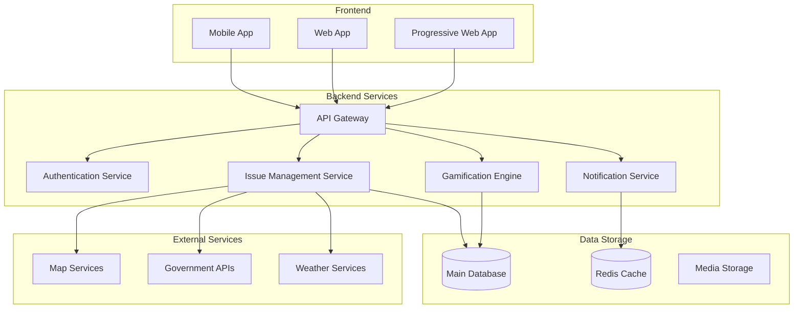
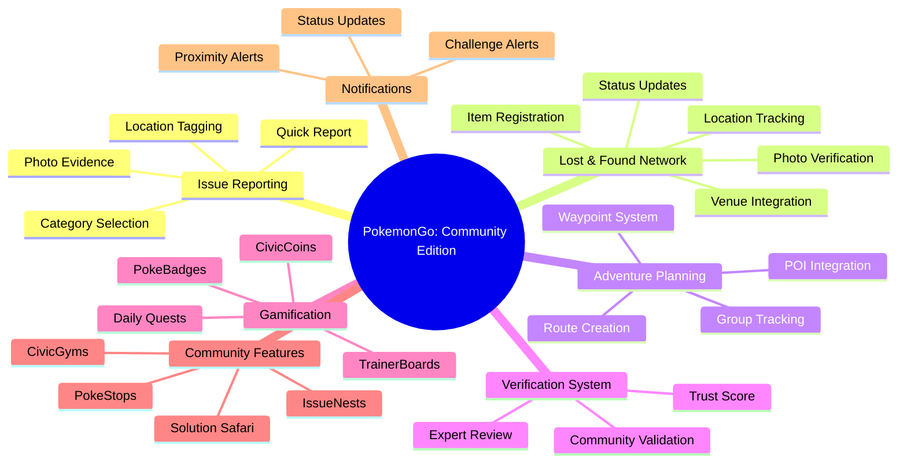
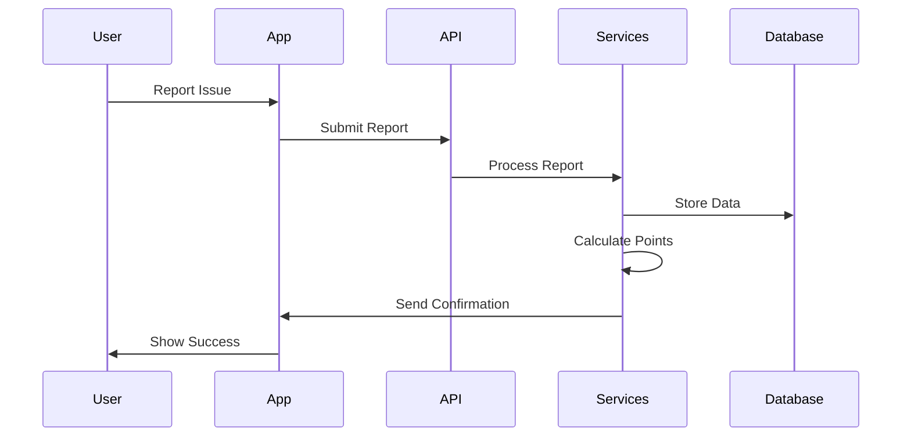
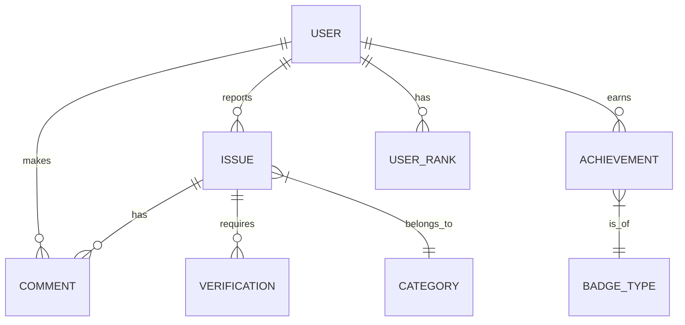
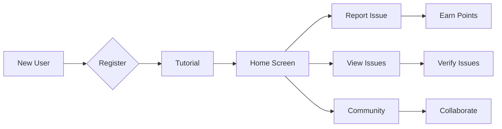

# PokemonGo: Community Edition

> [!info]
> This document outlines the complete architecture and design of PokemonGo: Community Edition, a gamified community issue reporting platform that transforms civic engagement into an exciting Pokemon-inspired adventure.

## 1. Executive Summary

CivicQuest transforms community issue reporting into an engaging, gamified experience while maintaining the seriousness of civic responsibility. By combining proven crowdsourcing methodologies with game-like elements, we create a sustainable platform for community engagement and problem resolution.

> [!quote] Mission
> "To empower communities to identify, track, and resolve local issues through collaborative effort and gamified engagement."

## 2. System Architecture Overview



## 3. Core Features and Gamification Elements



## 4. Technical Components and Data Flow

> [!note] Key Components
> - Frontend Applications
> - API Gateway
> - Microservices Architecture
> - Real-time Processing Engine
> - Data Storage Solutions



## 5. User Experience & Interface Design

### Key Interface Elements
- **Issue Map**: Interactive map showing reported issues
- **Profile Dashboard**: User achievements and history
- **Report Creation**: Streamlined issue reporting flow
- **Community Hub**: Discussion and collaboration space

> [!tip] Design Principles
> 1. Intuitive Navigation
> 2. Clear Visual Hierarchy
> 3. Responsive Design
> 4. Accessibility First

## 6. Entity Relationship Diagram



## 7. App Flow and User Journey



## 8. Gamification Mechanics

### Achievement System
- **PokeRanger Levels**: Progress from Novice Trainer to Elite PokeRanger
- **PokeBadges**: Themed badges (Environmental Guardian, Infrastructure Master, Safety Champion)
- **CivicDex**: Catalog of discovered and resolved community issues
- **Challenge System**: Daily quests and weekly missions

> [!example] CivicCoin System
> - Issue Reporting: 50 CivicCoins
> - MasterBall Issues (Critical): 150 CivicCoins
> - Verification at PokeStops: 20 CivicCoins
> - Solution Safari Proposal: 30 CivicCoins
> - Community Implementation: 100 CivicCoins

### PokeRanger Ranks
1. **Novice Trainer** (0-500 CivicCoins)
2. **Issue Scout** (501-1000 CivicCoins)
3. **Community Guardian** (1001-2500 CivicCoins)
4. **District Champion** (2501-5000 CivicCoins)
5. **Elite PokeRanger** (5000+ CivicCoins)

Each rank unlocks new abilities and responsibilities in the community.

### Points and Leaderboards
- **Daily Point Caps**: Maximum 500 points per day to prevent gaming
- **Weekly Challenges**: Bonus points for completing themed tasks
- **Seasonal Rankings**: Quarterly resets with special rewards
- **Anti-Farming Measures**: 
- Cooldown periods between similar reports
- Location verification requirements
- Activity pattern analysis
- **Global and Local Leaderboards**:
- City-wide rankings
- Neighborhood champions
- Category specialists
- **Point Multipliers**:
- Streak bonuses for consistent activity
- Critical issue bonuses
- Expert verification bonuses

### Cross-Verification System
1. **Initial Report**:
- Photo evidence required
- Location metadata validation
- Basic AI screening

2. **Community Verification**:
- Minimum 3 independent verifications
- On-site photo comparison
- Proximity-based validator selection

3. **Expert Review Process**:
- Verified experts get priority queue
- Document-based verification (degrees, certifications)
- Professional registration numbers
- Background checks
- Regular performance reviews

4. **Trust Score Algorithm**:
- Report accuracy history
- Verification success rate
- Community feedback weight
- Professional credentials multiplier
- Activity consistency factor

### Location and Travel Integration
1. **Smart Location Features**:
- Geofenced notifications
- Area-based issue clustering
- Hotspot identification
- Route-based alerts

2. **Travel Blog Components**:
- Area improvement stories
- Before/After comparisons
- Community success stories
- Local hero spotlights
- Impact metrics visualization

3. **Local Community Hub**:
- Area statistics dashboard
- Community meetup organization
- Local expert directory
- Historical issue tracking
- Improvement trends analysis

4. **Geofencing Rules**:
- Radius-based verification requirements
- Time-stamped location checks
- Movement pattern validation
- Cross-reference with known locations
### Virtual Assistant
**PokeGuide**: Your friendly AI companion that helps navigate through the app, provides tips on issue reporting, and suggests nearby IssueNests that need attention.

## 9. Integration Points

### External Services
1. Map Services (Google Maps/OpenStreetMap)
2. Government APIs
3. Weather Services
4. Social Media Platforms


## 11. Visual Design System

### Color Palette and Theme
**Primary Colors:**
- Main Orange: #FF5D00 (Energy, Action)
- Deep Orange: #CC4A00 (Focus, Depth)
- Light Orange: #FF8533 (Interaction, Highlights)

**Neutral Colors:**
- Dark Grey: #1A1A1A (Text, Backgrounds)
- Medium Grey: #4A4A4A (Interface Elements)
- Light Grey: #E0E0E0 (Borders, Inactive States)

**Accent Colors:**
- Success: #2ECC71 (Completion, Positive)
- Warning: #FFB900 (Caution, Pending)
- Error: #E74C3C (Alert, Critical)

### Logo and App Icon
- Main logo combines a Pokeball silhouette with civic elements
- Icon features a simplified Pokeball with a gear/cog overlay
- Use gradient from Main Orange to Deep Orange
- Must be recognizable at small sizes (32x32px)

### Character Design (PokeGuide)
- Friendly AI assistant inspired by Rotom-Dex
- Professional appearance with civic worker elements
- Expressions: Helper, Alert, Celebration, Thinking
- Animations for different states and interactions
- Should wear a small safety vest and hard hat

### Avatar System
**Trainer Customization:**
- Multiple body types and diverse representation
- Civic-themed clothing (safety vests, utility belts)
- Professional attire options (business casual to work gear)
- Unlockable special items based on achievements
- Color variations for all clothing items

### Badges and Achievements
**Design Style:**
- Circular badge format with distinct icons
- Metallic finish (Bronze, Silver, Gold, Platinum)
- Environmental Badge: Leaf with recycle symbol
- Infrastructure Badge: Bridge/road design
- Safety Badge: Shield with exclamation mark
- Community Badge: Connected people icons

### UI Elements
**CivicCoins:**
- Coin design combines Pokecoin with civic symbols
- Metallic gold with blue accent
- Animated spinning effect for earnings

**Level Indicators:**
- Progress bars in Main Orange
- Level-up animation with particle effects
- Rank icons reflect PokeRanger progression

### Map Markers and Issue Icons
**Issue Severity:**
- Light Orange: Minor issues (Clean-up needed)
- Deep Orange: Moderate issues (Maintenance required)
- Error Red: Critical issues (Immediate attention)

**Status Indicators:**
- New: Pulsing effect
- Verified: Check mark overlay
- In Progress: Rotating progress indicator
- Resolved: Star burst effect

### Achievement Sprites
- Pixel-perfect 64x64 achievement icons
- Consistent line weight (2px)
- Simple, recognizable silhouettes
- Ambient animation on hover
- Locked state: Grayscale with question mark

### Animation Guidelines
**Principles:**
- Smooth, playful transitions (300ms default)
- Responsive feedback for user actions
- Pokemon-inspired effects for rewards
- Subtle UI state changes
- Progressive loading animations

**Key Animations:**
- Issue Report: Pokeball throw and capture
- Level Up: Evolving silhouette effect
- Badge Earn: Spinning reveal with sparkles
- Status Change: Smooth color transitions

---

## 12. Technical Implementation Guide

### Tech Stack Overview
**Frontend:**
- React Native v0.71+ (Mobile App)
- TailwindCSS 3.0+
- React Query for data fetching
- Zustand for state management

**Backend:**
- Supabase for database, authentication, and real-time features
- Edge Functions for serverless compute
- Node.js microservices (where needed)
- Redis for caching

### Project Structure
```
src/
├── app/                 # App-wide configurations
├── components/          # Reusable UI components
├── features/           # Feature-based modules
│   ├── issues/         # Issue reporting
│   ├── map/           # Map integration
│   ├── gamification/   # Game mechanics
│   └── auth/          # Authentication
├── hooks/              # Custom React hooks
├── services/           # API services
├── utils/              # Helper functions
└── types/              # TypeScript definitions
```

### API Integrations

**Supabase Setup:**
```typescript
import { createClient } from '@supabase/supabase-js'

export const supabase = createClient(
process.env.NEXT_PUBLIC_SUPABASE_URL!,
process.env.NEXT_PUBLIC_SUPABASE_ANON_KEY!
)
```

**OSM Integration:**
```typescript
const mapConfig = {
tileServer: 'https://{s}.tile.openstreetmap.org/{z}/{x}/{y}.png',
nominatim: 'https://nominatim.openstreetmap.org',
valhalla: process.env.VALHALLA_API_URL
}

// Geocoding example
async function geocodeAddress(address: string) {
const response = await fetch(
    `${mapConfig.nominatim}/search?format=json&q=${encodeURIComponent(address)}`
)
return await response.json()
}
```

### Real-time Features Implementation
```typescript
// Subscribe to real-time issue updates
// Lost & Found subscriptions
const lostItemSubscription = supabase
.channel('lost_items')
.on(
    'postgres_changes',
    {
        event: '*',
        schema: 'public',
        table: 'lost_items',
        filter: `location && ST_MakeEnvelope(${bounds}, 4326)`
    },
    (payload) => {
        updateLostItems(payload.new)
    }
)
.subscribe()

// Route collaboration subscriptions
const routeSubscription = supabase
.channel('route_updates')
.on(
    'postgres_changes',
    {
        event: '*',
        schema: 'public',
        table: 'routes',
        filter: `id=eq.${currentRouteId}`
    },
    (payload) => {
        updateRouteDetails(payload.new)
    }
)
.subscribe()

// Waypoint updates subscription
const waypointSubscription = supabase
.channel('waypoint_updates')
.on(
    'postgres_changes',
    {
        event: '*',
        schema: 'public',
        table: 'waypoints',
        filter: `route_id=eq.${currentRouteId}`
    },
    (payload) => {
        updateWaypoints(payload.new)
    }
)
.subscribe()

// Real-time leaderboard updates
// Real-time leaderboard updates
const leaderboardSubscription = supabase
.channel('leaderboard_updates')
.on(
    'postgres_changes',
    {
    event: 'UPDATE',
    schema: 'public',
    table: 'leaderboards',
    filter: `category=eq.${currentCategory}`
    },
    (payload) => {
    updateLeaderboardDisplay(payload.new)
    }
)
.subscribe()

// Expert verification status tracking
const expertStatusSubscription = supabase
.channel('expert_updates')
.on(
    'postgres_changes',
    {
    event: 'UPDATE',
    schema: 'public',
    table: 'expert_verifications',
    filter: `user_id=eq.${currentUser.id}`
    },
    (payload) => {
    updateExpertStatus(payload.new)
    }
)
.subscribe()

// Location-based issue monitoring
const locationSubscription = supabase
.channel('local_issues')
.on(
    'postgres_changes',
    {
    event: 'INSERT',
    schema: 'public',
    table: 'issues',
    filter: `ST_DWithin(location, ST_SetSRID(ST_MakePoint(${userLong}, ${userLat}), 4326), 1000)`
    },
    (payload) => {
    handleNearbyIssue(payload.new)
    }
)
.subscribe()

const issueSubscription = supabase
.channel('public:issues')
.on(
    'postgres_changes',
    {
    event: '*',
    schema: 'public',
    table: 'issues'
    },
    (payload) => {
    updateIssueInStore(payload.new)
    }
)
.subscribe()

// Listen for specific issue updates
const specificIssueSubscription = supabase
.channel('issue_updates')
.on(
    'postgres_changes',
    {
    event: 'UPDATE',
    schema: 'public',
    table: 'issues',
    filter: 'id=eq.' + issueId
    },
    (payload) => {
    handleIssueUpdate(payload.new)
    }
)
.subscribe()

// Presence for active users
const presenceChannel = supabase.channel('online-users')

presenceChannel
.on('presence', { event: 'sync' }, () => {
    const state = presenceChannel.presenceState()
    updateOnlineUsers(state)
})
.subscribe(async (status) => {
    if (status === 'SUBSCRIBED') {
    await presenceChannel.track({ 
        user_id: currentUser.id,
        online_at: new Date().toISOString()
    })
    }
})
```
})
```

### Map Integration Details

**Tile Layer Setup:**
```typescript
import { TileLayer } from 'react-leaflet'

const MapTiles = () => (
<TileLayer
    url="https://{s}.tile.openstreetmap.org/{z}/{x}/{y}.png"
    attribution='&copy; <a href="https://www.openstreetmap.org/copyright">OpenStreetMap</a>'
    maxZoom={19}
/>
)
```

### Database Schema
```sql
-- Lost & Found Tables
create table lost_items (
    id uuid default uuid_generate_v4() primary key,
    title text not null,
    description text,
    location geometry(Point, 4326),
    status text default 'lost',
    reporter_id uuid references auth.users,
    photos text[],
    item_type text,
    last_seen timestamptz,
    contact_info jsonb,
    created_at timestamptz default now()
);

create table found_items (
    id uuid default uuid_generate_v4() primary key,
    lost_item_id uuid references lost_items,
    finder_id uuid references auth.users,
    location geometry(Point, 4326),
    photos text[],
    holding_venue_id uuid references venues,
    status text default 'found',
    created_at timestamptz default now()
);

create table venues (
    id uuid default uuid_generate_v4() primary key,
    name text not null,
    location geometry(Point, 4326),
    contact_info jsonb,
    verification_status text default 'pending',
    operating_hours jsonb,
    created_at timestamptz default now()
);

-- Adventure Planning Tables
create table routes (
    id uuid default uuid_generate_v4() primary key,
    title text not null,
    description text,
    creator_id uuid references auth.users,
    status text default 'draft',
    privacy text default 'private',
    created_at timestamptz default now()
);

create table waypoints (
    id uuid default uuid_generate_v4() primary key,
    route_id uuid references routes,
    location geometry(Point, 4326),
    title text,
    description text,
    sequence_number integer,
    poi_type text,
    created_at timestamptz default now()
);

create table route_collaborators (
    route_id uuid references routes,
    user_id uuid references auth.users,
    role text default 'viewer',
    joined_at timestamptz default now(),
    primary key (route_id, user_id)
);

-- Points and Leaderboard Tables
create table point_transactions (
    id uuid default uuid_generate_v4() primary key,
    user_id uuid references auth.users,
    amount integer not null,
    type text not null,
    metadata jsonb,
    created_at timestamptz default now()
);

create table leaderboards (
    id uuid default uuid_generate_v4() primary key,
    user_id uuid references auth.users,
    points integer default 0,
    rank integer,
    category text,
    period text,
    updated_at timestamptz default now()
);

create table expert_verifications (
    id uuid default uuid_generate_v4() primary key,
    user_id uuid references auth.users,
    expertise_area text[],
    credentials jsonb,
    verification_status text default 'pending',
    verified_by uuid references auth.users,
    valid_until timestamptz
);

create table location_stats (
    id uuid default uuid_generate_v4() primary key,
    area_id text not null,
    stat_type text not null,
    value jsonb,
    calculated_at timestamptz default now()
);

-- Issues Table
create table issues (
id uuid default uuid_generate_v4() primary key,
title text not null,
description text,
location geometry(Point, 4326),
status text default 'pending',
reporter_id uuid references auth.users,
created_at timestamptz default now()
);

-- Achievements Table
create table achievements (
id uuid default uuid_generate_v4() primary key,
user_id uuid references auth.users,
type text not null,
earned_at timestamptz default now()
);
```

### Authentication Flow
```typescript
// Sign in with Supabase
async function signIn(email: string, password: string) {
const { data, error } = await supabase.auth.signInWithPassword({
    email,
    password
})

if (error) throw error
return data
}

// Protected route wrapper
const ProtectedRoute = ({ children }) => {
const session = useSession()
if (!session) return <Navigate to="/login" />
return children
}
```


---

> [!info] Living Document
> This documentation is continuously updated as the platform evolves. Last updated: [Current Date]
Key Features
Live Issue Reporting & Verification
Users can report real-world issues like damaged roads, water leaks, or public transport
delays. Each report includes location data, timestamps, and optional images. To prevent
false alarms, PokemonGo cross-verifies multiple reports before marking them as
“verified.” Users earn contribution points for accurate submissions, creating a system of
accountability and engagement. The more reports a user makes that get verified, the
higher their credibility rank, encouraging meaningful participation.
Community Discussion & Solutions Hub
A problem doesn’t always need to wait for authorities - sometimes, the community can
solve it themselves. PokemonGo includes discussion threads where users can brainstorm
solutions, organize community cleanups, or request help from local businesses. Users
vote on the best course of action, and verified experts (engineers, city planners,
volunteers) can weigh in. This feature fosters grassroots-level problem-solving while also
notifying authorities when larger interventions are needed.
Smart Alerts & Proximity-Based Notifications
When users report an issue, others in the area receive a notification - whether it’s a
blocked road, a power cut, or a safety concern. Smart filters ensure only relevant alerts
reach users based on their preferences. Critical alerts like emergencies are prioritized,
while minor issues can be viewed in a community feed. Once an issue is resolved, the app
sends an automatic closure update, ensuring users don’t receive redundant reports