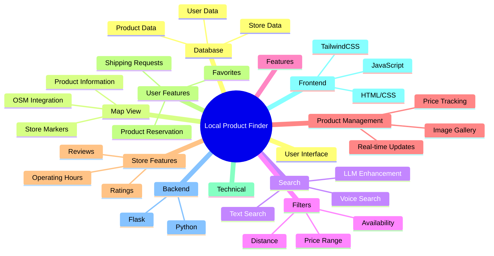
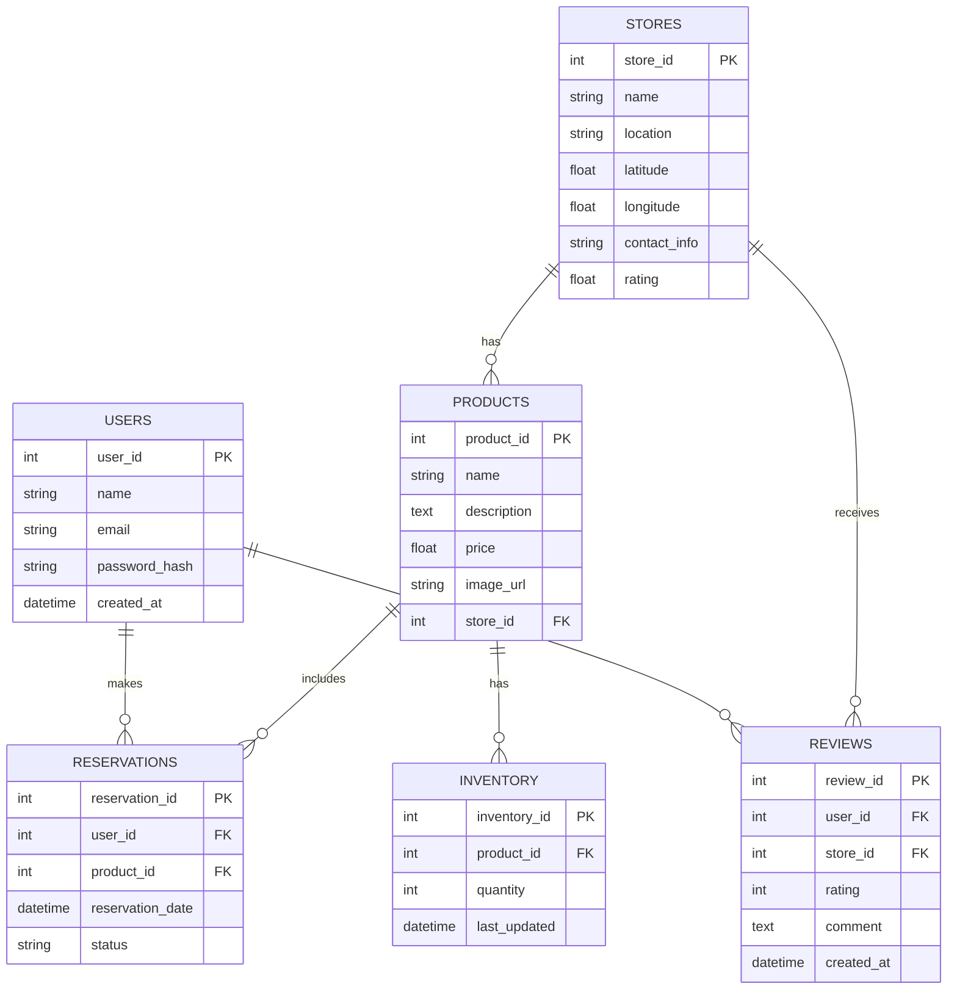
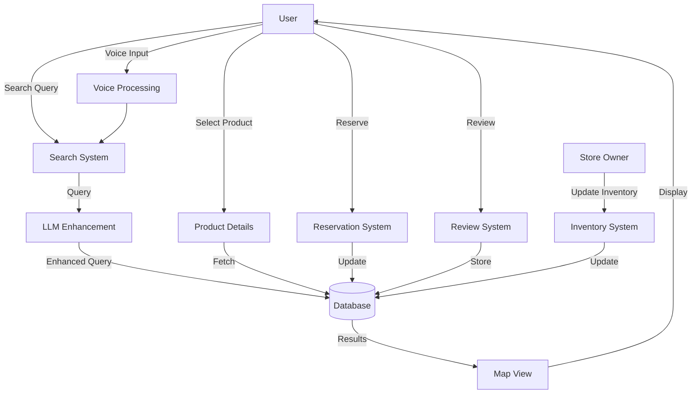
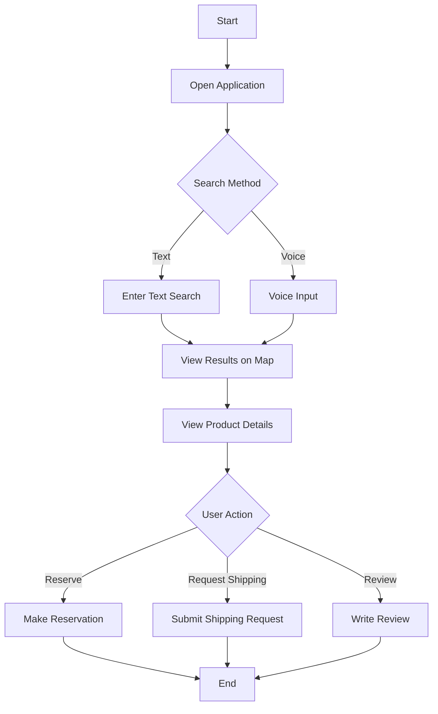
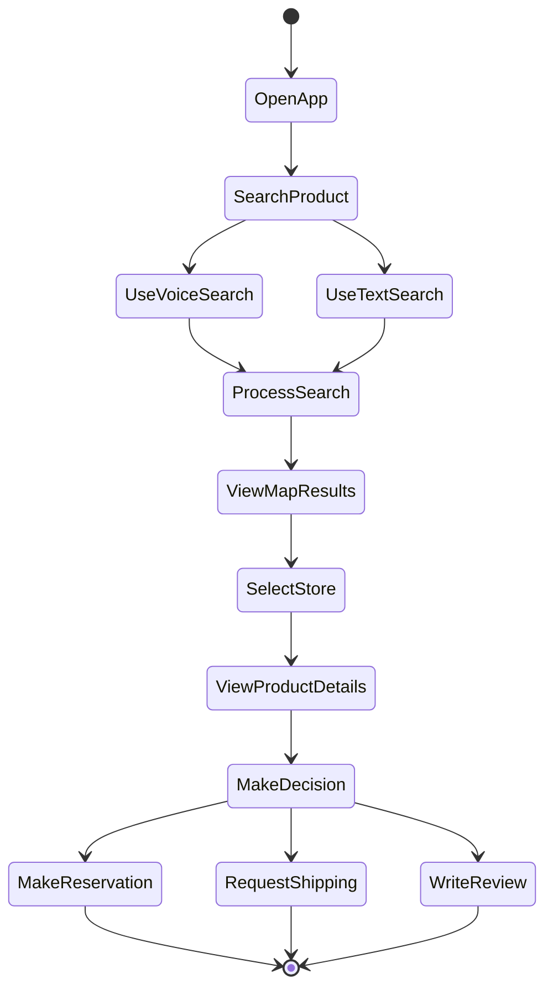
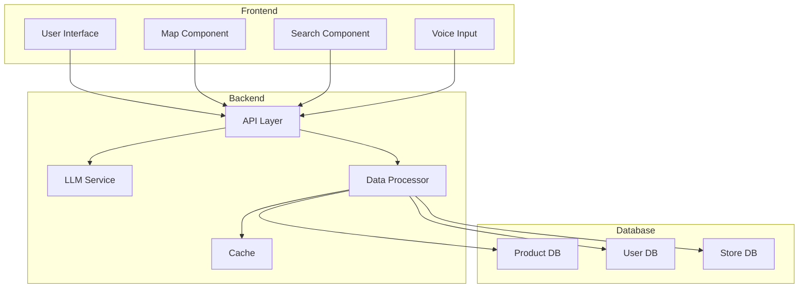
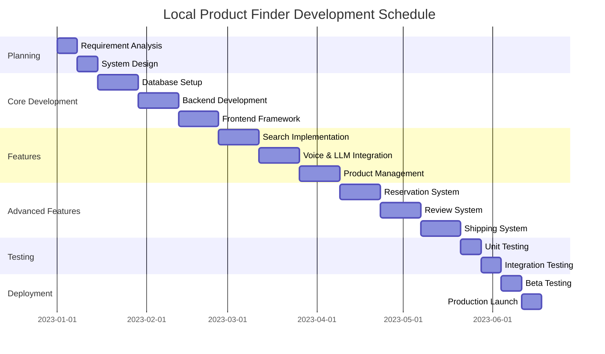

# Local Product Finder Application

## 1. Project Overview
The Local Product Finder is an innovative web application that bridges the gap between local retailers and consumers. It provides real-time product availability information, price comparisons, and store details through an interactive OSM map interface. The application features voice search capabilities, LLM-powered search enhancement, and a product reservation system, making local shopping more efficient and user-friendly.

### Key Features
- Interactive OSM Map integration
- Real-time product availability tracking
- Voice search functionality
- AI-powered search enhancement
- Price comparison tools
- Store ratings and reviews
- Product reservation system
- Shipping request management
- Product image gallery
- Real-time inventory updates

## 2. Problem Statement
In today's fast-paced world, consumers face significant challenges in finding specific products in their local stores. The process often involves multiple store visits, phone calls, or unreliable online searches that fail to provide accurate local information. This disconnect between buyers and local retailers affects both consumers and small businesses, particularly those with outdated inventory systems.

A unified platform is needed to bridge this gap, leveraging real-time data and crowd-sourced updates to create a dynamic marketplace. This solution would enable users to locate products in nearby stores, compare prices, view inventory status, and access store-specific details, enhancing local commerce and fostering stronger community ties. By integrating modern technology into traditional shopping, the system aims to streamline the shopping experience, save time for consumers, and boost the visibility and profitability of local businesses.

## 3. Mind Map

## 4. Technical Stack
### Frontend
- HTML5
- CSS3
- JavaScript (ES6+)
- TailwindCSS
- OpenStreetMap API
- Web Speech API

### Backend
- Python 3.x
- Flask Framework
- SQLAlchemy ORM
- RESTful API
- LLM Integration

### Database
- PostgreSQL
- Redis (Caching)

### External Services
- OpenStreetMap
- Language Model API
- Payment Gateway
- Cloud Storage (Images)

## 5. System Components
1. **User Interface Layer**
- Map Component
- Search Interface
- Product Cards
- Store Details Panel
- Reservation System
- User Dashboard

2. **Business Logic Layer**
- Search Engine
- Price Comparison Engine
- Voice Processing System
- LLM Integration Service
- Inventory Management
- Rating System

3. **Data Layer**
- Product Database
- User Database
- Store Database
- Cache System
- File Storage

## 6. Database Schema

## 7. Data Flow Diagram

## 8. User Workflow

## 9. UI Components
1. **Header Section**
- Logo
- Search Bar
- Voice Search Button
- User Profile Menu

2. **Map View**
- Interactive OSM Map
- Store Markers
- Product Information Popups
- Filter Controls

3. **Product Details Panel**
- Product Images
- Price Information
- Store Details
- Availability Status
- Reservation Button
- Shipping Request Button

4. **Store Information**
- Ratings Display
- Review Section
- Operating Hours
- Contact Information

5. **User Dashboard**
- Reservation History
- Favorite Products
- Reviews Given
- Settings

## 10. Activity Diagram

## 11. Block Diagram

## 12. Project Phases
1. **Phase 1: Planning and Design** (Weeks 1-2)
- Requirement Analysis
- System Architecture Design
- Database Schema Design
- UI/UX Design

2. **Phase 2: Core Development** (Weeks 3-6)
- Database Setup
- Basic Backend Development
- Frontend Framework Setup
- Map Integration

3. **Phase 3: Feature Implementation** (Weeks 7-10)
- Search Functionality
- Voice Recognition
- LLM Integration
- Product Management System

4. **Phase 4: Advanced Features** (Weeks 11-14)
- Reservation System
- Review System
- Shipping Request System
- Real-time Updates

5. **Phase 5: Testing and Optimization** (Weeks 15-16)
- Unit Testing
- Integration Testing
- Performance Optimization
- Security Testing

6. **Phase 6: Deployment and Launch** (Weeks 17-18)
- Beta Testing
- Production Deployment
- User Training
- Documentation

## 13. Gantt Chart

