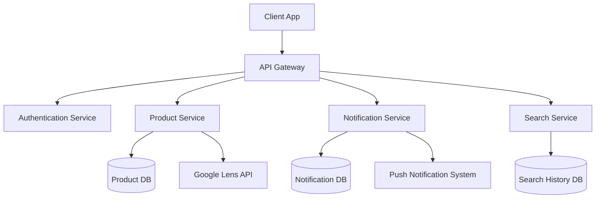
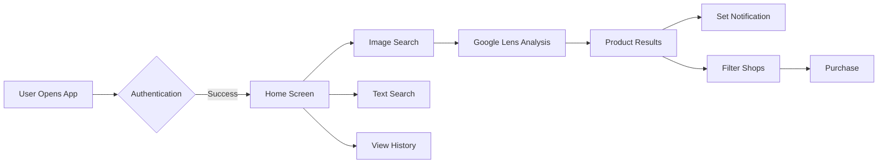
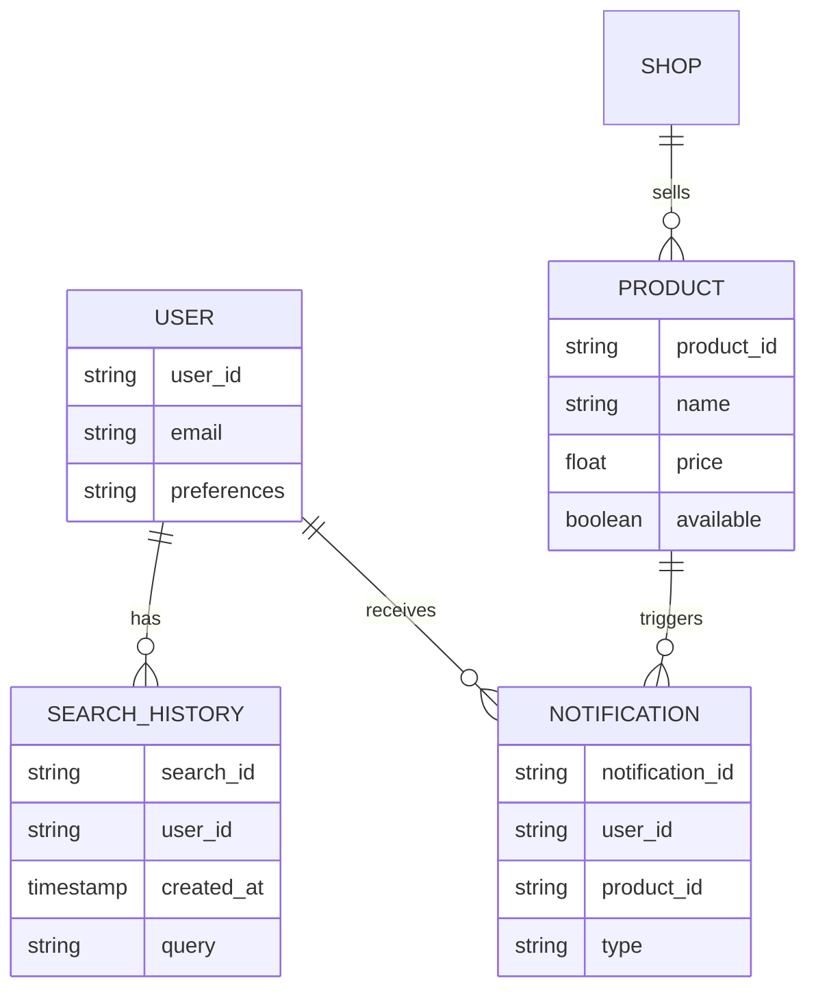
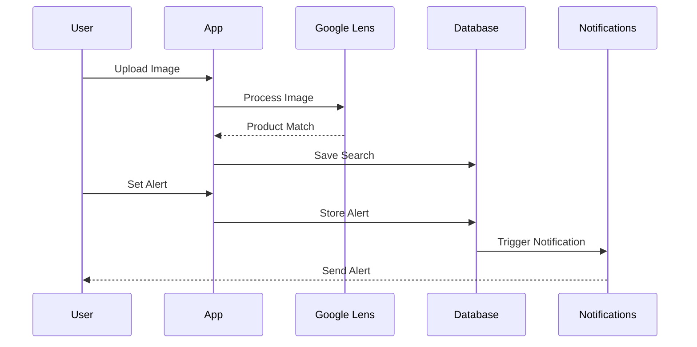

# 🛍️ DealSphere Documentation

## 📋 Table of Contents
- [Overview](#overview)
- [Features](#features)
- [System Architecture](#system-architecture)
- [User Flow](#user-flow)
- [Database Schema](#database-schema)
- [Feature Interactions](#feature-interactions)
- [Technical Specifications](#technical-specifications)
- [Implementation Guidelines](#implementation-guidelines)
- [Use Cases](#use-cases)

## Overview
🎯 **DealSphere** is a smart shopping platform that helps users discover, track, and purchase products at the best prices. The app combines advanced image recognition, real-time notifications, and intelligent filtering to create a seamless shopping experience.

## Features

### 🔍 Google Lens Product Search Integration
- Visual search capability using Google Cloud Vision API
- Real-time product recognition and matching
- Support for multiple image formats
- Accuracy score threshold: 85%

### 🔔 Product Availability Notifications
- Real-time stock monitoring
- Push notifications system
- Price drop alerts
- Custom notification preferences
- Notification frequency control

### 📱 Search History Tracking
- Persistent search history storage
- Search analytics and trends
- Personalized recommendations
- Export functionality
- Privacy controls

### 🏪 Shop Filtering System
- Location-based filtering
- Rating-based sorting
- Price range filters
- Category specialization
- Delivery options filter

## System Architecture



## User Flow



## Database Schema



## Feature Interactions



## Technical Specifications

### Backend Infrastructure
- **Language:** Node.js/Python
- **Framework:** Express.js/Django
- **Database:** PostgreSQL
- **Cache:** Redis
- **Search Engine:** Elasticsearch
- **Cloud Provider:** AWS/Google Cloud

### API Integrations
- Google Cloud Vision API v1
- Firebase Cloud Messaging
- Elastic Search API v7.x
- Payment Gateway APIs

### Performance Requirements
- Response Time: < 2 seconds
- Availability: 99.9%
- Image Processing: < 5 seconds
- Concurrent Users: 10,000+

## Implementation Guidelines

### Google Lens Integration
```javascript
// Example implementation
async function processImage(imageData) {
    const vision = require('@google-cloud/vision');
    const client = new vision.ImageAnnotatorClient();
    
    const [result] = await client.productSearch(imageData);
    return result.products;
}
```

### Notification System
```javascript
// Example implementation
class NotificationService {
    async sendNotification(userId, productId, type) {
        const notification = {
            userId,
            productId,
            type,
            timestamp: new Date()
        };
        await this.notificationRepository.save(notification);
        await this.pushService.send(userId, notification);
    }
}
```

## Use Cases

### 1. Visual Product Search
**Scenario:** User wants to find a product using an image
1. User captures/uploads product image
2. System processes image through Google Lens
3. System displays matching products
4. User can filter results by shop

### 2. Price Drop Alert
**Scenario:** User wants to be notified when a product price drops
1. User sets price alert threshold
2. System monitors product price
3. System sends notification when condition met
4. User receives real-time alert

### 3. Shop Comparison
**Scenario:** User wants to compare shops for a product
1. User selects product
2. System shows available shops
3. User applies filters (rating, location, etc.)
4. System displays filtered results

