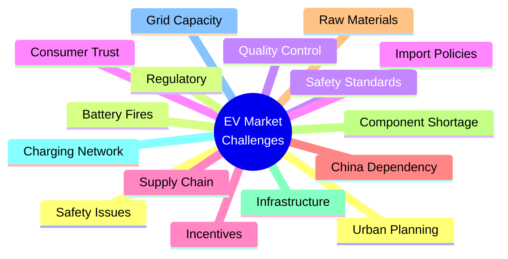
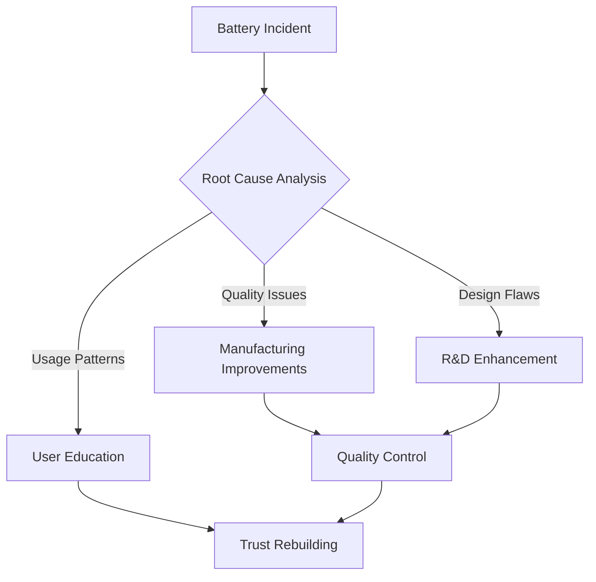
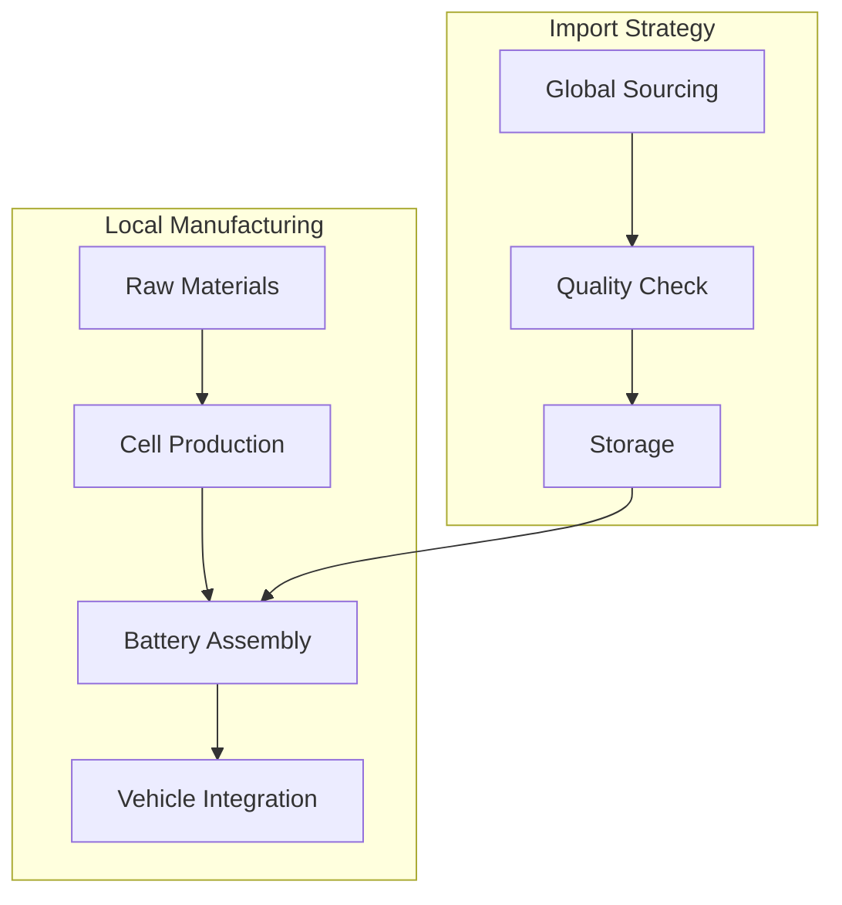
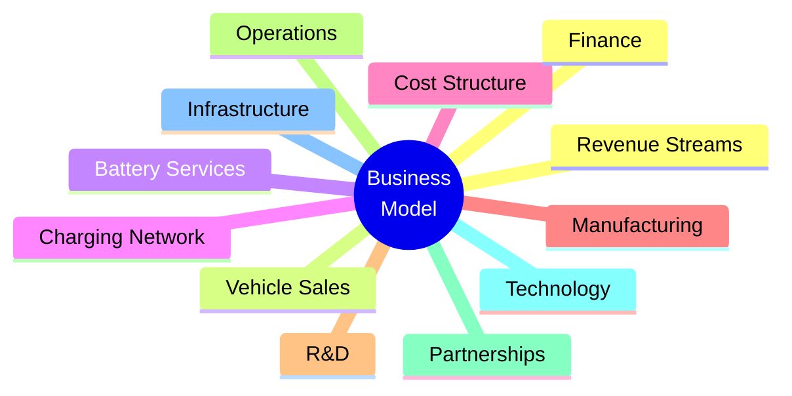
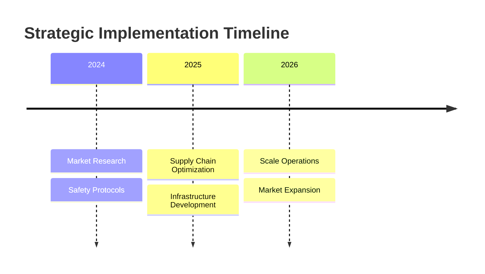
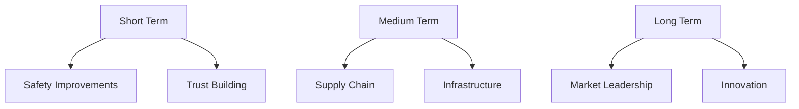

# 🚗 Indian Electric Two-Wheeler Market
## Strategic Analysis & Solutions 2024-2027

> [!important] Executive Summary
> Market Size: ₹50,000 Cr | CAGR: 44.8% | EV Adoption Target: 100%
> 
> **Key Focus Areas:**
> - Safety & Quality Enhancement
> - Supply Chain Localization
> - Infrastructure Development
> - Innovation Leadership

> [!tip] Strategic Vision
> Transforming India's EV landscape through innovation, safety, and sustainable growth
>
> **Core Pillars:**
> 1. 🛡️ Safety Excellence
> 2. ⛓️ Supply Chain Resilience
> 3. 🔋 Infrastructure Leadership
> 4. 💡 Technology Innovation

---
## 📊 Market Overview & Challenges



> [!example] Market Intelligence Dashboard
> 
> | Metric | Current | 2027 Target |
> |--------|---------|-------------|
> | Market Size | ₹15,000 Cr | ₹50,000 Cr |
> | CAGR | 44.8% | Sustained |
> | Market Share | 12% | 40% |
> | Charging Points | 1,742 | 100,000+ |
>
> **Growth Drivers:**
> - Government Incentives
> - Rising Fuel Costs
> - Environmental Awareness
> - Technology Advancements
> - Market size: ₹50,000 crore by 2027
> - Growth rate: 44.8% CAGR
> - Target: 100% EV adoption

---
## 🔬 Safety & Trust Analysis



> [!warning] Critical Safety Concerns
> 1. Thermal Management
> 2. Battery Cell Quality
> 3. BMS Reliability

| Company | Safety Measures | Trust Initiatives |
|---------|----------------|-------------------|
| Ola     | Enhanced BMS   | Customer Service  |
| Ather   | Smart Monitoring| Transparency     |
| TVS     | Quality Control | Service Network  |

---
## ⛓️ Supply Chain Solutions



> [!tip] Supply Chain Strategy
> - Localization of manufacturing
> - Multiple supplier partnerships
> - R&D investments

---
## 🔌 Infrastructure Development

```mermaid
gantt
    title Charging Infrastructure Roadmap
    dateFormat  YYYY-Q1
    section Phase 1
    Urban Centers    :2024-Q1, 1y
    section Phase 2
    Highway Network  :2024-Q3, 1y
    section Phase 3
    Rural Coverage   :2025-Q1, 2y
```

> [!example] Infrastructure Models
> 1. Fast-charging stations
> 2. Battery swapping hubs
> 3. Home charging solutions

---
## 💼 Business Strategy



> [!info] Strategic Focus Areas
> - Product Innovation
> - Customer Experience
> - Market Expansion

---
## 📈 Implementation Plan



| Phase | Duration | Key Deliverables |
|-------|----------|------------------|
| 1     | 6 months | Safety Standards |
| 2     | 1 year   | Supply Chain    |
| 3     | 1 year   | Infrastructure  |

---
## 🎯 Recommendations & Outlook



> [!success] Key Takeaways
> 1. Focus on safety first
> 2. Build robust supply chain
> 3. Invest in infrastructure
> 4. Innovation leadership

> [!note] Future Outlook
> The Indian EV two-wheeler market shows strong potential for growth with proper strategic implementation and focus on key challenges.

