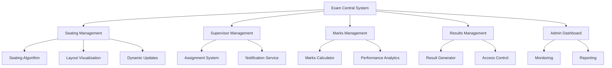
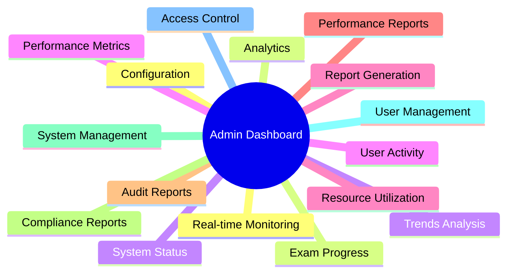
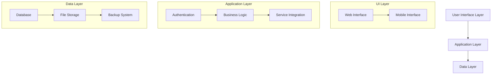

# Exam Central Project Documentation

> [!note] Project Overview
> A centralized web application for Mumbai University to streamline and automate examination-related activities, ensuring accuracy, efficiency, and transparency in educational institutions.

## 1. Project Objective

The primary objective is to develop a comprehensive examination management system that will:
- Automate critical examination processes
- Reduce manual intervention and errors
- Enhance operational efficiency
- Ensure data security and transparency
- Provide real-time monitoring and reporting capabilities

## 2. System Architecture

## 3. Module Breakdown

### 3.1 Seating Arrangement Module

> [!important] Core Features
> - Automated seating allocation
> - Real-time updates
> - Visual layout management

#### Requirements:
- Student distribution algorithm based on:
- Branch
- Semester
- Subject
- Special accommodations
- Dynamic adjustment capabilities
- Interactive seating visualization
- Room capacity management
- Block allocation system

### 3.2 Supervisor Assignment Module

#### Requirements:
- Automated assignment system
- Workload balancing
- Real-time availability tracking
- Notification system integration
- Schedule management

### 3.3 Semester Marks Calculation Module

| Component | Weight | Features |
|-----------|---------|-----------|
| Internal Assessment | 30% | Continuous evaluation |
| Attendance | 10% | Automated tracking |
| Practical Exams | 20% | Lab performance |
| Final Exam | 40% | End semester |

#### Requirements:
- Automated calculation system
- Secure data input interface
- Performance analytics
- Grade calculation
- Progress tracking

### 3.4 Results Management Module

> [!tip] Security Features
> - Role-based access control
> - Encryption of sensitive data
> - Audit logging
> - Secure result publication

#### Requirements:
- Secure result generation
- Multi-level access control
- Detailed scorecards
- Analysis reports
- Result verification system

### 3.5 Administrative Dashboard

#### Requirements:
- Centralized control panel
- Real-time monitoring
- Report generation
- Analytics dashboard
- Policy compliance tracking

## 4. Component Relationships

## 5. Expected Impact and Outcomes

> [!success] Key Benefits
> 1. Reduced administrative overhead
> 2. Enhanced accuracy in exam management
> 3. Improved stakeholder satisfaction
> 4. Efficient resource utilization
> 5. Better decision-making through analytics

### 5.1 Quantifiable Outcomes
- 90% reduction in manual data entry errors
- 70% faster result processing
- 50% reduction in administrative workload
- 100% transparency in exam operations
- 80% improvement in resource utilization

### 5.2 Long-term Benefits
- Standardized examination processes
- Enhanced institutional reputation
- Improved student satisfaction
- Better faculty engagement
- Scalable examination management

> [!warning] Implementation Considerations
> - Proper training for all stakeholders
> - Regular system updates and maintenance
> - Robust backup and recovery procedures
> - Continuous monitoring and improvement
> - Compliance with educational standards

