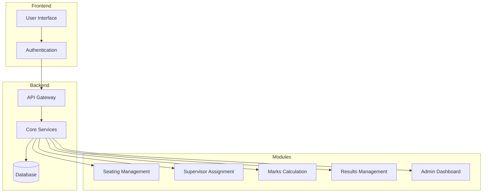
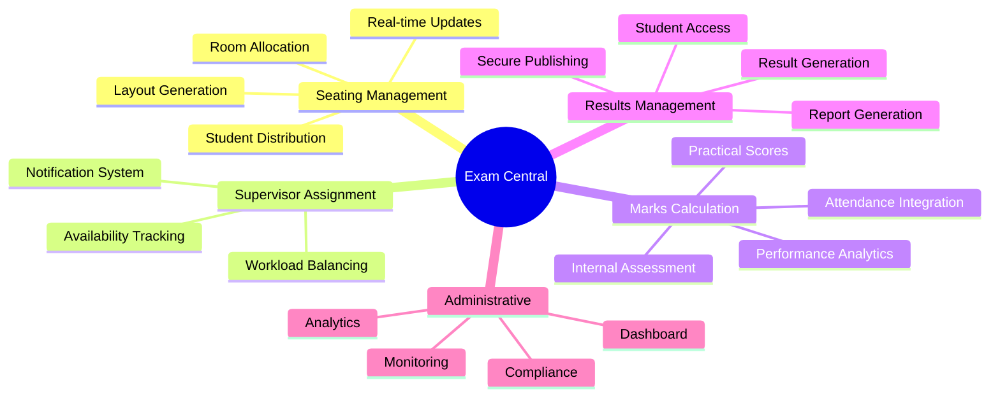
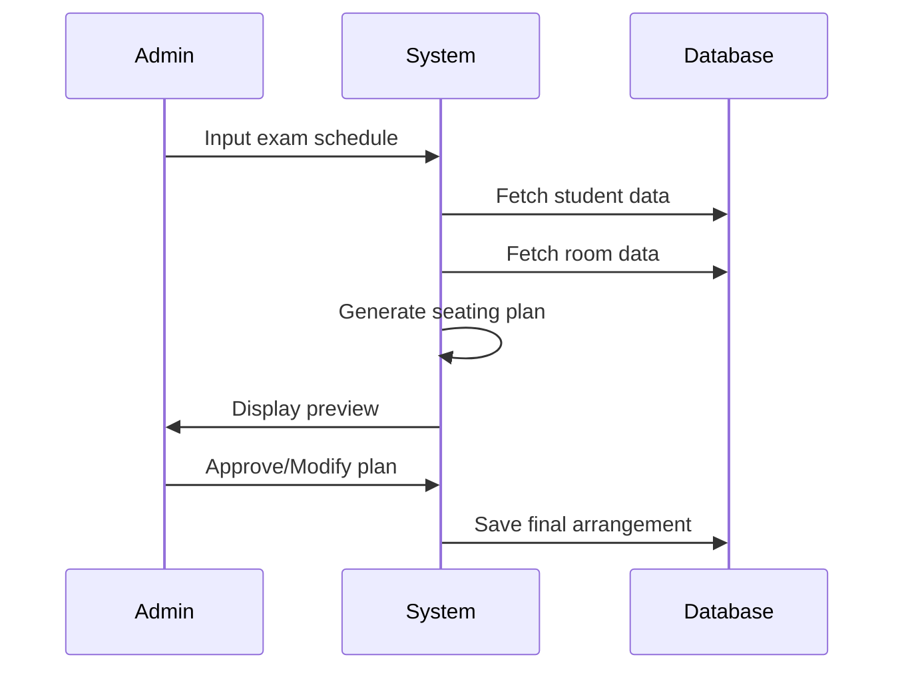
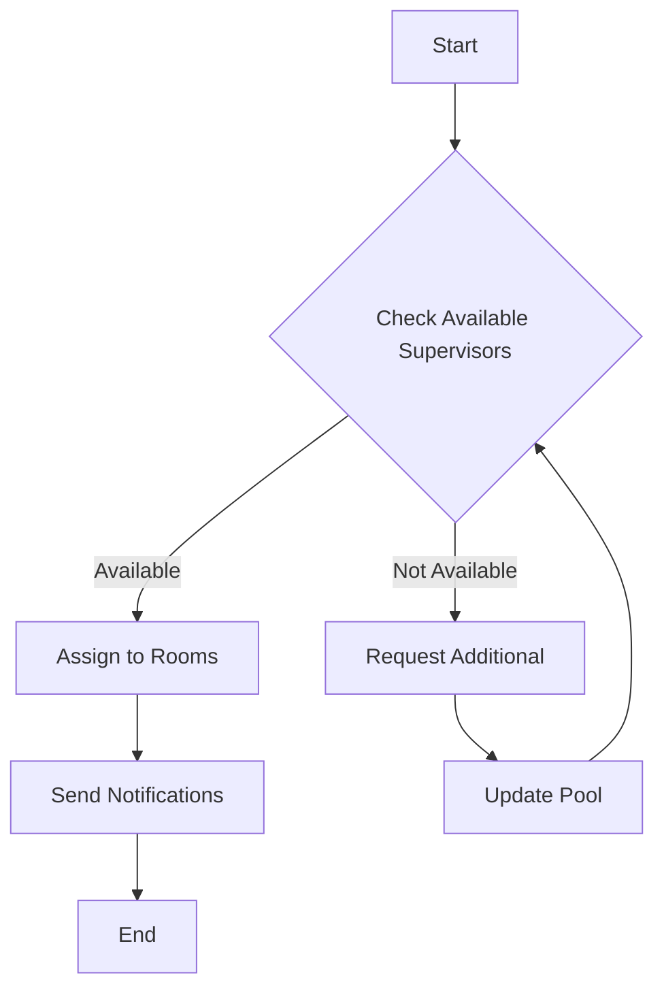
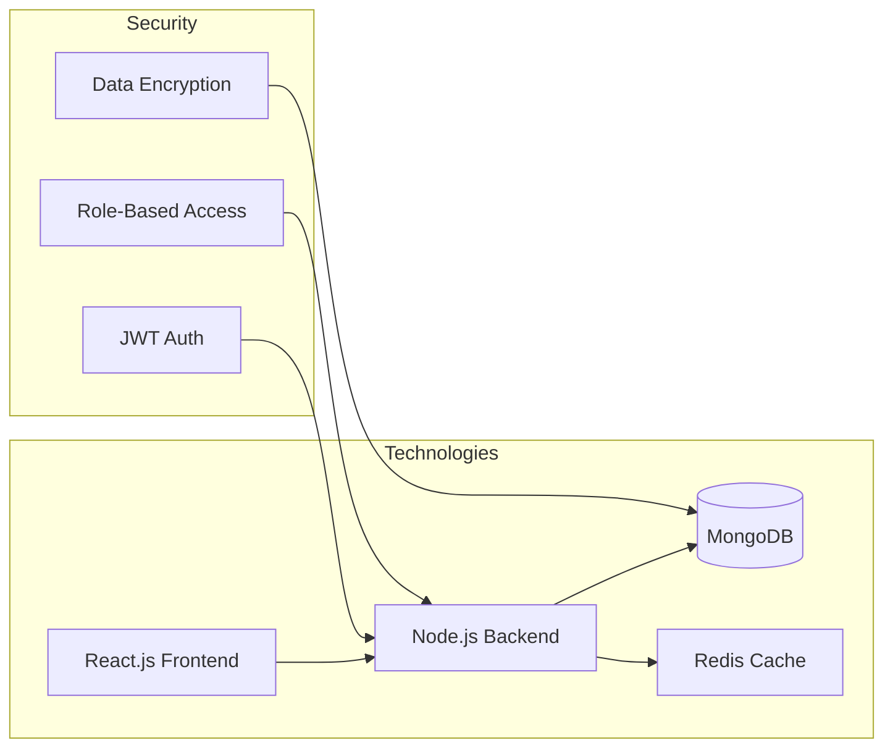
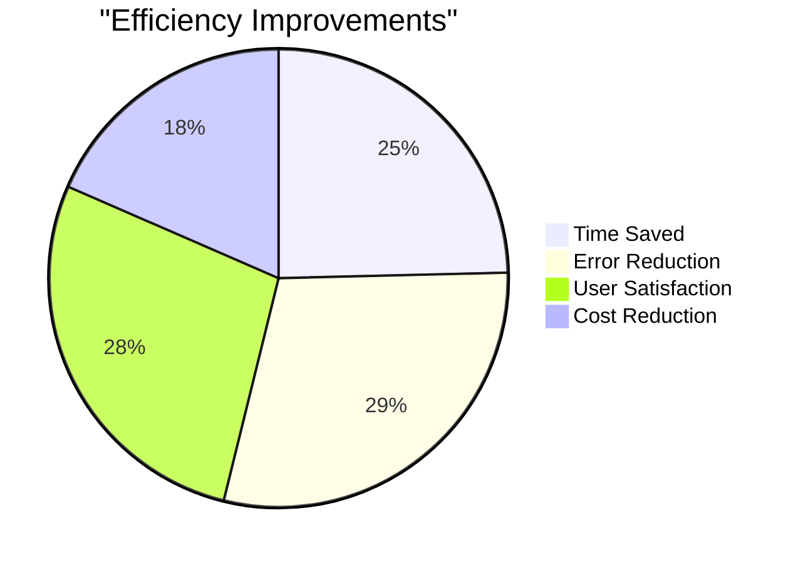

# Exam Central Project Documentation

> [!info] Project Overview
> Exam Central is a comprehensive web application designed to streamline and automate examination-related activities for Mumbai University. This centralized system manages seating arrangements, supervisor assignments, marks calculations, and result generation.

## 🎯 Project Objectives

- Streamline examination management processes
- Automate critical examination tasks
- Ensure accuracy and transparency
- Reduce administrative overhead
- Enable scalable examination handling

## 🏗️ System Architecture

## 📋 Module Overview

## 🔍 Detailed Module Descriptions

### 1. Seating Arrangement Module

> [!note] Key Features
> - Automated seating allocation
> - Dynamic adjustment capability
> - Visual layout management
> - Special accommodation handling

#### Process Flow

### 2. Supervisor Assignment Module

> [!note] Key Features
> - Automated supervisor allocation
> - Workload distribution
> - Real-time notifications
> - Schedule management

#### Process Flow

### 3. Marks Calculation Module

> [!important] Components
> - Internal assessment scores
> - Attendance records
> - Practical examination marks
> - Final calculation engine

| Component | Weight | Description |
|-----------|---------|-------------|
| Internal Assessment | 30% | Continuous evaluation |
| Attendance | 10% | Class participation |
| Practical Exam | 20% | Lab performance |
| Final Exam | 40% | End semester exam |

### 4. Results Management Module

> [!warning] Security Measures
> - Role-based access control
> - Data encryption
> - Audit logging
> - Version control

## 💻 Implementation Details

## 📊 Expected Impact

> [!success] Benefits
> - 80% reduction in manual processing time
> - 95% accuracy in seating arrangements
> - Real-time visibility of examination processes
> - Enhanced data security and compliance

### Performance Metrics

## 🔗 Related Links

- [[Seating Management]]
- [[Supervisor Assignment]]
- [[Marks Calculation]]
- [[Results Management]]
- [[Administrative Dashboard]]

---

> [!tip] For more information
> Contact the project team at exam.central@university.edu

