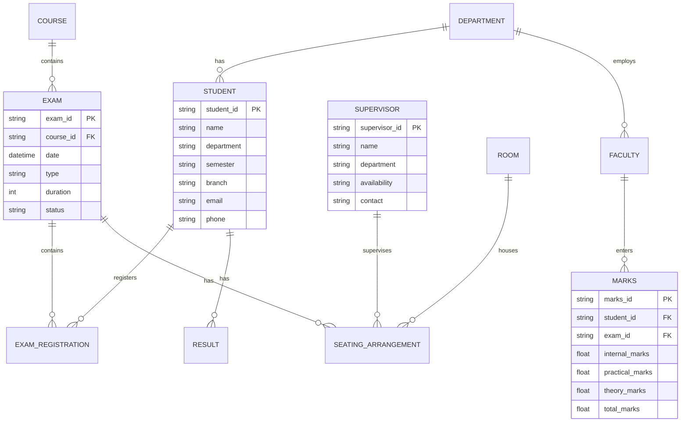
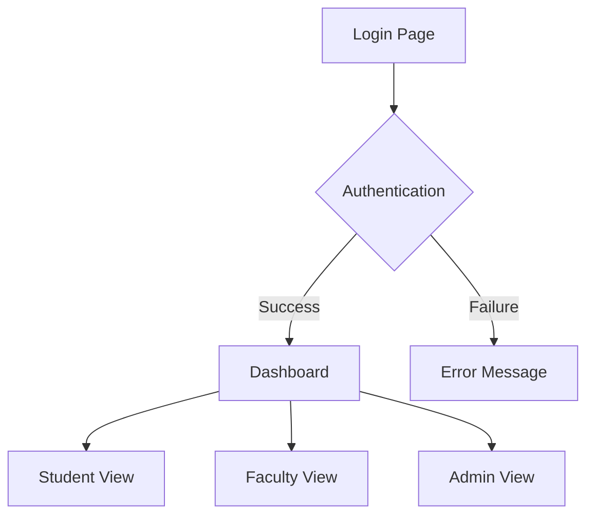
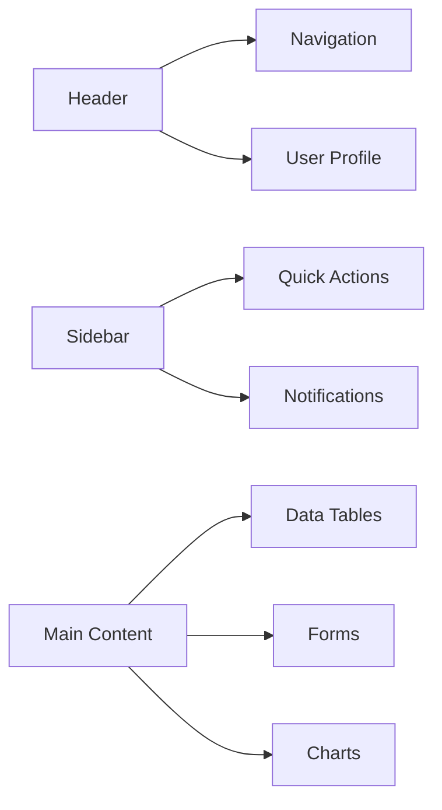
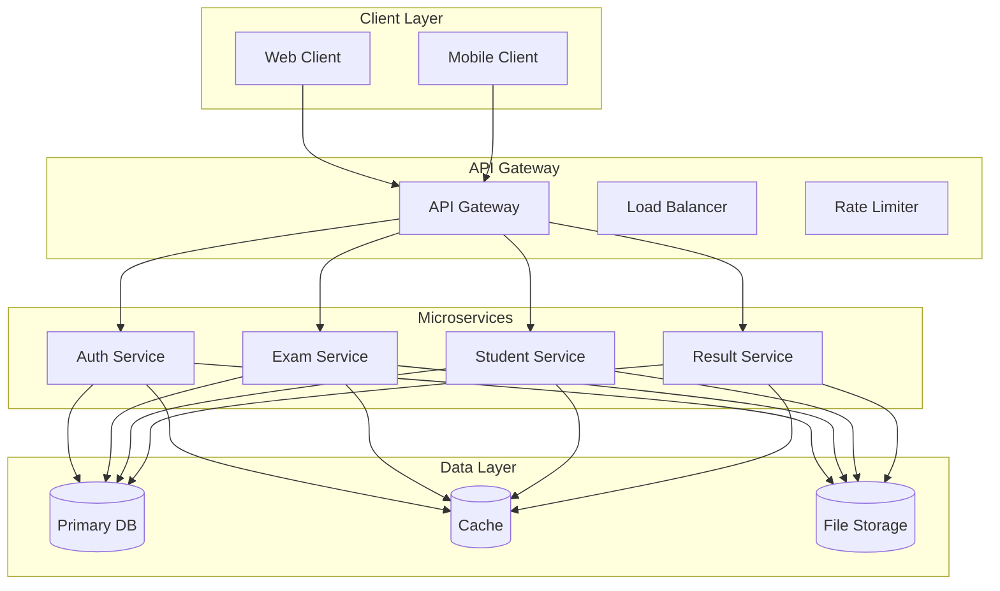
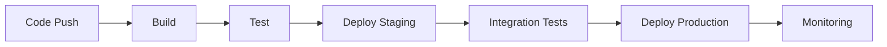
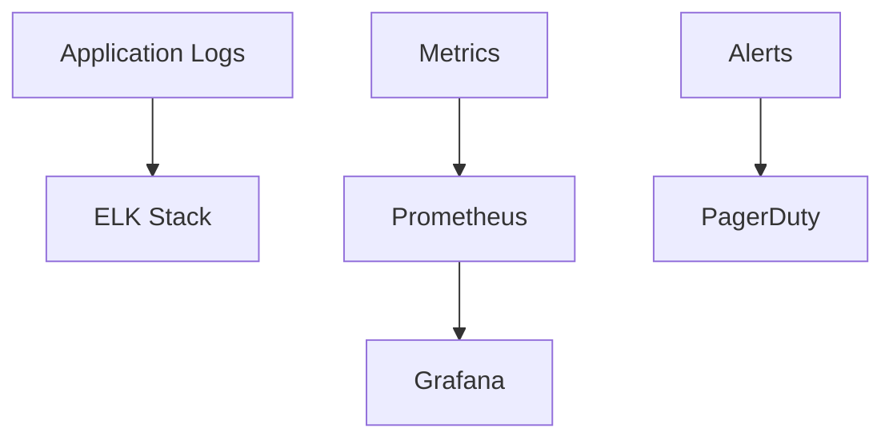

# Exam Central - Technical Documentation

## 1. Database Design

### 1.1 Entity Relationship Diagram



### 1.2 Schema Definitions

```sql
CREATE TABLE students (
    student_id VARCHAR(20) PRIMARY KEY,
    name VARCHAR(100) NOT NULL,
    department VARCHAR(50),
    semester INTEGER,
    branch VARCHAR(50),
    email VARCHAR(100) UNIQUE,
    phone VARCHAR(15)
);

CREATE TABLE exams (
    exam_id VARCHAR(20) PRIMARY KEY,
    course_id VARCHAR(20) REFERENCES courses(course_id),
    exam_date TIMESTAMP,
    type VARCHAR(50),
    duration INTEGER,
    status VARCHAR(20)
);
```

## 2. System Wireframes

### 2.1 Login Flow



### 2.2 Key UI Components



## 3. Technical Architecture

### 3.1 System Components



## 4. API Specifications

### 4.1 REST Endpoints

```yaml
/api/v1/auth:
/login:
    post:
    description: User authentication
    request:
        body:
        username: string
        password: string
    response:
        token: string
        user: object

/api/v1/exams:
get:
    description: List all exams
    headers:
    Authorization: Bearer token
    response:
    exams: array
```

## 5. Development Stack

### Frontend
- React.js with TypeScript
- Redux for state management
- Material-UI components
- Jest for testing
- Axios for API calls

### Backend
- Node.js with Express
- Python for ML components
- MongoDB for primary database
- Redis for caching
- JWT for authentication

### DevOps
- Docker containers
- Kubernetes orchestration
- Jenkins CI/CD
- AWS cloud infrastructure

## 6. Development Setup

### 6.1 Environment Configuration

```bash
# Backend Setup
npm install
cp .env.example .env
npm run setup-db
npm run dev

# Frontend Setup
cd client
npm install
npm start
```

### 6.2 Deployment Pipeline



### 6.3 Monitoring and Logging



