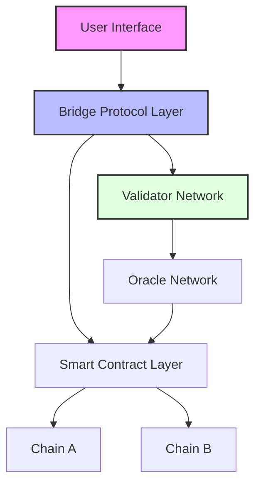
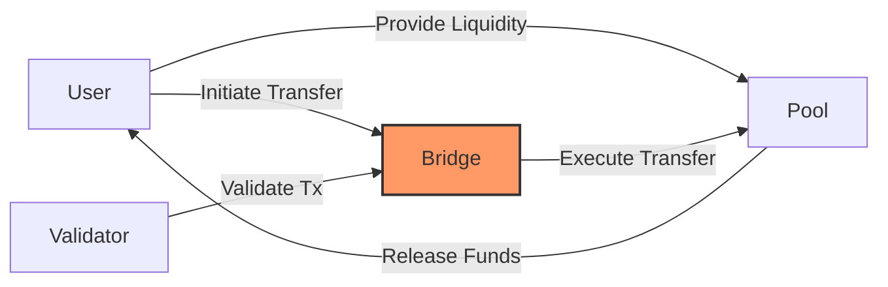
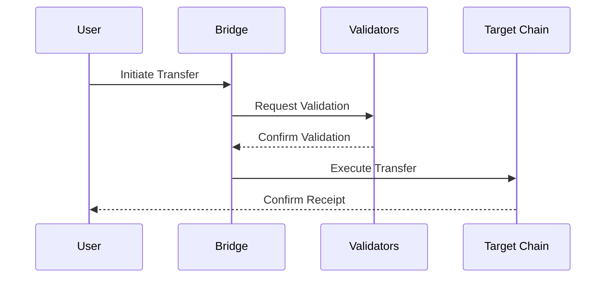

# SecureChainBridge: A Decentralized Cross-Chain Liquidity Protocol 🌉

> [!abstract] Executive Summary
> SecureChainBridge is a revolutionary cross-chain liquidity protocol that enables secure, efficient, and truly decentralized asset transfers across multiple blockchain networks. By implementing novel security mechanisms, including a distributed validator network, multi-layer verification, and automated risk assessment, we address the critical vulnerabilities that have plagued existing bridge solutions while maintaining optimal liquidity distribution.

## 🎯 Problem Analysis

> [!info] Current Challenges in Cross-Chain Bridges
> - Vulnerability to flash loan attacks and reentrancy exploits
> - Centralized custody risks
> - Liquidity fragmentation across chains
> - Lack of standardized security protocols
> - Insufficient protection for liquidity providers
> - Risk of liquidity runs during market volatility

## 🏗️ Solution Architecture

### Technical Overview

> [!note] Core Components
> 1. Distributed Validator Network (DVN)
> 2. Multi-signature Smart Contract Framework
> 3. Cross-Chain Message Protocol (CCMP)
> 4. Liquidity Management System (LMS)
> 5. Real-time Risk Assessment Engine

### Blockchain Integration

> [!tip] Supported Networks
> - Ethereum (Primary Hub)
> - BNB Chain
> - Polygon
> - Avalanche
> - Solana (Phase 2)
> - Cosmos (Phase 2)

### Security Measures

> [!warning] Security Framework
> - Zero-knowledge proof validation
> - Time-locked transactions
> - Multi-layer authentication
> - Automated circuit breakers
> - Decentralized oracle network

## 💻 Technical Implementation

### Smart Contracts Architecture

```solidity
// Core Bridge Contract
contract SecureChainBridge {
    struct BridgeTransaction {
        bytes32 txHash;
        address sender;
        uint256 amount;
        uint256 timestamp;
        bool validated;
    }
    
    mapping(bytes32 => BridgeTransaction) public transactions;
    
    // Implementation details...
}
```

### Consensus Mechanism

> [!important] Hybrid Consensus Model
> - Proof of Authority (PoA) for validator network
> - Threshold Signature Scheme (TSS)
> - Byzantine Fault Tolerance (BFT)
> - Stake-weighted voting

### Token Economics

> [!note] SCB Token Utility
> - Governance rights
> - Validator staking
> - Fee sharing
> - Liquidity mining rewards
> - Insurance pool participation

### Web3 Integration

```javascript
// Web3 Integration Example
const bridgeContract = new web3.eth.Contract(ABI, CONTRACT_ADDRESS);

async function initiateBridgeTransfer(amount, targetChain) {
    // Implementation details...
}
```

## 📊 System Diagrams

### System Architecture



### Use Case Diagram



### Process Flowchart



## 🔒 Security Features

> [!warning] Multi-Layer Security Implementation
> 1. **Validator Security**
>    - Distributed key generation
>    - Stake-based validation
>    - Periodic rotation
> 
> 2. **Transaction Security**
>    - Multi-signature requirements
>    - Time-locked execution
>    - Fraud proof system
> 
> 3. **Network Security**
>    - Cross-chain verification
>    - Rate limiting
>    - Emergency shutdown mechanism

## ⚠️ Risk Analysis

> [!failure] Risk Mitigation Strategies
> 1. **Technical Risks**
>    - Smart contract vulnerabilities
>    - Network congestion
>    - Oracle failures
> 
> 2. **Economic Risks**
>    - Liquidity imbalances
>    - Market volatility
>    - Token price fluctuations
> 
> 3. **Operational Risks**
>    - Validator misbehavior
>    - Network attacks
>    - Regulatory changes

## 📅 Implementation Roadmap

> [!example] Development Phases
> ### Phase 1 (Q1 2024)
> - Core protocol development
> - Initial security audits
> - Testnet deployment
> 
> ### Phase 2 (Q2 2024)
> - Mainnet launch
> - Validator onboarding
> - Additional chain integration
> 
> ### Phase 3 (Q3-Q4 2024)
> - Advanced features rollout
> - Ecosystem expansion
> - Governance implementation

---
> [!success] Future Vision
> SecureChainBridge aims to become the industry standard for secure cross-chain asset transfers, fostering a more connected and efficient blockchain ecosystem while maintaining the highest security standards and true decentralization.

