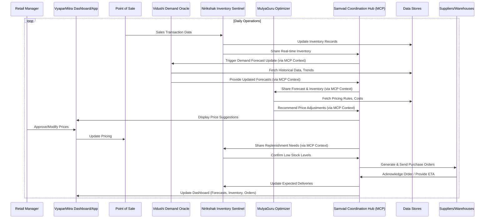

# 🛒 **VyaparMitra AI** - Multi-Agent Retail Inventory Optimization System


> *Empowering Indian Retailers with Intelligent Inventory Management*

---

## 📝 Table of Contents

1.  [Problem Statement](#problem-statement)
2.  [Current Challenges in Indian Retail](#current-challenges-in-indian-retail)
3.  [Introducing VyaparMitra AI](#introducing-vyaparmitra-ai)
4.  [System Architecture](#system-architecture)
5.  [Core Components & Agents](#core-components--agents)
    *   [Vidushi Demand Oracle](#vidushi-demand-oracle)
    *   [Nirikshak Inventory Sentinel](#nirikshak-inventory-sentinel)
    *   [MulyaGuru Price Optimizer](#mulyaguru-price-optimizer)
    *   [Samvad Coordination Hub](#samvad-coordination-hub)
6.  [Data Flow Diagram](#data-flow-diagram)
7.  [Agent Interaction Design (MCP)](#agent-interaction-design-mcp)
8.  [Technical Approach & Stack](#technical-approach--stack)
9.  [Code Structure](#code-structure)
10. [Deployment Options](#deployment-options)
11. [Benefits and Impact](#benefits-and-impact)
12. [Integration Guidelines](#integration-guidelines)
13. [Presentation Outline](#presentation-outline)
14. [FAQ & Support](#faq--support) 
15. [Conclusion](#conclusion) 
16. [Contact Information](#contact-information) 

---

## 1. Problem Statement


**Optimizing Retail Inventory with Multi Agents**

Indian retail businesses, ranging from local *kirana* stores to large supermarket chains, face persistent challenges in managing inventory effectively. The core issue lies in balancing product availability to meet customer demand against the costs associated with holding inventory (storage, spoilage, capital lock-up). Common problems include:

*   **Stockouts:** Running out of popular items, leading to lost sales and customer dissatisfaction.
*   **Overstocking:** Holding excess inventory, resulting in high carrying costs, potential obsolescence, and reduced profitability.

The goal is to design a multi-agent AI system that facilitates collaboration between different entities (stores, warehouses, suppliers, customer insights) to dynamically optimize inventory levels, predict demand accurately, reduce holding costs, prevent stockouts, and enhance overall supply chain efficiency for the unique Indian market.

---

## 2. Current Challenges in Indian Retail

The traditional inventory management process in India often involves:

*   **Manual Demand Forecasting:** Relies heavily on manager experience, basic historical data, and intuition. Difficulty accounting for diverse regional festivals, hyperlocal trends, and sudden market shifts.
*   **Physical Inventory Checks:** Labor-intensive, prone to errors, and provides only periodic snapshots, not real-time visibility.
*   **Reactive Pricing:** Price adjustments (e.g., for slow-moving stock) are often manual, delayed, and lack sophisticated optimization.
*   **Fragmented Communication:** Siloed information flow between stores, warehouses, and suppliers, leading to delays and inefficiencies. Limited adoption of digital tools, especially among smaller suppliers.

---

## 3. Introducing VyaparMitra AI


**VyaparMitra AI** (meaning "Business Friend AI" in Hindi) is a next-generation multi-agent platform designed specifically for the Indian retail context. It leverages advanced AI and collaboration protocols to create an intelligent, adaptive inventory optimization ecosystem.

**Core Goal:** To empower retailers with predictive insights, automated monitoring, dynamic pricing, and seamless supply chain coordination, leading to maximized sales and operational efficiency.

---

## 4. System Architecture


*(Placeholder: A detailed diagram showing Microservices/Agent-based architecture, MCP Layer, Data Stores, API Gateway, External Integrations)*

VyaparMitra employs a distributed, agent-based architecture where specialized AI agents collaborate through a central **Model Context Protocol (MCP)** layer.

```mermaid
graph LR
    subgraph VyaparMitra AI Platform
        direction TB
        MCP[Model Context Protocol Layer]
        subgraph Agents
            direction LR
            VDO[Vidushi Demand Oracle]
            NIS[Nirikshak Inventory Sentinel]
            MGO[MulyaGuru Price Optimizer]
            SCH[Samvad Coordination Hub]
        end
        subgraph Data Layer
            direction LR
            DS[Data Stores (Sales, Inventory, Supplier)]
            KM[Knowledge Base (Trends, Festivals)]
        end
        subgraph Interfaces
             direction LR
             API[API Gateway]
             UI[Retailer Dashboard]
             Mobile[Mobile App (Kirana)]
        end
        MCP --- Agents
        Agents --- DS
        Agents --- KM
        API --- MCP
        UI --- API
        Mobile --- API
    end

    subgraph External Systems
        direction TB
        POS[Point of Sale Systems]
        Warehouses[Warehouse Mgmt Systems]
        Suppliers[Supplier Systems/Portals]
        MarketData[Market Data Feeds]
    end

    API <--> POS
    API <--> Warehouses
    API <--> Suppliers
    API <--> MarketData

    classDef agent fill:#f9f,stroke:#333,stroke-width:2px;
    classDef protocol fill:#ccf,stroke:#333,stroke-width:2px;
    classDef data fill:#ffc,stroke:#333,stroke-width:2px;
    classDef interface fill:#cfc,stroke:#333,stroke-width:2px;
    class VDO,NIS,MGO,SCH agent;
    class MCP protocol;
    class DS,KM data;
    class API,UI,Mobile interface;

```

---

## 5. Core Components & Agents

VyaparMitra consists of four primary intelligent agents:

### 🔮 **Vidushi Demand Oracle**

*   **Cool Name:** Vidushi (Sanskrit for "Wise Woman" / "Learned")
*   **Icon:** 
*   **Function:** Predicts future demand with high accuracy.
*   **Technology:**
    *   **LLM:** Uses locally hosted Ollama `llama3:13b` (or similar powerful open-source model) fine-tuned on retail data for nuanced understanding of demand drivers. Can optionally leverage cloud APIs (Gemini/GPT-4) for complex trend analysis.
    *   **Time Series Models:** Integrates traditional models (ARIMA, Prophet) with LLM insights.
*   **Inputs:** Historical sales data, seasonality (Indian festivals, monsoons), promotions, local events, market trends, weather forecasts.
*   **Output:** SKU-level demand forecasts for different time horizons (daily, weekly, monthly) per store/region.

### 🕵️ **Nirikshak Inventory Sentinel**

*   **Cool Name:** Nirikshak (Hindi for "Inspector" / "Observer")
*   **Icon:** 
*   **Function:** Monitors real-time inventory levels and identifies discrepancies.
*   **Technology:**
    *   **Computer Vision:** Hugging Face Transformers (`facebook/detr-resnet-50` or similar) for potential image-based stock counting via mobile app (for smaller stores without advanced POS).
    *   **Anomaly Detection:** Statistical methods and ML models to flag deviations from expected stock levels.
    *   **IoT Integration:** APIs to connect with RFID or shelf sensors (optional for larger setups).
*   **Inputs:** POS transaction data, manual counts (if any), sensor data, expected delivery information.
*   **Output:** Real-time inventory levels, stockout alerts, low stock warnings, discrepancy reports, shelf-life tracking (for perishables).

### 💹 **MulyaGuru Price Optimizer**

*   **Cool Name:** MulyaGuru (Hindi for "Price Master/Expert")
*   **Icon:** 
*   **Function:** Recommends optimal pricing strategies to maximize revenue and minimize waste.
*   **Technology:**
    *   **LLM:** Ollama `orca-mini` (or similar) for reasoning about pricing rules, competitive landscape, and promotional impact.
    *   **Optimization Algorithms:** Reinforcement learning or simulation-based models to find optimal price points.
*   **Inputs:** Demand forecasts (from Vidushi), current inventory levels (from Nirikshak), competitor pricing, product costs, shelf-life data, business rules (margins).
*   **Output:** Dynamic price recommendations, promotional pricing strategies, markdown suggestions for aging/perishable stock.

### 🤝 **Samvad Coordination Hub**

*   **Cool Name:** Samvad (Sanskrit/Hindi for "Dialogue" / "Communication")
*   **Icon:** 
*   **Function:** Orchestrates communication and collaboration between agents, stores, warehouses, and suppliers.
*   **Technology:**
    *   **MCP Framework:** Core implementation of the Model Context Protocol.
    *   **API Integration:** Connects with external systems (Suppliers, WMS).
    *   **LLM (Optional):** Cloud LLM API (Gemini Pro / GPT-4) for complex negotiation simulation or generating communication drafts (e.g., supplier emails).
*   **Inputs:** Data and requests from all other agents, external system updates (supplier stock, delivery status).
*   **Output:** Coordinated actions (replenishment orders, stock transfer requests), unified context for agents, communication logs.

---

## 6. Data Flow Diagram


*(Placeholder: A detailed sequence or flow diagram showing data movement between POS, Agents, Databases, Suppliers etc.)*



---

## 7. Agent Interaction Design (MCP)


*(Placeholder: Diagram illustrating how agents communicate via MCP, sharing context)*

The **Model Context Protocol (MCP)** is central to VyaparMitra's collaborative intelligence. It's not just an API layer; it's a framework that allows agents to:

1.  **Share Contextualized Data:** Agents don't just exchange raw data (e.g., "Stock level is 5"). They share data with context (e.g., "Stock level for Item X at Store Y is 5, which is below the safety threshold based on Vidushi's forecast Z, considering the upcoming Diwali festival").
2.  **Maintain Shared Understanding:** MCP ensures agents operate with a consistent view of the current business state, goals, and constraints.
3.  **Enable Emergent Behavior:** By understanding the broader context, agents can make more intelligent, coordinated decisions than they could in isolation. For example, MulyaGuru might suggest a deeper discount if it knows Nirikshak flagged high spoilage risk and Vidushi predicts low near-term demand.
4.  **Standardize Communication:** Defines schemas and protocols for requests, responses, and state updates between agents.

**Interaction Example:**

*   `Nirikshak` detects low stock for *Basmati Rice* via MCP update.
*   `Samvad` receives this, checks context: `Vidushi` predicts high demand due to *Eid*.
*   `Samvad` requests `MulyaGuru` check if a price increase is viable before reordering.
*   `MulyaGuru` analyzes elasticity, suggests a minor increase via MCP.
*   `Samvad` simultaneously triggers an expedited replenishment order to the supplier.

---

## 8. Technical Approach & Stack

*   **Backend:** Python (FastAPI/Django)
*   **AI/ML:**
    *   **LLMs:** Ollama (Self-hosted `llama3:13b`, `orca-mini`), Optional Cloud APIs (Google Gemini, OpenAI GPT-4)
    *   **CV:** Hugging Face Transformers Library (PyTorch/TensorFlow backend)
    *   **Time Series:** `statsmodels`, `prophet`, `scikit-learn`
*   **MCP Implementation:** Custom Python library managing state and context exchange between agent microservices/modules. Could potentially leverage frameworks like LangChain Agents or Autogen if suitable.
*   **Database:** PostgreSQL (for structured data), Vector Database (e.g., ChromaDB, Pinecone - for semantic context in MCP)
*   **Frontend:** React / Vue.js (Web Dashboard), React Native / Flutter (Mobile App for Kirana)
*   **Infrastructure:** Docker, Kubernetes (for scalable deployment)

| Feature              | Primary Technology             | Model/Library Example        | Purpose                                     |
| :------------------- | :----------------------------- | :--------------------------- | :------------------------------------------ |
| Demand Forecasting   | Ollama (LLM) + Time Series   | `llama3:13b`, `prophet`      | Predict demand, understand drivers          |
| Inventory Vision     | Hugging Face Transformers      | `facebook/detr-resnet-50`    | Image-based counting (optional)             |
| Inventory Tracking   | Database + Anomaly Detection | PostgreSQL, `scikit-learn`   | Real-time levels, alerts                    |
| Pricing Optimization | Ollama (LLM) + RL/Sim        | `orca-mini`, Custom Algos    | Dynamic pricing, markdown strategy        |
| Agent Coordination   | Custom MCP Framework         | Python Classes/Services      | Context sharing, orchestration              |
| Complex Reasoning    | Cloud LLM API (Optional)     | Gemini Pro / GPT-4         | Negotiation, complex trend analysis       |
| Data Storage         | Relational + Vector DB       | PostgreSQL, ChromaDB         | Structured data, semantic context storage |

---

## 9. Code Structure

A potential high-level directory structure:

```plaintext
vyaparmitra_ai/
├── agents/                     # Core AI Agent modules
│   ├── vidushi_oracle/         # Demand Forecasting Agent
│   │   ├── main.py
│   │   ├── models.py           # LLM & Time Series models
│   │   └── data_processor.py
│   ├── nirikshak_sentinel/     # Inventory Monitoring Agent
│   │   ├── main.py
│   │   ├── vision_module.py    # Hugging Face integration
│   │   └── anomaly_detector.py
│   ├── mulyaguru_optimizer/    # Price Optimization Agent
│   │   ├── main.py
│   │   ├── pricing_models.py
│   │   └── rules_engine.py
│   └── samvad_hub/             # Coordination Agent & MCP Core
│       ├── main.py
│       ├── mcp_protocol.py     # MCP implementation
│       └── external_connectors.py # APIs for POS, Suppliers
├── api/                        # FastAPI/Django application
│   ├── main.py
│   ├── routers/
│   └── schemas.py
├── dashboard/                  # Frontend React/Vue code
│   ├── src/
│   └── package.json
├── mobile_app/                 # React Native/Flutter code (for Kirana)
│   ├── src/
│   └── package.json
├── data/                       # Data storage schemas, migrations
│   └── models.py
├── tests/                      # Unit and integration tests
├── docs/                       # Project documentation
├── scripts/                    # Utility scripts (deployment, training)
├── requirements.txt            # Python dependencies
├── Dockerfile                  # Docker configuration
└── docker-compose.yml          # Docker Compose for local setup
```

---

## 10. Deployment Options

*   **Cloud-Based (SaaS):** Hosted solution, easiest for most retailers. Data centers potentially located in India for data residency compliance.
*   **On-Premise:** For large retailers with specific security or infrastructure requirements. Requires managing hardware and Ollama instances locally.
*   **Hybrid:** Core platform on the cloud, with specific agents (like Nirikshak vision module) potentially running on edge devices in-store.

---

## 11. Benefits and Impact


Implementing VyaparMitra AI can lead to significant improvements:

*   **Reduced Stockouts:** Increase sales and customer satisfaction by having popular items available (Target: 15-25% reduction).
*   **Lower Inventory Costs:** Minimize overstocking, spoilage, and capital tied up in inventory (Target: 10-20% reduction in holding costs).
*   **Improved Margins:** Optimize pricing dynamically to maximize revenue (Target: 2-5% margin improvement).
*   **Enhanced Efficiency:** Automate manual tasks, reduce errors, and improve supply chain responsiveness (Target: 30-50% reduction in manual effort).
*   **Data-Driven Decisions:** Move from intuition-based to AI-powered inventory management.
*   **Scalability:** Solution caters to both small *kirana* stores (via mobile app) and large retail chains.

---

## 12. Integration Guidelines

*   **POS Systems:** Requires API integration to pull sales data and push price updates. Pre-built connectors for popular Indian POS systems (e.g., Gofrugal, Logic ERP).
*   **Warehouse Management Systems (WMS):** API integration for stock levels and fulfillment status.
*   **Supplier Systems:** Standard APIs for order placement and status updates. Potential for simpler interfaces (email/portal/WhatsApp bot) for less digitized suppliers.
*   **Data Migration:** Tools and support for migrating historical sales and inventory data during onboarding.

---

## 13. Presentation Outline

*(This section outlines slides for a presentation)*

1.  **Slide 1: Title Slide**
    *   VyaparMitra AI: Intelligent Inventory for Indian Retail
    *   Team Logo/Names
    *   Date
2.  **Slide 2: The Problem: Inventory Challenges in India**
    *   Stockouts & Overstocking impact
    *   Manual process limitations (Forecasting, Monitoring, Pricing)
    *   Specific Indian context (Festivals, Diverse Supply Chain)
    *   Image: Crowded Indian market / Kirana store
3.  **Slide 3: Our Solution: VyaparMitra AI**
    *   Introducing the Multi-Agent System
    *   Core Goal: Optimize, Predict, Coordinate
    *   Cool Name & Tagline
    *   High-level architecture diagram (simplified)
4.  **Slide 4: Meet the Agents**
    *   Vidushi Demand Oracle (Forecasting) - Icon & brief function
    *   Nirikshak Inventory Sentinel (Monitoring) - Icon & brief function
    *   MulyaGuru Price Optimizer (Pricing) - Icon & brief function
    *   Samvad Coordination Hub (Orchestration/MCP) - Icon & brief function
5.  **Slide 5: How It Works: Agent Collaboration (MCP)**
    *   Explain Model Context Protocol simply (Shared Brain)
    *   Simple interaction example (Low stock -> Forecast check -> Reorder)
    *   Diagram: Agents communicating via MCP
6.  **Slide 6: Technical Approach**
    *   Key Technologies: Ollama, Hugging Face, Cloud APIs, MCP
    *   Brief mention of backend/frontend stack
    *   Focus on AI components and their roles
7.  **Slide 7: Code Structure Overview**
    *   Show high-level directory structure
    *   Emphasize modularity (agents, API, frontend)
8.  **Slide 8: Benefits & Impact**
    *   Quantifiable benefits (Reduced stockouts %, Lower costs %, Margin uplift %)
    *   Qualitative benefits (Efficiency, Data-driven decisions)
    *   Image: Graph showing improved inventory turns / Happy customer
9.  **Slide 9: Target Audience & Deployment**
    *   Caters to Kirana stores (Mobile App) up to Large Chains
    *   Deployment Options (Cloud SaaS recommended)
10. **Slide 10: Team** (If applicable)
    *   Introduce team members and expertise
11. **Slide 11: Next Steps / Call to Action**
    *   Demo availability
    *   Contact Information
    *   Q&A

---
## 14. FAQ & Support 
*(Placeholder - Add Frequently Asked Questions and Support details relevant to the Indian market here)*

### Frequently Asked Questions

**Q: How does VyaparMitra handle regional festival variations across India?**
A: The Vidushi Demand Oracle includes a specialized Indian festival calendar module that accounts for regional variations. It maintains a comprehensive database of festivals across different states, their shifting dates (for festivals based on lunar calendars), and historical impact patterns on different product categories. Additionally, retailers can customize celebration significance weights based on their local customer demographics. The system automatically adjusts forecasts for each store location based on the regional festival patterns.

**Q: Can VyaparMitra work with our existing inventory management system?**
A: Yes, VyaparMitra is designed for seamless integration with most existing retail systems in India. We provide pre-built connectors for popular Indian inventory and POS systems including Ginesys, Logic ERP, Gofrugal, and Tally. For custom systems, we offer a standard API layer that enables data exchange without disrupting your existing operations. Our implementation team works with your IT staff to ensure smooth data flow and minimal disruption.

**Q: How does the system handle products with short shelf life, like fresh produce?**
A: VyaparMitra includes specialized capabilities for managing perishable goods, which are critical for the Indian retail sector. The MulyaGuru Price Optimizer implements dynamic pricing algorithms that factor in remaining shelf life to minimize wastage. The Nirikshak Inventory Sentinel tracks expiration dates and freshness indicators, prioritizing alerts for at-risk inventory. Additionally, Vidushi Demand Oracle incorporates weather forecasts that impact fresh produce demand, especially during monsoon seasons when shopping patterns change.

**Q: What kind of hardware is required for small kirana stores to implement VyaparMitra?**
A: For small kirana stores, we offer the "VyaparMitra Kirana" package, which requires minimal hardware - typically just an Android tablet (₹10,000-15,000 range) and an internet connection. The system is designed to work with intermittent connectivity, common in many parts of India. Most processing happens in the cloud, with essential functions available offline. Our mobile app is specifically optimized for low-end devices, ensuring affordability for small business owners across India.

**Q: How does the system handle data security and privacy concerns?**
A: VyaparMitra employs multi-layered security protocols aligned with Indian data protection standards. For retailers concerned about data residency, we offer India-region cloud hosting and on-premises deployment options. All data is encrypted both in transit and at rest. Access controls allow granular permissions setting, and the system maintains comprehensive audit logs. We never share or sell your business data, and our privacy practices comply with all applicable regulations including the upcoming Indian Personal Data Protection legislation.

**Q: How long does it take to see return on investment?**
A: While ROI varies by retail size and sector, our implementations typically show measurable financial benefits within 2-3 months. Small to medium enterprises generally achieve full ROI within 6-9 months, while larger chains may see complete return within 4-7 months due to economies of scale. The primary drivers of early returns are reduced stockouts of fast-moving items, lower inventory carrying costs, and improved margin management through dynamic pricing.

**Q: How does the system account for the unstructured and sometimes informal supply chains common in India?**
A: VyaparMitra is specifically designed to handle the nuances of India's diverse supply chains. The Samvad Coordination Hub includes flexible supplier management capabilities that can work with everything from organized corporate distributors to informal local suppliers. For suppliers without digital systems, we provide simple web and WhatsApp interfaces to receive orders and provide updates. The system can adapt to inconsistent delivery schedules and variable lead times that are common with smaller suppliers.

### Support Options

VyaparMitra offers comprehensive support tailored to the needs of Indian retailers:

#### Standard Support
- 12-hour support window (8 AM - 8 PM IST), Monday-Saturday
- Hindi and English language support
- Phone, email, and WhatsApp channels
- 24-hour response guarantee
- Monthly system health reports

#### Premium Support
- 24/7 support coverage
- Dedicated support manager
- Support in 10+ Indian regional languages
- 2-hour response guarantee for critical issues
- Quarterly business impact analysis
- On-site technical visits (quarterly)

#### Training Programs
- Initial staff training during implementation
- Monthly webinars on system optimization
- Video tutorials in multiple Indian languages
- Advanced user certification program
- Customized training for management teams

---

## 15. Conclusion

VyaparMitra AI represents a transformative approach to retail inventory management specifically designed for the unique challenges and opportunities of the Indian market. By harnessing the power of multi-agent AI systems working in concert, retailers of all sizes can achieve unprecedented efficiency, accuracy, and responsiveness in their operations.

The platform's intelligent components - from the Vidushi Demand Oracle's predictive capabilities to the MulyaGuru Price Optimizer's dynamic pricing intelligence - work seamlessly together through the innovative Model Context Protocol to create a solution greater than the sum of its parts.

As India's retail landscape continues to evolve, VyaparMitra provides the technological foundation to thrive in an increasingly competitive environment. Whether you're running a neighborhood kirana store or managing a national retail chain, VyaparMitra scales to your needs while delivering consistent ROI through improved inventory management.

Embrace the future of retail with VyaparMitra - where artificial intelligence meets Indian retail expertise to create smarter stores and happier customers.

> *"The right product, at the right price, at the right time - VyaparMitra makes it possible."*

---

## 16. Contact Information

For more information about VyaparMitra AI and how it can transform your retail operations:

📧 Email: info@vyaparmitra.ai  
🌐 Website: www.vyaparmitra.ai  
📱 Phone: +91-9876543210  

**Regional Offices:**  
Mumbai | Delhi | Bangalore | Hyderabad | Kolkata | Chennai