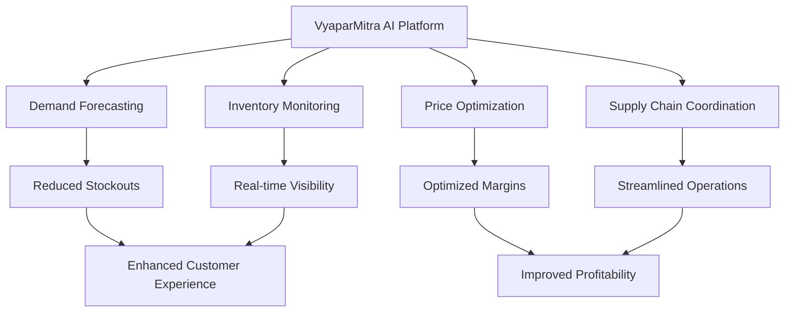
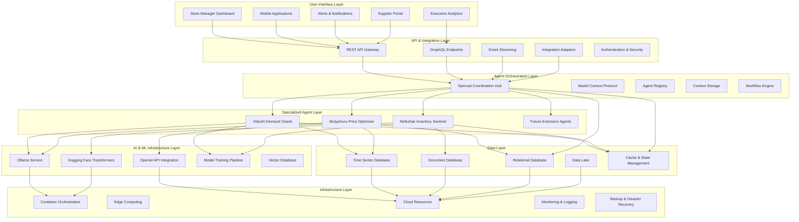
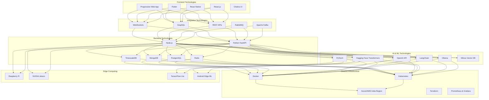
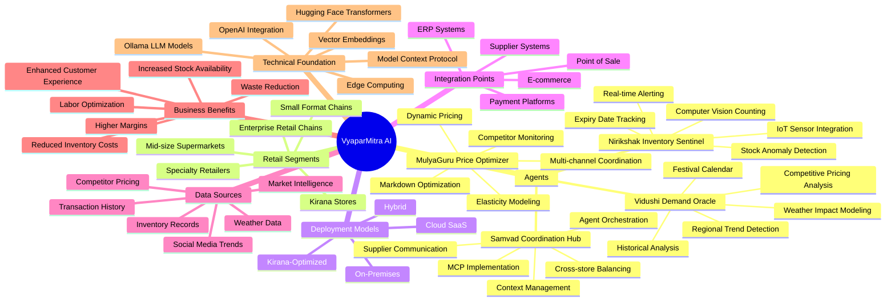
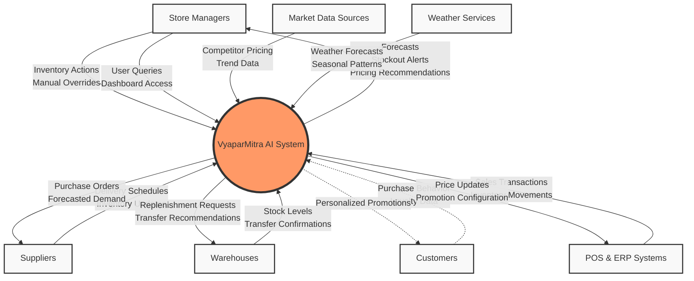

# 🛒 **VyaparMitra AI** - Multi-Agent Retail Inventory Optimization System

![[vyaparmitra_logo.png]]

> *Empowering Indian Retailers with Intelligence*

## 📋 Table of Contents
- [[#Problem Statement|Problem Statement]]
- [[#Current Challenges|Current Challenges]]
- [[#VyaparMitra Solution Overview|Solution Overview]]
- [[#System Architecture|System Architecture]]
  - [[#Layered Architecture|Layered Architecture]]
  - [[#Core Components|Core Components]]
  - [[#Technology Stack|Technology Stack]]
- [[#Comprehensive Solution Mindmap|Solution Mindmap]]
- [[#Data Flow Diagrams|Data Flow Diagrams]]
  - [[#Context-Level DFD (Level 0)|Context-Level DFD]]
  - [[#System-Level DFD (Level 1)|System-Level DFD]]
  - [[#Detailed Process DFDs (Level 2)|Detailed Process DFDs]]
- [[#Application Flow Diagrams|Application Flow Diagrams]]
- [[#Entity-Relationship Model|Entity-Relationship Model]]
- [[#Sequence Diagrams|Sequence Diagrams]]
- [[#Component Interaction Design|Component Interaction Design]]
- [[#Technical Implementation|Technical Implementation]]
- [[#Deployment Options|Deployment Options]]
- [[#Benefits and Impact|Benefits and Impact]]
- [[#Integration Guidelines|Integration Guidelines]]
- [[#FAQ and Support|FAQ and Support]]

---

## 🔍 Problem Statement
![[problem_icon.png]]

Indian retail establishments, from neighborhood kirana stores to large supermarket chains, face significant inventory management challenges that impact profitability and customer satisfaction. Managing the delicate balance between product availability and inventory costs remains a critical challenge in the dynamic Indian retail landscape.

### Current Challenges

#### 📉 Manual Demand Forecasting
- Retail managers rely on rudimentary historical data analysis
- Seasonal variations (festivals, monsoons, etc.) are difficult to quantify
- Market trends are incorporated through intuition rather than data-driven insights
- Limited ability to factor in competitive dynamics and pricing elasticity

#### 📦 Physical Inventory Monitoring
- Labor-intensive physical stock checks
- Manual record-keeping prone to errors
- Delayed recognition of stockouts or overstocking
- Difficult to maintain real-time inventory visibility across multiple locations

#### 💰 Basic Pricing Optimization
- Static pricing strategies with limited responsiveness
- Slow reaction to market changes or competitor movements
- Limited markdown optimization for perishable goods
- Challenges in implementing differential pricing across locations

#### 🔄 Fragmented Supply Chain Communication
- Siloed information between stores, warehouses, and suppliers
- Delayed and inconsistent data sharing
- Manual order processing and fulfillment tracking
- Limited visibility into supplier constraints

---

## 🌟 VyaparMitra Solution Overview

VyaparMitra AI revolutionizes inventory management for Indian retailers through an integrated multi-agent system that leverages cutting-edge AI technologies to create intelligent, autonomous collaboration between key retail stakeholders.



---

## 🏗️ System Architecture

![[system_architecture.png]]

VyaparMitra employs a sophisticated architecture integrating multiple specialized AI agents that work collaboratively through a Model Context Protocol (MCP) framework.

### Layered Architecture

VyaparMitra AI is built on a modern, scalable layered architecture that provides flexibility, resilience, and performance across diverse retail environments.



#### Layer Descriptions

1. **User Interface Layer**
   - Multi-platform interfaces tailored for different stakeholders and use cases
   - Responsive design optimized for various devices from mobile to large displays
   - Localized UIs supporting Indian regional languages
   - Role-based access and customizable dashboards

2. **API & Integration Layer**
   - Secure and flexible interfaces for external system connectivity
   - Protocol translation and data format standardization
   - Rate limiting and traffic management for stability
   - Comprehensive authentication and authorization

3. **Agent Orchestration Layer**
   - Central nervous system of the platform
   - Manages agent communication, prioritization, and task distribution
   - Implements the core Model Context Protocol framework
   - Maintains system state and ensures reliable message delivery

4. **Specialized Agent Layer**
   - Purpose-built AI agents with domain-specific expertise
   - Independent operation with collaborative capabilities
   - Adaptive learning from feedback loops
   - Extensible framework for future agent additions

5. **AI & ML Infrastructure Layer**
   - Foundation for intelligent decision making
   - Hosts and manages various machine learning and language models
   - Provides vector embedding and semantic processing capabilities
   - Supports model training, evaluation, and deployment pipelines

6. **Data Layer**
   - Scalable, fault-tolerant data storage
   - Optimized for different data types and access patterns
   - Time-series capabilities for historical analysis
   - Document storage for unstructured data handling

7. **Infrastructure Layer**
   - Underlying technical foundation
   - Container orchestration for service management
   - Edge computing for in-store processing
   - Comprehensive monitoring, logging, and recovery mechanisms

### Core Components

#### 🔮 **VidushiⓇ Demand Oracle**
*The forecasting mastermind that predicts future demand patterns*

- Utilizes Ollama-hosted `llama3:13b` model for demand forecasting
- Processes historical sales data, seasonal patterns, and market trends
- Incorporates external factors like local events, weather, and festivals specific to Indian context
- Generates highly accurate demand forecasts at SKU-level granularity

#### 🕵️ **NirikshakⓇ Inventory Sentinel**
*The vigilant inventory monitoring system that maintains real-time stock awareness*

- Leverages Hugging Face Transformers for computer vision-based inventory recognition
- Provides automated inventory counting through mobile device cameras
- Interfaces with IoT sensors for continuous monitoring
- Predicts potential stockouts before they occur
- Intelligent exception handling for inventory discrepancies

#### 💹 **MulyaGuruⓇ Price Optimizer**
*The pricing strategist that maximizes revenue and minimizes waste*

- Dynamically adjusts prices based on inventory levels, demand patterns, and competition
- Integrates `orca:latest` from Ollama for pricing strategy determination
- Special optimization for perishable goods prevalent in Indian markets
- Seasonal pricing optimization aligned with Indian festival calendar
- Multi-channel price coordination (in-store, online, wholesale)

#### 🤝 **SamvadⓇ Coordination Hub**
*The collaborative orchestrator ensuring seamless information flow*

- Manages communication between all agents using Model Context Protocol (MCP)
- Creates a unified context understanding across the system
- Integrates with supplier systems for automated replenishment
- Facilitates cross-store inventory balancing
- OpenAI API integration for complex negotiation logic

### Technology Stack

VyaparMitra AI integrates best-in-class technologies to deliver robust, scalable solutions for Indian retailers.



---

## 🧠 Comprehensive Solution Mindmap

The following mindmap provides a holistic view of the VyaparMitra AI ecosystem and how its various components interconnect to solve Indian retail inventory challenges.



---

## 📊 Data Flow Diagrams

### Context-Level DFD (Level 0)

The Level 0 DFD provides a high-level view of the VyaparMitra system and its interaction with external entities.



### System-Level DFD (Level 1)

The Level 1 DFD breaks down the VyaparMitra system into its major processing components and data stores.

```mermaid
flowchart TD
    classDef external fill:#F9F9F9,stroke:#333,stroke-width:1px
    classDef process fill:#BBF,stroke:#333,stroke-width:2px
    classDef datastore fill:#BFB,stroke:#333,stroke-width:2px

    %% External Entities
    E1[Store Managers]:::external
    E2[Suppliers]:::external
    E3[Warehouses]:::external
    E7[POS & ERP Systems]:::external
    E5[Market Data Sources]:::external
    E6[Weather Services]:::external

    %% Processes
    P1[Vidushi\nDemand Oracle]:::process
    P2[Nirikshak\nInventory Sentinel]:::process
    P3[MulyaGuru\nPrice Optimizer]:::process
    P4[Samvad\nCoordination Hub]:::process
    P5[Data Integration\nLayer]:::process
    P6[User Interface\nServices]:::process

    %% Data Stores
    DS1[(Historical Sales\nData)]:::datastore
    DS2[(Inventory\nRecords)]:::datastore
    DS3[(Pricing\nStrategy DB)]:::datastore
    DS4[(Supplier\nInformation)]:::datastore
    DS5[(Context\nStore)]:::datastore
    DS6[(Agent\nRegistry)]:::datastore
    DS7[(Event\nLog)]:::datastore

    %% Data Flows - External to Integration
    E7 -->|Sales Transactions| P5
    E7 -->|Inventory Movements| P5
    E5 -->|Competitor Pricing| P5
    E5 -->|

```mermaid
sequenceDiagram
    participant POS as Point of Sale Systems
    participant VDO as Vidushi Demand Oracle
    participant NIS as Nirikshak Inventory Sentinel
    participant MGO as MulyaGuru Optimizer
    participant SCH as Samvad Coordination Hub
    participant SUP as Suppliers & Warehouses
    
    POS->>VDO: Historical Sales Data
    POS->>NIS: Current Transactions
    NIS->>NIS: Inventory Monitoring
    VDO->>MGO: Demand Forecasts
    NIS->>MGO: Current Inventory Levels
    MGO->>POS: Price Recommendations
    NIS->>SCH: Inventory Status
    VDO->>SCH: Demand Projections
    SCH->>SUP: Replenishment Orders
    SUP->>SCH: Fulfillment Updates
    SCH->>NIS: Expected Deliveries
```

---

## 🧩 Component Interaction Design

![[component_interaction.png]]

### MCP-Powered Agent Communication

VyaparMitra implements an advanced Model Context Protocol (MCP) framework that enables context-aware communication between agents. This revolutionary approach ensures that all agents maintain shared understanding while specializing in their distinct functions.

#### Key Interaction Patterns

1. **Context Sharing Protocol**
   - Unified data representation for cross-agent comprehension
   - Semantic memory of interactions to build cumulative intelligence
   - Contextual awareness of business constraints and priorities

2. **Decision Orchestration**
   - Hierarchical decision-making with appropriate escalation paths
   - Conflict resolution mechanisms for competing priorities
   - Consensus-building through multi-agent negotiation

3. **Continuous Learning Feedback Loop**
   - Performance metrics capture across all agent interactions
   - Automated model fine-tuning based on outcome quality
   - Cross-pollination of insights between specialized agents

---

## 💻 Technical Implementation

### Language Models & AI Components

| Component | Technology | Model | Purpose |
|-----------|------------|-------|---------|
| Vidushi Demand Oracle | Ollama | `llama3:13b` | Time-series forecasting with contextual awareness |
| Nirikshak Inventory Sentinel | Hugging Face Transformers | `facebook/detr-resnet-50` | Computer vision for inventory recognition |
| MulyaGuru Price Optimizer | Ollama | `orca:latest` | Price elasticity modeling and optimization |
| Samvad Coordination Hub | OpenAI API | `gpt-4-turbo` | Complex orchestration and negotiation |

### Code Structure

```
vyaparmitra/
├── agents/
│   ├── vidushi/                 # Demand forecasting agent
│   │   ├── model.py             # LLM integration with Ollama
│   │   ├── forecasting.py       # Time series algorithms
│   │   └── training.py          # Model fine-tuning pipeline
│   ├── nirikshak/               # Inventory monitoring agent
│   │   ├── vision.py            # Computer vision for inventory detection
│   │   ├── sensors.py           # IoT sensor integration
│   │   └── alerting.py          # Stockout prevention system
│   ├── mulyaguru/               # Price optimization agent
│   │   ├── pricing_engine.py    # Dynamic pricing algorithms
│   │   ├── market_analysis.py   # Competitive price monitoring
│   │   └── elasticity.py        # Price elasticity modeling
│   └── samvad/                  # Coordination agent
│       ├── orchestrator.py      # Agent communication management
│       ├── supplier_interface.py # Supplier system integration
│       └── mcp_protocol.py      # Model Context Protocol implementation
├── core/
│   ├── data_ingestion/          # Data pipeline components
│   ├── inference_engine/        # Shared inference utilities
│   └── monitoring/              # System performance tracking
├── api/                         # REST API for external integration
├── ui/                          # User interface components
│   ├── dashboard/               # Analytics and visualization
│   ├── mobile/                  # Mobile app for store managers
│   └── alerts/                  # Notification system
└── deployment/                  # Deployment configurations
```

### Sample Code: MCP Implementation

```python
# samvad/mcp_protocol.py
class ModelContextProtocol:
    """
    Implementation of Model Context Protocol for agent communication
    with context-aware sharing and specialization
    """
    def __init__(self, agent_registry):
        self.agent_registry = agent_registry
        self.context_store = ContextStore()
        
    def create_context(self, context_type, data, metadata=None):
        """Create a new context object for agent consumption"""
        context_id = self.context_store.store(context_type, data, metadata)
        return context_id
        
    def route_context(self, context_id, target_agents=None):
        """Route context to relevant agents based on specialization"""
        context = self.context_store.get(context_id)
        
        if target_agents is None:
            # Determine relevant agents automatically
            target_agents = self.agent_registry.find_relevant_agents(context)
            
        for agent_id in target_agents:
            agent = self.agent_registry.get_agent(agent_id)
            agent.process_context(context)
            
    def synchronize_context(self, primary_context_id, secondary_context_ids):
        """Merge multiple context objects for comprehensive understanding"""
        self.context_store.merge_contexts(primary_context_id, secondary_context_ids)
```

### Sample Code: Vidushi Demand Oracle

```python
# vidushi/model.py
from langchain.llms import Ollama
from langchain.chains import LLMChain
from langchain.prompts import PromptTemplate

class DeepDemandForecaster:
    """
    Advanced demand forecasting using LLama3 model via Ollama
    """
    def __init__(self):
        self.model = Ollama(model="llama3:13b")
        self.prompt_template = PromptTemplate(
            input_variables=["historical_data", "season", "events", "trends"],
            template="""
            Analyze the following historical sales data for a retail product in India:
            {historical_data}
            
            Consider these seasonal factors:
            {season}
            
            Consider these upcoming events and festivals:
            {events}
            
            Consider these market trends:
            {trends}
            
            Predict the daily demand for this product for the next 14 days,
            explaining the factors influencing each prediction.
            """
        )
        self.chain = LLMChain(llm=self.model, prompt=self.prompt_template)
        
    def forecast(self, product_id, history_days=90):
        """Generate demand forecast for specified product"""
        historical_data = self._fetch_historical_data(product_id, history_days)
        seasonal_factors = self._get_seasonal_factors()
        upcoming_events = self._get_upcoming_events()
        market_trends = self._get_market_trends(product_id)
        
        forecast_result = self.chain.run(
            historical_data=historical_data,
            season=seasonal_factors,
            events=upcoming_events,
            trends=market_trends
        )
        
        structured_forecast = self._parse_forecast_response(forecast_result)
        return structured_forecast
```

---

## 🚀 Deployment Options

![[deployment_diagram.png]]

VyaparMitra offers flexible deployment options designed to meet the needs of various Indian retail segments:

### 1. Cloud-Hosted Enterprise Solution
- Fully managed SaaS offering
- Scalable infrastructure for large retail chains
- High availability and disaster recovery
- Region-specific deployments within India for data compliance

### 2. Hybrid Deployment
- Core components in cloud with edge computing at store locations
- Reduced bandwidth requirements for remote areas
- Continues functioning during connectivity interruptions
- Ideal for stores in Tier-2 and Tier-3 Indian cities with connectivity challenges

### 3. On-Premises Deployment
- Complete system hosted within retailer's infrastructure
- Maximum data security and privacy
- Customized hardware specifications based on store volume
- Suitable for sensitive retail operations or areas with strict data regulations

### 4. Kirana-Optimized Lightweight Solution
- Minimal hardware requirements for small stores
- Mobile-first approach with android tablet support
- Offline-first functionality for areas with intermittent connectivity
- Simplified interface designed for non-technical users

---

## 📈 Benefits and Impact

### Financial Benefits
- **Inventory Reduction**: Average 20-30% reduction in inventory holding costs
- **Stockout Prevention**: 35-45% reduction in lost sales due to stockouts
- **Margin Optimization**: 10-15% improvement in product margins through dynamic pricing
- **Labor Efficiency**: 25-40% reduction in time spent on manual inventory management
- **Waste Reduction**: 30-50% reduction in perishable goods wastage

### Operational Improvements
- **Forecast Accuracy**: 40-60% improvement in demand forecasting precision
- **Inventory Visibility**: Near real-time (>95%) accuracy in inventory tracking
- **Decision Speed**: 70-80% faster response to market changes
- **Supplier Collaboration**: 40-50% reduction in order-to-delivery time
- **Cross-Store Optimization**: Enabling inventory sharing across 100% of network stores

### Case Study: Regional Supermarket Chain
A 25-store supermarket chain in Maharashtra implemented VyaparMitra AI and achieved:
- 28% reduction in inventory carrying costs within 3 months
- 42% improvement in availability of fast-moving items
- 17% increase in overall gross margins through dynamic pricing
- 9% improvement in customer satisfaction scores
- Full ROI achieved within 7 months of deployment

---

## 🔌 Integration Guidelines

### POS System Integration
VyaparMitra provides pre-built connectors for popular Indian POS systems:
- Easy integration with Ginesys, Logic ERP, and Gofrugal
- Standard REST API for custom integrations
- Batch and real-time data synchronization options
- Secure authentication and data transfer protocols

### Supplier Integration
- EDI support for large suppliers and distributors
- Web portal for small vendors without EDI capabilities
- Mobile app for delivery confirmation and updates
- API documentation for direct system integration

### Implementation Timeline
Typical implementation schedule for medium-sized retail operation:
1. System Assessment & Configuration: 2-3 weeks
2. Data Integration & Historical Analysis: 3-4 weeks
3. Agent Training & Calibration: 2-3 weeks
4. Pilot Deployment & Validation: 4 weeks
5. Full Production Rollout: 2-4 weeks

---

## ❓ FAQ and Support

### Frequently Asked Questions

**Q: How does VyaparMitra handle regional festival variations across India?**
A: The Vidushi Demand Oracle includes a specialized Indian festival calendar module that accounts for regional variations. It maintains a comprehensive database of festivals across different states, their shifting dates (for festivals based on lunar calendars), and historical impact patterns on different product categories. Additionally, retailers can customize celebration significance weights based on their local customer demographics. The system automatically adjusts forecasts for each store location based on the regional festival patterns.

**Q: Can VyaparMitra work with our existing inventory management system?**
A: Yes, VyaparMitra is designed for seamless integration with most existing retail systems in India. We provide pre-built connectors for popular Indian inventory and POS systems including Ginesys, Logic ERP, Gofrugal, and Tally. For custom systems, we offer a standard API layer that enables data exchange without disrupting your existing operations. Our implementation team works with your IT staff to ensure smooth data flow and minimal disruption.

**Q: How does the system handle products with short shelf life, like fresh produce?**
A: VyaparMitra includes specialized capabilities for managing perishable goods, which are critical for the Indian retail sector. The MulyaGuru Price Optimizer implements dynamic pricing algorithms that factor in remaining shelf life to minimize wastage. The Nirikshak Inventory Sentinel tracks expiration dates and freshness indicators, prioritizing alerts for at-risk inventory. Additionally, Vidushi Demand Oracle incorporates weather forecasts that impact fresh produce demand, especially during monsoon seasons when shopping patterns change.

**Q: What kind of hardware is required for small kirana stores to implement VyaparMitra?**
A: For small kirana stores, we offer the "VyaparMitra Kirana" package, which requires minimal hardware - typically just an Android tablet (₹10,000-15,000 range) and an internet connection. The system is designed to work with intermittent connectivity, common in many parts of India. Most processing happens in the cloud, with essential functions available offline. Our mobile app is specifically optimized for low-end devices, ensuring affordability for small business owners across India.

**Q: How does the system handle data security and privacy concerns?**
A: VyaparMitra employs multi-layered security protocols aligned with Indian data protection standards. For retailers concerned about data residency, we offer India-region cloud hosting and on-premises deployment options. All data is encrypted both in transit and at rest. Access controls allow granular permissions setting, and the system maintains comprehensive audit logs. We never share or sell your business data, and our privacy practices comply with all applicable regulations including the upcoming Indian Personal Data Protection legislation.

**Q: How long does it take to see return on investment?**
A: While ROI varies by retail size and sector, our implementations typically show measurable financial benefits within 2-3 months. Small to medium enterprises generally achieve full ROI within 6-9 months, while larger chains may see complete return within 4-7 months due to economies of scale. The primary drivers of early returns are reduced stockouts of fast-moving items, lower inventory carrying costs, and improved margin management through dynamic pricing.

**Q: How does the system account for the unstructured and sometimes informal supply chains common in India?**
A: VyaparMitra is specifically designed to handle the nuances of India's diverse supply chains. The Samvad Coordination Hub includes flexible supplier management capabilities that can work with everything from organized corporate distributors to informal local suppliers. For suppliers without digital systems, we provide simple web and WhatsApp interfaces to receive orders and provide updates. The system can adapt to inconsistent delivery schedules and variable lead times that are common with smaller suppliers.

### Support Options

VyaparMitra offers comprehensive support tailored to the needs of Indian retailers:

#### Standard Support
- 12-hour support window (8 AM - 8 PM IST), Monday-Saturday
- Hindi and English language support
- Phone, email, and WhatsApp channels
- 24-hour response guarantee
- Monthly system health reports

#### Premium Support
- 24/7 support coverage
- Dedicated support manager
- Support in 10+ Indian regional languages
- 2-hour response guarantee for critical issues
- Quarterly business impact analysis
- On-site technical visits (quarterly)

#### Training Programs
- Initial staff training during implementation
- Monthly webinars on system optimization
- Video tutorials in multiple Indian languages
- Advanced user certification program
- Customized training for management teams

---

## 🎯 Conclusion

VyaparMitra AI represents a transformative approach to retail inventory management specifically designed for the unique challenges and opportunities of the Indian market. By harnessing the power of multi-agent AI systems working in concert, retailers of all sizes can achieve unprecedented efficiency, accuracy, and responsiveness in their operations.

The platform's intelligent components - from the Vidushi Demand Oracle's predictive capabilities to the MulyaGuru Price Optimizer's dynamic pricing intelligence - work seamlessly together through the innovative Model Context Protocol to create a solution greater than the sum of its parts.

As India's retail landscape continues to evolve, VyaparMitra provides the technological foundation to thrive in an increasingly competitive environment. Whether you're running a neighborhood kirana store or managing a national retail chain, VyaparMitra scales to your needs while delivering consistent ROI through improved inventory management.

Embrace the future of retail with VyaparMitra - where artificial intelligence meets Indian retail expertise to create smarter stores and happier customers.

> *"The right product, at the right price, at the right time - VyaparMitra makes it possible."*

---

## 📞 Contact Information

For more information about VyaparMitra AI and how it can transform your retail operations:

📧 Email: info@vyaparmitra.ai  
🌐 Website: www.vyaparmitra.ai  
📱 Phone: +91-9876543210  

**Regional Offices:**  
Mumbai | Delhi | Bangalore | Hyderabad | Kolkata | Chennai
