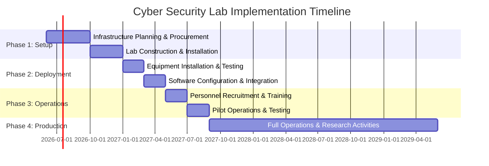

# 🛡️ Executive Summary


## 🏛️ Institution Details

**Bharatiya Vidya Bhavan's Sardar Patel Institute of Technology (SPIT)**
- **Department**: Electronics & Telecommunication Engineering
- **Location**: Andheri (West), Mumbai - 400058, Maharashtra, India
- **Principal Investigator**: Dr. D. D. Ambawade (IT Incharge & Associate Professor)
- **Proposal Type**: Government Research Funding Initiative

---

## 📋 Project Overview

### Vision Statement
To establish a **world-class, enterprise-grade Cyber Security Research and Training Laboratory** that serves as a hub for cutting-edge research, industry collaboration, and development of next-generation cybersecurity professionals capable of addressing emerging threats in Industry 4.0 and beyond.

### Project Logo

```
╔══════════════════════════════════════════════════════════════╗
║                                                              ║
║          ⚡ SPIT ADVANCED CYBER SECURITY LAB ⚡              ║
║                                                              ║
║         🛡️  ████████╗███████╗ ██████╗██╗  ██╗             ║
║            ╚══██╔══╝██╔════╝██╔════╝██║  ██║             ║
║               ██║   █████╗  ██║     ███████║             ║
║               ██║   ██╔══╝  ██║     ██╔══██║             ║
║               ██║   ███████╗╚██████╗██║  ██║             ║
║               ╚═╝   ╚══════╝ ╚═════╝╚═╝  ╚═╝             ║
║                                                              ║
║         SECURING TOMORROW'S DIGITAL INFRASTRUCTURE           ║
║                                                              ║
╚══════════════════════════════════════════════════════════════╝
```

### Mission Objectives

1. **🎓 Education Excellence**: Train 500+ students annually in advanced cybersecurity domains
2. **🔬 Research Innovation**: Conduct cutting-edge research in IoT security, AI-based threat detection, and cyber-physical systems
3. **🤝 Industry Collaboration**: Partner with leading cybersecurity firms and government agencies
4. **🏆 Centre of Excellence**: Establish SPIT as a recognized cybersecurity research hub in Western India
5. **🌐 National Security**: Contribute to India's cybersecurity preparedness and digital sovereignty

---

## 💰 Budget Summary

| **Category** | **Allocation (₹)** | **Percentage** |
|:-------------|-------------------:|---------------:|
| Infrastructure & Hardware | 1,85,00,000 | 46.25% |
| Software & Licensing | 45,00,000 | 11.25% |
| Personnel (36 months) | 1,08,00,000 | 27.00% |
| Office & Facilities | 25,00,000 | 6.25% |
| Training & Certification | 15,00,000 | 3.75% |
| Contingency & Misc. | 22,00,000 | 5.50% |
| **TOTAL** | **4,00,00,000** | **100%** |

---

## 📅 Project Timeline



**Duration**: 36 Months (Mid-2026 to Mid-2029)

---

## 🎯 Key Deliverables

### Research Infrastructure
- ✅ 50+ High-performance Cyber Security Workstations
- ✅ 15+ Vulnerable Physical Systems for Penetration Testing
- ✅ Enterprise-grade Network Security Lab with IDS/IPS
- ✅ Cyber-Physical Systems (CPS) Testbed
- ✅ Industrial Control Systems (ICS) Security Lab
- ✅ IoT Security Research Platform
- ✅ AI/ML Threat Detection Infrastructure with GPU Clusters
- ✅ Digital Forensics Laboratory
- ✅ Malware Analysis & Reverse Engineering Lab
- ✅ Blockchain & Cryptocurrency Security Testbed

### Educational Outcomes
- 📚 20+ Specialized Course Modules
- 🎓 500+ Students trained annually
- 📜 Industry-recognized Certifications
- 🔬 50+ Research Publications (3 years)
- 💼 100% Placement in Cybersecurity Roles

### Research Contributions
- 📊 10+ Government/Industry Funded Projects
- 🏆 3+ Patent Applications
- 🌐 National/International Collaborations
- 📖 Open-source Security Tools Development

---

## 🔑 Strategic Importance

### National Priority Alignment
- ✦ Supports **Digital India Initiative**
- ✦ Contributes to **National Cyber Security Policy 2023**
- ✦ Aligns with **NEP 2020** skill development goals
- ✦ Strengthens **Atmanirbhar Bharat** in cybersecurity

### Industry Relevance
- 🏢 Addresses critical skills gap (3.5M cybersecurity jobs unfilled globally)
- 💡 Industry 4.0 security requirements
- 🔐 Critical infrastructure protection
- 📱 5G/6G security research

### Academic Excellence
- 🥇 First comprehensive lab in Mumbai region
- 🌟 NAAC/NBA accreditation enhancement
- 🎖️ International ranking improvement
- 🤝 Academic-Industry partnership model

---

## 📊 Impact Metrics

### Quantitative Targets (3 Years)
- 👨‍🎓 **1,500+** Students Trained
- 📄 **50+** Research Papers Published
- 💼 **100+** Industry Collaborations
- 🎓 **500+** Professional Certifications
- 💰 **₹2 Cr+** External Research Grants

### Qualitative Outcomes
- 🌟 Establish SPIT as premier cybersecurity education hub
- 🔬 Contribute to national security research
- 💡 Develop indigenous security solutions
- 🌐 Create a sustainable innovation ecosystem

---

## 👥 Project Leadership

**Principal Investigator**
- **Name**: Dr. D. D. Ambawade
- **Designation**: Associate Professor & IT Incharge
- **Department**: Electronics & Telecommunication Engineering
- **Experience**: 15+ years in Academia & Research

**Co-Investigators & Advisory Board**
- Senior faculty from E&TC, Computer Engineering, IT departments
- Industry experts from leading cybersecurity firms
- Government agency representatives (CERT-In, C-DAC, DRDO)

---

## 🔗 Related Documentation

- [[01 - Introduction and Background|Introduction & Background]]
- [[02 - Infrastructure Specifications|Infrastructure & Hardware Details]]
- [[03 - Budget Breakdown|Detailed Budget Analysis]]
- [[04 - Personnel Requirements|Staffing & Roles]]
- [[05 - Implementation Timeline|Gantt Charts & Milestones]]
- [[06 - Research Objectives|Research Goals & Methodology]]
- [[10 - Appendices|Technical Specifications & Appendices]]

---

## ✅ Approval Status

| **Authority** | **Status** | **Date** | **Remarks** |
|:--------------|:-----------|:---------|:------------|
| Department Head | Pending | - | Awaiting Review |
| Dean (Engineering) | Pending | - | - |
| Principal | Pending | - | - |
| Management Committee | Pending | - | - |
| Funding Agency | Pending | - | - |

---

> **Note**: This proposal represents a strategic investment in India's cybersecurity infrastructure and human capital development. The lab will serve as a catalyst for innovation, research, and industry collaboration, positioning SPIT as a leader in cybersecurity education.

---

*Last Updated: October 2025*
*Version: 1.0*
*Document Classification: Proposal - For Official Use*
