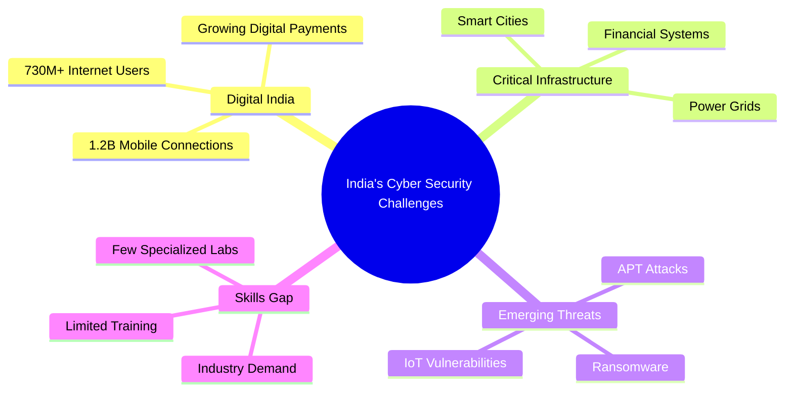

# 🌐 Introduction and Background

## 📖 Context and Rationale

### Global Cybersecurity Landscape

The digital transformation of industries, governments, and societies has created an unprecedented demand for robust cybersecurity infrastructure and skilled professionals. Current statistics paint a concerning picture:

#### 📊 Key Statistics

| **Metric** | **Value** | **Source** |
|:-----------|:----------|:-----------|
| Global Cybersecurity Market | $173.5 Billion (2022) | Gartner |
| Projected Market (2028) | $266.2 Billion | Markets & Markets |
| Unfilled Cybersecurity Jobs | 3.5 Million Globally | (ISC)² |
| India Cybersecurity Jobs Gap | 500,000+ Positions | NASSCOM |
| Average Cost of Data Breach | ₹17.9 Crores | IBM Security Report |
| Cyber Attacks Growth (YoY) | 38% Increase | Check Point Research |

### India's Cybersecurity Imperative



#### National Priority Areas

1. **🏛️ Government Initiatives**
   - National Cyber Security Policy 2023
   - Digital India Mission
   - Smart Cities Project
   - UPI & Financial Digitization

2. **🏭 Industry 4.0 Security**
   - Industrial IoT (IIoT) vulnerabilities
   - Smart Manufacturing security
   - Supply chain protection
   - OT/IT convergence challenges

3. **🔐 Critical Infrastructure Protection**
   - Power sector (smart grids)
   - Transportation systems
   - Healthcare digitization
   - Banking & Finance

4. **🎓 Education & Skills Development**
   - NEP 2020 skill development goals
   - Industry-academia gap
   - Practical hands-on training deficit
   - Research & innovation ecosystem

---

## 🎯 Need Analysis

### Current State of Cybersecurity Education in India

#### Challenges Identified

1. **Limited Practical Infrastructure**
   - Most institutions have only basic computer labs
   - Lack of specialized security equipment
   - No cyber-physical systems testbeds
   - Insufficient vulnerable systems for ethical hacking

2. **Theoretical Focus**
   - 80% theory vs 20% practical (industry needs reverse)
   - Limited exposure to real-world attack scenarios
   - Outdated curriculum not aligned with current threats
   - No hands-on experience with enterprise tools

3. **Resource Constraints**
   - High cost of commercial security tools
   - Lack of licensed software and platforms
   - Insufficient faculty training
   - No dedicated cybersecurity labs

4. **Industry Disconnect**
   - Graduates not job-ready
   - Lack of industry-standard certifications
   - No exposure to production environments
   - Limited internship opportunities

### Regional Gap Analysis

#### Mumbai Metropolitan Region

| **Institution** | **Dedicated Cyber Lab** | **Research Focus** | **Industry Tie-ups** | **Student Capacity** |
|:----------------|:-----------------------:|:------------------:|:--------------------:|:--------------------:|
| SPIT (Current) | ❌ | Limited | Moderate | ~100 |
| IIT Bombay | ✅ | Strong | Strong | ~200 |
| VJTI | Partial | Moderate | Limited | ~150 |
| Other Engineering Colleges | ❌ | Minimal | Minimal | ~50 |

**Gap**: Only 1-2 institutions in Mumbai have dedicated advanced cybersecurity labs. SPIT can fill this critical gap for Western suburbs.

---

## 🏛️ About SPIT

### Institutional Profile

**Bharatiya Vidya Bhavan's Sardar Patel Institute of Technology**

- **Established**: 1962
- **Type**: Autonomous Institute affiliated to University of Mumbai
- **Accreditation**: 
  - NBA Accredited Programs
  - NAAC 'A' Grade
  - Autonomous Status since 2020
- **Location**: Andheri (West), Mumbai - 400058

#### Key Achievements

- ✅ 60+ years of engineering education excellence
- ✅ 10,000+ successful alumni in industry
- ✅ Strong industry connections (TCS, Infosys, Accenture, Cisco, etc.)
- ✅ Active research culture with 200+ publications annually
- ✅ Modern infrastructure and facilities

### Department of Electronics & Telecommunication

#### Profile
- **Students**: 240 undergraduates (60 per year)
- **Faculty**: 25+ experienced professors
- **Research Areas**: VLSI, Embedded Systems, Signal Processing, IoT, Cybersecurity
- **Labs**: 12+ specialized laboratories
- **Industry Projects**: 50+ annually

#### Current Infrastructure
- 🖥️ 8 Computer Labs with 400+ workstations
- 🔬 Advanced DSP & Communication Labs
- 📡 IoT & Embedded Systems Lab
- 🤖 Robotics & Automation Lab

#### Limitations in Cybersecurity
- ❌ No dedicated cybersecurity lab
- ❌ Limited specialized equipment
- ❌ Basic security tools only
- ❌ No cyber-physical systems testbed
- ❌ Insufficient capacity for research

---

## 🎓 Vision for the Cyber Security Lab

### Transformative Objectives

#### 1. **Education Revolution**

```
Traditional Approach          →    Proposed Approach
─────────────────────────────────────────────────────
Theory-heavy lectures         →    Hands-on lab sessions
Simulated environments        →    Real vulnerable systems
Basic tools                   →    Enterprise-grade platforms
Limited exposure              →    Industry-aligned training
Generic training              →    Specialized certifications
```

#### 2. **Research Excellence**

**Focus Areas:**

| **Domain** | **Research Topics** | **Industry Relevance** |
|:-----------|:--------------------|:-----------------------|
| **AI/ML Security** | Adversarial ML, AI-based threat detection | High (Emerging) |
| **IoT Security** | Device firmware analysis, protocol vulnerabilities | Critical (Industry 4.0) |
| **Blockchain** | Smart contract security, cryptocurrency forensics | Growing (FinTech) |
| **CPS Security** | SCADA security, industrial control systems | Critical (Infrastructure) |
| **Cloud Security** | Container security, serverless vulnerabilities | High (Enterprise) |
| **5G/6G Security** | Network slicing, edge computing security | Emerging (Telecom) |

#### 3. **Industry Collaboration Hub**

**Proposed Partnerships:**

- 🤝 **Product Companies**: Cisco, Palo Alto Networks, Fortinet, Check Point
- 🤝 **Service Providers**: TCS, Wipro, Infosys, Accenture Cyber Services
- 🤝 **Government**: CERT-In, C-DAC, DRDO, Police Cyber Cells
- 🤝 **Startups**: Cybersecurity startups for innovation projects
- 🤝 **International**: Universities abroad for research collaborations

#### 4. **National Impact**

**Expected Contributions:**

1. **Skill Development**: Train 1,500+ cybersecurity professionals in 3 years
2. **Research Output**: 50+ publications, 3+ patents
3. **Industry Projects**: ₹2 Cr+ in external research funding
4. **Policy Contribution**: Inputs to national cybersecurity frameworks
5. **Tool Development**: Open-source security tools for community

---

## 🔬 Proposed Lab Capabilities

### Comprehensive Infrastructure

The proposed lab will be a **multi-domain cybersecurity research and training facility** covering:

#### 🛡️ Core Labs

1. **Network Security Lab**
   - Enterprise firewalls, IDS/IPS
   - Network traffic analysis
   - VPN and secure communications
   - SD-WAN security

2. **Penetration Testing Lab**
   - 15+ vulnerable physical machines
   - Realistic attack scenarios
   - Red team/Blue team exercises
   - Bug bounty training platform

3. **Cyber-Physical Systems Lab**
   - SCADA systems
   - PLCs and industrial controllers
   - Smart grid simulations
   - ICS/OT security

4. **Malware Analysis & Reverse Engineering**
   - Isolated analysis environments
   - Disassemblers and debuggers
   - Behavior analysis tools
   - Memory forensics

5. **Digital Forensics Lab**
   - Disk imaging and analysis
   - Mobile device forensics
   - Network forensics
   - Cloud forensics tools

6. **IoT Security Lab**
   - 100+ IoT devices
   - Firmware analysis platform
   - Wireless protocol testing
   - Hardware hacking tools

7. **AI/ML Security Lab**
   - GPU clusters for training
   - Adversarial ML platforms
   - AI-based threat detection
   - Automated security testing

8. **Blockchain Security Lab**
   - Private blockchain networks
   - Smart contract analysis
   - Cryptocurrency forensics
   - DeFi security testing

9. **Cloud Security Lab**
   - Multi-cloud environments (AWS, Azure, GCP)
   - Container security
   - Kubernetes security
   - Serverless security

10. **Security Operations Center (SOC) Training Lab**
    - SIEM platforms
    - Threat intelligence feeds
    - Incident response tools
    - 24x7 monitoring simulation

---

## 📈 Expected Outcomes

### Short-term (Year 1)
- ✅ Lab operational with 50+ workstations
- ✅ 10+ specialized courses launched
- ✅ 200+ students trained
- ✅ 3+ industry partnerships established
- ✅ 5+ research papers published

### Mid-term (Year 2)
- ✅ 500+ students trained
- ✅ 15+ research projects initiated
- ✅ ₹50 Lakhs external funding secured
- ✅ First batch of certified professionals
- ✅ 20+ publications

### Long-term (Year 3)
- ✅ 1,500+ students trained
- ✅ Recognized as Centre of Excellence
- ✅ ₹2 Cr+ external funding
- ✅ 50+ publications
- ✅ 3+ patents filed
- ✅ National/international recognition

---

## 🌟 Unique Value Propositions

### What Sets This Lab Apart

1. **🏆 Comprehensive Coverage**: All cybersecurity domains under one roof
2. **⚡ Real-world Focus**: Actual vulnerable systems, not just simulations
3. **🤖 Emerging Tech**: AI/ML, blockchain, 5G security
4. **🏭 Industry Alignment**: Enterprise-grade tools and certifications
5. **🔬 Research Oriented**: Focus on innovation and publications
6. **🌐 Collaborative**: Open for industry, government, and academic partnerships
7. **💡 Practical Training**: 70% hands-on, 30% theory
8. **📜 Certifications**: Industry-recognized credentials (CEH, OSCP, etc.)

---

## 🔗 Related Sections

- [[00 - Executive Summary|Executive Summary]]
- [[02 - Infrastructure Specifications|Infrastructure Details]]
- [[06 - Research Objectives|Research Objectives]]
- [[07 - Educational Framework|Educational Programs]]

---

*This foundation establishes the critical need for a world-class cybersecurity lab at SPIT, positioning it as a strategic investment in India's digital security infrastructure.*
