# 🖥️ Infrastructure and Hardware Specifications

## 📐 Lab Layout and Design

### Physical Space Requirements

**Total Area Required**: 3,500 sq. ft. (325 sq. meters)

```
┌─────────────────────────────────────────────────────────────────┐
│                    CYBER SECURITY LAB LAYOUT                    │
│                         (3,500 sq. ft.)                         │
├─────────────────────────────────────────────────────────────────┤
│                                                                 │
│  ┌──────────────┐  ┌──────────────┐  ┌──────────────┐         │
│  │   Network    │  │  Penetration │  │   Digital    │         │
│  │   Security   │  │   Testing    │  │  Forensics   │         │
│  │     Lab      │  │     Lab      │  │     Lab      │         │
│  │  (500 sq.ft) │  │  (500 sq.ft) │  │  (400 sq.ft) │         │
│  └──────────────┘  └──────────────┘  └──────────────┘         │
│                                                                 │
│  ┌──────────────┐  ┌──────────────┐  ┌──────────────┐         │
│  │   AI/ML      │  │     IoT      │  │    CPS/ICS   │         │
│  │   Security   │  │   Security   │  │   Security   │         │
│  │     Lab      │  │     Lab      │  │   Testbed    │         │
│  │  (400 sq.ft) │  │  (350 sq.ft) │  │  (450 sq.ft) │         │
│  └──────────────┘  └──────────────┘  └──────────────┘         │
│                                                                 │
│  ┌──────────────────────────────┐  ┌──────────────┐           │
│  │      Server Room & SOC       │  │   Malware    │           │
│  │       Training Center        │  │   Analysis   │           │
│  │        (600 sq. ft.)         │  │  (300 sq.ft) │           │
│  └──────────────────────────────┘  └──────────────┘           │
│                                                                 │
│  ┌─────────────┐  ┌────────────┐  ┌────────────┐             │
│  │  Conference │  │   Office   │  │  Storage & │             │
│  │    Room     │  │   Space    │  │   Utility  │             │
│  │ (250 sq.ft) │  │(200 sq.ft) │  │(150 sq.ft) │             │
│  └─────────────┘  └────────────┘  └────────────┘             │
│                                                                 │
└─────────────────────────────────────────────────────────────────┘
```

### Lab-wise Distribution

| **Lab Name** | **Area (sq.ft)** | **Capacity** | **Primary Focus** |
|:-------------|:----------------:|:------------:|:------------------|
| Network Security Lab | 500 | 20 students | Firewall, IDS/IPS, Network Analysis |
| Penetration Testing Lab | 500 | 15 students | Ethical Hacking, Vulnerability Assessment |
| Digital Forensics Lab | 400 | 12 students | Incident Response, Evidence Analysis |
| AI/ML Security Lab | 400 | 15 students | Threat Detection, Adversarial ML |
| IoT Security Lab | 350 | 12 students | Device Security, Firmware Analysis |
| CPS/ICS Security Lab | 450 | 10 students | SCADA, Industrial Systems |
| Server Room & SOC | 600 | 8 analysts | Infrastructure, Monitoring |
| Malware Analysis Lab | 300 | 8 students | Reverse Engineering, Sandboxing |
| Conference Room | 250 | 30 people | Meetings, Presentations |
| Office Space | 200 | 6 staff | Administrative, Faculty |
| Storage & Utility | 150 | - | Equipment, Maintenance |

---

## 💻 Workstation Specifications

### Category A: High-Performance Security Workstations (30 Units)

**Purpose**: Malware analysis, reverse engineering, AI/ML training, penetration testing

| **Component** | **Specification** | **Unit Cost (₹)** |
|:--------------|:------------------|------------------:|
| **Processor** | Intel Core i9-13900K (24-core) / AMD Ryzen 9 7950X | 45,000 |
| **RAM** | 64GB DDR5-5600MHz (Upgradable to 128GB) | 28,000 |
| **GPU** | NVIDIA RTX 4070 Ti 12GB (for AI/ML workloads) | 75,000 |
| **Storage (Primary)** | 2TB NVMe Gen4 SSD | 18,000 |
| **Storage (Secondary)** | 4TB SATA SSD | 22,000 |
| **Motherboard** | High-end ATX with multiple PCIe slots | 22,000 |
| **PSU** | 850W 80+ Platinum Modular | 12,000 |
| **Case** | Full Tower with good airflow | 8,000 |
| **Cooling** | AIO Liquid Cooler 360mm | 15,000 |
| **Network** | 10GbE Network Card | 12,000 |
| **Monitor (Primary)** | 32" 4K IPS (Dell UltraSharp / LG) | 45,000 |
| **Monitor (Secondary)** | 27" QHD IPS | 25,000 |
| **Peripherals** | Mechanical Keyboard + Gaming Mouse | 8,000 |
| **OS** | Windows 11 Pro + Ubuntu Linux (Dual Boot) | 18,000 |
| **UPS** | 2KVA Line Interactive UPS | 15,000 |
| **Assembly & Testing** | - | 5,000 |
| **TOTAL PER UNIT** | | **₹3,73,000** |
| **Total for 30 Units** | | **₹1,11,90,000** |

### Category B: Standard Security Workstations (25 Units)

**Purpose**: General security analysis, network monitoring, forensics

| **Component** | **Specification** | **Unit Cost (₹)** |
|:--------------|:------------------|------------------:|
| **Processor** | Intel Core i7-13700 / AMD Ryzen 7 7700X | 32,000 |
| **RAM** | 32GB DDR5-5200MHz | 15,000 |
| **GPU** | NVIDIA RTX 4060 8GB | 35,000 |
| **Storage (Primary)** | 1TB NVMe Gen4 SSD | 10,000 |
| **Storage (Secondary)** | 2TB SATA SSD | 12,000 |
| **Motherboard** | Mid-range ATX | 15,000 |
| **PSU** | 650W 80+ Gold | 8,000 |
| **Case** | Mid Tower | 5,000 |
| **Cooling** | Tower Air Cooler | 5,000 |
| **Network** | 2.5GbE Onboard | - |
| **Monitor** | 27" QHD IPS | 25,000 |
| **Peripherals** | Keyboard + Mouse Combo | 4,000 |
| **OS** | Windows 11 Pro | 18,000 |
| **UPS** | 1KVA UPS | 8,000 |
| **Assembly & Testing** | - | 3,000 |
| **TOTAL PER UNIT** | | **₹1,95,000** |
| **Total for 25 Units** | | **₹48,75,000** |

---

## 🔬 Specialized Hardware

### 1. GPU Cluster for AI/ML Security Research

| **Item** | **Specification** | **Qty** | **Unit Cost (₹)** | **Total (₹)** |
|:---------|:------------------|:-------:|------------------:|--------------:|
| GPU Server Nodes | Dual NVIDIA A100 40GB / H100 80GB | 2 | 25,00,000 | 50,00,000 |
| Training Workstations | 4x RTX 4090 24GB Multi-GPU Setup | 2 | 8,00,000 | 16,00,000 |
| High-Speed Interconnect | InfiniBand HDR 200Gb/s Switches | 1 | 5,00,000 | 5,00,000 |
| Shared Storage | 100TB NVMe Storage Array | 1 | 12,00,000 | 12,00,000 |
| **Subtotal** | | | | **₹83,00,000** |

### 2. Vulnerable Physical Machines (Penetration Testing Lab)

| **Category** | **Description** | **Qty** | **Unit Cost (₹)** | **Total (₹)** |
|:-------------|:----------------|:-------:|------------------:|--------------:|
| Retired Enterprise Servers | Dell/HP Gen8-Gen10 Servers | 5 | 25,000 | 1,25,000 |
| Legacy Windows Systems | Windows 7/8/10 Systems (unpatched) | 8 | 15,000 | 1,20,000 |
| Legacy Linux Systems | Ubuntu/CentOS (various versions) | 5 | 18,000 | 90,000 |
| Vulnerable IoT Devices | Smart home devices, IP cameras, routers | 20 | 5,000 | 1,00,000 |
| Vulnerable Web Servers | DVWA, WebGoat physical setups | 3 | 35,000 | 1,05,000 |
| Android Devices | Old Android phones for mobile pentesting | 10 | 8,000 | 80,000 |
| Industrial Controllers | Refurbished PLCs, RTUs | 4 | 45,000 | 1,80,000 |
| **Subtotal** | | | | **₹8,00,000** |

### 3. Network Security Infrastructure

| **Item** | **Specification** | **Qty** | **Unit Cost (₹)** | **Total (₹)** |
|:---------|:------------------|:-------:|------------------:|--------------:|
| Enterprise Firewall | Palo Alto PA-850 / Fortinet FortiGate 200F | 2 | 6,50,000 | 13,00,000 |
| IDS/IPS System | Cisco Firepower 2130 / Suricata on Hardware | 2 | 5,00,000 | 10,00,000 |
| Core Switches | Cisco Catalyst 9300 48-port (10G uplinks) | 3 | 3,50,000 | 10,50,000 |
| Access Switches | Cisco SG350-52 Managed Gigabit | 6 | 65,000 | 3,90,000 |
| Wireless Controllers | Cisco Wireless Controller 9800 | 1 | 4,50,000 | 4,50,000 |
| Access Points | Cisco Catalyst 9130AXI (WiFi 6E) | 8 | 85,000 | 6,80,000 |
| Network Tap Devices | Gigamon GigaVUE-TA25 | 3 | 2,50,000 | 7,50,000 |
| Packet Brokers | IXIA Vision ONE | 1 | 8,00,000 | 8,00,000 |
| Load Balancer | F5 BIG-IP i2600 | 1 | 7,00,000 | 7,00,000 |
| VPN Concentrators | Cisco ASA 5516-X | 2 | 2,50,000 | 5,00,000 |
| **Subtotal** | | | | **₹76,20,000** |

### 4. Server Infrastructure

| **Item** | **Specification** | **Qty** | **Unit Cost (₹)** | **Total (₹)** |
|:---------|:------------------|:-------:|------------------:|--------------:|
| Hypervisor Servers | Dell PowerEdge R750 (2x Xeon Gold, 512GB RAM) | 4 | 8,50,000 | 34,00,000 |
| Storage Servers | Dell PowerEdge R740xd (24x 4TB drives, RAID) | 2 | 9,00,000 | 18,00,000 |
| Database Server | HP ProLiant DL380 Gen10 (high memory) | 1 | 7,50,000 | 7,50,000 |
| SIEM Server | Dell R650 (optimized for log management) | 2 | 6,50,000 | 13,00,000 |
| Backup Server | Synology RackStation RS4021xs+ (96TB usable) | 1 | 5,00,000 | 5,00,000 |
| 42U Server Rack | APC NetShelter SX with cable management | 3 | 1,50,000 | 4,50,000 |
| KVM Switch | 16-port IP KVM | 2 | 75,000 | 1,50,000 |
| **Subtotal** | | | | **₹83,50,000** |

### 5. Cyber-Physical Systems (CPS) Lab Equipment

| **Item** | **Specification** | **Qty** | **Unit Cost (₹)** | **Total (₹)** |
|:---------|:------------------|:-------:|------------------:|--------------:|
| SCADA System | Wonderware System Platform | 1 | 12,00,000 | 12,00,000 |
| PLC Systems | Siemens S7-1500 Series | 5 | 1,20,000 | 6,00,000 |
| HMI Panels | Industrial Touch Panels (10-15") | 5 | 85,000 | 4,25,000 |
| RTU Devices | Remote Terminal Units | 4 | 95,000 | 3,80,000 |
| Industrial Switches | Ruggedized Ethernet Switches | 4 | 65,000 | 2,60,000 |
| Smart Grid Simulator | OPAL-RT ePHASORsim | 1 | 18,00,000 | 18,00,000 |
| Modbus Devices | Various Modbus TCP/RTU devices | 10 | 25,000 | 2,50,000 |
| Industrial Protocols | DNP3, IEC 61850 test equipment | 1 set | 5,00,000 | 5,00,000 |
| **Subtotal** | | | | **₹54,15,000** |

### 6. IoT Security Lab Equipment

| **Item** | **Specification** | **Qty** | **Unit Cost (₹)** | **Total (₹)** |
|:---------|:------------------|:-------:|------------------:|--------------:|
| IoT Development Boards | Raspberry Pi, Arduino, ESP32 (variety) | 50 | 3,500 | 1,75,000 |
| Smart Home Devices | Cameras, locks, sensors, hubs | 30 | 8,000 | 2,40,000 |
| Wireless Protocol Analyzers | HackRF One, YARD Stick One | 8 | 35,000 | 2,80,000 |
| Logic Analyzers | Saleae Logic Pro 16 | 4 | 65,000 | 2,60,000 |
| Oscilloscopes | Rigol DS1054Z Digital Oscilloscope | 4 | 45,000 | 1,80,000 |
| JTAG/SWD Debuggers | Segger J-Link Plus | 6 | 35,000 | 2,10,000 |
| Chip-off Tools | IR Rework Station, BGA Equipment | 2 | 1,50,000 | 3,00,000 |
| Firmware Extraction Tools | FlashCat USB Programmer | 4 | 25,000 | 1,00,000 |
| **Subtotal** | | | | **₹17,45,000** |

### 7. Digital Forensics Lab Equipment

| **Item** | **Specification** | **Qty** | **Unit Cost (₹)** | **Total (₹)** |
|:---------|:------------------|:-------:|------------------:|--------------:|
| Forensic Workstations | High-end with write blockers | 4 | 3,50,000 | 14,00,000 |
| Write Blockers | Tableau TX1, UltraBlock USB | 6 | 45,000 | 2,70,000 |
| Disk Duplicators | Intelligent disk cloning systems | 3 | 1,20,000 | 3,60,000 |
| Mobile Forensics Kit | Cellebrite UFED Premium | 2 | 10,00,000 | 20,00,000 |
| Faraday Bags/Boxes | Signal blocking evidence bags | 20 | 5,000 | 1,00,000 |
| SIM Card Readers | Multi-SIM readers | 6 | 15,000 | 90,000 |
| Memory Card Readers | Professional CF/SD readers | 8 | 8,000 | 64,000 |
| Evidence Storage | Secure lockers and cabinets | 4 | 35,000 | 1,40,000 |
| **Subtotal** | | | | **₹44,24,000** |

### 8. Monitors and Display Systems

| **Item** | **Specification** | **Qty** | **Unit Cost (₹)** | **Total (₹)** |
|:---------|:------------------|:-------:|------------------:|--------------:|
| Video Wall (SOC) | 3x3 55" LCD Video Wall (LG/Samsung) | 9 | 85,000 | 7,65,000 |
| Video Wall Controller | Datapath VSN1172 | 1 | 2,50,000 | 2,50,000 |
| Large Displays | 75" 4K Interactive Display | 3 | 1,25,000 | 3,75,000 |
| Projector System | 4K Short-throw Projector + Screen | 1 | 2,00,000 | 2,00,000 |
| Monitor Arms | Ergonomic dual monitor arms | 30 | 8,000 | 2,40,000 |
| **Subtotal** | | | | **₹18,30,000** |

---

## 🏢 Office and Facilities Infrastructure

| **Category** | **Item** | **Qty** | **Unit Cost (₹)** | **Total (₹)** |
|:-------------|:---------|:-------:|------------------:|--------------:|
| **Furniture** | Ergonomic chairs | 60 | 15,000 | 9,00,000 |
| | Workstation desks | 55 | 12,000 | 6,60,000 |
| | Server racks with accessories | 3 | 1,50,000 | 4,50,000 |
| | Conference table (20-seater) | 1 | 1,20,000 | 1,20,000 |
| | Office desks and cabinets | 10 | 25,000 | 2,50,000 |
| **HVAC** | Precision AC for server room (5 ton) | 2 | 2,50,000 | 5,00,000 |
| | Split ACs for lab spaces (2 ton) | 8 | 75,000 | 6,00,000 |
| **Power** | 150 KVA Diesel Generator | 1 | 12,00,000 | 12,00,000 |
| | UPS Systems (20 KVA) | 3 | 4,50,000 | 13,50,000 |
| | PDUs and Power Distribution | 15 | 25,000 | 3,75,000 |
| **Electrical** | Complete electrical installation | 1 | 8,00,000 | 8,00,000 |
| **Fire Safety** | FM-200 fire suppression system | 1 | 5,00,000 | 5,00,000 |
| | Fire extinguishers and alarms | 1 set | 1,50,000 | 1,50,000 |
| **Access Control** | Biometric access control system | 1 | 3,00,000 | 3,00,000 |
| | CCTV surveillance (20 cameras) | 1 set | 4,00,000 | 4,00,000 |
| **Flooring** | Raised flooring for server room | 600 sq ft | 1,500/sq ft | 9,00,000 |
| **Interior** | False ceiling, lighting, painting | 3500 sq ft | 800/sq ft | 28,00,000 |
| **Signage** | Lab signage and wayfinding | 1 set | 1,50,000 | 1,50,000 |
| **TOTAL** | | | | **₹1,25,05,000** |

---

## 📊 Hardware Budget Summary

```mermaid
pie title Hardware Budget Distribution (₹5,00,54,000)
    "Workstations (Cat A+B)" : 16065
    "GPU Cluster" : 8300
    "Network Infrastructure" : 7620
    "Server Infrastructure" : 8350
    "CPS Lab Equipment" : 5415
    "Digital Forensics" : 4424
    "IoT Lab Equipment" : 1745
    "Vulnerable Machines" : 800
    "Monitors & Displays" : 1830
    "Office & Facilities" : 12505
```



| **Category** | **Amount (₹)** | **Percentage** |
|:-------------|---------------:|---------------:|
| Workstations (Category A+B) | 1,60,65,000 | 32.1% |
| GPU Cluster for AI/ML | 83,00,000 | 16.6% |
| Network Infrastructure | 76,20,000 | 15.2% |
| Server Infrastructure | 83,50,000 | 16.7% |
| CPS Lab Equipment | 54,15,000 | 10.8% |
| Digital Forensics Equipment | 44,24,000 | 8.8% |
| IoT Lab Equipment | 17,45,000 | 3.5% |
| Vulnerable Physical Machines | 8,00,000 | 1.6% |
| Monitors & Display Systems | 18,30,000 | 3.7% |
| Office & Facilities | 1,25,05,000 | 25.0% |
| **Subtotal (Before Software)** | **5,70,54,000** | |
| **Buffer for price fluctuations (5%)** | **28,52,700** | |
| **TOTAL HARDWARE BUDGET** | **5,99,06,700** | |

> **Note**: This exceeds the ₹1,85,00,000 allocation. We'll optimize in the comprehensive budget section.

---

## 🔗 Related Documents

- [[00 - Executive Summary|Executive Summary]]
- [[03 - Budget Breakdown|Budget Breakdown & Cost Optimization]]
- [[05 - Implementation Timeline|Implementation Timeline]]

---

*Detailed technical specifications and vendor quotes available in [[10 - Appendices|Appendices]]*
