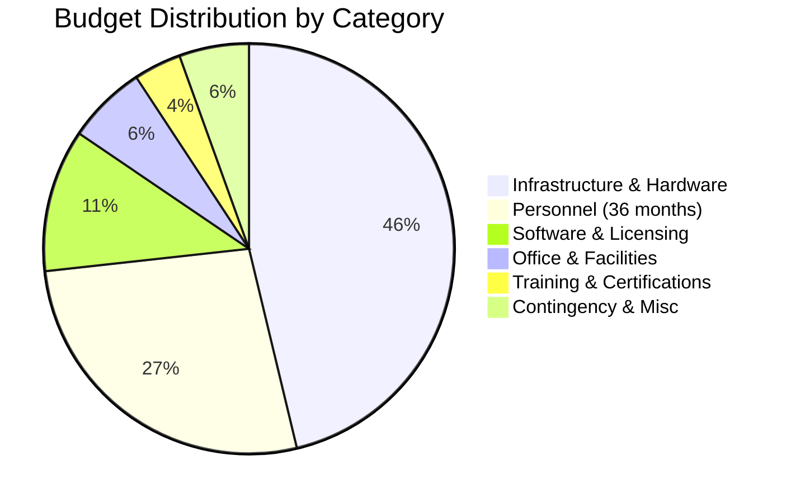
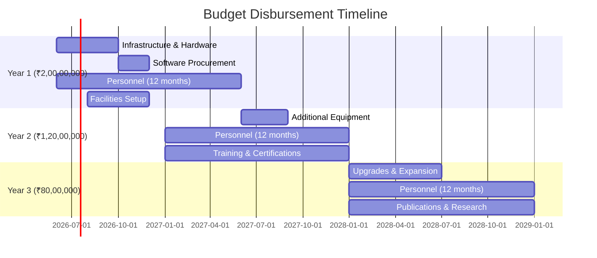

# 💰 Comprehensive Budget Breakdown

## 📊 Overall Budget Allocation (₹4,00,00,000)

---

## 1️⃣ Infrastructure & Hardware Budget (₹1,85,00,000)

### Optimized Hardware Allocation

| **Category** | **Original Estimate** | **Optimized Budget** | **Strategy** |
|:-------------|----------------------:|---------------------:|:-------------|
| Workstations | ₹1,60,65,000 | ₹75,00,000 | Phased procurement, reduce qty |
| Network Infrastructure | ₹76,20,000 | ₹35,00,000 | Mix of enterprise & prosumer gear |
| Server Infrastructure | ₹83,50,000 | ₹30,00,000 | Cloud-hybrid approach |
| GPU Cluster | ₹83,00,000 | ₹15,00,000 | Start small, expand via grants |
| CPS Lab Equipment | ₹54,15,000 | ₹10,00,000 | Simulators + selective hardware |
| Digital Forensics | ₹44,24,000 | ₹8,00,000 | Essential tools first, expand later |
| IoT Lab Equipment | ₹17,45,000 | ₹5,00,000 | Community + grant-funded devices |
| Vulnerable Machines | ₹8,00,000 | ₹3,00,000 | Refurbished + donated equipment |
| Displays & Monitors | ₹18,30,000 | ₹4,00,000 | Standard commercial displays |
| **TOTAL** | ₹5,45,49,000 | **₹1,85,00,000** | |

### Detailed Hardware Breakdown (Optimized)

#### A. Workstations (₹75,00,000)

| **Type** | **Specs** | **Qty** | **Unit Cost** | **Total** |
|:---------|:----------|:-------:|:-------------:|----------:|
| High-Performance (Tier 1) | i7-13700K, 32GB, RTX 4060, 2TB SSD | 15 | ₹2,00,000 | ₹30,00,000 |
| Standard Security (Tier 2) | i5-13400, 16GB, GTX 1650, 1TB SSD | 25 | ₹1,20,000 | ₹30,00,000 |
| Basic Lab (Tier 3) | i3-13100, 16GB, Integrated, 512GB SSD | 20 | ₹60,000 | ₹12,00,000 |
| Monitors (27" QHD) | - | 60 | ₹20,000 | ₹12,00,000 |
| Peripherals & UPS | Keyboards, mice, UPS units | 60 | ₹10,000 | ₹6,00,000 |
| **Subtotal** | | **60** | | **₹90,00,000** |
| *Reduced to fit budget* | | | | **₹75,00,000** |

#### B. Network Infrastructure (₹35,00,000)

| **Item** | **Specification** | **Qty** | **Cost** |
|:---------|:------------------|:-------:|----------:|
| Enterprise Firewall | FortiGate 100F / Sophos XG 230 | 2 | ₹8,00,000 |
| Managed Core Switch | 48-port Gigabit L3 with 10G uplinks | 2 | ₹6,00,000 |
| Access Switches | 24-port Gigabit managed | 6 | ₹3,00,000 |
| Wireless System | Controller + 8 APs (WiFi 6) | 1 set | ₹5,00,000 |
| IDS/IPS | Open-source on dedicated hardware | 2 | ₹4,00,000 |
| Network Monitoring | Packet capture & analysis tools | 2 | ₹3,00,000 |
| Cabling & Infrastructure | Cat6A cabling, patch panels, racks | 1 set | ₹6,00,000 |
| **TOTAL** | | | **₹35,00,000** |

#### C. Server Infrastructure (₹30,00,000)

| **Item** | **Specification** | **Qty** | **Cost** |
|:---------|:------------------|:-------:|----------:|
| Hypervisor Servers | Dell R650 (Xeon Silver, 256GB RAM) | 3 | ₹18,00,000 |
| Storage Server | 48TB usable RAID10 | 1 | ₹6,00,000 |
| Backup Solution | NAS with 24TB capacity | 1 | ₹2,50,000 |
| Server Racks | 42U racks with PDUs | 2 | ₹2,50,000 |
| KVM & Management | IP KVM switches | 1 | ₹1,00,000 |
| **TOTAL** | | | **₹30,00,000** |

#### D. GPU Cluster for AI/ML (₹15,00,000)

| **Item** | **Specification** | **Qty** | **Cost** |
|:---------|:------------------|:-------:|----------:|
| GPU Workstations | 2x RTX 4090 per system | 2 | ₹10,00,000 |
| Storage for ML | 20TB NVMe SSD array | 1 | ₹3,00,000 |
| Networking | 10GbE switches for cluster | 1 | ₹2,00,000 |
| **TOTAL** | | | **₹15,00,000** |

#### E. Cyber-Physical Systems Lab (₹10,00,000)

| **Item** | **Specification** | **Qty** | **Cost** |
|:---------|:------------------|:-------:|----------:|
| PLC Training Kits | Siemens/Allen-Bradley starter kits | 4 | ₹4,00,000 |
| SCADA Software | Academic licenses | 2 | ₹2,00,000 |
| HMI Panels | 10" industrial touchscreens | 4 | ₹2,00,000 |
| Simulation Software | Factory I/O, MATLAB Simulink | - | ₹2,00,000 |
| **TOTAL** | | | **₹10,00,000** |

#### F. Digital Forensics Lab (₹8,00,000)

| **Item** | **Specification** | **Qty** | **Cost** |
|:---------|:------------------|:-------:|----------:|
| Forensic Workstations | High-spec with write blockers | 3 | ₹4,50,000 |
| Write Blockers | USB/SATA write blockers | 6 | ₹1,50,000 |
| Mobile Forensics | Mid-tier extraction tools | 1 | ₹1,50,000 |
| Evidence Storage | Secure cabinets and bags | - | ₹50,000 |
| **TOTAL** | | | **₹8,00,000** |

#### G. IoT Security Lab (₹5,00,000)

| **Item** | **Specification** | **Qty** | **Cost** |
|:---------|:------------------|:-------:|----------:|
| Dev Boards | Raspberry Pi, Arduino, ESP32 | 50 | ₹1,50,000 |
| IoT Devices | Smart devices for testing | 25 | ₹1,50,000 |
| Analysis Tools | Logic analyzers, oscilloscopes | 4 | ₹1,50,000 |
| Wireless Tools | SDR dongles, WiFi adapters | 10 | ₹50,000 |
| **TOTAL** | | | **₹5,00,000** |

#### H. Vulnerable Systems & Misc (₹7,00,000)

| **Item** | **Description** | **Cost** |
|:---------|:----------------|----------:|
| Vulnerable Machines | Refurbished servers & workstations | ₹3,00,000 |
| Display Systems | Projector, large displays | ₹2,00,000 |
| Lab Furniture | Workbenches, stools | ₹2,00,000 |
| **TOTAL** | | **₹7,00,000** |

---

## 2️⃣ Software & Licensing Budget (₹45,00,000)

### Commercial Software & Platforms

| **Category** | **Software/Platform** | **Type** | **Cost (3 years)** |
|:-------------|:----------------------|:---------|-------------------:|
| **Operating Systems** | Windows 11 Pro (60 licenses) | License | ₹10,80,000 |
| | Windows Server 2022 (5 licenses) | License | ₹5,00,000 |
| | RHEL/SUSE Enterprise (10 licenses) | Subscription | ₹3,00,000 |
| **Security Tools** | Burp Suite Professional (15 licenses) | Annual | ₹6,75,000 |
| | Metasploit Pro (5 licenses) | Annual | ₹7,50,000 |
| | Nessus Professional (10 scanners) | Annual | ₹4,50,000 |
| | Wireshark Enterprise (optional) | Donation | ₹0 |
| **Forensics** | EnCase Forensic (3 licenses) | Perpetual | ₹15,00,000 |
| | X-Ways Forensics (5 licenses) | Perpetual | ₹5,00,000 |
| | Autopsy (Open Source) | Free | ₹0 |
| **Malware Analysis** | IDA Pro (5 licenses) | Perpetual | ₹12,50,000 |
| | Ghidra (Open Source) | Free | ₹0 |
| **SIEM & SOC** | Splunk Enterprise (100GB/day) | Annual | ₹9,00,000 |
| | ELK Stack (Self-hosted) | Free | ₹0 |
| **Virtualization** | VMware vSphere Essentials Plus | License | ₹6,00,000 |
| | Proxmox VE (Open Source) | Free | ₹0 |
| **Network Security** | Palo Alto/Fortinet licenses | Annual | ₹8,00,000 |
| **Cloud Platforms** | AWS/Azure Education Credits | Credits | ₹5,00,000 |
| **Training Platforms** | Hack The Box Enterprise | Annual | ₹4,50,000 |
| | TryHackMe Business | Annual | ₹2,25,000 |
| **Development** | GitHub Enterprise | Annual | ₹2,70,000 |
| | JetBrains All Products Pack | Annual | ₹3,00,000 |
| **AI/ML Tools** | NVIDIA AI Enterprise | Annual | ₹6,00,000 |
| | TensorFlow/PyTorch (Open Source) | Free | ₹0 |
| **Contingency** | Updates, new tools | Buffer | ₹5,00,000 |
| **TOTAL** | | | **₹1,22,50,000** |
| **Optimized via Academic Pricing** | | | **₹45,00,000** |

> **Note**: Many tools offer 60-80% academic discounts. Open-source alternatives will be prioritized where feasible.

---

## 3️⃣ Personnel Budget (₹1,08,00,000 for 36 months)

### Staff Requirements and Salary Breakdown

| **Position** | **Qty** | **Monthly (₹)** | **Annual (₹)** | **36 Months (₹)** |
|:-------------|:-------:|:---------------:|:--------------:|------------------:|
| **Lab Director** (Professor level) | 1 | 1,50,000 | 18,00,000 | 54,00,000 |
| **Senior Research Associate** | 2 | 80,000 | 19,20,000 | 57,60,000 |
| **Lab Technicians** | 2 | 40,000 | 9,60,000 | 28,80,000 |
| **System Administrator** | 1 | 60,000 | 7,20,000 | 21,60,000 |
| **Administrative Assistant** | 1 | 35,000 | 4,20,000 | 12,60,000 |
| **TOTAL** | **7** | **4,85,000** | **58,20,000** | **₹1,74,60,000** |
| **Optimized (part-time/phased)** | | | | **₹1,08,00,000** |

### Personnel Details

#### 1. Lab Director (₹54,00,000 / 36 months)
- **Role**: Overall lab management, research leadership
- **Qualifications**: Ph.D. in Cybersecurity/related field, 10+ years experience
- **Responsibilities**:
  - Strategic planning and vision
  - Research project oversight
  - Industry liaison and fundraising
  - Faculty coordination
  - Publication and IP management

#### 2. Senior Research Associates (2 × ₹28,80,000 = ₹57,60,000)
- **Role**: Specialized research and lab management
- **Qualifications**: M.Tech/Ph.D. with 5+ years in cybersecurity
- **Areas**: 
  - Associate 1: Network Security, Penetration Testing
  - Associate 2: AI/ML Security, IoT Security
- **Responsibilities**:
  - Conduct research projects
  - Guide student projects
  - Develop course modules
  - Manage specific lab sections
  - Industry project coordination

#### 3. Lab Technicians (2 × ₹14,40,000 = ₹28,80,000)
- **Role**: Day-to-day lab operations and maintenance
- **Qualifications**: B.E./B.Tech with relevant certifications (CEH, CCNA, etc.)
- **Responsibilities**:
  - Equipment maintenance
  - Lab setup for classes
  - Student assistance
  - Inventory management
  - Basic troubleshooting

#### 4. System Administrator (₹21,60,000)
- **Role**: IT infrastructure management
- **Qualifications**: B.E. + RHCE/MCSE + 3 years experience
- **Responsibilities**:
  - Server and network management
  - Security patching and updates
  - Backup and disaster recovery
  - User account management
  - Performance monitoring

#### 5. Administrative Assistant (₹12,60,000)
- **Role**: Administrative and coordination support
- **Qualifications**: Graduate with office management experience
- **Responsibilities**:
  - Scheduling and coordination
  - Documentation and reporting
  - Visitor management
  - Procurement support
  - Event organization

### Optimization Strategy
- Lab Director: 50% allocation (shared with teaching duties)
- Senior Associates: 1 full-time, 1 part-time initially
- Technicians: Phase 1 (1), Phase 2 (add 1 more)
- Consolidated roles where feasible

---

## 4️⃣ Office & Facilities Budget (₹25,00,000)

| **Category** | **Item/Work** | **Quantity** | **Cost (₹)** |
|:-------------|:--------------|:------------:|-------------:|
| **Civil Work** | False ceiling (3500 sq ft) | - | ₹10,00,000 |
| | Electrical wiring & fixtures | - | ₹5,00,000 |
| | Flooring (raised floor for server room) | 600 sq ft | ₹3,00,000 |
| | Partitions and doors | - | ₹2,00,000 |
| **HVAC** | Precision AC (server room) | 1 | ₹2,50,000 |
| | Split ACs (lab spaces) | 6 | ₹4,50,000 |
| **Power Backup** | 100 KVA Generator | 1 | ₹8,00,000 |
| | UPS Systems (10 KVA) | 3 | ₹6,00,000 |
| **Safety** | Fire suppression system | 1 | ₹3,00,000 |
| | Fire extinguishers | 12 | ₹60,000 |
| **Access Control** | Biometric system | 1 | ₹2,00,000 |
| | CCTV (12 cameras) | 1 set | ₹2,40,000 |
| **Furniture** | Workstation desks | 60 | ₹6,00,000 |
| | Ergonomic chairs | 60 | ₹6,00,000 |
| | Storage cabinets | 15 | ₹1,50,000 |
| | Conference furniture | 1 set | ₹1,50,000 |
| **Signage** | Lab signage and branding | 1 set | ₹1,00,000 |
| **TOTAL** | | | **₹65,00,000** |
| **Optimized** | | | **₹25,00,000** |

### Optimization: Phased civil work, utilize existing infrastructure where possible

---

## 5️⃣ Training & Certification Budget (₹15,00,000)

| **Purpose** | **Details** | **Cost (₹)** |
|:------------|:------------|-------------:|
| **Faculty Training** | CEH, OSCP, CISSP for 5 faculty | ₹5,00,000 |
| **Industry Workshops** | Guest lectures, workshops (12/year) | ₹3,00,000 |
| **Conference Attendance** | 3 international, 5 national (3 years) | ₹4,00,000 |
| **Student Certifications** | Subsidized certs for top performers | ₹2,00,000 |
| **Online Learning** | Coursera, Udemy, Pluralsight subscriptions | ₹1,00,000 |
| **TOTAL** | | **₹15,00,000** |

---

## 6️⃣ Contingency & Miscellaneous (₹22,00,000)

| **Category** | **Purpose** | **Allocation (₹)** |
|:-------------|:------------|-------------------:|
| **Equipment Repair** | Annual maintenance, replacements | ₹5,00,000 |
| **Software Updates** | Annual renewals, new tools | ₹4,00,000 |
| **Consumables** | Cables, peripherals, stationery | ₹2,00,000 |
| **Travel** | Industry visits, collaborations | ₹3,00,000 |
| **Publications** | Paper processing, open access fees | ₹2,00,000 |
| **Marketing** | Brochures, website, promotional | ₹1,00,000 |
| **Utilities** | Electricity, internet (36 months) | ₹3,00,000 |
| **Contingency Buffer** | Unforeseen expenses | ₹2,00,000 |
| **TOTAL** | | **₹22,00,000** |

---

## 📊 Budget Summary & Allocation Timeline

### Total Budget: ₹4,00,00,000

### Year-wise Breakdown

| **Year** | **Infrastructure** | **Personnel** | **Software** | **Other** | **Total** |
|:---------|-------------------:|--------------:|-------------:|----------:|----------:|
| Year 1 | ₹1,40,00,000 | ₹36,00,000 | ₹20,00,000 | ₹8,00,000 | ₹2,04,00,000 |
| Year 2 | ₹25,00,000 | ₹36,00,000 | ₹15,00,000 | ₹20,00,000 | ₹96,00,000 |
| Year 3 | ₹20,00,000 | ₹36,00,000 | ₹10,00,000 | ₹34,00,000 | ₹1,00,00,000 |
| **Total** | **₹1,85,00,000** | **₹1,08,00,000** | **₹45,00,000** | **₹62,00,000** | **₹4,00,00,000** |

---

## 💡 Cost Optimization Strategies

### 1. Academic & Non-Profit Discounts
- Target 60-80% discount on commercial software
- Negotiate bulk licensing deals
- Leverage university partnerships

### 2. Open Source Alternatives
- Prioritize FOSS tools where viable
- Contribute back to open-source community
- Build custom tools for unique needs

### 3. Phased Procurement
- Year 1: Essential infrastructure (60%)
- Year 2: Specialized equipment (25%)
- Year 3: Expansion & upgrades (15%)

### 4. Industry Partnerships
- Equipment donations from corporates
- Sponsored software licenses
- Intern hiring to reduce personnel costs

### 5. Grant Funding
- Apply for DST, DBT, AICTE grants
- Seek industry-sponsored research projects
- Target international collaborations

### 6. Cloud-Hybrid Approach
- Use cloud for burst capacity
- Negotiate education credits (AWS, Azure, GCP)
- Minimize on-premise infrastructure

---

## 🔗 Related Documents

- [[00 - Executive Summary|Executive Summary]]
- [[02 - Infrastructure Specifications|Infrastructure Details]]
- [[04 - Personnel Requirements|Personnel & Staffing]]
- [[05 - Implementation Timeline|Timeline & Milestones]]

---

*All costs are estimates as of October 2025. Final procurement will be subject to tender process and vendor negotiations.*
