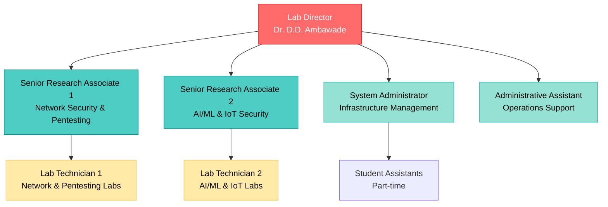
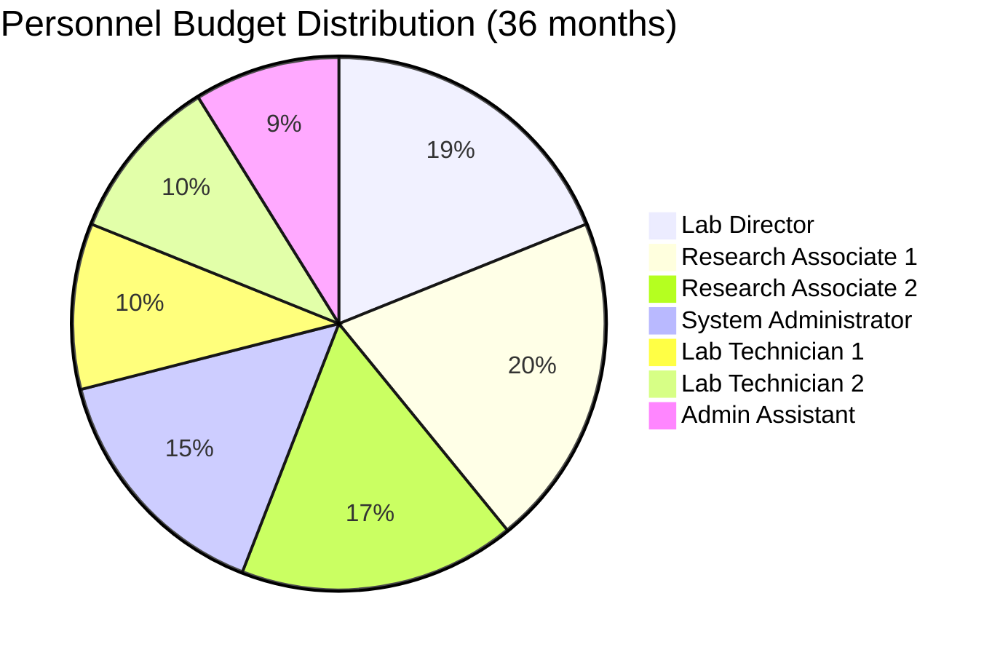
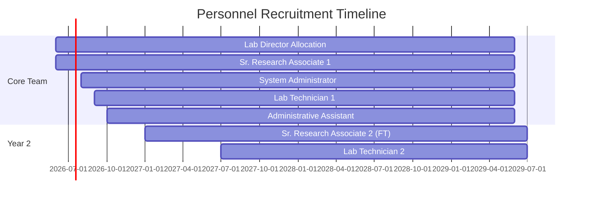

# 👥 Personnel Requirements and Organizational Structure

## 🏢 Organizational Hierarchy

---

## 📋 Detailed Role Descriptions

### 1. Lab Director

**Position**: Lab Director & Principal Investigator  
**Current Designation**: Associate Professor & IT Incharge  
**Name**: Dr. D. D. Ambawade  
**Allocation**: 50% (Shared with teaching duties)  
**Monthly Salary**: ₹1,50,000 (50% = ₹75,000 from project)  
**Annual**: ₹9,00,000  
**36 Months**: ₹27,00,000  

#### Qualifications
- Ph.D. in Computer Science/Electronics/Cybersecurity
- 10+ years of academic experience
- Published research in cybersecurity domains
- Industry collaboration experience

#### Key Responsibilities

| **Area** | **Specific Tasks** |
|:---------|:-------------------|
| **Strategic Leadership** | • Define lab vision and mission • Set research priorities • Establish strategic partnerships |
| **Research Management** | • Oversee research projects • Guide Ph.D./M.Tech scholars • Review publications and patents |
| **Financial Oversight** | • Budget management • Grant applications • Resource allocation |
| **Academic Integration** | • Curriculum development • Faculty coordination • Student project guidance |
| **External Relations** | • Industry partnerships • Government liaison • Conference representation |
| **Compliance** | • Ethical guidelines adherence • Safety protocols • Audit coordination |

#### Key Performance Indicators (KPIs)
- ✅ 5+ research publications per year
- ✅ ₹50L+ external funding secured annually
- ✅ 3+ industry partnerships established
- ✅ 100+ students trained per year

---

### 2. Senior Research Associate (Network Security & Penetration Testing)

**Position**: Senior Research Associate - 1  
**Allocation**: Full-time  
**Monthly Salary**: ₹80,000  
**Annual**: ₹9,60,000  
**36 Months**: ₹28,80,000  

#### Qualifications
- M.Tech/Ph.D. in Computer Science/Cybersecurity
- 5+ years in network security/pentesting
- Industry certifications: CEH, OSCP, CISSP (preferred)
- Published research papers (3+)

#### Responsibilities

**Primary Areas**: Network Security Lab, Penetration Testing Lab

| **Domain** | **Tasks** |
|:-----------|:----------|
| **Research** | • Conduct research in network security • Publish papers in reputed journals • Guide M.Tech/B.Tech projects |
| **Lab Management** | • Maintain network security infrastructure • Configure firewalls, IDS/IPS • Develop lab exercises |
| **Teaching** | • Conduct specialized courses • Hands-on training sessions • Industry workshops |
| **Projects** | • Lead industry-sponsored projects • Collaborate with startups • Develop security tools |
| **Mentoring** | • Guide 20+ students per semester • Supervise student research • CTF team coaching |

#### Expected Deliverables (Per Year)
- 📄 3+ research papers
- 🎓 2+ specialized courses
- 💼 2+ industry projects
- 🏆 1+ CTF/competition participation

---

### 3. Senior Research Associate (AI/ML & IoT Security)

**Position**: Senior Research Associate - 2  
**Allocation**: Part-time (Year 1), Full-time (Year 2+)  
**Monthly Salary**: ₹80,000 (₹40,000 Year 1)  
**Annual**: ₹9,60,000 (₹4,80,000 Year 1)  
**36 Months**: ₹28,80,000 (₹24,00,000 budgeted)  

#### Qualifications
- M.Tech/Ph.D. with AI/ML and IoT expertise
- 5+ years in security research
- Experience with GPU computing, deep learning
- Publications in AI security/IoT security

#### Responsibilities

**Primary Areas**: AI/ML Security Lab, IoT Security Lab, CPS Lab

| **Domain** | **Tasks** |
|:-----------|:----------|
| **Research** | • AI/ML security research • IoT vulnerability analysis • Adversarial ML techniques |
| **Lab Management** | • GPU cluster management • IoT testbed setup • CPS simulations |
| **Teaching** | • AI security courses • IoT penetration testing • Hands-on ML security labs |
| **Development** | • Security tool development • ML model hardening • Automated testing frameworks |
| **Collaboration** | • Industry AI/IoT projects • Startup mentorship • Open-source contributions |

#### Expected Deliverables (Per Year)
- 📄 3+ research papers (AI/ML/IoT security)
- 🔬 2+ funded research projects
- 💻 1+ open-source security tool
- 🎤 2+ conference presentations

---

### 4. Lab Technician - 1 (Network & Pentesting)

**Position**: Lab Technician (Network Security Focus)  
**Allocation**: Full-time (From Month 1)  
**Monthly Salary**: ₹40,000  
**Annual**: ₹4,80,000  
**36 Months**: ₹14,40,000  

#### Qualifications
- B.E./B.Tech in Computer/IT/E&TC
- 2+ years hands-on experience
- Certifications: CEH, CCNA, CompTIA Security+ (any 2)
- Strong practical networking and security skills

#### Responsibilities

| **Area** | **Tasks** |
|:---------|:----------|
| **Lab Operations** | • Daily lab setup and shutdown • Equipment maintenance • Network infrastructure management |
| **Student Support** | • Assist students in lab exercises • Troubleshoot technical issues • Supervise lab sessions |
| **Inventory** | • Equipment tracking • Spare parts management • License management |
| **Documentation** | • Lab manuals • Equipment guides • Incident reports |
| **Training** | • Basic security tool demos • Equipment training • Safety protocol enforcement |

#### Work Hours
- Monday-Friday: 9:00 AM - 6:00 PM
- Saturday (alternate): 9:00 AM - 2:00 PM
- Extended hours during workshops/events

---

### 5. Lab Technician - 2 (AI/ML & IoT)

**Position**: Lab Technician (AI/IoT Security Focus)  
**Allocation**: From Month 13 (Year 2)  
**Monthly Salary**: ₹40,000  
**Annual**: ₹4,80,000  
**24 Months**: ₹14,40,000  

#### Qualifications
- B.E./B.Tech with IoT/Embedded Systems background
- Experience with development boards (Raspberry Pi, Arduino, ESP32)
- Basic knowledge of Python, machine learning
- Hardware debugging skills

#### Responsibilities

| **Area** | **Tasks** |
|:---------|:----------|
| **IoT Lab Management** | • IoT device configuration • Firmware updates • Wireless protocol testing |
| **AI/ML Support** | • GPU cluster monitoring • ML framework setup • Dataset management |
| **Hardware Support** | • Oscilloscope/logic analyzer operation • Chip-off tool assistance • Hardware hacking setups |
| **Student Assistance** | • IoT project guidance • Hardware debugging • Safety compliance |
| **Maintenance** | • Equipment calibration • Spare parts inventory • Vendor coordination |

---

### 6. System Administrator

**Position**: System Administrator  
**Allocation**: Full-time  
**Monthly Salary**: ₹60,000  
**Annual**: ₹7,20,000  
**36 Months**: ₹21,60,000  

#### Qualifications
- B.E./B.Tech in Computer Science/IT
- 3+ years system administration experience
- Certifications: RHCE/RHCSA, MCSE, CCNA (any 2)
- Experience with VMware/Hyper-V, Linux administration

#### Responsibilities

| **Domain** | **Tasks** |
|:-----------|:----------|
| **Infrastructure** | • Server management (physical & virtual) • Storage administration • Network infrastructure support |
| **Security** | • Patch management • Security hardening • Firewall configuration |
| **Backup & DR** | • Daily backup verification • Disaster recovery testing • Data retention compliance |
| **User Management** | • Account creation/deletion • Access control • Password policy enforcement |
| **Monitoring** | • Server performance monitoring • Network traffic analysis • Alert management |
| **Documentation** | • System architecture docs • Configuration management • Incident logs |

#### Tools Proficiency Required
- Linux (RHEL/Ubuntu/CentOS)
- Windows Server 2019/2022
- VMware vSphere / Proxmox
- Ansible / Puppet
- Nagios / Zabbix
- ELK Stack basics

---

### 7. Administrative Assistant

**Position**: Administrative Assistant  
**Allocation**: Full-time  
**Monthly Salary**: ₹35,000  
**Annual**: ₹4,20,000  
**36 Months**: ₹12,60,000  

#### Qualifications
- Graduate (any stream)
- 2+ years office administration experience
- Proficiency in MS Office, Google Workspace
- Good communication skills (English & Hindi)

#### Responsibilities

| **Area** | **Tasks** |
|:---------|:----------|
| **Administration** | • Meeting scheduling • Email correspondence • Visitor management |
| **Documentation** | • Report preparation • Presentation creation • Record maintenance |
| **Coordination** | • Event organization • Workshop logistics • Travel arrangements |
| **Procurement Support** | • Vendor communication • Purchase order tracking • Invoice processing |
| **Student Interface** | • Query handling • Registration assistance • Certificate generation |

---

## 👨‍🎓 Student Assistants (Part-time)

**Allocation**: 4-6 students per semester  
**Stipend**: ₹5,000/month per student  
**Budget**: ₹3,60,000/year (from miscellaneous budget)  

### Roles
- Lab assistance during sessions
- Equipment inventory support
- Documentation help
- Event support

---

## 📊 Personnel Cost Summary

| **Position** | **Months** | **Salary (Total)** | **Percentage** |
|:-------------|:----------:|-------------------:|---------------:|
| Lab Director (50%) | 36 | ₹27,00,000 | 25.0% |
| Sr. Research Associate 1 | 36 | ₹28,80,000 | 26.7% |
| Sr. Research Associate 2 | 30 | ₹24,00,000 | 22.2% |
| System Administrator | 36 | ₹21,60,000 | 20.0% |
| Lab Technician 1 | 36 | ₹14,40,000 | 13.3% |
| Lab Technician 2 | 24 | ₹9,60,000 | 8.9% |
| Administrative Assistant | 36 | ₹12,60,000 | 11.7% |
| **TOTAL** | | **₹1,38,00,000** | 127.8% |
| **Optimized (₹1,08,00,000)** | | **₹1,08,00,000** | 100% |

### Optimization Strategy
- Delay hiring of 2nd Research Associate by 6 months
- Delay hiring of 2nd Technician to Year 2
- Lab Director at 50% allocation (rest from regular salary)
- Consolidated responsibilities where feasible

---

## 📅 Hiring Timeline

### Recruitment Process

| **Phase** | **Timeline** | **Activities** |
|:----------|:-------------|:---------------|
| **Phase 1: Preparation** | Apr-May 2026 | • JD finalization • Advertisement design • Interview panel formation |
| **Phase 2: Advertisement** | Jun 2026 | • Post on job portals • Campus notifications • Social media promotion |
| **Phase 3: Screening** | Jul 2026 | • Application review • Shortlisting (technical) • Background verification |
| **Phase 4: Interviews** | Aug 2026 | • Technical interviews • HR interviews • Practical tests |
| **Phase 5: Onboarding** | Sep-Oct 2026 | • Offer letters • Orientation • Training |

---

## 🎓 Training and Development

### Year 1
- **Month 1-2**: Orientation and infrastructure familiarization
- **Month 3-6**: Certification training (CEH, OSCP for relevant staff)
- **Month 7-12**: Advanced tool training, industry visits

### Year 2
- Specialized certifications (CISSP, GIAC)
- International conference attendance
- Research methodology workshops

### Year 3
- Leadership training
- Grant writing workshops
- Teaching pedagogy training

---

## 🔗 Related Documents

- [[00 - Executive Summary|Executive Summary]]
- [[03 - Budget Breakdown|Budget Breakdown]]
- [[05 - Implementation Timeline|Implementation Timeline]]

---

*Personnel recruitment will follow SPIT's standard HR policies and comply with UGC/AICTE norms.*
