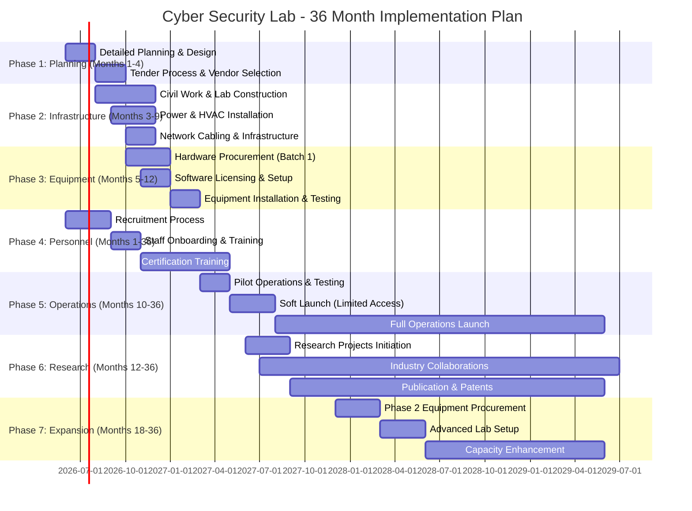
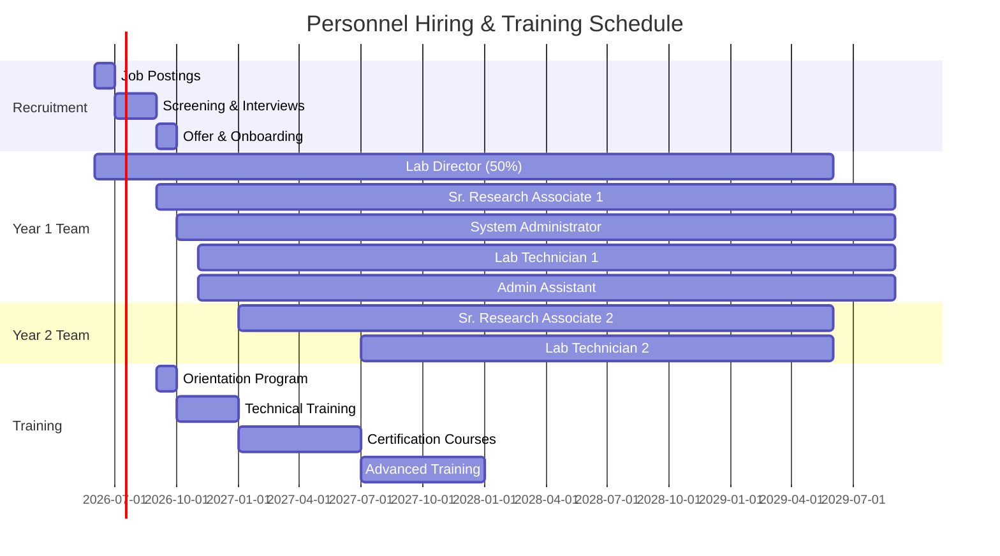
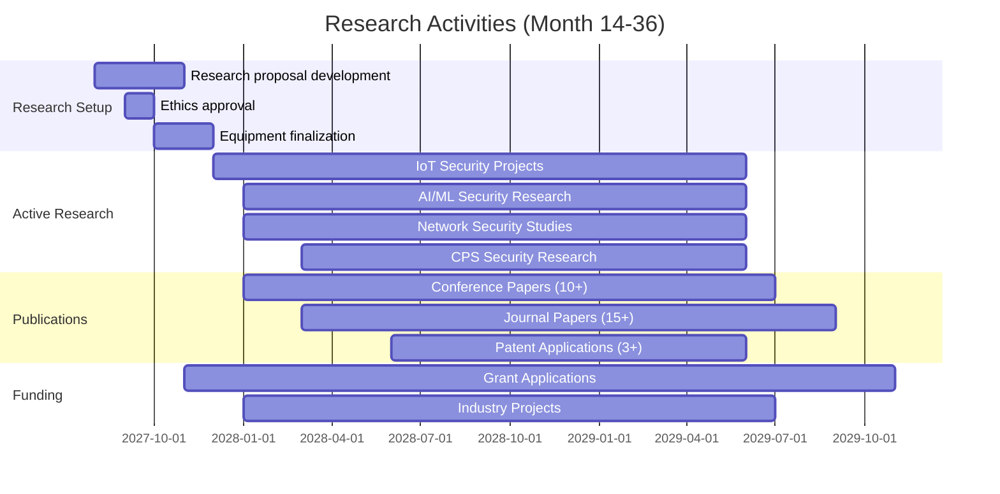

# 📅 Implementation Timeline and Milestones

## 🗓️ Overall Project Timeline

**Duration**: 36 Months (June 2026 - May 2029)  
**Start Date**: Mid-2026  
**Completion Date**: Mid-2029  

---

## 📊 Phase-wise Gantt Chart



---

## 🎯 Phase-wise Detailed Timeline

### **PHASE 1: Planning and Preparation (Months 1-4)**

#### Month 1-2: Jun-Jul 2026

| **Week** | **Activity** | **Deliverable** | **Owner** |
|:---------|:-------------|:----------------|:----------|
| W1-2 | Project kickoff meeting | Project charter | Lab Director |
| W2-3 | Detailed lab design | Floor plan, 3D models | Consultant + Faculty |
| W3-4 | Equipment specifications finalization | Technical specs document | Research Associates |
| W4-6 | Software requirements gathering | Software list with licenses | Tech Team |
| W6-8 | Budget allocation and approval | Approved budget breakdown | Finance + Director |

**Key Deliverables**:
- ✅ Detailed Project Report (DPR)
- ✅ Lab Design (Architecture + Layout)
- ✅ Equipment Specifications
- ✅ Budget Sign-off

#### Month 3-4: Aug-Sep 2026

| **Week** | **Activity** | **Deliverable** | **Owner** |
|:---------|:-------------|:----------------|:----------|
| W9-10 | Tender document preparation | RFP/RFQ documents | Procurement Team |
| W11-12 | Tender publication | Public notices | Admin |
| W13-14 | Vendor presentations & evaluation | Evaluation matrix | Tech Committee |
| W15-16 | Vendor selection & PO issuance | Purchase orders | Procurement |

**Key Deliverables**:
- ✅ Vendor Selection Complete
- ✅ Contracts Signed
- ✅ Purchase Orders Issued

---

### **PHASE 2: Infrastructure Development (Months 3-9)**

#### Month 3-6: Aug-Nov 2026

| **Activity** | **Duration** | **Cost** | **Status** |
|:-------------|:-------------|:---------|:-----------|
| Civil Work (False ceiling, flooring) | 3 months | ₹15,00,000 | Planned |
| Electrical work (wiring, panels, lighting) | 2.5 months | ₹8,00,000 | Planned |
| HVAC installation (ACs, ventilation) | 2 months | ₹7,00,000 | Planned |
| Power backup (Generator, UPS) | 2 months | ₹14,00,000 | Planned |
| Fire safety systems | 1.5 months | ₹4,00,000 | Planned |
| Access control & CCTV | 1 month | ₹4,00,000 | Planned |

**Milestone**: Infrastructure 70% complete by Nov 2026

#### Month 7-9: Dec 2026 - Feb 2027

| **Activity** | **Duration** | **Cost** | **Status** |
|:-------------|:-------------|:---------|:-----------|
| Network cabling (Cat6A, fiber) | 1.5 months | ₹6,00,000 | Planned |
| Furniture installation | 1 month | ₹15,00,000 | Planned |
| Server rack setup | 2 weeks | ₹2,50,000 | Planned |
| Final inspections & safety clearance | 2 weeks | - | Planned |

**Milestone**: Infrastructure 100% complete by Feb 2027

---

### **PHASE 3: Equipment Procurement & Installation (Months 5-12)**

#### Batch 1: Oct-Dec 2026 (₹1,00,00,000)

| **Category** | **Items** | **Timeline** | **Budget** |
|:-------------|:----------|:-------------|:-----------|
| Workstations | 30 units (Tier 1 & 2) | Oct-Nov | ₹45,00,000 |
| Servers | 3 hypervisors, 1 storage | Nov | ₹24,00,000 |
| Network Equipment | Firewalls, switches, APs | Nov-Dec | ₹20,00,000 |
| Monitors & Peripherals | 60 monitors, keyboards, mice | Nov | ₹11,00,000 |

#### Batch 2: Jan-Mar 2027 (₹50,00,000)

| **Category** | **Items** | **Timeline** | **Budget** |
|:-------------|:----------|:-------------|:-----------|
| Workstations | 30 units (Tier 2 & 3) | Jan-Feb | ₹30,00,000 |
| Specialized Hardware | Forensics, IoT, CPS equipment | Feb-Mar | ₹15,00,000 |
| GPU Systems | 2 GPU workstations | Mar | ₹10,00,000 |

#### Batch 3: Year 2 (₹25,00,000)

- Vulnerable machines
- Additional IoT devices
- Expansion hardware

**Milestone**: 80% equipment operational by Mar 2027

---

### **PHASE 4: Software Licensing & Configuration (Months 6-12)**

#### Month 6-8: Nov 2026 - Jan 2027

| **Software Category** | **Action** | **Timeline** |
|:----------------------|:-----------|:-------------|
| Operating Systems | Windows, Linux deployment | Nov-Dec 2026 |
| Virtualization | VMware vSphere setup | Dec 2026 |
| Security Tools | Burp Suite, Metasploit, Nessus | Jan 2027 |
| Forensics Tools | EnCase, X-Ways, Autopsy | Jan 2027 |

#### Month 9-12: Feb-May 2027

| **Software Category** | **Action** | **Timeline** |
|:----------------------|:-----------|:-------------|
| SIEM & Monitoring | Splunk, ELK Stack | Feb 2027 |
| Development Tools | GitHub, JetBrains | Mar 2027 |
| Training Platforms | HTB, TryHackMe | Apr 2027 |
| Cloud Platforms | AWS/Azure accounts | May 2027 |

**Milestone**: All software licensed and configured by May 2027

---

### **PHASE 5: Personnel Recruitment & Training (Months 1-36)**



#### Training Schedule

| **Quarter** | **Training Focus** | **Personnel** | **Budget** |
|:------------|:-------------------|:--------------|:-----------|
| Q4 2026 | Infrastructure familiarization | All | ₹2,00,000 |
| Q1 2027 | Tool-specific training | Technical staff | ₹3,00,000 |
| Q2 2027 | Certifications (CEH, OSCP) | Research Associates | ₹5,00,000 |
| Q3 2027 | Advanced topics | All | ₹2,00,000 |
| Q4 2027+ | Continuous learning | All | ₹3,00,000 |

---

### **PHASE 6: Pilot & Launch (Months 10-15)**

#### Month 10-11: Mar-Apr 2027 - Pilot Testing

| **Week** | **Activity** | **Participants** |
|:---------|:-------------|:-----------------|
| W1-2 | Internal testing with faculty | 5 faculty members |
| W3-4 | Student pilot batch | 20 students (volunteers) |
| W5-6 | Feedback collection & fixes | Tech team |
| W7-8 | External expert review | Industry consultants |

**Success Criteria**:
- ✅ All labs functional
- ✅ 90%+ user satisfaction
- ✅ No critical issues

#### Month 12-13: May-Jun 2027 - Soft Launch

- Limited student batches (50-100 students)
- Selected courses only
- Intensive monitoring
- Iterative improvements

#### Month 14-15: Jul-Aug 2027 - Full Launch

- Open to all eligible students
- Full course catalog
- Industry events
- Press release and media coverage

**Milestone**: Full operations by Aug 2027

---

### **PHASE 7: Operations & Research (Months 14-36)**

#### Research Projects Timeline



#### Industry Collaboration Timeline

| **Quarter** | **Activity** | **Target** |
|:------------|:-------------|:-----------|
| Q3 2027 | MoU signing with companies | 3-5 companies |
| Q4 2027 | First industry project | 1-2 projects |
| Q1 2028 | Internship placements | 20+ students |
| Q2 2028 | Joint research projects | 3+ projects |
| Q3 2028+ | Sustained collaboration | Ongoing |

---

## 📈 Key Milestones and Checkpoints

### Year 1 Milestones (2026-2027)

| **Month** | **Milestone** | **Success Criteria** |
|:----------|:--------------|:---------------------|
| M2 | DPR Approved | Budget & specs finalized |
| M4 | Vendors Selected | Contracts signed |
| M6 | Civil Work 50% | Infrastructure progressing |
| M9 | Infrastructure Complete | Safety clearance obtained |
| M10 | Equipment 50% Installed | Core labs functional |
| M12 | Pilot Launch | 20+ users successfully trained |

### Year 2 Milestones (2027-2028)

| **Month** | **Milestone** | **Success Criteria** |
|:----------|:--------------|:---------------------|
| M14 | Full Operations | 100+ active users |
| M18 | First Research Output | 3+ papers submitted |
| M20 | Industry Partnership | 2+ active collaborations |
| M24 | Capacity at 80% | 300+ students trained |

### Year 3 Milestones (2028-2029)

| **Month** | **Milestone** | **Success Criteria** |
|:----------|:--------------|:---------------------|
| M30 | 25+ Publications | Journal/conference papers |
| M33 | External Funding | ₹50L+ grants secured |
| M36 | Centre of Excellence Status | National recognition |

---

## 🚦 Risk Management and Contingencies

### Potential Delays and Mitigation

| **Risk** | **Probability** | **Impact** | **Mitigation** |
|:---------|:---------------:|:----------:|:---------------|
| Vendor delays | High | Medium | Multiple vendor options, penalty clauses |
| Budget overruns | Medium | High | 10% contingency, phased procurement |
| Personnel attrition | Low | Medium | Competitive salaries, growth opportunities |
| Equipment failure | Medium | Low | Warranty, AMC, spare parts |
| Software licensing issues | Low | Medium | Perpetual licenses where possible |

### Timeline Buffer

- **Overall buffer**: 2 months (included in 36-month timeline)
- **Phase buffers**: 2 weeks per phase
- **Contingency funds**: 5.5% of total budget

---

## 📊 Progress Tracking Mechanism

### Monthly Review Meetings

**Participants**: Lab Director, Research Associates, System Admin, SPIT Management

**Agenda**:
- Progress vs. plan
- Budget utilization
- Issues and blockers
- Next month planning

### Quarterly Steering Committee

**Participants**: Principal, Dean, Lab Director, Industry Advisory Board

**Agenda**:
- Milestone achievement review
- Strategic direction
- Partnership opportunities
- Resource allocation decisions

### Dashboards and Reporting

```
Key Metrics to Track:
├── Budget Utilization (%)
├── Equipment Installation (%)
├── Personnel Onboarding (%)
├── Student Enrollment (#)
├── Research Papers (#)
├── Industry Projects (#)
└── User Satisfaction (Score)
```

---

## 🔗 Related Documents

- [[00 - Executive Summary|Executive Summary]]
- [[02 - Infrastructure Specifications|Infrastructure Details]]
- [[03 - Budget Breakdown|Budget Breakdown]]
- [[04 - Personnel Requirements|Personnel & Staffing]]
- [[06 - Research Objectives|Research Objectives]]

---

*Timeline is indicative and subject to adjustment based on vendor availability, regulatory approvals, and institutional priorities.*
