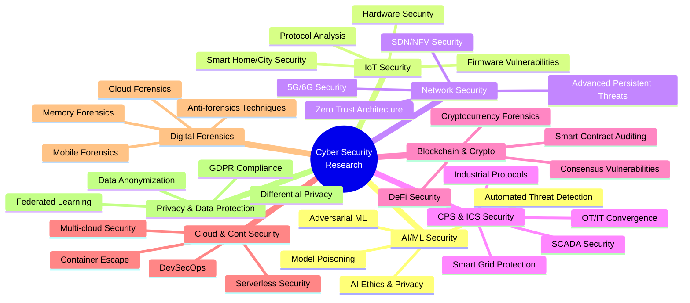
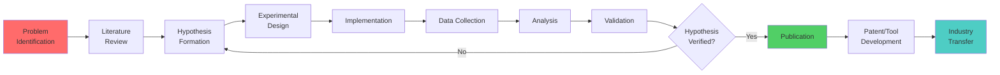
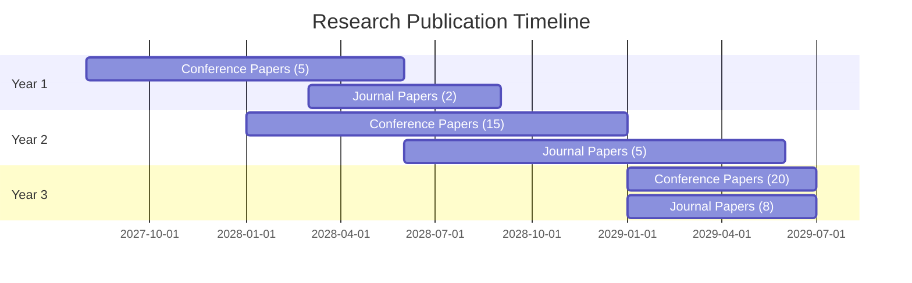

# 🔬 Research Objectives and Methodology

## 🎯 Overarching Research Vision

To establish SPIT's Cyber Security Lab as a **leading research hub** that addresses critical cybersecurity challenges in emerging technologies, contributes to national security infrastructure, and bridges the gap between academic research and industry implementation.

---

## 📋 Research Focus Areas

---

## 🔍 Detailed Research Objectives

### **1. AI/ML Security Research**

#### Primary Objectives
1. Develop robust defenses against adversarial machine learning attacks
2. Create frameworks for secure AI model deployment
3. Design AI-powered intrusion detection systems
4. Investigate privacy-preserving machine learning techniques

#### Specific Research Questions
- How can we detect poisoning attacks in training datasets?
- What are effective defense mechanisms against adversarial examples?
- How to ensure fairness and prevent bias in AI security systems?
- Can we develop real-time adversarial attack detection?

#### Proposed Projects

| **Project Title** | **Duration** | **Budget** | **Expected Outcome** |
|:------------------|:------------:|:----------:|:---------------------|
| Adversarial ML Defense Framework | 18 months | ₹15,00,000 | Patent + 3 papers |
| AI-based Network Intrusion Detection | 24 months | ₹20,00,000 | Tool + 4 papers |
| Privacy-Preserving Federated Learning | 18 months | ₹12,00,000 | Framework + 2 papers |
| Explainable AI for Security Analytics | 12 months | ₹8,00,000 | Tool + 2 papers |

#### Key Deliverables
- 📄 10+ research papers in top-tier conferences (USENIX, CCS, NDSS)
- 💻 2+ open-source AI security tools
- 🏆 1+ patent applications
- 🎓 3+ Ph.D. theses

---

### **2. IoT and Embedded Systems Security**

#### Primary Objectives
1. Identify and mitigate vulnerabilities in IoT firmware
2. Develop secure-by-design IoT architectures
3. Create automated firmware analysis tools
4. Investigate hardware-level security mechanisms

#### Specific Research Questions
- How to automatically detect vulnerabilities in IoT firmware?
- What are effective lightweight crypto schemes for resource-constrained devices?
- How to ensure secure OTA updates for IoT devices?
- Can we develop hardware-based attestation for IoT?

#### Proposed Projects

| **Project Title** | **Duration** | **Budget** | **Expected Outcome** |
|:------------------|:------------:|:----------:|:---------------------|
| Automated IoT Firmware Analysis Platform | 24 months | ₹18,00,000 | Tool + Patent + 3 papers |
| Secure Smart Home Architecture | 18 months | ₹12,00,000 | Framework + 2 papers |
| Hardware Root of Trust for IoT | 24 months | ₹20,00,000 | Prototype + Patent + 2 papers |
| IoT Botnet Detection & Mitigation | 18 months | ₹10,00,000 | System + 3 papers |

#### Key Deliverables
- 📄 8+ research papers (IoTDI, IoTSec, AsiaCCS)
- 💻 Automated firmware analysis tool (open-source)
- 🔐 Secure IoT reference architecture
- 🏆 2+ patent applications

---

### **3. Cyber-Physical Systems (CPS) and ICS Security**

#### Primary Objectives
1. Analyze security vulnerabilities in industrial control systems
2. Develop intrusion detection for SCADA environments
3. Create testbeds for smart grid security research
4. Investigate resilience mechanisms for critical infrastructure

#### Specific Research Questions
- How to detect sophisticated attacks on industrial protocols (Modbus, DNP3)?
- What are effective anomaly detection techniques for ICS?
- How to ensure resilience of smart grids against cyber-attacks?
- Can we develop secure-by-design OT networks?

#### Proposed Projects

| **Project Title** | **Duration** | **Budget** | **Expected Outcome** |
|:------------------|:------------:|:----------:|:---------------------|
| ICS Intrusion Detection System | 24 months | ₹25,00,000 | Product + 4 papers |
| Smart Grid Security Testbed | 36 months | ₹35,00,000 | Testbed + 5 papers |
| Secure Industrial Protocol Gateway | 18 months | ₹15,00,000 | Prototype + Patent + 2 papers |
| OT Network Security Framework | 12 months | ₹8,00,000 | Framework + 2 papers |

#### Key Deliverables
- 📄 10+ research papers (ICS-CSR, SCADA Security)
- 🏭 Fully functional ICS security testbed
- 🛡️ ICS-IDS system (commercializable)
- 🤝 3+ industry collaborations

---

### **4. Network Security and Next-Gen Technologies**

#### Primary Objectives
1. Investigate security challenges in 5G/6G networks
2. Develop zero-trust network architectures
3. Create advanced APT detection mechanisms
4. Research SDN/NFV security

#### Specific Research Questions
- What are unique security challenges in 5G network slicing?
- How to implement zero-trust in legacy infrastructures?
- Can we detect APTs using graph-based analysis?
- How to secure SDN controller-switch communication?

#### Proposed Projects

| **Project Title** | **Duration** | **Budget** | **Expected Outcome** |
|:------------------|:------------:|:----------:|:---------------------|
| 5G Security Framework | 24 months | ₹20,00,000 | Framework + 4 papers |
| Zero-Trust Implementation Guide | 12 months | ₹8,00,000 | Guide + 2 papers |
| APT Detection using Graph Analytics | 18 months | ₹12,00,000 | Tool + 3 papers |
| SDN Security Orchestration | 18 months | ₹10,00,000 | System + 2 papers |

#### Key Deliverables
- 📄 9+ research papers (INFOCOM, NDSS, IMC)
- 🌐 5G security testbed
- 💻 APT detection tool
- 📖 Zero-trust implementation playbook

---

### **5. Blockchain and Cryptocurrency Security**

#### Primary Objectives
1. Audit and analyze smart contract vulnerabilities
2. Investigate DeFi security challenges
3. Develop cryptocurrency forensics techniques
4. Research consensus mechanism security

#### Specific Research Questions
- How to automatically detect vulnerabilities in smart contracts?
- What are emerging attack vectors in DeFi protocols?
- Can we trace cryptocurrency transactions despite mixing?
- How to prevent 51% attacks in proof-of-stake systems?

#### Proposed Projects

| **Project Title** | **Duration** | **Budget** | **Expected Outcome** |
|:------------------|:------------:|:----------:|:---------------------|
| Automated Smart Contract Auditor | 18 months | ₹15,00,000 | Tool + Patent + 3 papers |
| DeFi Security Analysis Framework | 18 months | ₹12,00,000 | Framework + 2 papers |
| Cryptocurrency Forensics Tool | 24 months | ₹18,00,000 | Tool + 4 papers |
| Blockchain Consensus Security | 12 months | ₹8,00,000 | Analysis + 2 papers |

#### Key Deliverables
- 📄 8+ research papers (CCS, Oakland, FC)
- 💻 Smart contract auditing tool
- 🔍 Crypto forensics framework
- 🤝 2+ industry partnerships (fintech)

---

### **6. Cloud and Container Security**

#### Primary Objectives
1. Investigate container escape vulnerabilities
2. Develop multi-cloud security posture management
3. Research serverless security challenges
4. Create DevSecOps automation frameworks

#### Proposed Projects

| **Project Title** | **Duration** | **Budget** | **Expected Outcome** |
|:------------------|:------------:|:----------:|:---------------------|
| Container Security Scanner | 12 months | ₹10,00,000 | Tool + 2 papers |
| Multi-Cloud Security Framework | 18 months | ₹15,00,000 | Framework + 3 papers |
| Serverless Security Analysis | 12 months | ₹8,00,000 | Tool + 2 papers |
| DevSecOps Automation Pipeline | 18 months | ₹12,00,000 | Pipeline + 2 papers |

---

### **7. Digital Forensics and Incident Response**

#### Primary Objectives
1. Develop advanced mobile forensics techniques
2. Research cloud forensics challenges
3. Create memory forensics frameworks
4. Investigate anti-forensics techniques

#### Proposed Projects

| **Project Title** | **Duration** | **Budget** | **Expected Outcome** |
|:------------------|:------------:|:----------:|:---------------------|
| Advanced Mobile Forensics Framework | 18 months | ₹15,00,000 | Framework + 3 papers |
| Cloud Forensics Toolkit | 24 months | ₹20,00,000 | Tool + 4 papers |
| Memory Forensics for Malware Analysis | 12 months | ₹8,00,000 | Tool + 2 papers |
| Anti-Forensics Detection Techniques | 12 months | ₹6,00,000 | Methods + 2 papers |

---

## 📊 Research Methodology

### Research Process Framework

### Methodological Approaches

| **Research Area** | **Primary Methodology** | **Tools/Techniques** |
|:------------------|:------------------------|:---------------------|
| AI/ML Security | Experimental, Quantitative | PyTorch, TensorFlow, Adversarial Robustness Toolbox |
| IoT Security | Experimental, Hardware Analysis | Firmware extraction, IDA Pro, Ghidra, Logic analyzers |
| CPS/ICS Security | Simulation, Testbed-based | OPAL-RT, MATLAB/Simulink, Real PLCs |
| Network Security | Measurement Studies, Analytics | Wireshark, Zeek, Graph databases |
| Blockchain | Code Analysis, Simulation | Solidity, Truffle, Ganache, Mythril |
| Cloud Security | Experimental, Penetration Testing | Docker, Kubernetes, Cloud security scanners |
| Forensics | Case Studies, Tool Development | EnCase, X-Ways, Volatility, Custom tools |

---

## 📈 Research Output Targets (3 Years)

### Publications

### Target Venues

**Top-Tier Conferences (Tier 1)**:
- USENIX Security Symposium
- IEEE S&P (Oakland)
- ACM CCS
- NDSS
- CRYPTO/EUROCRYPT

**Quality Conferences (Tier 2)**:
- ACSAC, AsiaCCS, RAID, ESORICS
- IoTDI, IoT S&P
- ICICS, DIMVA

**Journals**:
- IEEE Transactions on Information Forensics and Security (TIFS)
- IEEE Transactions on Dependable and Secure Computing (TDSC)
- ACM Transactions on Privacy and Security (TOPS)
- Computers & Security (Elsevier)
- Journal of Cybersecurity (Oxford)

### Patents and IP

| **Year** | **Patent Applications** | **Open-Source Tools** | **Industry Transfers** |
|:---------|:-----------------------:|:---------------------:|:----------------------:|
| Year 1 | 1 | 2 | 0 |
| Year 2 | 2 | 3 | 1 |
| Year 3 | 2 | 2 | 2 |
| **Total** | **5** | **7** | **3** |

---

## 💰 Research Funding Strategy

### Internal Funding (From Lab Budget)
- Seed funding for pilot projects: ₹10,00,000/year
- Student stipends and consumables: ₹5,00,000/year
- Publication fees: ₹2,00,000/year

### External Funding Targets

| **Funding Source** | **Target (Year 1)** | **Target (Year 2)** | **Target (Year 3)** | **Total** |
|:-------------------|:-------------------:|:-------------------:|:-------------------:|:---------:|
| DST/DBT/SERB | ₹10,00,000 | ₹20,00,000 | ₹30,00,000 | ₹60,00,000 |
| AICTE/UGC | ₹5,00,000 | ₹10,00,000 | ₹10,00,000 | ₹25,00,000 |
| Industry Sponsored | ₹5,00,000 | ₹15,00,000 | ₹30,00,000 | ₹50,00,000 |
| International Grants | 0 | ₹10,00,000 | ₹15,00,000 | ₹25,00,000 |
| **Total** | **₹20,00,000** | **₹55,00,000** | **₹85,00,000** | **₹1,60,00,000** |

### Grant Application Timeline

| **Quarter** | **Target Schemes** | **Applications** |
|:------------|:-------------------|:----------------:|
| Q3 2027 | DST SERB, AICTE RPS | 3 |
| Q4 2027 | Industry partnerships | 2 |
| Q1 2028 | International collaborations | 1 |
| Q2 2028 | Additional DST/DBT calls | 2 |
| Q3 2028+ | Sustained applications | 2-3/quarter |

---

## 🤝 Industry and Academic Collaborations

### Target Industry Partners

| **Partner Type** | **Companies** | **Collaboration Areas** |
|:-----------------|:--------------|:------------------------|
| **Product Vendors** | Cisco, Palo Alto, Fortinet | Network security research, tool validation |
| **Service Providers** | TCS, Wipro, Infosys | Industry projects, internships |
| **Cybersecurity Startups** | Sequretek, Lucideus, CloudSEK | Joint tool development, case studies |
| **Cloud Providers** | AWS, Azure, GCP | Cloud security research, credits |
| **Financial Sector** | Banks, FinTech | Blockchain, fraud detection |

### Academic Collaborations

| **Institution** | **Focus Area** | **Collaboration Type** |
|:----------------|:---------------|:-----------------------|
| IIT Bombay | AI/ML Security | Joint research, student exchange |
| IIIT Hyderabad | Network Security | Collaborative projects |
| C-DAC | CPS Security | Joint testbed development |
| International Universities | Various | Joint publications, faculty exchange |

---

## 🔗 Related Documents

- [[00 - Executive Summary|Executive Summary]]
- [[01 - Introduction and Background|Introduction & Background]]
- [[05 - Implementation Timeline|Implementation Timeline]]
- [[07 - Educational Framework|Educational Programs]]

---

*Research agenda will be reviewed and updated annually based on emerging threats and technological advances.*
