# 📊 Visual Overview and Diagrams

## 🎨 Project Logo and Branding

### Primary Logo

```
╔══════════════════════════════════════════════════════════════╗
║                                                              ║
║          ⚡ SPIT ADVANCED CYBER SECURITY LAB ⚡              ║
║                                                              ║
║         🛡️  ████████╗███████╗ ██████╗██╗  ██╗             ║
║            ╚══██╔══╝██╔════╝██╔════╝██║  ██║             ║
║               ██║   █████╗  ██║     ███████║             ║
║               ██║   ██╔══╝  ██║     ██╔══██║             ║
║               ██║   ███████╗╚██████╗██║  ██║             ║
║               ╚═╝   ╚══════╝ ╚═════╝╚═╝  ╚═╝             ║
║                                                              ║
║         SECURING TOMORROW'S DIGITAL INFRASTRUCTURE           ║
║                                                              ║
╚══════════════════════════════════════════════════════════════╝
```

### Tagline Options

```
🔐 "Securing Tomorrow's Digital Infrastructure"
🛡️ "Excellence in Cybersecurity Education & Research"
⚡ "Building India's Cyber Defense Capabilities"
🌟 "Where Innovation Meets Security"
```

---

## 💰 Budget Allocation Visualizations

### Overall Budget Distribution

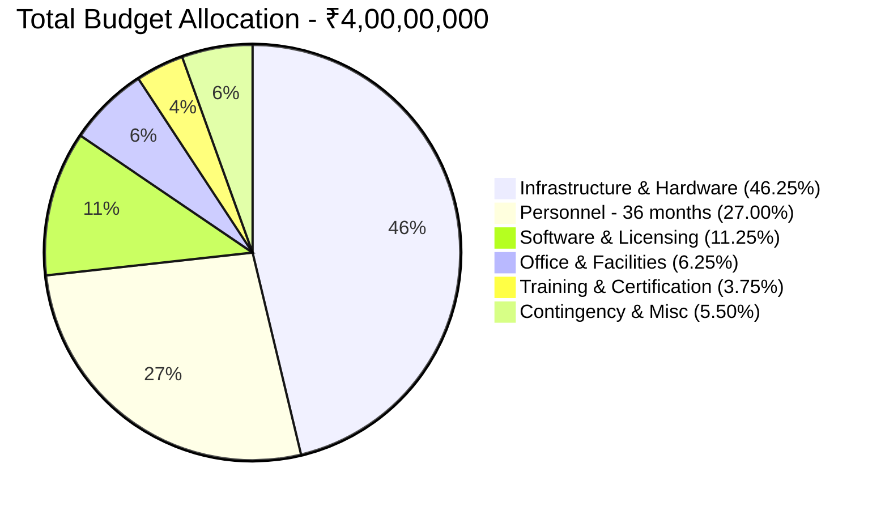

### Hardware Budget Breakdown

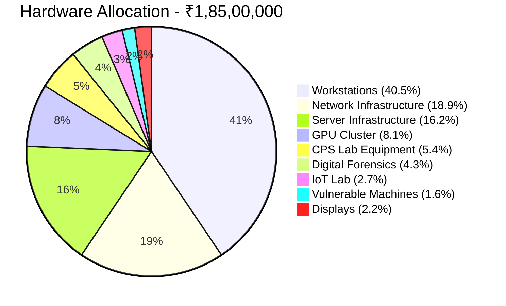

### Year-wise Budget Disbursement

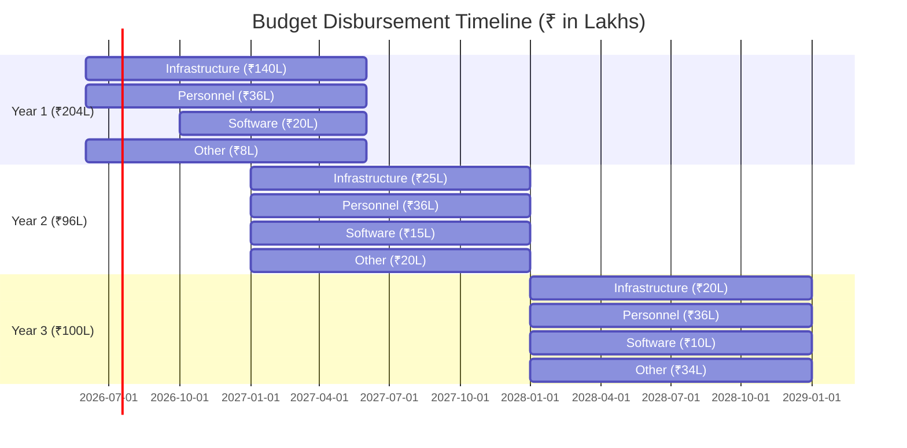

---

## 🏗️ Lab Infrastructure

### Lab Layout Diagram

```
┌──────────────────────────────────────────────────────────────────────┐
│                  SPIT CYBER SECURITY LAB - 3,500 sq.ft              │
│                         Floor Plan Layout                            │
├──────────────────────────────────────────────────────────────────────┤
│                                                                      │
│  ╔═══════════════╗  ╔═══════════════╗  ╔════════════════╗          │
│  ║   Network     ║  ║  Penetration  ║  ║   Digital      ║          │
│  ║   Security    ║  ║   Testing     ║  ║   Forensics    ║          │
│  ║   Lab 🔒      ║  ║   Lab 🎯      ║  ║   Lab 🔍       ║          │
│  ║  20 seats     ║  ║  15 seats     ║  ║  12 seats      ║          │
│  ║  500 sq.ft    ║  ║  500 sq.ft    ║  ║  400 sq.ft     ║          │
│  ╚═══════════════╝  ╚═══════════════╝  ╚════════════════╝          │
│                                                                      │
│  ╔═══════════════╗  ╔═══════════════╗  ╔════════════════╗          │
│  ║   AI/ML       ║  ║     IoT       ║  ║   CPS/ICS      ║          │
│  ║   Security    ║  ║   Security    ║  ║   Security     ║          │
│  ║   Lab 🤖      ║  ║   Lab 📡      ║  ║   Testbed 🏭   ║          │
│  ║  15 seats     ║  ║  12 seats     ║  ║  10 seats      ║          │
│  ║  400 sq.ft    ║  ║  350 sq.ft    ║  ║  450 sq.ft     ║          │
│  ╚═══════════════╝  ╚═══════════════╝  ╚════════════════╝          │
│                                                                      │
│  ╔═══════════════════════════════╗  ╔════════════════╗             │
│  ║    Server Room & SOC          ║  ║    Malware     ║             │
│  ║    Training Center 💻         ║  ║    Analysis    ║             │
│  ║    [Video Wall Display]       ║  ║    Lab 🦠      ║             │
│  ║    600 sq.ft                  ║  ║    8 seats     ║             │
│  ║                               ║  ║    300 sq.ft   ║             │
│  ╚═══════════════════════════════╝  ╚════════════════╝             │
│                                                                      │
│  ╔═════════════╗  ╔═══════════╗  ╔═══════════════╗                │
│  ║ Conference  ║  ║  Office   ║  ║   Storage &   ║                │
│  ║   Room 👥   ║  ║  Space 📋 ║  ║   Utility 📦  ║                │
│  ║  30 people  ║  ║  6 staff  ║  ║   Equipment   ║                │
│  ║  250 sq.ft  ║  ║ 200 sq.ft ║  ║   150 sq.ft   ║                │
│  ╚═════════════╝  ╚═══════════╝  ╚═══════════════╝                │
│                                                                      │
│  [Entry/Exit] ← Main Access                                         │
└──────────────────────────────────────────────────────────────────────┘
```

### Lab Capacity Breakdown

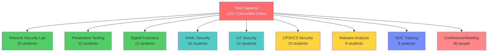

---

## 📅 Timeline Visualizations

### 36-Month Master Timeline

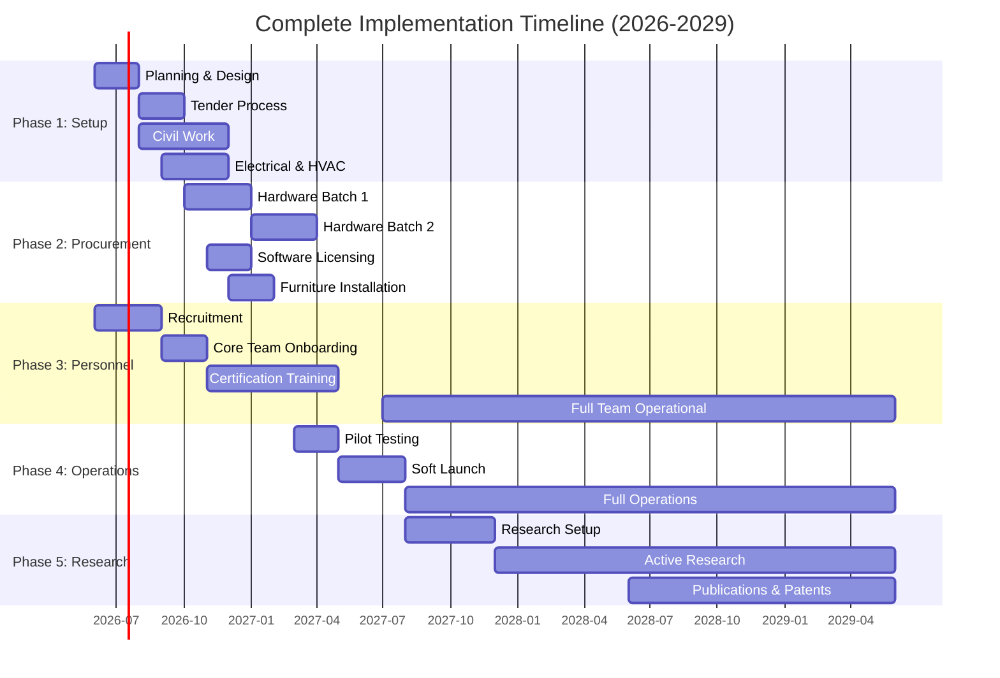

### Milestone Achievement Chart


---

## 👥 Organizational Structure

### Team Hierarchy

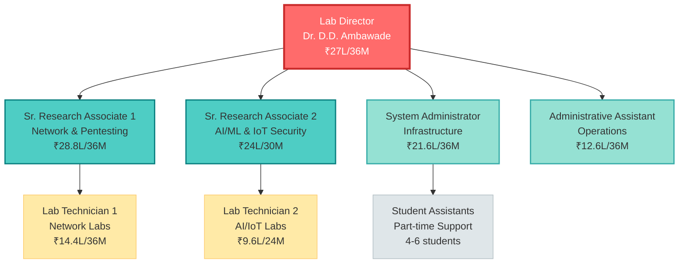

### Personnel Budget Distribution

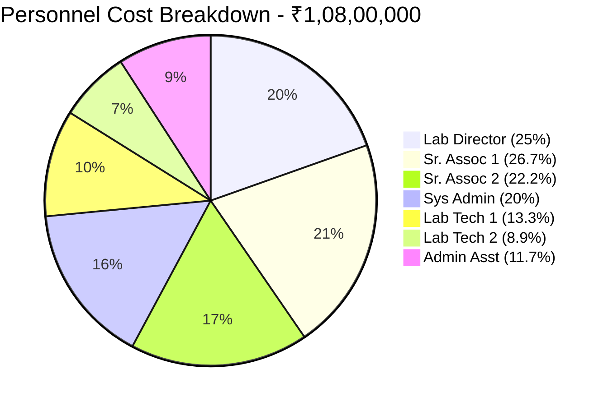

---

## 🔬 Research Focus Areas

### Research Domains Map

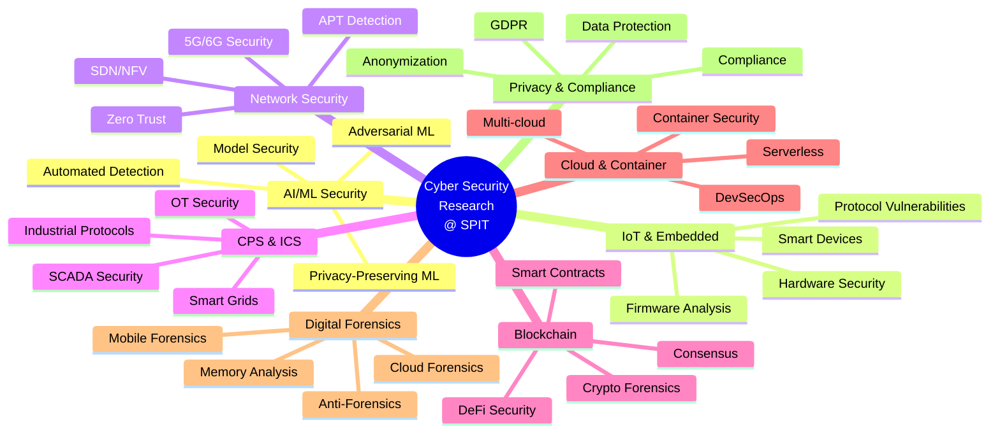

### Research Output Projection

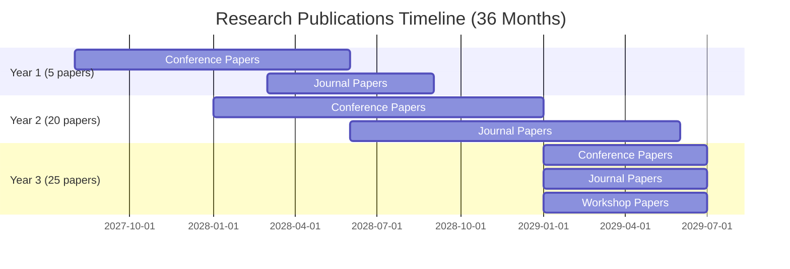

### Publication Target Breakdown

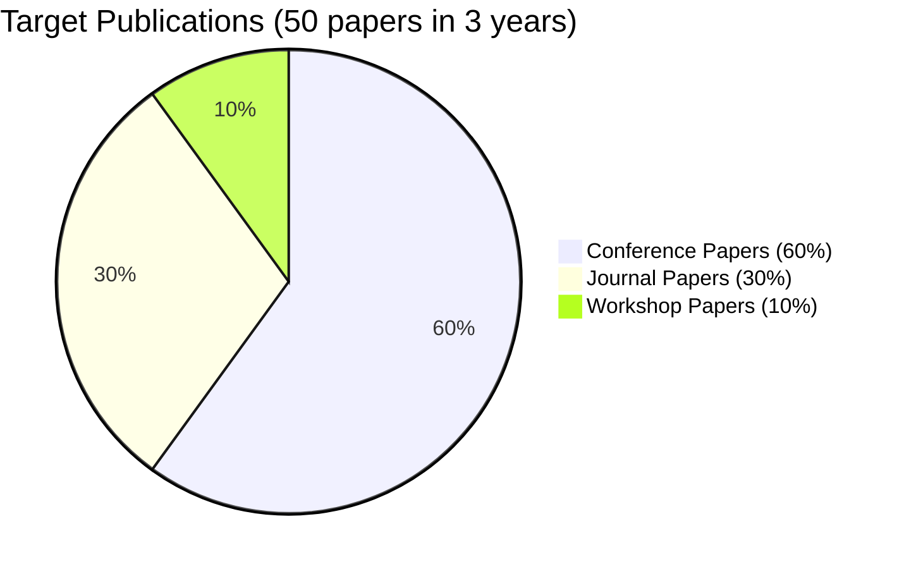

---

## 📈 Growth Projections

### Student Training Growth

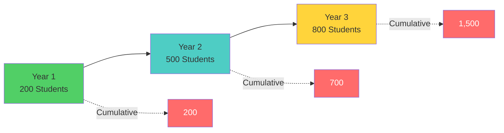

### External Funding Growth

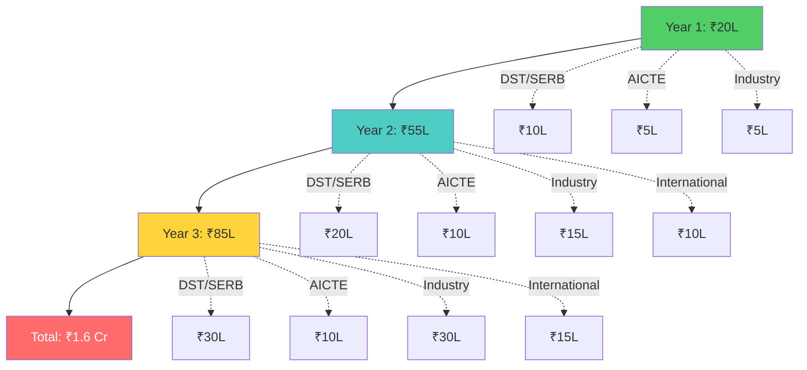

---

## 🎯 Impact Metrics

### Key Performance Indicators

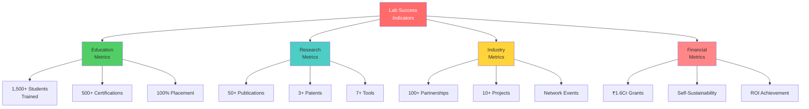

### Success Criteria Dashboard

| **Metric** | **Year 1** | **Year 2** | **Year 3** | **Status** |
|:-----------|:----------:|:----------:|:----------:|:----------:|
| Students Trained | 200 | 500 | 800 | 📊 |
| Research Papers | 5 | 20 | 25 | 📊 |
| Industry Projects | 2 | 5 | 8 | 📊 |
| External Funding | ₹20L | ₹55L | ₹85L | 📊 |
| Certifications | 50 | 150 | 300 | 📊 |
| Patents Filed | 1 | 2 | 2 | 📊 |

---

## 🌐 Ecosystem Integration

### Lab Integration with SPIT Ecosystem

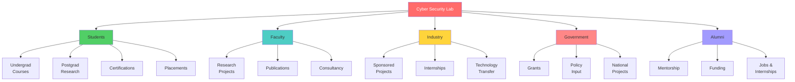

---

## 🔗 Related Documents

- [[00 - Executive Summary|Executive Summary]]
- [[03 - Budget Breakdown|Detailed Budget]]
- [[05 - Implementation Timeline|Full Timeline]]
- [[06 - Research Objectives|Research Plans]]

---

*All visualizations are illustrative and based on the comprehensive proposal documentation.*
