# 🛡 Executive Summary


## 🏛 Institution Details

**Bharatiya Vidya Bhavan's Sardar Patel Institute of Technology (SPIT)**
- **Department**: Electronics & Telecommunication Engineering
- **Location**: Andheri (West), Mumbai - 400058, Maharashtra, India
- **Principal Investigator**: Dr. D. D. Ambawade (IT Incharge & Associate Professor)
- **Proposal Type**: Government Research Funding Initiative

---

## 📋 Project Overview

### Vision Statement
To establish a **world-class, enterprise-grade Cyber Security Research and Training Laboratory** that serves as a hub for cutting-edge research, industry collaboration, and development of next-generation cybersecurity professionals capable of addressing emerging threats in Industry 4.0 and beyond.

### Project Logo

```
╔══════════════════════════════════════════════════════════════╗
║                                                              ║
║          ⚡ SPIT ADVANCED CYBER SECURITY LAB ⚡              ║
║                                                              ║
║         🛡  ████████╗███████╗ ██████╗██╗  ██╗             ║
║            ╚══██╔══╝██╔════╝██╔════╝██║  ██║             ║
║               ██║   █████╗  ██║     ███████║             ║
║               ██║   ██╔══╝  ██║     ██╔══██║             ║
║               ██║   ███████╗╚██████╗██║  ██║             ║
║               ╚═╝   ╚══════╝ ╚═════╝╚═╝  ╚═╝             ║
║                                                              ║
║         SECURING TOMORROW'S DIGITAL INFRASTRUCTURE           ║
║                                                              ║
╚══════════════════════════════════════════════════════════════╝
```

### Mission Objectives

1. ** Education Excellence**: Train 500+ students annually in advanced cybersecurity domains
2. ** Research Innovation**: Conduct cutting-edge research in IoT security, AI-based threat detection, and cyber-physical systems
3. ** Industry Collaboration**: Partner with leading cybersecurity firms and government agencies
4. ** Centre of Excellence**: Establish SPIT as a recognized cybersecurity research hub in Western India
5. ** National Security**: Contribute to India's cybersecurity preparedness and digital sovereignty

---

##  Budget Summary

| **Category** | **Allocation (₹)** | **Percentage** |
|:-------------|-------------------:|---------------:|
| Infrastructure & Hardware | 1,85,00,000 | 46.25% |
| Software & Licensing | 45,00,000 | 11.25% |
| Personnel (36 months) | 1,08,00,000 | 27.00% |
| Office & Facilities | 25,00,000 | 6.25% |
| Training & Certification | 15,00,000 | 3.75% |
| Contingency & Misc. | 22,00,000 | 5.50% |
| **TOTAL** | **4,00,00,000** | **100%** |

---

##  Project Timeline


**Duration**: 36 Months (Mid-2026 to Mid-2029)

---

##  Key Deliverables

### Research Infrastructure
-  50+ High-performance Cyber Security Workstations
-  15+ Vulnerable Physical Systems for Penetration Testing
-  Enterprise-grade Network Security Lab with IDS/IPS
-  Cyber-Physical Systems (CPS) Testbed
-  Industrial Control Systems (ICS) Security Lab
-  IoT Security Research Platform
-  AI/ML Threat Detection Infrastructure with GPU Clusters
-  Digital Forensics Laboratory
-  Malware Analysis & Reverse Engineering Lab
-  Blockchain & Cryptocurrency Security Testbed

### Educational Outcomes
-  20+ Specialized Course Modules
-  500+ Students trained annually
-  Industry-recognized Certifications
-  50+ Research Publications (3 years)
-  100% Placement in Cybersecurity Roles

### Research Contributions
-  10+ Government/Industry Funded Projects
-  3+ Patent Applications
-  National/International Collaborations
- 📖 Open-source Security Tools Development

---

## 🔑 Strategic Importance

### National Priority Alignment
-  Supports **Digital India Initiative**
-  Contributes to **National Cyber Security Policy 2023**
-  Aligns with **NEP 2020** skill development goals
-  Strengthens **Atmanirbhar Bharat** in cybersecurity

### Industry Relevance
-  Addresses critical skills gap (3.5M cybersecurity jobs unfilled globally)
-  Industry 4.0 security requirements
-  Critical infrastructure protection
-  5G/6G security research

### Academic Excellence
-  First comprehensive lab in Mumbai region
-  NAAC/NBA accreditation enhancement
-  International ranking improvement
-  Academic-Industry partnership model

---

##  Impact Metrics

### Quantitative Targets (3 Years)
-  **1,500+** Students Trained
-  **50+** Research Papers Published
-  **100+** Industry Collaborations
-  **500+** Professional Certifications
-  **₹2 Cr+** External Research Grants

### Qualitative Outcomes
-  Establish SPIT as premier cybersecurity education hub
-  Contribute to national security research
-  Develop indigenous security solutions
-  Create a sustainable innovation ecosystem

---

##  Project Leadership

**Principal Investigator**
- **Name**: Dr. D. D. Ambawade
- **Designation**: Associate Professor & IT Incharge
- **Department**: Electronics & Telecommunication Engineering
- **Experience**: 15+ years in Academia & Research

**Co-Investigators & Advisory Board**
- Senior faculty from E&TC, Computer Engineering, IT departments
- Industry experts from leading cybersecurity firms
- Government agency representatives (CERT-In, C-DAC, DRDO)

---

## 🔗 Related Documentation

- [[01 - Introduction and Background|Introduction & Background]]
- [[02 - Infrastructure Specifications|Infrastructure & Hardware Details]]
- [[03 - Budget Breakdown|Detailed Budget Analysis]]
- [[04 - Personnel Requirements|Staffing & Roles]]
- [[05 - Implementation Timeline|Gantt Charts & Milestones]]
- [[06 - Research Objectives|Research Goals & Methodology]]
- [[10 - Appendices|Technical Specifications & Appendices]]

---

##  Approval Status

| **Authority** | **Status** | **Date** | **Remarks** |
|:--------------|:-----------|:---------|:------------|
| Department Head | Pending | - | Awaiting Review |
| Dean (Engineering) | Pending | - | - |
| Principal | Pending | - | - |
| Management Committee | Pending | - | - |
| Funding Agency | Pending | - | - |

---

> **Note**: This proposal represents a strategic investment in India's cybersecurity infrastructure and human capital development. The lab will serve as a catalyst for innovation, research, and industry collaboration, positioning SPIT as a leader in cybersecurity education.

---

*Last Updated: October 2025*
*Version: 1.0*
*Document Classification: Proposal - For Official Use*
---
title: "Introduction and Background"
tags: [introduction, background, rationale, need-analysis]
---

#  Introduction and Background

## 📖 Context and Rationale

### Global Cybersecurity Landscape

The digital transformation of industries, governments, and societies has created an unprecedented demand for robust cybersecurity infrastructure and skilled professionals. Current statistics paint a concerning picture:

####  Key Statistics

| **Metric** | **Value** | **Source** |
|:-----------|:----------|:-----------|
| Global Cybersecurity Market | $173.5 Billion (2022) | Gartner |
| Projected Market (2028) | $266.2 Billion | Markets & Markets |
| Unfilled Cybersecurity Jobs | 3.5 Million Globally | (ISC)² |
| India Cybersecurity Jobs Gap | 500,000+ Positions | NASSCOM |
| Average Cost of Data Breach | ₹17.9 Crores | IBM Security Report |
| Cyber Attacks Growth (YoY) | 38% Increase | Check Point Research |

### India's Cybersecurity Imperative


#### National Priority Areas

1. **🏛 Government Initiatives**
   - National Cyber Security Policy 2023
   - Digital India Mission
   - Smart Cities Project
   - UPI & Financial Digitization

2. ** Industry 4.0 Security**
   - Industrial IoT (IIoT) vulnerabilities
   - Smart Manufacturing security
   - Supply chain protection
   - OT/IT convergence challenges

3. ** Critical Infrastructure Protection**
   - Power sector (smart grids)
   - Transportation systems
   - Healthcare digitization
   - Banking & Finance

4. ** Education & Skills Development**
   - NEP 2020 skill development goals
   - Industry-academia gap
   - Practical hands-on training deficit
   - Research & innovation ecosystem

---

##  Need Analysis

### Current State of Cybersecurity Education in India

#### Challenges Identified

1. **Limited Practical Infrastructure**
   - Most institutions have only basic computer labs
   - Lack of specialized security equipment
   - No cyber-physical systems testbeds
   - Insufficient vulnerable systems for ethical hacking

2. **Theoretical Focus**
   - 80% theory vs 20% practical (industry needs reverse)
   - Limited exposure to real-world attack scenarios
   - Outdated curriculum not aligned with current threats
   - No hands-on experience with enterprise tools

3. **Resource Constraints**
   - High cost of commercial security tools
   - Lack of licensed software and platforms
   - Insufficient faculty training
   - No dedicated cybersecurity labs

4. **Industry Disconnect**
   - Graduates not job-ready
   - Lack of industry-standard certifications
   - No exposure to production environments
   - Limited internship opportunities

### Regional Gap Analysis

#### Mumbai Metropolitan Region

| **Institution** | **Dedicated Cyber Lab** | **Research Focus** | **Industry Tie-ups** | **Student Capacity** |
|:----------------|:-----------------------:|:------------------:|:--------------------:|:--------------------:|
| SPIT (Current) | ❌ | Limited | Moderate | ~100 |
| IIT Bombay |  | Strong | Strong | ~200 |
| VJTI | Partial | Moderate | Limited | ~150 |
| Other Engineering Colleges | ❌ | Minimal | Minimal | ~50 |

**Gap**: Only 1-2 institutions in Mumbai have dedicated advanced cybersecurity labs. SPIT can fill this critical gap for Western suburbs.

---

## 🏛 About SPIT

### Institutional Profile

**Bharatiya Vidya Bhavan's Sardar Patel Institute of Technology**

- **Established**: 1962
- **Type**: Autonomous Institute affiliated to University of Mumbai
- **Accreditation**: 
  - NBA Accredited Programs
  - NAAC 'A' Grade
  - Autonomous Status since 2020
- **Location**: Andheri (West), Mumbai - 400058

#### Key Achievements

-  60+ years of engineering education excellence
-  10,000+ successful alumni in industry
-  Strong industry connections (TCS, Infosys, Accenture, Cisco, etc.)
-  Active research culture with 200+ publications annually
-  Modern infrastructure and facilities

### Department of Electronics & Telecommunication

#### Profile
- **Students**: 240 undergraduates (60 per year)
- **Faculty**: 25+ experienced professors
- **Research Areas**: VLSI, Embedded Systems, Signal Processing, IoT, Cybersecurity
- **Labs**: 12+ specialized laboratories
- **Industry Projects**: 50+ annually

#### Current Infrastructure
-  8 Computer Labs with 400+ workstations
-  Advanced DSP & Communication Labs
- 📡 IoT & Embedded Systems Lab
- 🤖 Robotics & Automation Lab

#### Limitations in Cybersecurity
- ❌ No dedicated cybersecurity lab
- ❌ Limited specialized equipment
- ❌ Basic security tools only
- ❌ No cyber-physical systems testbed
- ❌ Insufficient capacity for research

---

##  Vision for the Cyber Security Lab

### Transformative Objectives

#### 1. **Education Revolution**

```
Traditional Approach          →    Proposed Approach
─────────────────────────────────────────────────────
Theory-heavy lectures         →    Hands-on lab sessions
Simulated environments        →    Real vulnerable systems
Basic tools                   →    Enterprise-grade platforms
Limited exposure              →    Industry-aligned training
Generic training              →    Specialized certifications
```

#### 2. **Research Excellence**

**Focus Areas:**

| **Domain** | **Research Topics** | **Industry Relevance** |
|:-----------|:--------------------|:-----------------------|
| **AI/ML Security** | Adversarial ML, AI-based threat detection | High (Emerging) |
| **IoT Security** | Device firmware analysis, protocol vulnerabilities | Critical (Industry 4.0) |
| **Blockchain** | Smart contract security, cryptocurrency forensics | Growing (FinTech) |
| **CPS Security** | SCADA security, industrial control systems | Critical (Infrastructure) |
| **Cloud Security** | Container security, serverless vulnerabilities | High (Enterprise) |
| **5G/6G Security** | Network slicing, edge computing security | Emerging (Telecom) |

#### 3. **Industry Collaboration Hub**

**Proposed Partnerships:**

-  **Product Companies**: Cisco, Palo Alto Networks, Fortinet, Check Point
-  **Service Providers**: TCS, Wipro, Infosys, Accenture Cyber Services
-  **Government**: CERT-In, C-DAC, DRDO, Police Cyber Cells
-  **Startups**: Cybersecurity startups for innovation projects
-  **International**: Universities abroad for research collaborations

#### 4. **National Impact**

**Expected Contributions:**

1. **Skill Development**: Train 1,500+ cybersecurity professionals in 3 years
2. **Research Output**: 50+ publications, 3+ patents
3. **Industry Projects**: ₹2 Cr+ in external research funding
4. **Policy Contribution**: Inputs to national cybersecurity frameworks
5. **Tool Development**: Open-source security tools for community

---

##  Proposed Lab Capabilities

### Comprehensive Infrastructure

The proposed lab will be a **multi-domain cybersecurity research and training facility** covering:

#### 🛡 Core Labs

1. **Network Security Lab**
   - Enterprise firewalls, IDS/IPS
   - Network traffic analysis
   - VPN and secure communications
   - SD-WAN security

2. **Penetration Testing Lab**
   - 15+ vulnerable physical machines
   - Realistic attack scenarios
   - Red team/Blue team exercises
   - Bug bounty training platform

3. **Cyber-Physical Systems Lab**
   - SCADA systems
   - PLCs and industrial controllers
   - Smart grid simulations
   - ICS/OT security

4. **Malware Analysis & Reverse Engineering**
   - Isolated analysis environments
   - Disassemblers and debuggers
   - Behavior analysis tools
   - Memory forensics

5. **Digital Forensics Lab**
   - Disk imaging and analysis
   - Mobile device forensics
   - Network forensics
   - Cloud forensics tools

6. **IoT Security Lab**
   - 100+ IoT devices
   - Firmware analysis platform
   - Wireless protocol testing
   - Hardware hacking tools

7. **AI/ML Security Lab**
   - GPU clusters for training
   - Adversarial ML platforms
   - AI-based threat detection
   - Automated security testing

8. **Blockchain Security Lab**
   - Private blockchain networks
   - Smart contract analysis
   - Cryptocurrency forensics
   - DeFi security testing

9. **Cloud Security Lab**
   - Multi-cloud environments (AWS, Azure, GCP)
   - Container security
   - Kubernetes security
   - Serverless security

10. **Security Operations Center (SOC) Training Lab**
    - SIEM platforms
    - Threat intelligence feeds
    - Incident response tools
    - 24x7 monitoring simulation

---

##  Expected Outcomes

### Short-term (Year 1)
-  Lab operational with 50+ workstations
-  10+ specialized courses launched
-  200+ students trained
-  3+ industry partnerships established
-  5+ research papers published

### Mid-term (Year 2)
-  500+ students trained
-  15+ research projects initiated
-  ₹50 Lakhs external funding secured
-  First batch of certified professionals
-  20+ publications

### Long-term (Year 3)
-  1,500+ students trained
-  Recognized as Centre of Excellence
-  ₹2 Cr+ external funding
-  50+ publications
-  3+ patents filed
-  National/international recognition

---

##  Unique Value Propositions

### What Sets This Lab Apart

1. ** Comprehensive Coverage**: All cybersecurity domains under one roof
2. **⚡ Real-world Focus**: Actual vulnerable systems, not just simulations
3. **🤖 Emerging Tech**: AI/ML, blockchain, 5G security
4. ** Industry Alignment**: Enterprise-grade tools and certifications
5. ** Research Oriented**: Focus on innovation and publications
6. ** Collaborative**: Open for industry, government, and academic partnerships
7. ** Practical Training**: 70% hands-on, 30% theory
8. ** Certifications**: Industry-recognized credentials (CEH, OSCP, etc.)

---

## 🔗 Related Sections

- [[00 - Executive Summary|Executive Summary]]
- [[02 - Infrastructure Specifications|Infrastructure Details]]
- [[06 - Research Objectives|Research Objectives]]
- [[07 - Educational Framework|Educational Programs]]

---

*This foundation establishes the critical need for a world-class cybersecurity lab at SPIT, positioning it as a strategic investment in India's digital security infrastructure.*
---
title: "Infrastructure and Hardware Specifications"
tags: [infrastructure, hardware, specifications, equipment]
---

#  Infrastructure and Hardware Specifications

## 📐 Lab Layout and Design

### Physical Space Requirements

**Total Area Required**: 3,500 sq. ft. (325 sq. meters)

```
┌─────────────────────────────────────────────────────────────────┐
│                    CYBER SECURITY LAB LAYOUT                    │
│                         (3,500 sq. ft.)                         │
├─────────────────────────────────────────────────────────────────┤
│                                                                 │
│  ┌──────────────┐  ┌──────────────┐  ┌──────────────┐         │
│  │   Network    │  │  Penetration │  │   Digital    │         │
│  │   Security   │  │   Testing    │  │  Forensics   │         │
│  │     Lab      │  │     Lab      │  │     Lab      │         │
│  │  (500 sq.ft) │  │  (500 sq.ft) │  │  (400 sq.ft) │         │
│  └──────────────┘  └──────────────┘  └──────────────┘         │
│                                                                 │
│  ┌──────────────┐  ┌──────────────┐  ┌──────────────┐         │
│  │   AI/ML      │  │     IoT      │  │    CPS/ICS   │         │
│  │   Security   │  │   Security   │  │   Security   │         │
│  │     Lab      │  │     Lab      │  │   Testbed    │         │
│  │  (400 sq.ft) │  │  (350 sq.ft) │  │  (450 sq.ft) │         │
│  └──────────────┘  └──────────────┘  └──────────────┘         │
│                                                                 │
│  ┌──────────────────────────────┐  ┌──────────────┐           │
│  │      Server Room & SOC       │  │   Malware    │           │
│  │       Training Center        │  │   Analysis   │           │
│  │        (600 sq. ft.)         │  │  (300 sq.ft) │           │
│  └──────────────────────────────┘  └──────────────┘           │
│                                                                 │
│  ┌─────────────┐  ┌────────────┐  ┌────────────┐             │
│  │  Conference │  │   Office   │  │  Storage & │             │
│  │    Room     │  │   Space    │  │   Utility  │             │
│  │ (250 sq.ft) │  │(200 sq.ft) │  │(150 sq.ft) │             │
│  └─────────────┘  └────────────┘  └────────────┘             │
│                                                                 │
└─────────────────────────────────────────────────────────────────┘
```

### Lab-wise Distribution

| **Lab Name** | **Area (sq.ft)** | **Capacity** | **Primary Focus** |
|:-------------|:----------------:|:------------:|:------------------|
| Network Security Lab | 500 | 20 students | Firewall, IDS/IPS, Network Analysis |
| Penetration Testing Lab | 500 | 15 students | Ethical Hacking, Vulnerability Assessment |
| Digital Forensics Lab | 400 | 12 students | Incident Response, Evidence Analysis |
| AI/ML Security Lab | 400 | 15 students | Threat Detection, Adversarial ML |
| IoT Security Lab | 350 | 12 students | Device Security, Firmware Analysis |
| CPS/ICS Security Lab | 450 | 10 students | SCADA, Industrial Systems |
| Server Room & SOC | 600 | 8 analysts | Infrastructure, Monitoring |
| Malware Analysis Lab | 300 | 8 students | Reverse Engineering, Sandboxing |
| Conference Room | 250 | 30 people | Meetings, Presentations |
| Office Space | 200 | 6 staff | Administrative, Faculty |
| Storage & Utility | 150 | - | Equipment, Maintenance |

---

##  Workstation Specifications

### Category A: High-Performance Security Workstations (30 Units)

**Purpose**: Malware analysis, reverse engineering, AI/ML training, penetration testing

| **Component** | **Specification** | **Unit Cost (₹)** |
|:--------------|:------------------|------------------:|
| **Processor** | Intel Core i9-13900K (24-core) / AMD Ryzen 9 7950X | 45,000 |
| **RAM** | 64GB DDR5-5600MHz (Upgradable to 128GB) | 28,000 |
| **GPU** | NVIDIA RTX 4070 Ti 12GB (for AI/ML workloads) | 75,000 |
| **Storage (Primary)** | 2TB NVMe Gen4 SSD | 18,000 |
| **Storage (Secondary)** | 4TB SATA SSD | 22,000 |
| **Motherboard** | High-end ATX with multiple PCIe slots | 22,000 |
| **PSU** | 850W 80+ Platinum Modular | 12,000 |
| **Case** | Full Tower with good airflow | 8,000 |
| **Cooling** | AIO Liquid Cooler 360mm | 15,000 |
| **Network** | 10GbE Network Card | 12,000 |
| **Monitor (Primary)** | 32" 4K IPS (Dell UltraSharp / LG) | 45,000 |
| **Monitor (Secondary)** | 27" QHD IPS | 25,000 |
| **Peripherals** | Mechanical Keyboard + Gaming Mouse | 8,000 |
| **OS** | Windows 11 Pro + Ubuntu Linux (Dual Boot) | 18,000 |
| **UPS** | 2KVA Line Interactive UPS | 15,000 |
| **Assembly & Testing** | - | 5,000 |
| **TOTAL PER UNIT** | | **₹3,73,000** |
| **Total for 30 Units** | | **₹1,11,90,000** |

### Category B: Standard Security Workstations (25 Units)

**Purpose**: General security analysis, network monitoring, forensics

| **Component** | **Specification** | **Unit Cost (₹)** |
|:--------------|:------------------|------------------:|
| **Processor** | Intel Core i7-13700 / AMD Ryzen 7 7700X | 32,000 |
| **RAM** | 32GB DDR5-5200MHz | 15,000 |
| **GPU** | NVIDIA RTX 4060 8GB | 35,000 |
| **Storage (Primary)** | 1TB NVMe Gen4 SSD | 10,000 |
| **Storage (Secondary)** | 2TB SATA SSD | 12,000 |
| **Motherboard** | Mid-range ATX | 15,000 |
| **PSU** | 650W 80+ Gold | 8,000 |
| **Case** | Mid Tower | 5,000 |
| **Cooling** | Tower Air Cooler | 5,000 |
| **Network** | 2.5GbE Onboard | - |
| **Monitor** | 27" QHD IPS | 25,000 |
| **Peripherals** | Keyboard + Mouse Combo | 4,000 |
| **OS** | Windows 11 Pro | 18,000 |
| **UPS** | 1KVA UPS | 8,000 |
| **Assembly & Testing** | - | 3,000 |
| **TOTAL PER UNIT** | | **₹1,95,000** |
| **Total for 25 Units** | | **₹48,75,000** |

---

##  Specialized Hardware

### 1. GPU Cluster for AI/ML Security Research

| **Item** | **Specification** | **Qty** | **Unit Cost (₹)** | **Total (₹)** |
|:---------|:------------------|:-------:|------------------:|--------------:|
| GPU Server Nodes | Dual NVIDIA A100 40GB / H100 80GB | 2 | 25,00,000 | 50,00,000 |
| Training Workstations | 4x RTX 4090 24GB Multi-GPU Setup | 2 | 8,00,000 | 16,00,000 |
| High-Speed Interconnect | InfiniBand HDR 200Gb/s Switches | 1 | 5,00,000 | 5,00,000 |
| Shared Storage | 100TB NVMe Storage Array | 1 | 12,00,000 | 12,00,000 |
| **Subtotal** | | | | **₹83,00,000** |

### 2. Vulnerable Physical Machines (Penetration Testing Lab)

| **Category** | **Description** | **Qty** | **Unit Cost (₹)** | **Total (₹)** |
|:-------------|:----------------|:-------:|------------------:|--------------:|
| Retired Enterprise Servers | Dell/HP Gen8-Gen10 Servers | 5 | 25,000 | 1,25,000 |
| Legacy Windows Systems | Windows 7/8/10 Systems (unpatched) | 8 | 15,000 | 1,20,000 |
| Legacy Linux Systems | Ubuntu/CentOS (various versions) | 5 | 18,000 | 90,000 |
| Vulnerable IoT Devices | Smart home devices, IP cameras, routers | 20 | 5,000 | 1,00,000 |
| Vulnerable Web Servers | DVWA, WebGoat physical setups | 3 | 35,000 | 1,05,000 |
| Android Devices | Old Android phones for mobile pentesting | 10 | 8,000 | 80,000 |
| Industrial Controllers | Refurbished PLCs, RTUs | 4 | 45,000 | 1,80,000 |
| **Subtotal** | | | | **₹8,00,000** |

### 3. Network Security Infrastructure

| **Item** | **Specification** | **Qty** | **Unit Cost (₹)** | **Total (₹)** |
|:---------|:------------------|:-------:|------------------:|--------------:|
| Enterprise Firewall | Palo Alto PA-850 / Fortinet FortiGate 200F | 2 | 6,50,000 | 13,00,000 |
| IDS/IPS System | Cisco Firepower 2130 / Suricata on Hardware | 2 | 5,00,000 | 10,00,000 |
| Core Switches | Cisco Catalyst 9300 48-port (10G uplinks) | 3 | 3,50,000 | 10,50,000 |
| Access Switches | Cisco SG350-52 Managed Gigabit | 6 | 65,000 | 3,90,000 |
| Wireless Controllers | Cisco Wireless Controller 9800 | 1 | 4,50,000 | 4,50,000 |
| Access Points | Cisco Catalyst 9130AXI (WiFi 6E) | 8 | 85,000 | 6,80,000 |
| Network Tap Devices | Gigamon GigaVUE-TA25 | 3 | 2,50,000 | 7,50,000 |
| Packet Brokers | IXIA Vision ONE | 1 | 8,00,000 | 8,00,000 |
| Load Balancer | F5 BIG-IP i2600 | 1 | 7,00,000 | 7,00,000 |
| VPN Concentrators | Cisco ASA 5516-X | 2 | 2,50,000 | 5,00,000 |
| **Subtotal** | | | | **₹76,20,000** |

### 4. Server Infrastructure

| **Item** | **Specification** | **Qty** | **Unit Cost (₹)** | **Total (₹)** |
|:---------|:------------------|:-------:|------------------:|--------------:|
| Hypervisor Servers | Dell PowerEdge R750 (2x Xeon Gold, 512GB RAM) | 4 | 8,50,000 | 34,00,000 |
| Storage Servers | Dell PowerEdge R740xd (24x 4TB drives, RAID) | 2 | 9,00,000 | 18,00,000 |
| Database Server | HP ProLiant DL380 Gen10 (high memory) | 1 | 7,50,000 | 7,50,000 |
| SIEM Server | Dell R650 (optimized for log management) | 2 | 6,50,000 | 13,00,000 |
| Backup Server | Synology RackStation RS4021xs+ (96TB usable) | 1 | 5,00,000 | 5,00,000 |
| 42U Server Rack | APC NetShelter SX with cable management | 3 | 1,50,000 | 4,50,000 |
| KVM Switch | 16-port IP KVM | 2 | 75,000 | 1,50,000 |
| **Subtotal** | | | | **₹83,50,000** |

### 5. Cyber-Physical Systems (CPS) Lab Equipment

| **Item** | **Specification** | **Qty** | **Unit Cost (₹)** | **Total (₹)** |
|:---------|:------------------|:-------:|------------------:|--------------:|
| SCADA System | Wonderware System Platform | 1 | 12,00,000 | 12,00,000 |
| PLC Systems | Siemens S7-1500 Series | 5 | 1,20,000 | 6,00,000 |
| HMI Panels | Industrial Touch Panels (10-15") | 5 | 85,000 | 4,25,000 |
| RTU Devices | Remote Terminal Units | 4 | 95,000 | 3,80,000 |
| Industrial Switches | Ruggedized Ethernet Switches | 4 | 65,000 | 2,60,000 |
| Smart Grid Simulator | OPAL-RT ePHASORsim | 1 | 18,00,000 | 18,00,000 |
| Modbus Devices | Various Modbus TCP/RTU devices | 10 | 25,000 | 2,50,000 |
| Industrial Protocols | DNP3, IEC 61850 test equipment | 1 set | 5,00,000 | 5,00,000 |
| **Subtotal** | | | | **₹54,15,000** |

### 6. IoT Security Lab Equipment

| **Item** | **Specification** | **Qty** | **Unit Cost (₹)** | **Total (₹)** |
|:---------|:------------------|:-------:|------------------:|--------------:|
| IoT Development Boards | Raspberry Pi, Arduino, ESP32 (variety) | 50 | 3,500 | 1,75,000 |
| Smart Home Devices | Cameras, locks, sensors, hubs | 30 | 8,000 | 2,40,000 |
| Wireless Protocol Analyzers | HackRF One, YARD Stick One | 8 | 35,000 | 2,80,000 |
| Logic Analyzers | Saleae Logic Pro 16 | 4 | 65,000 | 2,60,000 |
| Oscilloscopes | Rigol DS1054Z Digital Oscilloscope | 4 | 45,000 | 1,80,000 |
| JTAG/SWD Debuggers | Segger J-Link Plus | 6 | 35,000 | 2,10,000 |
| Chip-off Tools | IR Rework Station, BGA Equipment | 2 | 1,50,000 | 3,00,000 |
| Firmware Extraction Tools | FlashCat USB Programmer | 4 | 25,000 | 1,00,000 |
| **Subtotal** | | | | **₹17,45,000** |

### 7. Digital Forensics Lab Equipment

| **Item** | **Specification** | **Qty** | **Unit Cost (₹)** | **Total (₹)** |
|:---------|:------------------|:-------:|------------------:|--------------:|
| Forensic Workstations | High-end with write blockers | 4 | 3,50,000 | 14,00,000 |
| Write Blockers | Tableau TX1, UltraBlock USB | 6 | 45,000 | 2,70,000 |
| Disk Duplicators | Intelligent disk cloning systems | 3 | 1,20,000 | 3,60,000 |
| Mobile Forensics Kit | Cellebrite UFED Premium | 2 | 10,00,000 | 20,00,000 |
| Faraday Bags/Boxes | Signal blocking evidence bags | 20 | 5,000 | 1,00,000 |
| SIM Card Readers | Multi-SIM readers | 6 | 15,000 | 90,000 |
| Memory Card Readers | Professional CF/SD readers | 8 | 8,000 | 64,000 |
| Evidence Storage | Secure lockers and cabinets | 4 | 35,000 | 1,40,000 |
| **Subtotal** | | | | **₹44,24,000** |

### 8. Monitors and Display Systems

| **Item** | **Specification** | **Qty** | **Unit Cost (₹)** | **Total (₹)** |
|:---------|:------------------|:-------:|------------------:|--------------:|
| Video Wall (SOC) | 3x3 55" LCD Video Wall (LG/Samsung) | 9 | 85,000 | 7,65,000 |
| Video Wall Controller | Datapath VSN1172 | 1 | 2,50,000 | 2,50,000 |
| Large Displays | 75" 4K Interactive Display | 3 | 1,25,000 | 3,75,000 |
| Projector System | 4K Short-throw Projector + Screen | 1 | 2,00,000 | 2,00,000 |
| Monitor Arms | Ergonomic dual monitor arms | 30 | 8,000 | 2,40,000 |
| **Subtotal** | | | | **₹18,30,000** |

---

##  Office and Facilities Infrastructure

| **Category** | **Item** | **Qty** | **Unit Cost (₹)** | **Total (₹)** |
|:-------------|:---------|:-------:|------------------:|--------------:|
| **Furniture** | Ergonomic chairs | 60 | 15,000 | 9,00,000 |
| | Workstation desks | 55 | 12,000 | 6,60,000 |
| | Server racks with accessories | 3 | 1,50,000 | 4,50,000 |
| | Conference table (20-seater) | 1 | 1,20,000 | 1,20,000 |
| | Office desks and cabinets | 10 | 25,000 | 2,50,000 |
| **HVAC** | Precision AC for server room (5 ton) | 2 | 2,50,000 | 5,00,000 |
| | Split ACs for lab spaces (2 ton) | 8 | 75,000 | 6,00,000 |
| **Power** | 150 KVA Diesel Generator | 1 | 12,00,000 | 12,00,000 |
| | UPS Systems (20 KVA) | 3 | 4,50,000 | 13,50,000 |
| | PDUs and Power Distribution | 15 | 25,000 | 3,75,000 |
| **Electrical** | Complete electrical installation | 1 | 8,00,000 | 8,00,000 |
| **Fire Safety** | FM-200 fire suppression system | 1 | 5,00,000 | 5,00,000 |
| | Fire extinguishers and alarms | 1 set | 1,50,000 | 1,50,000 |
| **Access Control** | Biometric access control system | 1 | 3,00,000 | 3,00,000 |
| | CCTV surveillance (20 cameras) | 1 set | 4,00,000 | 4,00,000 |
| **Flooring** | Raised flooring for server room | 600 sq ft | 1,500/sq ft | 9,00,000 |
| **Interior** | False ceiling, lighting, painting | 3500 sq ft | 800/sq ft | 28,00,000 |
| **Signage** | Lab signage and wayfinding | 1 set | 1,50,000 | 1,50,000 |
| **TOTAL** | | | | **₹1,25,05,000** |

---

##  Hardware Budget Summary

```mermaid
pie title Hardware Budget Distribution (₹5,00,54,000)
    "Workstations (Cat A+B)" : 16065
    "GPU Cluster" : 8300
    "Network Infrastructure" : 7620
    "Server Infrastructure" : 8350
    "CPS Lab Equipment" : 5415
    "Digital Forensics" : 4424
    "IoT Lab Equipment" : 1745
    "Vulnerable Machines" : 800
    "Monitors & Displays" : 1830
    "Office & Facilities" : 12505
```



| **Category** | **Amount (₹)** | **Percentage** |
|:-------------|---------------:|---------------:|
| Workstations (Category A+B) | 1,60,65,000 | 32.1% |
| GPU Cluster for AI/ML | 83,00,000 | 16.6% |
| Network Infrastructure | 76,20,000 | 15.2% |
| Server Infrastructure | 83,50,000 | 16.7% |
| CPS Lab Equipment | 54,15,000 | 10.8% |
| Digital Forensics Equipment | 44,24,000 | 8.8% |
| IoT Lab Equipment | 17,45,000 | 3.5% |
| Vulnerable Physical Machines | 8,00,000 | 1.6% |
| Monitors & Display Systems | 18,30,000 | 3.7% |
| Office & Facilities | 1,25,05,000 | 25.0% |
| **Subtotal (Before Software)** | **5,70,54,000** | |
| **Buffer for price fluctuations (5%)** | **28,52,700** | |
| **TOTAL HARDWARE BUDGET** | **5,99,06,700** | |

> **Note**: This exceeds the ₹1,85,00,000 allocation. We'll optimize in the comprehensive budget section.

---

## 🔗 Related Documents

- [[00 - Executive Summary|Executive Summary]]
- [[03 - Budget Breakdown|Budget Breakdown & Cost Optimization]]
- [[05 - Implementation Timeline|Implementation Timeline]]

---

*Detailed technical specifications and vendor quotes available in [[10 - Appendices|Appendices]]*
---
title: "Comprehensive Budget Breakdown"
tags: [budget, costing, financial, allocation]
---

#  Comprehensive Budget Breakdown

##  Overall Budget Allocation (₹4,00,00,000)


---

## 1⃣ Infrastructure & Hardware Budget (₹1,85,00,000)

### Optimized Hardware Allocation

| **Category** | **Original Estimate** | **Optimized Budget** | **Strategy** |
|:-------------|----------------------:|---------------------:|:-------------|
| Workstations | ₹1,60,65,000 | ₹75,00,000 | Phased procurement, reduce qty |
| Network Infrastructure | ₹76,20,000 | ₹35,00,000 | Mix of enterprise & prosumer gear |
| Server Infrastructure | ₹83,50,000 | ₹30,00,000 | Cloud-hybrid approach |
| GPU Cluster | ₹83,00,000 | ₹15,00,000 | Start small, expand via grants |
| CPS Lab Equipment | ₹54,15,000 | ₹10,00,000 | Simulators + selective hardware |
| Digital Forensics | ₹44,24,000 | ₹8,00,000 | Essential tools first, expand later |
| IoT Lab Equipment | ₹17,45,000 | ₹5,00,000 | Community + grant-funded devices |
| Vulnerable Machines | ₹8,00,000 | ₹3,00,000 | Refurbished + donated equipment |
| Displays & Monitors | ₹18,30,000 | ₹4,00,000 | Standard commercial displays |
| **TOTAL** | ₹5,45,49,000 | **₹1,85,00,000** | |

### Detailed Hardware Breakdown (Optimized)

#### A. Workstations (₹75,00,000)

| **Type** | **Specs** | **Qty** | **Unit Cost** | **Total** |
|:---------|:----------|:-------:|:-------------:|----------:|
| High-Performance (Tier 1) | i7-13700K, 32GB, RTX 4060, 2TB SSD | 15 | ₹2,00,000 | ₹30,00,000 |
| Standard Security (Tier 2) | i5-13400, 16GB, GTX 1650, 1TB SSD | 25 | ₹1,20,000 | ₹30,00,000 |
| Basic Lab (Tier 3) | i3-13100, 16GB, Integrated, 512GB SSD | 20 | ₹60,000 | ₹12,00,000 |
| Monitors (27" QHD) | - | 60 | ₹20,000 | ₹12,00,000 |
| Peripherals & UPS | Keyboards, mice, UPS units | 60 | ₹10,000 | ₹6,00,000 |
| **Subtotal** | | **60** | | **₹90,00,000** |
| *Reduced to fit budget* | | | | **₹75,00,000** |

#### B. Network Infrastructure (₹35,00,000)

| **Item** | **Specification** | **Qty** | **Cost** |
|:---------|:------------------|:-------:|----------:|
| Enterprise Firewall | FortiGate 100F / Sophos XG 230 | 2 | ₹8,00,000 |
| Managed Core Switch | 48-port Gigabit L3 with 10G uplinks | 2 | ₹6,00,000 |
| Access Switches | 24-port Gigabit managed | 6 | ₹3,00,000 |
| Wireless System | Controller + 8 APs (WiFi 6) | 1 set | ₹5,00,000 |
| IDS/IPS | Open-source on dedicated hardware | 2 | ₹4,00,000 |
| Network Monitoring | Packet capture & analysis tools | 2 | ₹3,00,000 |
| Cabling & Infrastructure | Cat6A cabling, patch panels, racks | 1 set | ₹6,00,000 |
| **TOTAL** | | | **₹35,00,000** |

#### C. Server Infrastructure (₹30,00,000)

| **Item** | **Specification** | **Qty** | **Cost** |
|:---------|:------------------|:-------:|----------:|
| Hypervisor Servers | Dell R650 (Xeon Silver, 256GB RAM) | 3 | ₹18,00,000 |
| Storage Server | 48TB usable RAID10 | 1 | ₹6,00,000 |
| Backup Solution | NAS with 24TB capacity | 1 | ₹2,50,000 |
| Server Racks | 42U racks with PDUs | 2 | ₹2,50,000 |
| KVM & Management | IP KVM switches | 1 | ₹1,00,000 |
| **TOTAL** | | | **₹30,00,000** |

#### D. GPU Cluster for AI/ML (₹15,00,000)

| **Item** | **Specification** | **Qty** | **Cost** |
|:---------|:------------------|:-------:|----------:|
| GPU Workstations | 2x RTX 4090 per system | 2 | ₹10,00,000 |
| Storage for ML | 20TB NVMe SSD array | 1 | ₹3,00,000 |
| Networking | 10GbE switches for cluster | 1 | ₹2,00,000 |
| **TOTAL** | | | **₹15,00,000** |

#### E. Cyber-Physical Systems Lab (₹10,00,000)

| **Item** | **Specification** | **Qty** | **Cost** |
|:---------|:------------------|:-------:|----------:|
| PLC Training Kits | Siemens/Allen-Bradley starter kits | 4 | ₹4,00,000 |
| SCADA Software | Academic licenses | 2 | ₹2,00,000 |
| HMI Panels | 10" industrial touchscreens | 4 | ₹2,00,000 |
| Simulation Software | Factory I/O, MATLAB Simulink | - | ₹2,00,000 |
| **TOTAL** | | | **₹10,00,000** |

#### F. Digital Forensics Lab (₹8,00,000)

| **Item** | **Specification** | **Qty** | **Cost** |
|:---------|:------------------|:-------:|----------:|
| Forensic Workstations | High-spec with write blockers | 3 | ₹4,50,000 |
| Write Blockers | USB/SATA write blockers | 6 | ₹1,50,000 |
| Mobile Forensics | Mid-tier extraction tools | 1 | ₹1,50,000 |
| Evidence Storage | Secure cabinets and bags | - | ₹50,000 |
| **TOTAL** | | | **₹8,00,000** |

#### G. IoT Security Lab (₹5,00,000)

| **Item** | **Specification** | **Qty** | **Cost** |
|:---------|:------------------|:-------:|----------:|
| Dev Boards | Raspberry Pi, Arduino, ESP32 | 50 | ₹1,50,000 |
| IoT Devices | Smart devices for testing | 25 | ₹1,50,000 |
| Analysis Tools | Logic analyzers, oscilloscopes | 4 | ₹1,50,000 |
| Wireless Tools | SDR dongles, WiFi adapters | 10 | ₹50,000 |
| **TOTAL** | | | **₹5,00,000** |

#### H. Vulnerable Systems & Misc (₹7,00,000)

| **Item** | **Description** | **Cost** |
|:---------|:----------------|----------:|
| Vulnerable Machines | Refurbished servers & workstations | ₹3,00,000 |
| Display Systems | Projector, large displays | ₹2,00,000 |
| Lab Furniture | Workbenches, stools | ₹2,00,000 |
| **TOTAL** | | **₹7,00,000** |

---

## 2⃣ Software & Licensing Budget (₹45,00,000)

### Commercial Software & Platforms

| **Category** | **Software/Platform** | **Type** | **Cost (3 years)** |
|:-------------|:----------------------|:---------|-------------------:|
| **Operating Systems** | Windows 11 Pro (60 licenses) | License | ₹10,80,000 |
| | Windows Server 2022 (5 licenses) | License | ₹5,00,000 |
| | RHEL/SUSE Enterprise (10 licenses) | Subscription | ₹3,00,000 |
| **Security Tools** | Burp Suite Professional (15 licenses) | Annual | ₹6,75,000 |
| | Metasploit Pro (5 licenses) | Annual | ₹7,50,000 |
| | Nessus Professional (10 scanners) | Annual | ₹4,50,000 |
| | Wireshark Enterprise (optional) | Donation | ₹0 |
| **Forensics** | EnCase Forensic (3 licenses) | Perpetual | ₹15,00,000 |
| | X-Ways Forensics (5 licenses) | Perpetual | ₹5,00,000 |
| | Autopsy (Open Source) | Free | ₹0 |
| **Malware Analysis** | IDA Pro (5 licenses) | Perpetual | ₹12,50,000 |
| | Ghidra (Open Source) | Free | ₹0 |
| **SIEM & SOC** | Splunk Enterprise (100GB/day) | Annual | ₹9,00,000 |
| | ELK Stack (Self-hosted) | Free | ₹0 |
| **Virtualization** | VMware vSphere Essentials Plus | License | ₹6,00,000 |
| | Proxmox VE (Open Source) | Free | ₹0 |
| **Network Security** | Palo Alto/Fortinet licenses | Annual | ₹8,00,000 |
| **Cloud Platforms** | AWS/Azure Education Credits | Credits | ₹5,00,000 |
| **Training Platforms** | Hack The Box Enterprise | Annual | ₹4,50,000 |
| | TryHackMe Business | Annual | ₹2,25,000 |
| **Development** | GitHub Enterprise | Annual | ₹2,70,000 |
| | JetBrains All Products Pack | Annual | ₹3,00,000 |
| **AI/ML Tools** | NVIDIA AI Enterprise | Annual | ₹6,00,000 |
| | TensorFlow/PyTorch (Open Source) | Free | ₹0 |
| **Contingency** | Updates, new tools | Buffer | ₹5,00,000 |
| **TOTAL** | | | **₹1,22,50,000** |
| **Optimized via Academic Pricing** | | | **₹45,00,000** |

> **Note**: Many tools offer 60-80% academic discounts. Open-source alternatives will be prioritized where feasible.

---

## 3⃣ Personnel Budget (₹1,08,00,000 for 36 months)

### Staff Requirements and Salary Breakdown

| **Position** | **Qty** | **Monthly (₹)** | **Annual (₹)** | **36 Months (₹)** |
|:-------------|:-------:|:---------------:|:--------------:|------------------:|
| **Lab Director** (Professor level) | 1 | 1,50,000 | 18,00,000 | 54,00,000 |
| **Senior Research Associate** | 2 | 80,000 | 19,20,000 | 57,60,000 |
| **Lab Technicians** | 2 | 40,000 | 9,60,000 | 28,80,000 |
| **System Administrator** | 1 | 60,000 | 7,20,000 | 21,60,000 |
| **Administrative Assistant** | 1 | 35,000 | 4,20,000 | 12,60,000 |
| **TOTAL** | **7** | **4,85,000** | **58,20,000** | **₹1,74,60,000** |
| **Optimized (part-time/phased)** | | | | **₹1,08,00,000** |

### Personnel Details

#### 1. Lab Director (₹54,00,000 / 36 months)
- **Role**: Overall lab management, research leadership
- **Qualifications**: Ph.D. in Cybersecurity/related field, 10+ years experience
- **Responsibilities**:
  - Strategic planning and vision
  - Research project oversight
  - Industry liaison and fundraising
  - Faculty coordination
  - Publication and IP management

#### 2. Senior Research Associates (2 × ₹28,80,000 = ₹57,60,000)
- **Role**: Specialized research and lab management
- **Qualifications**: M.Tech/Ph.D. with 5+ years in cybersecurity
- **Areas**: 
  - Associate 1: Network Security, Penetration Testing
  - Associate 2: AI/ML Security, IoT Security
- **Responsibilities**:
  - Conduct research projects
  - Guide student projects
  - Develop course modules
  - Manage specific lab sections
  - Industry project coordination

#### 3. Lab Technicians (2 × ₹14,40,000 = ₹28,80,000)
- **Role**: Day-to-day lab operations and maintenance
- **Qualifications**: B.E./B.Tech with relevant certifications (CEH, CCNA, etc.)
- **Responsibilities**:
  - Equipment maintenance
  - Lab setup for classes
  - Student assistance
  - Inventory management
  - Basic troubleshooting

#### 4. System Administrator (₹21,60,000)
- **Role**: IT infrastructure management
- **Qualifications**: B.E. + RHCE/MCSE + 3 years experience
- **Responsibilities**:
  - Server and network management
  - Security patching and updates
  - Backup and disaster recovery
  - User account management
  - Performance monitoring

#### 5. Administrative Assistant (₹12,60,000)
- **Role**: Administrative and coordination support
- **Qualifications**: Graduate with office management experience
- **Responsibilities**:
  - Scheduling and coordination
  - Documentation and reporting
  - Visitor management
  - Procurement support
  - Event organization

### Optimization Strategy
- Lab Director: 50% allocation (shared with teaching duties)
- Senior Associates: 1 full-time, 1 part-time initially
- Technicians: Phase 1 (1), Phase 2 (add 1 more)
- Consolidated roles where feasible

---

## 4⃣ Office & Facilities Budget (₹25,00,000)

| **Category** | **Item/Work** | **Quantity** | **Cost (₹)** |
|:-------------|:--------------|:------------:|-------------:|
| **Civil Work** | False ceiling (3500 sq ft) | - | ₹10,00,000 |
| | Electrical wiring & fixtures | - | ₹5,00,000 |
| | Flooring (raised floor for server room) | 600 sq ft | ₹3,00,000 |
| | Partitions and doors | - | ₹2,00,000 |
| **HVAC** | Precision AC (server room) | 1 | ₹2,50,000 |
| | Split ACs (lab spaces) | 6 | ₹4,50,000 |
| **Power Backup** | 100 KVA Generator | 1 | ₹8,00,000 |
| | UPS Systems (10 KVA) | 3 | ₹6,00,000 |
| **Safety** | Fire suppression system | 1 | ₹3,00,000 |
| | Fire extinguishers | 12 | ₹60,000 |
| **Access Control** | Biometric system | 1 | ₹2,00,000 |
| | CCTV (12 cameras) | 1 set | ₹2,40,000 |
| **Furniture** | Workstation desks | 60 | ₹6,00,000 |
| | Ergonomic chairs | 60 | ₹6,00,000 |
| | Storage cabinets | 15 | ₹1,50,000 |
| | Conference furniture | 1 set | ₹1,50,000 |
| **Signage** | Lab signage and branding | 1 set | ₹1,00,000 |
| **TOTAL** | | | **₹65,00,000** |
| **Optimized** | | | **₹25,00,000** |

### Optimization: Phased civil work, utilize existing infrastructure where possible

---

## 5⃣ Training & Certification Budget (₹15,00,000)

| **Purpose** | **Details** | **Cost (₹)** |
|:------------|:------------|-------------:|
| **Faculty Training** | CEH, OSCP, CISSP for 5 faculty | ₹5,00,000 |
| **Industry Workshops** | Guest lectures, workshops (12/year) | ₹3,00,000 |
| **Conference Attendance** | 3 international, 5 national (3 years) | ₹4,00,000 |
| **Student Certifications** | Subsidized certs for top performers | ₹2,00,000 |
| **Online Learning** | Coursera, Udemy, Pluralsight subscriptions | ₹1,00,000 |
| **TOTAL** | | **₹15,00,000** |

---

## 6⃣ Contingency & Miscellaneous (₹22,00,000)

| **Category** | **Purpose** | **Allocation (₹)** |
|:-------------|:------------|-------------------:|
| **Equipment Repair** | Annual maintenance, replacements | ₹5,00,000 |
| **Software Updates** | Annual renewals, new tools | ₹4,00,000 |
| **Consumables** | Cables, peripherals, stationery | ₹2,00,000 |
| **Travel** | Industry visits, collaborations | ₹3,00,000 |
| **Publications** | Paper processing, open access fees | ₹2,00,000 |
| **Marketing** | Brochures, website, promotional | ₹1,00,000 |
| **Utilities** | Electricity, internet (36 months) | ₹3,00,000 |
| **Contingency Buffer** | Unforeseen expenses | ₹2,00,000 |
| **TOTAL** | | **₹22,00,000** |

---

##  Budget Summary & Allocation Timeline

### Total Budget: ₹4,00,00,000


### Year-wise Breakdown

| **Year** | **Infrastructure** | **Personnel** | **Software** | **Other** | **Total** |
|:---------|-------------------:|--------------:|-------------:|----------:|----------:|
| Year 1 | ₹1,40,00,000 | ₹36,00,000 | ₹20,00,000 | ₹8,00,000 | ₹2,04,00,000 |
| Year 2 | ₹25,00,000 | ₹36,00,000 | ₹15,00,000 | ₹20,00,000 | ₹96,00,000 |
| Year 3 | ₹20,00,000 | ₹36,00,000 | ₹10,00,000 | ₹34,00,000 | ₹1,00,00,000 |
| **Total** | **₹1,85,00,000** | **₹1,08,00,000** | **₹45,00,000** | **₹62,00,000** | **₹4,00,00,000** |

---

##  Cost Optimization Strategies

### 1. Academic & Non-Profit Discounts
- Target 60-80% discount on commercial software
- Negotiate bulk licensing deals
- Leverage university partnerships

### 2. Open Source Alternatives
- Prioritize FOSS tools where viable
- Contribute back to open-source community
- Build custom tools for unique needs

### 3. Phased Procurement
- Year 1: Essential infrastructure (60%)
- Year 2: Specialized equipment (25%)
- Year 3: Expansion & upgrades (15%)

### 4. Industry Partnerships
- Equipment donations from corporates
- Sponsored software licenses
- Intern hiring to reduce personnel costs

### 5. Grant Funding
- Apply for DST, DBT, AICTE grants
- Seek industry-sponsored research projects
- Target international collaborations

### 6. Cloud-Hybrid Approach
- Use cloud for burst capacity
- Negotiate education credits (AWS, Azure, GCP)
- Minimize on-premise infrastructure

---

## 🔗 Related Documents

- [[00 - Executive Summary|Executive Summary]]
- [[02 - Infrastructure Specifications|Infrastructure Details]]
- [[04 - Personnel Requirements|Personnel & Staffing]]
- [[05 - Implementation Timeline|Timeline & Milestones]]

---

*All costs are estimates as of October 2025. Final procurement will be subject to tender process and vendor negotiations.*
---
title: "Personnel Requirements and Organizational Structure"
tags: [personnel, staffing, organization, roles]
---

#  Personnel Requirements and Organizational Structure

##  Organizational Hierarchy


---

## 📋 Detailed Role Descriptions

### 1. Lab Director

**Position**: Lab Director & Principal Investigator  
**Current Designation**: Associate Professor & IT Incharge  
**Name**: Dr. D. D. Ambawade  
**Allocation**: 50% (Shared with teaching duties)  
**Monthly Salary**: ₹1,50,000 (50% = ₹75,000 from project)  
**Annual**: ₹9,00,000  
**36 Months**: ₹27,00,000  

#### Qualifications
- Ph.D. in Computer Science/Electronics/Cybersecurity
- 10+ years of academic experience
- Published research in cybersecurity domains
- Industry collaboration experience

#### Key Responsibilities

| **Area** | **Specific Tasks** |
|:---------|:-------------------|
| **Strategic Leadership** | • Define lab vision and mission<br/>• Set research priorities<br/>• Establish strategic partnerships |
| **Research Management** | • Oversee research projects<br/>• Guide Ph.D./M.Tech scholars<br/>• Review publications and patents |
| **Financial Oversight** | • Budget management<br/>• Grant applications<br/>• Resource allocation |
| **Academic Integration** | • Curriculum development<br/>• Faculty coordination<br/>• Student project guidance |
| **External Relations** | • Industry partnerships<br/>• Government liaison<br/>• Conference representation |
| **Compliance** | • Ethical guidelines adherence<br/>• Safety protocols<br/>• Audit coordination |

#### Key Performance Indicators (KPIs)
-  5+ research publications per year
-  ₹50L+ external funding secured annually
-  3+ industry partnerships established
-  100+ students trained per year

---

### 2. Senior Research Associate (Network Security & Penetration Testing)

**Position**: Senior Research Associate - 1  
**Allocation**: Full-time  
**Monthly Salary**: ₹80,000  
**Annual**: ₹9,60,000  
**36 Months**: ₹28,80,000  

#### Qualifications
- M.Tech/Ph.D. in Computer Science/Cybersecurity
- 5+ years in network security/pentesting
- Industry certifications: CEH, OSCP, CISSP (preferred)
- Published research papers (3+)

#### Responsibilities

**Primary Areas**: Network Security Lab, Penetration Testing Lab

| **Domain** | **Tasks** |
|:-----------|:----------|
| **Research** | • Conduct research in network security<br/>• Publish papers in reputed journals<br/>• Guide M.Tech/B.Tech projects |
| **Lab Management** | • Maintain network security infrastructure<br/>• Configure firewalls, IDS/IPS<br/>• Develop lab exercises |
| **Teaching** | • Conduct specialized courses<br/>• Hands-on training sessions<br/>• Industry workshops |
| **Projects** | • Lead industry-sponsored projects<br/>• Collaborate with startups<br/>• Develop security tools |
| **Mentoring** | • Guide 20+ students per semester<br/>• Supervise student research<br/>• CTF team coaching |

#### Expected Deliverables (Per Year)
-  3+ research papers
-  2+ specialized courses
-  2+ industry projects
-  1+ CTF/competition participation

---

### 3. Senior Research Associate (AI/ML & IoT Security)

**Position**: Senior Research Associate - 2  
**Allocation**: Part-time (Year 1), Full-time (Year 2+)  
**Monthly Salary**: ₹80,000 (₹40,000 Year 1)  
**Annual**: ₹9,60,000 (₹4,80,000 Year 1)  
**36 Months**: ₹28,80,000 (₹24,00,000 budgeted)  

#### Qualifications
- M.Tech/Ph.D. with AI/ML and IoT expertise
- 5+ years in security research
- Experience with GPU computing, deep learning
- Publications in AI security/IoT security

#### Responsibilities

**Primary Areas**: AI/ML Security Lab, IoT Security Lab, CPS Lab

| **Domain** | **Tasks** |
|:-----------|:----------|
| **Research** | • AI/ML security research<br/>• IoT vulnerability analysis<br/>• Adversarial ML techniques |
| **Lab Management** | • GPU cluster management<br/>• IoT testbed setup<br/>• CPS simulations |
| **Teaching** | • AI security courses<br/>• IoT penetration testing<br/>• Hands-on ML security labs |
| **Development** | • Security tool development<br/>• ML model hardening<br/>• Automated testing frameworks |
| **Collaboration** | • Industry AI/IoT projects<br/>• Startup mentorship<br/>• Open-source contributions |

#### Expected Deliverables (Per Year)
-  3+ research papers (AI/ML/IoT security)
-  2+ funded research projects
-  1+ open-source security tool
- 🎤 2+ conference presentations

---

### 4. Lab Technician - 1 (Network & Pentesting)

**Position**: Lab Technician (Network Security Focus)  
**Allocation**: Full-time (From Month 1)  
**Monthly Salary**: ₹40,000  
**Annual**: ₹4,80,000  
**36 Months**: ₹14,40,000  

#### Qualifications
- B.E./B.Tech in Computer/IT/E&TC
- 2+ years hands-on experience
- Certifications: CEH, CCNA, CompTIA Security+ (any 2)
- Strong practical networking and security skills

#### Responsibilities

| **Area** | **Tasks** |
|:---------|:----------|
| **Lab Operations** | • Daily lab setup and shutdown<br/>• Equipment maintenance<br/>• Network infrastructure management |
| **Student Support** | • Assist students in lab exercises<br/>• Troubleshoot technical issues<br/>• Supervise lab sessions |
| **Inventory** | • Equipment tracking<br/>• Spare parts management<br/>• License management |
| **Documentation** | • Lab manuals<br/>• Equipment guides<br/>• Incident reports |
| **Training** | • Basic security tool demos<br/>• Equipment training<br/>• Safety protocol enforcement |

#### Work Hours
- Monday-Friday: 9:00 AM - 6:00 PM
- Saturday (alternate): 9:00 AM - 2:00 PM
- Extended hours during workshops/events

---

### 5. Lab Technician - 2 (AI/ML & IoT)

**Position**: Lab Technician (AI/IoT Security Focus)  
**Allocation**: From Month 13 (Year 2)  
**Monthly Salary**: ₹40,000  
**Annual**: ₹4,80,000  
**24 Months**: ₹14,40,000  

#### Qualifications
- B.E./B.Tech with IoT/Embedded Systems background
- Experience with development boards (Raspberry Pi, Arduino, ESP32)
- Basic knowledge of Python, machine learning
- Hardware debugging skills

#### Responsibilities

| **Area** | **Tasks** |
|:---------|:----------|
| **IoT Lab Management** | • IoT device configuration<br/>• Firmware updates<br/>• Wireless protocol testing |
| **AI/ML Support** | • GPU cluster monitoring<br/>• ML framework setup<br/>• Dataset management |
| **Hardware Support** | • Oscilloscope/logic analyzer operation<br/>• Chip-off tool assistance<br/>• Hardware hacking setups |
| **Student Assistance** | • IoT project guidance<br/>• Hardware debugging<br/>• Safety compliance |
| **Maintenance** | • Equipment calibration<br/>• Spare parts inventory<br/>• Vendor coordination |

---

### 6. System Administrator

**Position**: System Administrator  
**Allocation**: Full-time  
**Monthly Salary**: ₹60,000  
**Annual**: ₹7,20,000  
**36 Months**: ₹21,60,000  

#### Qualifications
- B.E./B.Tech in Computer Science/IT
- 3+ years system administration experience
- Certifications: RHCE/RHCSA, MCSE, CCNA (any 2)
- Experience with VMware/Hyper-V, Linux administration

#### Responsibilities

| **Domain** | **Tasks** |
|:-----------|:----------|
| **Infrastructure** | • Server management (physical & virtual)<br/>• Storage administration<br/>• Network infrastructure support |
| **Security** | • Patch management<br/>• Security hardening<br/>• Firewall configuration |
| **Backup & DR** | • Daily backup verification<br/>• Disaster recovery testing<br/>• Data retention compliance |
| **User Management** | • Account creation/deletion<br/>• Access control<br/>• Password policy enforcement |
| **Monitoring** | • Server performance monitoring<br/>• Network traffic analysis<br/>• Alert management |
| **Documentation** | • System architecture docs<br/>• Configuration management<br/>• Incident logs |

#### Tools Proficiency Required
- Linux (RHEL/Ubuntu/CentOS)
- Windows Server 2019/2022
- VMware vSphere / Proxmox
- Ansible / Puppet
- Nagios / Zabbix
- ELK Stack basics

---

### 7. Administrative Assistant

**Position**: Administrative Assistant  
**Allocation**: Full-time  
**Monthly Salary**: ₹35,000  
**Annual**: ₹4,20,000  
**36 Months**: ₹12,60,000  

#### Qualifications
- Graduate (any stream)
- 2+ years office administration experience
- Proficiency in MS Office, Google Workspace
- Good communication skills (English & Hindi)

#### Responsibilities

| **Area** | **Tasks** |
|:---------|:----------|
| **Administration** | • Meeting scheduling<br/>• Email correspondence<br/>• Visitor management |
| **Documentation** | • Report preparation<br/>• Presentation creation<br/>• Record maintenance |
| **Coordination** | • Event organization<br/>• Workshop logistics<br/>• Travel arrangements |
| **Procurement Support** | • Vendor communication<br/>• Purchase order tracking<br/>• Invoice processing |
| **Student Interface** | • Query handling<br/>• Registration assistance<br/>• Certificate generation |

---

##  Student Assistants (Part-time)

**Allocation**: 4-6 students per semester  
**Stipend**: ₹5,000/month per student  
**Budget**: ₹3,60,000/year (from miscellaneous budget)  

### Roles
- Lab assistance during sessions
- Equipment inventory support
- Documentation help
- Event support

---

##  Personnel Cost Summary


| **Position** | **Months** | **Salary (Total)** | **Percentage** |
|:-------------|:----------:|-------------------:|---------------:|
| Lab Director (50%) | 36 | ₹27,00,000 | 25.0% |
| Sr. Research Associate 1 | 36 | ₹28,80,000 | 26.7% |
| Sr. Research Associate 2 | 30 | ₹24,00,000 | 22.2% |
| System Administrator | 36 | ₹21,60,000 | 20.0% |
| Lab Technician 1 | 36 | ₹14,40,000 | 13.3% |
| Lab Technician 2 | 24 | ₹9,60,000 | 8.9% |
| Administrative Assistant | 36 | ₹12,60,000 | 11.7% |
| **TOTAL** | | **₹1,38,00,000** | 127.8% |
| **Optimized (₹1,08,00,000)** | | **₹1,08,00,000** | 100% |

### Optimization Strategy
- Delay hiring of 2nd Research Associate by 6 months
- Delay hiring of 2nd Technician to Year 2
- Lab Director at 50% allocation (rest from regular salary)
- Consolidated responsibilities where feasible

---

##  Hiring Timeline


### Recruitment Process

| **Phase** | **Timeline** | **Activities** |
|:----------|:-------------|:---------------|
| **Phase 1: Preparation** | Apr-May 2026 | • JD finalization<br/>• Advertisement design<br/>• Interview panel formation |
| **Phase 2: Advertisement** | Jun 2026 | • Post on job portals<br/>• Campus notifications<br/>• Social media promotion |
| **Phase 3: Screening** | Jul 2026 | • Application review<br/>• Shortlisting (technical)<br/>• Background verification |
| **Phase 4: Interviews** | Aug 2026 | • Technical interviews<br/>• HR interviews<br/>• Practical tests |
| **Phase 5: Onboarding** | Sep-Oct 2026 | • Offer letters<br/>• Orientation<br/>• Training |

---

##  Training and Development

### Year 1
- **Month 1-2**: Orientation and infrastructure familiarization
- **Month 3-6**: Certification training (CEH, OSCP for relevant staff)
- **Month 7-12**: Advanced tool training, industry visits

### Year 2
- Specialized certifications (CISSP, GIAC)
- International conference attendance
- Research methodology workshops

### Year 3
- Leadership training
- Grant writing workshops
- Teaching pedagogy training

---

## 🔗 Related Documents

- [[00 - Executive Summary|Executive Summary]]
- [[03 - Budget Breakdown|Budget Breakdown]]
- [[05 - Implementation Timeline|Implementation Timeline]]

---

*Personnel recruitment will follow SPIT's standard HR policies and comply with UGC/AICTE norms.*
---
title: "Implementation Timeline and Milestones"
tags: [timeline, milestones, implementation, project-management]
---

#  Implementation Timeline and Milestones

## 🗓 Overall Project Timeline

**Duration**: 36 Months (June 2026 - May 2029)  
**Start Date**: Mid-2026  
**Completion Date**: Mid-2029  

---

##  Phase-wise Gantt Chart


---

##  Phase-wise Detailed Timeline

### **PHASE 1: Planning and Preparation (Months 1-4)**

#### Month 1-2: Jun-Jul 2026

| **Week** | **Activity** | **Deliverable** | **Owner** |
|:---------|:-------------|:----------------|:----------|
| W1-2 | Project kickoff meeting | Project charter | Lab Director |
| W2-3 | Detailed lab design | Floor plan, 3D models | Consultant + Faculty |
| W3-4 | Equipment specifications finalization | Technical specs document | Research Associates |
| W4-6 | Software requirements gathering | Software list with licenses | Tech Team |
| W6-8 | Budget allocation and approval | Approved budget breakdown | Finance + Director |

**Key Deliverables**:
-  Detailed Project Report (DPR)
-  Lab Design (Architecture + Layout)
-  Equipment Specifications
-  Budget Sign-off

#### Month 3-4: Aug-Sep 2026

| **Week** | **Activity** | **Deliverable** | **Owner** |
|:---------|:-------------|:----------------|:----------|
| W9-10 | Tender document preparation | RFP/RFQ documents | Procurement Team |
| W11-12 | Tender publication | Public notices | Admin |
| W13-14 | Vendor presentations & evaluation | Evaluation matrix | Tech Committee |
| W15-16 | Vendor selection & PO issuance | Purchase orders | Procurement |

**Key Deliverables**:
-  Vendor Selection Complete
-  Contracts Signed
-  Purchase Orders Issued

---

### **PHASE 2: Infrastructure Development (Months 3-9)**

#### Month 3-6: Aug-Nov 2026

| **Activity** | **Duration** | **Cost** | **Status** |
|:-------------|:-------------|:---------|:-----------|
| Civil Work (False ceiling, flooring) | 3 months | ₹15,00,000 | Planned |
| Electrical work (wiring, panels, lighting) | 2.5 months | ₹8,00,000 | Planned |
| HVAC installation (ACs, ventilation) | 2 months | ₹7,00,000 | Planned |
| Power backup (Generator, UPS) | 2 months | ₹14,00,000 | Planned |
| Fire safety systems | 1.5 months | ₹4,00,000 | Planned |
| Access control & CCTV | 1 month | ₹4,00,000 | Planned |

**Milestone**: Infrastructure 70% complete by Nov 2026

#### Month 7-9: Dec 2026 - Feb 2027

| **Activity** | **Duration** | **Cost** | **Status** |
|:-------------|:-------------|:---------|:-----------|
| Network cabling (Cat6A, fiber) | 1.5 months | ₹6,00,000 | Planned |
| Furniture installation | 1 month | ₹15,00,000 | Planned |
| Server rack setup | 2 weeks | ₹2,50,000 | Planned |
| Final inspections & safety clearance | 2 weeks | - | Planned |

**Milestone**: Infrastructure 100% complete by Feb 2027

---

### **PHASE 3: Equipment Procurement & Installation (Months 5-12)**

#### Batch 1: Oct-Dec 2026 (₹1,00,00,000)

| **Category** | **Items** | **Timeline** | **Budget** |
|:-------------|:----------|:-------------|:-----------|
| Workstations | 30 units (Tier 1 & 2) | Oct-Nov | ₹45,00,000 |
| Servers | 3 hypervisors, 1 storage | Nov | ₹24,00,000 |
| Network Equipment | Firewalls, switches, APs | Nov-Dec | ₹20,00,000 |
| Monitors & Peripherals | 60 monitors, keyboards, mice | Nov | ₹11,00,000 |

#### Batch 2: Jan-Mar 2027 (₹50,00,000)

| **Category** | **Items** | **Timeline** | **Budget** |
|:-------------|:----------|:-------------|:-----------|
| Workstations | 30 units (Tier 2 & 3) | Jan-Feb | ₹30,00,000 |
| Specialized Hardware | Forensics, IoT, CPS equipment | Feb-Mar | ₹15,00,000 |
| GPU Systems | 2 GPU workstations | Mar | ₹10,00,000 |

#### Batch 3: Year 2 (₹25,00,000)

- Vulnerable machines
- Additional IoT devices
- Expansion hardware

**Milestone**: 80% equipment operational by Mar 2027

---

### **PHASE 4: Software Licensing & Configuration (Months 6-12)**

#### Month 6-8: Nov 2026 - Jan 2027

| **Software Category** | **Action** | **Timeline** |
|:----------------------|:-----------|:-------------|
| Operating Systems | Windows, Linux deployment | Nov-Dec 2026 |
| Virtualization | VMware vSphere setup | Dec 2026 |
| Security Tools | Burp Suite, Metasploit, Nessus | Jan 2027 |
| Forensics Tools | EnCase, X-Ways, Autopsy | Jan 2027 |

#### Month 9-12: Feb-May 2027

| **Software Category** | **Action** | **Timeline** |
|:----------------------|:-----------|:-------------|
| SIEM & Monitoring | Splunk, ELK Stack | Feb 2027 |
| Development Tools | GitHub, JetBrains | Mar 2027 |
| Training Platforms | HTB, TryHackMe | Apr 2027 |
| Cloud Platforms | AWS/Azure accounts | May 2027 |

**Milestone**: All software licensed and configured by May 2027

---

### **PHASE 5: Personnel Recruitment & Training (Months 1-36)**


#### Training Schedule

| **Quarter** | **Training Focus** | **Personnel** | **Budget** |
|:------------|:-------------------|:--------------|:-----------|
| Q4 2026 | Infrastructure familiarization | All | ₹2,00,000 |
| Q1 2027 | Tool-specific training | Technical staff | ₹3,00,000 |
| Q2 2027 | Certifications (CEH, OSCP) | Research Associates | ₹5,00,000 |
| Q3 2027 | Advanced topics | All | ₹2,00,000 |
| Q4 2027+ | Continuous learning | All | ₹3,00,000 |

---

### **PHASE 6: Pilot & Launch (Months 10-15)**

#### Month 10-11: Mar-Apr 2027 - Pilot Testing

| **Week** | **Activity** | **Participants** |
|:---------|:-------------|:-----------------|
| W1-2 | Internal testing with faculty | 5 faculty members |
| W3-4 | Student pilot batch | 20 students (volunteers) |
| W5-6 | Feedback collection & fixes | Tech team |
| W7-8 | External expert review | Industry consultants |

**Success Criteria**:
-  All labs functional
-  90%+ user satisfaction
-  No critical issues

#### Month 12-13: May-Jun 2027 - Soft Launch

- Limited student batches (50-100 students)
- Selected courses only
- Intensive monitoring
- Iterative improvements

#### Month 14-15: Jul-Aug 2027 - Full Launch

- Open to all eligible students
- Full course catalog
- Industry events
- Press release and media coverage

**Milestone**: Full operations by Aug 2027

---

### **PHASE 7: Operations & Research (Months 14-36)**

#### Research Projects Timeline


#### Industry Collaboration Timeline

| **Quarter** | **Activity** | **Target** |
|:------------|:-------------|:-----------|
| Q3 2027 | MoU signing with companies | 3-5 companies |
| Q4 2027 | First industry project | 1-2 projects |
| Q1 2028 | Internship placements | 20+ students |
| Q2 2028 | Joint research projects | 3+ projects |
| Q3 2028+ | Sustained collaboration | Ongoing |

---

##  Key Milestones and Checkpoints

### Year 1 Milestones (2026-2027)

| **Month** | **Milestone** | **Success Criteria** |
|:----------|:--------------|:---------------------|
| M2 | DPR Approved | Budget & specs finalized |
| M4 | Vendors Selected | Contracts signed |
| M6 | Civil Work 50% | Infrastructure progressing |
| M9 | Infrastructure Complete | Safety clearance obtained |
| M10 | Equipment 50% Installed | Core labs functional |
| M12 | Pilot Launch | 20+ users successfully trained |

### Year 2 Milestones (2027-2028)

| **Month** | **Milestone** | **Success Criteria** |
|:----------|:--------------|:---------------------|
| M14 | Full Operations | 100+ active users |
| M18 | First Research Output | 3+ papers submitted |
| M20 | Industry Partnership | 2+ active collaborations |
| M24 | Capacity at 80% | 300+ students trained |

### Year 3 Milestones (2028-2029)

| **Month** | **Milestone** | **Success Criteria** |
|:----------|:--------------|:---------------------|
| M30 | 25+ Publications | Journal/conference papers |
| M33 | External Funding | ₹50L+ grants secured |
| M36 | Centre of Excellence Status | National recognition |

---

## 🚦 Risk Management and Contingencies

### Potential Delays and Mitigation

| **Risk** | **Probability** | **Impact** | **Mitigation** |
|:---------|:---------------:|:----------:|:---------------|
| Vendor delays | High | Medium | Multiple vendor options, penalty clauses |
| Budget overruns | Medium | High | 10% contingency, phased procurement |
| Personnel attrition | Low | Medium | Competitive salaries, growth opportunities |
| Equipment failure | Medium | Low | Warranty, AMC, spare parts |
| Software licensing issues | Low | Medium | Perpetual licenses where possible |

### Timeline Buffer

- **Overall buffer**: 2 months (included in 36-month timeline)
- **Phase buffers**: 2 weeks per phase
- **Contingency funds**: 5.5% of total budget

---

##  Progress Tracking Mechanism

### Monthly Review Meetings

**Participants**: Lab Director, Research Associates, System Admin, SPIT Management

**Agenda**:
- Progress vs. plan
- Budget utilization
- Issues and blockers
- Next month planning

### Quarterly Steering Committee

**Participants**: Principal, Dean, Lab Director, Industry Advisory Board

**Agenda**:
- Milestone achievement review
- Strategic direction
- Partnership opportunities
- Resource allocation decisions

### Dashboards and Reporting

```
Key Metrics to Track:
├── Budget Utilization (%)
├── Equipment Installation (%)
├── Personnel Onboarding (%)
├── Student Enrollment (#)
├── Research Papers (#)
├── Industry Projects (#)
└── User Satisfaction (Score)
```

---

## 🔗 Related Documents

- [[00 - Executive Summary|Executive Summary]]
- [[02 - Infrastructure Specifications|Infrastructure Details]]
- [[03 - Budget Breakdown|Budget Breakdown]]
- [[04 - Personnel Requirements|Personnel & Staffing]]
- [[06 - Research Objectives|Research Objectives]]

---

*Timeline is indicative and subject to adjustment based on vendor availability, regulatory approvals, and institutional priorities.*
---
title: "Research Objectives and Methodology"
tags: [research, objectives, methodology, projects]
---

#  Research Objectives and Methodology

##  Overarching Research Vision

To establish SPIT's Cyber Security Lab as a **leading research hub** that addresses critical cybersecurity challenges in emerging technologies, contributes to national security infrastructure, and bridges the gap between academic research and industry implementation.

---

## 📋 Research Focus Areas


---

##  Detailed Research Objectives

### **1. AI/ML Security Research**

#### Primary Objectives
1. Develop robust defenses against adversarial machine learning attacks
2. Create frameworks for secure AI model deployment
3. Design AI-powered intrusion detection systems
4. Investigate privacy-preserving machine learning techniques

#### Specific Research Questions
- How can we detect poisoning attacks in training datasets?
- What are effective defense mechanisms against adversarial examples?
- How to ensure fairness and prevent bias in AI security systems?
- Can we develop real-time adversarial attack detection?

#### Proposed Projects

| **Project Title** | **Duration** | **Budget** | **Expected Outcome** |
|:------------------|:------------:|:----------:|:---------------------|
| Adversarial ML Defense Framework | 18 months | ₹15,00,000 | Patent + 3 papers |
| AI-based Network Intrusion Detection | 24 months | ₹20,00,000 | Tool + 4 papers |
| Privacy-Preserving Federated Learning | 18 months | ₹12,00,000 | Framework + 2 papers |
| Explainable AI for Security Analytics | 12 months | ₹8,00,000 | Tool + 2 papers |

#### Key Deliverables
-  10+ research papers in top-tier conferences (USENIX, CCS, NDSS)
-  2+ open-source AI security tools
-  1+ patent applications
-  3+ Ph.D. theses

---

### **2. IoT and Embedded Systems Security**

#### Primary Objectives
1. Identify and mitigate vulnerabilities in IoT firmware
2. Develop secure-by-design IoT architectures
3. Create automated firmware analysis tools
4. Investigate hardware-level security mechanisms

#### Specific Research Questions
- How to automatically detect vulnerabilities in IoT firmware?
- What are effective lightweight crypto schemes for resource-constrained devices?
- How to ensure secure OTA updates for IoT devices?
- Can we develop hardware-based attestation for IoT?

#### Proposed Projects

| **Project Title** | **Duration** | **Budget** | **Expected Outcome** |
|:------------------|:------------:|:----------:|:---------------------|
| Automated IoT Firmware Analysis Platform | 24 months | ₹18,00,000 | Tool + Patent + 3 papers |
| Secure Smart Home Architecture | 18 months | ₹12,00,000 | Framework + 2 papers |
| Hardware Root of Trust for IoT | 24 months | ₹20,00,000 | Prototype + Patent + 2 papers |
| IoT Botnet Detection & Mitigation | 18 months | ₹10,00,000 | System + 3 papers |

#### Key Deliverables
-  8+ research papers (IoTDI, IoTSec, AsiaCCS)
-  Automated firmware analysis tool (open-source)
-  Secure IoT reference architecture
-  2+ patent applications

---

### **3. Cyber-Physical Systems (CPS) and ICS Security**

#### Primary Objectives
1. Analyze security vulnerabilities in industrial control systems
2. Develop intrusion detection for SCADA environments
3. Create testbeds for smart grid security research
4. Investigate resilience mechanisms for critical infrastructure

#### Specific Research Questions
- How to detect sophisticated attacks on industrial protocols (Modbus, DNP3)?
- What are effective anomaly detection techniques for ICS?
- How to ensure resilience of smart grids against cyber-attacks?
- Can we develop secure-by-design OT networks?

#### Proposed Projects

| **Project Title** | **Duration** | **Budget** | **Expected Outcome** |
|:------------------|:------------:|:----------:|:---------------------|
| ICS Intrusion Detection System | 24 months | ₹25,00,000 | Product + 4 papers |
| Smart Grid Security Testbed | 36 months | ₹35,00,000 | Testbed + 5 papers |
| Secure Industrial Protocol Gateway | 18 months | ₹15,00,000 | Prototype + Patent + 2 papers |
| OT Network Security Framework | 12 months | ₹8,00,000 | Framework + 2 papers |

#### Key Deliverables
-  10+ research papers (ICS-CSR, SCADA Security)
-  Fully functional ICS security testbed
- 🛡 ICS-IDS system (commercializable)
-  3+ industry collaborations

---

### **4. Network Security and Next-Gen Technologies**

#### Primary Objectives
1. Investigate security challenges in 5G/6G networks
2. Develop zero-trust network architectures
3. Create advanced APT detection mechanisms
4. Research SDN/NFV security

#### Specific Research Questions
- What are unique security challenges in 5G network slicing?
- How to implement zero-trust in legacy infrastructures?
- Can we detect APTs using graph-based analysis?
- How to secure SDN controller-switch communication?

#### Proposed Projects

| **Project Title** | **Duration** | **Budget** | **Expected Outcome** |
|:------------------|:------------:|:----------:|:---------------------|
| 5G Security Framework | 24 months | ₹20,00,000 | Framework + 4 papers |
| Zero-Trust Implementation Guide | 12 months | ₹8,00,000 | Guide + 2 papers |
| APT Detection using Graph Analytics | 18 months | ₹12,00,000 | Tool + 3 papers |
| SDN Security Orchestration | 18 months | ₹10,00,000 | System + 2 papers |

#### Key Deliverables
-  9+ research papers (INFOCOM, NDSS, IMC)
-  5G security testbed
-  APT detection tool
- 📖 Zero-trust implementation playbook

---

### **5. Blockchain and Cryptocurrency Security**

#### Primary Objectives
1. Audit and analyze smart contract vulnerabilities
2. Investigate DeFi security challenges
3. Develop cryptocurrency forensics techniques
4. Research consensus mechanism security

#### Specific Research Questions
- How to automatically detect vulnerabilities in smart contracts?
- What are emerging attack vectors in DeFi protocols?
- Can we trace cryptocurrency transactions despite mixing?
- How to prevent 51% attacks in proof-of-stake systems?

#### Proposed Projects

| **Project Title** | **Duration** | **Budget** | **Expected Outcome** |
|:------------------|:------------:|:----------:|:---------------------|
| Automated Smart Contract Auditor | 18 months | ₹15,00,000 | Tool + Patent + 3 papers |
| DeFi Security Analysis Framework | 18 months | ₹12,00,000 | Framework + 2 papers |
| Cryptocurrency Forensics Tool | 24 months | ₹18,00,000 | Tool + 4 papers |
| Blockchain Consensus Security | 12 months | ₹8,00,000 | Analysis + 2 papers |

#### Key Deliverables
-  8+ research papers (CCS, Oakland, FC)
-  Smart contract auditing tool
-  Crypto forensics framework
-  2+ industry partnerships (fintech)

---

### **6. Cloud and Container Security**

#### Primary Objectives
1. Investigate container escape vulnerabilities
2. Develop multi-cloud security posture management
3. Research serverless security challenges
4. Create DevSecOps automation frameworks

#### Proposed Projects

| **Project Title** | **Duration** | **Budget** | **Expected Outcome** |
|:------------------|:------------:|:----------:|:---------------------|
| Container Security Scanner | 12 months | ₹10,00,000 | Tool + 2 papers |
| Multi-Cloud Security Framework | 18 months | ₹15,00,000 | Framework + 3 papers |
| Serverless Security Analysis | 12 months | ₹8,00,000 | Tool + 2 papers |
| DevSecOps Automation Pipeline | 18 months | ₹12,00,000 | Pipeline + 2 papers |

---

### **7. Digital Forensics and Incident Response**

#### Primary Objectives
1. Develop advanced mobile forensics techniques
2. Research cloud forensics challenges
3. Create memory forensics frameworks
4. Investigate anti-forensics techniques

#### Proposed Projects

| **Project Title** | **Duration** | **Budget** | **Expected Outcome** |
|:------------------|:------------:|:----------:|:---------------------|
| Advanced Mobile Forensics Framework | 18 months | ₹15,00,000 | Framework + 3 papers |
| Cloud Forensics Toolkit | 24 months | ₹20,00,000 | Tool + 4 papers |
| Memory Forensics for Malware Analysis | 12 months | ₹8,00,000 | Tool + 2 papers |
| Anti-Forensics Detection Techniques | 12 months | ₹6,00,000 | Methods + 2 papers |

---

##  Research Methodology

### Research Process Framework


### Methodological Approaches

| **Research Area** | **Primary Methodology** | **Tools/Techniques** |
|:------------------|:------------------------|:---------------------|
| AI/ML Security | Experimental, Quantitative | PyTorch, TensorFlow, Adversarial Robustness Toolbox |
| IoT Security | Experimental, Hardware Analysis | Firmware extraction, IDA Pro, Ghidra, Logic analyzers |
| CPS/ICS Security | Simulation, Testbed-based | OPAL-RT, MATLAB/Simulink, Real PLCs |
| Network Security | Measurement Studies, Analytics | Wireshark, Zeek, Graph databases |
| Blockchain | Code Analysis, Simulation | Solidity, Truffle, Ganache, Mythril |
| Cloud Security | Experimental, Penetration Testing | Docker, Kubernetes, Cloud security scanners |
| Forensics | Case Studies, Tool Development | EnCase, X-Ways, Volatility, Custom tools |

---

##  Research Output Targets (3 Years)

### Publications


### Target Venues

**Top-Tier Conferences (Tier 1)**:
- USENIX Security Symposium
- IEEE S&P (Oakland)
- ACM CCS
- NDSS
- CRYPTO/EUROCRYPT

**Quality Conferences (Tier 2)**:
- ACSAC, AsiaCCS, RAID, ESORICS
- IoTDI, IoT S&P
- ICICS, DIMVA

**Journals**:
- IEEE Transactions on Information Forensics and Security (TIFS)
- IEEE Transactions on Dependable and Secure Computing (TDSC)
- ACM Transactions on Privacy and Security (TOPS)
- Computers & Security (Elsevier)
- Journal of Cybersecurity (Oxford)

### Patents and IP

| **Year** | **Patent Applications** | **Open-Source Tools** | **Industry Transfers** |
|:---------|:-----------------------:|:---------------------:|:----------------------:|
| Year 1 | 1 | 2 | 0 |
| Year 2 | 2 | 3 | 1 |
| Year 3 | 2 | 2 | 2 |
| **Total** | **5** | **7** | **3** |

---

##  Research Funding Strategy

### Internal Funding (From Lab Budget)
- Seed funding for pilot projects: ₹10,00,000/year
- Student stipends and consumables: ₹5,00,000/year
- Publication fees: ₹2,00,000/year

### External Funding Targets

| **Funding Source** | **Target (Year 1)** | **Target (Year 2)** | **Target (Year 3)** | **Total** |
|:-------------------|:-------------------:|:-------------------:|:-------------------:|:---------:|
| DST/DBT/SERB | ₹10,00,000 | ₹20,00,000 | ₹30,00,000 | ₹60,00,000 |
| AICTE/UGC | ₹5,00,000 | ₹10,00,000 | ₹10,00,000 | ₹25,00,000 |
| Industry Sponsored | ₹5,00,000 | ₹15,00,000 | ₹30,00,000 | ₹50,00,000 |
| International Grants | 0 | ₹10,00,000 | ₹15,00,000 | ₹25,00,000 |
| **Total** | **₹20,00,000** | **₹55,00,000** | **₹85,00,000** | **₹1,60,00,000** |

### Grant Application Timeline

| **Quarter** | **Target Schemes** | **Applications** |
|:------------|:-------------------|:----------------:|
| Q3 2027 | DST SERB, AICTE RPS | 3 |
| Q4 2027 | Industry partnerships | 2 |
| Q1 2028 | International collaborations | 1 |
| Q2 2028 | Additional DST/DBT calls | 2 |
| Q3 2028+ | Sustained applications | 2-3/quarter |

---

##  Industry and Academic Collaborations

### Target Industry Partners

| **Partner Type** | **Companies** | **Collaboration Areas** |
|:-----------------|:--------------|:------------------------|
| **Product Vendors** | Cisco, Palo Alto, Fortinet | Network security research, tool validation |
| **Service Providers** | TCS, Wipro, Infosys | Industry projects, internships |
| **Cybersecurity Startups** | Sequretek, Lucideus, CloudSEK | Joint tool development, case studies |
| **Cloud Providers** | AWS, Azure, GCP | Cloud security research, credits |
| **Financial Sector** | Banks, FinTech | Blockchain, fraud detection |

### Academic Collaborations

| **Institution** | **Focus Area** | **Collaboration Type** |
|:----------------|:---------------|:-----------------------|
| IIT Bombay | AI/ML Security | Joint research, student exchange |
| IIIT Hyderabad | Network Security | Collaborative projects |
| C-DAC | CPS Security | Joint testbed development |
| International Universities | Various | Joint publications, faculty exchange |

---

## 🔗 Related Documents

- [[00 - Executive Summary|Executive Summary]]
- [[01 - Introduction and Background|Introduction & Background]]
- [[05 - Implementation Timeline|Implementation Timeline]]
- [[07 - Educational Framework|Educational Programs]]

---

*Research agenda will be reviewed and updated annually based on emerging threats and technological advances.*
