# 🛡️ SPIT Advanced Cyber Security Lab

## Government Research Proposal


---

## 📄 Proposal Overview

**Institution**: Bharatiya Vidya Bhavan's Sardar Patel Institute of Technology (SPIT)  
**Department**: Electronics & Telecommunication Engineering  
**Principal Investigator**: Dr. D. D. Ambawade (IT Incharge & Associate Professor)  
**Total Budget**: ₹4,00,00,000 (Four Crores)  
**Duration**: 36 Months (Mid-2026 to Mid-2029)  
**Proposal Type**: Government Research Funding Initiative

---

## 🎨 Project Logo

```
╔══════════════════════════════════════════════════════════════╗
║                                                              ║
║          ⚡ SPIT ADVANCED CYBER SECURITY LAB ⚡              ║
║                                                              ║
║         🛡️  ████████╗███████╗ ██████╗██╗  ██╗             ║
║            ╚══██╔══╝██╔════╝██╔════╝██║  ██║             ║
║               ██║   █████╗  ██║     ███████║             ║
║               ██║   ██╔══╝  ██║     ██╔══██║             ║
║               ██║   ███████╗╚██████╗██║  ██║             ║
║               ╚═╝   ╚══════╝ ╚═════╝╚═╝  ╚═╝             ║
║                                                              ║
║         SECURING TOMORROW'S DIGITAL INFRASTRUCTURE           ║
║                                                              ║
╚══════════════════════════════════════════════════════════════╝
```

---

## 📚 Documentation Structure

### Core Documents

1. **[[00 - Executive Summary|📋 Executive Summary]]**
   - Project overview
   - Budget summary
   - Key deliverables
   - Timeline overview
   - Strategic importance

2. **[[01 - Introduction and Background|🌐 Introduction and Background]]**
   - Global cybersecurity landscape
   - India's cybersecurity imperative
   - Need analysis
   - About SPIT
   - Vision for the lab

3. **[[02 - Infrastructure Specifications|🖥️ Infrastructure Specifications]]**
   - Lab layout and design
   - Workstation specifications
   - Specialized hardware
   - Network infrastructure
   - Server infrastructure
   - Office facilities

4. **[[03 - Budget Breakdown|💰 Budget Breakdown]]**
   - Detailed cost analysis
   - Hardware budget (₹1,85,00,000)
   - Software & licensing (₹45,00,000)
   - Personnel costs (₹1,08,00,000)
   - Office & facilities (₹25,00,000)
   - Training & certifications (₹15,00,000)
   - Contingency (₹22,00,000)

5. **[[04 - Personnel Requirements|👥 Personnel Requirements]]**
   - Organizational structure
   - Role descriptions
   - Salary breakdown
   - Hiring timeline
   - Training & development

6. **[[05 - Implementation Timeline|📅 Implementation Timeline]]**
   - 36-month Gantt chart
   - Phase-wise breakdown
   - Key milestones
   - Risk management
   - Progress tracking

7. **[[06 - Research Objectives|🔬 Research Objectives]]**
   - Research focus areas
   - Detailed objectives
   - Methodology
   - Publication targets
   - Funding strategy
   - Collaborations

---

## 💰 Budget Summary

```mermaid
pie title Budget Allocation (₹4,00,00,000)
    "Infrastructure & Hardware" : 46.25
    "Personnel (36 months)" : 27.00
    "Software & Licensing" : 11.25
    "Office & Facilities" : 6.25
    "Training & Certifications" : 3.75
    "Contingency & Misc" : 5.50
```



| **Category** | **Allocation (₹)** | **Percentage** |
|:-------------|-------------------:|---------------:|
| Infrastructure & Hardware | 1,85,00,000 | 46.25% |
| Personnel (36 months) | 1,08,00,000 | 27.00% |
| Software & Licensing | 45,00,000 | 11.25% |
| Office & Facilities | 25,00,000 | 6.25% |
| Training & Certifications | 15,00,000 | 3.75% |
| Contingency & Misc. | 22,00,000 | 5.50% |
| **TOTAL** | **4,00,00,000** | **100%** |

---

## 🎯 Key Objectives

### Educational Excellence
- Train **500+ students annually** in advanced cybersecurity
- Offer **20+ specialized course modules**
- Provide **industry-recognized certifications**
- Achieve **100% placement** in cybersecurity roles

### Research Innovation
- Publish **50+ research papers** in 3 years
- File **3+ patent applications**
- Secure **₹2 Cr+ external research funding**
- Develop **open-source security tools**

### Industry Collaboration
- Establish **100+ industry partnerships**
- Execute **10+ industry-sponsored projects**
- Facilitate **internships and placements**
- Conduct **workshops and training programs**

### National Impact
- Contribute to **Digital India Mission**
- Support **National Cyber Security Policy 2023**
- Align with **NEP 2020** skill development
- Strengthen **Atmanirbhar Bharat** in cybersecurity

---

## 🏗️ Lab Infrastructure

### 10 Specialized Labs

1. **Network Security Lab** (500 sq.ft) - 20 students
2. **Penetration Testing Lab** (500 sq.ft) - 15 students
3. **Digital Forensics Lab** (400 sq.ft) - 12 students
4. **AI/ML Security Lab** (400 sq.ft) - 15 students
5. **IoT Security Lab** (350 sq.ft) - 12 students
6. **CPS/ICS Security Lab** (450 sq.ft) - 10 students
7. **Server Room & SOC** (600 sq.ft) - 8 analysts
8. **Malware Analysis Lab** (300 sq.ft) - 8 students
9. **Conference Room** (250 sq.ft) - 30 people
10. **Office & Storage** (350 sq.ft) - 6 staff

**Total Area**: 3,500 sq. ft.

---

## 💻 Equipment Highlights

### Computing Infrastructure
- **60 Security Workstations** (3 tiers)
- **3 Hypervisor Servers** (256GB RAM each)
- **2 GPU Workstations** (AI/ML research)
- **15+ Vulnerable Physical Machines**
- **100+ IoT Devices** for testing

### Network Infrastructure
- **Enterprise Firewalls** (FortiGate/Sophos)
- **Managed Core Switches** (10G uplinks)
- **IDS/IPS Systems** (Suricata/commercial)
- **WiFi 6 Infrastructure** (8+ APs)

### Specialized Equipment
- **PLC Training Kits** (Siemens/Allen-Bradley)
- **Digital Forensics Tools** (EnCase, Cellebrite)
- **IoT Analysis Tools** (Logic analyzers, oscilloscopes)
- **SCADA Simulation** systems

---

## 📅 Implementation Timeline


### Key Milestones
- **Month 4**: Vendors selected, contracts signed
- **Month 9**: Infrastructure 100% complete
- **Month 12**: Pilot launch with 20+ users
- **Month 15**: Full operations (100+ active users)
- **Month 24**: 300+ students trained, 10+ papers published
- **Month 36**: Centre of Excellence status, ₹2 Cr+ funding secured

---

## 🔬 Research Focus Areas

1. **AI/ML Security**: Adversarial ML, AI-based threat detection
2. **IoT Security**: Firmware analysis, protocol vulnerabilities
3. **Network Security**: Zero-trust, 5G/6G security, APT detection
4. **CPS/ICS Security**: SCADA security, industrial protocols
5. **Blockchain Security**: Smart contracts, DeFi, crypto forensics
6. **Cloud Security**: Container security, multi-cloud security
7. **Digital Forensics**: Mobile, cloud, memory forensics

---

## 👥 Personnel Structure


**Total Team**: 7 core members + 4-6 student assistants

---

## 📈 Expected Outcomes (3 Years)

### Quantitative Targets
- 👨‍🎓 **1,500+ Students** trained
- 📄 **50+ Research Papers** published
- 💼 **100+ Industry Collaborations**
- 🎓 **500+ Professional Certifications**
- 💰 **₹2 Cr+ External Grants** secured
- 🏆 **3+ Patents** filed

### Qualitative Impact
- 🌟 Premier cybersecurity education hub in Mumbai
- 🔬 Contribution to national security research
- 💡 Indigenous security solutions development
- 🌐 Sustainable innovation ecosystem

---

## 🤝 Proposed Partnerships

### Industry Partners
- **Product Vendors**: Cisco, Palo Alto, Fortinet, Check Point
- **Service Providers**: TCS, Wipro, Infosys, Accenture
- **Startups**: Sequretek, Lucideus, CloudSEK
- **Cloud Providers**: AWS, Azure, GCP

### Academic Partners
- IIT Bombay, IIIT Hyderabad
- C-DAC, DRDO
- International universities

### Government Agencies
- CERT-In
- Mumbai Police Cyber Cell
- Ministry of Electronics & IT

---

## 🎓 Educational Programs

### Courses & Training
- **Undergraduate Courses**: Network Security, Ethical Hacking, Cryptography
- **Postgraduate Courses**: Advanced Penetration Testing, AI Security, IoT Security
- **Short-term Certifications**: CEH, OSCP, CISSP preparation
- **Industry Workshops**: Monthly/quarterly with industry experts
- **CTF Competitions**: Regular capture-the-flag events

### Student Benefits
- Hands-on lab access 24x7
- Industry-standard tools and platforms
- Mentorship from experts
- Internship opportunities
- Certification support
- Placement assistance

---

## 📊 Success Metrics

### Year 1 Targets
- Lab operational with 50+ workstations
- 200+ students trained
- 5+ research papers published
- 3+ industry partnerships

### Year 2 Targets
- 500+ students trained
- 20+ research papers published
- ₹50L+ external funding
- 5+ industry projects

### Year 3 Targets
- 1,500+ students trained (cumulative)
- 50+ publications
- ₹2 Cr+ external funding
- Centre of Excellence recognition

---

## 🔐 Security and Compliance

### Lab Security Measures
- Biometric access control
- 24x7 CCTV surveillance
- Network segmentation & isolation
- Regular security audits
- Incident response protocols

### Ethical Guidelines
- Adherence to responsible disclosure
- No unauthorized hacking
- Strict usage policies
- Data protection compliance
- Regular ethics training

---

## 📞 Contact Information

**Principal Investigator**  
Dr. D. D. Ambawade  
Associate Professor & IT Incharge  
Department of Electronics & Telecommunication  
SPIT, Andheri (West), Mumbai - 400058  

**Institution Website**: https://www.spit.ac.in  
**Department**: E&TC Engineering  

---

## 📝 Document Version Control

| **Version** | **Date** | **Changes** | **Author** |
|:------------|:---------|:------------|:-----------|
| 1.0 | Oct 2025 | Initial draft | Dr. D. D. Ambawade |
| 1.1 | - | Technical review | Research Team |
| 1.2 | - | Financial review | Finance Committee |
| 2.0 | - | Final submission | Principal |

---

## ✅ Next Steps

1. **Internal Review**: Department, Dean, Principal
2. **Management Approval**: SPIT Management Committee
3. **Funding Submission**: Government agency/funding body
4. **Vendor Selection**: Post-approval tender process
5. **Implementation**: As per timeline

---

## 📚 Additional Resources

- Market research reports
- Equipment quotations
- MoU templates
- Curriculum drafts
- Safety protocols
- Vendor catalogs

---

> **Note**: This comprehensive proposal represents a strategic investment in India's cybersecurity infrastructure and human capital. The lab will serve as a catalyst for innovation, research, and industry collaboration, positioning SPIT as a leader in cybersecurity education and research.

---

## 🔗 Quick Navigation

- [[00 - Executive Summary|Start Here: Executive Summary]]
- [[03 - Budget Breakdown|💰 View Budget Details]]
- [[02 - Infrastructure Specifications|🖥️ Hardware Specifications]]
- [[06 - Research Objectives|🔬 Research Plans]]
- [[05 - Implementation Timeline|📅 Project Timeline]]

---

*Last Updated: October 2025*  
*Document Classification: Proposal - For Official Use*  
*Status: Draft - Pending Approval*

---

**Prepared by**: Dr. D. D. Ambawade, Department of E&TC, SPIT Mumbai  
**For**: Government Research Funding Initiative  
**Budget**: ₹4,00,00,000 (Four Crores)  
**Duration**: 36 Months (2026-2029)
