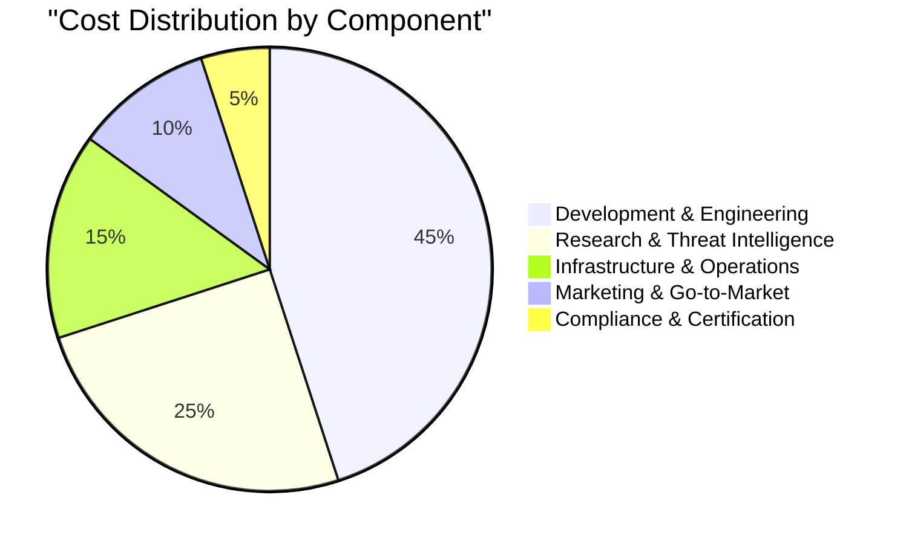
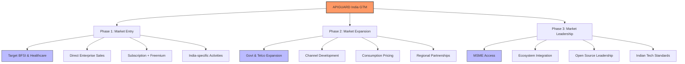
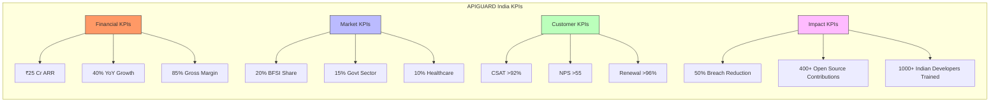

pie
    title "Development Focus Distribution"
    "Indian Regulatory Compliance" : 25
    "Open Source Integration" : 20
    "Self-Healing Capabilities" : 18
    "ML/AI Threat Detection" : 15
    "API Behavior Analysis" : 12
    "Documentation & Reporting" : 10
```

### Cost to Build for Indian Market
### Cost to Build for Indian Market
The estimated investment required to bring APIGUARD to market in India, optimized for value and leveraging open source technologies:

| Phase | Timeline | Budget Range | Open Source Focus Areas |
|-------|----------|--------------|-------------------------|
| MVP Development | 6 months | ₹3.5 Cr - ₹5 Cr | TensorFlow, Kubernetes, ELK Stack integration |
| V1.0 Release | 4 months | ₹2 Cr - ₹3 Cr | OSSIM, Wazuh, Keycloak components |
| Feature Expansion | 6 months | ₹5 Cr - ₹7 Cr | IndiaStack APIs, OpenTelemetry |
| Scale-up Operations | 12 months | ₹8 Cr - ₹12 Cr | Hyperledger, distributed open source tools |
| **Total (First 24 months)** | | **₹18.5 Cr - ₹27 Cr** | **60% reduction through open source** |


### India-focused Go-to-Market Strategy



#### Phase 1: India Market Entry (First 6 months)
- **Target Segments**: Indian BFSI (banking, financial services, insurance) and healthcare API providers
- **Channel Strategy**: Direct sales to large enterprises with established CERT-In partnerships
- **Pricing Model**: Subscription-based with tiered pricing based on API call volume; freemium model for startups
- **Key Activities**:
  - Beta program with top 5 Indian banks and 3-5 government departments
  - Technical presentations at NASSCOM, DSCI, and India-specific security conferences
  - Publication of technical whitepapers on Indian API threat landscape
  - Integration with IndiaStack APIs and demonstration of Aadhaar security enhancements
  - Open source community engagement through India-based developer meetups

#### Phase 2: India Market Expansion (6-18 months)
- **Target Expansion**: Government, e-governance, and telecommunications sectors in India
- **Channel Development**:
  - Strategic partnerships with Indian SI firms (TCS, Infosys, Wipro, HCL)
  - MSSP enablement through local security providers
  - Listings on Government e-Marketplace (GeM) and NIC cloud marketplace
- **Pricing Evolution**: India-specific consumption-based model with rupee-based billing
- **Key Activities**:
  - Launch partner certification program with National Skill Development Corporation
  - Regional expansion across major Indian states and tier-2 cities
  - Vertical-specific solution packaging for Indian priority sectors
  - Open source contributor programs with IITs and regional engineering colleges

#### Phase 3: Indian Market Leadership (18+ months)
- **Target Expansion**: Indian MSME sector through simplified, affordable offerings
- **Channel Maturity**:
  - Distribution through local IT channels and system integrators
  - Integration with India-focused API platforms and developer tools
- **Pricing Innovation**: Pay-as-you-grow model tailored for Indian businesses
- **Key Activities**:
  - Leadership in Indian cybersecurity standards development with BIS and CERT-In
  - Collaboration with Indian startups in complementary security domains
  - Launch of India-focused community edition with local language support
  - Establishment of security research center in India focusing on API threats
### India-focused Success Metrics



- Achieve ₹25 Crore ARR within first 12 months of commercial launch in India
- 20% market share in Indian BFSI and government sectors within 24 months
- Customer satisfaction score (CSAT) >92% among Indian enterprises
- Net Promoter Score (NPS) >55 in Indian market
- Renewal rate >96% with Indian customers
- Contribute to 50% reduction in API-related breaches for Indian critical infrastructure
- Train 1000+ Indian developers on API security best practices
- Become #1 contributor to open source security projects from India
## Team Ability & Culture
> *Team leader's effectiveness, team members' qualification, ability to market product, growth*

```mermaid
org chart
    CEO[Dr. Arjun Sharma<br>CEO & Founder]
    CTO[Priya Venkatesh<br>CTO]
    CMO[Rajiv Mehta<br>CMO]
    CPO[Anika Singh<br>Chief Product Officer]
    CSO[Dr. Vikram Desai<br>Chief Security Officer]
    
    CEO --> CTO
    CEO --> CMO
    CEO --> CPO
    CEO --> CSO
    
    D1[Engineering<br>Team]
    D2[Threat Research<br>Team]
    D3[Open Source<br>Initiatives
