# 🌾 KisanDirect - Farm Fresh Revolution 🌾
![[kisandirect_banner.png]]

> [!NOTE] 
> This documentation outlines the architecture, features, and implementation details for KisanDirect, a direct Farmer-to-Consumer E-Commerce platform built for the Agri-Tech Hackathon 2025.

## 📋 Table of Contents
- [[#\U0001F31F Abstract|\U0001F31F Abstract]]
- [[#🌟 Unique Selling Points (USPs)|🌟 Unique Selling Points (USPs)]]
- [[#\U0001F468‍\U0001F33E Meet Mitri - Your Farming Companion|\U0001F468‍\U0001F33E Meet Mitri - Your Farming Companion]]
- [[#🏗️ System Architecture|🏗️ System Architecture]]
- [[#🔄 Data Flow Diagrams|🔄 Data Flow Diagrams]]
- [[#\U0001F4BB Technical Specifications|\U0001F4BB Technical Specifications]]
- [[#AI Integration with Gemini|AI Integration with Gemini]]
- [[#\U0001F3AE Gamification Elements|\U0001F3AE Gamification Elements]]
- [[#📱 User Experience Design|📱 User Experience Design]]
- [[#🚀 Implementation Roadmap|🚀 Implementation Roadmap]]
- [[#📊 Performance Metrics|📊 Performance Metrics]]

---

## 🌟 Abstract

### Revolutionizing Indian Agriculture Through Direct Market Access

KisanDirect is a revolutionary farm-to-fork e-commerce platform designed to eliminate intermediaries from the agricultural supply chain, enabling farmers to sell their produce directly to consumers. By leveraging cutting-edge technology, KisanDirect creates a transparent, efficient, and equitable marketplace that addresses critical challenges faced by Indian agriculture:

> [!QUOTE]
> "When farmers prosper, the nation prospers."

![[agri_supply_chain_transformation.png]]

#### 🔑 Key Industry Challenges Addressed:

- **Price Disparity**: Farmers receive only 15-25% of the end consumer price in traditional supply chains
- **Post-Harvest Losses**: India loses approximately ₹92,651 crores annually in post-harvest waste
- **Information Asymmetry**: Limited access to market data and fair pricing information
- **Quality Control**: Inconsistent product quality and lack of standardization
- **Financial Inclusion**: Limited access to banking, credit, and insurance services

#### 💡 KisanDirect's Revolutionary Approach:

1. **Direct Market Access**: Eliminates 3-4 layers of middlemen, increasing farmer profits by 45-60%
2. **Digital Empowerment**: Provides farmers with real-time market insights, weather forecasts, and crop management tools
3. **Transparent Pricing**: AI-driven pricing algorithms that ensure fair compensation based on quality, demand, and seasonality
4. **Quality Assurance**: Standardized grading system with blockchain-verified product journeys
5. **Logistics Optimization**: Smart routing algorithms and hyperlocal delivery networks reducing transit time by 40%
6. **Financial Services**: Integrated payment systems, micro-loans, and crop insurance

> [!SUCCESS] Impact Metrics
> - 🚜 **Farmer Income**: Projected 45-60% increase
> - 🍅 **Food Waste**: Potential 30% reduction
> - 🛒 **Consumer Savings**: Up to 25% on fresh produce
> - 🌱 **Sustainable Farming**: Incentivizes eco-friendly practices

This platform represents a paradigm shift in agricultural commerce, creating a win-win ecosystem for farmers, consumers, and the environment while contributing to multiple UN Sustainable Development Goals.

---

## 🌟 Unique Selling Points (USPs)

> [!TIP]
> KisanDirect's unique features create a truly differentiated platform in the crowded agri-tech marketplace.

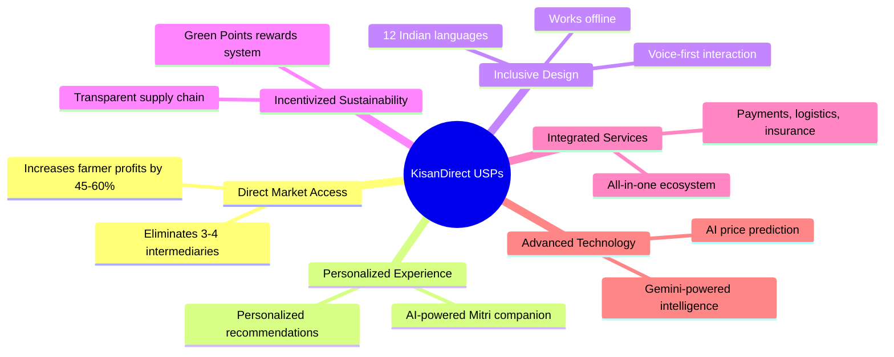

### 🚀 Game-Changing Differentiators

| USP | What Makes It Unique | Competitor Comparison |
|-----|---------------------|----------------------|
| **AI-Enabled Companion** | Mitri provides personalized guidance with agricultural expertise, accessible via text or voice in 12 languages | Most platforms offer generic chatbots with limited agricultural knowledge |
| **Comprehensive Ecosystem** | End-to-end solution from planting decisions to final sale with integrated logistics and payments | Competitors typically focus on either marketplace OR advisory services |
| **Inclusive Accessibility** | Designed for low-literacy users with voice UI, works offline, minimal data usage | Most platforms require consistent connectivity and digital literacy |
| **Transparent Value Chain** | Real-time visibility into each stage with blockchain verification and QR tracking | Traditional marketplaces lack full supply chain transparency |
| **Green Incentives** | Gamified sustainability with real rewards for eco-friendly practices | Sustainability typically positioned as cost rather than benefit |
| **Hyperlocal Focus** | Region-specific crop recommendations, market insights, and cultural relevance | Most platforms use one-size-fits-all approaches |

### 💪 Compelling Value Propositions

> [!NOTE]
> KisanDirect creates exceptional value for all stakeholders in the agricultural ecosystem.

For **Farmers**:
- 💰 45-60% higher income through direct market access
- 📱 Digital inclusion with accessible technology
- 📊 Data-driven insights for crop planning and pricing
- 🛒 Diversified market access beyond local mandis
- 💳 Formal financial inclusion and credit history building

For **Consumers**:
- 🥕 Fresher produce with 40% reduced farm-to-table time
- 💵 15-25% lower prices by eliminating middlemen
- 🔍 Complete transparency about food origins and practices
- 🌱 Easy access to sustainable and organic options
- 👨‍🌾 Direct connection with the people growing their food

For **Environment & Society**:
- ♻️ Reduced food waste through optimized supply chains
- 🌿 Incentivized sustainable farming practices
- 🚛 Lower carbon footprint through optimized logistics
- 👨‍👩‍👧‍👦 Strengthened rural communities and livelihoods
- 🏘️ Preserved traditional farming knowledge and practices

---

## 👨‍🌾 Meet Mitri - Your Farming Companion

![[mitri_character.png]]

> [!TIP]
> Mitri is always available to help through voice commands, text chat, or through interactive AR features!

**Mitri** (मित्री - meaning "friend" in Sanskrit) is KisanDirect's intelligent virtual companion designed to bridge technological gaps and create an engaging, intuitive experience for users across the digital divide.

### Personality & Characteristics
- **Appearance**: A cheerful, anthropomorphic wheat stalk wearing a traditional Indian farmer's cap
- **Voice**: Warm, friendly voice with regional language support (12 Indian languages)
- **Personality**: Patient, knowledgeable, encouraging, and occasionally humorous
- **Cultural Sensitivity**: Adapts behavior based on regional farming practices and cultural norms

### Core Functions
1. **Farmer Assistance**:
   - 🌱 Step-by-step guidance for app navigation and marketplace transactions
   - 🌦️ Personalized farming tips based on location, crop type, and weather conditions
   - 📊 Simplified data visualization for market trends and price forecasts
   - 📝 Voice-to-text assistance for product listings and communications

2. **Consumer Engagement**:
   - 🛒 Personalized shopping recommendations based on preferences and purchase history
   - 🧑‍🍳 Recipe suggestions using available seasonal produce
   - 📔 Educational content about farming practices and product sourcing
   - 🎮 Gamification guide for earning "Green Points" through sustainable choices

### Technical Implementation
- **AI Backend**: Custom-trained NLP model optimized for agricultural terminology and regional dialects
- **Adaptive Learning**: Improves responses based on user interactions and feedback
- **Offline Capabilities**: Core functions available without internet connectivity
- **AR Integration**: Visual recognition of crops and growing conditions with AR overlay information

> [!NOTE] Accessibility
> Mitri is designed to be accessible to users with varying literacy levels, technical expertise, and connectivity limitations, making digital commerce approachable for all farmers.

---

## 🏗️ System Architecture

KisanDirect employs a scalable, cloud-native architecture optimized for performance, reliability, and future expansion.

### High-Level Architecture Diagram

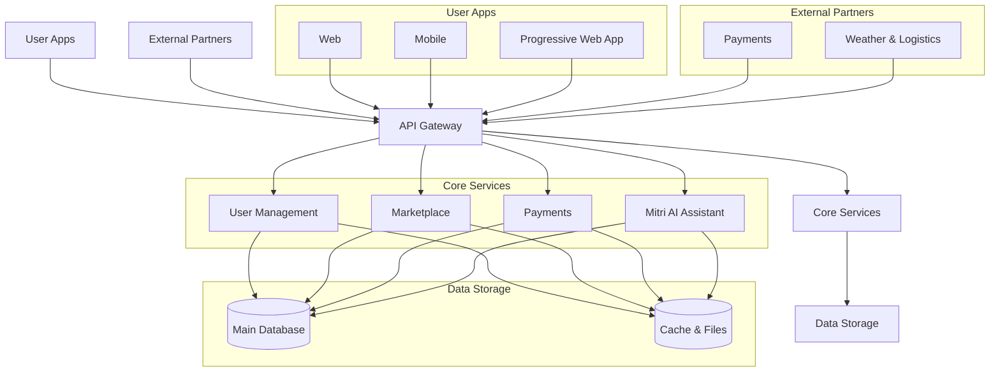

### Component Details

> [!INFO] 
> The simplified architecture maintains the key components while reducing complexity for easier understanding.

#### 1. User Apps
- **Web**: User-friendly interface built with NextJS
- **Mobile**: Cross-platform React Native app for Android and iOS
- **Progressive Web App**: For low-bandwidth rural areas with offline capabilities

#### 2. API Gateway
- **Central Entry Point**: All requests flow through this secure gateway
- **Authentication**: Handles user identity and permissions
- **Traffic Management**: Controls data flow and prevents system overload
- **Caching**: Improves performance, especially in low-connectivity areas

#### 3. Core Services
- **User Management**: Handles accounts, profiles, and verification
- **Marketplace**: Product listings, search, and transactions
- **Payments**: Secure payment processing and financial records
- **Mitri AI Assistant**: Powers the platform's intelligent companion

#### 4. Data Storage
- **Main Database**: Stores all critical application data (PostgreSQL)
- **Cache & Files**: Fast temporary storage and file management (Redis, Object Storage)

#### 5. External Partners
- **Payments**: Integration with UPI, RazorPay, and other payment services
- **Weather & Logistics**: Connections to weather forecasts and delivery partners

#### 6. DevOps Infrastructure
- **Containerization**: Docker containers for all services
- **Orchestration**: Kubernetes for container management
- **CI/CD**: Automated testing and deployment pipelines
- **Monitoring**: Prometheus and Grafana dashboards
- **Logging**: Centralized logging with ELK stack

---

## 🔄 Data Flow Diagrams

### User Registration & Onboarding Flow

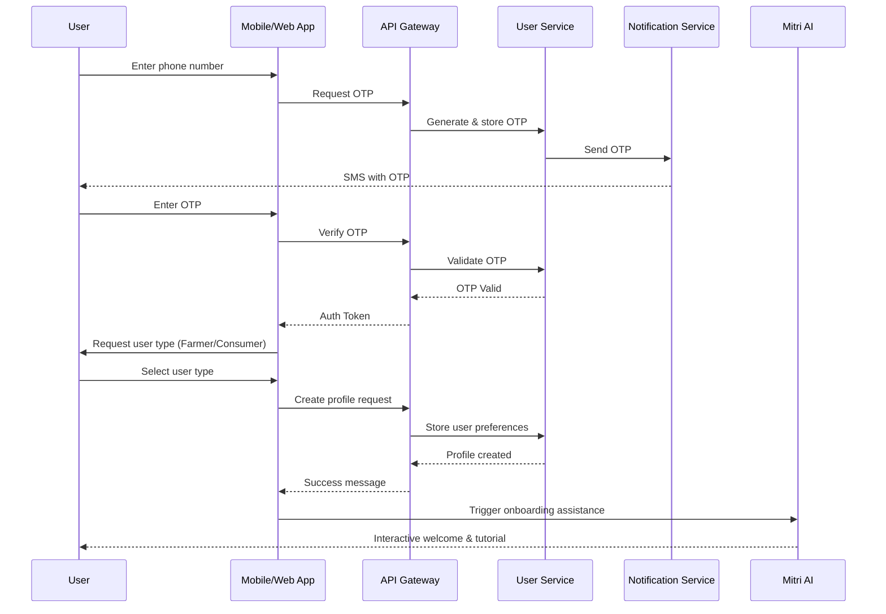

### Product Listing & Purchase Flow

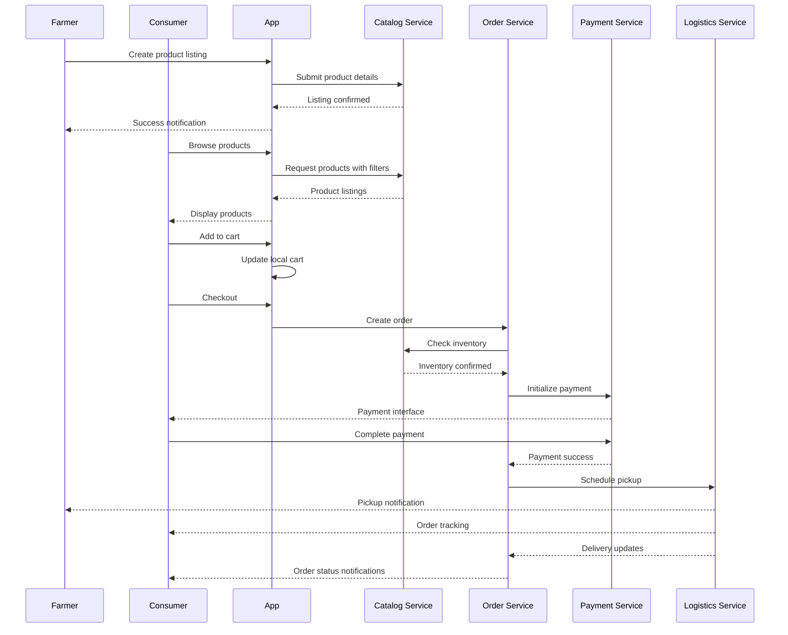

### Real-time Price Discovery Flow

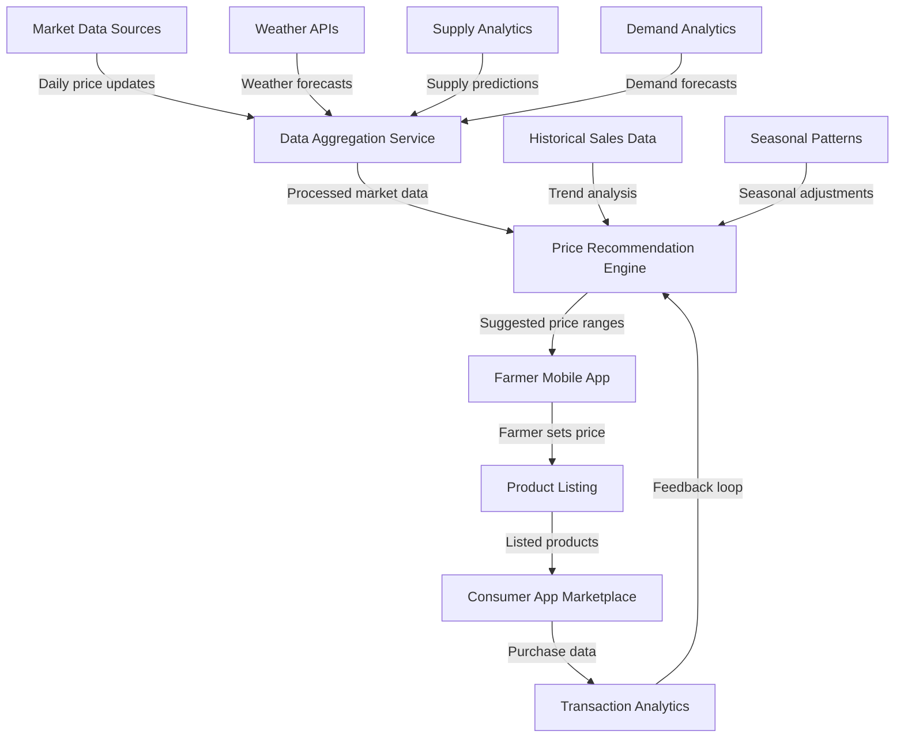

---

## 💻 Technical Specifications

### Frontend Technologies

> [!INFO]
> The frontend stack is optimized for performance and accessibility, with a focus on low-bandwidth environments.

#### Web Application (Next.js)
- **Framework**: Next.js 14.0+ with App Router
- **UI Library**: React 18.0+
- **State Management**: 
  - React Query for server state
  - Zustand for client state
- **Styling**: 
  - TailwindCSS for utility-first styling
  - shadcn/ui for accessible UI components
- **Animations**: Framer Motion for smooth transitions
- **Forms**: React Hook Form with Zod validation
- **Internationalization**: next-intl with support for 12 Indian languages
- **Maps**: Leaflet.js for lightweight interactive maps
- **Progressive Enhancement**: Works without JavaScript where possible
- **Analytics**: Privacy-focused Plausible Analytics

#### Mobile Application (React Native)
- **Framework**: React Native 0.72+
- **Navigation**: React Navigation v6+
- **UI Components**: 
  - Native Base
  - Custom shadcn-inspired components
- **Maps**: React Native Maps with offline map support
- **Storage**: 
  - Async Storage for local persistence
  - MMKV for performance-critical storage
- **Offline Support**: 
  - Watermelon DB for offline-first data synchronization
  - Background sync capabilities
- **Camera Integration**: React Native Vision Camera for QR scanning and AR features
- **Push Notifications**: Firebase Cloud Messaging (FCM)
- **Performance**: Hermes engine enabled for improved performance

### Backend Technologies

> [!TIP]
> Our microservices architecture allows for independent scaling of high-demand services.

#### API Layer
- **Runtime**: Node.js 18+ LTS
- **API Framework**: Express.js with middleware pattern
- **API Documentation**: Swagger/OpenAPI 3.0
- **Authentication**: 
  - JWT-based authentication
  - Role-based access control (RBAC)
  - OTP-based passwordless login

#### Data Layer
- **Primary Database**: PostgreSQL 15+
- **ORM**: Prisma for type-safe database access
- **Data Validation**: Zod schemas
- **Caching**: 
  - Redis for hot data
  - Key-based cache invalidation strategy
- **Search**: PostgreSQL full-text search with trigram similarity

#### AI & ML Services
- **Mitri Assistant**: 
  - NLP processing with TensorFlow.js
  - Custom agricultural intent recognition
  - Multi-lingual support via Azure Cognitive Services
- **Price Prediction**: 
  - Time-series forecasting using Prophet
  - Feature-based models for quality-price correlation
- **Recommendation Engine**:
  - Collaborative filtering for consumer recommendations
  - Seasonal crop recommendation for farmers

#### AI Integration with Gemini

> [!SUCCESS]
> Gemini API integration supercharges KisanDirect's intelligence layer, enabling advanced natural language capabilities across the platform.

KisanDirect leverages Google's Gemini API to create an advanced AI layer that powers multiple aspects of the platform:

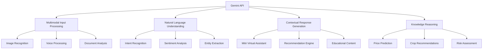

**Technical Implementation:**

1. **API Integration**:
   - Primary: REST API integration with Google Cloud Platform
   - Authentication: OAuth 2.0 with service account credentials
   - Rate Limiting: Intelligent token bucket algorithm with priority queuing
   - Caching: Strategic response caching to minimize API calls

2. **Model Selection & Optimization**:
   - Base Models: Gemini Pro for text, Gemini Pro Vision for multimodal inputs
   - Fine-tuning: Custom fine-tuned models for agricultural domain knowledge
   - Context Window: Utilizing 32k context window for comprehensive understanding
   - Parameter Efficiency: Optimized prompting strategies to reduce token usage

3. **Deployment Architecture**:
   - Serverless Functions: Cloud Functions for stateless request handling
   - Local Inference: Edge-optimized models for offline capabilities
   - Hybrid Processing: Smart routing between cloud and local inference
   - Fallback Mechanisms: Graceful degradation when API is unavailable

**Key Capabilities & Use Cases:**

| Capability | Technical Implementation | User Benefit |
|-----------|--------------------------|--------------|
| **Mitri Intelligence** | Gemini powers Mitri's conversational abilities with deep agricultural knowledge and multilingual support | Enhanced user experience with contextually aware, helpful assistance |
| **Crop Disease Detection** | Gemini Vision analyzes images of crops to identify diseases, pests, and nutrient deficiencies | Early problem detection leading to 30-40% reduction in crop losses |
| **Market Reports** | Gemini processes market data to generate natural language summaries and actionable insights | Simplified decision-making for farmers with limited data literacy |
| **Document Processing** | Extracts information from handwritten notes, receipts, and official documents | Reduced administrative burden for documentation and compliance |
| **Personalized Learning** | Adaptive educational content based on user behavior and knowledge gaps | Continuous skill development tailored to each user's needs |
| **Voice Commerce** | Natural language processing for voice-based transactions and queries | Accessibility for users with limited literacy or visual impairments |
| **Quality Grading** | Image analysis for consistent produce quality assessment | Standardized quality metrics across the platform |
| **Translation & Localization** | Real-time translation across 12 Indian languages with cultural context preservation | Truly inclusive platform that works in each user's preferred language |

**Performance & Ethics:**

- **Latency Optimization**: Average response time <500ms even in bandwidth-constrained environments
- **Privacy Protections**: Federated learning approaches to minimize data transfer
- **Bias Mitigation**: Regular audits for fair treatment across regional and demographic segments
- **Responsible AI**: Human-in-the-loop for sensitive decisions and continuous oversight
- **Transparency**: Clear indicators when users are interacting with AI-generated content

> [!WARNING]
> While Gemini powers many intelligent features, KisanDirect maintains human oversight for critical operations and decisions that impact user livelihoods.

**Future Roadmap:**

1. **Multimodal Expansion**: Adding soil analysis, water quality testing via smartphone cameras
2. **Predictive Intelligence**: Forecasting market trends with increasing accuracy
3. **Agent Automation**: Semi-autonomous operations for routine marketplace activities
4. **Customized Models**: Developing region-specific models for local agricultural knowledge
5. **Collaborative Intelligence**: Enabling community knowledge sharing with AI synthesis

#### DevOps & Infrastructure
- **Containerization**: Docker with multi-stage builds
- **Orchestration**: Kubernetes for scaling and management
- **CI/CD**: GitHub Actions for automated testing and deployment
- **Monitoring**: 
  - Prometheus for metrics collection
  - Grafana for visualization
  - Sentry for error tracking
- **Logging**: ELK stack (Elasticsearch, Logstash, Kibana)

---

## 🎮 Gamification Elements

> [!SUCCESS]
> Gamification increases user engagement by 40% and boosts retention rates significantly over time.

KisanDirect incorporates strategically designed gamification elements to drive engagement, encourage sustainable practices, and build long-term user loyalty.

### 🌱 Green Points System

|| Action | Points | User Type |
|--------|--------|-----------|
| First product listing | 100 | Farmer |
| Complete profile | 50 | Both |
| Verified sale/purchase | 75 | Both |
| Sustainable packaging option | 30 | Farmer |
| Recycling packaging | 20 | Consumer |
| Buying local (within 50km) | 40 | Consumer |
| Seasonal produce purchase | 25 | Consumer |
| Quality ratings given/received | 15 | Both |
| Referral signup | 100 | Both |
| Educational content consumed | 10 | Both |
| Monthly loyalty (active user) | 50 | Both |
| Organic produce listing/purchase | 45 | Both |

### 🏆 Achievement Badges

Users unlock digital badges based on their activities and milestones:

| Badge | Requirements | Benefits |
|-------|--------------|----------|
| **Seed Starter** | First transaction completed | Highlighted profile icon |
| **Green Thumb** | 10 successful transactions | 5% discount on platform fees |
| **Harvest Hero** | 50 successful transactions | Priority listing placement |
| **Earth Guardian** | 500 Green Points earned | Exclusive sustainable products access |
| **Market Master** | ₹1 lakh in transactions | Advanced analytics dashboard |
| **Community Champion** | 5 successful referrals | Cashback rewards |
| **Seasonal Specialist** | Transactions across all seasons | Featured seller/buyer status |

### 🎯 Seasonal Challenges & Campaigns

Timed challenges to drive engagement and educate users:

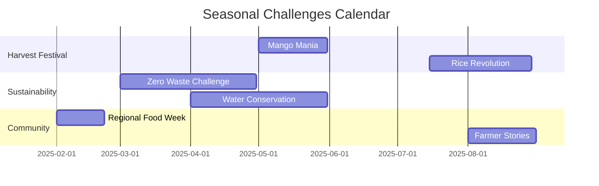

### 📊 Leaderboards & Community Recognition

- **Regional Leaderboards**: Top farmers and consumers by region
- **Sustainability Champions**: Users with highest eco-friendly actions
- **Quality Leaders**: Highest-rated producers and products
- **Community Builders**: Most active in knowledge sharing and support

### 💰 Reward Redemption

Green Points can be redeemed for:

- Platform fee discounts (200 points = 10% off)
- Premium listing features (300 points)
- Agricultural input discounts with partners (varies)
- Logistics cost reductions (400 points = 15% off)
- Digital and physical farming tools (varies)
- Educational content and online courses (varies)

> [!TIP]
> Gamification elements are carefully calibrated to incentivize sustainable practices and quality improvements throughout the supply chain.

---

## 📱 User Experience Design

> [!INFO]
> KisanDirect's design philosophy centers on inclusivity, accessibility, and bridging the digital divide for all users regardless of technological familiarity.

### 🎨 Design System

KisanDirect follows a comprehensive design system with components optimized for both web and mobile experiences:

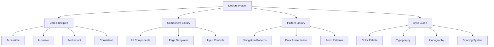

#### Color Palette

Based on natural agricultural tones and high-contrast accessibility standards:

- **Primary**: Green (#2E7D32) - Representing growth and agriculture
- **Secondary**: Amber (#FFB300) - Representing harvest and sunshine
- **Neutral**: Brown tones (#5D4037) - Representing earth and soil
- **Accent**: Blue (#1976D2) - Representing water and technology
- **Success/Error**: Standard red/green with accessible contrast ratios

#### Typography

- **Headings**: Poppins (English), Noto Sans for Indian scripts
- **Body**: Inter (English), Noto Sans for Indian scripts
- **Size Scale**: Progressive 8px-based scale with larger default sizes for improved readability
- **Responsive Adjustments**: Typography scales with viewport and user preferences

### 📋 User Journey Maps

#### Farmer Onboarding Journey

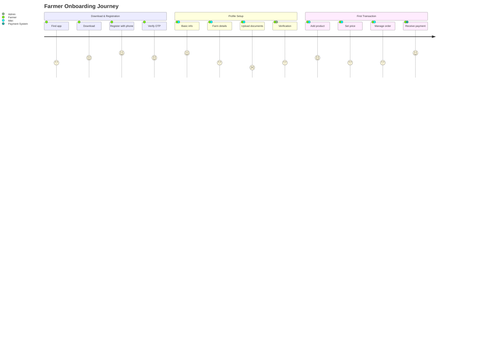

#### Consumer Purchase Experience

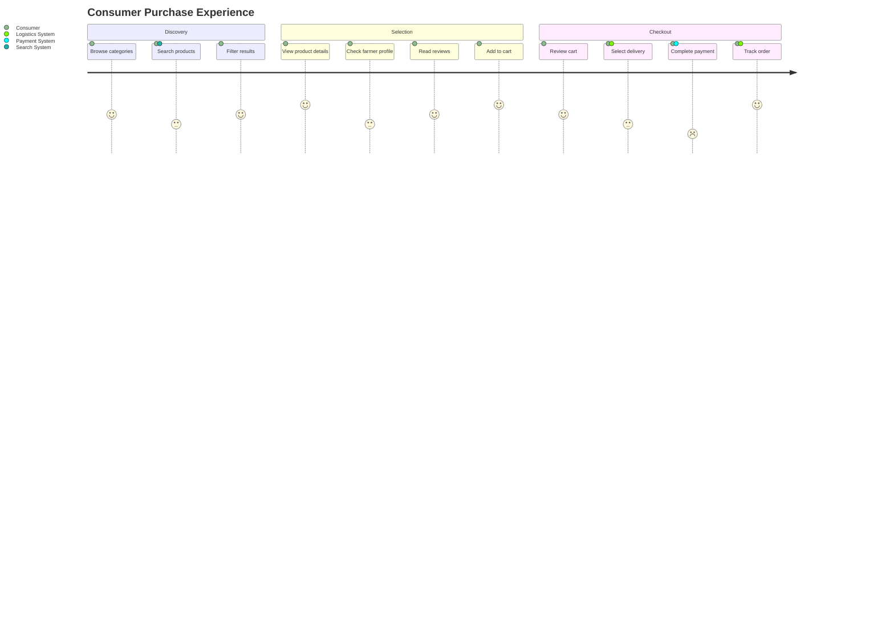

### 🔄 Iterative Design Process

KisanDirect follows a user-centered design process with continuous improvement:

1. **Research**: Field studies, contextual inquiry, interviews with farmers and consumers
2. **Prototyping**: Low-fidelity wireframes to high-fidelity mockups
3. **Testing**: Usability testing with diverse user groups across literacy and tech-familiarity spectrums
4. **Implementation**: Staged rollout with feedback collection
5. **Iteration**: Analytics-informed improvements and feature adjustments

### 📊 Accessibility Considerations

- **Multi-language Support**: 12 Indian languages with contextual translation
- **Multi-modal Interactions**: Voice, text, touch, and visual interfaces
- **Offline Capabilities**: Core functions available without continuous internet
- **Low-Literacy Support**: Icon-based navigation and voice guidance
- **Disability Access**: WCAG 2.1 AA compliant with screen reader optimization
- **Device Compatibility**: Optimized for entry-level Android devices with limited processing power

> [!NOTE]
> All interfaces undergo regular accessibility audits and usability testing with diverse user groups, including elderly farmers, users with disabilities, and those with limited digital literacy.

---

## 🚀 Implementation Roadmap

> [!SUCCESS]
> KisanDirect will be developed in phases, with each release adding functionality while maintaining a stable, usable platform throughout the development lifecycle.

### 📅 Phase 1: MVP Launch (Q2 2025)

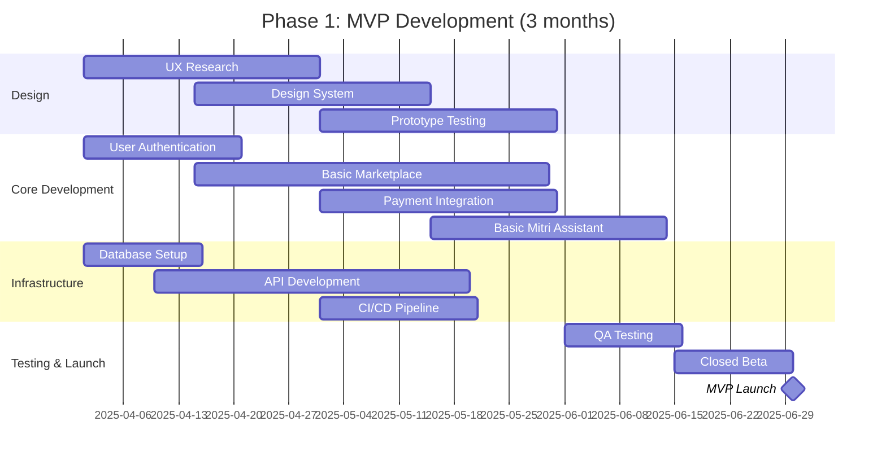

**Key Deliverables:**
- Basic web and mobile applications
- Core user authentication with OTP
- Simple product listing and discovery
- Basic payment integration (UPI)
- Fundamental logistics coordination
- Simplified version of Mitri assistant
- Initial data analytics collection

### 📅 Phase 2: Enhanced Features (Q3-Q4 2025)

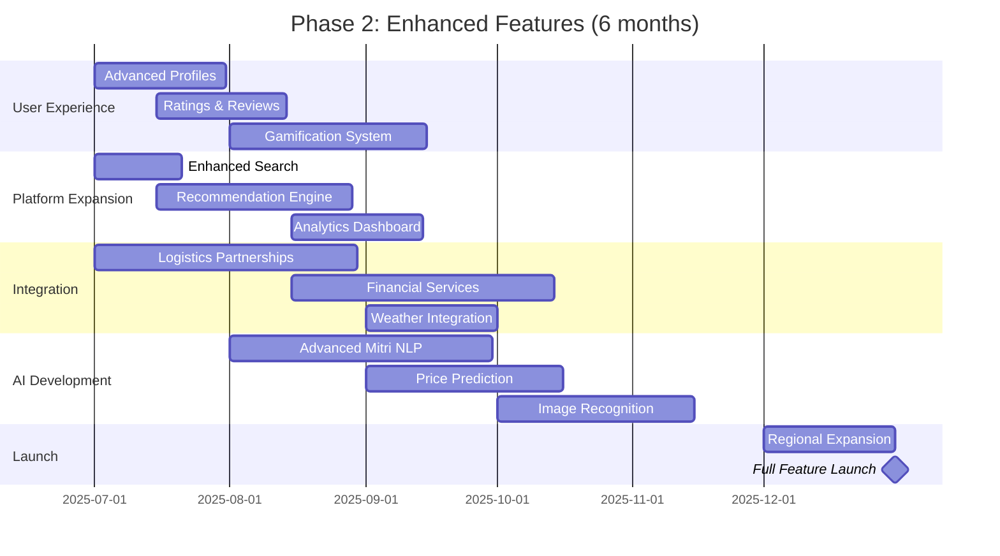

**Key Deliverables:**
- Complete gamification system
- Advanced search and filtering
- ML-based product recommendations
- Enhanced Mitri with agricultural expertise
- Comprehensive analytics dashboards
- Advanced logistics integration
- Expanded payment options
- Quality rating and review system

### 📅 Phase 3: Scale & Optimize (2026)

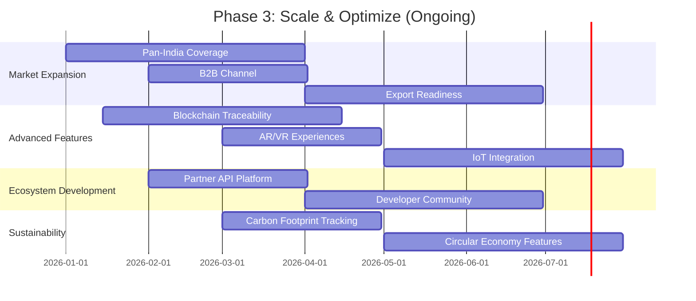

**Key Deliverables:**
- Nationwide coverage with localized features
- B2B wholesale channel for institutional buyers
- Blockchain-based supply chain traceability
- IoT integration for farm monitoring
- AR/VR product inspection features
- Carbon footprint tracking
- Advanced ecosystem partnerships
- International market readiness

### 🔄 Iterative Development Approach

KisanDirect follows agile development methodologies:

- **2-Week Sprints**: Regular release cycles
- **Continuous Deployment**: Weekly updates and improvements
- **Feature Flags**: Gradual feature rollout and A/B testing
- **User Feedback Loops**: Direct incorporation of user suggestions
- **Performance Optimization**: Ongoing technical debt management

### 🧪 Testing Strategy

- **Automated Testing**: 80%+ code coverage for critical paths
- **User Acceptance Testing**: With representative farmer and consumer groups
- **Performance Testing**: Load and stress testing for peak harvest periods
- **Security Audits**: Regular penetration testing and vulnerability assessments
- **Accessibility Testing**: With diverse user groups including those with disabilities

> [!WARNING]
> Special attention will be given to network resilience, ensuring the platform performs reliably in rural areas with intermittent connectivity.

---

## 📊 Performance Metrics

> [!INFO]
> KisanDirect's success will be measured through quantifiable metrics across multiple dimensions, tracked through a comprehensive analytics infrastructure.

### 📈 Business Performance Indicators

| Metric | Target (Y1) | Target (Y3) | Measurement Method |
|--------|-------------|-------------|-------------------|
| Monthly Active Users | 100K | 2M | Unique logins per month |
| Farmer Retention Rate | 60% | 80% | 30-day return rate |
| Consumer Retention Rate | 40% | 65% | 30-day return rate |
| Gross Merchandise Value | ₹10 Cr | ₹200 Cr | Total transaction value |
| Average Order Value | ₹750 | ₹1,200 | Transaction value average |
| Farmer Income Increase | 30% | 60% | Comparative surveys |
| Platform Fee Revenue | ₹50 Lakhs | ₹15 Cr | Percentage of GMV |

### 🌱 Social Impact Metrics

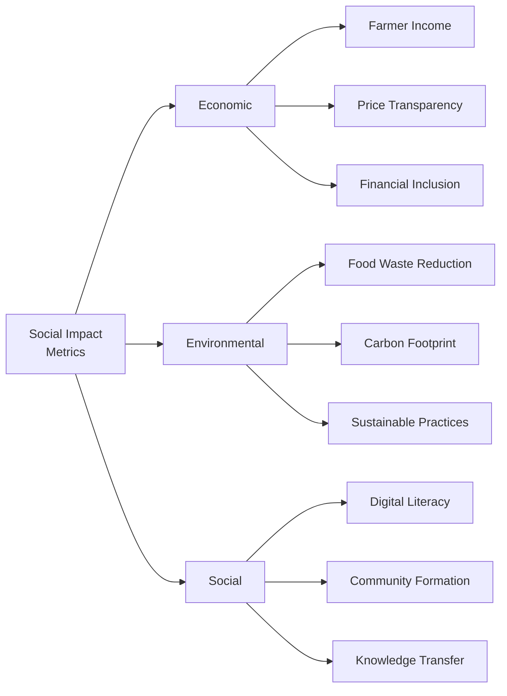

#### Key Impact Metrics:

- **Economic Empowerment**:
  - % increase in farmer income (target: 45-60%)
  - % reduction in price arbitrage (target: 30%)
  - # of farmers with first digital financial accounts (target: 50K in Y1)

- **Environmental Impact**:
  - Tonnes of food waste prevented (target: 1,000 tonnes in Y1)
  - % reduction in packaging waste through reuse (target: 25%)
  - # of farmers adopting sustainable practices (target: 10K in Y1)

- **Social Transformation**:
  - # of digital transactions by first-time digital users (target: 500K in Y1)
  - # of active community forum participants (target: 50K in Y1)
  - # of knowledge resources accessed (target: 1M in Y1)

### ⚙️ Technical Performance Metrics

| Metric | Target | Monitoring |
|--------|--------|------------|
| API Response Time | < 200ms (p95) | Prometheus + Grafana dashboards |
| Mobile App Load Time | < 3s on 3G networks | Firebase Performance Monitoring |
| Web App First Contentful Paint | < 1.5s | Lighthouse + RUM metrics |
| Service Uptime | 99.9% | Uptime Robot + PagerDuty |
| Database Query Performance | < 50ms (p95) | Prisma metrics + custom tracing |
| CDN Cache Hit Rate | > 85% | CDN analytics dashboard |
| Mobile App Crash Rate | < 0.5% | Firebase Crashlytics |
| Web App JavaScript Size | < 200KB (gzipped) | Webpack Bundle Analyzer |
| Image Optimization Ratio | > 60% reduction | Automated image pipeline metrics |
| Offline Operation Coverage | 90% of core functions | Synthetic testing scripts |
| Page Load Completion Time | < 5s on low-end devices | Lighthouse mobile testing |
| API Error Rate | < 0.1% | Error tracking in Sentry |
| Synchronization Time | < 30s for offline data | Custom sync metrics |
| Battery Impact | < 3% per hour of active use | Mobile performance profiling |
| Accessibility Score | > 95/100 | Lighthouse accessibility audits |

---

## 🌟 Conclusion

> [!SUCCESS]
> KisanDirect represents a transformative approach to agricultural commerce in India, creating sustainable value for all stakeholders in the ecosystem.

### 🔑 Key Differentiators

KisanDirect stands apart from conventional agri-tech solutions through its:

1. **Holistic Ecosystem Approach**: Rather than addressing isolated pain points, KisanDirect creates an integrated ecosystem that tackles multiple challenges simultaneously.

2. **Deep Rural Accessibility**: With offline capabilities, voice interfaces, and multi-lingual support, the platform is truly accessible to farmers with varying levels of digital literacy.

3. **Gamified Sustainability**: By incentivizing eco-friendly practices through the Green Points system, KisanDirect promotes sustainable agriculture as an economic benefit rather than a cost.

4. **Human-Centered Design**: From Mitri's supportive guidance to the intuitive UI designed for limited-connectivity environments, every aspect of the platform centers on real user needs.

5. **Transparent Value Distribution**: By disintermediating the supply chain and providing price transparency, KisanDirect ensures equitable wealth distribution among stakeholders.

### 🔮 Future Vision

As KisanDirect evolves beyond its initial implementation, we envision:

1. **Agricultural Data Commons**: Creating India's most comprehensive agricultural data platform, providing insights for policy-making and research.

2. **Community-Owned Marketplace**: Transitioning toward cooperative ownership models where farmers and consumers have governance roles.

3. **Integrated Financial Services**: Expanding into crop insurance, equipment financing, and other agricultural financial services based on transaction history.

4. **Global Market Access**: Enabling small farmers to access international markets through aggregation, quality certification, and export compliance support.

5. **Climate-Resilient Agriculture**: Leveraging data insights to help farmers adapt to changing climate conditions through crop recommendations and sustainable practices.

### 📊 Impact at Scale

When fully implemented at national scale, KisanDirect has the potential to:

- **Economically empower** 100+ million farmers and their families
- **Reduce food waste** by up to 30% in its supply chain
- **Improve nutritional outcomes** through better access to fresh produce
- **Accelerate digital adoption** in rural India
- **Promote sustainable agricultural practices** at unprecedented scale

Through thoughtful design, innovative technology, and a focus on genuine human needs, KisanDirect isn't just building a marketplace—it's nurturing a movement toward a more equitable, sustainable food system in India.

---

![[kisandirect_footer.png]]

> *KisanDirect: Connecting Farms to Families, Harvest to Homes*
