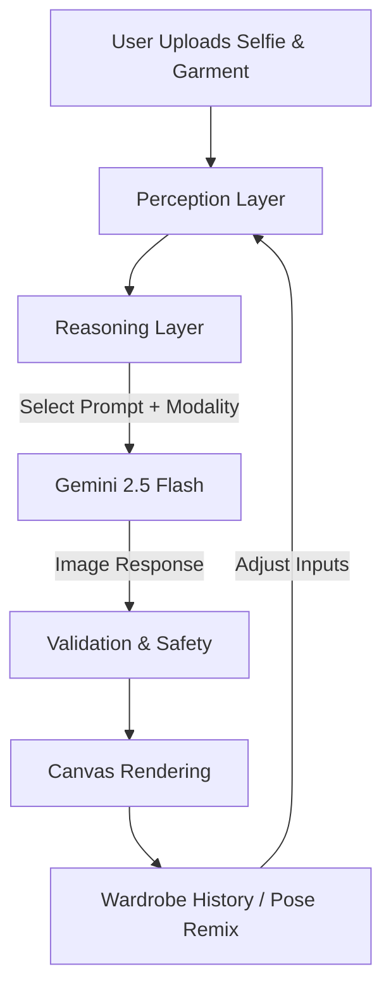
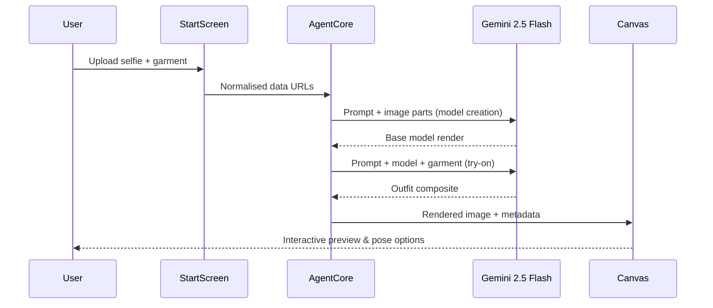

## Student Details
- **Name:** Rohan Prakash Pawar
- **UID:** 2023201020
- **Branch:** EXTC

### Experiment no. 10 - AIML
## Objective
To create and run virtual machines on hosted hypervisors such as KVM, VMware Workstation, and Oracle VirtualBox.

# Fit Check – AIML Agent Report

> **Design and Implementation of an Autonomous AI Agent**

## AIM
Design and implement an autonomous AI agent that can perceive user inputs (selfie + garment), reason about styling constraints, and act through generative transformations to render photorealistic virtual try-ons powered by Gemini 2.5 Flash.

## Theory
An **Autonomous AI Agent** is a self-directed software entity capable of perceiving its environment, making decisions, and performing actions to achieve specific goals without continuous human intervention. These agents underpin modern intelligent systems such as chatbots, self-driving cars, virtual assistants, and recommendation engines. Building such agents blends **Artificial Intelligence (AI)** for decision logic, **Machine Learning (ML)** for pattern generalisation, **Natural Language Processing (NLP)** for instruction following, and **Control Systems** for sequencing perception–reasoning–action loops.

## Project Overview
Fit Check is a multimodal virtual try-on experience where users upload a selfie and wardrobe items to see AI-rendered outfits. The orchestrating agent curates prompts, governs Gemini 2.5 Flash (image) calls, validates safety feedback, and streams results to an interactive React canvas with wardrobe management, outfit history, and pose remixing.

## Technical Stack & Multimodal LLM
- **Frontend:** React 19 + Vite, Framer Motion for transitions, custom Canvas/Wardrobe components, Tailwind utilities via `clsx` + `tailwind-merge`.
- **Agent Runtime:** TypeScript orchestration hooks inside `App.tsx`, Spinner/error handling utilities, and finely scoped async actions.
- **Generative Core:** `@google/genai` SDK targeting `gemini-2.5-flash-image`, a multimodal LLM that natively consumes & emits text+image modalities with safety filtering.
- **Media Handling:** FileReader → Base64 conversion, inline `data:` payload management, React state for preview caching.
- **Experience Glue:** Wardrobe modal, Outfit stack, pose presets, and Footer CTAs create a complete end-to-end autonomous styling agent.

## Agent Architecture & Chain of Actions
1. **Perception Layer:** StartScreen collects selfie + garment assets, normalises them into inline `data:` parts, and records context (pose intent, wardrobe metadata).
2. **Reasoning Layer:** The agent selects the correct system prompt (modeling vs. try-on vs. pose variation) and config instructions, evaluates safety signals, and decides when to branch (e.g., regenerate pose or request reupload).
3. **Action Layer:** Sequential Gemini calls craft the base model render, overlay garments, and optionally produce pose variations. Each response is validated via `handleApiResponse`, bubbled to the Canvas, and persisted for OutfitStack replay.
4. **Feedback Loop:** Users can iterate—tweaking wardrobe assets or pose instructions—while the agent maintains stateful context to avoid redundant uploads and accelerate experimentation.

### System Prompts (from `services/geminiService.ts`)
1. **Model Creation:** "Transform the person in this image into a full-body fashion model photo... neutral studio backdrop (#f0f0f0)... Return ONLY the final image."
2. **Virtual Try-On:** "You will be given a 'model image' and a 'garment image'... completely REMOVE and REPLACE the clothing item... Preserve model + background... Return ONLY the final, edited image."
3. **Pose Variation:** "Regenerate it from a different perspective... pose instruction: \"<POSE>\"... Return ONLY the final image."

## Mermaid Diagrams
### Agentic Flow

### Multimodal Call Sequence

## Requirements
- Node.js 18+
- Gemini API key stored as `GEMINI_API_KEY` in `.env.local`
- Modern browser with File API & WebGL support
- Stable internet connection for multimodal inferences

## Procedure
1. Install dependencies with `npm install` (or `pnpm install`).
2. Configure `GEMINI_API_KEY` in `.env.local`.
3. Run `npm run dev` and open the Vite server URL.
4. Upload a selfie on the Home screen; the agent invokes `generateModelImage` to create the neutral studio model.
5. Upload/select a garment; the agent calls `generateVirtualTryOnImage` to replace attire while preserving pose/background.
6. Optionally choose a pose instruction to trigger `generatePoseVariation` for dynamic viewpoints.
7. Use OutfitStack to compare iterations, download renders, or restart the loop.

## Screenshots (placeholders)
1. **Home Screen**  
   
2. **Model Display After Creation**  
   
3. **Upload New Outfit Screen**  
   
4. **Model Wearing Selected Outfit**  
   

## GitHub Link
[Fit Check Repository](https://github.com/your-org/fit-check)

## Conclusion
By tightly coupling a multimodal LLM (Gemini 2.5 Flash) with a lightweight React orchestrator, Fit Check demonstrates how an autonomous AIML agent can perceive user intent, reason over styling rules, and act through a sequence of generative transformations. The carefully engineered system prompts and validation hooks ensure photorealistic, safe outputs, while the UI keeps users in the loop—showcasing a practical blueprint for agentic fashion experiences.
