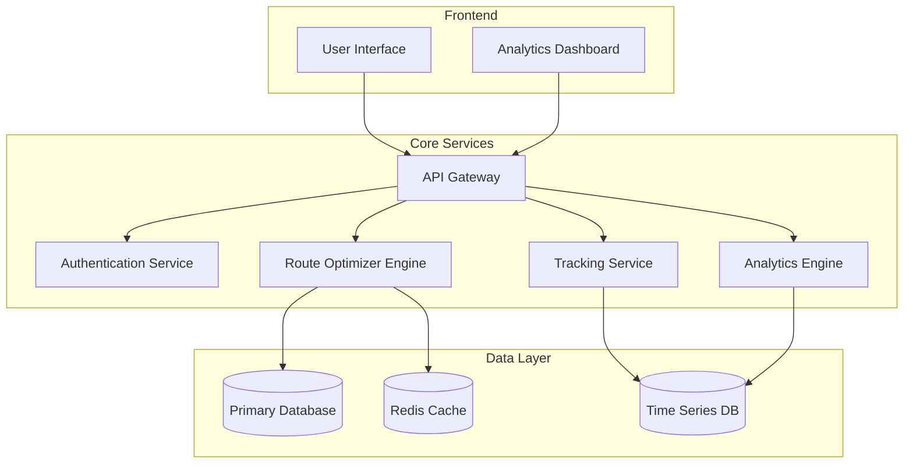
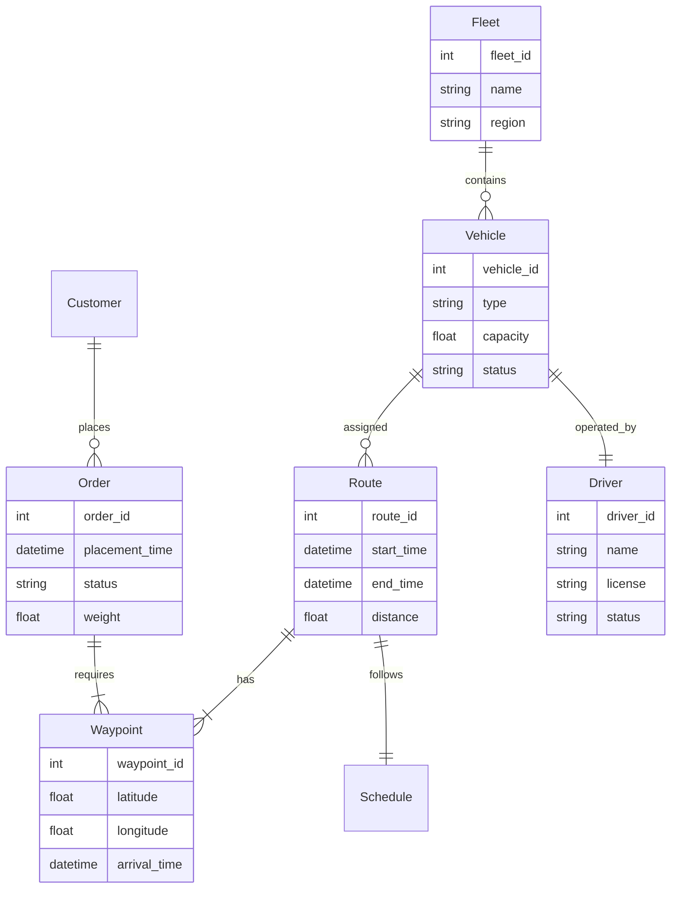
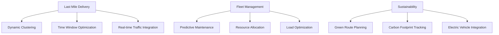
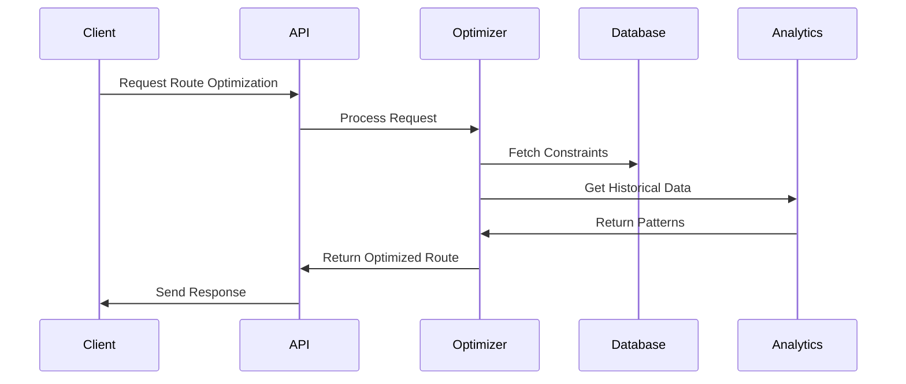

# Logistic Router Optimizer System

## 1. Introduction and Problem Statement
The Logistic Router Optimizer System is an advanced solution designed to tackle complex logistics and route optimization challenges in modern supply chain operations. It addresses critical issues such as:
- Inefficient route planning leading to increased operational costs
- Suboptimal resource utilization and load distribution
- High carbon emissions due to non-optimized travel paths
- Real-time tracking and visibility challenges
- Dynamic market demands and last-mile delivery complications

## 2. System Architecture

## 3. ER Diagram

## 4. Unique Selling Propositions (USPs)
- **AI-Powered Route Optimization**: Advanced algorithms considering multiple constraints
- **Real-Time Dynamic Rerouting**: Instant adaptation to traffic and weather conditions
- **Predictive Load Balancing**: ML-based resource allocation
- **Green Route Planning**: Carbon footprint optimization
- **Digital Twin Integration**: Real-time simulation and optimization
- **Multi-Objective Optimization**: Balancing cost, time, and sustainability

## 5. Real-world Problem Solutions

## 6. Technical Implementation Details

## 7. Optimization Algorithms
- **Route Optimization**
    - Modified Clarke-Wright Savings Algorithm
    - Genetic Algorithms for Multi-depot Problems
    - Ant Colony Optimization for Dynamic Routing
- **Load Balancing**
    - Capacity-based Distribution Algorithm
    - Dynamic Load Distribution using ML
- **Predictive Analytics**
    - LSTM for Demand Forecasting
    - Random Forest for Delivery Time Prediction

## 8. Integration Points
- **External Systems**
    - ERP Systems
    - CRM Platforms
    - Weather APIs
    - Traffic Management Systems
    - GPS and Telematics
- **Data Exchange**
    - REST APIs
    - GraphQL Endpoints
    - Message Queues
    - WebSocket for Real-time Updates

## 9. Future Enhancements
- Blockchain Integration for Transparency
- Autonomous Vehicle Fleet Support
- Drone Delivery Integration
- AR/VR for Warehouse Operations
- IoT Sensor Integration
- Advanced Machine Learning Models
- Cross-platform Mobile Applications

