# Logistic Router Optimizer System

## 1. Introduction and Problem Statement
The Logistic Router Optimizer System is an advanced solution designed to tackle complex logistics and route optimization challenges in modern supply chain operations. It addresses critical issues such as:
- Inefficient route planning leading to increased operational costs
- Suboptimal resource utilization and load distribution
- High carbon emissions due to non-optimized travel paths
- Real-time tracking and visibility challenges
- Dynamic market demands and last-mile delivery complications

## 1.1 Platform Features
### Advanced Analytics Dashboard
- Real-time performance metrics visualization
- Customizable KPI tracking
- Interactive data exploration tools
- Predictive analytics insights

### Machine Learning Capabilities
- Demand forecasting
- Pattern recognition
- Anomaly detection
- Predictive maintenance

### IoT Integration
- Real-time sensor data processing
- Fleet telematics integration
- Environmental monitoring
- Asset tracking

### Mobile Solutions
- Driver mobile app
- Customer tracking interface
- Field force management
- Real-time updates and notifications

### Automation Features
- Automated dispatch
- Smart scheduling
- Document processing
- Inventory management

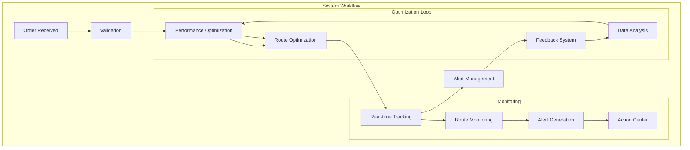

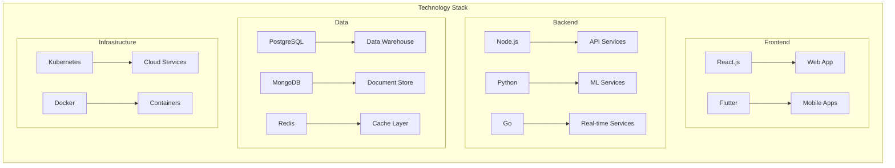

```mermaid
flowchart TB
    subgraph Integration Architecture
        subgraph External Systems
            ERP[ERP Systems]
            CRM[CRM Systems]
            WMS[WMS]
            TMS[TMS]
        end
        
        subgraph Security
            AUTH[Authentication]
            AUTHZ[Authorization]
            ENC[Encryption]
        end
        
        subgraph Data Flow
            API[API Gateway] --> MQ[Message Queue]
            MQ --> PROC[Data Processing]
            PROC --> STORE[Data Storage]
        end
        
        External Systems --> AUTH
        AUTH --> API
    end
```

## 2. System Architecture
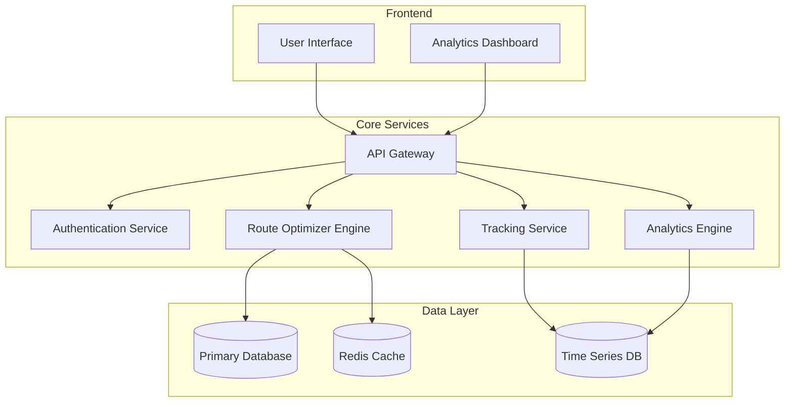

## 3. ER Diagram
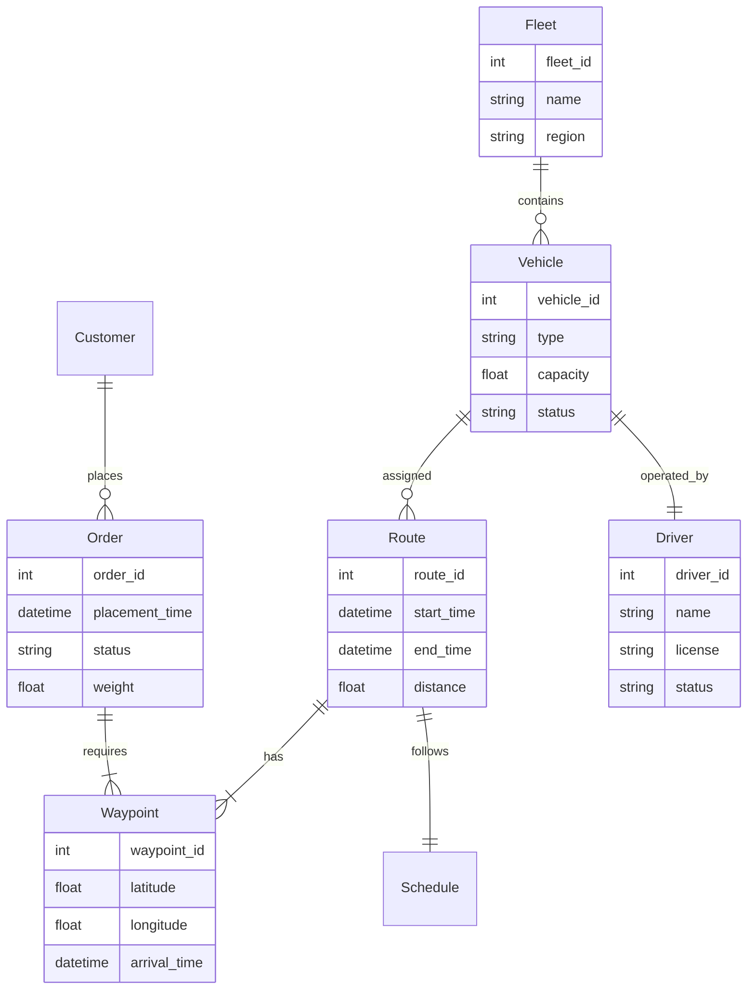

## 4. Unique Selling Propositions (USPs)
- **AI-Powered Route Optimization**: Advanced algorithms considering multiple constraints
- **Real-Time Dynamic Rerouting**: Instant adaptation to traffic and weather conditions
- **Predictive Load Balancing**: ML-based resource allocation
- **Green Route Planning**: Carbon footprint optimization
- **Digital Twin Integration**: Real-time simulation and optimization
- **Multi-Objective Optimization**: Balancing cost, time, and sustainability

## 5. Real-world Problem Solutions
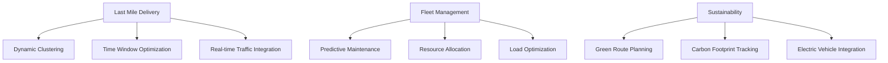

## 6. Technical Implementation Details
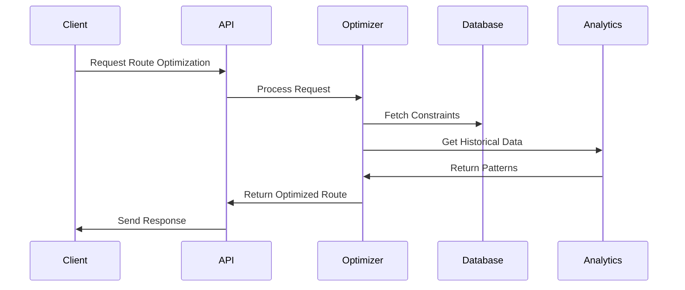

## 7. Optimization Algorithms
- **Route Optimization**
    - Modified Clarke-Wright Savings Algorithm
    - Genetic Algorithms for Multi-depot Problems
    - Ant Colony Optimization for Dynamic Routing
- **Load Balancing**
    - Capacity-based Distribution Algorithm
    - Dynamic Load Distribution using ML
- **Predictive Analytics**
    - LSTM for Demand Forecasting
    - Random Forest for Delivery Time Prediction

## 8. Integration Points
- **External Systems**
    - ERP Systems
    - CRM Platforms
    - Weather APIs
    - Traffic Management Systems
    - GPS and Telematics
- **Data Exchange**
    - REST APIs
    - GraphQL Endpoints
    - Message Queues
    - WebSocket for Real-time Updates

## 9. Future Enhancements
- Blockchain Integration for Transparency
- Autonomous Vehicle Fleet Support
- Drone Delivery Integration
- AR/VR for Warehouse Operations
- IoT Sensor Integration
- Advanced Machine Learning Models
- Cross-platform Mobile Applications

## 10. Innovative Solutions
### AI-Driven Demand Forecasting
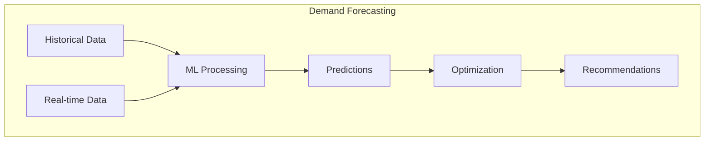

### Smart Warehouse Integration
- Automated inventory management
- Robotic process automation
- Smart storage solutions
- Real-time inventory tracking

### Autonomous Vehicle Support
- Fleet management system
- Route optimization for autonomous vehicles
- Safety protocols and monitoring
- Emergency response system

### Blockchain for Transparency
- Smart contracts for transactions
- Immutable audit trails
- Supply chain verification
- Stakeholder transparency

### Green Logistics Solutions
- Carbon footprint tracking
- Eco-friendly route optimization
- Renewable energy integration
- Sustainable packaging solutions

## 11. Risk Management
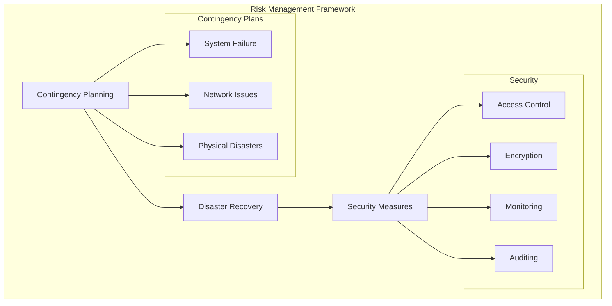

### Contingency Planning
- Business continuity plans
- Emergency response procedures
- Alternative route strategies
- Backup system protocols

### Disaster Recovery
- Data backup and recovery
- System restoration procedures
- Communication protocols
- Service continuity plans

### Security Measures
- Multi-layer authentication
- End-to-end encryption
- Regular security audits
- Compliance monitoring

## 12. Microservices Architecture
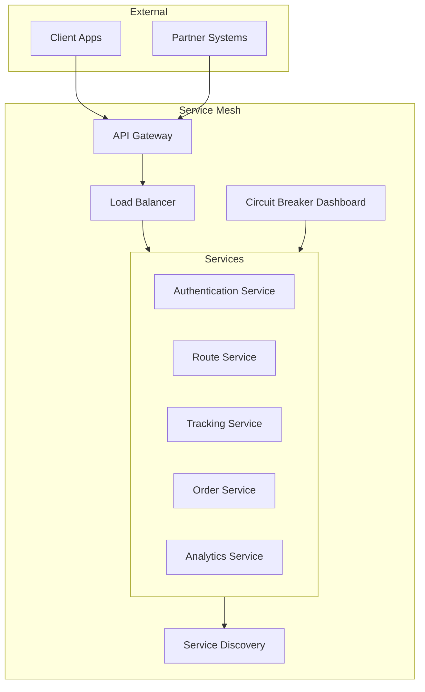

## 13. Analytics Dashboard
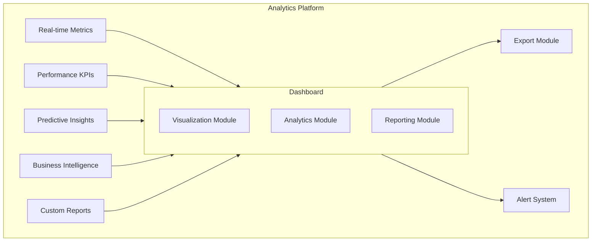

### 13.1 Analytics Features
- Real-time fleet performance monitoring
- Cost analysis and optimization metrics
- Resource utilization tracking
- Driver performance analytics
- Customer satisfaction metrics
- Delivery time analytics
- Route efficiency analysis

## 14. Sustainability Metrics
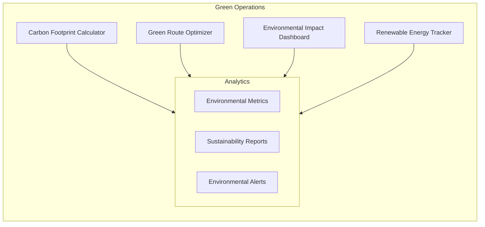

### 14.1 Sustainability Features
- Real-time carbon emission tracking
- Green route suggestions
- Environmental impact reporting
- Renewable energy usage optimization
- Sustainable packaging metrics
- Waste reduction analytics

## 15. AI/ML Pipeline
```mermaid
flowchart TB
    subgraph ML Operations
        DI[Data Ingestion] --> FE[Feature Engineering]
        FE --> MT[Model Training]
        MT --> Val[Validation]
        Val --> Dep[Deployment]
        Dep --> Mon[Monitoring]
        
        subgraph Model Lifecycle
            Ver[Version Control]
            Eval[Model Evaluation]
            Ret[Model Retraining]
        end
        
        MT --> Model Lifecycle
        Mon --> Model Lifecycle
    end
```

### 15.1 AI/ML Features
- Automated data preprocessing
- Feature selection and engineering
- Model training automation
- A/B testing framework
- Model performance monitoring
- Continuous learning pipeline

## 16. User Journey Map
```mermaid
flowchart TB
    subgraph User Personas
        Admin[Admin Dashboard]
        Driver[Driver App]
        Customer[Customer Portal]
        Warehouse[Warehouse Management]
        
        subgraph Admin Features
            Fleet[Fleet Management]
            Analytics[Analytics Dashboard]
            Users[User Management]
        end
        
        subgraph Driver Features
            Routes[Route Information]
            Navigation[Navigation System]
            Updates[Status Updates]
        end
        
        subgraph Customer Features
            Track[Order Tracking]
            History[Order History]
            Support[Customer Support]
        end
        
        subgraph Warehouse Features
            Inventory[Inventory Management]
            Picking[Picking System]
            Shipping[Shipping Management]
        end
        
        Admin --> Admin Features
        Driver --> Driver Features
        Customer --> Customer Features
        Warehouse --> Warehouse Features
    end
```

### 16.1 User Journey Features
- Personalized dashboards for each user type
- Role-based access control
- Custom reporting capabilities
- Real-time notifications and alerts
- Mobile-first design
- Offline capabilities
- Multi-language support
