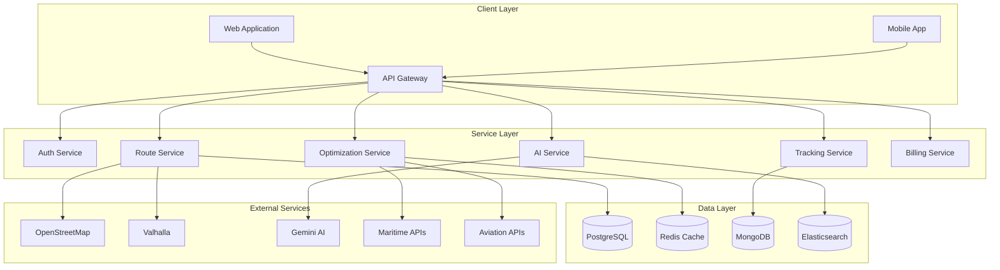
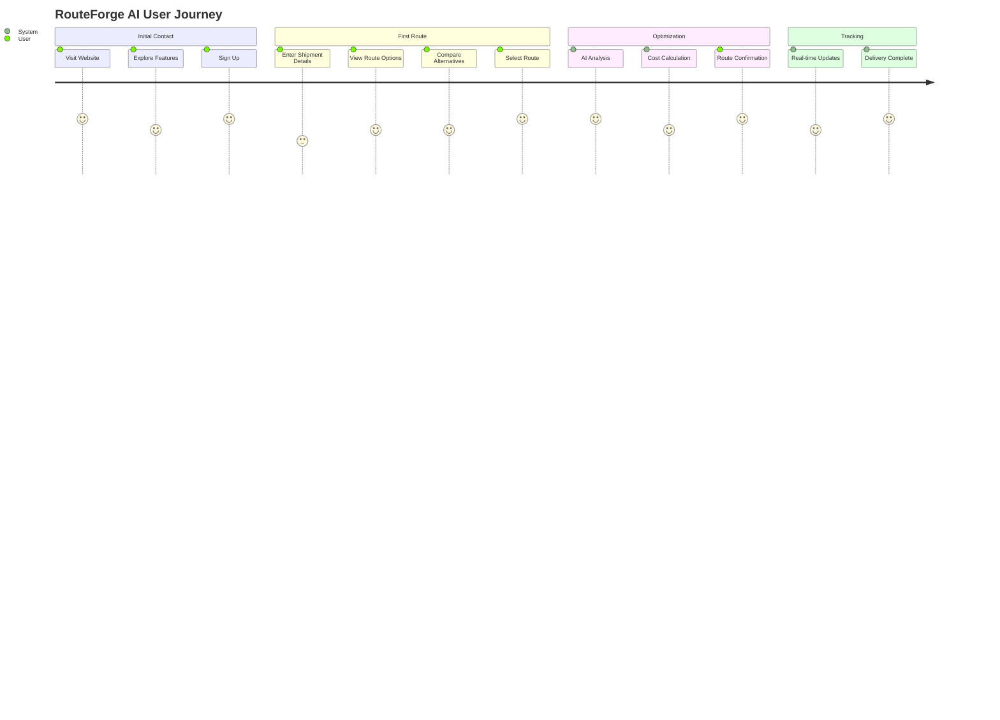
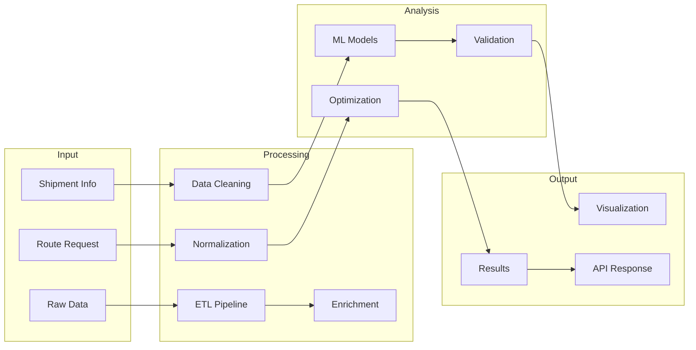
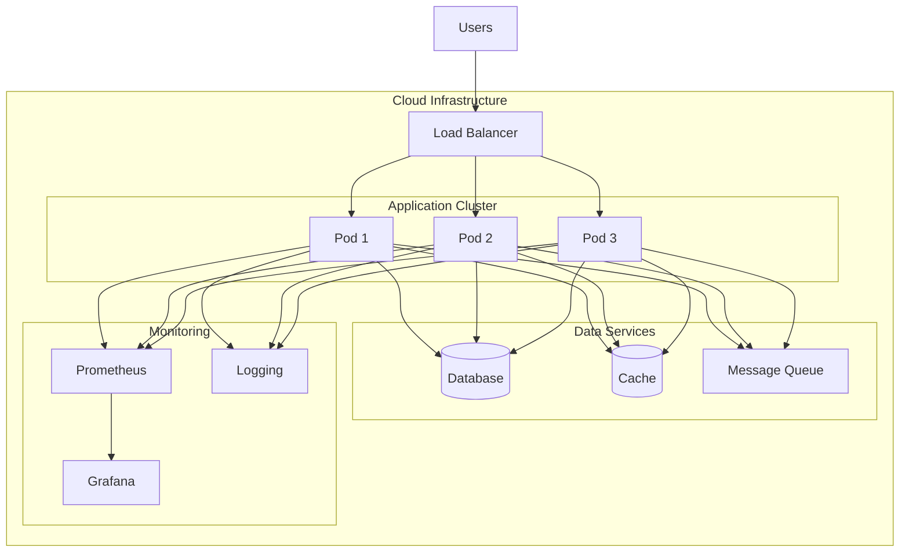
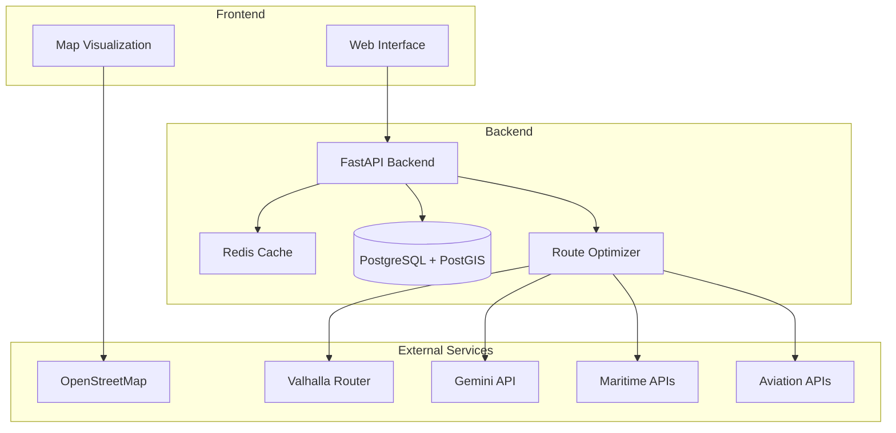
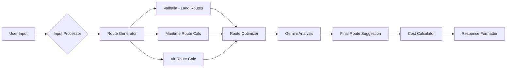
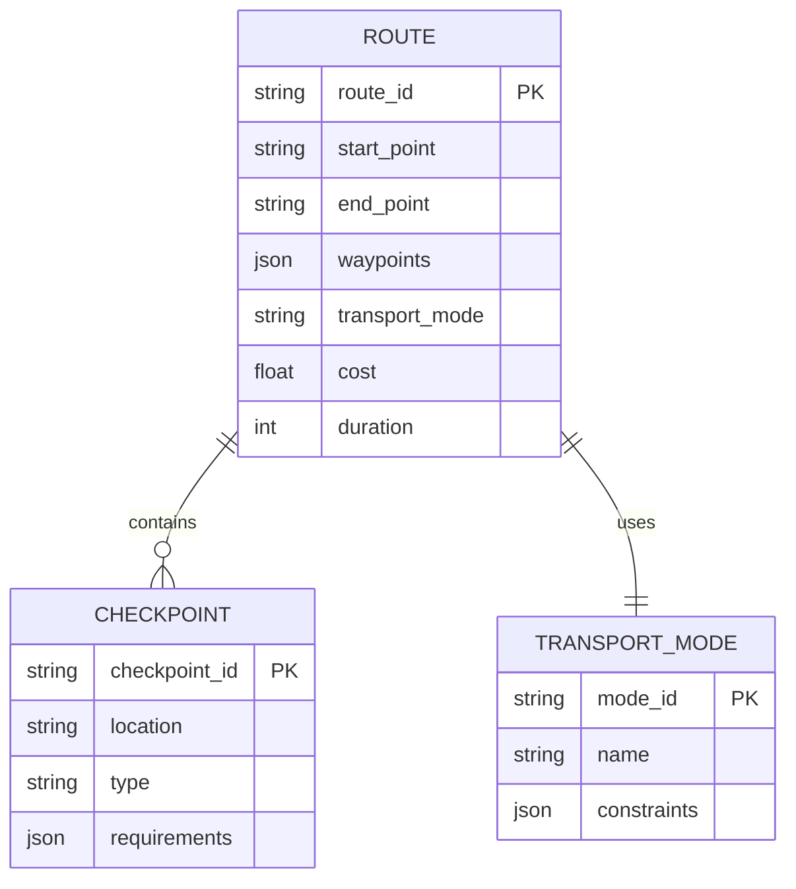
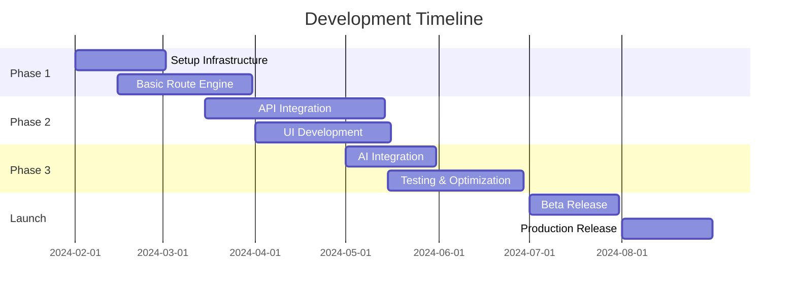

> [!note]- Document Navigation
> 1. [[#Executive Summary]]
> 2. [[#Problem Statement & Market Analysis]]
> 3. [[#Technical Architecture]]
> 4. [[#Tech Stack & API Integration]]
> 5. [[#Development Roadmap]]
> 6. [[#Competitive Analysis]]
> 7. [[#Business Model]]
> 8. [[#Risk Analysis]]

# Executive Summary

> [!abstract] Project Overview
> RouteForge AI is a revolutionary multi-modal logistics route optimization platform that harnesses cutting-edge artificial intelligence, open-source routing engines, and real-time transportation data to forge optimal shipping routes across sea, air, and land transportation modes. Our platform transforms complex logistics challenges into streamlined, cost-effective solutions through advanced AI-driven decision making.

**Key Differentiators:**
- AI-powered route suggestion using Google's Gemini API
- Real-time multi-modal route optimization
- Open-source core with enterprise features
- Predictive analytics for route planning
- Cost-effective implementation using proven technologies

# Problem Statement & Market Analysis

> [!info] Market Pain Points
> - Complex manual route planning processes
> - Lack of integrated multi-modal solutions
> - Inefficient border crossing coordination
> - Limited real-time optimization capabilities
> - High costs of existing enterprise solutions

## Market Size
- Global Logistics Market: $9.1 trillion (2023)
- Route Optimization Software: $4.3 billion
- Expected CAGR: 11.4% (2024-2029)

# Technical Architecture

## System Architecture

### Microservices Architecture


### User Journey Flow


### Data Processing Pipeline


### Infrastructure Architecture


### Route Optimization Process


## Data Flow Diagram


## ER Diagram


# Tech Stack & API Integration

> [!tip] Core Technologies
> - **Frontend**: React + TypeScript
> - **Backend**: Python FastAPI
> - **Database**: PostgreSQL + PostGIS
> - **Cache**: Redis
> - **Container**: Docker + Kubernetes

## API Integration Details

### Maps & Routing
- **OpenStreetMap**: Base map tiles and data
- **Valhalla**: Open-source routing engine
    - Local routing optimization
    - Custom costing models
    - Turn-by-turn navigation

### AI & Optimization
- **Google Gemini API**
    - Route pattern analysis
    - Historical route optimization
    - Predictive scheduling
    ```python
    sample_gemini_prompt = """
    Analyze optimal route between:
    - Origin: Port of Shanghai
    - Destination: Frankfurt Airport
    - Constraints: Time-sensitive, Temperature-controlled
    Suggest common routes and alternatives based on historical patterns.
    """
    ```

### Maritime & Aviation
- **OpenSky Network**: Flight tracking
- **World Port Source**: Port database
- **MarineTraffic**: Limited vessel tracking
- **UN/LOCODE**: Location codes

# Development Roadmap



# Competitive Analysis

> [!example] Market Position
> | Feature | Our Solution | Traditional Solutions | Digital Competitors |
> |---------|--------------|----------------------|-------------------|
> | Multi-modal | ✅ | ❌ | ⚠️ |
> | AI Integration | ✅ | ❌ | ⚠️ |
> | Open Source Core | ✅ | ❌ | ❌ |
> | Cost | Low | High | Medium |
> | Real-time Updates | ✅ | ❌ | ✅ |

# Business Model

## Revenue Streams
1. SaaS Subscriptions
2. API Usage Pricing
3. Enterprise Customization
4. Support & Maintenance

## Pricing Structure
- **Basic**: $299/month
    - Up to 1000 route calculations
    - Basic optimization
- **Professional**: $999/month
    - Unlimited routes
    - AI-powered optimization
- **Enterprise**: Custom pricing
    - Full feature set
    - Dedicated support
    - Custom integration

# Risk Analysis

> [!warning] Key Risks & Mitigation
> 1. **Technical Risks**
>    - *Data Accuracy*: Multiple data source validation
>    - *API Reliability*: Fallback mechanisms
>    - *Scaling Issues*: Cloud-native architecture
> 
> 2. **Business Risks**
>    - *Market Adoption*: Freemium model
>    - *Competition*: Unique AI features
>    - *Regulation*: Compliance-first approach

# AI Capabilities

> [!note]+ Advanced AI Features
> - **Predictive Route Planning**
>   - Historical pattern analysis
>   - Weather impact prediction
>   - Traffic pattern recognition
> - **Dynamic Optimization**
>   - Real-time route adjustment
>   - Congestion avoidance
>   - Cost optimization
> - **Smart Scheduling**
>   - Optimal departure timing
>   - Port congestion prediction
>   - Customs processing estimation
> - **Risk Assessment**
>   - Route risk analysis
>   - Delay probability calculation
>   - Alternative route suggestions

# Scalability & Performance

> [!important]+ System Scalability
> - **Horizontal Scaling**
>   - Kubernetes-based container orchestration
>   - Auto-scaling pod management
>   - Load-balanced API endpoints
> - **Performance Optimization**
>   - Redis caching layer
>   - Database query optimization
>   - CDN for static assets
> - **High Availability**
>   - Multi-zone deployment
>   - Database replication
>   - Fault tolerance mechanisms

# Mind Map

- RouteForge AI
    - Core Features
        - Multi-modal routing
        - Real-time optimization
        - AI-powered suggestions
        - Cost calculation
    - Technical Components
        - Frontend
            - React
            - MapLibre GL
            - Material UI
        - Backend
            - FastAPI
            - PostgreSQL
            - Redis
        - External Services
            - OSM
            - Valhalla
            - Gemini API
    - Market Strategy
        - Target Segments
            - Small logistics providers
            - Medium enterprises
            - Enterprise clients
        - Growth Plan
            - Freemium model
            - API partnerships
            - Regional expansion

> [!success] Investment Opportunity
> - Initial Investment Required: $1.5M
> - Projected Break-even: 18 months
> - Expected ROI: 3.5x in 3 years
> - Market Penetration Goal: 5% in Year 1

