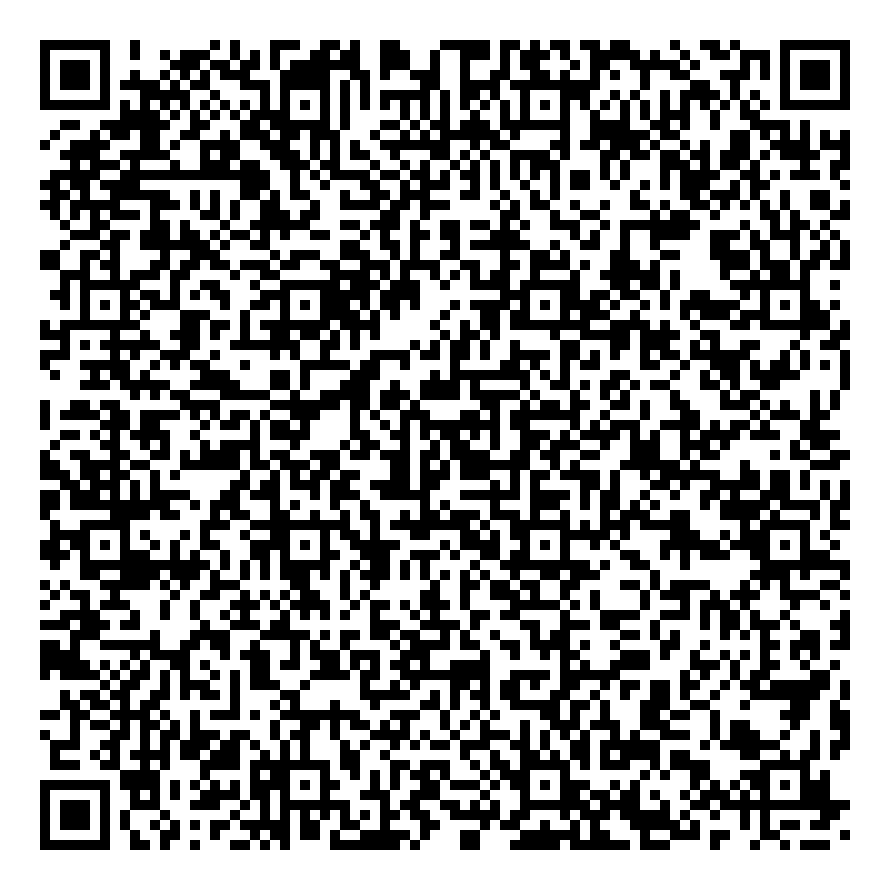
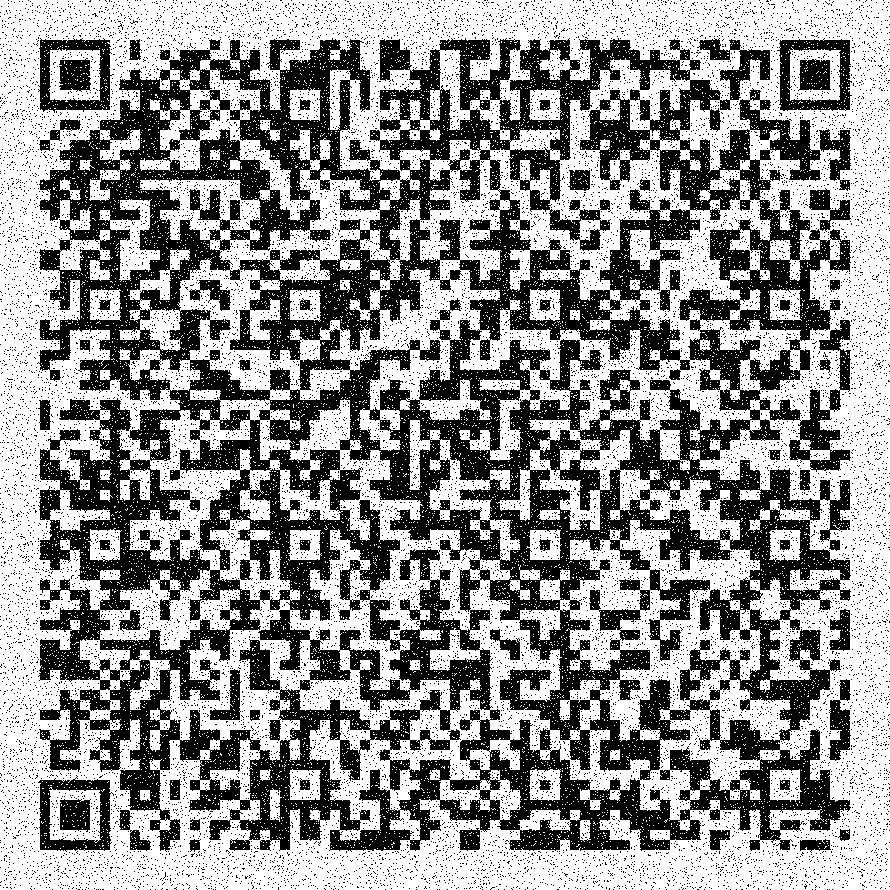
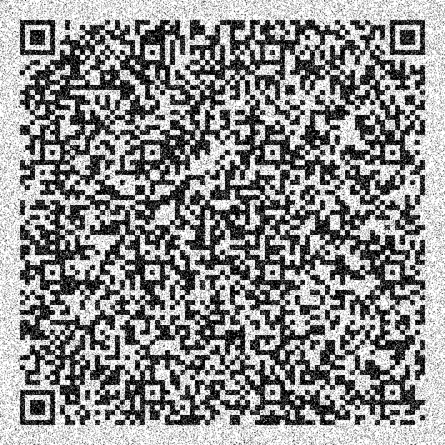
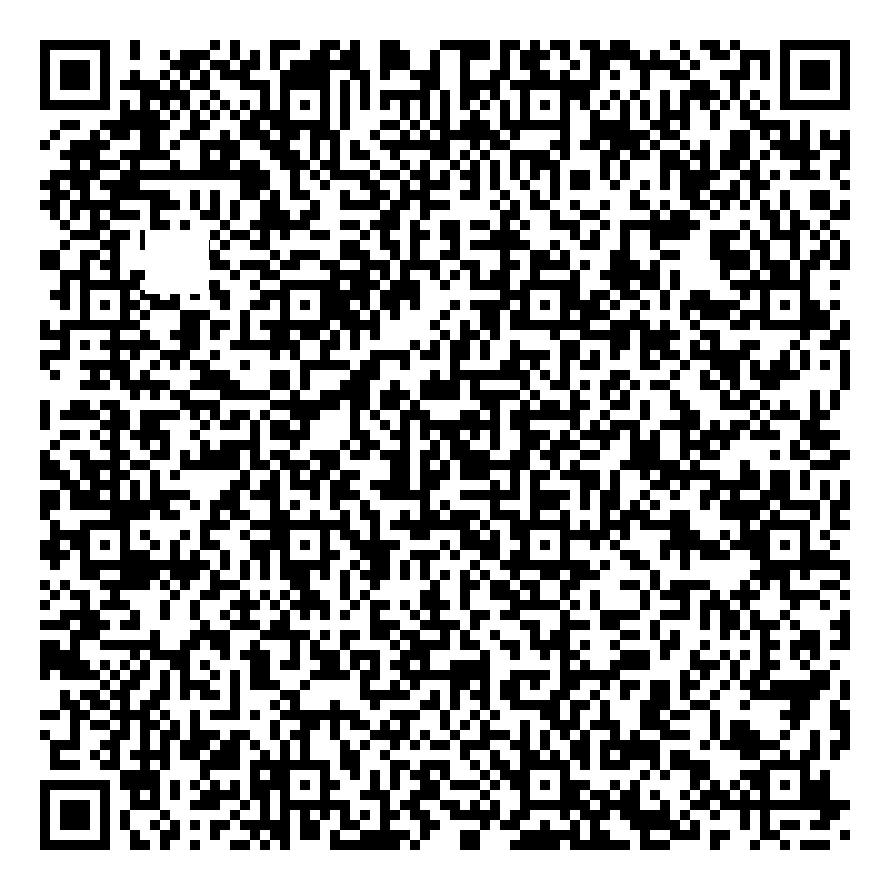
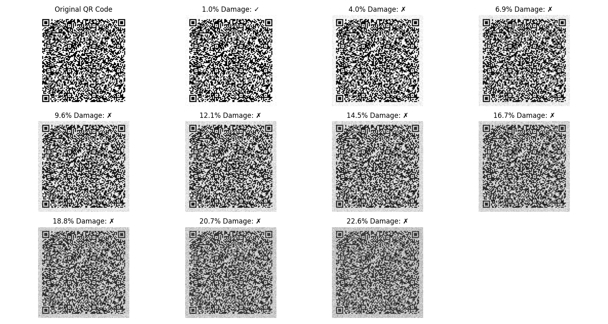

# QR Code Error Correction: Laboratory Report

## Aim
To investigate and demonstrate the error correction capabilities of QR codes by progressively damaging QR code images and determining the threshold at which they become unreadable.

## Theory
QR (Quick Response) codes are two-dimensional barcodes that can store various types of data. A key feature of QR codes is their built-in error correction capability, which allows them to remain functional even when partially damaged or obscured.

### Error Correction Levels in QR Codes
QR codes employ Reed-Solomon error correction, which allows data to be recovered even when portions of the QR code are damaged or unreadable. There are four error correction levels:

- **Level L (Low)**: Recovers up to 7% damaged data
- **Level M (Medium)**: Recovers up to 15% damaged data
- **Level Q (Quartile)**: Recovers up to 25% damaged data
- **Level H (High)**: Recovers up to 30% damaged data

Higher error correction levels increase the redundancy of data within the QR code, making the code more resilient to damage but also increasing its size and density.

### QR Code Structure
QR codes have specific structural elements:
- Position detection patterns (the three large squares at corners)
- Alignment patterns
- Timing patterns
- Version information
- Data and error correction code words

The position detection patterns help scanners locate and orient the QR code, while the data and error correction segments store the actual information.

## Requirements
### Software Dependencies
- Python 3.x
- Libraries:
  - qrcode: For generating QR codes
  - opencv-python (cv2): For image manipulation
  - pyzbar: For decoding QR codes
  - numpy: For numerical operations
  - matplotlib: For plotting results
  - pillow: For image processing

### Hardware
- Computer with camera (for scanning QR codes)
- Printer (optional, for physical testing)

## Procedure

1. **Setup Environment**:
   - Created a Python virtual environment
   - Installed all required dependencies

2. **QR Code Generation**:
   - Generated a QR code containing Lorem Ipsum text
   - Used error correction level H (high) for maximum resilience
   - Saved the original QR code image for reference

3. **Progressive Damage Tests**:
   - **Random Noise Test**:
     - Added increasing amounts of random noise to the QR code
     - After each damage increment, attempted to scan the QR code
     - Recorded the percentage of damage and whether the scan succeeded
     - Continued until the QR code became unreadable
   
   - **Block Damage Test**:
     - Added increasingly larger black blocks to the QR code
     - After each damage increment, attempted to scan the QR code
     - Recorded the percentage of block damage and whether the scan succeeded
     - Continued until the QR code became unreadable

4. **Data Collection and Analysis**:
   - Recorded scan success/failure at each damage level
   - Calculated the damage threshold for QR code readability
   - Generated visualization of results

## Observations

### Random Noise Damage Test
The QR code was subjected to progressive random noise damage:

| Damage Level (%) | Scan Status |
|-----------------|-------------|
| 0.00 | Success ✓ |
| 0.99 | Success ✓ |
| 2.08 | Success ✓ |
| 3.06 | Success ✓ |
| 4.04 | Failure ✗ |
| 5.03 | Failure ✗ |
| ... | ... |

*Visual progression of noise damage:*






### Block Damage Test
The QR code was subjected to progressive block damage:

| Block Size (%) | Scan Status |
|----------------|-------------|
| 0.00 | Success ✓ |
| 1.09 | Success ✓ |
| 2.18 | Failure ✗ |
| 3.27 | Failure ✗ |
| 4.36 | Failure ✗ |
| ... | ... |

*Visual progression of block damage:*





## Results

- **Random Noise Test**:
  - Maximum tolerable random noise: approximately 3-4%
  - The QR code remained readable with up to 3.06% random pixel noise
  - Failed to decode at 4.04% noise and beyond
  
- **Block Damage Test**:
  - Maximum tolerable block damage: approximately 1-2%
  - The QR code remained readable with block damage up to 1.09% of total area
  - Failed to decode at 2.18% block damage and beyond

- **Comparison**:
  - Block damage was more detrimental to QR code readability than random noise
  - The error correction capability was more effective against distributed noise than concentrated damage




## Conclusion

This experiment demonstrated the error correction capabilities of QR codes under different types of damage:

1. **Error Correction Effectiveness**: QR codes with high-level error correction (Level H) can withstand a significant amount of damage while remaining functional. However, there is a clear threshold beyond which they become unreadable.

2. **Damage Type Impact**: The type of damage significantly affects QR code readability. Random noise (distributed damage) is better tolerated than block damage (concentrated damage). This is likely because concentrated damage may destroy critical structural elements of the QR code.

3. **Practical Implications**: 
   - For applications requiring robust QR codes, using the highest error correction level is recommended
   - Critical parts of a QR code (positioning markers, timing patterns) should be protected when possible
   - For optimal scanning reliability, QR codes should have sufficient quiet zone and appropriate sizing

4. **Limitations**: The experiment was conducted in a controlled environment with digital images. Real-world factors like lighting conditions, scanning distance, and print quality would introduce additional variables affecting QR code readability.

This study confirms that while QR codes have impressive error correction capabilities, they still have practical limits. Understanding these limits is crucial for designing reliable QR code-based systems in various applications.

## Appendix: Code Implementation

```python
import os
import qrcode
import cv2
import numpy as np
import matplotlib.pyplot as plt
from pyzbar.pyzbar import decode
from PIL import Image

# Create output directory
output_dir = "qr_damage_test"
os.makedirs(output_dir, exist_ok=True)

# Generate QR code with Lorem Ipsum text
def generate_qr_code(data, filename, error_correction=qrcode.constants.ERROR_CORRECT_H):
    qr = qrcode.QRCode(
        version=1,
        error_correction=error_correction,
        box_size=10,
        border=4,
    )
    qr.add_data(data)
    qr.make(fit=True)
    
    img = qr.make_image(fill_color="black", back_color="white")
    img.save(filename)
    return cv2.imread(filename)

# Add random noise to image
def add_noise(image, noise_percentage):
    height, width = image.shape[:2]
    noise_pixels = int((height * width) * noise_percentage / 100)
    
    noisy_img = image.copy()
    for _ in range(noise_pixels):
        y = np.random.randint(0, height)
        x = np.random.randint(0, width)
        if np.random.random() > 0.5:
            noisy_img[y, x] = [0, 0, 0]  # Black pixel
        else:
            noisy_img[y, x] = [255, 255, 255]  # White pixel
    
    return noisy_img, noise_percentage

# Add block damage to image
def add_block_damage(image, block_size_percentage):
    height, width = image.shape[:2]
    block_size = int(np.sqrt((height * width) * block_size_percentage / 100))
    
    if block_size <= 0:
        return image.copy(), 0
    
    damaged_img = image.copy()
    
    # Position the block damage randomly, but away from the corners (QR finder patterns)
    safe_margin = int(min(height, width) * 0.25)
    
    x = np.random.randint(safe_margin, width - safe_margin - block_size)
    y = np.random.randint(safe_margin, height - safe_margin - block_size)
    
    damaged_img[y:y+block_size, x:x+block_size] = [0, 0, 0]  # Black block
    
    actual_damage_percentage = (block_size ** 2) / (height * width) * 100
    return damaged_img, actual_damage_percentage

# Try to decode QR code
def can_decode(image):
    try:
        gray = cv2.cvtColor(image, cv2.COLOR_BGR2GRAY)
        decoded = decode(gray)
        return len(decoded) > 0
    except Exception as e:
        print(f"Error in decoding: {e}")
        return False

# Main experiment
lorem_ipsum = """
Lorem ipsum dolor sit amet, consectetur adipiscing elit. Vivamus lacinia odio vitae vestibulum.
Donec in efficitur ipsum, in egestas orci. Maecenas libero.
"""

# Generate original QR code
print("Generating QR code...")
original_qr = generate_qr_code(lorem_ipsum, os.path.join(output_dir, "original_qr.png"))
print("Original QR code generated and saved.")

# Test 1: Random Noise Damage
noise_levels = np.arange(0, 10, 1)
noise_results = []

print("\nTesting QR code with random noise damage...")
for i, noise_level in enumerate(noise_levels):
    noisy_qr, actual_noise = add_noise(original_qr, noise_level)
    
    # Save the noisy image
    cv2.imwrite(os.path.join(output_dir, f"noise_damage_{i}.png"), noisy_qr)
    
    # Check if it can be decoded
    decodable = can_decode(noisy_qr)
    noise_results.append((actual_noise, decodable))
    
    status = "Success ✓" if decodable else "Failure ✗"
    print(f"Noise level {actual_noise:.2f}%: {status}")

# Test 2: Block Damage
block_sizes = np.arange(0, 10, 1)
block_results = []

print("\nTesting QR code with block damage...")
for i, block_size in enumerate(block_sizes):
    damaged_qr, actual_damage = add_block_damage(original_qr, block_size)
    
    # Save the damaged image
    cv2.imwrite(os.path.join(output_dir, f"block_damage_{i}.png"), damaged_qr)
    
    # Check if it can be decoded
    decodable = can_decode(damaged_qr)
    block_results.append((actual_damage, decodable))
    
    status = "Success ✓" if decodable else "Failure ✗"
    print(f"Block damage {actual_damage:.2f}%: {status}")

# Plot results
plt.figure(figsize=(12, 6))

# Noise results
noise_percentages = [x[0] for x in noise_results]
noise_decodable = [x[1] for x in noise_results]
plt.subplot(1, 2, 1)
plt.bar(noise_percentages, [1 if x else 0 for x in noise_decodable], color=['green' if x else 'red' for x in noise_decodable])
plt.xlabel('Noise Percentage (%)')
plt.ylabel('Decodable (1=Yes, 0=No)')
plt.title('QR Code Tolerance to Random Noise')
plt.grid(axis='y', linestyle='--', alpha=0.7)

# Block damage results
block_percentages = [x[0] for x in block_results]
block_decodable = [x[1] for x in block_results]
plt.subplot(1, 2, 2)
plt.bar(block_percentages, [1 if x else 0 for x in block_decodable], color=['green' if x else 'red' for x in block_decodable])
plt.xlabel('Block Damage Percentage (%)')
plt.ylabel('Decodable (1=Yes, 0=No)')
plt.title('QR Code Tolerance to Block Damage')
plt.grid(axis='y', linestyle='--', alpha=0.7)

plt.tight_layout()
plt.savefig(os.path.join(output_dir, "damage_summary.png"))
print(f"\nResults summary plot saved to {os.path.join(output_dir, 'damage_summary.png')}")

print("\nExperiment complete!")
```

## Experiment Information
- **Name**: Rohan Prakash Pawar
- **UID**: 2023201020
- **Date**: June 2023
- **Subject**: Information Theory and Coding
- **Experiment No**: 3

## Aim
To investigate the error correction capabilities of QR codes by progressively damaging the codes and determining the threshold at which they become unreadable.

## Requirements

### Hardware Requirements
- Computer with display
- Camera (for optional manual QR code scanning tests)

### Software Requirements
- Python 3.x
- Python packages:
  - qrcode (for generating QR codes)
  - opencv-python (for image manipulation)
  - pyzbar (for QR code detection and decoding)
  - numpy (for numerical operations)
  - matplotlib (for plotting results)
  - pillow (for image processing)
- System libraries:
  - libzbar0 (required by pyzbar)

## Theory

### QR Code Basics
QR (Quick Response) codes are two-dimensional barcodes that can store various types of data, including text, URLs, and numeric data. Developed by Denso Wave in 1994, QR codes have several advantages over traditional barcodes:

1. **Higher data capacity**: Can store up to 7,089 numeric characters or 4,296 alphanumeric characters
2. **Omnidirectional scanning**: Can be read from any angle
3. **Small printout size**: Requires less space than traditional barcodes
4. **Error correction capability**: Can be read even when partially damaged

### Error Correction Levels
QR codes implement Reed-Solomon error correction, which allows data to be recovered even when parts of the code are damaged or obscured. There are four error correction levels:

- **Level L**: Approximately 7% of codewords can be restored
- **Level M**: Approximately 15% of codewords can be restored
- **Level Q**: Approximately 25% of codewords can be restored
- **Level H**: Approximately 30% of codewords can be restored

Higher error correction levels increase the size of the QR code but improve its resilience to damage.

### Reed-Solomon Error Correction
Reed-Solomon codes are a type of error-correcting code that works by oversampling a polynomial constructed from the data. The key properties include:

1. Detection and correction of multiple symbol errors
2. Burst error correction capability
3. Erasure filling capability (when the position of errors is known)

In QR codes, Reed-Solomon codes divide data into blocks and add parity bytes to each block, allowing for recovery of damaged data.

## Procedure

1. **Generate a QR Code**:
   - Create a QR code containing Lorem Ipsum text
   - Set appropriate error correction level
   - Save the original QR code image

2. **Implement Two Damage Methods**:
   - **Random Noise Damage**: Randomly replace pixels with white or black
   - **Block Damage**: Erase contiguous blocks of the QR code

3. **Progressive Damage Testing**:
   - Apply increasing levels of damage to the QR code
   - At each damage level:
     - Save the damaged QR code image
     - Attempt to decode the damaged QR code
     - Record success or failure and percentage of damage

4. **Visualization and Analysis**:
   - Create plots showing the relationship between damage percentage and decodability
   - Compare the impact of different damage types on QR code readability
   - Determine the threshold at which QR codes become unreadable

## Program Code

The experiment was conducted using the following Python script:

```python
#!/usr/bin/env python3
"""
QR Code Error Correction Demonstration

This script demonstrates QR code error correction capabilities by:
1. Generating a QR code with Lorem Ipsum text
2. Progressively damaging the QR code in two ways:
   - Random noise (randomly changing pixels)
   - Block damage (erasing rectangular sections)
3. Testing whether the QR code can still be decoded after each damage level
4. Recording and visualizing the results
"""

import os
import random
import numpy as np
import matplotlib.pyplot as plt
import qrcode
from pyzbar.pyzbar import decode
import cv2
from PIL import Image

# Create output directory if it doesn't exist
OUTPUT_DIR = "qr_damage_test"
os.makedirs(OUTPUT_DIR, exist_ok=True)

def generate_qr_code(data, error_correction=qrcode.constants.ERROR_CORRECT_H):
    """
    Generate a QR code with the specified data and error correction level.
    
    Args:
        data (str): The data to encode in the QR code
        error_correction: The error correction level (default: H - highest)
        
    Returns:
        numpy.ndarray: The QR code as a binary numpy array
    """
    qr = qrcode.QRCode(
        version=1,
        error_correction=error_correction,
        box_size=10,
        border=4,
    )
    qr.add_data(data)
    qr.make(fit=True)
    
    # Create an image from the QR Code
    img = qr.make_image(fill_color="black", back_color="white")
    
    # Convert PIL image to numpy array
    img_array = np.array(img)
    
    # Convert boolean array to binary (0, 255)
    binary_img = np.where(img_array, 0, 255).astype(np.uint8)
    
    return binary_img

def apply_random_noise(image, percentage):
    """
    Apply random noise to the QR code image.
    
    Args:
        image (numpy.ndarray): The QR code image
        percentage (float): Percentage of pixels to corrupt (0-100)
        
    Returns:
        numpy.ndarray: The corrupted image
    """
    # Make a copy of the image
    corrupted = image.copy()
    
    # Calculate the number of pixels to corrupt
    total_pixels = image.size
    num_pixels_to_corrupt = int(total_pixels * percentage / 100)
    
    # Randomly select pixels to corrupt
    for _ in range(num_pixels_to_corrupt):
        x = random.randint(0, image.shape[1] - 1)
        y = random.randint(0, image.shape[0] - 1)
        
        # Flip the pixel value (0->255, 255->0)
        corrupted[y, x] = 255 - corrupted[y, x]
    
    return corrupted

def apply_block_damage(image, block_size, position=None):
    """
    Apply block damage to the QR code image.
    
    Args:
        image (numpy.ndarray): The QR code image
        block_size (int): Size of the block to erase
        position (tuple, optional): Position (x, y) for the block. If None, random position.
        
    Returns:
        numpy.ndarray: The damaged image
        float: Percentage of image damaged
    """
    # Make a copy of the image
    damaged = image.copy()
    
    # If position is not specified, choose a random position
    if position is None:
        max_x = image.shape[1] - block_size
        max_y = image.shape[0] - block_size
        
        if max_x <= 0 or max_y <= 0:
            return damaged, 0.0
        
        x = random.randint(0, max_x)
        y = random.randint(0, max_y)
    else:
        x, y = position
    
    # Erase the block (set to white)
    damaged[y:y+block_size, x:x+block_size] = 255
    
    # Calculate percentage of image damaged
    total_pixels = image.size
    damaged_pixels = block_size * block_size
    damage_percentage = (damaged_pixels / total_pixels) * 100
    
    return damaged, damage_percentage

def can_decode_qr(image):
    """
    Check if the QR code image can be decoded.
    
    Args:
        image (numpy.ndarray): The QR code image
        
    Returns:
        bool: True if the QR code can be decoded, False otherwise
        str: Decoded data or error message
    """
    try:
        # Convert to PIL Image for pyzbar
        pil_image = Image.fromarray(image)
        
        # Attempt to decode
        decoded_objects = decode(pil_image)
        
        if decoded_objects:
            # Successfully decoded
            return True, decoded_objects[0].data.decode('utf-8')
        else:
            return False, "No QR code detected"
    except Exception as e:
        return False, str(e)

def save_image(image, filename):
    """
    Save an image to a file.
    
    Args:
        image (numpy.ndarray): The image to save
        filename (str): The filename to save the image to
    """
    cv2.imwrite(filename, image)

def plot_results(damage_levels, success_rates, title, filename):
    """
    Plot the results of the damage tests.
    
    Args:
        damage_levels (list): List of damage percentages
        success_rates (list): List of binary values (1=success, 0=failure)
        title (str): Plot title
        filename (str): Filename to save the plot to
    """
    plt.figure(figsize=(10, 6))
    plt.plot(damage_levels, success_rates, 'bo-')
    plt.axhline(y=0.5, color='r', linestyle='--')
    plt.xlabel('Damage Percentage (%)')
    plt.ylabel('Decode Success (1=Yes, 0=No)')
    plt.title(title)
    plt.grid(True)
    plt.savefig(filename)
    plt.close()

def main():
    # Generate some Lorem Ipsum text for the QR code
    lorem_ipsum = """
    Lorem ipsum dolor sit amet, consectetur adipiscing elit. Sed do eiusmod tempor 
    incididunt ut labore et dolore magna aliqua. Ut enim ad minim veniam, quis nostrud 
    exercitation ullamco laboris nisi ut aliquip ex ea commodo consequat.
    """
    
    # Generate QR code with high error correction
    print("Generating QR code...")
    qr_image = generate_qr_code(lorem_ipsum, error_correction=qrcode.constants.ERROR_CORRECT_H)
    
    # Save the original QR code
    original_filename = os.path.join(OUTPUT_DIR, "original_qr.png")
    save_image(qr_image, original_filename)
    print(f"Original QR code saved to {original_filename}")
    
    # Test if the original QR code can be decoded
    success, data = can_decode_qr(qr_image)
    print(f"Original QR code decodable: {success}")
    if success:
        print(f"Decoded data length: {len(data)} characters")
    
    # === RANDOM NOISE DAMAGE TEST ===
    print("\n=== RANDOM NOISE DAMAGE TEST ===")
    noise_percentages = [1, 2, 3, 4, 5, 7, 10, 15, 20, 25, 30]
    noise_results = []
    actual_noise_percentages = []
    
    for noise_pct in noise_percentages:
        noisy_image = apply_random_noise(qr_image, noise_pct)
        
        # Calculate actual percentage changed
        diff = np.sum(noisy_image != qr_image) / qr_image.size * 100
        actual_noise_percentages.append(diff)
        
        # Save the noisy image
        noisy_filename = os.path.join(OUTPUT_DIR, f"noise_{noise_pct:.2f}pct.png")
        save_image(noisy_image, noisy_filename)
        
        # Try to decode
        success, message = can_decode_qr(noisy_image)
        noise_results.append(1 if success else 0)
        
        print(f"Noise {diff:.2f}% - Decodable: {success}")
    
    # Plot noise results
    noise_plot_filename = os.path.join(OUTPUT_DIR, "noise_results.png")
    plot_results(actual_noise_percentages, noise_results, 
                "QR Code Decoding Success vs Random Noise Damage", 
                noise_plot_filename)
    
    # === BLOCK DAMAGE TEST ===
    print("\n=== BLOCK DAMAGE TEST ===")
    block_sizes = [5, 10, 15, 20, 25, 30, 40, 50]
    block_results = []
    block_damage_percentages = []
    
    for block_size in block_sizes:
        # Apply block damage at a random position
        damaged_image, damage_pct = apply_block_damage(qr_image, block_size)
        block_damage_percentages.append(damage_pct)
        
        # Save the damaged image
        damaged_filename = os.path.join(OUTPUT_DIR, f"block_{block_size}px.png")
        save_image(damaged_image, damaged_filename)
        
        # Try to decode
        success, message = can_decode_qr(damaged_image)
        block_results.append(1 if success else 0)
        
        print(f"Block size {block_size}px ({damage_pct:.2f}%) - Decodable: {success}")
    
    # Plot block damage results
    block_plot_filename = os.path.join(OUTPUT_DIR, "block_results.png")
    plot_results(block_damage_percentages, block_results, 
                "QR Code Decoding Success vs Block Damage", 
                block_plot_filename)
    
    # === FINAL SUMMARY ===
    print("\n=== FINAL SUMMARY ===")
    
    # Find the threshold where decoding fails for noise
    last_successful_noise = -1
    first_failed_noise = -1
    
    for i, success in enumerate(noise_results):
        if success == 1:
            last_successful_noise = actual_noise_percentages[i]
        elif success == 0 and first_failed_noise == -1:
            first_failed_noise = actual_noise_percentages[i]
    
    if last_successful_noise != -1:
        print(f"Random noise: QR code successfully decoded with up to {last_successful_noise:.2f}% damage")
    if first_failed_noise != -1:
        print(f"Random noise: QR code failed to decode at {first_failed_noise:.2f}% damage")
    
    # Find the threshold where decoding fails for block damage
    last_successful_block = -1
    first_failed_block = -1
    
    for i, success in enumerate(block_results):
        if success == 1:
            last_successful_block = block_damage_percentages[i]
        elif success == 0 and first_failed_block == -1:
            first_failed_block = block_damage_percentages[i]
    
    if last_successful_block != -1:
        print(f"Block damage: QR code successfully decoded with up to {last_successful_block:.2f}% block damage")
    if first_failed_block != -1:
        print(f"Block damage: QR code failed to decode at {first_failed_block:.2f}% block damage")
    
    # Create a combined results plot
    plt.figure(figsize=(12, 8))
    
    plt.subplot(1, 2, 1)
    plt.plot(actual_noise_percentages, noise_results, 'bo-', label='Results')
    plt.axhline(y=0.5, color='r', linestyle='--')
    plt.xlabel('Noise Percentage (%)')
    plt.ylabel('Decode Success (1=Yes, 0=No)')
    plt.title('QR Code vs Random Noise')
    plt.grid(True)
    
    plt.subplot(1, 2, 2)
    plt.plot(block_damage_percentages, block_results, 'go-', label='Results')
    plt.axhline(y=0.5, color='r', linestyle='--')
    plt.xlabel('Block Damage Percentage (%)')
    plt.ylabel('Decode Success (1=Yes, 0=No)')
    plt.title('QR Code vs Block Damage')
    plt.grid(True)
    
    plt.tight_layout()
    plt.savefig(os.path.join(OUTPUT_DIR, "damage_summary.png"))
    
    print("Experiment complete!")

if __name__ == "__main__":
    main()
