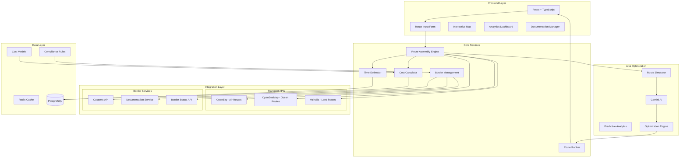
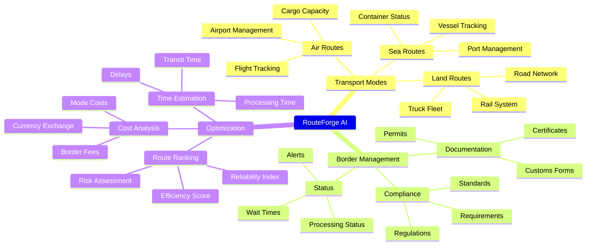
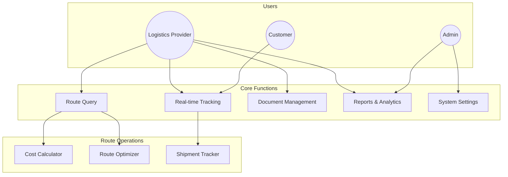
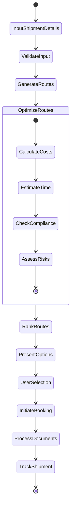
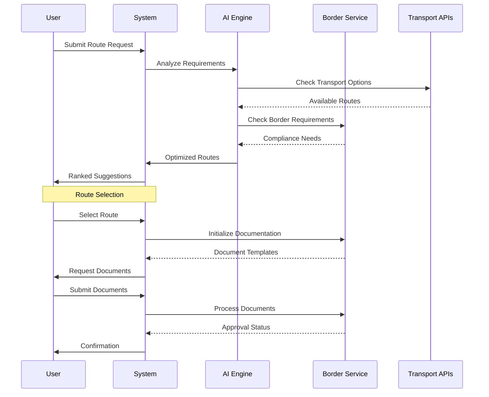
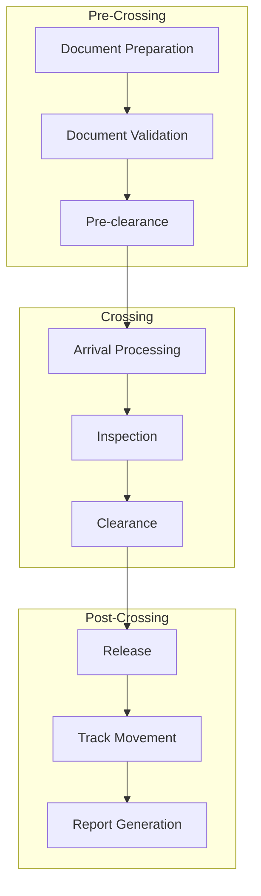
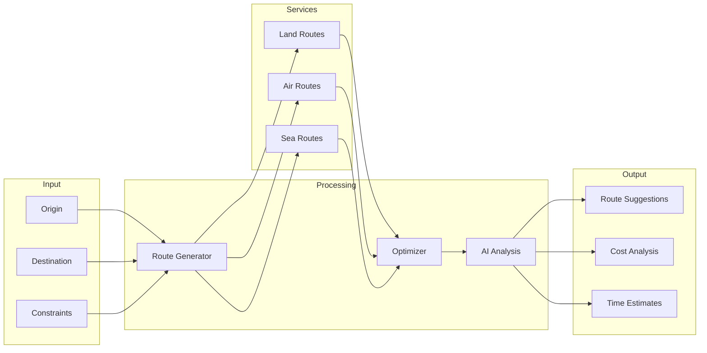
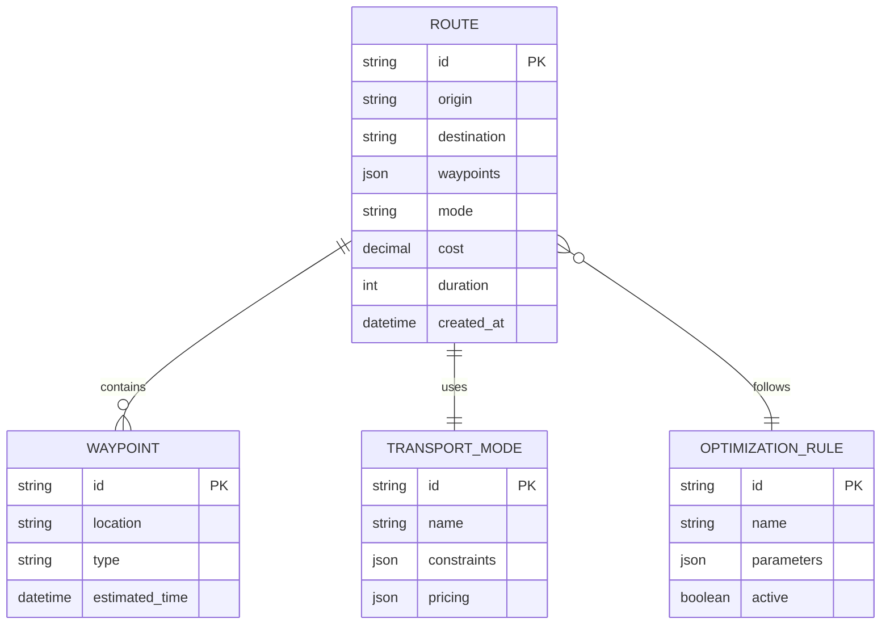
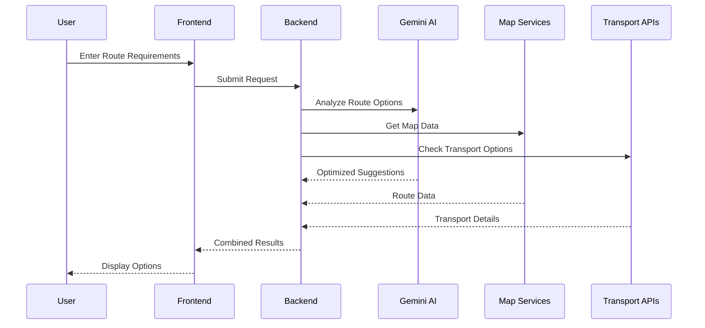

# RouteForge AI - Intelligent Multi-Modal Cross-Border Route Optimization Platform

## Executive Summary

RouteForge AI is a specialized cross-border logistics optimization platform designed for small logistics providers. The platform combines multi-modal transportation options (air, sea, land) with intelligent border crossing management to provide optimal route suggestions based on cost, time, and compliance requirements. Using advanced AI and real-time data, it simplifies complex international shipping decisions into actionable insights.

## Problem Statement

Small logistics providers face significant challenges in optimizing cross-border shipping routes:

1. **Multi-Modal Complexity**
- Difficulty in combining different transport modes
- Limited visibility into intermodal connection points
- Complex cost structures across modes
- Variable transit times

2. **Border Crossing Challenges**
- Documentation requirements vary by country
- Unpredictable customs clearance times
- Complex regulatory compliance needs
- Multiple stakeholder coordination

3. **Optimization Needs**
- Cost vs time trade-offs
- Real-time route adjustments
- Documentation management
- Compliance verification

## System Architecture 



## System Diagrams and Workflows

### Mind Map



### Use Case Diagram



### Workflow Diagram



### Route Optimization Flow



### Border Crossing Process



### Data Flow Diagram



### ER Diagram



### Component Interaction



## Technical Implementation

### Frontend Components

```typescript
// Core components using shadcn/ui
import {
Button,
Dialog,
DropdownMenu,
Form,
Input,
Select,
Tabs,
Card
} from "@/components/ui"

// React Query hooks
const useRoutes = () => {
return useQuery({
    queryKey: ['routes'],
    queryFn: () => fetchRoutes()
})
}

// Map integration
const MapComponent = () => {
return (
    <MapContainer center={[0, 0]} zoom={2}>
    <TileLayer url="https://{s}.tile.openstreetmap.org/{z}/{x}/{y}.png" />
    {/* Route layers */}
    </MapContainer>
)
}
```

### Database Schema

```prisma
model Route {
id          String      @id @default(cuid())
origin      String
destination String
waypoints   Json[]
mode        String
cost        Decimal
duration    Int
createdAt   DateTime    @default(now())
updatedAt   DateTime    @updatedAt
}

model TransportMode {
id          String      @id @default(cuid())
name        String
constraints Json
pricing     Json
routes      Route[]
}
```

## Feature List

### Core Features
- Multi-modal route optimization
- Real-time tracking and updates
- Cost optimization
- AI-powered route suggestions
- Interactive map visualization
- Analytics dashboard

### AI Capabilities
- Route pattern analysis
- Predictive timing
- Cost optimization
- Risk assessment
- Weather impact analysis

## API Integration Details

### Gemini AI Integration
```python
from google.cloud import aiplatform

def analyze_route(origin: str, destination: str, constraints: dict):
    response = model.predict(
        prompt=f"""
        Analyze optimal route between:
        Origin: {origin}
        Destination: {destination}
        Constraints: {constraints}
        Suggest routes based on historical patterns and current conditions.
        """
    )
    return response
```

### Maps & Navigation
```typescript
// OpenStreetMap & Valhalla
const getRoute = async (origin: LatLng, destination: LatLng) => {
const response = await fetch(`${VALHALLA_URL}/route`, {
    method: 'POST',
    body: JSON.stringify({
    locations: [origin, destination],
    costing: 'auto',
    directions_options: { units: 'km' }
    })
});
return await response.json();
}
```

## Development Guidelines

### Code Structure
```
src/
components/
    map/
    route/
    ui/
hooks/
    queries/
    mutations/
lib/
    api.ts
    prisma.ts
pages/
styles/
```

### Performance Optimization
- Implement Redis caching for frequent routes
- Use React Query for data caching
- Optimize map tile loading
- Implement lazy loading for components

### Security Measures
- API rate limiting
- Request validation
- JWT authentication
- HTTPS encryption
- Data encryption at rest

