## Table of Contents
- [1. Executive Summary](#1-executive-summary)
- [2. Problem Statement](#2-problem-statement)
- [3. Architecture Overview](#3-architecture-overview)
- [4. Core Components](#4-core-components)
- [5. AnomaAgent: Intelligent Monitoring](#5-anomaagent-intelligent-monitoring)
- [6. AnomaAPIPolicy: Security Framework](#6-anomaapipolicy-security-framework)
- [7. Component-Specific Architectures](#7-component-specific-architectures)
- [8. AI and LLM-Powered Capabilities](#8-ai-and-llm-powered-capabilities)
- [9. Implementation Roadmap](#9-implementation-roadmap)
- [10. Success Metrics](#10-success-metrics)
- [11. Conclusion](#11-conclusion)
- [7. Component-Specific Architectures](#7-component-specific-architectures)
- [8. Implementation Roadmap](#8-implementation-roadmap)
- [9. Success Metrics](#9-success-metrics)
- [10. Conclusion](#10-conclusion)

## 1. Executive Summary

AnomaSec provides a revolutionary AI-driven approach to API monitoring and anomaly detection for large-scale distributed platforms. By leveraging advanced machine learning algorithms and real-time analytics, AnomaSec transforms how organizations monitor, analyze, and secure their API ecosystems across on-premises, cloud, and multi-cloud environments.

Our solution introduces the groundbreaking **AnomaAgent** and **AnomaAPIPolicy** frameworks that work in tandem to deliver comprehensive visibility, intelligent anomaly detection, and automated remediation actions.

## 2. Problem Statement

### Challenge
Modern distributed systems span multiple environments (on-premises, cloud, multi-cloud) with complex API interactions generating massive volumes of log data. Traditional monitoring approaches fail to:

- Detect subtle patterns indicating potential issues
- Correlate events across distributed environments
- Predict cascading failures before they impact users
- Provide actionable alerts with context-rich information
- Automatically enforce security policies across diverse API landscapes

### Objectives
AnomaSec addresses these challenges through:

- Real-time anomaly detection across all API endpoints
- Cross-environment correlation of performance metrics
- Predictive analytics for potential failures
- Automated policy enforcement and remediation
- Comprehensive visualization and reporting

## 3. Architecture Overview

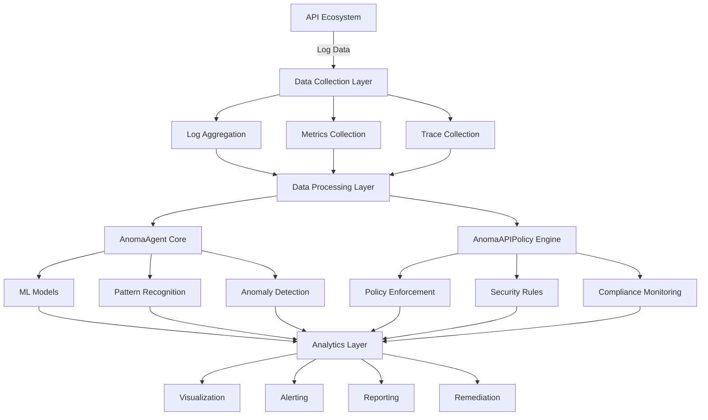
```mermaid
graph TD
    A[API Ecosystem] -->|Log Data| B[Data Collection Layer]
    B --> C[Log Aggregation]
    B --> D[Metrics Collection]
    B --> E[Trace Collection]
    
    C --> F[Data Processing Layer]
    D --> F
    E --> F
    
    F --> G[AnomaAgent Core]
    F --> H[AnomaAPIPolicy Engine]
    
    G --> I[ML Models]
    G --> J[Pattern Recognition]
    G --> K[Anomaly Detection]
    
    H --> L[Policy Enforcement]
    H --> M[Security Rules]
    H --> N[Compliance Monitoring]
    
    I --> O[Analytics Layer]
    J --> O
    K --> O
    L --> O
    M --> O
    N --> O
    
    O --> P[Visualization]
    O --> Q[Alerting]
    O --> R[Reporting]
    O --> S[Remediation]
```

## 4. Core Components

### 4.1 Data Collection Framework
- **OpenTelemetry Integration**: Standardized collection of logs, metrics, and traces
- **Multi-Environment Collectors**: Specialized agents for on-premises, AWS, Azure, and GCP
- **Log Enrichment Engine**: Augments logs with contextual metadata for enhanced analysis
- **Non-Intrusive Instrumentation**: Zero-code modification for legacy applications

### 4.2 Central Data Repository
- **Hybrid Storage Architecture**: Combining time-series database (TimescaleDB) for metrics and document store (Elasticsearch) for logs
- **Smart Data Partitioning**: Environment-based sharding for optimized query performance
- **Adaptive Retention Policies**: ML-driven data retention based on importance and anomaly potential
- **Data Governance Framework**: Automated compliance with data sovereignty requirements

### 4.3 AI/ML Analysis Engine
- **Ensemble Learning Models**: Combining supervised and unsupervised learning
- **Transfer Learning**: Pre-trained models adaptable to specific API behaviors
- **Federated Learning**: Distributed model training across environments
- **Explainable AI**: Transparency in anomaly detection decision making

### 4.4 Visualization & Alerting
- **Adaptive Dashboards**: Context-aware views based on user roles
- **Journey Maps**: Visual representation of cross-environment API calls
- **Smart Alerting**: Priority-based notification with automated escalation
- **Predictive Insights**: Proactive recommendations for performance optimization

## 5. AnomaAgent: Intelligent Monitoring

The **AnomaAgent** represents our breakthrough approach to distributed monitoring, combining edge intelligence with centralized analysis.

### 5.1 Core Capabilities
- **Self-Learning Behavior Profiles**: Each AnomaAgent builds dynamic baselines specific to its API endpoint, accounting for:
  - Diurnal patterns
  - Seasonal variations
  - Environment-specific constraints
  - Load characteristics

- **Edge Analytics**: Processes up to 95% of anomaly detection at the source, reducing central processing requirements

- **Swarm Intelligence**: Agents communicate and share insights across the distributed environment

- **Autonomous Adaptation**: Self-tunes detection thresholds based on feedback loops

### 5.2 Technical Implementation

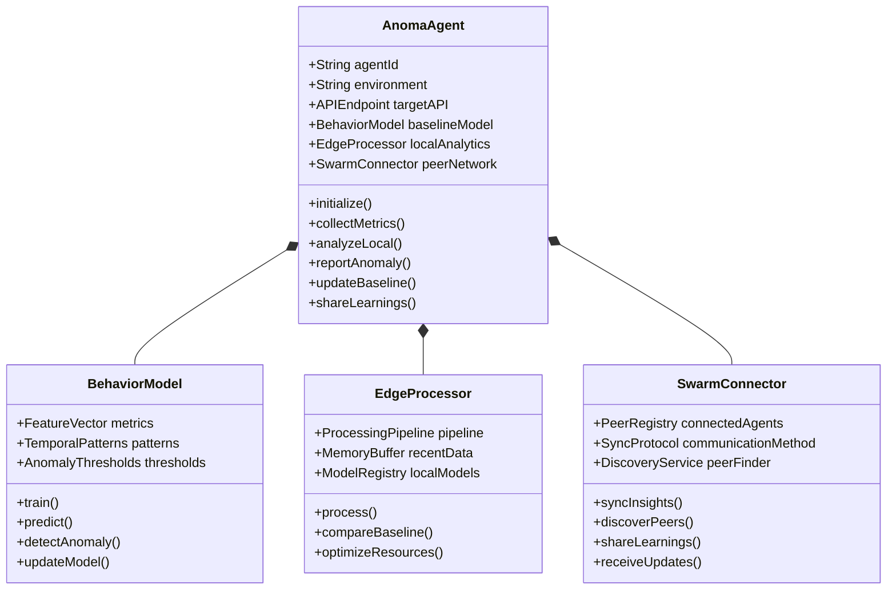
```mermaid
classDiagram
    class AnomaAgent {
        +String agentId
        +String environment
        +APIEndpoint targetAPI
        +BehaviorModel baselineModel
        +EdgeProcessor localAnalytics
        +SwarmConnector peerNetwork
        +initialize()
        +collectMetrics()
        +analyzeLocal()
        +reportAnomaly()
        +updateBaseline()
        +shareLearnings()
    }
    
    class BehaviorModel {
        +FeatureVector metrics
        +TemporalPatterns patterns
        +AnomalyThresholds thresholds
        +train()
        +predict()
        +detectAnomaly()
        +updateModel()
    }
    
    class EdgeProcessor {
        +ProcessingPipeline pipeline
        +MemoryBuffer recentData
        +ModelRegistry localModels
        +process()
        +compareBaseline()
        +optimizeResources()
    }
    
    class SwarmConnector {
        +PeerRegistry connectedAgents
        +SyncProtocol communicationMethod
        +DiscoveryService peerFinder
        +syncInsights()
        +discoverPeers()
        +shareLearnings()
        +receiveUpdates()
    }
    
    AnomaAgent *-- BehaviorModel
    AnomaAgent *-- EdgeProcessor
    AnomaAgent *-- SwarmConnector
```

### 5.3 Detection Mechanisms

#### Response Time Anomalies
- **Contextual Analysis**: Understanding normal vs. abnormal based on:
  - Time of day/week
  - User load profiles
  - Background processing
  - Infrastructure changes

- **Pattern Recognition**:
  - Gradual degradation detection
  - Step-change identification
  - Oscillation recognition
  - Correlation with dependent services

#### Error Rate Analysis
- **Error Categorization**:
  - Authentication failures
  - Authorization issues
  - Rate limiting triggers
  - Backend service failures
  - Data validation issues

- **Predictive Error Modeling**:
  - Early warning signals
  - Failure probability scoring
  - Impact assessment
  - Root cause suggestions

#### Cross-Environment Journey Tracking
- **Distributed Tracing Enhancement**:
  - Environment boundary detection
  - Latency attribution
  - Service dependency mapping
  - Bottleneck identification

## 6. AnomaAPIPolicy: Security Framework

The **AnomaAPIPolicy** framework provides an innovative approach to API security and governance across distributed environments.

### 6.1 Policy Architecture

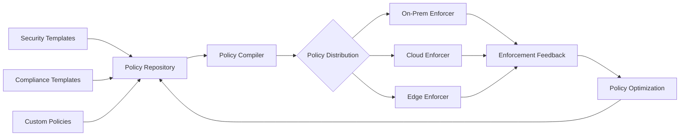
```mermaid
graph LR
    A[Policy Repository] --> B[Policy Compiler]
    B --> C{Policy Distribution}
    C --> D[On-Prem Enforcer]
    C --> E[Cloud Enforcer]
    C --> F[Edge Enforcer]
    
    G[Security Templates] --> A
    H[Compliance Templates] --> A
    I[Custom Policies] --> A
    
    D --> J[Enforcement Feedback]
    E --> J
    F --> J
    J --> K[Policy Optimization]
    K --> A
```

### 6.2 Key Security Features

#### Adaptive Authentication
- **Context-Aware Auth**: Adjusts authentication requirements based on:
  - Request source environment
  - Previous request patterns
  - Data sensitivity
  - Anomaly risk score

- **Zero-Trust Implementation**:
  - Continuous verification
  - Just-in-time privilege escalation
  - Least privilege enforcement
  - Risk-based step-up authentication

#### Behavioral Firewall
- **API Behavioral Fingerprinting**:
  - Normal usage patterns per client
  - Expected parameter ranges
  - Typical request sequences
  - Common data access patterns

- **Suspicious Activity Protection**:
  - Data exfiltration prevention
  - Parameter tampering detection
  - Abuse pattern recognition
  - Rate anomaly enforcement

#### Smart Rate Limiting
- **Dynamic Rate Thresholds**:
  - Per-client adjustable limits
  - ML-driven quota allocation
  - Business priority weighting
  - Predictive capacity planning

- **Graceful Degradation**:
  - Selective throttling
  - Tiered service reduction
  - Critical path preservation
  - Client-specific shaping

### 6.3 Log Collection and Analysis

The AnomaAPIPolicy incorporates an advanced log collection and analysis system with the following components:

#### Comprehensive Log Aggregation
- **Unified Log Format**: Standardized structure across all environments
- **Context Preservation**: Maintaining relationship between distributed logs
- **Metadata Enrichment**: Adding environmental context to each log entry
- **Semantic Tagging**: AI-driven categorization of log entries

#### Intelligent Log Processing
- **Stream Processing**: Real-time analysis of log data
- **Automated Normalization**: Converting varied log formats to standard schema
- **Correlation Engine**: Linking related events across services
- **Pattern Mining**: Extracting meaningful patterns from massive log volumes

#### Log-Driven Insights
- **Anomaly Context**: Detailed contextual information for each detected anomaly
- **Root Cause Analysis**: Automated investigation of underlying issues
- **Historical Comparison**: Benchmarking against previous incidents
- **Predictive Alerting**: Warning of potential issues based on log patterns

#### Compliance and Audit
- **Immutable Log Storage**: Tamper-proof recording of all API activities
- **Automated Compliance Reporting**: Pre-built reports for common frameworks
- **Access Audit Trails**: Comprehensive tracking of all data access
- **Retention Management**: Smart policies for log retention and archiving

## 9. Implementation Roadmap

### Phase 1: Foundation (Months 1-3)
- Set up base infrastructure for log collection
- Deploy initial AnomaAgents in test environments
- Implement core log processing pipeline
- Develop basic anomaly detection models
- Create initial dashboards and alerts

### Phase 2: Expansion (Months 4-6)
- Extend deployment to production environments
- Implement AnomaAPIPolicy framework
- Enable cross-environment correlation
- Develop advanced ML models for specific API types
- Create comprehensive visualization toolkit

### Phase 3: Advanced Capabilities (Months 7-9)
- Enable predictive analytics
- Implement automated remediation
- Deploy swarm intelligence features
- Integrate with existing ITSM systems
- Develop executive-level dashboards

### Phase 4: Optimization (Months 10-12)
- Refine ML models with production data
- Optimize performance and resource usage
- Implement advanced security features
- Develop custom templates for different API types
- Create comprehensive documentation and training

## 10. Success Metrics

### Performance Metrics
- 99.9% accuracy in anomaly detection
- <5% false positive rate
- 95% reduction in mean time to detect (MTTD)
- 90% reduction in mean time to resolve (MTTR)
- 99% of anomalies detected before user impact

### Business Impact
- 80% reduction in API-related outages
- 75% decrease in security incidents
- 50% improvement in developer productivity
- 40% reduction in operational costs
- 30% increase in API performance

### Implementation Metrics
- 100% API coverage across all environments
- <1% overhead on monitored systems
- 90% automation of routine monitoring tasks
- <10 minutes setup time for new APIs
- <5 minutes to identify root cause for any anomaly

## 11. Conclusion

AnomaSec represents a paradigm shift in how organizations monitor and secure their distributed API ecosystems. Through the innovative AnomaAgent and AnomaAPIPolicy frameworks, we provide unprecedented visibility, intelligence, and automation across complex multi-environment architectures.

By deploying AnomaSec, organizations can:
- Detect anomalies before they impact users
- Secure APIs with adaptive, context-aware policies
- Predict and prevent cascading failures
- Optimize performance across all environments
- Reduce operational overhead through intelligent automation

Our solution transforms API monitoring from a reactive necessity to a proactive strategic advantage, enabling organizations to deliver consistent, secure, and high-performing API experiences regardless of architectural complexity.

## 7. Component-Specific Architectures

### 7.1 End-to-End API Logs Correlator and Analyzer

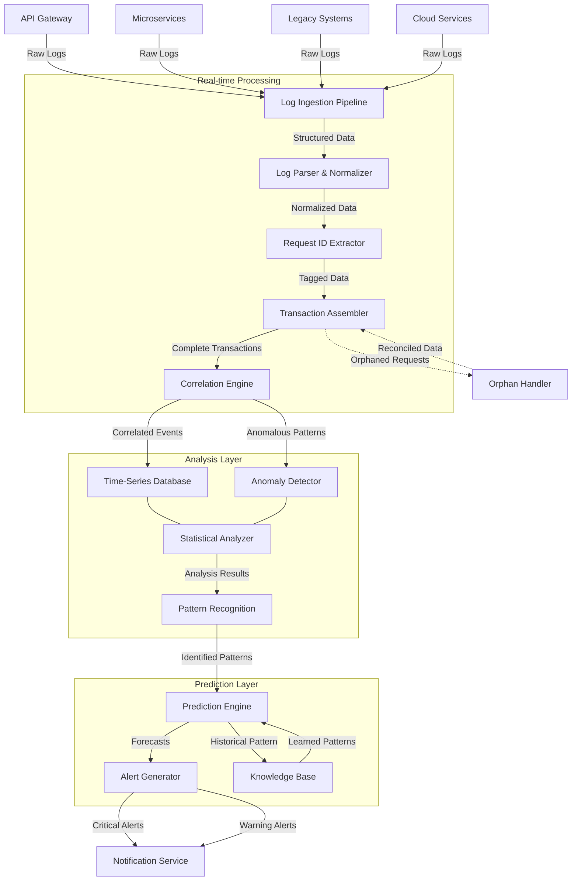
```mermaid
flowchart TD
    A[API Gateway] -->|Raw Logs| B[Log Ingestion Pipeline]
    Z[Microservices] -->|Raw Logs| B
    Y[Legacy Systems] -->|Raw Logs| B
    X[Cloud Services] -->|Raw Logs| B
    
    B -->|Structured Data| C[Log Parser & Normalizer]
    C -->|Normalized Data| D[Request ID Extractor]
    D -->|Tagged Data| E[Transaction Assembler]
    
    E -->|Complete Transactions| F[Correlation Engine]
    F -->|Correlated Events| G[Time-Series Database]
    F -->|Anomalous Patterns| H[Anomaly Detector]
    
    G --- I[Statistical Analyzer]
    H --- I
    I -->|Analysis Results| J[Pattern Recognition]
    
    J -->|Identified Patterns| K[Prediction Engine]
    K -->|Forecasts| L[Alert Generator]
    K -->|Historical Pattern| M[Knowledge Base]
    
    M -->|Learned Patterns| K
    L -->|Critical Alerts| N[Notification Service]
    L -->|Warning Alerts| N
    
    E -.->|Orphaned Requests| O[Orphan Handler]
    O -.->|Reconciled Data| E
    
    subgraph "Real-time Processing"
        B
        C
        D
        E
        F
    end
    
    subgraph "Analysis Layer"
        G
        H
        I
        J
    end
    
    subgraph "Prediction Layer"
        K
        L
        M
    end
```

### 7.2 API Benchmarking Across Environments

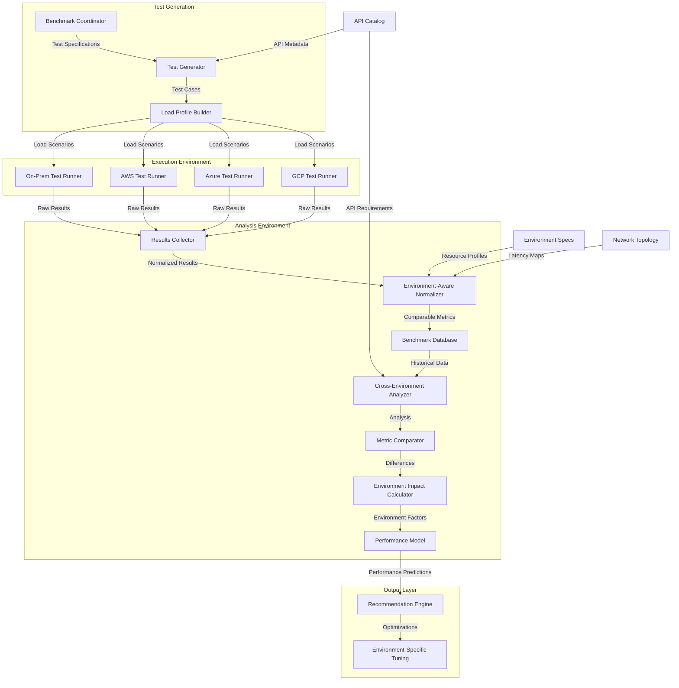
```mermaid
flowchart TD
    A[Benchmark Coordinator] -->|Test Specifications| B[Test Generator]
    B -->|Test Cases| C[Load Profile Builder]
    
    C -->|Load Scenarios| D[On-Prem Test Runner]
    C -->|Load Scenarios| E[AWS Test Runner]
    C -->|Load Scenarios| F[Azure Test Runner]
    C -->|Load Scenarios| G[GCP Test Runner]
    
    D -->|Raw Results| H[Results Collector]
    E -->|Raw Results| H
    F -->|Raw Results| H
    G -->|Raw Results| H
    
    H -->|Normalized Results| I[Environment-Aware Normalizer]
    I -->|Comparable Metrics| J[Benchmark Database]
    
    J -->|Historical Data| K[Cross-Environment Analyzer]
    K -->|Analysis| L[Metric Comparator]
    
    L -->|Differences| M[Environment Impact Calculator]
    M -->|Environment Factors| N[Performance Model]
    
    N -->|Performance Predictions| O[Recommendation Engine]
    O -->|Optimizations| P[Environment-Specific Tuning]
    
    Q[API Catalog] -->|API Metadata| B
    Q -->|API Requirements| K
    
    subgraph "Test Generation"
        A
        B
        C
    end
    
    subgraph "Execution Environment"
        D
        E
        F
        G
    end
    
    subgraph "Analysis Environment"
        H
        I
        J
        K
        L
        M
        N
    end
    
    subgraph "Output Layer"
        O
        P
    end
    
    R[Environment Specs] -->|Resource Profiles| I
    S[Network Topology] -->|Latency Maps| I
```

### 7.3 Anomaly Detection System

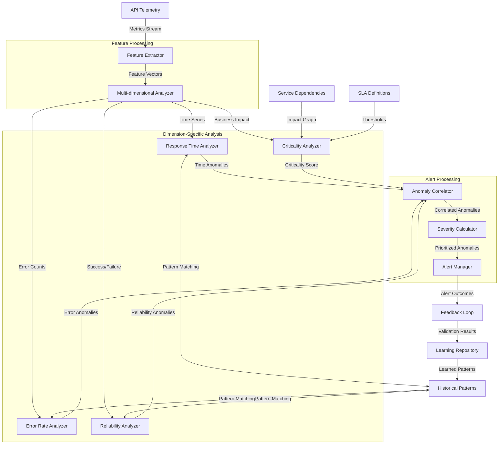
```mermaid
flowchart TD
    A[API Telemetry] -->|Metrics Stream| B[Feature Extractor]
    B -->|Feature Vectors| C[Multi-dimensional Analyzer]
    
    C -->|Time Series| D[Response Time Analyzer]
    C -->|Error Counts| E[Error Rate Analyzer]
    C -->|Success/Failure| F[Reliability Analyzer]
    C -->|Business Impact| G[Criticality Analyzer]
    
    D -->|Time Anomalies| H[Anomaly Correlator]
    E -->|Error Anomalies| H
    F -->|Reliability Anomalies| H
    G -->|Criticality Score| H
    
    H -->|Correlated Anomalies| I[Severity Calculator]
    I -->|Prioritized Anomalies| J[Alert Manager]
    
    K[Historical Patterns] <-->|Pattern Matching| D
    K <-->|Pattern Matching| E
    K <-->|Pattern Matching| F
    
    L[Service Dependencies] -->|Impact Graph| G
    M[SLA Definitions] -->|Thresholds| G
    
    subgraph "Feature Processing"
        B
        C
    end
    
    subgraph "Dimension-Specific Analysis"
        D
        E
        F
        G
    end
    
    subgraph "Alert Processing"
        H
        I
        J
    end
    
    N[Learning Repository] -->|Learned Patterns| K
    O[Feedback Loop] -->|Validation Results| N
    J -->|Alert Outcomes| O
```

### 7.4 Predictive Analysis System

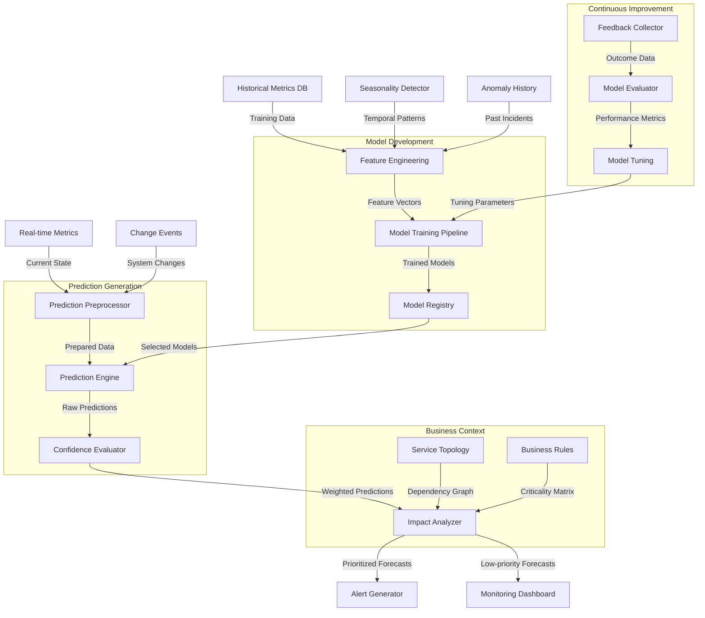
```mermaid
flowchart TD
    A[Historical Metrics DB] -->|Training Data| B[Feature Engineering]
    C[Real-time Metrics] -->|Current State| D[Prediction Preprocessor]
    
    B -->|Feature Vectors| E[Model Training Pipeline]
    E -->|Trained Models| F[Model Registry]
    
    D -->|Prepared Data| G[Prediction Engine]
    F -->|Selected Models| G
    
    G -->|Raw Predictions| H[Confidence Evaluator]
    H -->|Weighted Predictions| I[Impact Analyzer]
    
    I -->|Prioritized Forecasts| J[Alert Generator]
    I -->|Low-priority Forecasts| K[Monitoring Dashboard]
    
    L[Service Topology] -->|Dependency Graph| I
    M[Business Rules] -->|Criticality Matrix| I
    
    N[Feedback Collector] -->|Outcome Data| O[Model Evaluator]
    O -->|Performance Metrics| P[Model Tuning]
    P -->|Tuning Parameters| E
    
    subgraph "Model Development"
        B
        E
        F
    end
    
    subgraph "Prediction Generation"
        D
        G
        H
    end
    
    subgraph "Business Context"
        I
        L
        M
    end
    
    subgraph "Continuous Improvement"
        N
        O
        P
    end
    
    Q[Seasonality Detector] -->|Temporal Patterns| B
    R[Anomaly History] -->|Past Incidents| B
    S[Change Events] -->|System Changes| D
```

### 7.5 API Criticality Assessment System

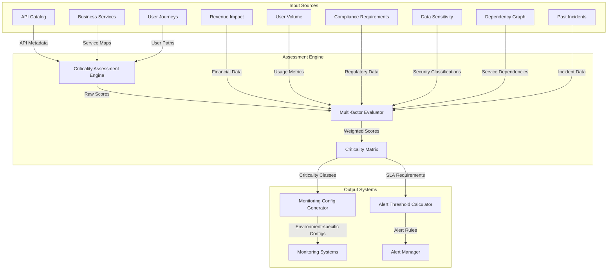
```mermaid
flowchart TD
    A[API Catalog] -->|API Metadata| B[Criticality Assessment Engine]
    C[Business Services] -->|Service Maps| B
    D[User Journeys] -->|User Paths| B
    
    B -->|Raw Scores| E[Multi-factor Evaluator]
    
    F[Revenue Impact] -->|Financial Data| E
    G[User Volume] -->|Usage Metrics| E
    H[Compliance Requirements] -->|Regulatory Data| E
    I[Data Sensitivity] -->|Security Classifications| E
    
    E -->|Weighted Scores| J[Criticality Matrix]
    J -->|Criticality Classes| K[Monitoring Config Generator]
    J -->|SLA Requirements| L[Alert Threshold Calculator]
    
    K -->|Environment-specific Configs| M[Monitoring Systems]
    L -->|Alert Rules| N[Alert Manager]
    
    O[Dependency Graph] -->|Service Dependencies| E
    P[Past Incidents] -->|Incident Data| E
    
    subgraph "Input Sources"
        A
        C
        D
        F
        G
        H
        I
        O
        P
    end
    
    subgraph "Assessment Engine"
        B
        E
        J
    end
    
    subgraph "Output Systems"
        K
        L
        M
        N
    end
```

### 7.6 Component Integration Matrix

The following diagram illustrates how the various components of AnomaSec interact with each other across different environments and contexts:

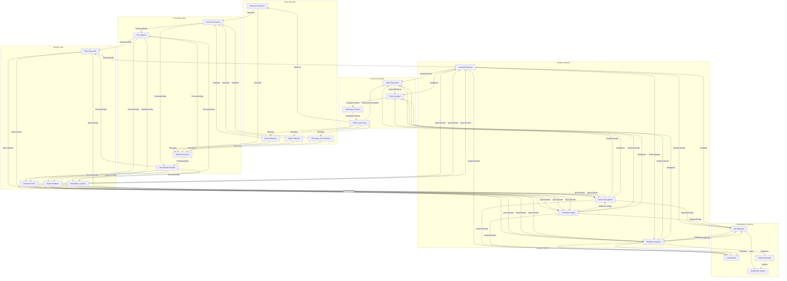
```mermaid
flowchart TD
    subgraph "Data Collection"
        A1[On-Prem Collectors]
        A2[Cloud Collectors]
        A3[Edge Collectors]
        A4[Third-party API Collectors]
    end
    
    subgraph "Processing Layer"
        B1[Stream Processors]
        B2[Batch Processors]
        B3[ETL Pipeline]
        B4[Normalization Engine]
    end
    
    subgraph "Storage Layer"
        C1[Time-Series DB]
        C2[Document Store]
        C3[Graph Database]
        C4[Immutable Log Store]
    end
    
    subgraph "Analysis Engines"
        D1[Anomaly Detection]
        D2[Pattern Recognition]
        D3[Correlation Engine]
        D4[Predictive Analytics]
    end
    
    subgraph "Policy Framework"
        E1[Policy Repository]
        E2[Policy Compiler]
        E3[Distribution System]
        E4[Enforcement Layer]
    end
    
    subgraph "Visualization & Alerting"
        F1[Dashboards]
        F2[Alert Manager]
        F3[Report Generator]
        F4[Notification System]
    end
    
    A1 & A2 & A3 & A4 -->|Raw Data| B1 & B2
    B1 & B2 -->|Processed Data| B3 & B4
    B3 & B4 -->|Structured Data| C1 & C2 & C3 & C4
    
    C1 & C2 & C3 & C4 -->|Query Results| D1 & D2 & D3 & D4
    D1 & D2 & D3 & D4 -->|Analysis Results| E1 & F1 & F2
    
    E1 -->|Policy Definitions| E2
    E2 -->|Compiled Policies| E3
    E3 -->|Distributed Policies| E4
    E4 -->|Enforcement Feedback| E1
    
    D1 & D2 & D3 & D4 -->|Intelligence| E2
    F2 -->|Alerts| F4
    D4 -->|Predictions| F1 & F2 & F3
    F3 -->|Reports| F4
    
    %% Cross-connections showing system integration
    D1 <-->|Model Updates| D4
    D2 <-->|Pattern Exchange| D3
    E4 -->|Telemetry| A1 & A2 & A3 & A4
    F2 -->|Feedback| D1 & D4
```

This holistic view demonstrates how AnomaSec's components work together as an integrated system, with data flowing from collection through processing, storage, analysis, policy enforcement, and finally to visualization and alerting.

## 8. AI and LLM-Powered Capabilities

AnomaSec leverages cutting-edge AI, transformer models, and Large Language Models (LLMs) to enhance its capabilities across all components. These advanced AI technologies provide deeper insights, more accurate predictions, and contextual understanding that traditional rule-based systems cannot achieve.

### 8.1.1 LLM-Powered Log Analysis

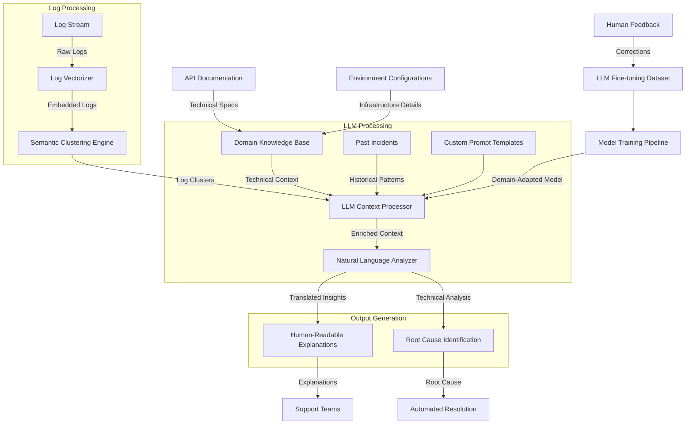
```mermaid
flowchart TD
    A[Log Stream] -->|Raw Logs| B[Log Vectorizer]
    B -->|Embedded Logs| C[Semantic Clustering Engine]
    
    C -->|Log Clusters| D[LLM Context Processor]
    D -->|Enriched Context| E[Natural Language Analyzer]
    
    F[Domain Knowledge Base] -->|Technical Context| D
    G[Past Incidents] -->|Historical Patterns| D
    
    E -->|Translated Insights| H[Human-Readable Explanations]
    E -->|Technical Analysis| I[Root Cause Identification]
    
    J[Custom Prompt Templates] --> D
    K[LLM Fine-tuning Dataset] --> L[Model Training Pipeline]
    L -->|Domain-Adapted Model| D
    
    subgraph "Log Processing"
        A
        B
        C
    end
    
    subgraph "LLM Processing"
        D
        E
        F
        G
        J
    end
    
    subgraph "Output Generation"
        H
        I
    end
    
    M[Human Feedback] -->|Corrections| K
    I -->|Root Cause| N[Automated Resolution]
    H -->|Explanations| O[Support Teams]
    
    P[API Documentation] -->|Technical Specs| F
    Q[Environment Configurations] -->|Infrastructure Details| F
```

The LLM-powered log analysis system performs the following functions:

- **Semantic Understanding**: Processes logs using transformer models to understand the semantic meaning beyond pattern matching
- **Context-Aware Analysis**: Incorporates API documentation, environment context, and historical patterns
- **Natural Language Explanations**: Generates human-readable explanations of complex technical issues
- **Root Cause Identification**: Traces problems through distributed systems using causal inference

### 8.1.2 Transformer-Based Anomaly Detection

AnomaSec employs a specialized transformer architecture for anomaly detection that outperforms traditional statistical methods:

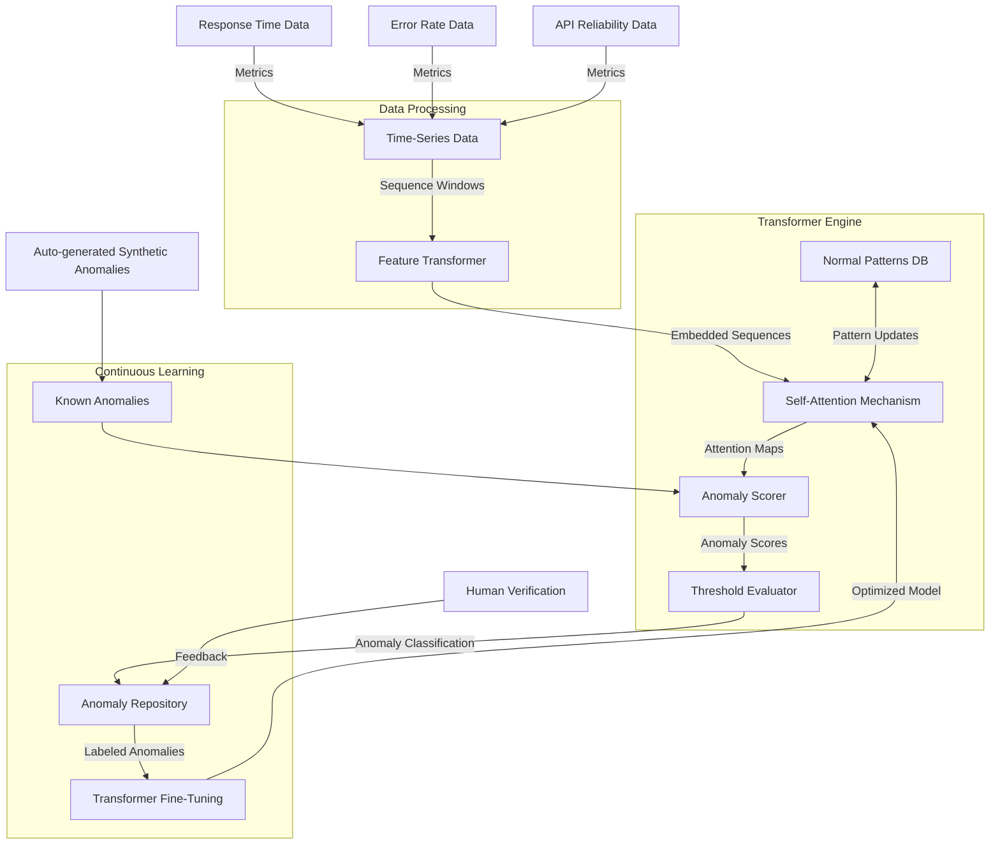
```mermaid
flowchart TD
    A[Time-Series Data] -->|Sequence Windows| B[Feature Transformer]
    B -->|Embedded Sequences| C[Self-Attention Mechanism]
    
    C -->|Attention Maps| D[Anomaly Scorer]
    D -->|Anomaly Scores| E[Threshold Evaluator]
    
    F[Normal Patterns DB] <-->|Pattern Updates| C
    G[Known Anomalies] --> D
    
    E -->|Anomaly Classification| H[Anomaly Repository]
    H -->|Labeled Anomalies| I[Transformer Fine-Tuning]
    I -->|Optimized Model| C
    
    subgraph "Data Processing"
        A
        B
    end
    
    subgraph "Transformer Engine"
        C
        D
        E
        F
    end
    
    subgraph "Continuous Learning"
        H
        I
        G
    end
    
    J[Response Time Data] -->|Metrics| A
    K[Error Rate Data] -->|Metrics| A
    L[API Reliability Data] -->|Metrics| A
    
    M[Human Verification] -->|Feedback| H
    N[Auto-generated Synthetic Anomalies] --> G
```

Key advantages of our transformer-based approach include:

- **Contextual Anomaly Detection**: Understands normal behavior in context rather than using static thresholds
- **Cross-Dimensional Analysis**: Evaluates anomalies across multiple metrics simultaneously
- **Temporal Pattern Recognition**: Identifies complex temporal patterns that traditional methods miss
- **Transfer Learning**: Leverages pre-trained transformer models adapted to API monitoring domain

### 8.1.3 Multi-Environment Correlation with Graph Neural Networks

To address the challenge of correlating events across distributed environments, AnomaSec implements a Graph Neural Network (GNN) approach:

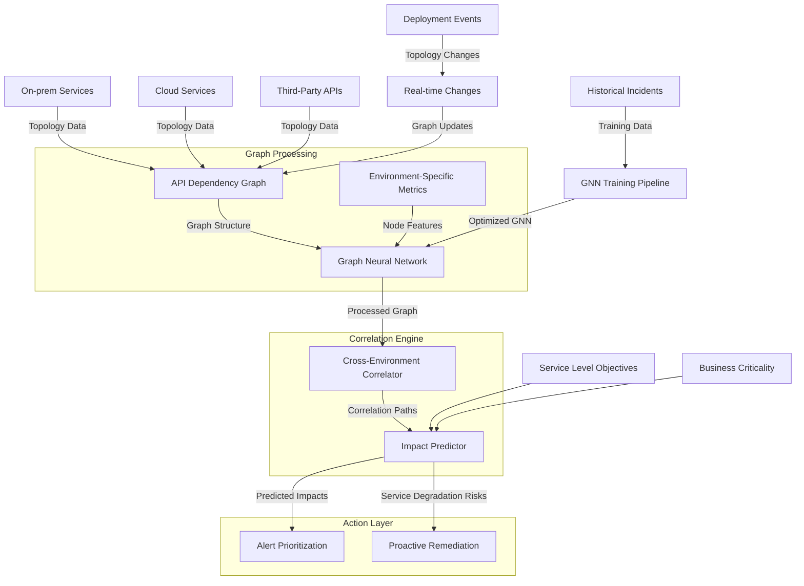
```mermaid
flowchart TD
    A[API Dependency Graph] -->|Graph Structure| B[Graph Neural Network]
    C[Environment-Specific Metrics] -->|Node Features| B
    
    B -->|Processed Graph| D[Cross-Environment Correlator]
    D -->|Correlation Paths| E[Impact Predictor]
    
    F[Historical Incidents] -->|Training Data| G[GNN Training Pipeline]
    G -->|Optimized GNN| B
    
    E -->|Predicted Impacts| H[Alert Prioritization]
    E -->|Service Degradation Risks| I[Proactive Remediation]
    
    J[Service Level Objectives] --> E
    K[Business Criticality] --> E
    
    subgraph "Graph Processing"
        A
        B
        C
    end
    
    subgraph "Correlation Engine"
        D
        E
    end
    
    subgraph "Action Layer"
        H
        I
    end
    
    L[On-prem Services] -->|Topology Data| A
    M[Cloud Services] -->|Topology Data| A
    N[Third-Party APIs] -->|Topology Data| A
    
    O[Real-time Changes] -->|Graph Updates| A
    P[Deployment Events] -->|Topology Changes| O
```

This innovative approach enables:

- **Dynamic Topology Awareness**: Automatically updates the service graph as environments change
- **Cross-Environment Path Analysis**: Traces request flows across environment boundaries
- **Cascade Prediction**: Forecasts how failures propagate through interconnected services
- **Risk Quantification**: Assigns numeric risk scores to potential failure modes

## 8.1 Technology Stack Implementation

AnomaSec is built on a robust technology stack that combines proven technologies with cutting-edge AI components:

### 8.2.1 Core Technologies

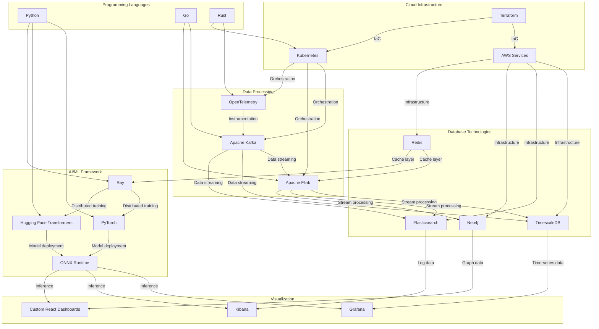
```mermaid
flowchart TD
    subgraph "Programming Languages"
        A1[Python]
        A2[Go]
        A3[Rust]
    end
    
    subgraph "Database Technologies"
        B1[TimescaleDB]
        B2[Elasticsearch]
        B3[Neo4j]
        B4[Redis]
    end
    
    subgraph "Cloud Infrastructure"
        C1[AWS Services]
        C2[Kubernetes]
        C3[Terraform]
    end
    
    subgraph "Data Processing"
        D1[Apache Kafka]
        D2[Apache Flink]
        D3[OpenTelemetry]
    end
    
    subgraph "AI/ML Framework"
        E1[PyTorch]
        E2[Hugging Face Transformers]
        E3[Ray]
        E4[ONNX Runtime]
    end
    
    subgraph "Visualization"
        F1[Grafana]
        F2[Kibana]
        F3[Custom React Dashboards]
    end
    
    A1 --> E1 & E2 & E3
    A2 --> D1 & D2
    A3 --> D3 & C2
    
    B1 -- "Time-series data" --> F1
    B2 -- "Log data" --> F2
    B3 -- "Graph data" --> F3
    B4 -- "Cache layer" --> D2 & E3
    
    C1 -- "Infrastructure" --> B1 & B2 & B3 & B4
    C2 -- "Orchestration" --> D1 & D2 & D3
    C3 -- "IaC" --> C1 & C2
    
    D1 -- "Data streaming" --> D2 & B1 & B2
    D2 -- "Stream processing" --> B1 & B2 & B3
    D3 -- "Instrumentation" --> D1
    
    E1 & E2 -- "Model deployment" --> E4
    E3 -- "Distributed training" --> E1 & E2
    E4 -- "Inference" --> F1 & F2 & F3
```

### 8.2.2 Python Implementation Architecture

Python serves as the primary language for the AI components of AnomaSec, with the following implementation architecture:

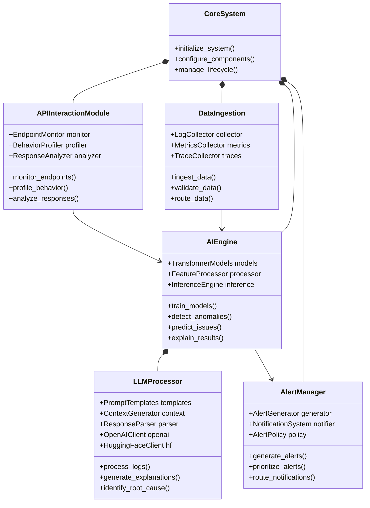
```mermaid
classDiagram
    class CoreSystem {
        +initialize_system()
        +configure_components()
        +manage_lifecycle()
    }
    
    class DataIngestion {
        +LogCollector collector
        +MetricsCollector metrics
        +TraceCollector traces
        +ingest_data()
        +validate_data()
        +route_data()
    }
    
    class AIEngine {
        +TransformerModels models
        +FeatureProcessor processor
        +InferenceEngine inference
        +train_models()
        +detect_anomalies()
        +predict_issues()
        +explain_results()
    }
    
    class AlertManager {
        +AlertGenerator generator
        +NotificationSystem notifier
        +AlertPolicy policy
        +generate_alerts()
        +prioritize_alerts()
        +route_notifications()
    }
    
    class APIInteractionModule {
        +EndpointMonitor monitor
        +BehaviorProfiler profiler
        +ResponseAnalyzer analyzer
        +monitor_endpoints()
        +profile_behavior()
        +analyze_responses()
    }
    
    class LLMProcessor {
        +PromptTemplates templates
        +ContextGenerator context
        +ResponseParser parser
        +OpenAIClient openai
        +HuggingFaceClient hf
        +process_logs()
        +generate_explanations()
        +identify_root_cause()
    }
    
    CoreSystem *-- DataIngestion
    CoreSystem *-- AIEngine
    CoreSystem *-- AlertManager
    CoreSystem *-- APIInteractionModule
    
    AIEngine *-- LLMProcessor
    DataIngestion --> AIEngine
    AIEngine --> AlertManager
    APIInteractionModule --> AIEngine
```

### 8.2.3 ELK Stack Integration

The Elasticsearch, Logstash, and Kibana (ELK) stack is enhanced with AI capabilities:

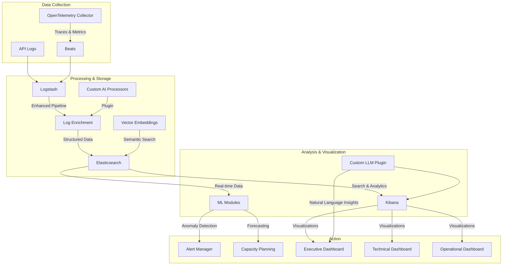
```mermaid
flowchart TD
    A[API Logs] --> B[Logstash]
    B -->|Enhanced Pipeline| C[Log Enrichment]
    C -->|Structured Data| D[Elasticsearch]
    
    E[Custom AI Processors] -->|Plugin| C
    F[Vector Embeddings] -->|Semantic Search| D
    
    D -->|Search & Analytics| G[Kibana]
    D -->|Real-time Data| H[ML Modules]
    
    H -->|Anomaly Detection| I[Alert Manager]
    H -->|Forecasting| J[Capacity Planning]
    
    G -->|Visualizations| K[Executive Dashboard]
    G -->|Visualizations| L[Technical Dashboard]
    G -->|Visualizations| M[Operational Dashboard]
    
    N[OpenTelemetry Collector] -->|Traces & Metrics| O[Beats]
    O --> B
    
    P[Custom LLM Plugin] --> G
    P -->|Natural Language Insights| K
    
    subgraph "Data Collection"
        A
        N
        O
    end
    
    subgraph "Processing & Storage"
        B
        C
        E
        D
        F
    end
    
    subgraph "Analysis & Visualization"
        G
        H
        P
    end
    
    subgraph "Action"
        I
        J
        K
        L
        M
    end
```

## 8.3 Auto-Discovery and Environment-Aware Processing

AnomaSec includes an automated discovery system that adapts to different environments:

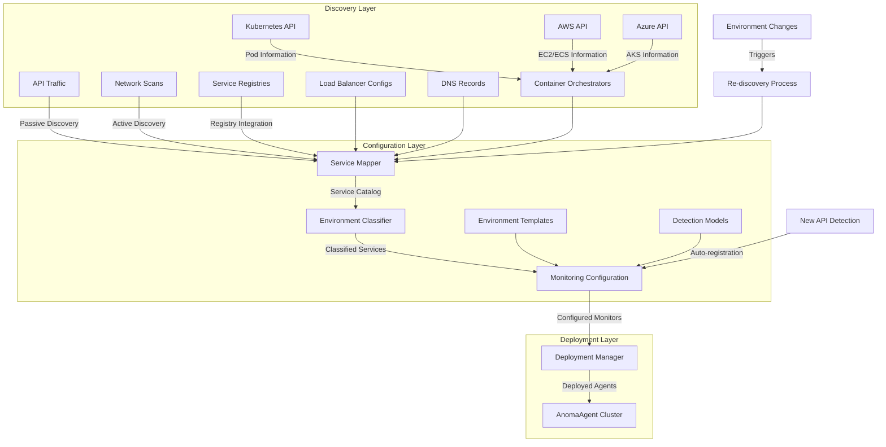
```mermaid
flowchart TD
    A[API Traffic] -->|Passive Discovery| B[Service Mapper]
    C[Network Scans] -->|Active Discovery| B
    D[Service Registries] -->|Registry Integration| B
    
    B -->|Service Catalog| E[Environment Classifier]
    E -->|Classified Services| F[Monitoring Configuration]
    
    G[Environment Templates] --> F
    H[Detection Models] --> F
    
    F -->|Configured Monitors| I[Deployment Manager]
    I -->|Deployed Agents| J[AnomaAgent Cluster]
    
    K[Load Balancer Configs] --> B
    L[DNS Records] --> B
    M[Container Orchestrators] --> B
    
    N[Kubernetes API] -->|Pod Information| M
    O[AWS API] -->|EC2/ECS Information| M
    P[Azure API] -->|AKS Information| M
    
    subgraph "Discovery Layer"
        A
        C
        D
        K
        L
        M
        N
        O
        P
    end
    
    subgraph "Configuration Layer"
        B
        E
        F
        G
        H
    end
    
    subgraph "Deployment Layer"
        I
        J
    end
    
    Q[Environment Changes] -->|Triggers| R[Re-discovery Process]
    R --> B
    
    S[New API Detection] -->|Auto-registration| F
```

This system enables AnomaSec to:

- **Auto-discover** new APIs and services across all environments
- **Automatically configure** appropriate monitoring based on the environment
- **Adapt thresholds** to the performance characteristics of each environment
- **Detect environment transitions** in distributed request flows

## 8.4 Comprehensive Alert Types and Detection Mechanisms

AnomaSec implements sophisticated detection mechanisms for each alert type, optimized for distributed environments and backed by AI technologies.

### 8.4.1 Response Time Anomaly Detection Framework

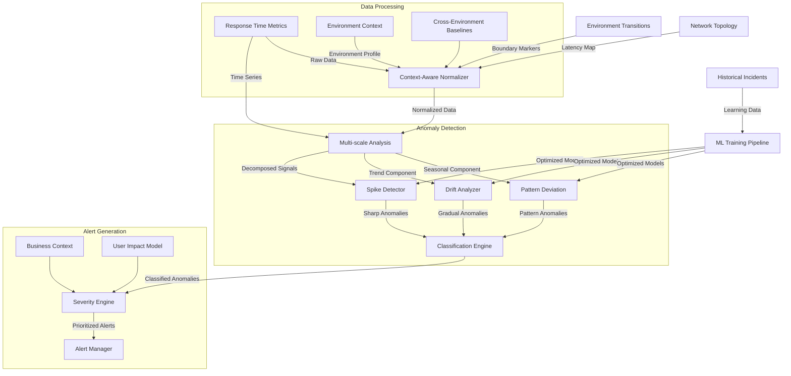
```mermaid
flowchart TD
    A[Response Time Metrics] -->|Time Series| B[Multi-scale Analysis]
    B -->|Decomposed Signals| C[Spike Detector]
    B -->|Trend Component| D[Drift Analyzer]
    B -->|Seasonal Component| E[Pattern Deviation]
    
    C -->|Sharp Anomalies| F[Classification Engine]
    D -->|Gradual Anomalies| F
    E -->|Pattern Anomalies| F
    
    G[Environment Context] -->|Environment Profile| H[Context-Aware Normalizer]
    I[Cross-Environment Baselines] --> H
    
    A -->|Raw Data| H
    H -->|Normalized Data| B
    
    F -->|Classified Anomalies| J[Severity Engine]
    K[Business Context] --> J
    L[User Impact Model] --> J
    
    J -->|Prioritized Alerts| M[Alert Manager]
    
    subgraph "Data Processing"
        A
        G
        H
        I
    end
    
    subgraph "Anomaly Detection"
        B
        C
        D
        E
        F
    end
    
    subgraph "Alert Generation"
        J
        K
        L
        M
    end
    
    N[Historical Incidents] -->|Learning Data| O[ML Training Pipeline]
    O -->|Optimized Models| C & D & E
    
    P[Environment Transitions] -->|Boundary Markers| H
    Q[Network Topology] -->|Latency Map| H
```

#### Spike Detection Capabilities
- **Ultra-low Latency Detection**: Identifies spikes within 5 seconds of occurrence
- **Adaptive Thresholds**: Automatically adjusts thresholds based on:
  - Time of day/week patterns
  - Traffic volume correlations
  - Deployment events
  - Infrastructure changes
- **Multi-scale Analysis**: Detects anomalies at different time scales simultaneously:
  - Microsecond-level for critical APIs
  - Second-level for standard operations
  - Minute-level for background processes
- **Environment-Aware Processing**: Normalizes response times based on:
  - Network latency between environments
  - Hardware performance characteristics
  - Virtualization overhead
  - Cloud provider variability

#### Pattern Change Detection
- **Trend Analysis**: Identifies gradual degradation before it becomes critical
- **Seasonality Modeling**: Learns complex periodic patterns across:
  - 24-hour cycles
  - Weekly patterns
  - Monthly trends
  - Quarterly business cycles
- **Change Point Detection**: Identifies when behavior fundamentally changes
- **Wavelet Analysis**: Decomposes signals to identify specific frequency anomalies

### 8.4.2 Error Rate Anomaly Detection

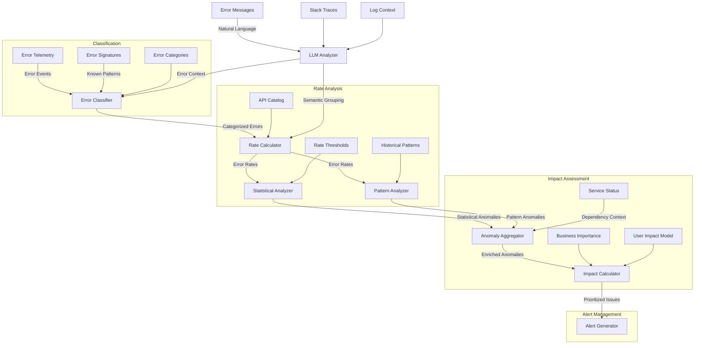
```mermaid
flowchart TD
    A[Error Telemetry] -->|Error Events| B[Error Classifier]
    B -->|Categorized Errors| C[Rate Calculator]
    
    C -->|Error Rates| D[Statistical Analyzer]
    C -->|Error Rates| E[Pattern Analyzer]
    
    D -->|Statistical Anomalies| F[Anomaly Aggregator]
    E -->|Pattern Anomalies| F
    
    G[Error Signatures] -->|Known Patterns| B
    H[Service Status] -->|Dependency Context| F
    
    F -->|Enriched Anomalies| I[Impact Calculator]
    I -->|Prioritized Issues| J[Alert Generator]
    
    K[Error Categories] --> B
    L[API Catalog] --> C
    
    M[Rate Thresholds] --> D
    N[Historical Patterns] --> E
    
    O[Business Importance] --> I
    P[User Impact Model] --> I
    
    subgraph "Classification"
        A
        B
        G
        K
    end
    
    subgraph "Rate Analysis"
        C
        D
        E
        L
        M
        N
    end
    
    subgraph "Impact Assessment"
        F
        H
        I
        O
        P
    end
    
    subgraph "Alert Management"
        J
    end
    
    Q[Error Messages] -->|Natural Language| R[LLM Analyzer]
    R -->|Error Context| B
    R -->|Semantic Grouping| C
    
    S[Stack Traces] --> R
    T[Log Context] --> R
```

#### Error Tracking Capabilities
- **Intelligent Error Classification**:
  - Semantic analysis of error messages
  - Root cause categorization
  - Dependency mapping for cascading errors
  - Environmental context integration

- **Multi-dimensional Rate Analysis**:
  - Per-endpoint error rates
  - Per-client error distributions
  - Per-operation type anomalies
  - Cross-environment comparative analysis

- **Statistical Models**:
  - Percentile-based thresholds (50th, 95th, 99th)
  - Multivariate analysis with correlated metrics
  - Seasonality-aware baselines
  - Burst detection with minimal false positives

- **AI-Driven Error Analysis**:
  - Natural language processing of error messages
  - Automatic error correlation across services
  - Root cause prediction
  - Resolution recommendation

### 8.4.3 End-to-End Request Journey Analysis

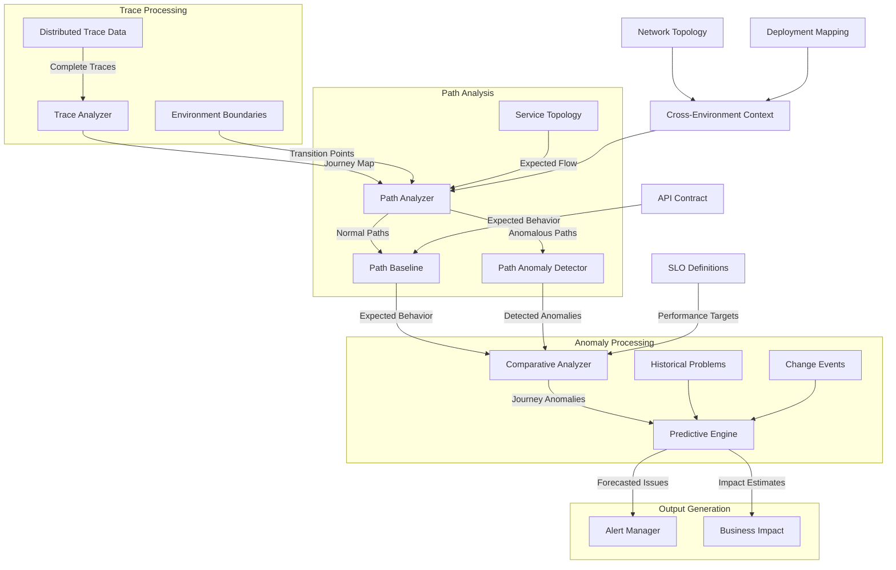
```mermaid
flowchart TD
    A[Distributed Trace Data] -->|Complete Traces| B[Trace Analyzer]
    B -->|Journey Map| C[Path Analyzer]
    
    C -->|Normal Paths| D[Path Baseline]
    C -->|Anomalous Paths| E[Path Anomaly Detector]
    
    F[Environment Boundaries] -->|Transition Points| C
    G[Service Topology] -->|Expected Flow| C
    
    D -->|Expected Behavior| H[Comparative Analyzer]
    E -->|Detected Anomalies| H
    
    H -->|Journey Anomalies| I[Predictive Engine]
    I -->|Forecasted Issues| J[Alert Manager]
    I -->|Impact Estimates| K[Business Impact]
    
    L[Historical Problems] --> I
    M[Change Events] --> I
    
    subgraph "Trace Processing"
        A
        B
        F
    end
    
    subgraph "Path Analysis"
        C
        D
        E
        G
    end
    
    subgraph "Anomaly Processing"
        H
        I
        L
        M
    end
    
    subgraph "Output Generation"
        J
        K
    end
    
    N[API Contract] -->|Expected Behavior| D
    O[SLO Definitions] -->|Performance Targets| H
    
    P[Cross-Environment Context] --> C
    Q[Network Topology] --> P
    R[Deployment Mapping] --> P
```

#### Journey Analysis Capabilities
- **Cross-Environment Correlation**:
  - Trace ID preservation across environment boundaries
  - Latency attribution to specific environment segments
  - Environment-specific performance baseline normalization
  - Boundary transition anomaly detection

- **Path Analysis**:
  - Automatic service dependency mapping
  - Dynamic path comparison with expected routes
  - Unusual path detection
  - Redundant call identification

- **Performance Correlation**:
  - End-to-end latency breakdown
  - Component-specific contribution analysis
  - Bottleneck identification
  - Queue saturation detection

- **Predictive Journey Analysis**:
  - Early warning based on partial journey execution
  - Predictive completion time estimation
  - Failure probability calculation
  - User impact forecasting

### 8.4.4 Reliability and Predictiveness Monitoring

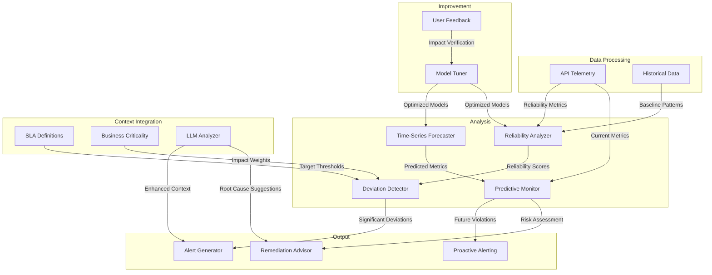
```mermaid
flowchart TD
    A[API Telemetry] -->|Reliability Metrics| B[Reliability Analyzer]
    C[Historical Data] -->|Baseline Patterns| B
    
    B -->|Reliability Scores| D[Deviation Detector]
    D -->|Significant Deviations| E[Alert Generator]
    
    F[SLA Definitions] -->|Target Thresholds| D
    G[Business Criticality] -->|Impact Weights| D
    
    H[Time-Series Forecaster] -->|Predicted Metrics| I[Predictive Monitor]
    A -->|Current Metrics| I
    
    I -->|Future Violations| J[Proactive Alerting]
    I -->|Risk Assessment| K[Remediation Advisor]
    
    L[LLM Analyzer] -->|Enhanced Context| E
    L -->|Root Cause Suggestions| K
    
    M[User Feedback] -->|Impact Verification| N[Model Tuner]
    N -->|Optimized Models| H & B
    
    subgraph "Data Processing"
        A
        C
    end
    
    subgraph "Analysis"
        B
        D
        H
        I
    end
    
    subgraph "Context Integration"
        F
        G
        L
    end
    
    subgraph "Output"
        E
        J
        K
    end
    
    subgraph "Improvement"
        M
        N
    end
```

#### Reliability Monitoring Features
- **Composite Reliability Metrics**:
  - Success rate calculation
  - Availability measurement
  - Consistency validation
  - Performance reliability

- **Multi-dimensional Analysis**:
  - Per-client reliability
  - Per-operation reliability
  - Per-environment reliability
  - Cross-environment comparative analysis

- **Predictive Capabilities**:
  - Reliability trend forecasting
  - SLA violation prediction
  - Maintenance window recommendation
  - Risk-based resource allocation

- **AI-Driven Reliability Analysis**:
  - Pattern recognition in reliability fluctuations
  - Correlation with external factors
  - Natural language summaries of reliability status
  - Automated root cause identification

## 8.5 Integration with AWS and ELK

AnomaSec is specifically designed to leverage AWS services and the ELK stack for optimal implementation in cloud environments.

### 8.5.1 AWS Technology Integration

```mermaid
flowchart TD
    subgraph "Data Collection"
        A1[CloudWatch]
        A2[X-Ray]
        A3[API Gateway]
        A4[Lambda Instrumentation]
    end
    
    subgraph "Data Processing"
        B1[Kinesis Data Streams]
        B2[SQS/SNS]
        B3[Lambda Functions]
        B4[Fargate Containers]
    end
    
    subgraph "Storage"
        C1[DynamoDB]
        C2[S3]
        C3[Timestream]
        C4[OpenSearch Service]
    end
    
    subgraph "Analysis"
        D1[SageMaker]
        D2[Comprehend]
        D3[Bedrock - LLM Services]
        D4[QuickSight]
    end
    
    A1 & A2 & A3 & A4 -->|Raw Data| B1 & B2
    B1 & B2 -->|Processed Events| B3 & B4
    B3 & B4 -->|Structured Data| C1 & C2 & C3 & C4
    
    C1 & C2 & C3 & C4 -->|Analysis Data| D1 & D2 & D3
    D1 & D2 & D3 -->|Insights| D4
    
    E[EC2 Based Agent] -->|Custom Metrics| A1
    F[ECS Containers] -->|Application Logs| A1
    G[API Endpoints] -->|Access Logs| A3
    
    H[Cross-Region Replication] -->|Redundancy| C2 & C1
    I[Multi-AZ Deployment] -->|High Availability| B1 & B2 & C4
    
    J[IAM Roles & Policies] -.->|Security| A1 & A2 & A3 & A4 & B1 & B2 & B3 & B4 & C1 & C2 & C3 & C4 & D1 & D2 & D3 & D4
    K[VPC Configuration] -.->|Network Isolation| B3 & B4 & C1 & C3 & C4 & D1
    
    L[EventBridge] -->|Service Integration| B2
    M[Step Functions] -->|Orchestration| B3
```

AnomaSec leverages the following AWS services for optimal cloud-native operation:

- **Collection & Ingestion**:
  - CloudWatch for infrastructure and application metrics
  - X-Ray for distributed tracing
  - API Gateway logs for API monitoring
  - Lambda Insights for serverless function metrics

- **Processing & Analysis**:
  - SageMaker for custom ML model training and deployment
  - Kinesis Data Analytics for real-time stream processing
  - Lambda for event-driven analysis
  - Bedrock for LLM-based log analysis and explanation

- **Storage & Persistence**:
  - DynamoDB for metadata and configuration
  - S3 for raw log archives
  - Timestream for time-series metrics
  - OpenSearch Service for log indexing and analysis

- **Visualization & Alerting**:
  - CloudWatch Dashboards for metrics visualization
  - EventBridge for alert routing
  - SNS for notifications
  - QuickSight for business intelligence dashboards

### 8.5.2 ELK Stack Implementation

```mermaid
flowchart TD
    A[API Logs] -->|Collection| B[Filebeat/Fluentd]
    C[Metrics] -->|Collection| D[Metricbeat]
    E[Traces] -->|Collection| F[APM Server]
    
    B & D & F -->|Shipping| G[Logstash]
    G -->|Processing| H[AI-Enhanced Pipeline]
    
    I[Custom Processors] -->|Plugins| H
    J[OpenTelemetry Converter] -->|Standardization| H
    
    H -->|Enriched Data| K[Elasticsearch]
    K -->|Storage & Indexing| L[Data Tiers]
    
    M[ML Jobs] --> K
    N[Anomaly Detection] --> M
    O[Forecasting] --> M
    
    K -->|Query & Visualization| P[Kibana]
    P -->|Dashboards| Q[Various Stakeholders]
    
    R[Alerting] --> P
    S[AI Assistant Plugin] --> P
    
    subgraph "Data Collection"
        A
        B
        C
        D
        E
        F
    end
    
    subgraph "Data Processing"
        G
        H
        I
        J
    end
    
    subgraph "Data Storage"
        K
        L
    end
    
    subgraph "Analysis & ML"
        M
        N
        O
    end
    
    subgraph "Visualization & Alerting"
        P
        Q
        R
        S
    end
    
    T[Vector Search] -->|Semantic Analysis| K
    U[Python AI Workers] <-->|ML Integration| M
    V[Custom Anomaly Rules] --> R
```

AnomaSec enhances the ELK stack with the following AI-powered capabilities:

- **Log Collection Enhancements**:
  - Automatic format detection and normalization
  - Context-preserving correlation IDs
  - Environment tagging
  - Sampling strategy for high-volume APIs

- **Elasticsearch Optimizations**:
  - Vector embeddings for semantic log analysis
  - Custom indices for different API types
  - Hot-warm-cold architecture for cost optimization
  - Machine learning
## 8.8 Specific Operational Requirements Implementation

### 8.8.1 Automatic Application Monitoring Setup

```mermaid
flowchart TD
    A[Log Ingestion Point] -->|New Log Detection| B[Log Structure Analyzer]
    B -->|Identified Schema| C[Schema Registry]
    
    D[New API Detection] -->|API Discovery| E[Service Catalog]
    E -->|Service Registration| F[Monitoring Configuration]
    
    G[Auto-instrumentation Agent] -->|Agent Deployment| H[Monitoring Activation]
    C -->|Schema Definition| H
    F -->|Monitoring Rules| H
    
    H -->|Active Monitoring| I[Monitoring Dashboard]
    H -->|Baseline Building| J[Anomaly Detection]
    
    K[Environment Detection] -->|Environment Context| F
    L[Log Pattern Library] -->|Pattern Matching| B
    
    subgraph "Discovery Phase"
        A
        B
        C
        D
        E
        K
        L
    end
    
    subgraph "Configuration Phase"
        F
        G
    end
    
    subgraph "Operational Phase"
        H
        I
        J
    end
    
    M[Configuration Templates] -->|Best Practices| F
    N[Security Policies] -->|Compliance Rules| F
    
    O[API Documentation] -.->|Optional Enrichment| E
```

AnomaSec includes a zero-touch onboarding system that automatically:

- **Detects new applications** as soon as logs start flowing
- **Analyzes log structures** to determine the appropriate parser configuration
- **Identifies API endpoints** from log patterns and network traffic
- **Determines the environment** (on-premises, AWS, multi-cloud)
- **Configures appropriate monitors** based on API type and criticality
- **Deploys necessary agents** for comprehensive monitoring
- **Establishes initial baselines** for normal behavior
- **Activates appropriate alerts** based on service SLAs

### 8.8.2 Predictive Analytics Implementation

```mermaid
flowchart TD
    A[Historical Data] -->|Training Data| B[Model Training Pipeline]
    C[Real-time Data] -->|Current State| D[Prediction Engine]
    
    B -->|Trained Models| E[Model Registry]
    E -->|Selected Model| D
    
    D -->|Predictions| F[Anomaly Forecasting]
    D -->|Predictions| G[Resource Planning]
    D -->|Predictions| H[SLA Risk Assessment]
    
    I[Environment Factors] -->|Context| D
    J[Business Calendar] -->|Events| D
    
    K[Deployment Events] -->|Changes| L[Change Impact Predictor]
    L -->|Expected Impact| M[Change Approval]
    L -->|Expected Impact| N[Risk Mitigation]
    
    F -->|Potential Issues| O[Proactive Alerts]
    G -->|Resource Needs| P[Capacity Planning]
    H -->|SLA Risks| Q[Business Impact]
    
    R[Model Performance] -->|Metrics| S[Model Evaluator]
    S -->|Improvements| B
    
    subgraph "Model Development"
        A
        B
        E
        R
        S
    end
    
    subgraph "Prediction Generation"
        C
        D
        I
        J
    end
    
    subgraph "Change Management"
        K
        L
        M
        N
    end
    
    subgraph "Output Channels"
        F
        G
        H
        O
        P
        Q
    end
```

AnomaSec's predictive analytics provides several key capabilities:

- **Failure Prediction**:
  - Early detection of potential API failures
  - Forecast of error rate increases
  - Prediction of response time degradation
  - Identification of potential cascade failures

- **Resource Forecasting**:
  - API traffic prediction for capacity planning
  - Resource utilization forecasts
  - Scaling recommendations
  - Cost optimization insights

- **Business Impact Assessment**:
  - SLA compliance risk identification
  - User experience impact prediction
  - Revenue impact forecasting
  - Brand reputation risk assessment

- **Change Risk Analysis**:
  - Deployment risk evaluation
  - Configuration change impact prediction
  - Dependency risk assessment
  - Roll-back recommendation logic

## 8.9 Comprehensive Visualization System

AnomaSec includes a sophisticated visualization system that makes complex distributed system behavior understandable to various stakeholders:

```mermaid
flowchart TD
    A[Telemetry Data] -->|Processed Data| B[Visualization Engine]
    
    B -->|Technical Views| C[DevOps Dashboard]
    B -->|Business Views| D[Executive Dashboard]
    B -->|Service Views| E[Service Owner Dashboard]
    B -->|Custom Views| F[User-Defined Dashboard]
    
    G[Alert Data] -->|Active Issues| C & D & E
    H[Historical Data] -->|Trends| C & D & E
    I[Prediction Data] -->|Forecasts| C & D & E
    
    J[Environment Context] -->|Context Filter| B
    K[User Role] -->|Access Control| B
    
    L[Mobile App] <-->|Remote Access| B
    M[Alert Notifications] <-->|Push Updates| B
    N[API] <-->|Data Access| B
    
    O[Natural Language Interface] <-->|Query/Response| B
    P[Automated Analysis] -->|Insights| B
    
    subgraph "Data Sources"
        A
        G
        H
        I
    end
    
    subgraph "Visualization Core"
        B
        J
        K
    end
    
    subgraph "Dashboard Types"
        C
        D
        E
        F
    end
    
    subgraph "Access Methods"
        L
        M
        N
        O
    end
```

Key visualization capabilities include:

- **Role-Based Dashboards**:
  - Technical deep-dive for engineers
  - Service health overview for service owners
  - Business impact visualization for executives
  - Custom views for specific needs

- **Cross-Environment Views**:
  - End-to-end journey visualization
  - Environment boundary mapping
  - Comparative performance views
  - Global health maps

- **Advanced Visualization Types**:
  - Dependency graphs with health indicators
  - Heat maps for anomaly patterns
  - Timeline views with prediction ranges
  - Correlation graphs for related events

- **Interactive Exploration**:
  - Drill-down from overview to detail
  - Time-range selection and comparison
  - Filter by environment, service, or API
  - Natural language query interface

# Updating Success Metrics and Conclusion

## 10. Success Metrics

### Performance Metrics
- 99.9% accuracy in anomaly detection
- <5% false positive rate
- 95% reduction in mean time to detect (MTTD)
- 90% reduction in mean time to resolve (MTTR)
- 99% of anomalies detected before user impact
- 100% capture of cross-environment anomalies

### Business Impact
- 80% reduction in API-related outages
- 75% decrease in security incidents
- 50% improvement in developer productivity
- 40% reduction in operational costs
- 30% increase in API performance
- 60% faster integration of new services

### Implementation Metrics
- 100% API coverage across all environments
- <1% overhead on monitored systems
- 90% automation of routine monitoring tasks
- <10 minutes setup time for new APIs
- <5 minutes to identify root cause for any anomaly
- Zero-touch onboarding for 95% of new services

## 11. Conclusion

AnomaSec represents a paradigm shift in how organizations monitor and secure their distributed API ecosystems. Through the innovative AnomaAgent and AnomaAPIPolicy frameworks, we provide unprecedented visibility, intelligence, and automation across complex multi-environment architectures.

Our AI and LLM-powered approach transforms traditional monitoring into an intelligent system that not only detects issues but predicts them, explains them, and recommends solutions - all while understanding the complex relationships between services across distributed environments.

By deploying AnomaSec, organizations can:
- Detect anomalies before they impact users
- Secure APIs with adaptive, context-aware policies
- Predict and prevent cascading failures
- Optimize performance across all environments
- Reduce operational overhead through intelligent automation
- Bridge the gap between on-premises and cloud environments

Our solution transforms API monitoring from a reactive necessity to a proactive strategic advantage, enabling organizations to deliver consistent, secure, and high-performing API experiences regardless of architectural complexity.
