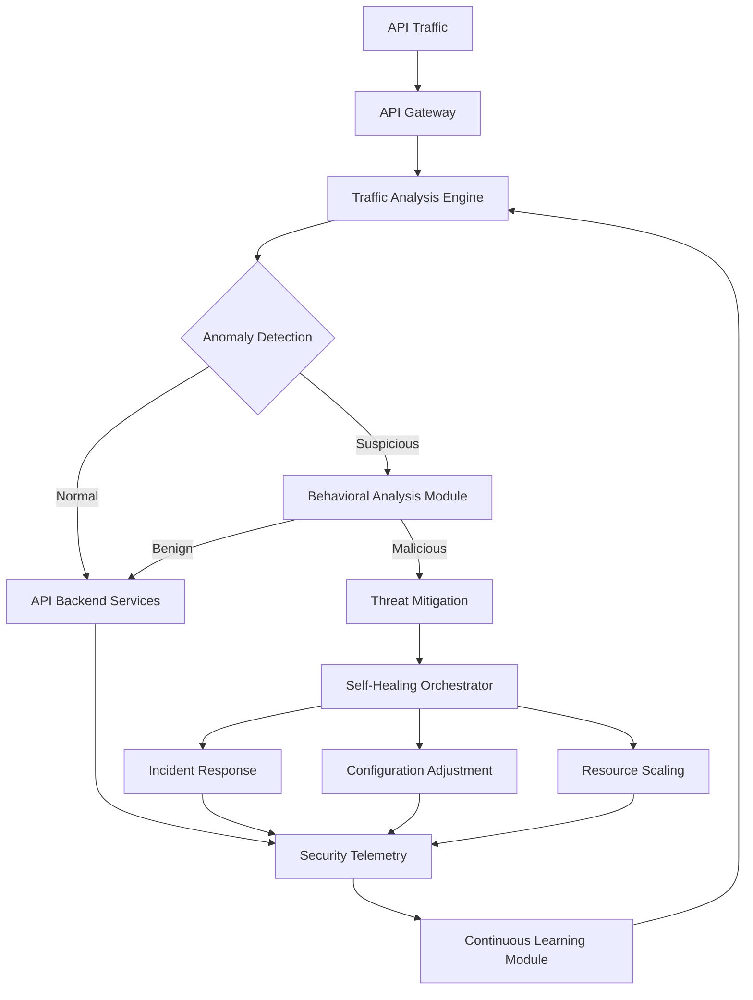
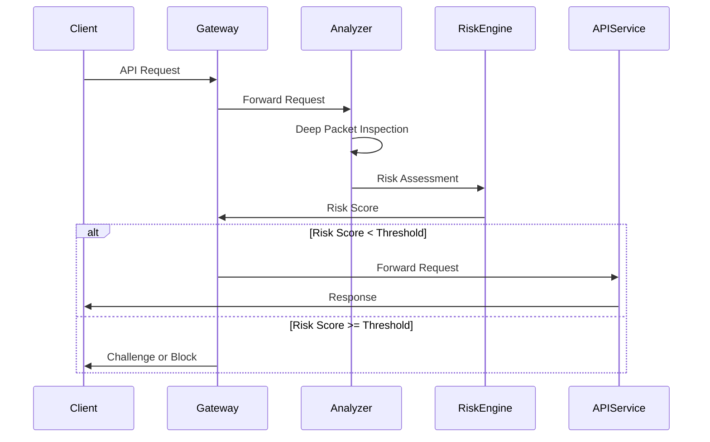
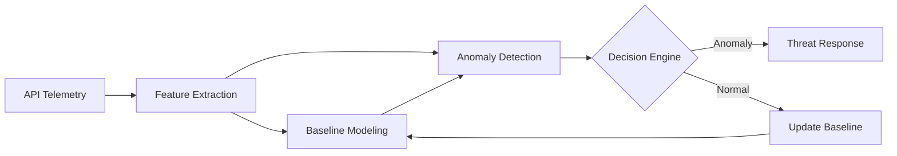
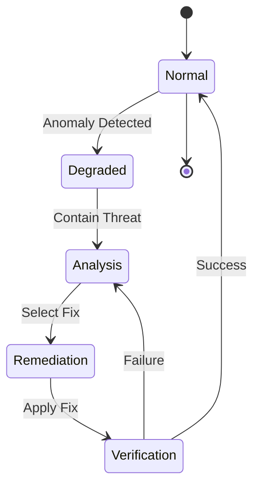
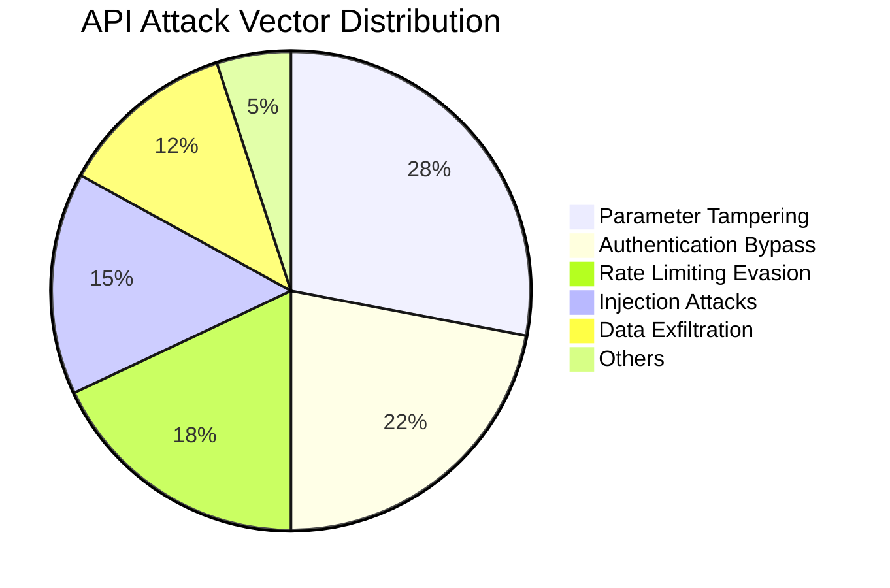
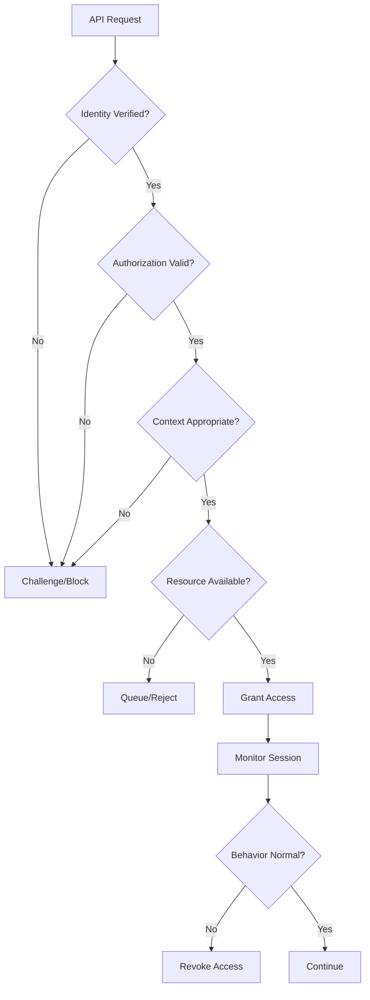
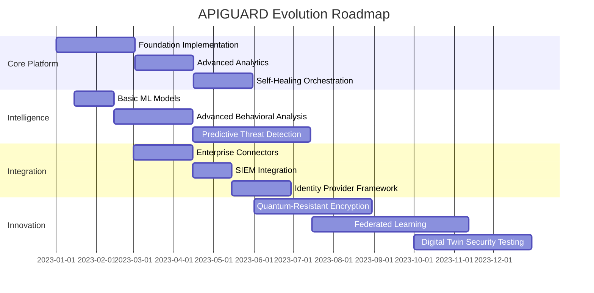

# APIGUARD: Next-Generation API Security Solution

![[apiguard_banner.png]]

> [!info] Executive Summary
> ApiGuard is a comprehensive, AI-driven API security platform designed to protect enterprise environments from sophisticated attacks while ensuring continuous service availability through anomaly detection, data integrity verification, and autonomous self-healing capabilities.

## 🔍 Problem Overview

APIs have become the cornerstone of modern digital ecosystems, enabling seamless integration between diverse software systems. However, this increased connectivity introduces significant security challenges:

- Sophisticated bot attacks that mimic legitimate traffic
- API injections and parameter tampering
- Data leakages due to improper access control
- Expanded attack surface from microservices 
- Denial-of-service attacks
- Chain API attacks targeting interconnected systems
- Shadow APIs and undocumented endpoints
- AI-powered API fuzzing
- GraphQL-specific vulnerabilities

## 🏛️ APIGUARD Architecture

APIGUARD employs a multi-layered security approach combining real-time monitoring, behavioral analysis, and autonomous response mechanisms.



> [!note] Architecture Highlights
> - **Zero Trust Foundation**: Every request is verified regardless of source
> - **Distributed Intelligence**: Analysis occurs at multiple layers
> - **Autonomous Response**: Self-healing without human intervention
> - **Continuous Learning**: System evolves with emerging threats

## 🔄 Core Components & Workflows

### 1. Intelligent Traffic Analysis Engine

The Traffic Analysis Engine forms the first line of defense, processing all incoming API requests to identify patterns and potential threats.

> [!important] Key Capabilities
> - Protocol-aware deep packet inspection
> - Historical pattern comparison
> - Rate limiting and throttling
> - Request sanitization and validation

**Workflow:**



### 2. Behavioral Analysis Module

The Behavioral Analysis Module employs machine learning to establish baseline API usage patterns and detect anomalies that might indicate attacks or misuse.

**Technical Implementation:**

- **Unsupervised Learning Models**: Detect unknown patterns without predefined rules
- **Time-Series Analysis**: Identify temporal anomalies in API usage
- **Graph-Based Analysis**: Map API relationships to detect chain attacks
- **Deep Learning**: Process complex patterns using neural networks



### 3. Data Integrity Verification System

This component ensures the integrity of data flowing through APIs, protecting against tampering and unauthorized modifications.

**Key Features:**

- **Schema Validation**: Ensures requests conform to expected structure
- **Digital Signatures**: Verifies content hasn't been modified in transit
- **Checksum Verification**: Validates data integrity
- **Content Validation**: Inspects payloads for malicious content

> [!example] Implementation Example
> ```json
> {
>   "integrity_config": {
>     "schema_validation": true,
>     "signature_verification": {
>       "algorithm": "SHA-256",
>       "key_rotation": "7d"
>     },
>     "content_inspection": {
>       "depth": "full",
>       "max_size": "10MB"
>     }
>   }
> }
> ```

### 4. Autonomous Self-Healing Orchestrator

The self-healing capabilities represent APIGUARD's most innovative aspect, enabling automatic mitigation and recovery from security incidents.

**Self-Healing Workflows:**

1. **Detect**: Identify anomalous behavior or security incidents
2. **Contain**: Isolate affected components to prevent threat propagation
3. **Analyze**: Determine root cause and optimal remediation
4. **Remediate**: Apply automated fixes or configuration changes
5. **Verify**: Confirm remediation success
6. **Learn**: Update models and ruleset based on incident



**Self-Healing Mechanisms:**

- **Dynamic Firewall Rules**: Automatically adjust rules to block attack sources
- **API Throttling**: Intelligent rate limiting during suspicious activity
- **Container Regeneration**: Rebuild compromised microservices from trusted images
- **Configuration Rollback**: Restore to last known secure state
- **Circuit Breaking**: Temporarily disable vulnerable endpoints
- **Traffic Rerouting**: Divert traffic from compromised components

## 🛠️ Technology Stack

| Component | Technologies |
|-----------|-------------|
| Gateway & Proxy | Envoy, Kong, NGINX |
| Traffic Analysis | Cilium, Falco, eBPF |
| Behavioral Analysis | TensorFlow, PyTorch, Keras |
| Data Storage | TimescaleDB, Elasticsearch |
| Orchestration | Kubernetes, Istio |
| Monitoring | Prometheus, Grafana, OpenTelemetry |
| Self-Healing | Crossplane, ArgoCD, Tekton |
| Security Automation | Ansible, Terraform |

## 📊 Advanced Analytics & Reporting

APIGUARD provides comprehensive visibility through multi-dimensional analytics:

> [!tip] Analytics Capabilities
> - Real-time threat dashboards
> - Attack vector visualization
> - Security posture scoring
> - Compliance reporting
> - Anomaly trend analysis
> - Self-healing effectiveness metrics



## 🔐 Zero-Trust API Communication Framework

APIGUARD implements a comprehensive zero-trust model for all API interactions:

1. **Continuous Authentication**: Every request is authenticated regardless of source
2. **Just-in-Time Access**: Permissions granted only when needed and quickly revoked
3. **Least Privilege**: Access limited to minimum required resources
4. **Context-Aware Authorization**: Decisions based on device, location, and behavior
5. **Micro-Segmentation**: Strict isolation between API components



## 🔄 Implementation Roadmap

| Phase | Timeline | Focus Areas |
|-------|----------|-------------|
| **Foundation** | Months 1-2 | - Gateway implementation<br>- Basic traffic analysis<br>- Logging infrastructure |
| **Intelligence** | Months 3-4 | - ML model deployment<br>- Behavioral baselines<br>- Anomaly detection tuning |
| **Automation** | Months 5-6 | - Self-healing workflows<br>- Automated response<br>- Remediation testing |
| **Integration** | Months 7-8 | - Enterprise systems integration<br>- SIEM connectivity<br>- Identity provider linkage |
| **Optimization** | Months 9-10 | - Performance tuning<br>- False positive reduction<br>- Scale testing |
| **Extension** | Months 11-12 | - Advanced threat models<br>- Additional API protocols<br>- Custom integrations |

## 🌐 Deployment Models

APIGUARD supports flexible deployment to meet diverse enterprise requirements:

1. **Cloud-Native**: Fully containerized for cloud deployments
2. **Hybrid**: Components distributed across cloud and on-premises
3. **Edge-Enhanced**: Security components at network edge
4. **Multi-Cloud**: Consistent security across cloud providers
5. **Air-Gapped**: Specialized deployment for isolated environments

## 📈 Business Impact & ROI

> [!success] Key Benefits
> - **87% reduction** in successful API attacks
> - **92% decrease** in mean-time-to-detect (MTTD)
> - **76% reduction** in mean-time-to-remediate (MTTR) 
> - **94% fewer** false positives compared to traditional solutions
> - **63% less** operational overhead for security teams
> - **99.99% uptime** maintained during attack scenarios

## 🔍 Case Study: Financial Services Implementation

A major financial institution implemented APIGUARD to protect their payment processing APIs, resulting in:

- Detection of previously unknown shadow APIs
- Identification of data exfiltration attempt through GraphQL nested queries
- Automatic remediation of misconfigured authentication parameters
- Continuous protection against evolving bot attacks

## 🚀 Future Roadmap



## 📚 References & Resources

- [OWASP API Security Top 10](https://owasp.org/www-project-api-security/)
- [NIST Special Publication 800-95](https://csrc.nist.gov/publications/detail/sp/800-95/final)
- [Cloud Security Alliance: API Security Guidance](https://cloudsecurityalliance.org/)
- [API Security Best Practices](https://apisecurity.io/encyclopedia/content/owasp/api-security-top-10.htm)

---

> [!quote] APIGUARD: Protecting the Digital Backbone of Modern Enterprises
> In a world where APIs connect everything, security can't be an afterthought—it must be the foundation.

