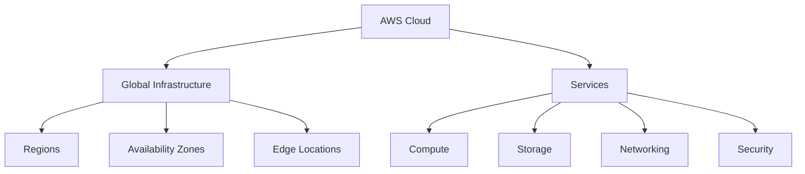
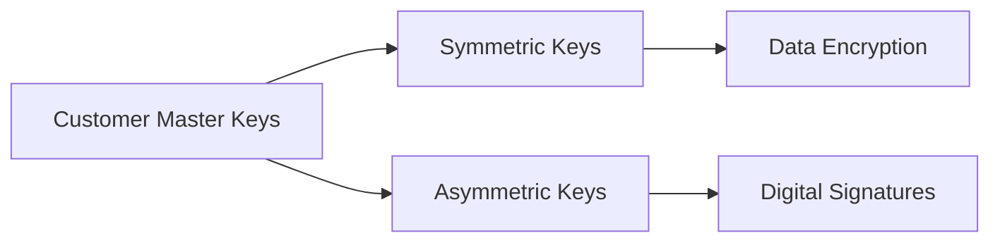
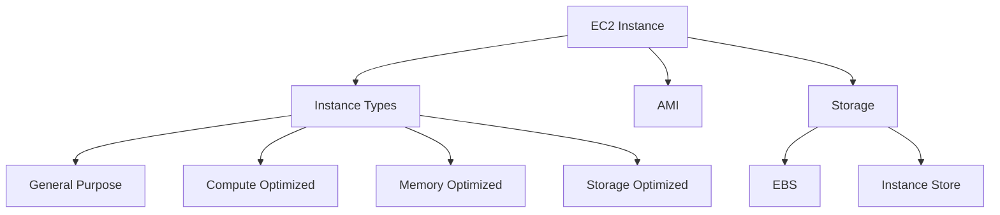
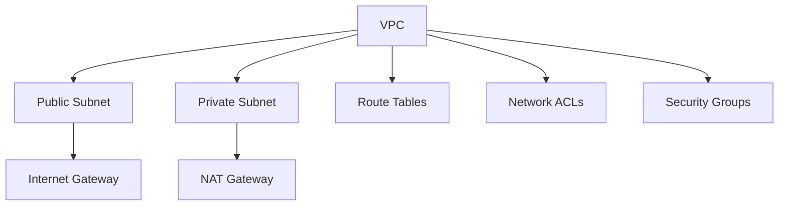
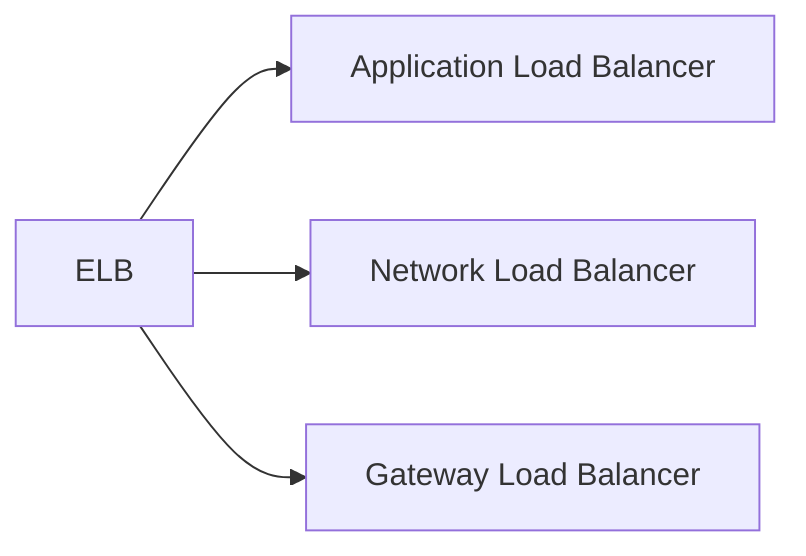
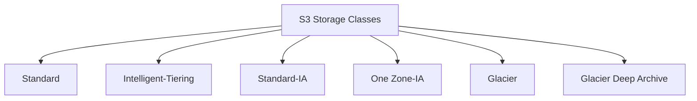
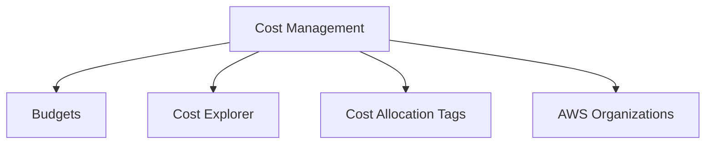
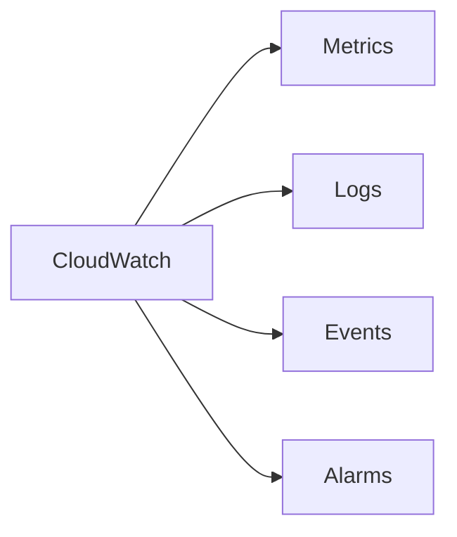
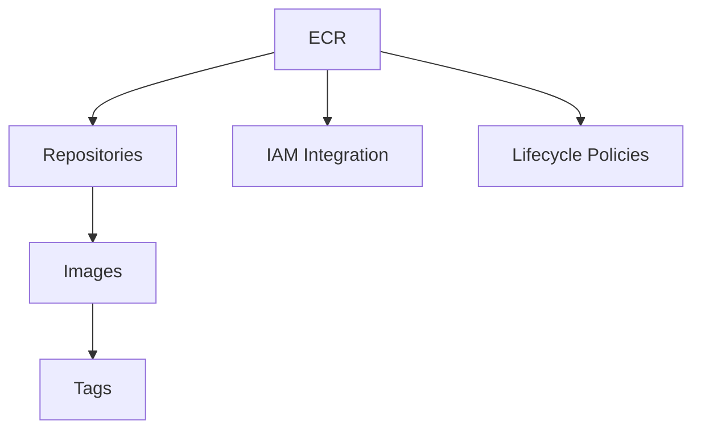
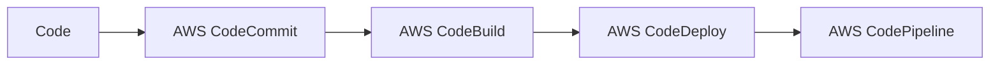

# AWS Cloud Training Documentation 2025
![[aws_banner.png]]

> [!info] Training Overview
> **Duration**: March 19-20, 2025
> **Instructor**: Dr. Dayanand Ambawade
> **Location**: Virtual/Online Training

## Table of Contents
1. [[#Day 1: AWS Fundamentals (March 19, 2025)]]
    - [[#3.1 AWS Basics]]
    - [[#3.2 AWS Virtual Machines (EC2)]]
    - [[#3.3 AWS Virtual Private Cloud (VPC)]]
    - [[#3.4 Amazon S3: Simple Storage Service]]
2. [[#Day 2: Advanced AWS & DevOps (March 20, 2025)]]
    - [[#4.1 Cost Management and Billing]]
    - [[#4.2 AWS DevOps - Part 1]]
    - [[#4.3 AWS DevOps - Part 2]]

## Day 1: AWS Fundamentals (March 19, 2025)

### 3.1 AWS Basics
**Time**: 9:30 AM - 11:00 AM

#### Introduction to AWS

##### Key Components
> [!note] AWS Account Structure
> - Root Account
> - IAM Users
> - Organizations
> - Resource Groups

##### Hands-on Activities
> [!example] Practical Exercises
> 1. Create an AWS Account
> 2. Set up Multi-Factor Authentication (MFA)
> 3. Create Resource Groups
> 4. Navigate AWS Management Console

##### IP Management
- Understanding CIDR notation
- Public vs Private IP addressing
- Elastic IPs

##### AWS KMS (Key Management Service)

### 3.2 AWS Virtual Machines (EC2)
**Time**: 11:15 AM - 1:15 PM

#### EC2 Overview

> [!tip] Best Practices
> - Choose the right instance type
> - Use spot instances for cost optimization
> - Implement auto-scaling
> - Regular backups and snapshots

##### Hands-on Activities
1. Launch an EC2 instance
2. Connect using SSH
3. Configure security groups
4. Create and attach EBS volumes

### 3.3 AWS Virtual Private Cloud (VPC)
**Time**: 2:15 PM - 4:15 PM

#### VPC Architecture

##### Network Components
> [!info] Key Elements
> - Subnets
> - Route Tables
> - Internet Gateway
> - NAT Gateway
> - Network ACLs
> - Security Groups

##### Load Balancing

### 3.4 Amazon S3: Simple Storage Service
**Time**: 4:30 PM - 6:30 PM

#### Storage Classes

> [!note] Storage Features
> - Versioning
> - Lifecycle Management
> - Encryption
> - Access Control
> - Cross-Region Replication

##### Hands-on Activities
1. Create S3 bucket
2. Upload and manage objects
3. Configure bucket policies
4. Set up encryption

## Day 2: Advanced AWS & DevOps (March 20, 2025)

### 4.1 Cost Management and Billing
**Time**: 9:30 AM - 11:00 AM

#### Cost Optimization

> [!warning] Cost Control Measures
> - Set up billing alerts
> - Use cost allocation tags
> - Implement resource scheduling
> - Regular cost analysis

#### Monitoring & Analytics

### 4.2 AWS DevOps - Part 1
**Time**: 11:15 AM - 1:15 PM

#### Amazon ECR

> [!example] Hands-on ECR
> 1. Create ECR repository
> 2. Build Docker image
> 3. Push image to ECR
> 4. Pull and deploy image

### 4.3 AWS DevOps - Part 2
**Time**: 2:15 PM - 5:30 PM

#### CI/CD Pipeline

> [!tip] DevOps Best Practices
> - Infrastructure as Code
> - Automated Testing
> - Continuous Monitoring
> - Regular Backups
> - Security Automation

##### Hands-on Activities
1. Set up CodeCommit repository
2. Configure CodeBuild project
3. Create CodeDeploy application
4. Build complete CI/CD pipeline

---

> [!success] Training Completion
> Upon completion of this training, participants will have:
> - Practical experience with AWS core services
> - Understanding of cloud architecture
> - Hands-on experience with DevOps tools
> - Knowledge of cost optimization
> - Security best practices implementation skills

