# AWS Cloud Training Documentation 2025
![[aws_banner.png]]

> [!info] Training Overview
> **Duration**: March 19-20, 2025
> **Instructor**: Dr. Dayanand Ambawade
> **Location**: Virtual/Online Training

## Table of Contents
1. [[#Day 1: AWS Fundamentals (March 19, 2025)]]
    - [[#3.1 AWS Basics]]
    - [[#3.2 AWS Virtual Machines (EC2)]]
    - [[#3.3 AWS Virtual Private Cloud (VPC)]]
    - [[#3.4 Amazon S3: Simple Storage Service]]
2. [[#Day 2: Advanced AWS & DevOps (March 20, 2025)]]
    - [[#4.1 Cost Management and Billing]]
    - [[#4.2 AWS DevOps - Part 1]]
    - [[#4.3 AWS DevOps - Part 2]]

## Day 1: AWS Fundamentals (March 19, 2025)

### 3.1 AWS Basics
**Time**: 9:30 AM - 11:00 AM

#### Introduction to AWS
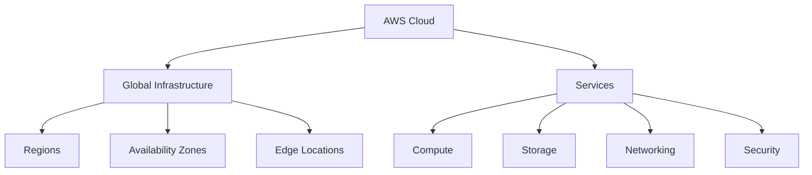

##### Key Components
> [!note] AWS Account Structure
> - Root Account
> - IAM Users
> - Organizations
> - Resource Groups

##### Hands-on Activities
> [!example] Practical Exercises
> 1. Create an AWS Account
> 2. Set up Multi-Factor Authentication (MFA)
> 3. Create Resource Groups
> 4. Navigate AWS Management Console

##### IP Management
- Understanding CIDR notation
- Public vs Private IP addressing
- Elastic IPs

##### AWS KMS (Key Management Service)
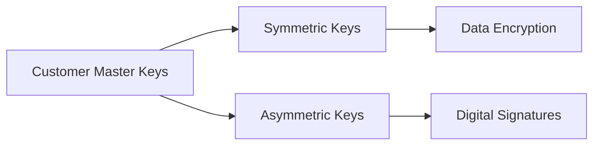

### 3.2 AWS Virtual Machines (EC2)
**Time**: 11:15 AM - 1:15 PM

#### EC2 Overview
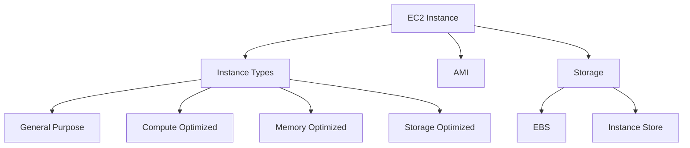

> [!tip] Best Practices
> - Choose the right instance type
> - Use spot instances for cost optimization
> - Implement auto-scaling
> - Regular backups and snapshots

##### Hands-on Activities
1. Launch an EC2 instance
2. Connect using SSH
3. Configure security groups
4. Create and attach EBS volumes

### 3.3 AWS Virtual Private Cloud (VPC)
**Time**: 2:15 PM - 4:15 PM

#### VPC Architecture
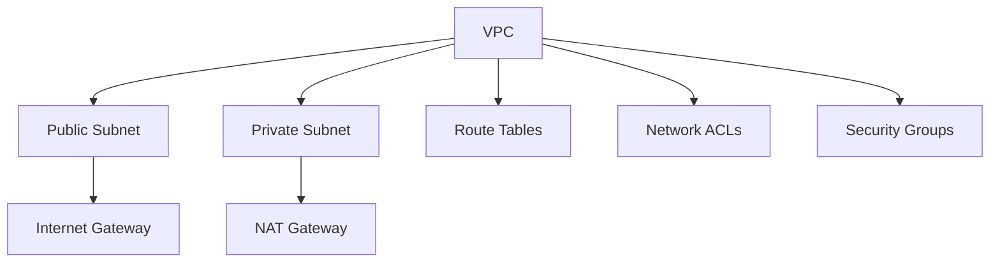

##### Network Components
> [!info] Key Elements
> - Subnets
> - Route Tables
> - Internet Gateway
> - NAT Gateway
> - Network ACLs
> - Security Groups

##### Load Balancing
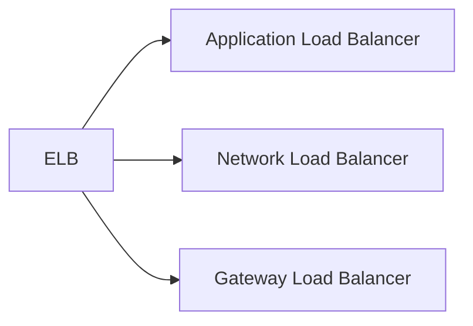

### 3.4 Amazon S3: Simple Storage Service
**Time**: 4:30 PM - 6:30 PM

#### Storage Classes
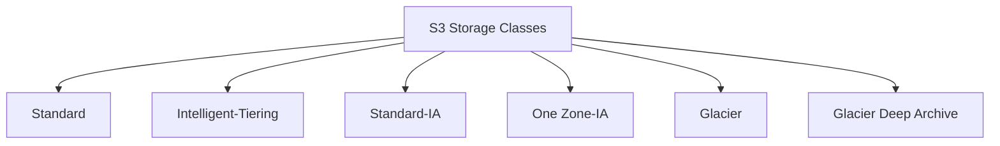

> [!note] Storage Features
> - Versioning
> - Lifecycle Management
> - Encryption
> - Access Control
> - Cross-Region Replication

##### Hands-on Activities
1. Create S3 bucket
2. Upload and manage objects
3. Configure bucket policies
4. Set up encryption

## Day 2: Advanced AWS & DevOps (March 20, 2025)

### 4.1 Cost Management and Billing
**Time**: 9:30 AM - 11:00 AM

#### Cost Optimization
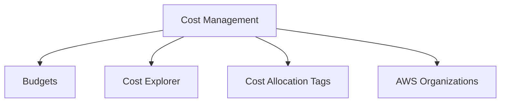

> [!warning] Cost Control Measures
> - Set up billing alerts
> - Use cost allocation tags
> - Implement resource scheduling
> - Regular cost analysis

#### Monitoring & Analytics
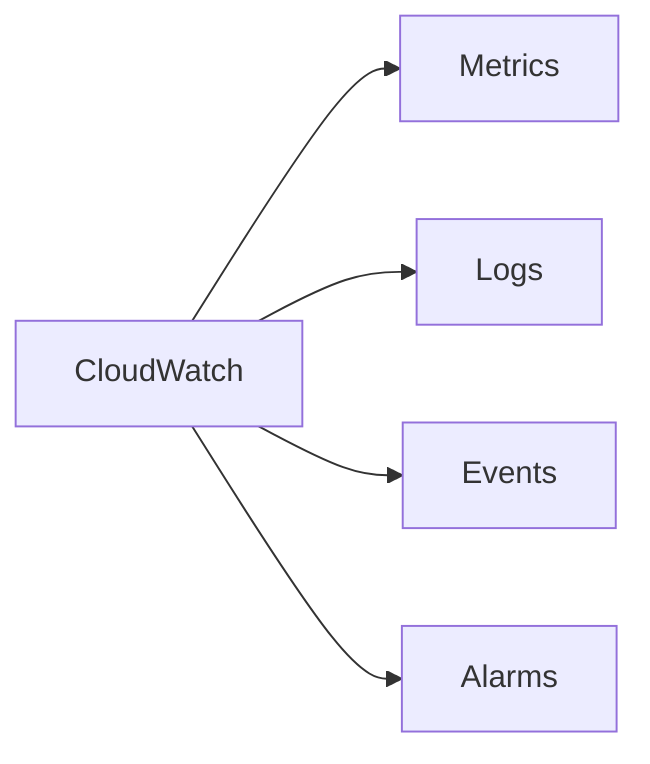

### 4.2 AWS DevOps - Part 1
**Time**: 11:15 AM - 1:15 PM

#### Amazon ECR
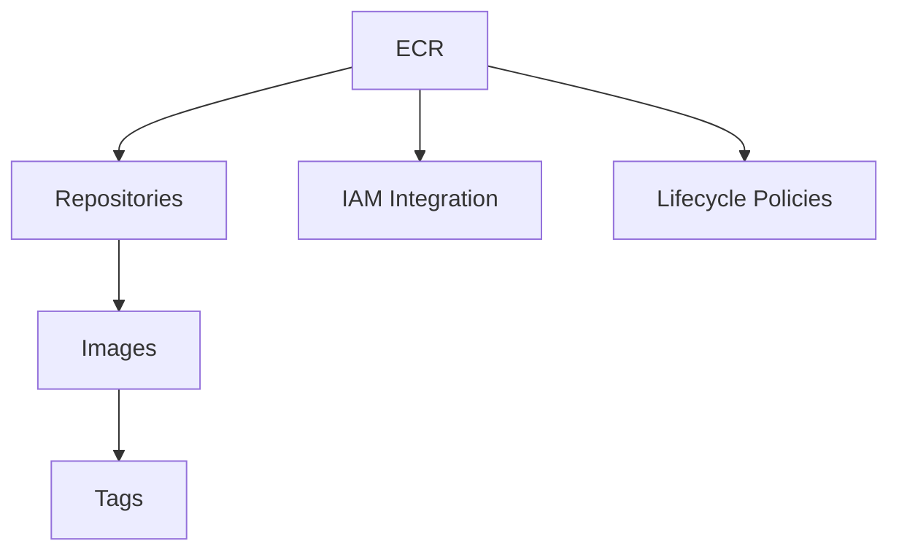

> [!example] Hands-on ECR
> 1. Create ECR repository
> 2. Build Docker image
> 3. Push image to ECR
> 4. Pull and deploy image

### 4.3 AWS DevOps - Part 2
**Time**: 2:15 PM - 5:30 PM

#### CI/CD Pipeline
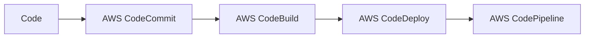

> [!tip] DevOps Best Practices
> - Infrastructure as Code
> - Automated Testing
> - Continuous Monitoring
> - Regular Backups
> - Security Automation

##### Hands-on Activities
1. Set up CodeCommit repository
2. Configure CodeBuild project
3. Create CodeDeploy application
4. Build complete CI/CD pipeline

---

> [!success] Training Completion
> Upon completion of this training, participants will have:
> - Practical experience with AWS core services
> - Understanding of cloud architecture
> - Hands-on experience with DevOps tools
> - Knowledge of cost optimization
> - Security best practices implementation skills

# Presentation Guide: AWS for Banking Professionals

> [!info] Presentation Overview
> This section provides a structured approach to delivering the AWS training specifically for banking professionals, using real-world scenarios and storytelling techniques.

## Introduction Story: The Digital Banking Revolution

> [!quote] Opening Hook
> "Imagine it's Monday morning, and your bank's mobile app is experiencing unprecedented traffic. Millions of customers are trying to check their accounts simultaneously. In the traditional infrastructure, this would mean system crashes and frustrated customers. But with AWS, this is just another normal day..."

### 1. Setting the Stage (15 minutes)

#### Banking Industry Challenges
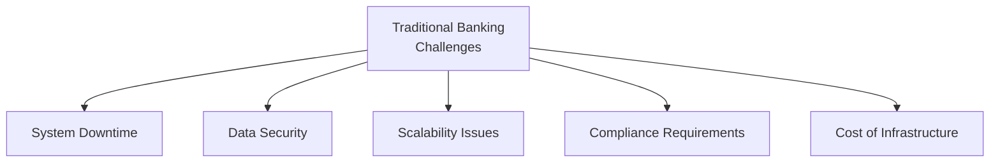

> [!example] Interactive Opening
> Ask participants:
> - How many of you have experienced system downtimes during month-end processing?
> - What's your biggest infrastructure challenge?
> - How do you currently handle peak loads?

### 2. The AWS Solution Journey (30 minutes)

#### Story Arc 1: Security and Compliance
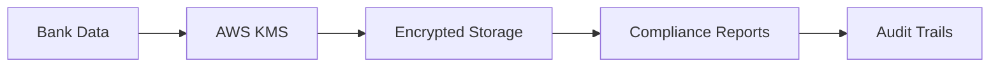

> [!note] Key Discussion Points
> - AWS Financial Services Competency
> - Banking regulatory compliance
> - Data sovereignty
> - Encryption at rest and in transit

#### Story Arc 2: High Availability Banking
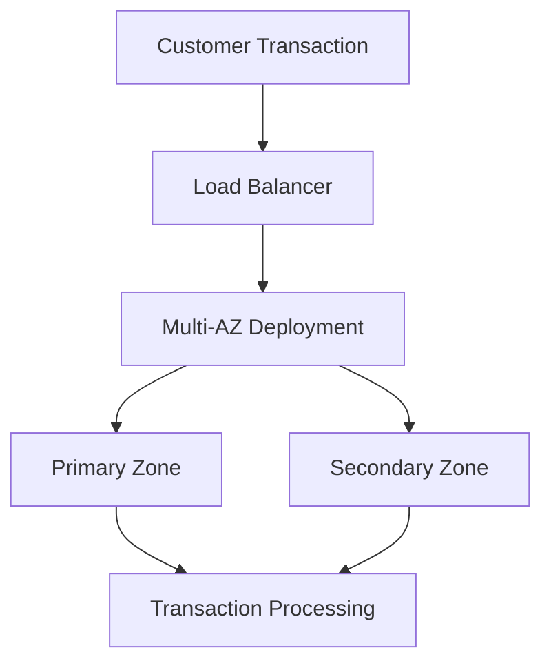

### 3. Hands-on Scenarios (90 minutes)

#### Scenario 1: Digital Banking Platform
> [!example] Practice Exercise
> "Let's build a highly available banking infrastructure"
> 1. Set up VPC with private subnets for database
> 2. Configure security groups for banking applications
> 3. Implement encryption for sensitive data
> 4. Set up monitoring for transactions

#### Scenario 2: Disaster Recovery
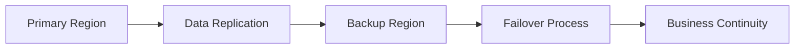

### 4. Cost Optimization for Banks (45 minutes)

#### ROI Analysis
> [!tip] Banking-Specific Cost Savings
> - Reserved Instances for core banking
> - Auto-scaling for online banking
> - Storage tiering for transaction history
> - Pay-per-use for seasonal operations

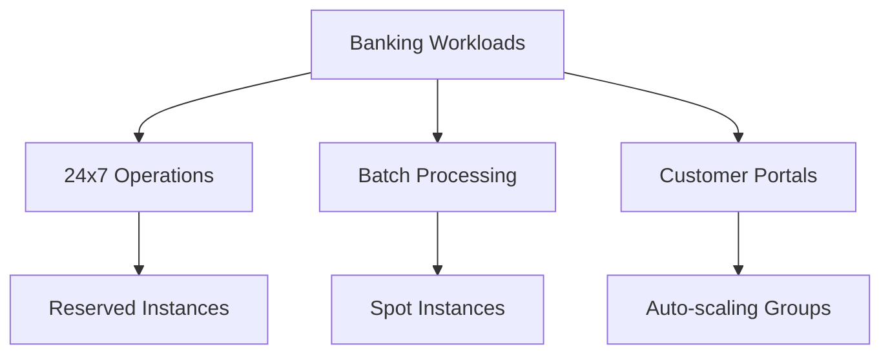

### 5. Real-world Implementation (60 minutes)

#### Case Study: Modern Banking Transformation
> [!success] Success Story Elements
> - Legacy system migration
> - Performance improvements
> - Cost savings
> - Enhanced security
> - Better customer experience

### Presentation Tips

#### Engagement Techniques
> [!tip] Keeping Banking Professionals Engaged
> 1. **Use Banking Terminology**
>    - Relate AWS services to banking processes
>    - Use financial industry examples
> 
> 2. **Interactive Elements**
>    - Real-time demos of security features
>    - Group discussions on compliance
>    - Problem-solving scenarios
> 
> 3. **Real-world Applications**
>    - Mobile banking architecture
>    - Payment processing systems
>    - Fraud detection implementation

#### Time Management

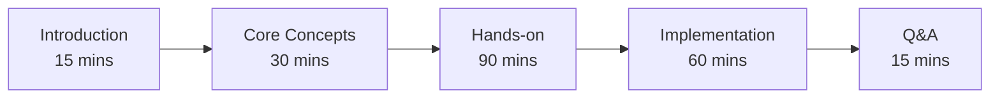

### Session Closure

> [!quote] Concluding Message
> "As we've seen today, AWS isn't just about cloud computing - it's about transforming banking for the digital age. You now have the tools and knowledge to begin this transformation in your own institutions."

#### Follow-up Resources
> [!note] Additional Materials
> - AWS Financial Services Cloud Adoption Framework
> - Banking Security Best Practices Guide
> - Compliance Documentation Templates
> - Architecture Design Patterns
> - Cost Calculator for Banking Workloads

---

> [!success] Key Takeaways for Banking Professionals
> 1. **Security First**: AWS's comprehensive security features for banking
> 2. **Always Available**: High availability for critical banking services
> 3. **Cost Effective**: Optimized infrastructure costs for banking operations
> 4. **Compliant Ready**: Built-in tools for regulatory compliance
> 5. **Future Proof**: Scalable architecture for growing banking needs

# Hands-on Labs Guide

> [!info] Lab Prerequisites
> - AWS Account with administrative access
> - Web browser
> - Basic understanding of cloud concepts
> - SSH client (PuTTY for Windows users)
> - Sample application files (provided)

## Day 1 Labs

### Lab 3.1: AWS Basics (90 minutes)

#### Exercise 1: AWS Account Setup and Navigation
> [!example] Tasks:
> 1. **Login to AWS Console**
>    - Navigate to aws.amazon.com
>    - Use provided credentials
>    - Enable MFA for your account
> 
> 2. **Create Resource Groups**
>    ```bash
>    # Tag structure for banking resources
>    Department: Banking
>    Environment: Training
>    Project: DigitalBanking
>    ```
>    - Create a resource group for "Banking-Production"
>    - Create a resource group for "Banking-Development"
>    - Add tag-based grouping

#### Exercise 2: IP Management
> [!example] Tasks:
> 1. **Understanding CIDR**
>    - Plan IP addressing for banking infrastructure
>    ```plaintext
>    Production VPC: 10.0.0.0/16
>    Public Subnet: 10.0.1.0/24
>    Private Subnet: 10.0.2.0/24
>    ```
>    - Use AWS CIDR calculator
>    - Document IP allocation plan

#### Exercise 3: AWS KMS Setup
> [!example] Tasks:
> 1. **Create Customer Managed Key**
>    - Navigate to AWS KMS
>    - Create symmetric encryption key
>    - Set up key policies
>    - Create key aliases
> 
> 2. **Configure Key Rotation**
>    - Enable automatic key rotation
>    - Set up key usage alerts

### Lab 3.2: EC2 Implementation (120 minutes)

#### Exercise 1: Launch Banking Application Server
> [!example] Tasks:
> 1. **Create EC2 Instance**
>    ```bash
>    Instance Type: t2.micro
>    AMI: Amazon Linux 2
>    Storage: 20GB GP3
>    ```
>    - Launch EC2 instance
>    - Configure security group
>    - Create and assign key pair
> 
> 2. **Connect to Instance**
>    ```bash
>    chmod 400 banking-key.pem
>    ssh -i banking-key.pem ec2-user@<instance-ip>
>    ```

#### Exercise 2: EC2 Management
> [!example] Tasks:
> 1. **Install Banking Application**
>    ```bash
>    sudo yum update -y
>    sudo yum install -y httpd
>    sudo systemctl start httpd
>    ```
> 
> 2. **Configure Auto Scaling**
>    - Create AMI from instance
>    - Create launch template
>    - Set up Auto Scaling group
>    - Configure scaling policies

### Lab 3.3: VPC Configuration (120 minutes)

#### Exercise 1: Banking VPC Setup
> [!example] Tasks:
> 1. **Create VPC**
>    ```plaintext
>    VPC CIDR: 10.0.0.0/16
>    Region: us-east-1
>    ```
>    - Create VPC
>    - Enable DNS hostnames
>    - Configure DHCP options
> 
> 2. **Create Subnets**
>    ```plaintext
>    Public Subnet: 10.0.1.0/24 (AZ-a)
>    Private Subnet: 10.0.2.0/24 (AZ-b)
>    Database Subnet: 10.0.3.0/24 (AZ-c)
>    ```

#### Exercise 2: Network Security
> [!example] Tasks:
> 1. **Configure Security Groups**
>    ```plaintext
>    Web Tier: Allow 80, 443
>    App Tier: Allow 8080 from Web Tier
>    DB Tier: Allow 3306 from App Tier
>    ```
> 
> 2. **Set up Network ACLs**
>    - Create custom NACLs
>    - Configure inbound rules
>    - Configure outbound rules

#### Exercise 3: Load Balancer Setup
> [!example] Tasks:
> 1. **Create Application Load Balancer**
>    - Configure listeners
>    - Create target groups
>    - Set up health checks
> 
> 2. **Test Load Balancing**
>    - Deploy test applications
>    - Verify load distribution
>    - Monitor metrics

### Lab 3.4: S3 Storage Configuration (120 minutes)

#### Exercise 1: S3 Bucket Setup
> [!example] Tasks:
> 1. **Create Banking Data Bucket**
>    ```plaintext
>    Bucket Name: banking-data-<account-id>
>    Region: us-east-1
>    Versioning: Enabled
>    ```
> 
> 2. **Configure Bucket Policies**
>    ```json
>    {
>      "Version": "2012-10-17",
>      "Statement": [
>        {
>          "Effect": "Allow",
>          "Principal": {
>            "AWS": "arn:aws:iam::account-id:role/BankingApp"
>          },
>          "Action": ["s3:GetObject", "s3:PutObject"],
>          "Resource": "arn:aws:s3:::banking-data-*/*"
>        }
>      ]
>    }
>    ```

#### Exercise 2: Data Encryption
> [!example] Tasks:
> 1. **Enable Encryption**
>    - Configure default encryption
>    - Use KMS key created earlier
>    - Set up encryption rules
> 
> 2. **Test File Operations**
>    - Upload sensitive files
>    - Verify encryption
>    - Test file retrieval

## Day 2 Labs

### Lab 4.1: Cost Management (90 minutes)

#### Exercise 1: Budget Setup
> [!example] Tasks:
> 1. **Create Budgets**
>    ```plaintext
>    Monthly Budget: $1000
>    Alert at: 80%, 90%, 100%
>    ```
>    - Set up cost budget
>    - Configure alerts
>    - Set up email notifications
> 
> 2. **Configure Cost Explorer**
>    - Create custom reports
>    - Set up daily tracking
>    - Analyze cost patterns

#### Exercise 2: CloudWatch Monitoring
> [!example] Tasks:
> 1. **Create Dashboards**
>    - Set up EC2 monitoring
>    - Configure custom metrics
>    - Create alarms
> 
> 2. **Log Analytics**
>    - Configure log groups
>    - Set up log insights
>    - Create alerts

### Lab 4.2: ECR Implementation (120 minutes)

#### Exercise 1: Container Registry Setup
> [!example] Tasks:
> 1. **Create ECR Repository**
>    ```bash
>    aws ecr create-repository \
>        --repository-name banking-app \
>        --image-scanning-configuration scanOnPush=true
>    ```
> 
> 2. **Build Docker Image**
>    ```bash
>    docker build -t banking-app .
>    docker tag banking-app:latest <aws-account>.dkr.ecr.<region>.amazonaws.com/banking-app:latest
>    ```

#### Exercise 2: Image Management
> [!example] Tasks:
> 1. **Push Images**
>    ```bash
>    aws ecr get-login-password | docker login --username AWS --password-stdin <aws-account>.dkr.ecr.<region>.amazonaws.com
>    docker push <aws-account>.dkr.ecr.<region>.amazonaws.com/banking-app:latest
>    ```
> 
> 2. **Configure Lifecycle Policies**
>    - Set up image retention
>    - Configure scanning
>    - Manage tags

### Lab 4.3: CI/CD Pipeline (180 minutes)

#### Exercise 1: CodeCommit Setup
> [!example] Tasks:
> 1. **Create Repository**
>    ```bash
>    aws codecommit create-repository \
>        --repository-name banking-app \
>        --repository-description "Banking Application Repository"
>    ```
> 
> 2. **Configure Git Credentials**
>    - Set up HTTPS credentials
>    - Configure SSH keys
>    - Clone repository

#### Exercise 2: Pipeline Creation
> [!example] Tasks:
> 1. **Create CodeBuild Project**
>    ```yaml
>    version: 0.2
>    phases:
>      build:
>        commands:
>          - npm install
>          - npm test
>          - npm run build
>    artifacts:
>      files: ['**/*']
>    ```
> 
> 2. **Configure CodePipeline**
>    - Source stage (CodeCommit)
>    - Build stage (CodeBuild)
>    - Deploy stage (EC2/ECS)
>    - Test automated deployment

> [!success] Lab Completion Checklist
> - [ ] AWS Console Navigation
> - [ ] Resource Group Creation
> - [ ] EC2 Instance Management
> - [ ] VPC Configuration
> - [ ] S3 Bucket Setup
> - [ ] Cost Management
> - [ ] Container Registry
> - [ ] CI/CD Pipeline
> 
> Each participant should complete all checkboxes before proceeding to the next module.

