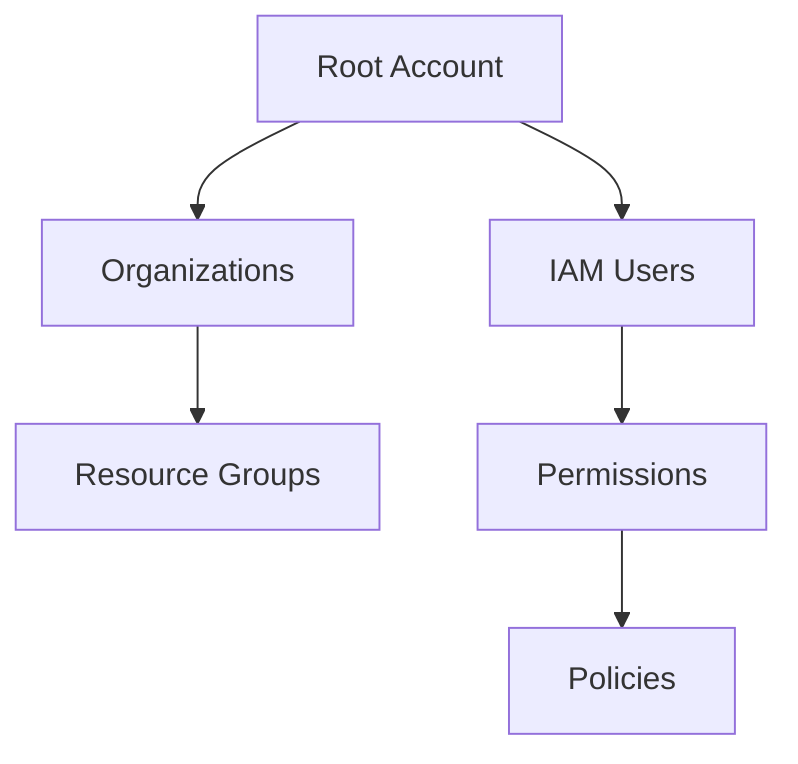
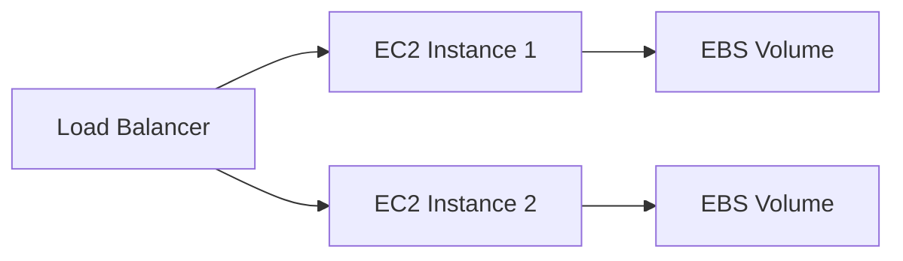
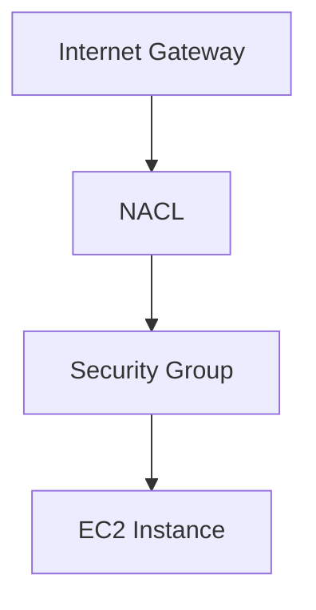
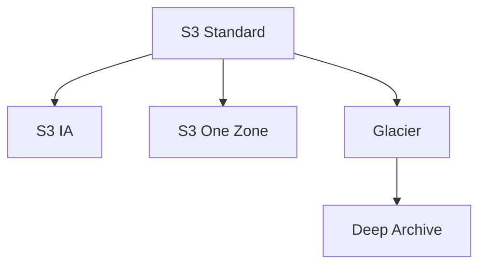
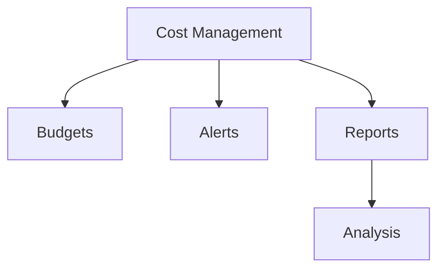
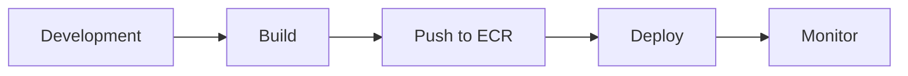
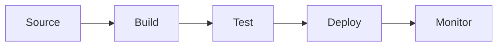

# AWS Cloud Training 2025
## Banking & Financial Services Edition

Dr. Dayanand Ambawade
March 19-20, 2025

---

# Training Overview

- **Duration**: 2 Days
- **Focus**: Banking Sector Implementation
- **Approach**: Hands-on Learning
- **Modules**: 7 Comprehensive Sections

---

# Day 1 Schedule | March 19, 2025

| Time | Module |
|------|--------|
| 9:30 - 11:00 | AWS Basics |
| 11:15 - 1:15 | AWS EC2 |
| 2:15 - 4:15 | AWS VPC |
| 4:30 - 6:30 | Amazon S3 |

---

# Day 2 Schedule | March 20, 2025

| Time | Module |
|------|--------|
| 9:30 - 11:00 | Cost Management |
| 11:15 - 1:15 | AWS DevOps Part-1 |
| 2:15 - 5:30 | AWS DevOps Part-2 |

---

# Module 3.1: AWS Basics

- AWS Account Management
- Resource Groups
- IP Management
- AWS KMS

---

# AWS Account Structure

---

# IP Management in AWS

- CIDR Notation
- Public vs Private IPs
- Elastic IP Configuration
- IP Range Planning

---

# Module 3.2: EC2 Implementation

- Instance Types
- AMI Selection
- Storage Options
- Auto Scaling

---

# EC2 Architecture

---

# Module 3.3: VPC Design

- VPC Components
- Subnet Planning
- Security Groups
- Network ACLs

---

# VPC Security Layers

---

# Module 3.4: S3 Storage

- Storage Classes
- Bucket Policies
- Encryption Options
- Lifecycle Rules

---

# S3 Storage Classes

---

# Module 4.1: Cost Management

- Budgets
- Cost Explorer
- CloudWatch
- Alerts

---

# Cost Optimization

---

# Module 4.2: ECR & Containers

- Container Basics
- ECR Setup
- Image Management
- Security

---

# Container Workflow

---

# Module 4.3: CI/CD Pipeline

- CodeCommit
- CodeBuild
- CodeDeploy
- CodePipeline

---

# CI/CD Architecture

---

# Hands-on Labs Overview

1. AWS Console Navigation
2. Resource Group Creation
3. EC2 Management
4. VPC Setup
5. S3 Configuration
6. Cost Management
7. Container Registry
8. Pipeline Setup

---

# Best Practices & Guidelines

- 🔒 Security First
- 💰 Cost Optimization
- 🔄 Automation
- 📊 Monitoring
- 🔍 Compliance

---

# Thank You!

## Contact Information
- Email: instructor@example.com
- AWS Training Portal: aws.training
- Support: Available 24/7

