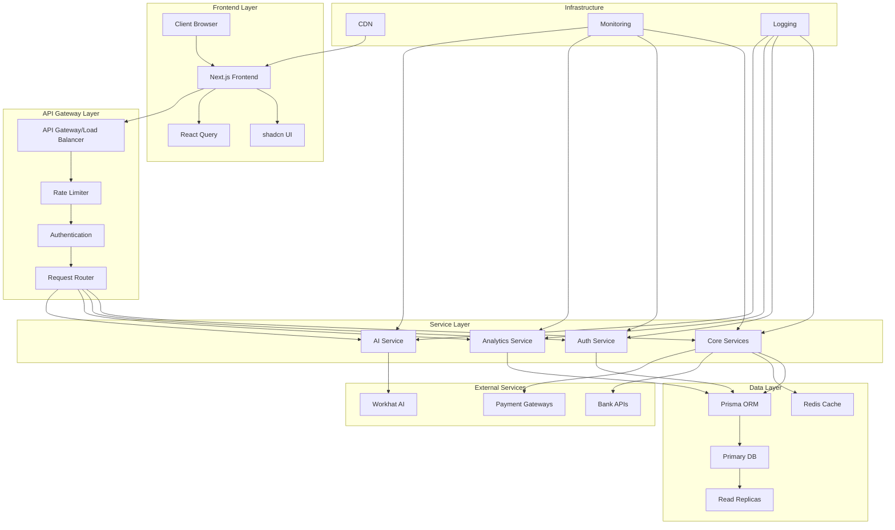
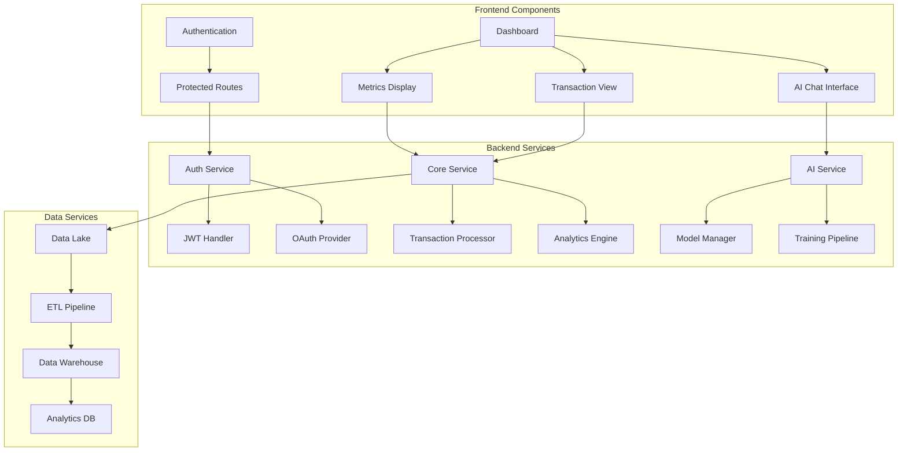
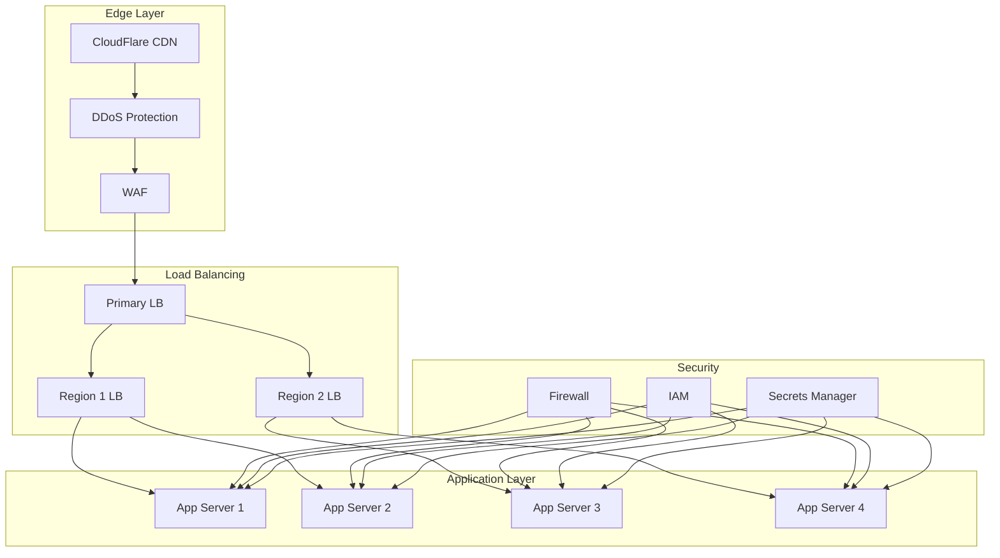
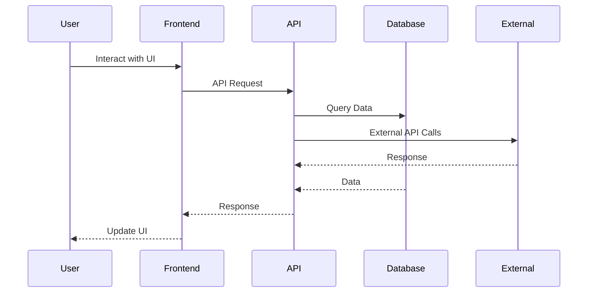
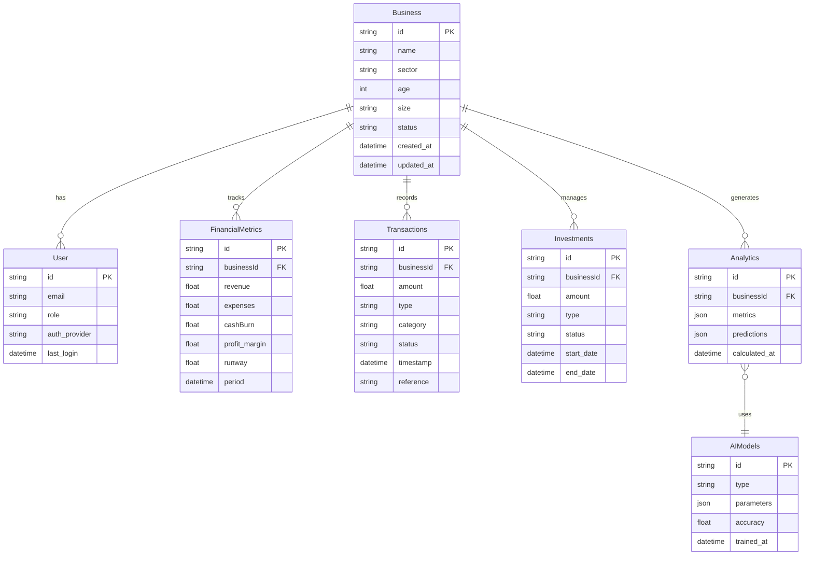
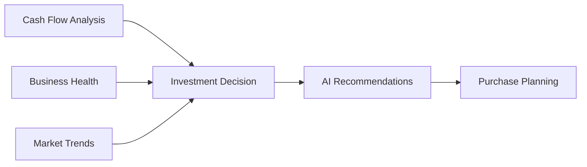

---
tags:
  - fintech
  - smb
  - dashboard
  - documentation
aliases:
  - BuFi Platform
  - SMB Financial Health Dashboard
author: BuFi Team
created: 2024
status: active
share_link: https://share.note.sx/dmlusieh#StpUBObrrbqOdHbN85rg2iQxAiXgKyaNkdmRrhw1IQk
share_updated: 2025-02-21T20:59:14+05:30
---

# BuFi Platform Documentation

> [!info] About BuFi
> BuFi is a comprehensive financial health dashboard for Small and Medium Businesses (SMBs), providing AI-powered insights, cash flow management, and smart investment planning.

## Table of Contents
1. [[#System Architecture]]
2. [[#Component Architecture]]
3. [[#Network Architecture]]
4. [[#Security Architecture]]
5. [[#Deployment Architecture]]
6. [[#Database Architecture]]
7. [[#Technical Stack]]
8. [[#Service Patterns]]
9. [[#Monitoring Architecture]]
10. [[#Data Flow]]
11. [[#Features]]
12. [[#Implementation Details]]
13. [[#User Workflows]]
14. [[#Performance & Scaling]]
15. [[#Development & CI/CD]]

## System Architecture

> [!important] High-Level Overview
> The BuFi platform follows a modern microservices architecture with focus on scalability, security, and performance.



### Core Components
> [!note] Architecture Components
> - **Frontend**: Next.js with shadcn UI
> - **API Gateway**: Custom gateway with rate limiting
> - **Services**: Microservices architecture
> - **Database**: PostgreSQL with read replicas
> - **Cache**: Redis for performance
> - **AI Integration**: Workhat API
> - **External Services**: Bank APIs, Payment Gateways
> - **Infrastructure**: CDN, Monitoring, Logging

## Component Architecture



## Network Architecture



## Technical Stack

### Frontend Technologies
- Next.js Framework
- shadcn UI Component Library
- React Query for Data Fetching
- TailwindCSS for Styling

### Backend Technologies
- Next.js API Routes
- Prisma ORM
- PostgreSQL Database
- Workhat API Integration

### Data Flow Architecture



## Database Architecture



### Database Optimization

> [!tip] Performance Tuning
> - Indexed fields: id, businessId, timestamp, type
> - Partitioned tables: Transactions, FinancialMetrics
> - Materialized views: Analytics dashboards
> - Read replicas: For heavy reporting queries

## Features

### 1. Financial Health Metrics

> [!tip] Key Components
> - Revenue Tracking
> - P&L Visualization
> - Cash Burn Analysis
> - Expense Monitoring

#### Implementation Details
```typescript
interface FinancialMetrics {
revenue: {
    current: number;
    growth: number;
    sources: string[];
};
expenses: {
    categories: Record<string, number>;
    monthly: number;
};
cashBurn: {
    rate: number;
    runway: number;
};
}
```

### 2. Cash Flow Management

> [!important] Banking Integration
> Utilizes RBI Account Aggregator framework for secure bank data access

### 3. Tax & Compliance Module

> [!warning] Compliance Requirements
> - GST Calculation
> - Tax Liability Tracking
> - Regular Updates for Tax Laws

### 4. Smart Inventory & Investment Planning



### 5. AI Chatbot Integration

> [!note] AI Capabilities
> - Financial Analysis
> - Expense Planning
> - Purchase Recommendations
> - Feasibility Assessment

## User Workflows

### Onboarding Process
1. Business Profile Creation
2. Financial Details Submission
3. Bank Account Integration
4. Compliance Verification

### Regular Operations
1. Dashboard Overview
2. Financial Health Monitoring
3. Transaction Analysis
4. Investment Planning

## Technical Specifications

### API Endpoints
```typescript
// Core API Routes
/api/metrics    // Financial metrics
/api/cashflow   // Cash flow analysis
/api/inventory  // Inventory management
/api/ai         // AI chatbot endpoints
```

### Security Measures
> [!warning] Security Protocols
> - End-to-end encryption
> - OAuth 2.0 authentication
> - Regular security audits
> - Data backup protocols

## Development Guidelines

> [!tip] Best Practices
> 1. Follow Next.js conventions
> 2. Use Prisma migrations
> 3. Implement proper error handling
> 4. Maintain test coverage
> 5. Document API changes

---

> [!info] Related Links
> - [[Technical Documentation]]
> - [[API Reference]]
> - [[Deployment Guide]]
> - [[Security Protocols]]

