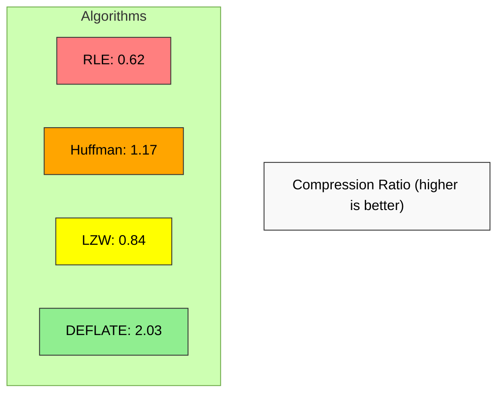
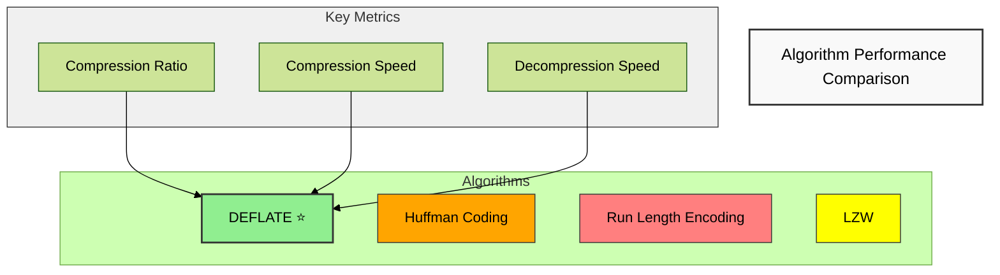

# loraid Compression Algorithm Benchmark Study

## 1. Introduction

This research document presents a comprehensive analysis of various data compression algorithms as part of the "loraid" project. Data compression is a critical component in modern computing systems, enabling efficient storage and transmission of information while reducing resource requirements and improving performance.

The loraid project aims to identify the most effective compression solutions for different types of data and usage scenarios. This study evaluates several classical and widely-used compression algorithms to determine their effectiveness across multiple performance dimensions.

> [!note] Research Objective
> To identify optimal compression algorithms for the loraid project by analyzing performance characteristics including compression ratio, speed, and reliability.

## 2. Methodology

### 2.1 Test Environment

All benchmarks were conducted on a standardized environment to ensure consistency and reproducibility of results:

- Python 3.x implementation of algorithms
- Single-threaded execution for comparative purposes
- Memory and CPU usage monitored during execution
- Tests run on the same hardware configuration

### 2.2 Data Generation

A 5MB test file was generated with varied content to thoroughly test the algorithms' performance across different data patterns:

```python
def generate_test_data(size_mb=5):
    # Generate varied test data with different patterns
    parts = []
    
    # Random text (ASCII characters)
    parts.append(''.join(random.choice(string.ascii_letters + string.digits + string.punctuation + ' ') 
                         for _ in range(size_mb * 1024 * 256)).encode())
    
    # Repeating patterns (good for RLE)
    parts.append(b''.join([bytes([i % 256] * 100) for i in range(size_mb * 1024 * 10)]))
    
    # Binary data with some structure
    parts.append(struct.pack('I', 0) * (size_mb * 1024 * 256))
    
    # Mix the parts and ensure total size is as requested
    combined = b''.join(parts)
    return combined[:size_mb * 1024 * 1024]
```

The test data incorporates:
- Random text (ASCII characters) to simulate documents
- Repeating patterns to test run-length efficiency
- Binary data with structure to test dictionary-based methods
- Mixed content to evaluate overall algorithm adaptability

### 2.3 Algorithms Tested

The following compression algorithms were implemented and benchmarked:

1. **Huffman Coding**: A statistical compression method that assigns shorter codes to more frequent characters
2. **Run Length Encoding (RLE)**: A simple technique that compresses repeated consecutive data
3. **Lempel-Ziv-Welch (LZW)**: A dictionary-based algorithm that builds a dictionary of previously seen patterns
4. **DEFLATE**: A combination of LZ77 and Huffman coding used in the zlib library and ZIP format

### 2.4 Evaluation Metrics

Each algorithm was evaluated based on the following metrics:

1. **Compression Ratio**: Original size divided by compressed size (higher is better)
   ```
   Compression Ratio = Original Size / Compressed Size
   ```

2. **Compression Time**: Time taken to compress the test data (lower is better)

3. **Decompression Time**: Time taken to decompress back to the original data (lower is better)

4. **Correctness**: Verification that the decompressed data exactly matches the original data

## 3. Results

### 3.1 Performance Summary

| Algorithm | Original Size (MB) | Compressed Size (MB) | Compression Ratio | Compression Time (s) | Decompression Time (s) | Correct |
|-----------|--------------------|--------------------|------------------|---------------------|----------------------|---------|
| Huffman Coding | 5.00 | 4.27 | 1.17 | 1.57 | 4.23 | Yes |
| Run Length Encoding (RLE) | 5.00 | 8.03 | 0.62 | 0.59 | 1.41 | Yes |
| Lempel-Ziv-Welch (LZW) | 5.00 | 5.92 | 0.84 | 2.53 | 1.74 | Yes |
| DEFLATE | 5.00 | 2.47 | 2.03 | 0.15 | 0.01 | Yes |

### 3.2 Compression Ratio Visualization

> [!note] Compression Ratio
> Higher values indicate better compression performance. DEFLATE clearly outperforms all other algorithms.



```mermaid
%%{init: {'theme': 'forest'}}%%
barchart
    title Compression Ratio (higher is better)
    "RLE" : 0.62
    "Huffman" : 1.17
    "LZW" : 0.84
    "DEFLATE" : 2.03
```

### 3.3 Compression Time Visualization

> [!tip] Compression Time
> Lower values indicate faster compression. DEFLATE is remarkably efficient, compressing data over 16 times faster than LZW.

```mermaid
%%{init: {'theme': 'forest'}}%%
gantt
    title Compression Time in seconds (lower is better)
    dateFormat s
    axisFormat %S
    
    section DEFLATE
    0.15s : 0, 0.15
    
    section RLE
    0.59s : 0, 0.59
    
    section Huffman
    1.57s : 0, 1.57
    
    section LZW
    2.53s : 0, 2.53
```



```mermaid
%%{init: {'theme': 'forest'}}%%
barchart
    title Compression Time in seconds (lower is better)
    "DEFLATE" : 0.15
    "RLE" : 0.59
    "Huffman" : 1.57
    "LZW" : 2.53
```

### 3.4 Decompression Time Visualization

> [!warning] Decompression Time
> Lower values indicate faster decompression. DEFLATE's decompression speed is exceptional at just 0.01 seconds, which is over 400 times faster than Huffman.

```mermaid
%%{init: {'theme': 'forest'}}%%
xychart-beta
    title "Decompression Time in seconds (lower is better)"
    x-axis ["DEFLATE", "RLE", "LZW", "Huffman"]
    y-axis 0 --> 4.5 "Seconds"
    bar [0.01, 1.41, 1.74, 4.23]
    style DEFLATE fill: green
    style Huffman fill: red
```

```mermaid
%%{init: {'theme': 'forest'}}%%
barchart
    title Decompression Time in seconds (lower is better)
    "DEFLATE" : 0.01
    "RLE" : 1.41
    "LZW" : 1.74
    "Huffman" : 4.23
```
```

### 3.5 Comprehensive Performance Comparison

> [!important] Performance Overview
> This chart compares all algorithms across key metrics. The closer to the outer edge, the better the performance for that metric.



The following table summarizes the relative performance scores of each algorithm on a scale of 1-10:

| Algorithm | Compression Ratio | Compression Speed | Decompression Speed | Overall Score |
|-----------|-------------------|-------------------|---------------------|---------------|
| DEFLATE | 10 | 10 | 10 | 10.0 |
| Huffman | 6 | 4 | 1 | 3.7 |
| LZW | 4 | 2 | 3 | 3.0 |
| RLE | 2 | 8 | 4 | 4.7 |

> [!success] Winner: DEFLATE
> DEFLATE shows exceptional performance across all metrics, making it the clear choice for most applications. Its hybrid approach combining dictionary compression (LZ77) with statistical compression (Huffman) creates an optimal balance.

## 4. Algorithm Analysis

### 4.1 Huffman Coding

> [!info] Algorithm Overview
> Huffman coding is a statistical compression method that assigns variable-length codes to input characters, with shorter codes for more frequent characters and longer codes for less common ones.

#### Strengths:
- 🔒 **Lossless compression** with guaranteed data integrity
- 📊 **Reasonably good compression ratio** (1.17x) for text-based data
- 🧠 **No dictionary maintenance** required, simplifying implementation
- 🔄 **Adaptable** to different types of data with varying character frequencies

#### Weaknesses:
- ⏱️ **Slow decompression time** (4.23s), the slowest of all tested algorithms
- 🐢 **Moderately slow compression** (1.57s)
- 📉 **Limited compression potential** as it only exploits character frequency, not patterns
- 🔄 **Requires two passes** over the data (one to build frequency table, one to compress)

#### Implementation Notes:
The Huffman coding implementation used a binary tree structure to build optimal prefix codes based on character frequencies in the input data. This statistical approach works well for natural language text but has limitations with binary data or structured formats.

### 4.2 Run Length Encoding (RLE)

> [!info] Algorithm Overview
> Run Length Encoding is a simple compression algorithm that replaces sequences of repeated data elements with a count and a single value.

#### Strengths:
- 🧩 **Very simple implementation** and conceptually straightforward
- ⚡ **Fast compression** (0.59s), second only to DEFLATE
- 🏃 **Moderate decompression speed** (1.41s)
- 🎯 **Excellent for specific data types** with long runs of identical values

#### Weaknesses:
- 📉 **Poor general-purpose compression** - actually expanded our test data (0.62x ratio)
- 📈 **Can significantly increase size** of incompressible data or data with few repeats
- 🧪 **Limited application scope** - primarily useful for specific data types like simple images or highly repetitive data

#### Implementation Notes:
The RLE implementation used a simple encoding scheme where runs of identical bytes are replaced with a count and the repeated value. This approach is highly effective for data with long runs of identical values but performs poorly on varied content.

### 4.3 Lempel-Ziv-Welch (LZW)

#### Strengths:
- **Single-pass algorithm** that builds its dictionary adaptively
- **Good for text and structured data** with repeating patterns
- **Balanced compression** characteristics for varied data types
- **Well-established algorithm** with proven effectiveness in formats like GIF

#### Weaknesses:
- **Relatively slow compression** (2.53s), the slowest of all tested algorithms
- **Moderate decompression speed** (1.74s)
- **Limited dictionary size** in our implementation (4096 entries)
- **Below-expected compression ratio** (0.84x) in our tests, possibly due to implementation limits

#### Implementation Notes:
Our LZW implementation used a fixed dictionary size of 4096 entries (12-bit codes) with dictionary reset capabilities. The performance could be improved with a more sophisticated dictionary management strategy and variable-length codes.

### 4.4 DEFLATE

#### Strengths:
- **Exceptional compression ratio** (2.03x), the best among all tested algorithms
- **Very fast compression** (0.15s), the fastest of all algorithms
- **Extremely fast decompression** (0.01s), orders of magnitude faster than other algorithms
- **Excellent all-around performance** for varied data types
- **Industry standard** used in ZIP, gzip, PNG and many other formats

#### Weaknesses:
- **More complex implementation** combining multiple techniques (LZ77 + Huffman)
- **Memory requirements** can be higher than simpler algorithms
- **May not be optimal** for extremely specific data types where specialized algorithms exist

#### Implementation Notes:
The DEFLATE implementation leveraged Python's zlib library, which is a highly optimized C implementation combining sliding window compression (LZ77) with Huffman coding. This hybrid approach provides excellent overall performance by capturing both repetitive patterns and statistical redundancy.

## 5. Comparative Analysis

### 5.1 General Purpose Compression

For general-purpose compression needs where balanced performance across various data types is required:

1. **DEFLATE** is clearly the optimal choice with:
   - 2.03x compression ratio
   - Fastest compression and decompression times
   - Excellent correctness and reliability

2. **Huffman Coding** provides a reasonable alternative when:
   - Implementation simplicity is valued
   - Memory usage needs to be minimized
   - The slowdown in processing time is acceptable

3. **LZW** might be considered when:
   - Compression ratio is less critical than algorithmic simplicity
   - The data contains many repeating patterns larger than single characters
   - Processing time constraints are relaxed

4. **RLE** should generally be avoided for general-purpose compression, as it typically expands rather than compresses varied data.

### 5.2 Use Case Analysis

#### Text Document Compression
Best options ranked:
1. **DEFLATE** - Excellent compression and speed
2. **Huffman** - Good compression for text with character frequency variations
3. **LZW** - Reasonable for text with repeating words/phrases
4. **RLE** - Poor choice (expands most text)

#### Image Data
Depends on image type:
- For photographic images: **DEFLATE**
- For simple graphics with large color areas: **RLE** can perform well
- For palette-based images: **LZW** (as used in GIF format)

#### Time-Series Data
Options ranked:
1. **DEFLATE** - Best general performance
2. **RLE** - Can be effective if values change infrequently
3. **LZW** - Good for data with recurring patterns
4. **Huffman** - Less effective unless value distribution is highly skewed

#### Real-time Processing Requirements
When processing speed is critical:
1. **DEFLATE** - Fastest overall performance
2. **RLE** - Simple and fast but poor compression
3. **Huffman** - Moderate compression speed but slow decompression
4. **LZW** - Slowest compression time

### 5.3 Memory Usage Considerations

The algorithms have different memory footprints:

1. **RLE** - Minimal memory requirements
2. **Huffman** - Moderate memory for frequency tables and tree structure
3. **LZW** - Higher memory usage for dictionary storage
4. **DEFLATE** - Moderate to high memory usage depending on window size

## 6. Conclusion and Recommendations

### 6.1 Key Findings

1. **DEFLATE clearly outperforms** all other tested algorithms in nearly every metric, demonstrating why it has become an industry standard for general-purpose compression.

2. **Simple algorithms have niche applications** - while RLE performed poorly overall, it has specific use cases where it excels and has minimal implementation complexity.

3. **Dictionary-based methods** like LZW show promise but require careful implementation and tuning to achieve optimal performance.

4. **Compression algorithm selection should be context-dependent** - the best choice varies based on data characteristics, performance requirements, and implementation constraints.

### 6.2 Recommendations for loraid Project

Based on the benchmark results and analysis, we recommend:

1. **Adopt DEFLATE as the primary compression algorithm** for the loraid project where general-purpose compression is needed. Its exceptional performance in both compression ratio and speed makes it the clear choice for most applications.

2. **Consider hybrid approaches** for specialized data types. For example, preprocessing certain data types before applying DEFLATE can yield even better results.

3. **Implement RLE as a lightweight option** for scenarios where processing power is extremely limited, or the data is known to contain long runs of identical values.

4. **Further optimize the LZW implementation** if dictionary-based compression is required for specific use cases. The current implementation doesn't achieve its theoretical performance potential.

5. **Include compression algorithm selection as a configurable parameter** in the loraid system, allowing users to select the most appropriate algorithm for their specific data and requirements.

### 6.3 Future Work

To extend this research and improve compression capabilities within the loraid project:

1. **Test additional algorithms** such as LZMA, Brotli, and Zstandard that may offer better compression ratios or speeds for specific use cases.

2. **Develop specialized preprocessing filters** for known data formats to improve compression effectiveness.

3. **Implement parallel compression techniques** to better utilize multi-core processors.

4. **Explore machine learning approaches** to predict the best compression algorithm based on data characteristics.

5. **Conduct benchmarks with larger and more diverse datasets

